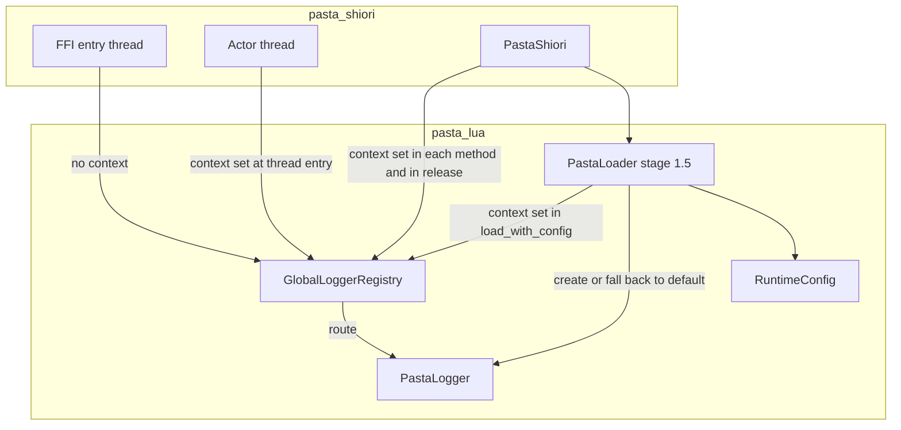
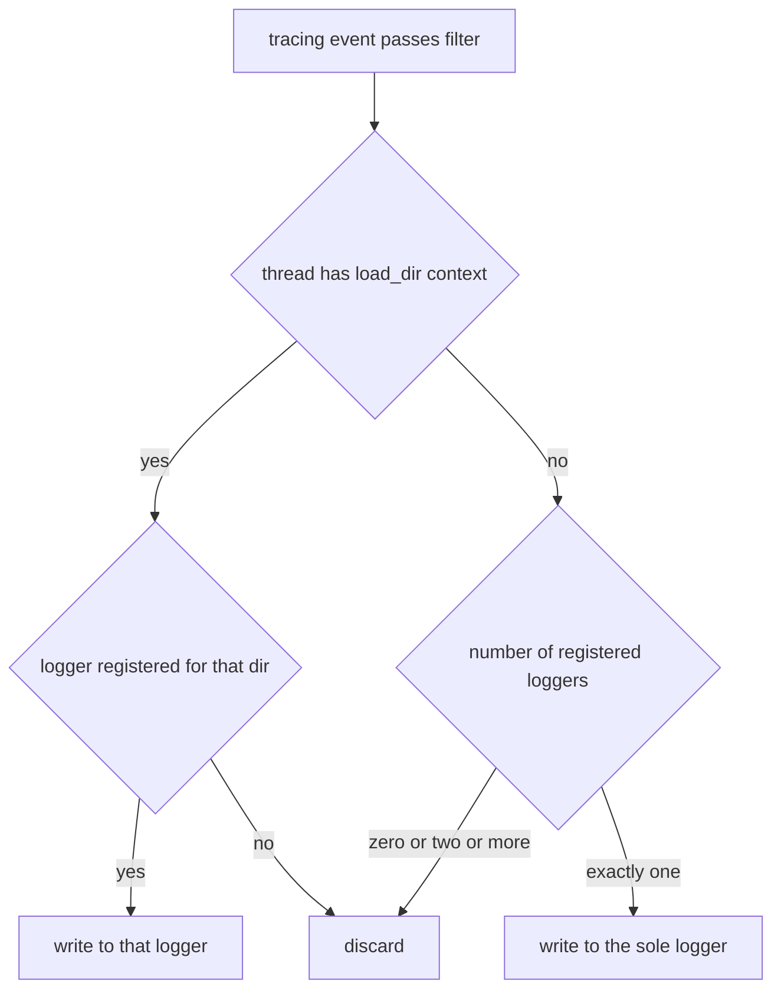
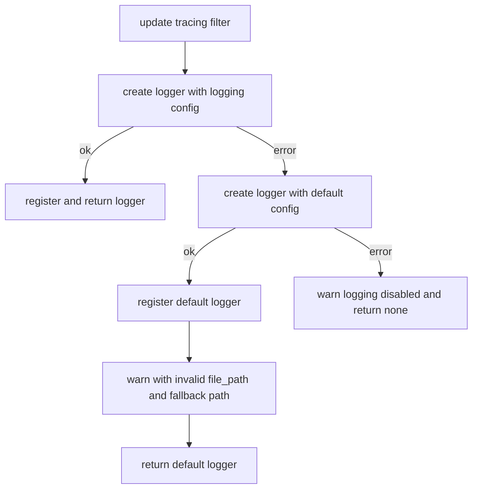

# Design Document: pasta-toml-logging-consistency

## Overview

**Purpose**: `pasta.toml` の設定キーとログ出力の挙動を、マニュアル（利用者向け設定の唯一の権威）と一致させる。

**Users**: ゴースト作者（設定を書く人）、ゴーストの障害を調査する開発者（ログを読む人）、`pasta_lua` を組み込む開発者（`RuntimeConfig` を使う人）。

**Impact**: 次の 4 点を変える。

1. 効かない設定 `[lua] libs`・`[logging] rotation_days` を、型・公開 API・サンプル・マニュアルから消す。
2. 必須の Lua 標準ライブラリを欠いた `RuntimeConfig` を、VM を作る前に名前付きの構成エラーで止める。
3. ログの振り分けを 3 か所で直し、FFI 入口スレッド・アクタースレッド・終了処理のログをゴーストのログファイルに残す。
4. 不正な `[logging] file_path` のとき、ローダ自身が既定のログファイルへ切り替えて warn を出す。判定は「最初の要素がちょうど `profile`」に厳密化する。

### Goals

- `pasta.toml` のキーが「書けば効く」か「マニュアルにもサンプルにも無い」かのどちらかになる。
- ロガーが登録されている間に pasta.dll が出したログは、スレッドと時点によらずログファイルに残る。
- 不正な `file_path` の挙動が、SHIORI 経由でも組み込みでも 1 通りになり、マニュアルと一致する。
- 上記を自動テストで固定する。

### Non-Goals

- ログの書式・既定レベル・既定のログファイルの場所の変更
- ログのローテーション
- ゴーストから Lua ライブラリ構成を変える手段
- デバッグバックエンド（DAP）のログの保証（副次的に残るようになることは許す。前提 A9）
- プロセス終了による `DLL_PROCESS_DETACH` でのログ出力（前提 A7）
- 撤去したキーが書かれているときの警告（前提 A5）

## Boundary Commitments

### This Spec Owns

- `pasta_lua` の設定型のうち `LoggingConfig`（`rotation_days` の削除）と `LuaConfig`・`PastaConfig::lua()`・`From<LuaConfig> for RuntimeConfig`（削除）
- `default_libs` の定義場所（`runtime/runtime_config.rs` へ移す）
- `RuntimeConfig` の必須ライブラリ検査と `ConfigError::MissingRequiredLibrary`
- ログの振り分け規則（`GlobalLoggerRegistry::make_writer`）と、ロガーの破棄を登録簿のロックの外で行うこと
- `PastaLogger::validate_path` の判定
- ローダ段階 1.5（`PastaLoader::create_and_register_logger`）の失敗時の挙動と warn の文言、`load_with_config` が張る振り分けの文脈
- `PastaShiori` の終了処理の順序（`Drop` と再読み込みの分岐）
- アクタースレッドの入口で張る振り分けの文脈
- サンプルゴースト hello-pasta の `pasta.toml`、マニュアル 6 章、手書きスキル `pasta-ghost-authoring/SKILL.md` の `[lua]` の行、生成スキル `references/` の再生成
- 上記を固定するテスト

### Out of Boundary

- `pasta_lua` の `pasta_scripts/`・`code_gen/`・`search/`・`debug/`（並走条件。触らない）
- `crates/pasta_shiori/src/windows.rs`（FFI 入口のコードは変えない。入口のログは振り分け規則の変更で残る）
- `actor/marshaling.rs`・`actor/teardown.rs`・`actor/lifecycle.rs`（応答・待ち時間・戻り値を変えない）
- `release/hello-pasta/`（次のリリースで再生成される）
- リリース作業・バージョン更新・CHANGELOG（`release-workflow` が担う）
- ログフィルタ（`tracing_init.rs`）の挙動

### Allowed Dependencies

- 既存の依存だけを使う（`tracing`・`tracing-subscriber`・`tracing-appender`・`mlua`・`thiserror`）。新しいクレートを足さない（pasta.dll は単一 DLL・静的 CRT）。
- 依存の向きは現状のまま: `pasta_shiori` → `pasta_lua`。`pasta_lua` の中では `loader` → `runtime` → `logging`。本設計で `runtime` → `loader` の依存（`default_libs`・`LuaConfig` の参照）が 1 本消える。
- `pasta_shiori` が使う `pasta_lua` のログ API は、既存の `GlobalLoggerRegistry`・`LoadDirGuard`・`PastaLogger`・`init_tracing_with_reload` に限る。新しい公開 API を足さない。

### Revalidation Triggers

- ログの振り分け規則の変更（文脈なしのログの扱い、文脈ありで未登録のときの扱い）
- `PastaShiori` の終了処理の順序の変更、または done ack を送る位置の変更
- `PastaLogger::validate_path` の条件の変更（`pasta_check` が配布物から外すディレクトリとの整合）
- `RuntimeConfig` の必須ライブラリ一覧の変更（`pasta_scripts` が新しい標準ライブラリを使い始めたとき）
- 段階 1・段階 1.5 の役割分担の変更

## Architecture

### Existing Architecture Analysis

- ログは、プロセスに 1 つの tracing 購読者 → `GlobalLoggerRegistry::make_writer` → `PastaLogger` の順に流れる。`make_writer` は、スレッドローカル `CURRENT_LOAD_DIR`（`LoadDirGuard` が設定する）をキーに登録簿を引き、無ければ捨てる。
- 文脈を張っているのは `PastaShiori` の `load`・`request`・`kick`・`call_lua_unload` と、FFI の `load_impl` の 1 行だけである。FFI 入口スレッドの他のログ、アクタースレッドのメッセージループのログ、`PastaShiori::drop` の後半（登録解除のログ、ランタイム破棄＝永続化保存のログ）は文脈が無いか、登録解除の後で、捨てられている。
- `PastaShiori::drop` は「`SHIORI.unload` → 登録解除 → 関数のキャッシュを捨てる → ランタイム破棄」の順で、ランタイム破棄のログが登録解除の後になる。再読み込みの分岐（`PastaShiori::load` の先頭）も同じ順である。
- SSP ではゴーストごとに別パスの pasta.dll を読み込むため、登録簿のロガーは 0 個か 1 個である。2 個以上になるのは、`cargo test` の並列実行と、`pasta_lua` を直接組み込んで複数のゴーストを読む場合である。
- 段階 1.5 は、ロガーの作成に失敗すると warn「logging disabled」を出して登録を変えない。SHIORI 経由では段階 1 の既定ロガーが残るため実際には既定ファイルへ書き続け、組み込みではロガーが無くなる。
- `validate_path` は相対パスを文字列にして `profile` で始まるかを見るため、`profile.log`・`profiles/x.log` が通る。
- `[lua]` の型 `LuaConfig` と `PastaConfig::lua()`・`From<LuaConfig>` は、テスト以外から呼ばれていない。`rotation_days` はどこからも読まれない。
- `package` を欠く構成では、`search::register` が `package` 表を取れず、nil→table の変換エラーで VM の構築が失敗する。`package` は `@pasta_log` の登録・`package.path` の設定・searcher でも無条件に要る。`math` は無くても VM を作れる（乱数の種の設定は `math` があるときだけ行う。既存テスト `test_runtime_without_math_library_still_builds` が固定している）。

### Architecture Pattern & Boundary Map



**Architecture Integration**:

- **選んだ方式（D3）**: research.md 4.1 の案 C。振り分け規則に「文脈が無く、登録が 1 つならそれへ書く」を足し（案 B）、設置パスを知っているスレッド（アクタースレッド・ローダ）は自分で文脈を張る。
- **責務の分担**: 「どのロガーへ書くか」は `logging/registry.rs` の 1 か所で決める。呼び出し側は、設置パスを知っているときだけ `LoadDirGuard` を張る。FFI 入口は設置パスを持たないので何もしない。
- **保つ既存の型**: スレッドローカルの文脈と `LoadDirGuard`（入れ子可）、段階 1・段階 1.5 の 2 段階、`ArcSwapOption` による lock-free の送信パス。
- **新しい部品**: なし。関数 2 つ（`GlobalLoggerRegistry::resolve`・`RuntimeConfig::ensure_libs`）とエラーの種類 1 つ（`ConfigError::MissingRequiredLibrary`）、`PastaShiori` の private メソッド 1 つ（`release_runtime`）を足すだけである。
- **Steering との整合**: 根本原因を共有の 1 か所で直す。推測に基づく抽象を足さない。設定の誤りは黙って補わずに明示的に止める（必須ライブラリ）。ただしログの出力先だけは、ログを失わないことを優先してフォールバックする（前提 A4・A8）。

### 設計の決定

| ID | 決定 | 理由 |
| -- | ---- | ---- |
| D1 | `default_libs` を `runtime/runtime_config.rs` へ移す。公開パス `pasta_lua::default_libs`・`pasta_lua::loader::default_libs` は再エクスポートで両方保つ | 使うのは `RuntimeConfig::new` だけで、`sections.rs` に残すと「設定セクションの型」でない関数が孤立する。公開パスを保てば、API の破壊は `[lua]` を読む 3 点に限られる |
| D2 | 必須ライブラリは 2 段。VM の構築（`with_config` 系のすべて）は `std_package`。ローダ経由（`from_loader`・`from_loader_with_scene_dic`）は `std_package`・`std_string`・`std_table`・`std_math`・`std_os`。欠けていれば `ConfigError::MissingRequiredLibrary` | `package` は Rust 側のモジュール登録が無条件に要る。`string`・`table`・`math`・`os` は `pasta_scripts` が使い（`os.time` は毎秒の OnSecondChange で呼ばれる）、欠けると起動後のリクエストで原因の遠い Lua エラーになる。`math` を VM の構築の必須にしないのは、`math` 無しで VM を作れる現行の挙動を保つため |
| D3 | 振り分けは案 C（文脈なし→唯一のロガー、アクタースレッドとローダは文脈を張る）。`PastaShiori` の終了処理は「文脈を張る → `SHIORI.unload` → 関数のキャッシュを捨てる → ランタイム破棄 → 登録解除のログ → 登録解除」 | 変更が `registry.rs` の 1 か所で済み、今後入口が増えても漏れない。設置パスを知るスレッドは文脈を張るので、複数ロガーのときも正しく届く。E2E テストは「1 テストバイナリに `#[test]` を 1 本」で登録簿を 1 個に保つ（Testing Strategy） |

### Technology Stack

| Layer | Choice / Version | Role in Feature | Notes |
|-------|------------------|-----------------|-------|
| Backend / Services | Rust 2024・`pasta_lua`・`pasta_shiori` | 設定型・ロガー・振り分け・終了処理 | 新しい依存なし |
| Data / Storage | `tracing-appender`（`Rotation::NEVER`・non_blocking） | ログファイルへの追記 | 変更なし（2.5） |
| Infrastructure / Runtime | `tracing-subscriber`（`MakeWriter`） | イベントごとの出力先の決定 | `make_writer` の規則だけを変える |
| Docs | mdBook・`book/tools/gen-skill-refs.mjs` | マニュアルの更新とスキル `references/` の再生成 | `--check` で差分検査 |

## File Structure Plan

### Modified Files

**設定（pasta_lua）**

- `crates/pasta_lua/src/loader/config/sections.rs` — `LoggingConfig::rotation_days`・`default_rotation_days`・`LuaConfig`・`default_libs` を削除。モジュール doc の `lua()` への言及を削除。
- `crates/pasta_lua/src/loader/config/mod.rs` — `PastaConfig::lua()` を削除。
- `crates/pasta_lua/src/loader/mod.rs` — 再エクスポートから `LuaConfig` を外す。`default_libs` は `crate::runtime::default_libs` の再エクスポートに変える。段階 1.5 のフォールバックと warn。`load_with_config` の先頭で `LoadDirGuard` を張る。
- `crates/pasta_lua/src/lib.rs` — 再エクスポートから `LuaConfig` を外す。`default_libs` は `runtime` から再エクスポートする。
- `crates/pasta_lua/src/runtime/runtime_config.rs` — `default_libs` の定義を置く。`From<LuaConfig>` を削除。`ensure_libs` と必須ライブラリの定数を足す。`libs`・`from_libs` の doc に必須ライブラリを書く。
- `crates/pasta_lua/src/runtime/mod.rs` — `pub use runtime_config::default_libs`。`with_config_and_source_map` で VM を作る前に `ensure_libs` を呼ぶ。
- `crates/pasta_lua/src/runtime/factory.rs` — `from_loader`・`from_loader_with_scene_dic` の先頭で、ローダ経由の必須ライブラリを検査する。
- `crates/pasta_lua/src/error.rs` — `ConfigError::MissingRequiredLibrary` を足す。

**ロガー（pasta_lua）**

- `crates/pasta_lua/src/logging/registry.rs` — `resolve` を足し、`make_writer` から呼ぶ。`register`・`unregister` で、外したロガーをロックの外で破棄する。モジュール doc を新しい規則に合わせる。
- `crates/pasta_lua/src/logging/logger.rs` — `validate_path` の判定を厳密にする。テストの `rotation_days: 7`（4 か所）を消す。

**SHIORI（pasta_shiori）**

- `crates/pasta_shiori/src/shiori.rs` — `release_runtime` を足し、`Drop` と再読み込みの分岐から呼ぶ。
- `crates/pasta_shiori/src/actor/thread.rs` — アクタースレッドの入口で `LoadDirGuard` を 1 つ張る。

**サンプル・マニュアル・スキル**

- `crates/pasta_sample_ghost/ghosts/hello-pasta/ghost/master/pasta.toml` — `rotation_days = 7` の行を消す。
- `book/src/reference/pasta-toml.md` — `[lua]` の一覧の行・テンプレートのコメント・節を消す。`[logging]` の `file_path` の説明を直す。
- `book/src/reference/startup.md` — `file_path` の条件と、不正なときの挙動を直す。
- `book/src/lua/modules/mlua-stdlib.md` — ゴーストから Lua ライブラリの構成を変える手段が無いことを 1 文で示す（`@env` の節の既存の記述を、標準ライブラリの節にも及ぶ形に整える）。
- `book/src/internals/logging-encoding.md` — `rotation_days` を消す。振り分け規則・段階 1.5 の失敗時・`validate_path`・ログが届く条件と捨てられる条件を書き直す。
- `book/src/internals/shiori.md` — `PastaShiori` の `Drop` の順序、`request`・`unload`・`DllMain` detach・終了処理のログの扱いを書き直す。
- `book/src/internals/loader.md` — `LuaConfig` への言及を消す。段階 1.5 の失敗時の説明を直す。
- `.claude/skills/pasta-ghost-authoring/SKILL.md` — `[lua]` の行を消す（手書き部分）。
- `.claude/skills/pasta-ghost-authoring/references/`・`.claude/skills/pasta-lua-coding/references/` — `node book/tools/gen-skill-refs.mjs` で再生成する（手で編集しない）。

**テスト**

- `crates/pasta_lua/tests/loader/config_test.rs` — `rotation_days` と `LuaConfig` のテストを消す。`[lua] libs` と `rotation_days` を書いた `pasta.toml` が読み込めるテストを足す。
- `crates/pasta_lua/tests/loader/config_sections_test.rs` — 型不一致のテストのキーを `rotation_days = "fourteen"` から `level = 1` に替える。
- `crates/pasta_lua/tests/runtime/unit_test.rs` — `From<LuaConfig>` のテストを消す。
- `crates/pasta_lua/tests/runtime/runtime_api_test.rs` — 必須ライブラリを欠いた構成のテストを足す。
- `crates/pasta_lua/tests/common/mod.rs`・`crates/pasta_shiori/tests/common/mod.rs` — 環境変数を中和する `#[ctor]` に `PASTA_LOG` を足す（開発機の設定でフィルタが変わらないようにする）。

### New Files

- `crates/pasta_lua/tests/logging_file_path_fallback_test.rs` — 組み込み経路（`PastaLoader` を直接使う）で、不正な `file_path` のフォールバックを検証する専用バイナリ（`#[test]` は 1 本）。
- `crates/pasta_shiori/tests/ffi_logging_test.rs` — FFI 入口から `loadu`・`load`・`request`・`unload` を通し、ログファイルの中身を検証する専用バイナリ（`#[test]` は 1 本）。

## System Flows

### ログ 1 件の出力先の決定



- 文脈があるのに未登録のときは、他のロガーへ流さない。別のゴーストのログファイルに書かないためである（4.6）。
- 文脈が無いのは FFI 入口スレッドと、デバッグバックエンドのスレッドである。pasta.dll では登録が 0 個か 1 個なので、ロガーが登録されている間のログはすべて残る。

### 終了処理（`unload`・`FreeLibrary` による detach）

```mermaid
sequenceDiagram
    participant Ffi as FFI entry thread
    participant Actor as Actor thread
    participant Reg as GlobalLoggerRegistry
    participant Log as PastaLogger
    Ffi->>Actor: Stop with done channel
    Note over Actor: leave message loop
    Actor->>Actor: SHIORI.unload
    Actor->>Actor: drop cached functions
    Actor->>Actor: drop runtime and save persistence
    Actor->>Log: log Unregistering logger
    Actor->>Reg: unregister
    Reg->>Log: last reference dropped then flush and close
    Actor->>Ffi: done ack
    Note over Ffi: logs after this point are discarded
```

- ロガーの登録解除は終了処理の最後である。それまでに出したログ（`SHIORI.unload` の結果、永続化保存の失敗、登録解除の通知）は、ファイルを閉じる前に書かれる（4.3）。
- done ack を送る位置は変えない。ack の時点で VM・DAP バックエンド・ログファイルの解放が済んでいる、という不変条件は保たれる。
- 待ち時間切れ（Timeout）のとき、アクターはまだ終了処理の途中で、ロガーは登録されたままである。FFI 入口スレッドの warn は「文脈なし→唯一のロガー」でログファイルに届く（4.4）。切断（Disconnected）は unwind プロファイルの panic でしか起きず、そのときロガーが既に登録解除されていれば warn は捨てる（前提 A6）。
- ack の後のログ（アクタースレッドの `actor.done`、FFI 入口の「done ack received」）は、ロガーが 1 つも登録されていないので捨てる（4.7）。

### 段階 1.5（ロガーの作成と登録）



- warn は既定のロガーを登録した後に出す。SHIORI 経由でも組み込みでも、warn は既定のログファイルに書かれる（5.2）。
- フィルタの更新は最初に行うので、`level`・`filter` は `file_path` の成否によらず反映される（5.3。現行どおり）。

## Requirements Traceability

| Requirement | Summary | Components | Interfaces | Flows |
|-------------|---------|------------|------------|-------|
| 1.1 | `reference/pasta-toml.md` から `[lua]` を消す | ManualAndSkills | — | — |
| 1.2 | Lua ライブラリの説明は `mlua-stdlib.md` だけ | ManualAndSkills | — | — |
| 1.3 | `[lua]` が書かれていても読み込める | ConfigSections | `PastaConfig`（`custom_fields`） | — |
| 1.4 | `[lua]` を読む公開 API を提供しない | ConfigSections・RuntimeConfigLibs | `LuaConfig`・`PastaConfig::lua()`・`From<LuaConfig>` の削除 | — |
| 1.5 | `from_libs`・`default_libs` は残す | RuntimeConfigLibs | `RuntimeConfig::from_libs`・`default_libs` | — |
| 2.1 | マニュアルから `rotation_days` を消す | ManualAndSkills | — | — |
| 2.2 | サンプルから `rotation_days` を消す | ManualAndSkills | hello-pasta `pasta.toml` | — |
| 2.3 | `rotation_days` が書かれていても他のキーが効く | ConfigSections | `LoggingConfig` | — |
| 2.4 | `LoggingConfig` に `rotation_days` を持たない | ConfigSections | `LoggingConfig` | — |
| 2.5 | 1 ファイルに追記し続ける | LogFilePathValidation | `PastaLogger::new`（変更なし） | — |
| 3.1 | 必須ライブラリが欠けたら名前付きの構成エラー | RuntimeConfigLibs | `ensure_libs`・`ConfigError::MissingRequiredLibrary` | — |
| 3.2 | 既定・最小・全機能の構成は従来どおり | RuntimeConfigLibs | `RuntimeConfig::new`・`minimal`・`full` | — |
| 3.3 | Rust API ドキュメントに必須を書く | RuntimeConfigLibs | `libs`・`from_libs` の rustdoc | — |
| 4.1 | `request` 入口のログが残る | LogRouting | `GlobalLoggerRegistry::resolve` | ログ 1 件の出力先の決定 |
| 4.2 | アクタースレッドのログが残る | ActorLogContext | `LoadDirGuard` | ログ 1 件の出力先の決定 |
| 4.3 | 終了処理のログが、ファイルを閉じる前に残る | ShioriRelease | `PastaShiori::release_runtime` | 終了処理 |
| 4.4 | teardown の異常の warn が残る | LogRouting・ShioriRelease | `resolve` | 終了処理 |
| 4.5 | `loadu` 済みで無視した `load` の warn が残る | LogRouting | `resolve` | ログ 1 件の出力先の決定 |
| 4.6 | 複数ロガーのとき別のゴーストへ書かない | LogRouting | `resolve` | ログ 1 件の出力先の決定 |
| 4.7 | ロガーが無いときは捨てる | LogRouting | `resolve`・`RoutingWriter` | ログ 1 件の出力先の決定 |
| 4.8 | 応答・待ち時間・戻り値を変えない | LogRouting・ShioriRelease | `windows.rs`・`marshaling.rs`・`teardown.rs` を変えない | 終了処理 |
| 5.1 | 不正な `file_path` で既定ファイルへ書く | LoggerStage15 | `create_and_register_logger` | 段階 1.5 |
| 5.2 | 値とフォールバックを示す warn | LoggerStage15 | warn の文言 | 段階 1.5 |
| 5.3 | `level`・`filter` は反映する | LoggerStage15 | `update_tracing_filter`（順序を保つ） | 段階 1.5 |
| 5.4 | 直して再読み込みすると新しいファイルへ | LoggerStage15・ShioriRelease | 段階 1・段階 1.5 | 段階 1.5 |
| 5.5 | `profile.log`・`profiles/x.log` は不正 | LogFilePathValidation | `PastaLogger::validate_path` | — |
| 6.1 | `pasta-toml.md`・`startup.md` の `file_path` の説明 | ManualAndSkills | — | — |
| 6.2 | `logging-encoding.md` の振り分けとフォールバック | ManualAndSkills | — | — |
| 6.3 | `shiori.md` の入口・終了処理のログ | ManualAndSkills | — | — |
| 6.4 | 内部設計の章から `LuaConfig`・`rotation_days` を消す | ManualAndSkills | — | — |
| 6.5 | スキル `references/` の再生成と差分検査 | ManualAndSkills | `gen-skill-refs.mjs` | — |
| 6.6 | 効かないキーをどこにも載せない | ManualAndSkills | — | — |
| 7.1 | 撤去したキーを書いても読み込めるテスト | TestSuite | `config_test.rs` | — |
| 7.2 | 必須ライブラリ欠落のテスト | TestSuite | `runtime_api_test.rs` | — |
| 7.3 | FFI 経由のログが残るテスト | TestSuite | `ffi_logging_test.rs` | — |
| 7.4 | 不正な `file_path` のテスト（SHIORI・組み込み） | TestSuite | `ffi_logging_test.rs`・`logging_file_path_fallback_test.rs` | — |
| 7.5 | ロガー無しのログを捨てるテスト | TestSuite | `registry.rs` の単体テスト・`ffi_logging_test.rs` | — |

## Components and Interfaces

| Component | Domain/Layer | Intent | Req Coverage | Key Dependencies (P0/P1) | Contracts |
|-----------|--------------|--------|--------------|--------------------------|-----------|
| ConfigSections | pasta_lua / loader | `rotation_days` と `[lua]` の型・アクセサを消す | 1.3, 1.4, 2.3, 2.4 | serde（P0） | State |
| RuntimeConfigLibs | pasta_lua / runtime | `default_libs` の置き場所と必須ライブラリの検査 | 1.4, 1.5, 3.1, 3.2, 3.3 | mlua `StdLib`（P0） | Service |
| LogRouting | pasta_lua / logging | ログ 1 件の出力先を決める | 4.1, 4.4, 4.5, 4.6, 4.7, 4.8 | `PastaLogger`（P0） | Service, State |
| LogFilePathValidation | pasta_lua / logging | `file_path` の判定 | 2.5, 5.5 | — | Service |
| LoggerStage15 | pasta_lua / loader | ロガーの作成・フォールバック・登録・warn | 5.1, 5.2, 5.3, 5.4 | LogRouting（P0）、LogFilePathValidation（P0） | Service |
| ShioriRelease | pasta_shiori | 終了処理と再読み込みの順序 | 4.3, 4.4, 4.8, 5.4 | LogRouting（P0）、`PastaLuaRuntime` の `Drop`（P0） | State |
| ActorLogContext | pasta_shiori / actor | アクタースレッドの文脈 | 4.2 | LogRouting（P0） | State |
| ManualAndSkills | docs | マニュアル・サンプル・スキルを挙動に合わせる | 1.1, 1.2, 2.1, 2.2, 6.1–6.6 | `gen-skill-refs.mjs`（P0） | Batch |
| TestSuite | tests | 回帰の固定 | 7.1–7.5 | 上のすべて | — |

### pasta_lua / loader

#### ConfigSections

| Field | Detail |
|-------|--------|
| Intent | 効かない設定の型とアクセサを消す |
| Requirements | 1.3, 1.4, 2.3, 2.4 |

**Responsibilities & Constraints**

- `LoggingConfig` のフィールドは `file_path`・`level`・`filter` の 3 つにする。
- `LuaConfig`・`PastaConfig::lua()` を消す。`[lua]` セクションは他の未知のセクションと同じく `custom_fields` に残り、`@pasta_config` から読める（Lua 側への露出は変えない）。
- `deny_unknown_fields` を付けない。`rotation_days`・`[lua]` が書かれていても、エラーにも警告にもしない（1.3、2.3、前提 A5）。

**Contracts**: State [x]

```rust
#[derive(Debug, Clone, Deserialize)]
pub struct LoggingConfig {
    #[serde(default = "default_log_file_path")]
    pub file_path: String,
    #[serde(default = "default_log_level")]
    pub level: String,
    #[serde(default)]
    pub filter: Option<String>,
}
```

**Implementation Notes**

- 型不一致で `logging()` が `None` になることを見る既存テストは、`rotation_days` が未知のキーになると意味を失う。キーを `level = 1` に替える。
- `LoggingConfig { .. }` をフィールド列挙で作っているテスト（`logger.rs` の 4 か所、`config_test.rs`）から `rotation_days` を消す。

#### LoggerStage15

| Field | Detail |
|-------|--------|
| Intent | `[logging]` に従ってロガーを作り、作れなければ既定のログファイルへ切り替える |
| Requirements | 5.1, 5.2, 5.3, 5.4 |

**Responsibilities & Constraints**

- `PastaLoader::load_with_config` は、設置ディレクトリの存在を確かめた直後に `LoadDirGuard::new(base_dir)` を張り、関数を抜けるまで保つ。組み込みで複数のゴーストを読んでも、ローダのログは自分のロガーへ届く。SHIORI 経由では `PastaShiori::load` が同じ値で張っているので、入れ子になるだけで挙動は変わらない。
- `create_and_register_logger` の流れは「段階 1.5」の図のとおり。失敗の理由（判定で不正・ディレクトリを作れないなど）を区別せず、設定どおりのロガーを作れなければ既定の設定で作り直す。
- 既定のロガーも作れないときだけ、warn「logging disabled」を出して `Ok(None)` を返す（起動は続ける）。
- 戻り値のロガー（設定どおり、または既定）は、従来どおり `PastaLuaRuntime` が `Arc` で保持する。

**Contracts**: Service [x]

```rust
fn create_and_register_logger(
    base_dir: &Path,
    config: &PastaConfig,
) -> Result<Option<Arc<PastaLogger>>, LoaderError>;
```

- Preconditions: `base_dir` は存在する。
- Postconditions:
  - 設定どおりに作れた: 登録簿の `base_dir` はそのロガー。info「Created instance logger」。
  - 作れず、既定で作れた: 登録簿の `base_dir` は既定のロガー。次の warn を 1 件出す。
  - どちらも作れない: 登録簿を変えない。warn「Failed to create instance logger, logging disabled」。
- Invariants: フィルタの更新はロガーの作成より前に行う。

フォールバックの warn（文言は経路によらず 1 通り）:

```rust
warn!(
    file_path = %logging_config.file_path,   // 不正と判断した値
    fallback = %default_log_file_path(),     // "profile/pasta/logs/pasta.log"
    error = %e,
    "Cannot use [logging] file_path; logging to the default log file instead"
);
```

**Implementation Notes**

- Integration: SHIORI 経由では、段階 1 の既定ロガーを同じパスの新しい既定ロガーで置き換える。正常時に設定どおりのロガーで置き換えるのと同じ流れである（前提 A8）。古いロガーは置き換えの時点で破棄されてフラッシュされるので、行の順序は保たれる。
- Validation: `logging_file_path_fallback_test.rs`（組み込み）と `ffi_logging_test.rs`（SHIORI）。
- Risks: 既定のロガーを 2 回作る（段階 1 と段階 1.5）。同じファイルへの追記で、古い方は置き換えで閉じるため害は無い。

### pasta_lua / runtime

#### RuntimeConfigLibs

| Field | Detail |
|-------|--------|
| Intent | `default_libs` を持ち、必須ライブラリを欠いた構成を VM の構築前に止める |
| Requirements | 1.4, 1.5, 3.1, 3.2, 3.3 |

**Responsibilities & Constraints**

- `default_libs()` を `runtime_config.rs` に定義する。内容は変えない（`["std_all", "assertions", "testing", "regex", "json", "yaml"]`）。
- `From<LuaConfig> for RuntimeConfig` を消す。
- `to_stdlib()` は「名前の一覧を `StdLib` のフラグへ変換する」純粋な関数のまま変えない（空の一覧は `StdLib::NONE` を返す。既存のテストと doc テストを保つ）。
- 必須ライブラリの検査は `ensure_libs` に置き、VM を作る 2 つの入口から呼ぶ。

| 入口 | 必須 | 理由 |
| ---- | ---- | ---- |
| `PastaLuaRuntime::with_config_and_source_map`（`new`・`with_config`・`from_loader*` のすべてが通る） | `std_package` | `@pasta_search`・`@pasta_log` の登録、`package.path` の設定、searcher が `package` 表を無条件に使う |
| `PastaLuaRuntime::from_loader`・`from_loader_with_scene_dic` | `std_package`・`std_string`・`std_table`・`std_math`・`std_os` | `pasta_scripts`（フレームワークスクリプト）が使う。`os.time` は CALLBACK の期限と毎秒の掃除で、`math` はトーク間隔の抽選とウェイトの計算で使う |

- `coroutine` は LuaJIT では基本ライブラリに含まれ、常に使える（`std_coroutine` は `StdLib::NONE` に対応する）。`io`・`bit`・`jit`・`ffi`・`debug` は `pasta_scripts` の動作に要らない（`jit` は版の判定で、有るときだけ使う）。
- `std_all`・`std_all_unsafe` は必須をすべて含む。`"-std_package"` のように引き算で外した場合も欠落として検出する（判定は `to_stdlib()` の結果のフラグで行う）。

**Contracts**: Service [x]

```rust
// runtime_config.rs
pub fn default_libs() -> Vec<String>;

/// VM の構築に必須（Rust 側のモジュール登録が使う）。
const REQUIRED_LIBS: &[&str] = &["std_package"];
/// ローダ経由（pasta_scripts を読み込む）で必須。
const LOADER_REQUIRED_LIBS: &[&str] =
    &["std_package", "std_string", "std_table", "std_math", "std_os"];

impl RuntimeConfig {
    /// `required` のうち、この構成が含まないライブラリがあれば
    /// `ConfigError::MissingRequiredLibrary` を返す。
    pub(crate) fn ensure_libs(&self, required: &[&str]) -> Result<(), ConfigError>;
}

// error.rs
pub enum ConfigError {
    UnknownLibrary(String),
    /// 欠けているライブラリ名を ", " でつないだ文字列を持つ。
    #[error("Missing required library: {0}. pasta cannot run without it; add it to libs (std_all includes it)")]
    MissingRequiredLibrary(String),
}
```

- Preconditions: なし（未知の名前は従来どおり `UnknownLibrary`）。
- Postconditions: エラーのとき VM を作らない（`Lua::unsafe_new_with` より前に返す）。エラーの文字列は欠けているライブラリ名をすべて含む。
- Invariants: `RuntimeConfig::new`・`minimal`・`full` は検査を通る。`from_libs(["std_all", "-std_math"])` は `with_config` では通り、ローダ経由では `std_math` の欠落で止まる。

**Implementation Notes**

- Integration: エラーは既存の `UnknownLibrary` と同じ経路で運ぶ（`mlua::Error::ExternalError(Arc<ConfigError>)`。ローダ経由では `LoaderError::Runtime`）。`search/` は触らない。
- Validation: `runtime_api_test.rs` に、`from_libs(["std_string"])` と `["std_all", "-std_package"]` が `std_package` を含むエラーになること、ローダ経由で `["std_package"]` が `std_string` などを含むエラーになることを足す。
- Risks: ローダ経由の一覧は `pasta_scripts` の実装に追随させる必要がある（Revalidation Triggers）。一覧はコード読解（`pasta_scripts` の全ファイルの検索）で決めており、構成を 1 つずつ外した実行での確認は実装タスクで行う。

### pasta_lua / logging

#### LogRouting

| Field | Detail |
|-------|--------|
| Intent | ログ 1 件を、どのロガーへ書くか（または捨てるか）を決める |
| Requirements | 4.1, 4.4, 4.5, 4.6, 4.7, 4.8 |

**Responsibilities & Constraints**

- 規則は次の 3 行である。
  1. スレッドに文脈（設置パス）がある → その設置パスのロガーへ書く。未登録なら捨てる。
  2. 文脈が無く、登録されたロガーがちょうど 1 つ → そのロガーへ書く。
  3. それ以外（0 個、または 2 個以上）→ 捨てる。
- 捨てるときは、書いたバイト数を返して成功にする（エラーも panic も起こさない。4.7）。
- 登録簿のミューテックスを持つのは、表を引いて `Arc` を複製する間だけである。ロガーの破棄（フラッシュとワーカースレッドの終了待ち）は、ロックを放してから行う。`register` が置き換えた古いロガーと、`unregister` が外したロガーの両方に当てはめる。

**Dependencies**

- Inbound: tracing の fmt レイヤ — イベントごとに `make_writer` を呼ぶ（P0）
- Inbound: `PastaShiori`・`PastaLoader`・アクタースレッド — `LoadDirGuard` で文脈を張る（P0）
- Outbound: `PastaLogger::write`・`flush`（P0）

**Contracts**: Service [x] / State [x]

```rust
impl GlobalLoggerRegistry {
    /// 文脈（スレッドの設置パス）から、書き込み先のロガーを決める。
    /// `context` が `Some` → その設置パスのロガー（未登録なら `None`）。
    /// `context` が `None` → 登録がちょうど 1 つならそのロガー、それ以外は `None`。
    fn resolve(&self, context: Option<&Path>) -> Option<Arc<PastaLogger>>;
}

impl<'a> MakeWriter<'a> for GlobalLoggerRegistry {
    type Writer = RoutingWriter;
    /// `CURRENT_LOAD_DIR` を読み、`resolve` の結果で `RoutingWriter` を作る。
    fn make_writer(&'a self) -> RoutingWriter;
}
```

- Preconditions: なし（購読者が未設置なら、そもそも呼ばれない）。
- Postconditions: 別の設置パスの文脈を持つスレッドのログを、他のロガーへ書かない。
- Invariants: ミューテックスの poison は従来どおり `into_inner` で回復する。公開 API（`register`・`unregister`・`get`・`LoadDirGuard`）のシグネチャを変えない。

##### State Management

- State model: `Mutex<HashMap<PathBuf, Arc<PastaLogger>>>`（変更なし）と、スレッドローカルの `CURRENT_LOAD_DIR`（変更なし）。
- Concurrency strategy: FFI 入口スレッドは、ログのイベントがフィルタを通ったときだけ登録簿のミューテックスを短時間取る。mailbox の送信パス（`MAILBOX.load_full` → `try_send`）には触れない。

**Implementation Notes**

- Integration: `windows.rs`・`marshaling.rs`・`teardown.rs`・`lifecycle.rs` は変えない。これらのログは規則 2 で届く。`load_impl` が入口ログのために張っているガードはそのまま残す。
- Validation: `resolve` は private な `GlobalLoggerRegistry::new()` で作った登録簿に対して単体テストする（プロセス全域の登録簿を使わないので、並列実行に左右されない）。
- Risks: 規則 2 により、デバッグバックエンドのスレッドのログも残るようになる（前提 A9 が許す）。ログレベルを `debug`・`trace` にしたゴーストでは、FFI 入口スレッドが観測ログのたびにミューテックスを取る（既定の `info` では、FFI 入口スレッドは正常時にログを出さない）。

#### LogFilePathValidation

| Field | Detail |
|-------|--------|
| Intent | `file_path` が `profile/` ディレクトリの下を指すかを判定する |
| Requirements | 2.5, 5.5 |

**Responsibilities & Constraints**

- 判定の条件は次のすべてである。
  1. `base_dir.join(file_path)` が `base_dir` の下にある（絶対パスはここで外れる。現行どおり）。
  2. `base_dir` からの相対パスの最初の要素が、ちょうど `profile` である（`Path::components` の最初の要素を比べる。大文字小文字を区別する）。
  3. `profile` の後に 1 つ以上の要素が続く（`file_path = "profile"` は不正）。
  4. 相対パスが `..` を含まない（現行の文字列での検査をそのまま保つ）。
- 満たさなければ、従来どおり `io::ErrorKind::PermissionDenied` を返す。
- ファイルの開き方（`Rotation::NEVER`・追記）は変えない（2.5）。

**Contracts**: Service [x]

```rust
fn validate_path(base_dir: &Path, log_path: &Path) -> io::Result<()>;
```

| `file_path` | 判定 |
| ----------- | ---- |
| `profile/pasta/logs/pasta.log`・`profile/x.log`・`profile\x.log` | 正しい |
| `profile.log`・`profiles/x.log`・`profile` | 不正 |
| `../x.log`・`profile/../x.log`・`C:/x.log`・`logs/x.log` | 不正 |

### pasta_shiori

#### ShioriRelease

| Field | Detail |
|-------|--------|
| Intent | ランタイムを手放すときのログを、ログファイルを閉じる前に残す |
| Requirements | 4.3, 4.4, 4.8, 5.4 |

**Responsibilities & Constraints**

- ランタイムを手放す処理を private メソッド `release_runtime` の 1 か所にまとめ、`Drop` と、再読み込みの分岐（`PastaShiori::load` の先頭）の両方から呼ぶ。
- `release_runtime` の順序:
  1. 設置パスがあれば `LoadDirGuard` を張る（メソッドを抜けるまで保つ）。
  2. キャッシュした Lua 関数を捨てる。
  3. ランタイムを破棄する（永続化データの保存と、DAP バックエンドの片付けがここで走る。失敗のログはまだ登録されているロガーへ届く）。
  4. info「Unregistering logger」を出す。
  5. ロガーの登録を外す（最後の参照が落ち、フラッシュしてファイルを閉じる）。
- `Drop` は「`call_lua_unload()` → `release_runtime()`」。再読み込みの分岐は「info『Releasing existing runtime for reload』 → `release_runtime()` → `last_load_error` を消す」。
- 再読み込みの分岐で `SHIORI.unload` を呼ばない現行の挙動は変えない。

**Contracts**: State [x]

```rust
impl PastaShiori {
    /// ランタイムを破棄し、その後でロガーの登録を外す。
    /// ランタイムもロガーも無いときは何もしない。
    fn release_runtime(&mut self);
}
```

- Postconditions: `runtime`・`load_fn`・`request_fn`・`unload_fn` は `None`。登録簿に、この設置パスのロガーは無い。
- Invariants: done ack は `drop(shiori)` と `drop(rx)` の後に送る（`actor/thread.rs` の順序を変えない）。`unload` の戻り値・待ち時間の上限（5 秒）・応答の内容を変えない（4.8）。

**Implementation Notes**

- Integration: 段階 1 は、再読み込みのときも新しい既定ロガーを登録し直す。`file_path` を直して再読み込みすれば、段階 1.5 が直したパスのロガーに置き換える（5.4）。
- Validation: `ffi_logging_test.rs` で、`unload` の後のログファイルに「Unregistering logger」と永続化保存のログがあることを見る。既存の `shiori_lifecycle_test.rs`・`actor_teardown_test.rs`・`actor_reload_leak_test.rs` が順序の変更による回帰を見る。
- Risks: 順序を入れ替えるのは「登録解除」と「ランタイム破棄」だけで、VM・DAP バックエンドの解放が ack より前に済む不変条件は変わらない。

#### ActorLogContext

| Field | Detail |
|-------|--------|
| Intent | アクタースレッドのログを、自分のゴーストのロガーへ届ける |
| Requirements | 4.2 |

**Responsibilities & Constraints**

- `spawn_actor_thread` のスレッド本体の先頭（`PastaShiori::default()` の前）で `LoadDirGuard::new(load_dir.clone())` を張り、スレッドの終わりまで保つ。
- これで、メッセージループの観測ログ（`actor.spawn`・`actor.recv`・`actor.reply`・`actor.stop`）が、ロガーの数によらず自分のロガーへ届く。`PastaShiori` の各メソッドが張るガードは入れ子になり、抜けるとスレッドの文脈へ戻る。
- `actor.done`（ack を送った後）は、ロガーの登録解除の後なので捨てられる（4.7）。

**Contracts**: State [x]

### docs

#### ManualAndSkills

| Field | Detail |
|-------|--------|
| Intent | マニュアル・サンプル・スキルを本仕様の挙動に合わせる |
| Requirements | 1.1, 1.2, 2.1, 2.2, 6.1, 6.2, 6.3, 6.4, 6.5, 6.6 |

**Contracts**: Batch [x]

##### Batch / Job Contract

- Trigger: マニュアルの章を更新したとき。
- Input: `book/src/` の章。
- Output: `node book/tools/gen-skill-refs.mjs` が `.claude/skills/pasta-ghost-authoring/references/`・`.claude/skills/pasta-lua-coding/references/` を書き換える。
- Idempotency & recovery: `node book/tools/gen-skill-refs.mjs --check` が差分なしで通ること（改行は LF に正規化して比べる）。

章ごとの変更:

| 章 | 変更 |
| -- | ---- |
| `reference/pasta-toml.md` | セクション一覧の `[lua]` の行、テンプレートの `[lua]` のコメント、`[lua]` の節を消す。`[logging]` の `file_path` の説明を「`profile/` ディレクトリの下の相対パスだけ。条件を満たさないときは既定のログファイル `profile/pasta/logs/pasta.log` へ書き、warn を出す。起動は続き、`level`・`filter` は反映される」に直す |
| `reference/startup.md` | `file_path` の条件を「`profile/` ディレクトリの下」に直し、不正なときは「既定のログファイルへ書き、warn が残る」に直す |
| `lua/modules/mlua-stdlib.md` | ゴーストから Lua 標準ライブラリ・mlua-stdlib のモジュールの構成を変える手段が無いことを示す |
| `internals/logging-encoding.md` | `rotation_days` を消す。振り分けの規則（3 行）、文脈を張る箇所（`PastaShiori` の各メソッドと `release_runtime`・アクタースレッドの入口・`load_with_config`・`load_impl`）、どのログが残りどのログが捨てられるか、段階 1.5 のフォールバック、`validate_path` の条件を書く |
| `internals/shiori.md` | `Drop` の順序、`request`・`unload`・`DllMain` detach（`FreeLibrary` とプロセス終了の違い）・終了処理のログの扱い、ack の後のログは捨てることを書く |
| `internals/loader.md` | 設定セクションの型の一覧から `LuaConfig` を消す。段階 1.5 の失敗時を「既定のログファイルへ切り替えて続行」に直す |

**Implementation Notes**

- マニュアルには挙動だけを書く。「不正な `file_path` の代わりにこう書く」のような回避の書き方は載せない。
- `crates/pasta_lua/README.md` の `RuntimeConfig::from_libs` の例は、残す API で必須ライブラリ（`std_all`）を含むため変えない。
- 6.6 の確認は、`rotation_days` と `[lua]` を `book/`・`crates/*/README.md`・`crates/pasta_sample_ghost/`・`.claude/skills/` で検索して 0 件であることで行う（`release/` と `.kiro/` は対象外）。

## Error Handling

### Error Strategy

| 事象 | 扱い | 根拠 |
| ---- | ---- | ---- |
| 必須ライブラリを欠いた `RuntimeConfig` | VM を作らずに `ConfigError::MissingRequiredLibrary` を返す（止める） | 3.1。黙って補わない |
| 未知のライブラリ名 | 従来どおり `ConfigError::UnknownLibrary` | 変更なし |
| 不正な `file_path`（または設定どおりのロガーを作れない） | 既定のログファイルへ切り替え、warn を出して起動を続ける | 5.1、5.2。ログを失わない |
| 既定のロガーも作れない | warn を出し、ロガー無しで起動を続ける | 起動を止めない現行の方針 |
| `rotation_days`・`[lua]` が書かれている | 黙って無視する | 1.3、2.3、前提 A5 |
| 出力先を決められないログ | 捨てる（成功を返す） | 4.6、4.7 |
| 永続化データの保存の失敗（終了処理） | 従来どおり error ログ。本仕様でログファイルに残るようになる | 4.3 |

### Monitoring

- 不正な `file_path` は、既定のログファイルの warn（`file_path`・`fallback`・`error` のフィールド付き）で分かる。
- 終了処理は、ログファイルの末尾の「SHIORI.unload called successfully」→（永続化保存の失敗があれば error）→「Unregistering logger」で追える。

## Testing Strategy

### 並列実行の下での作り方（D3）

ログの経路はプロセス全域の状態（購読者・フィルタ・登録簿）を使う。次の 2 つで、`cargo test` の並列実行に左右されないようにする。

- **規則そのもの**は、private な登録簿インスタンスに対する単体テストで見る（プロセス全域の登録簿を使わない）。
- **ファイルに残ること**は、専用のテストバイナリ（`tests/` 直下の 1 ファイル＝1 プロセス）に `#[test]` を 1 本だけ置いて見る。プロセスの中でゴーストを 1 つずつ順に読むので、登録簿は常に 0 個か 1 個になる。先例は `pasta_shiori/tests/ffi_loadu_test.rs`（FFI の static を共有するため 1 本に直列化）と `pasta_lua/tests/logging_filter_reload_test.rs`（フィルタがプロセスに 1 つのため専用バイナリ）。
- ログファイルは、ロガーが破棄された後（`unload` が ack を受けて戻った後、または登録解除とランタイムの破棄の後）に読む。破棄でフラッシュされるので、待ち合わせは要らない。
- `tests/common` の `#[ctor]` で `PASTA_LOG` を消す（開発機の環境変数でフィルタが変わると、期待するレベルのログが出ないため）。

### Unit Tests

1. `registry.rs`: `resolve` — 文脈なしで 0 個 → `None`、1 個 → そのロガー、2 個 → `None`。文脈ありで登録済み → そのロガー。文脈ありで未登録・他に 1 個登録 → `None`（4.6、4.7、7.5）。
2. `registry.rs`: ロガーが無いときの `RoutingWriter` の `write`・`flush` が成功を返す（既存のテストを保つ。7.5）。
3. `logger.rs`: `validate_path` — 上の表の各値（5.5）。既定の `file_path` が通ること。
4. `error.rs`: `MissingRequiredLibrary` の表示が、欠けた名前を含む。
5. `runtime_config.rs`: `ensure_libs` — `new`・`minimal`・`full` が両方の一覧を通る。`["std_string"]` は `std_package` の欠落、`["std_all", "-std_os"]` はローダ経由で `std_os` の欠落（3.1、3.2）。

### Integration Tests

1. `runtime_api_test.rs`: `with_config(from_libs(["std_string"]))` と `from_libs(["std_all", "-std_package"])` が、`std_package` を含むエラーになる。`from_libs(["std_all", "-std_math"])` は従来どおり VM を作れる（3.1、3.2、7.2）。
2. `runtime_api_test.rs` またはローダのテスト: `PastaLoader::load_with_config(dir, from_libs(["std_package"]))` が、`std_string`・`std_table`・`std_math`・`std_os` を含むエラーになる（3.1、7.2）。
3. `config_test.rs`: `[lua] libs = ["std_all", "env"]` と `[logging] rotation_days = 14`・`file_path`・`level`・`filter` を書いた `pasta.toml` で、`PastaLoader::load` が成功し、`logging()` が書かれたとおりの 3 つの値を返し、`@env` が有効にならない（1.3、2.3、7.1）。
4. `config_sections_test.rs`: `[logging] level = 1`（型不一致）で `logging()` が `None`。
5. `logging_file_path_fallback_test.rs`（専用バイナリ・組み込み）: 購読者を設置し、`file_path = "profile.log"` で `PastaLoader::load` する。ランタイムを破棄して登録を外した後、`profile/pasta/logs/pasta.log` に、`profile.log` を含む warn と、その後のローダのログがあること、設置ディレクトリ直下に `profile.log` が無いことを見る（5.1、5.2、5.5、7.4）。

### E2E Tests（`pasta_shiori/tests/ffi_logging_test.rs`・1 本の直列テスト）

フィクスチャは既存の `shiori_lifecycle` を一時ディレクトリへ複製し、テストが `pasta.toml` の `[logging]`・`[persistence]` を書き足す。観測ログの検証は、文言ではなく `seam=` フィールドの値で行う（文言の変更で壊れないようにする）。warn・info は、下に挙げる固定の文言で検証する。

1. **ロガー無し**: 最初の `load` の前に、null と不正な UTF-8 の `request`、`unload` を呼ぶ。panic せず、従来どおりの戻り値になる（4.7、4.8、7.5）。
2. **`request` 入口**: `[logging] level = "trace"` で `loadu` し、不正な UTF-8 の `request` と通常の GET を送る。`unload` の後のログファイルに、入口の warn「utf8 decode failed」と、marshaling の観測ログ（`seam="actor.try_send"`。trace レベル）がある（4.1、7.3）。
3. **アクタースレッド**: 同じログファイルに、メッセージループの観測ログ（`actor.stop` の「actor received Stop」）がある（4.2）。
4. **`load` の無視**: `loadu` の後に `load` を呼ぶ。ログファイルに warn「ignored: already initialized via loadu」がある（4.5）。
5. **終了処理**: `[persistence] debug_mode = true` で、`unload` の後のログファイルに「SHIORI.unload called successfully」「Saved persistence data on drop」「Unregistering logger」がこの順にある（4.3、7.3）。
6. **不正な `file_path`**: `file_path = "profile.log"` で `loadu`・`request`・`unload` する。既定のログファイルに、`profile.log` を含む warn と、その後のログがある。設置ディレクトリ直下に `profile.log` が無い（5.1、5.2、5.3、7.4）。
7. **直して再読み込み**: 同じゴーストの `file_path` を `profile/pasta/logs/custom.log` に直して `loadu`・`unload` する。`custom.log` にログがある（5.4）。
8. **teardown の待ち時間切れ**: `SHIORI.unload` が短時間待つ `entry.lua` を持つゴーストを `spawn_actor_thread` で起こし、`teardown_via_sender` を短い待ち時間で呼ぶ。アクターの終了を待った後、ログファイルに warn「done ack timed out」がある（4.4）。FFI の `unload`（5 秒固定）を使わないのは、テストを 5 秒待たせないためである。

応答の内容と待ち時間（4.8）は、既存の `ffi_extern_session_e2e_test.rs`・`byte_invariant_test.rs`・`actor_marshaling_test.rs`・`actor_teardown_test.rs` が固定している。本仕様はそれらを変更せずに通す。

### ドキュメントの検査

- `node book/tools/gen-skill-refs.mjs --check` が通る（6.5）。
- `rotation_days`・`[lua]` の検索が、対象のディレクトリで 0 件（6.6）。

## Performance & Scalability

- `make_writer` は、文脈の有無によらず、登録簿のミューテックスを 1 回取る（従来は文脈なしのとき取らなかった）。保持するのは表を引く間だけである。
- 既定のログレベル（`info`）では、FFI 入口スレッドは正常時にログを出さない（観測ログは `debug`・`trace`）。mailbox の送信パスは変えないので、`request` の待ち時間は変わらない（4.8）。
- ロガーの破棄（フラッシュ待ち）を登録簿のロックの外へ出すので、終了処理の間に他のスレッドのログが長く待たされることは無い。

## Migration Strategy

- 公開 API の削除（`LuaConfig`・`PastaConfig::lua()`・`From<LuaConfig> for RuntimeConfig`・`LoggingConfig::rotation_days`）は破壊的変更である。次のリリースでマイナーバージョンを上げる（`release-workflow` が担う）。
- 既存のゴーストの `pasta.toml` は直さなくても読み込める（1.3、2.3）。
- 実装は、取り消せる小さな段階に分ける。各段階でテストと clippy を通す。
  1. `rotation_days` の削除
  2. `[lua]` の型・アクセサの削除と `default_libs` の移動
  3. 必須ライブラリの検査
  4. `validate_path` の厳密化
  5. 段階 1.5 のフォールバックと `load_with_config` の文脈
  6. 振り分け規則（`resolve`）とロックの外での破棄
  7. `PastaShiori::release_runtime`
  8. アクタースレッドの文脈
  9. E2E テスト
  10. サンプル・マニュアル・スキルの更新と再生成

## Open Questions / Risks

設計ディスカッションでの扱い。「確定」は要件・前提・既存のコードから自明として議題にせず閉じたもの、「議題」は開発者と確認するもの。

| # | 項目 | 状態 | 結論と根拠 |
| - | ---- | ---- | ---------- |
| 1 | ローダ経由の必須ライブラリ（D2） | 議題 1 | `std_string`・`std_table`・`std_math`・`std_os` も必須にするか、`std_package` だけを必須にして他は rustdoc に書くか |
| 2 | 文脈を張る範囲（D3） | 確定 | 案 C。案 B だけでは、組み込みで複数のゴーストを読むときに段階 1.5 の warn が捨てられ、5.2 を満たさない |
| 3 | フォールバックの対象 | 確定 | 設定どおりのロガーを作れないすべての場合に既定へ切り替える。ログを失わない（前提 A4）ことを優先し、挙動と warn を 1 通りにする |
| 4 | `profile` の比較 | 確定 | 大文字小文字を区別し、`file_path = "profile"` も不正。`pasta_check` の `.nar` の除外（`nar.rs`）が `profile` の完全一致であり、`Profile/` に書くと配布物に紛れ込むため（前提 A10 と同じ理由） |
| 5 | `pasta_lua::loader::default_libs` の公開パス | 確定 | 再エクスポートで残す。API の破壊を `[lua]` を読む 3 点に限る |
| 6 | 待ち時間切れのテスト（4.4） | 確定 | `teardown_via_sender` を短い待ち時間で呼ぶ。FFI の `unload`（5 秒固定）ではテストが 5 秒待つ |
| 7 | 登録解除の後のログ | 確定 | `actor.done`・「done ack received」・切断（Disconnected）の warn は捨てる（4.7、前提 A6）。ログの位置は動かさない |
| 8 | 再読み込みの分岐での `SHIORI.unload` | 確定 | 呼ばない現行の挙動を保つ（範囲外。FFI 経由では通らない） |
| 9 | 文脈なしのログの範囲の広がり | 確定 | デバッグバックエンドのログも残るようになる（前提 A9 が許す）。FFI 入口スレッドがミューテックスを取るのは、フィルタを通ったイベントのときだけ |
