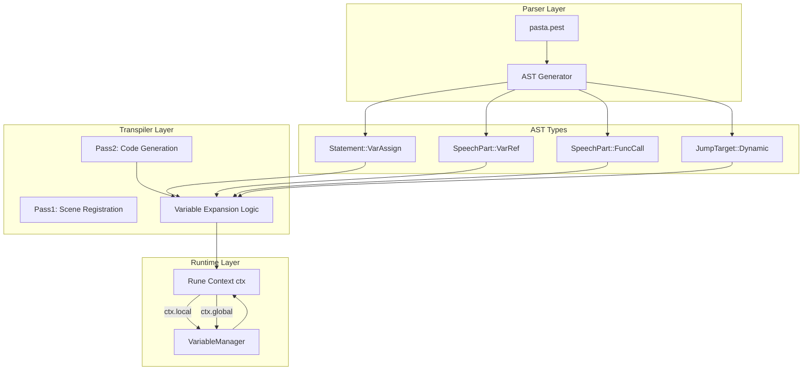
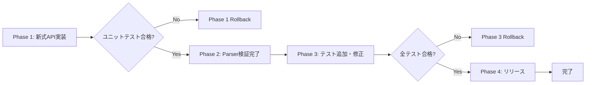

# Design Document: pasta-transpiler-variable-expansion

## Overview

本仕様は、Pastaスクリプトにおける変数代入（`$変数: 値` / `$*変数: 値`）と変数参照（アクション行での`$変数`、`@$変数`、コール行での`>$変数`）について、トランスパイラー層が生成するRune IR（中間表現）の設計を定義する。

**Purpose**: 変数スコープ管理（Local/Global）の一貫性を確保し、動的な単語検索およびシーン呼び出しを可能にする。これにより、スクリプト作者は変数を用いた柔軟な会話ロジックを記述できる。

**Users**: Pastaスクリプト作成者、および本エンジンをベースとしたデスクトップマスコット・シナリオゲーム開発者

**Impact**: 既存のトランスパイラー層に以下の変更を加える：
- 憲法レベル決定として`ctx.local`/`ctx.global` APIを導入し、従来の`ctx.var.*`、`get_global()`、`set_global()`を置き換える
- 動的単語検索（`@$変数`）および動的シーン呼び出し（`>$変数`）をRune文字列テンプレート`` `${ctx.local.変数名}` ``で実装
- 旧式API（`@var_name`形式でのJumpTarget::Dynamic）を廃止

### Goals
- 変数スコープ（Local/Global）の明確な分離と、`ctx.local`/`ctx.global`による統一的なアクセスAPIの実現
- アクション行内の`$変数`参照を`Talk()`イベントへ展開
- アクション行内の`@$変数`を動的単語検索（`pasta_stdlib::word()`）へ展開
- コール行の`>$変数`を動的シーン呼び出し（`crate::pasta::call()`）へ展開
- 全ての変数参照が未定義時に診断エラーを生成し、トランスパイルを失敗させる

### Non-Goals
- 変数の型推論・型チェック（文字列リテラルとして扱い、Rune側で文字列テンプレート評価）
- システム変数（`$**変数`）の永続化機能（将来フェーズで対応）
- 多段インライン解決（`@@変数`など、別仕様`pasta-conversation-inline-multi-stage-resolution`で対応）

## Architecture

### Existing Architecture Analysis

Pastaエンジンは以下のレイヤー構成を持つ：

```
Engine (上位API) → Cache/Loader
    ↓
Transpiler (2pass) ← Parser (Pest)
    ↓
Runtime (Rune VM) → IR Output (ScriptEvent)
```

**現在の変数管理**:
- **Parser層**: `VarAssign`/`VarRef`/`VarScope`をASTノードとして定義済み（`src/parser/ast.rs`）
- **Runtime層**: `VariableManager`が`Local`/`Global`/`System`スコープを提供（`src/runtime/variables.rs`）
- **Transpiler層**: `Statement::VarAssign`を`let name = expr`（Local）または`ctx.var.name = expr`（Global）へ変換、`SpeechPart::VarRef`を`` `${ctx.var.name}` ``へ展開
- **問題点**: `ctx.var.*`構造体がRuneコンテキストに未定義、`get_global()`/`set_global()`との併存により一貫性が欠如

**統合ポイント**:
- `src/transpiler/mod.rs` - `transpile_statement()`、`transpile_speech_part_to_writer()`、`transpile_expr()`がターゲット
- `src/runtime/variables.rs` - `VariableManager`をRune側で`ctx.local`/`ctx.global`として公開する必要
- `src/parser/pasta.pest` - `@$変数`構文の認識を確認（必要に応じて文法拡張）

### Architecture Pattern & Boundary Map

**選択パターン**: **既存トランスパイラー拡張**（Extension of 2-pass transpiler）

本設計は既存の2パストランスパイル戦略を維持し、Pass2（コード生成フェーズ）で変数展開ロジックを修正する。



**Domain Boundaries**:
- **Parser層**: DSL構文を`VarAssign`/`VarRef`/`FuncCall`/`JumpTarget`のASTノードへ変換（責務不変）
- **Transpiler層**: ASTノードをRune文字列テンプレート展開コードへ変換、`ctx.local`/`ctx.global`アクセスを生成
- **Runtime層**: `VariableManager`をRune側の`ctx`オブジェクトに統合し、`ctx.local`/`ctx.global`プロパティを提供

**既存パターン維持**:
- 2パストランスパイル戦略（Pass1: シーン登録、Pass2: モジュール生成）
- Yield型イベント出力（`yield Talk()`、`yield SetVariable()`）
- Rune 0.14のgenerator機能活用

**新規コンポーネント**:
- なし（既存の`transpile_statement()`、`transpile_speech_part_to_writer()`、`transpile_expr()`を修正）

**Steering準拠**:
- 憲法レベル決定として`ctx.local`/`ctx.global` APIを採用（product.md Phase 0再構築に整合）
- UNICODE識別子サポート（日本語変数名対応、tech.md準拠）
- 宣言的フロー維持（Call/Jump文、if/while/forなし）

### Technology Stack

| Layer | Choice / Version | Role in Feature | Notes |
|-------|------------------|-----------------|-------|
| Parser | Pest 2.8 | `@$変数`構文認識 | 既存`var_ref`ルールで対応可能か検証必要 |
| Transpiler | Rust 2024 | Rune文字列テンプレート生成 | `` `${ctx.local.変数名}` ``形式のRuneコード出力 |
| Runtime | Rune 0.14 | 文字列テンプレート評価 | `${variable}`構文で動的値埋め込み |
| Runtime | VariableManager | Local/Global/Systemスコープ管理 | `ctx.local`/`ctx.global`としてRune側に公開 |

**設計判断**:
- **Rune文字列テンプレート活用**: 議題2・3で決定。`` `${ctx.local.変数名}` ``形式により、パーサー側の大幅変更を回避し、トランスパイラー層のみの修正で動的展開を実現
- **`ctx.local`/`ctx.global` API**: 憲法決定（議題1）。旧式`ctx.var.*`、`get_global()`、`set_global()`を廃止し、一貫したアクセスパターンを確立

## System Flows

### 変数代入フロー

```mermaid
sequenceDiagram
    participant Script as Pastaスクリプト
    participant Parser
    participant Transpiler
    participant Rune as Rune VM
    participant VarMgr as VariableManager
    
    Script->>Parser: $変数: 値
    Parser->>Parser: VarAssign{name, scope:Local, value}
    Parser->>Transpiler: AST
    Transpiler->>Transpiler: let 変数 = "値";（廃止）<br/>ctx.local.変数 = "値";（新式）
    Transpiler->>Rune: 生成Runeコード
    Rune->>VarMgr: ctx.local.変数 = "値"
    VarMgr->>VarMgr: set("変数", "値", Local)
```

**グローバル変数代入** (`$*変数: 値`):
- 同様のフローで`ctx.global.変数 = "値"`を生成し、`VariableManager::set("変数", "値", Global)`を呼び出す

### 動的単語検索フロー (`@$変数`)

```mermaid
sequenceDiagram
    participant Script as Pastaスクリプト
    participant Parser
    participant Transpiler
    participant Rune as Rune VM
    participant Stdlib as pasta_stdlib
    
    Script->>Parser: Alice：@$挨拶
    Parser->>Parser: SpeechPart::FuncCall{name:"$挨拶"}
    Parser->>Transpiler: AST
    Transpiler->>Transpiler: let a = ctx.local.挨拶; yield Talk(pasta_stdlib::word(module, `${a}`, []))
    Transpiler->>Rune: 生成Runeコード
    Rune->>Rune: a = ctx.local.挨拶（評価）
    Rune->>Stdlib: pasta_stdlib::word(module, "おはよう", [])
    Stdlib->>Stdlib: 単語検索
    Stdlib->>Rune: "おはようございます！"
    Rune->>Rune: yield Talk("おはようございます！")
```

**Key Decisions**:
- `@$変数`を`FuncCall`として解釈し、`name`フィールドに変数名を格納（`"$挨拶"`）
- トランスパイラーで`name`が`$`プレフィックスを持つ場合、`let a = ctx.local.変数名; pasta_stdlib::word(module, `${a}`, [])`形式で展開
- `@$*変数`の場合は`let a = ctx.global.変数名; ...`へ展開

### 動的シーン呼び出しフロー (`>$変数`)

```mermaid
sequenceDiagram
    participant Script as Pastaスクリプト
    participant Parser
    participant Transpiler
    participant Rune as Rune VM
    participant CallFn as crate::pasta::call
    
    Script->>Parser: >$次のシーン
    Parser->>Parser: JumpTarget::Dynamic("$次のシーン")
    Parser->>Transpiler: AST
    Transpiler->>Transpiler: let a = ctx.local.次のシーン; for b in crate::pasta::call(ctx, `${a}`, #{}, []) { yield b; }
    Transpiler->>Rune: 生成Runeコード
    Rune->>Rune: a = ctx.local.次のシーン（評価）
    Rune->>CallFn: crate::pasta::call(ctx, "会話2", #{}, [])
    CallFn->>CallFn: シーン検索
    CallFn->>Rune: Generator
    Rune->>Rune: yield events from Generator
```

**Key Decisions**:
- `JumpTarget::Dynamic(var_name)`を受け取り、`var_name`が`$`プレフィックスを持つ場合、`let a = ctx.local.変数名; for b in crate::pasta::call(ctx, `${a}`, ...) { yield b; }`形式で展開
- 旧式`@var_name`形式（`transpile_jump_target_to_search_key`で`@`プレフィックス付与）は文法誤りとして廃止

## Requirements Traceability

| Requirement | Summary | Components | Interfaces | Flows |
|-------------|---------|------------|------------|-------|
| 1.1 | ローカル変数`$変数`参照 | Transpiler, VariableManager | `ctx.local` | 変数代入フロー |
| 1.2 | グローバル変数`$*変数`参照 | Transpiler, VariableManager | `ctx.global` | 変数代入フロー |
| 1.3 | 同名変数のローカル優先解決 | Transpiler | `ctx.local`先行アクセス | 変数代入フロー |
| 1.4 | UNICODE識別子サポート | Parser, Transpiler | `var_name` | - |
| 2.1 | ローカル変数代入 | Transpiler | `ctx.local.name = value` | 変数代入フロー |
| 2.2 | グローバル変数代入 | Transpiler | `ctx.global.name = value` | 変数代入フロー |
| 2.3 | 文字列リテラル値 | Transpiler | `Expr::Literal` → Rune string | 変数代入フロー |
| 2.4 | 無効識別子エラー | Parser | PestエラーまたはTranspilerバリデーション | - |
| 3.1 | アクション行`$変数`展開 | Transpiler | `` `${ctx.local.name}` `` → Talk() | - |
| 3.2 | 未定義変数エラー | Transpiler | バリデーションチェック | - |
| 4.1 | `@$変数`単語検索 | Transpiler, pasta_stdlib | `` pasta_stdlib::word(`${ctx.local.name}`) `` | 動的単語検索フロー |
| 4.2 | 検索キー空エラー | Transpiler/Runtime | バリデーションまたはRuntime例外 | 動的単語検索フロー |
| 5.1 | `>$変数`シーン呼び出し | Transpiler, crate::pasta | `` crate::pasta::call(ctx, `${ctx.local.name}`) `` | 動的シーン呼び出しフロー |
| 5.2 | ラベルキー空エラー | Transpiler/Runtime | バリデーションまたはRuntime例外 | 動的シーン呼び出しフロー |
| 6.1 | テスト可能なIR出力 | Transpiler | Rune generator → ScriptEvent | - |
| 6.2 | 診断情報（位置・原因） | Parser, Transpiler | PastaError with span | - |

## Components and Interfaces

| Component | Domain/Layer | Intent | Req Coverage | Key Dependencies | Contracts |
|-----------|--------------|--------|--------------|------------------|-----------|
| Transpiler | Transpiler層 | AST→Runeコード変換 | 1.1-6.2全て | Parser (P0), VariableManager (P0) | Service |
| VariableManager | Runtime層 | 変数スコープ管理 | 1.1-2.4 | Rune Context (P0) | State |
| pasta_stdlib | Runtime層 | 単語検索・標準ライブラリ | 4.1-4.2 | Transpiler (P0) | Service |
| crate::pasta::call | Runtime層 | シーン呼び出し | 5.1-5.2 | Transpiler (P0), LabelTable (P0) | Service |

### Transpiler層

#### Transpiler

| Field | Detail |
|-------|--------|
| Intent | ASTノードをRune文字列テンプレート展開コードへ変換 |
| Requirements | 1.1, 1.2, 1.3, 1.4, 2.1, 2.2, 2.3, 2.4, 3.1, 3.2, 4.1, 4.2, 5.1, 5.2, 6.1, 6.2 |
| Owner / Reviewers | - |

**Responsibilities & Constraints**
- `Statement::VarAssign`を`ctx.local.name = value`または`ctx.global.name = value`へ変換
- `SpeechPart::VarRef`を`` yield Talk(`${ctx.local.name}`); ``へ変換
- `SpeechPart::FuncCall`で`name`が`$`プレフィックスを持つ場合、`` pasta_stdlib::word(module, `${ctx.local.name}`, []) ``へ変換
- `JumpTarget::Dynamic`で変数名が`$`プレフィックスを持つ場合、`` crate::pasta::call(ctx, `${ctx.local.name}`, filters, args) ``へ変換
- 旧式`ctx.var.*`、`get_global()`、`set_global()`、`@var_name`形式を全て削除

**Dependencies**
- Inbound: Parser (AST供給) - P0
- Outbound: VariableManager (スコープ管理) - P0
- Outbound: pasta_stdlib (単語検索) - P0
- Outbound: crate::pasta::call (シーン呼び出し) - P0

**Contracts**: [x] Service

##### Service Interface
```rust
pub struct Transpiler;

impl Transpiler {
    /// Transpile statement to Rune code.
    /// Preconditions: AST is valid (parsed successfully).
    /// Postconditions: Rune code string generated or error returned.
    /// Invariants: ctx.local/ctx.global API consistently used.
    pub fn transpile_statement<W: std::io::Write>(
        writer: &mut W,
        statement: &Statement,
        context: &TranspileContext,
    ) -> Result<(), PastaError>;

    /// Transpile speech part to Rune code.
    /// Preconditions: SpeechPart is valid.
    /// Postconditions: yield Talk(...) or other IR generated.
    pub fn transpile_speech_part_to_writer<W: std::io::Write>(
        writer: &mut W,
        part: &SpeechPart,
        context: &TranspileContext,
    ) -> Result<(), PastaError>;

    /// Transpile expression to Rune string.
    /// Preconditions: Expr is valid.
    /// Postconditions: Rune expression string returned or error.
    pub fn transpile_expr(
        expr: &Expr,
        context: &TranspileContext,
    ) -> Result<String, PastaError>;
}
```

**Implementation Notes**
- **Integration**: 既存`transpile_statement()`の`VarAssign`分岐を修正し、`scope`に応じて`ctx.local.name`または`ctx.global.name`を生成。`let name = ...`形式は削除。
- **Integration**: `transpile_speech_part_to_writer()`の`VarRef`分岐を修正し、中間変数を経由して`` `${a}` ``テンプレートを生成。`FuncCall`分岐で`name`が`$`で始まる場合、テンプレート展開を適用。
  - パターン1: `let a = ctx.local.変数名; yield Talk(`${a}`);`
  - パターン2: `let a = ctx.local.変数名; yield Talk(pasta_stdlib::word(module, `${a}`, []));`
- **Integration**: `transpile_jump_target_to_search_key()`を修正し、`JumpTarget::Dynamic`で`$`プレフィックス検出時に中間変数経由で`` `${a}` ``を返す。パターン: `let a = ctx.local.変数名; for b in crate::pasta::call(ctx, `${a}`, ...) { yield b; }`
- **Validation**: `transpile_expr()`で`VarRef`が未定義かチェックする場合、`VariableManager`の事前定義変数リストを参照する（将来拡張）。現状は`ctx.local`/`ctx.global`アクセスでRuntime評価を許容。
- **Risks**: Parser層で`@$変数`が`FuncCall`として正しく認識されない場合、文法拡張が必要（design-discovery-lightで要検証事項として記録済み）。

### Runtime層

#### VariableManager

| Field | Detail |
|-------|--------|
| Intent | Local/Global/Systemスコープの変数を管理し、Rune側に`ctx.local`/`ctx.global`として公開 |
| Requirements | 1.1, 1.2, 1.3, 2.1, 2.2 |
| Owner / Reviewers | - |

**Responsibilities & Constraints**
- `HashMap<String, VariableValue>`を用いた各スコープの変数保持
- Rune側の`ctx`オブジェクトへの統合（`ctx.local`/`ctx.global`プロパティ）
- `clear_local()`でローカルスコープをクリア（シーン終了時）

**Dependencies**
- Inbound: Transpiler (変数代入・参照コード生成) - P0
- Outbound: Rune Context (P0)

**Contracts**: [x] State

##### State Management
- **State model**: `Local`/`Global`/`System`の3スコープを`HashMap`で管理
- **Persistence**: Systemスコープのみ永続化対象（将来フェーズ）
- **Concurrency**: シングルスレッド実行想定（Rune VM制約）

**Implementation Notes**
- **Integration**: Rune側で`ctx`オブジェクトに`local`/`global`フィールドを`Object`型として追加。Rust側で`Object::insert()`/`get()`を使用して`VariableManager`と統合。Runeコードでは`ctx.local.変数名`形式でアクセス可能（Runeの`Object`型が`object.key`形式をサポート）。
- **Risks**: なし（Runeドキュメントで動的プロパティアクセスが標準サポート確認済み）。

#### pasta_stdlib

| Field | Detail |
|-------|--------|
| Intent | 単語検索・標準ライブラリ関数を提供 |
| Requirements | 4.1, 4.2 |
| Owner / Reviewers | - |

**Responsibilities & Constraints**
- `pasta_stdlib::word(module, key, args)`で単語検索を実行
- 前方一致・ランダム選択アルゴリズム適用
- 検索失敗時にエラーまたは空文字列を返す

**Dependencies**
- Inbound: Transpiler (単語検索コード生成) - P0
- Outbound: WordTable (P0)

**Contracts**: [x] Service

##### Service Interface
```rust
/// Search for a word by key (prefix match + random selection).
/// Preconditions: module is valid module name or empty string (global).
/// Postconditions: Returns matched word value or error if key is empty/not found.
pub fn word(module: &str, key: &str, args: &[String]) -> Result<String, PastaError>;
```

**Implementation Notes**
- **Integration**: 既存の`pasta_stdlib::word()`を変更不要（引数`key`が文字列テンプレート評価結果を受け取る）。
- **Validation**: `key`が空文字列の場合、`PastaError::EmptySearchKey`を返す。
- **Risks**: なし（既存実装を活用）

#### crate::pasta::call

| Field | Detail |
|-------|--------|
| Intent | シーン呼び出しを実行し、Generatorを返す |
| Requirements | 5.1, 5.2 |
| Owner / Reviewers | - |

**Responsibilities & Constraints**
- `crate::pasta::call(ctx, label, filters, args)`でシーン検索・実行
- 前方一致・ランダム選択でシーンを決定
- 検索失敗時にエラーを返す

**Dependencies**
- Inbound: Transpiler (シーン呼び出しコード生成) - P0
- Outbound: LabelTable (P0)

**Contracts**: [x] Service

##### Service Interface
```rust
/// Call a scene by label (prefix match + random selection).
/// Preconditions: ctx is valid Rune context.
/// Postconditions: Returns Generator or error if label is empty/not found.
pub fn call(
    ctx: &Context,
    label: &str,
    filters: HashMap<String, String>,
    args: Vec<String>,
) -> Result<Generator, PastaError>;
```

**Implementation Notes**
- **Integration**: 既存の`crate::pasta::call()`を変更不要（引数`label`が文字列テンプレート評価結果を受け取る）。
- **Validation**: `label`が空文字列の場合、`PastaError::EmptyLabelKey`を返す。
- **Risks**: なし（既存実装を活用）

## Data Models

### Domain Model

変数管理ドメイン：

**Aggregates**:
- **Variable**: 変数名（String）、値（String）、スコープ（Local/Global/System）のトリプル

**Entities**:
- なし（ValueObjectのみ）

**Value Objects**:
- `VariableScope`: Local / Global / System
- `VariableValue`: String / Integer / Boolean / Float（現状はString主体）

**Domain Events**:
- `SetVariable { scope, name, value }`: 変数代入イベント（IR出力）

**Business Rules**:
- ローカル変数は同名グローバル変数より優先（Req 1.3）
- 変数名はUNICODE識別子（日本語可、Req 1.4）

### Logical Data Model

**構造定義**:
- `VariableManager`は3つの`HashMap<String, VariableValue>`を保持（Local/Global/System）
- キー: 変数名（String）
- 値: `VariableValue`（現状は文字列リテラル主体）

**整合性**:
- トランザクション境界: シーン実行単位（ローカル変数は`clear_local()`でクリア）
- 参照整合性: なし（変数は独立したKey-Value）

### Physical Data Model

**Key-Value Store（メモリ）**:
- `HashMap<String, VariableValue>`をRust標準ライブラリで実装
- TTL: なし（セッション終了でクリア、Systemスコープは将来永続化）
- インデックス: なし（変数名によるO(1)アクセス）

### Data Contracts & Integration

**Rune Context統合**:
- `ctx.local`: ローカル変数へのプロキシオブジェクト
- `ctx.global`: グローバル変数へのプロキシオブジェクト
- プロパティアクセスで`VariableManager::get()`/`set()`を呼び出す

**実装方式**（Rune Objectベース）:
- `ctx.local`/`ctx.global`をRune `Object`型（HashMapエイリアス）で実装
- Runeは`object["key"]`または`object.key`形式で動的プロパティアクセスをサポート
- 参考: [Rune Objects](https://rune-rs.github.io/book/objects.html) - `values.second`形式が標準サポート

**スキーマ**:
```rust
// Rune側で公開するコンテキスト構造
use rune::runtime::Object;

pub struct RuneContext {
    pub local: Object,   // Rune Object (HashMap) - ctx.local.変数名 アクセス
    pub global: Object,  // Rune Object (HashMap) - ctx.global.変数名 アクセス
}

// VariableManager との統合
impl RuneContext {
    pub fn new(var_manager: Arc<Mutex<VariableManager>>) -> Self {
        // local/global ObjectをVariableManagerのプロキシとして構築
        // Object::insert()/get()でVariableManagerを呼び出す
    }
}
```

**同期戦略**:
- シングルスレッド実行のため、同期不要（Rune VM制約）

## Error Handling

### Error Strategy

- **User Errors（4xx相当）**:
  - 無効な変数名: `PastaError::InvalidIdentifier { name, span }`
  - 未定義変数参照: `PastaError::UndefinedVariable { name, span }`（将来拡張）
  - 空検索キー: `PastaError::EmptySearchKey { span }`
  - 空ラベルキー: `PastaError::EmptyLabelKey { span }`

- **System Errors（5xx相当）**:
  - I/Oエラー: `PastaError::IoError { message }`
  - Runeランタイムエラー: `PastaError::RuntimeError { message }`

- **Business Logic Errors（422相当）**:
  - なし（現状は全て4xx系エラーまたは警告）

### Error Categories and Responses

**User Errors**:
- `InvalidIdentifier`: パーサーまたはトランスパイラーで検出、ファイル位置（span）を含むエラーメッセージ生成
- `UndefinedVariable`: トランスパイル時または実行時に検出、変数名と位置を報告
- `EmptySearchKey` / `EmptyLabelKey`: Runeランタイムで検出、診断メッセージ生成

**System Errors**:
- `IoError`: ファイル読み込み・書き込み失敗時に発生、トランスパイル中断
- `RuntimeError`: Rune VM内部エラー、スタックトレース付きで報告

**回復戦略**:
- User Errors: トランスパイル失敗として処理、エラーログ出力
- System Errors: graceful degradation（部分的なシーン実行継続、または全体中断）

### Monitoring

- **エラー追跡**: `tracing`クレートによるログ出力（`error!`、`warn!`レベル）
- **ヘルスモニタリング**: エンジン層で`PastaEngine::transpile()`の成功/失敗を記録
- **メトリクス**: 変数代入・参照回数、エラー発生率（将来拡張）

## Testing Strategy

### Unit Tests
- `transpile_statement()` - `VarAssign`（Local/Global）の正しいRuneコード生成
- `transpile_speech_part_to_writer()` - `VarRef`/`FuncCall`のテンプレート展開
- `transpile_jump_target_to_search_key()` - `JumpTarget::Dynamic`のテンプレート展開
- `VariableManager::set()` / `get()` - スコープ別の変数保持・参照
- `pasta_stdlib::word()` - 動的キーによる単語検索（モック使用）

### Integration Tests
- **変数代入→参照フロー**: `$変数: 値`を代入後、アクション行で`$変数`を参照し、期待値が出力されること
- **動的単語検索フロー**: `@$変数`で変数値をキーに単語検索が実行されること
- **動的シーン呼び出しフロー**: `>$変数`で変数値をラベルにシーン呼び出しが成功すること
- **スコープ分離**: ローカル変数とグローバル変数が独立して管理されること
- **旧式API廃止**: `ctx.var.*`、`get_global()`、`set_global()`が生成されないこと

### E2E Tests
- **エンドツーエンドシナリオ**: Pastaスクリプト（変数代入・参照・動的検索・動的呼び出しを含む）をエンジン経由で実行し、期待通りの`ScriptEvent`シーケンスが生成されること
- **エラーケース**: 無効な変数名、空検索キー、空ラベルキーでエラーが正しく報告されること

### Performance Tests
- **変数アクセス性能**: 1000回の変数代入・参照でO(1)性能を維持（HashMap使用）
- **動的検索性能**: 前方一致検索（Radix Trie）が大規模単語テーブルで高速動作すること

## Migration Strategy

### Phase 0: Rune Object方式検証（任意）
- **目的**: `ctx.local.変数名`形式の動的プロパティアクセスをRune `Object`型で実現することを確認
- **方針**: Runeの`Object`型（`HashMap<String, Value>`のエイリアス）を活用
  - Runeは`object.key`形式で動的フィールドアクセスをサポート（[Rune Objects](https://rune-rs.github.io/book/objects.html)）
  - `ctx.local`/`ctx.global`を`Object`としてVMに渡す
  - Rust側で`Object::insert()`/`get()`を使用して`VariableManager`と統合
- **PoC内容**（任意）:
  ```rust
  use rune::runtime::Object;
  let mut local_obj = Object::new();
  local_obj.insert("test_var".try_into()?, rune::to_value("test_value")?)?;
  // Runeコード: ctx.local.test_var → "test_value"
  ```
- **結果**: ✅ Runeドキュメントで確認済み、動的プロパティアクセスは標準機能としてサポートされている
- **決定**: フォールバック不要、`Object`型ベースでPhase 1へ進む

### Phase 1: 新式API実装
- `VariableManager`をRune側に`ctx.local`/`ctx.global`として公開
- `transpile_statement()`、`transpile_speech_part_to_writer()`、`transpile_jump_target_to_search_key()`を修正
- 旧式API（`ctx.var.*`、`get_global()`、`set_global()`）を削除

### Phase 2: 文法拡張（検証済み：対応不要）
- ✅ **検証完了**: `pasta.pest`の`var_ref`ルール（L253）により、`@$変数`は既に`SpeechPart::VarRef`として認識される
- ✅ **Parser修正不要**: `var_ref = { (at_marker | dollar_marker) ~ var_scope? ~ var_name }`が`@`+`$`+`変数名`パターンをカバー
- **Transpiler対応**: `transpile_speech_part_to_writer()`で`SpeechPart::VarRef`の`@$変数`パターンを検出し、`` pasta_stdlib::word(module, `${ctx.local.変数名}`, []) ``へ展開

### Phase 3: テスト追加・修正
- **既存テスト修正**: 1ファイル（`tests/pasta_integration_control_flow_test.rs`）の2箇所でprintlnメッセージ内に`ctx.var`が記載されているため、`ctx.local`/`ctx.global`へ修正
  - L31: `println!("   ✓ ctx.var.変数名 アクセスが正しいです");` → `ctx.local.変数名`
  - L37: `println!("   - 変数代入・参照 (ctx.var.カウンター)");` → `ctx.local.カウンター`
  - **影響範囲**: printlnメッセージのみ（実コードへの影響なし）
- **新規テスト追加**: 新式APIを検証するユニット/統合テストを追加
  - 変数代入（Local/Global）のRune出力検証
  - `@$変数`動的単語検索の統合テスト
  - `>$変数`動的シーン呼び出しの統合テスト
- 既存テストが全て合格することを確認（`cargo test --all`）

### Phase 4: リリース
- 仕様書（GRAMMAR.md、SPECIFICATION.md）を更新
- 破壊的変更をCHANGELOG.mdに記録
- バージョンをメジャーアップデート（0.x → 0.(x+1)）

**Rollback Triggers**:
- `cargo test --all`が失敗する場合、Phase 1をロールバック

**Validation Checkpoints**:
- Phase 1完了後: ユニットテスト合格
- Phase 3完了後: 統合テスト・E2Eテスト合格
- Phase 4完了前: 全テスト合格、ドキュメント更新完了



## Supporting References

### Rune文字列テンプレート構文と中間変数方式

Rune 0.14では`` `${variable}` ``構文で文字列内に変数を埋め込める。本設計では、中間変数を経由して動的キー展開を実現する（Rune VMでの直接式評価の複雑性を回避するため）。

**実装パターン**:

1. **ローカル変数参照** (`$変数` in Talk):
   ```rune
   let a = ctx.local.挨拶;
   yield Talk(`${a}`); // @$挨拶
   ```

2. **動的単語検索** (`@$変数`):
   ```rune
   let a = ctx.local.keyword;
   yield Talk(pasta_stdlib::word(module, `${a}`, [])); // @$keyword
   ```

3. **動的シーン呼び出し** (`>$変数`):
   ```rune
   let a = ctx.local.scene;
   for b in crate::pasta::call(ctx, `${a}`, #{}, []) { yield b; } // >$scene
   ```

**命名規則**: 中間変数は短い名前（`a`, `b`, `c`, ...）を使い回し、1トークン1行で展開（文法の簡潔性）。

### 旧式API削除対象

以下のAPIは全て削除：
- `ctx.var.*` - 構造体未定義のため実行時エラー発生
- `get_global(name)` - 関数未定義
- `set_global(name, value)` - 関数未定義
- `@var_name` - `JumpTarget::Dynamic`の旧フォーマット（文法誤り）

### 憲法レベル決定（再掲）

**変数スコープAPI仕様**:
- **ローカル変数**: `ctx.local.<name>`
- **グローバル変数**: `ctx.global.<name>`
- **全ての要件・設計・実装はこれに従う**
