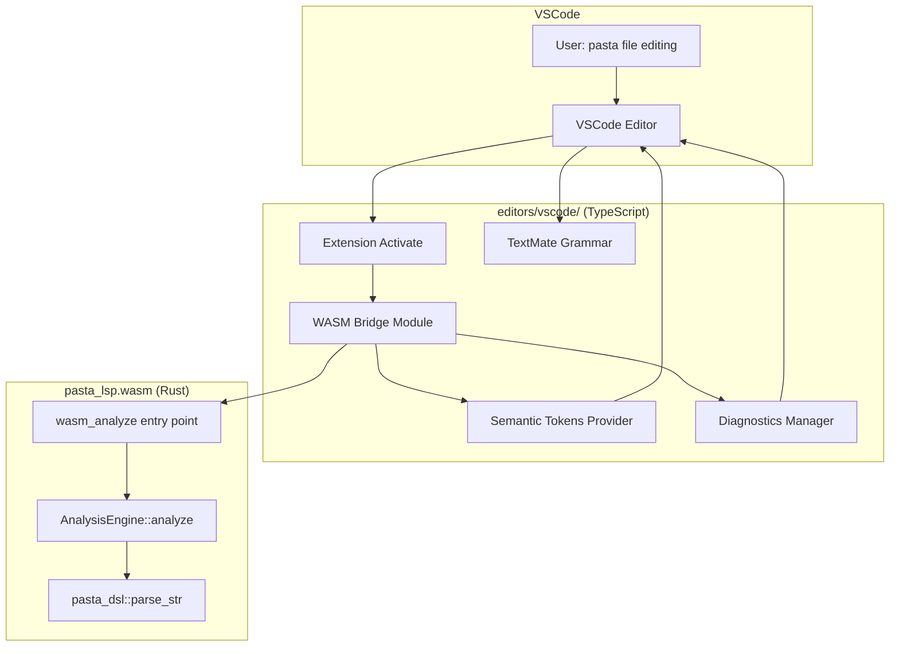
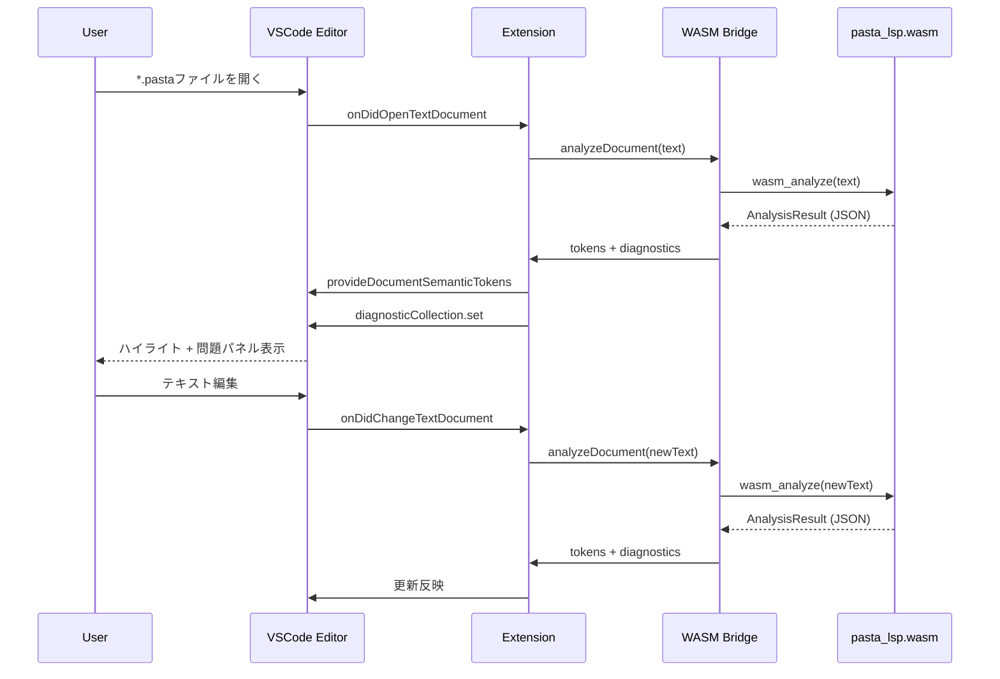
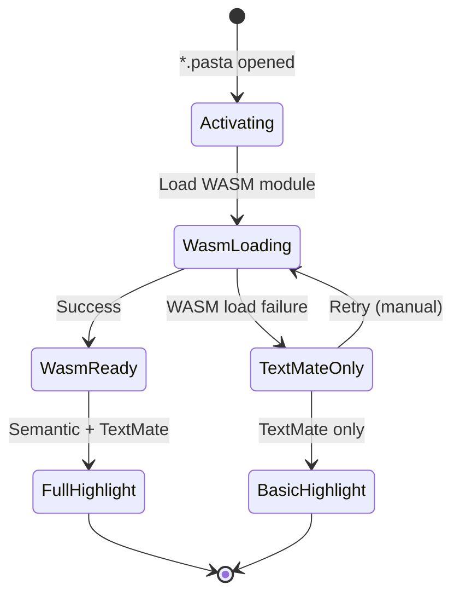
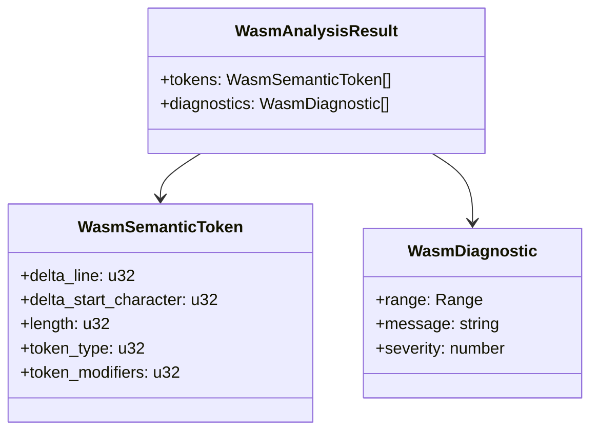

# Technical Design: pasta-vscode-extension

## Overview

**Purpose**: Pasta DSL（`*.pasta`ファイル）のシンタックスハイライトと診断情報をVSCode上で提供するエディタ拡張。既存の`pasta_lsp`クレートの`AnalysisEngine`をWASMとしてコンパイルし、VSCode拡張内でインプロセス実行する。

**Users**: Pasta DSLでゴーストスクリプトを記述する開発者。VSCode上で`*.pasta`ファイルを開いた際に、構文要素が意味的に色分けされ、パースエラーが問題パネルに表示される。

**Impact**: 新規プロジェクト（`editors/vscode/`）を作成。既存の`pasta_lsp`クレートは変更最小限（WASM公開用エントリポイントの追加のみ）。

### Goals
- Phase 1: TextMate文法による基本ハイライト（LSP不要で即座に動作確認可能）
- Phase 3: WASM統合による14セマンティックトークンの完全ハイライト + 診断情報表示
- `editors/vscode/`への配置による将来の他エディタ拡張との共存

### Non-Goals
- LSPプロトコルのフル実装（補完、ホバー、定義ジャンプ等は将来仕様）
- Phase 2（ネイティブLSP統合）の実装（AnalysisEngine直接公開方式により不要）
- tower-lspのWASM上での動作（技術的リスクが高すぎるため回避）
- VSCode Web Extension対応（将来検討）
- マーケットプレースへの公開（ローカルVSIXインストールのみ）

## Architecture

### Existing Architecture Analysis

**既存の`pasta_lsp`クレート構造**:
- `analysis.rs`: `AnalysisEngine::analyze(&str) -> AnalysisResult`（純粋関数）。14トークンタイプ、3モディファイア、部分パースフォールバック
- `server.rs`: `PastaLangServer`（tower-lsp LanguageServer trait実装）。catch_unwindによるクラッシュ保護
- `document.rs`: `DocumentManager`（open/change/close、増分更新）
- `transport.rs`: WASMスタブ（`WasmLspServer` のsend/on_messageがTODO）
- `Cargo.toml`: `crate-type = ["cdylib", "rlib"]`、tower-lsp 0.20 runtime-agnostic

**設計上の制約**:
- `AnalysisEngine`はtower-lspの`SemanticToken`/`Diagnostic`型に依存
- `lsp-types`クレートはserde Serialize/Deserializeを実装済み
- WASMビルドは既に成功（`pasta_lsp.wasm` 0.19MB）

### Architecture Pattern & Boundary Map



**Architecture Integration**:
- **Selected pattern**: Bridge パターン — Rust WASM モジュールとTypeScript VSCode APIの橋渡し
- **Domain boundaries**: Rust側は解析ロジックのみ、TypeScript側はVSCode統合のみ
- **Existing patterns preserved**: `AnalysisEngine`の純粋関数的設計、pasta_dslへの依存方向
- **New components**: WASM Bridge（TypeScript）、wasm_analyzeエントリポイント（Rust）
- **Steering compliance**: Pure Virtual Workspace構成維持、テストファースト原則

### Technology Stack

| Layer | Choice / Version | Role in Feature | Notes |
|-------|------------------|-----------------|-------|
| Extension Runtime | TypeScript 5.x + esbuild | VSCode拡張ビルド・バンドル | ESM出力 |
| VSCode API | `@types/vscode` ^1.85 | エディタ統合（セマンティックトークン、診断） | engines制約 |
| WASM Runtime | wasm-bindgen 0.2 + serde-wasm-bindgen | Rust→JS橋渡し | 既存依存に追加 |
| Parser | pasta_dsl (Pest 2.8) | DSL解析 | 既存（変更なし） |
| Analysis | pasta_lsp analysis.rs | セマンティックトークン・診断生成 | 既存（エントリポイント追加） |
| TextMate Grammar | `.tmLanguage.json` | フォールバックハイライト | 新規作成 |
| Packaging | @vscode/vsce | VSIXパッケージング | 新規依存 |

## System Flows

### Phase 3: WASM統合時のセマンティックハイライトフロー



### LSP起動失敗時のフォールバックフロー



## Requirements Traceability

| Requirement | Summary | Components | Interfaces | Flows |
|-------------|---------|------------|------------|-------|
| 1.1 | editors/vscode/ TypeScript構成 | ProjectScaffold | — | — |
| 1.2 | package.jsonマニフェスト | PackageManifest | — | — |
| 1.3 | *.pasta自動アクティベート | ExtensionActivator | activate() | Activation |
| 1.4 | VSIXビルド可能 | BuildScript | — | — |
| 1.5 | pasta言語ID登録 | LanguageContribution | — | — |
| 2.1 | WASMビルド成果物パッケージ含有 | WasmBridge, BuildScript | — | — |
| 2.2 | アクティベート時LSP起動 | ExtensionActivator | activate() | Activation |
| 2.3 | LSPプロトコル処理 | WasmBridge | analyzeDocument() | SemanticHighlight |
| 2.4 | ドキュメント同期 | DocumentSync | onDidOpen/Change/Close | SemanticHighlight |
| 2.5 | 診断情報表示 | DiagnosticsManager | diagnosticCollection | SemanticHighlight |
| 2.6 | UTF-16位置処理 | WasmBridge | — | — |
| 2.7 | 起動失敗時フォールバック | ExtensionActivator | — | Fallback |
| 3.1 | 14セマンティックトークン | SemanticTokensProvider | provideDocumentSemanticTokens | SemanticHighlight |
| 3.2 | 3モディファイア | SemanticTokensProvider | SemanticTokensLegend | — |
| 3.3 | ファイルオープン時トークンリクエスト | DocumentSync | — | SemanticHighlight |
| 3.4 | 編集時トークン再取得 | DocumentSync | — | SemanticHighlight |
| 4.1 | tmLanguage.jsonバンドル | TextMateGrammar | — | — |
| 4.2 | 基本要素ハイライト | TextMateGrammar | — | — |
| 4.3 | 全角/半角同等認識 | TextMateGrammar | — | — |
| 4.4 | セマンティック上書き | SemanticTokensProvider | — | — |
| 4.5 | フォールバック動作 | ExtensionActivator | — | Fallback |
| 5.1 | editors/vscode/配置 | ProjectScaffold | — | — |
| 5.2 | WASMビルドスクリプト | BuildScript | — | — |
| 5.3 | vsce packageビルド | BuildScript | — | — |
| 5.4 | READMEビルド手順 | Documentation | — | — |
| 5.5 | steering/structure.md登録 | Documentation | — | — |

## Components and Interfaces

| Component | Domain/Layer | Intent | Req Coverage | Key Dependencies | Contracts |
|-----------|-------------|--------|--------------|------------------|-----------|
| ExtensionActivator | Extension | 拡張のライフサイクル管理 | 1.3, 2.2, 2.7, 4.5 | vscode API (P0) | Service |
| WasmBridge | Bridge | WASM ↔ TypeScript橋渡し | 2.1, 2.3, 2.6 | pasta_lsp.wasm (P0) | Service |
| SemanticTokensProvider | Highlight | セマンティックトークン提供 | 3.1, 3.2, 3.3, 3.4, 4.4 | WasmBridge (P0) | Service |
| DiagnosticsManager | Diagnostics | 診断情報管理 | 2.5 | WasmBridge (P0) | State |
| DocumentSync | Sync | ドキュメント変更監視 | 2.4, 3.3, 3.4 | vscode API (P0) | Event |
| TextMateGrammar | Grammar | TextMateフォールバック文法 | 4.1, 4.2, 4.3, 4.5 | — | — |
| PackageManifest | Config | VSCode拡張マニフェスト | 1.1, 1.2, 1.5 | — | — |
| BuildScript | Build | ビルド・パッケージング | 1.4, 5.1, 5.2, 5.3 | esbuild (P0), vsce (P1) | — |
| WasmAnalyzeEntry | WASM/Rust | wasm-bindgen公開エントリ | 2.1, 2.3 | AnalysisEngine (P0) | Service |

### Extension Layer

#### ExtensionActivator

| Field | Detail |
|-------|--------|
| Intent | 拡張のアクティベーション・WASMロード・フォールバック管理 |
| Requirements | 1.3, 2.2, 2.7, 4.5 |

**Responsibilities & Constraints**
- `*.pasta`ファイルが開かれた時に拡張をアクティベート
- WASMモジュールのロードとWasmBridgeの初期化
- WASM起動失敗時のフォールバック判定とエラー通知
- 拡張のdeactivateでリソース解放

**Dependencies**
- Outbound: WasmBridge — WASMモジュール初期化 (P0)
- Outbound: DocumentSync — ドキュメント変更監視の開始 (P0)
- External: vscode API — ExtensionContext, window.showErrorMessage (P0)

**Contracts**: Service [x]

##### Service Interface
```typescript
interface ExtensionLifecycle {
  activate(context: vscode.ExtensionContext): Promise<void>;
  deactivate(): void;
}

interface ActivationState {
  readonly wasmReady: boolean;
  readonly fallbackMode: boolean;
}
```
- Preconditions: ExtensionContext が有効
- Postconditions: wasmReady=true または fallbackMode=true

**Implementation Notes**
- WASMロードは非同期。ロード中はTextMateのみで表示
- エラー通知は `vscode.window.showErrorMessage` で表示し、ログには詳細を記録

---

#### DocumentSync

| Field | Detail |
|-------|--------|
| Intent | ドキュメントの開閉・変更を監視しWASM解析をトリガー |
| Requirements | 2.4, 3.3, 3.4 |

**Responsibilities & Constraints**
- `onDidOpenTextDocument`, `onDidChangeTextDocument`, `onDidCloseTextDocument` を監視
- ドキュメント変更時にWasmBridge経由で解析を実行
- デバウンス処理（高速タイピング時の過剰な解析呼び出しを防止）

**Dependencies**
- Outbound: WasmBridge — analyzeDocument() 呼び出し (P0)
- Outbound: SemanticTokensProvider — トークン更新通知 (P0)
- Outbound: DiagnosticsManager — 診断情報更新 (P0)
- External: vscode API — workspace.onDidOpenTextDocument 等 (P0)

**Contracts**: Event [x]

##### Event Contract
- Published events: `analysisComplete(uri, tokens, diagnostics)`
- Subscribed events: `vscode.workspace.onDidOpenTextDocument`, `onDidChangeTextDocument`, `onDidCloseTextDocument`
- Ordering / delivery: ドキュメントごとに直列化（同一ファイルの解析は前回完了後に実行）

**Implementation Notes**
- デバウンス戦略: 固定 200ms
  - 最終タイプから 200ms 経過後に解析トリガー
  - タイマーはドキュメント変更ごとにリセット（高速タイピング中は解析しない）
  - 日本語 IME 確定タイミング（200-300ms）に自然対応
  - 業界標準（TypeScript LS: 200ms, Rust Analyzer: 300ms）
  - `setTimeout()` で実装、テスト段階で実測調整可能
- `*.pasta` 以外のドキュメントはフィルタリングして無視

---

### Bridge Layer

#### WasmBridge

| Field | Detail |
|-------|--------|
| Intent | WASM モジュールのロードとAnalysisEngine呼び出しの橋渡し |
| Requirements | 2.1, 2.3, 2.6 |

**Responsibilities & Constraints**
- WASMモジュール（pasta_lsp_wasm_bg.wasm + pasta_lsp_wasm.js）のロードと初期化
- `wasm_analyze(text)` の呼び出しとJSON結果のデシリアライズ
- UTF-16位置情報の正確な処理（WASMからの戻り値は既にUTF-16エンコード済み）

**Dependencies**
- Inbound: DocumentSync — analyzeDocument() 呼び出し (P0)
- External: pasta_lsp.wasm — WASMバイナリ (P0)

**Contracts**: Service [x]

##### Service Interface
```typescript
interface WasmAnalysisResult {
  tokens: ReadonlyArray<SemanticTokenData>;
  diagnostics: ReadonlyArray<DiagnosticData>;
}

interface SemanticTokenData {
  deltaLine: number;
  deltaStartCharacter: number;
  length: number;
  tokenType: number;
  tokenModifiers: number;
}

interface DiagnosticData {
  range: {
    start: { line: number; character: number };
    end: { line: number; character: number };
  };
  message: string;
  severity: number;
}

interface WasmBridge {
  initialize(wasmUri: vscode.Uri): Promise<void>;
  analyzeDocument(text: string): WasmAnalysisResult;
  isReady(): boolean;
  dispose(): void;
}
```
- Preconditions: `initialize()` が正常完了していること
- Postconditions: `WasmAnalysisResult` に有効なトークンデータが含まれること
- Invariants: WASM呼び出しは同期的（AnalysisEngineは純粋関数のため）

**Implementation Notes**
- WASMモジュールは `WebAssembly.compile()` → `init()` で初期化
- `wasm-bindgen --target web` でJSバインディングを生成
- JSON経由のデシリアライズには `serde-wasm-bindgen` を使用（JSオブジェクトとして直接渡す）
- `analyzeDocument()` は例外をスロー（TypeScript 標準慣例、try/catch で処理）
  ```typescript
  try {
    const result = wasmBridge.analyzeDocument(text);
    // tokens と diagnostics を使用
  } catch (error) {
    // WASM 呼び出し失敗 → フォールバック + エラー通知
    console.error(`WASM analysis failed: ${error}`);
    diagnosticsManager.clear(uri);
    // TextMateのみでハイライト表示に切り替え
  }
  ```

---

### WASM/Rust Layer

#### WasmAnalyzeEntry

| Field | Detail |
|-------|--------|
| Intent | AnalysisEngineをwasm-bindgenで公開するエントリポイント |
| Requirements | 2.1, 2.3 |

**Responsibilities & Constraints**
- `wasm_analyze(source: &str) -> JsValue` を公開
- `catch_unwind` でパーサーパニックからの保護
- 結果を`serde_wasm_bindgen::to_value()`でJSオブジェクトに変換

**Dependencies**
- Outbound: AnalysisEngine — analyze() (P0)
- External: wasm-bindgen, serde-wasm-bindgen (P0)

**Contracts**: Service [x]

##### Service Interface
```rust
/// WASM公開エントリポイント（transport.rs内に実装）
#[wasm_bindgen]
pub fn wasm_analyze(source: &str) -> JsValue;

/// 公開用の解析結果型（tower-lsp型からの変換）
#[derive(Serialize)]
pub struct WasmAnalysisResult {
    pub tokens: Vec<WasmSemanticToken>,
    pub diagnostics: Vec<WasmDiagnostic>,
}

#[derive(Serialize)]
pub struct WasmSemanticToken {
    pub delta_line: u32,
    pub delta_start_character: u32,
    pub length: u32,
    pub token_type: u32,
    pub token_modifiers: u32,
}
```
- Preconditions: `source` が有効なUTF-8文字列であること
- Postconditions: パニック時もJsValueを返す（空のAnalysisResult）
- Invariants: 純粋関数、副作用なし

**Implementation Notes**
- `transport.rs` の既存 `wasm` モジュール内に実装（既存スタブを置き換え）
- tower-lspの `SemanticToken` から `WasmSemanticToken` への変換は単純なフィールドコピー
- `catch_unwind` をここで実装し、server.rsの責務をWASM側に移植

---

### Highlight Layer

#### SemanticTokensProvider

| Field | Detail |
|-------|--------|
| Intent | VSCodeのSemanticTokensProvider APIを実装し、解析結果をエディタに提供 |
| Requirements | 3.1, 3.2, 3.3, 3.4, 4.4 |

**Responsibilities & Constraints**
- `vscode.DocumentSemanticTokensProvider` インターフェースの実装
- SemanticTokensLegendの定義（14トークンタイプ + 3モディファイア）
- WasmBridgeの解析結果からSemanticTokensBuilderでトークンデータを構築

**Dependencies**
- Inbound: DocumentSync — 解析完了通知 (P0)
- Inbound: WasmBridge — 解析結果 (P0)
- External: vscode API — DocumentSemanticTokensProvider (P0)

**Contracts**: Service [x]

##### Service Interface
```typescript
/** pasta_lsp analysis.rs のトークンタイプと同一順序 */
const PASTA_TOKEN_TYPES: readonly string[] = [
  'comment',      // 0
  'namespace',    // 1: グローバルシーン
  'scene',        // 2: ローカルシーン（カスタム）
  'decorator',    // 3: 属性
  'word',         // 4: 単語（カスタム）
  'variable',     // 5
  'call',         // 6: Call文（カスタム）
  'actor',        // 7: アクター辞書（カスタム）
  'actorName',    // 8: アクター名（カスタム）
  'codeBlock',    // 9: Luaコードブロック（カスタム）
  'string',       // 10
  'sakuraScript', // 11: さくらスクリプト（カスタム）
  'escape',       // 12: エスケープ（カスタム）
  'operator',     // 13
] as const;

const PASTA_TOKEN_MODIFIERS: readonly string[] = [
  'declaration',  // 0
  'definition',   // 1
  'global',       // 2（カスタム）
] as const;

interface PastaSemanticTokensProvider
  extends vscode.DocumentSemanticTokensProvider {
  provideDocumentSemanticTokens(
    document: vscode.TextDocument,
    token: vscode.CancellationToken
  ): vscode.ProviderResult<vscode.SemanticTokens>;
}
```

**Implementation Notes**
- カスタムトークンタイプ（scene, word, call, actor, actorName, codeBlock, sakuraScript, escape）は `package.json` の `semanticTokenTypes` で宣言
- テーマカラーマッピングは `semanticTokenColors` で設定（デフォルトテーマ用）
- セマンティックトークンが利用可能な場合、VSCodeは自動的にTextMate文法のハイライトを上書きする（4.4の要件は VSCode標準動作として自動達成）

---

#### DiagnosticsManager

| Field | Detail |
|-------|--------|
| Intent | WASM解析結果の診断情報をVSCodeの問題パネルに表示 |
| Requirements | 2.5 |

**Responsibilities & Constraints**
- `vscode.DiagnosticCollection` の管理
- WASM解析結果からのDiagnostic変換
- ドキュメントクローズ時の診断クリア

**Dependencies**
- Inbound: DocumentSync — 診断更新通知 (P0)
- External: vscode API — DiagnosticCollection (P0)

**Contracts**: State [x]

##### State Management
- State model: URI → Diagnostic[] のマッピング
- Persistence: インメモリのみ（セッション中有効）
- Concurrency: シングルスレッド（VSCode Extension Host）

---

### Grammar Layer

#### TextMateGrammar

| Field | Detail |
|-------|--------|
| Intent | TextMate文法によるフォールバックハイライト定義 |
| Requirements | 4.1, 4.2, 4.3, 4.5 |

**Responsibilities & Constraints**
- `syntaxes/pasta.tmLanguage.json` として配置
- 行指向文法の基本要素を正規表現で定義
- 全角/半角マーカーの同等認識

**Contracts**: — （静的ファイル、インターフェースなし）

**Implementation Notes**
- TextMateスコープマッピング:

| Pasta要素 | 正規表現パターン | TextMate Scope |
|-----------|------------------|---------------|
| コメント | `^[＃#].*$` | `comment.line.pasta` |
| グローバルシーン | `^[＊*]\s+(.+)$` | `entity.name.section.pasta` |
| ローカルシーン | `^[・\-]\s+(.+)$` | `entity.name.tag.pasta` |
| 属性定義 | `^[＆&](.+)$` | `entity.other.attribute-name.pasta` |
| 単語定義 | `^[＠@](.+)$` | `entity.name.function.pasta` |
| 変数参照 | `^[＄$](.+)$` | `variable.other.pasta` |
| Call/Jump文 | `^[＞>](.+)$` | `keyword.control.pasta` |
| アクター定義 | `^[％%](.+)$` | `entity.name.class.pasta` |
| Luaコードブロック | `` ^```lua `` ... `` ^``` `` | `meta.embedded.block.lua` |

- Luaコードブロックは `begin`/`end` パターンで `source.lua` をインクルード

---

### Build Layer

#### BuildScript

| Field | Detail |
|-------|--------|
| Intent | WASM ビルド・TypeScriptバンドル・VSIXパッケージングの自動化 |
| Requirements | 1.4, 5.1, 5.2, 5.3 |

**Contracts**: — （シェルスクリプト/npm scripts）

**Implementation Notes**
- ビルドフロー:
  1. `wasm-pack build --target web crates/pasta_lsp` → WASM + JSバインディング生成
  2. WASMバイナリを `editors/vscode/wasm/` にコピー
  3. `npm run compile` → esbuild で TypeScript をバンドル
  4. `vsce package` → VSIX 生成
- npm scripts でワンコマンドビルドを実現

## Data Models

### Domain Model

**AnalysisResult（Rust → JS橋渡し）**:



- **Aggregate root**: `WasmAnalysisResult`（1回の解析呼び出しで1つ生成）
- **Invariant**: `tokens` は deltaLine/deltaStartCharacter でソート済み（AnalysisEngine側で保証）
- **Business rule**: `token_type` は 0-13 の範囲、`token_modifiers` はビットフラグ

## Error Handling

### Error Strategy

| Error Type | Trigger | Response | Recovery |
|-----------|---------|----------|----------|
| WASMロード失敗 | 拡張アクティベート時 | 例外 throw → ExtensionActivator で catch → エラー通知 + TextMateフォールバック | 手動リロード |
| analyzeDocument 実行エラー | ドキュメント解析時 | 例外 throw → DocumentSync で catch → 診断クリア + TextMateのみで表示 | 自動（次回解析で回復） |
| パーサーパニック（Rust側） | 不正入力 | `catch_unwind` で捕捉 → 例外に変換 | 自動（次回解析で回復） |
| WASMクラッシュ | メモリ不足等 | 例外 throw → ExtensionActivator で catch → エラー通知 + TextMateフォールバック | 拡張リロード |
| 不正UTF-8入力 | バイナリファイル等 | Rust側で検証 → 空結果を返す（例外なし） | 自動 |

### TypeScript 側例外ハンドリング

**ExtensionActivator.activate() での WASM 初期化例外**:
```typescript
try {
  await wasmBridge.initialize(wasmUri);
  console.log('WASM bridge initialized');
} catch (error) {
  // WASM ロード失敗
  vscode.window.showErrorMessage(
    `Pasta WASM initialization failed: ${error}. ` +
    `Using TextMate grammar fallback.`
  );
  activationState.fallbackMode = true;
  // TextMate grammar のみでアクティベート継続
}
```

**DocumentSync での解析呼び出し例外**:
```typescript
try {
  const { tokens, diagnostics } = wasmBridge.analyzeDocument(text);
  // セマンティックトークンと診断情報を使用
  semanticTokensProvider.updateTokens(uri, tokens);
  diagnosticsManager.setDiagnostics(uri, diagnostics);
} catch (error) {
  // WASM 解析失敗
  console.error(`Document analysis failed for ${uri}: ${error}`);
  diagnosticsManager.clear(uri);
  // TextMate grammar のハイライトのみに依存
}
```

### Monitoring
- `console.log` / `console.error` でOutput Channel「Pasta Language」に出力
- WASM初期化・解析のエラーログを出力（type, message, stack trace）
- WASMロード時間を計測しログ出力（パフォーマンスベースライン）

## Testing Strategy

### Unit Tests
- WasmAnalyzeEntry: 各マーカータイプの解析結果検証（Rust側、`#[cfg(test)]`）
- SemanticTokensProvider: トークンデータからSemanticTokensBuilderへの変換
- TextMateGrammar: 各正規表現パターンのマッチ検証（vscode-textmate テスト）
- WasmBridge: WASM初期化・解析呼び出しのモック検証

### Integration Tests
- Phase 1 E2E: TextMate文法のみでの基本ハイライト表示
- Phase 3 E2E: WASM統合での14トークンタイプハイライト表示
- フォールバック: WASMロード失敗時のTextMateフォールバック動作
- 全角/半角: 全角マーカーと半角マーカーで同一のハイライト結果

### E2E Tests
- VSCode Extension Test Runnerでのヘッドレステスト
- サンプル `.pasta` ファイルでの目視確認

## Security Considerations

- WASMモジュールは拡張にバンドルされた信頼済みバイナリのみロード
- 外部ネットワーク通信なし
- ユーザー入力は `AnalysisEngine::analyze()` の引数としてのみ処理され、ファイルシステムアクセスなし

## Performance & Scalability

- **解析時間目標**: 1000行のpastaファイルで < 50ms
- **デバウンス**: 200ms（固定）
  - 根拠: 日本語 IME 確定タイミング（200-300ms）に対応、業界標準（TypeScript LS: 200ms, Rust Analyzer: 300ms）
  - 総遅延: デバウンス 200ms + 解析 < 50ms = **250ms 以内** → ユーザー体感的に許容範囲
  - タイピング中の過剰解析を防止（CPU・メモリ節約）
  - テスト段階で実測して 100-300ms の範囲で調整可能
- **WASMバイナリサイズ目標**: < 1MB（wasm-opt適用後）
- **メモリ**: WASM線形メモリはデフォルト設定（必要に応じて拡張可能）
