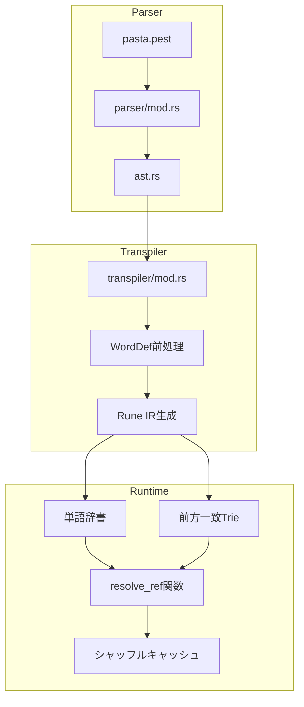
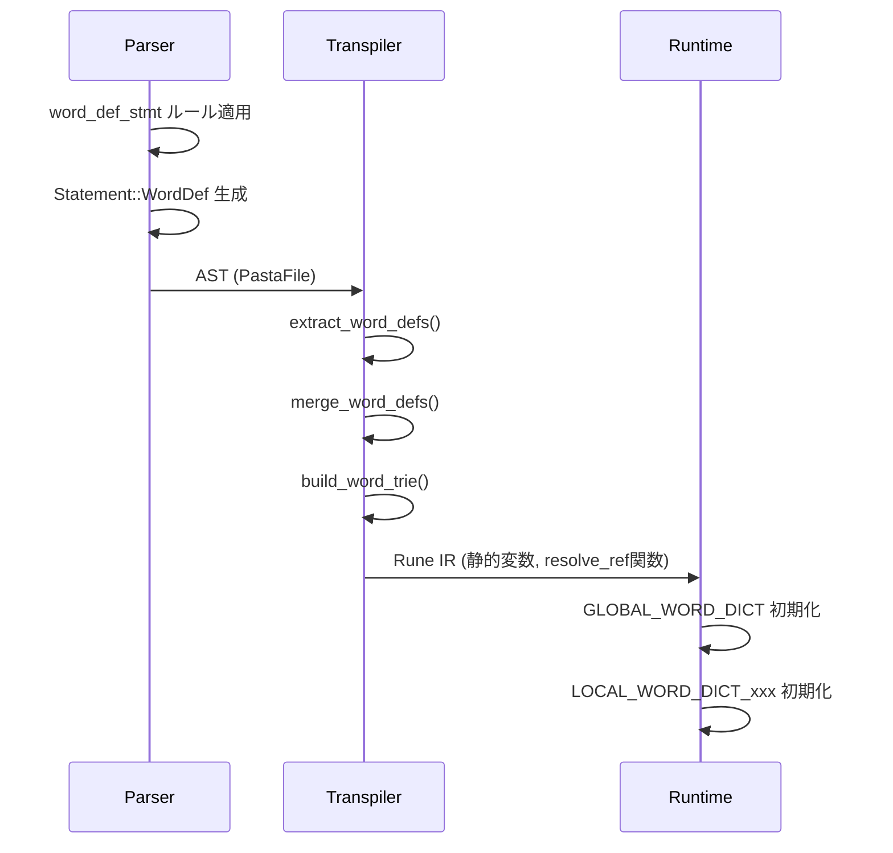
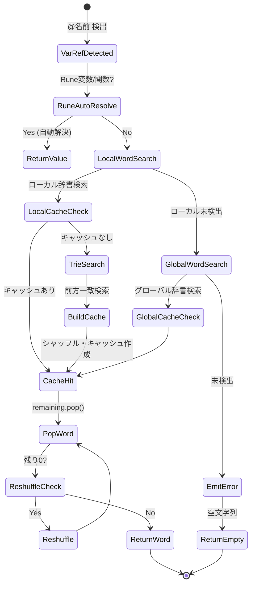
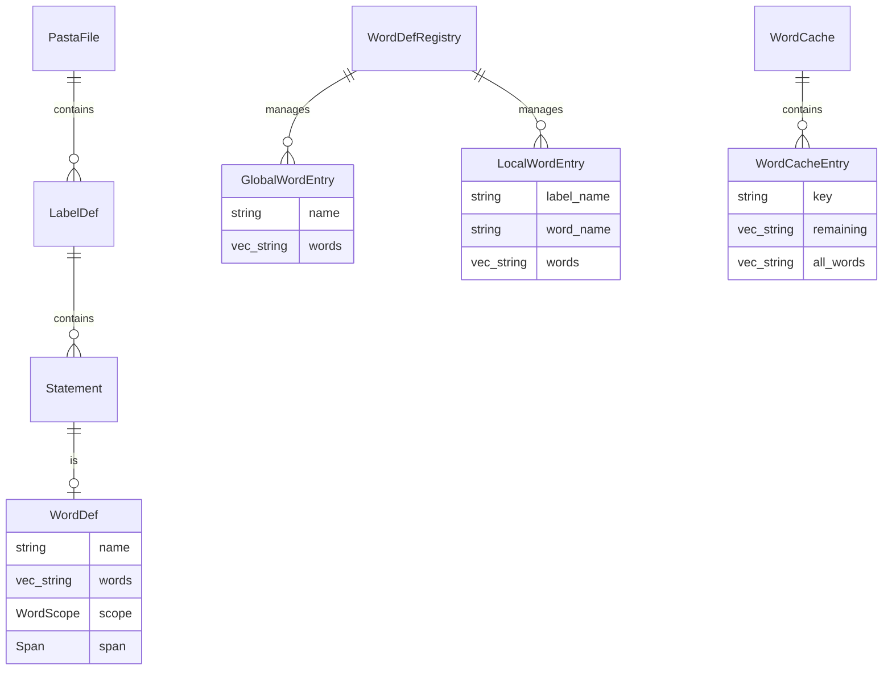

# 技術設計書: pasta-word-definition-dsl

## Overview

**Purpose**: 本機能はPasta DSLに単語定義機能を追加し、スクリプト作成者が`＠場所：東京　大阪`のような簡潔な構文で単語リストを定義し、会話行内から`＠場所`でランダム選択・展開できるようにする。

**Users**: Pasta DSLでデスクトップマスコット（伺か）のスクリプトを作成する開発者が、会話の多様性を高めるために使用する。

**Impact**: 既存の前方一致ラベル機構を補完し、より軽量で直感的な単語管理を実現。既存のStatement処理フローに新しいvariantを追加する形で統合。

### Goals
- 単語定義構文（`＠単語名：単語1　単語2`）のパースと検証
- グローバル/ローカルスコープの単語辞書管理
- 会話行内からのフォールバック検索（Rune変数 → 単語辞書 → 前方一致ラベル）
- シャッフルキャッシュによる重複回避ランダム選択

### Non-Goals
- 外部ファイルからの単語辞書読み込み（将来機能）
- 単語定義のホットリロード
- call/jump構文からの単語辞書アクセス（明示的に除外）

---

## Architecture

### Existing Architecture Analysis

Pasta DSLは3層アーキテクチャで構成される：

| Layer | 責務 | 主要ファイル |
|-------|------|-------------|
| Parser | PEG文法によるAST生成 | `pasta.pest`, `ast.rs`, `mod.rs` |
| Transpiler | AST→Rune IR変換 | `transpiler/mod.rs` |
| Runtime | Rune VM実行、ラベル/変数管理 | `runtime/`, `engine.rs` |

**既存パターン**:
- `Statement` enumにvariant追加（Speech, Call, Jump, VarAssign, RuneBlock）
- `SpeechPart` enumで会話内要素を表現（Text, VarRef, FuncCall, SakuraScript）
- `HashMap`ベースの辞書管理（`LabelTable`, 変数管理）

### Architecture Pattern & Boundary Map



**Architecture Integration**:
- **Selected Pattern**: 既存コンポーネント拡張（Option A）
- **Domain Boundaries**: Parser/Transpiler/Runtimeの3層構造を維持
- **Existing Patterns Preserved**: Statement enum拡張、HashMap辞書管理
- **New Components**: WordDef variant、WordCache構造体、Trie統合
- **Steering Compliance**: Rust型安全性、Result型エラーハンドリング

### Technology Stack

| Layer | Choice / Version | Role in Feature | Notes |
|-------|------------------|-----------------|-------|
| Parser | pest 2.x | PEG文法定義、AST生成 | 既存 |
| Data Structure | trie-rs 0.4.2 | 前方一致検索 | **新規依存** |
| Random | rand (既存) | シャッフル、ランダム選択 | 既存 |
| Runtime | Rune | IR実行、変数解決 | 既存 |

---

## System Flows

### 単語定義パース・変換フロー



### 単語参照解決フロー



---

## Requirements Traceability

| Requirement | Summary | Components | Interfaces | Flows |
|-------------|---------|------------|------------|-------|
| 1.1-1.8 | 単語定義構文パース | WordDefStmt, Statement::WordDef | parse_word_def_stmt() | パースフロー |
| 2.1-2.8 | グローバルスコープ | WordDefRegistry, GLOBAL_WORD_DICT | merge_word_defs() | 変換フロー |
| 3.1-3.8 | ローカルスコープ | WordDefRegistry, LOCAL_WORD_DICT | merge_word_defs() | 変換フロー |
| 4.1-4.6 | 会話内参照 | resolve_ref, WordCache | resolve_ref() | 参照解決フロー |
| 5.1-5.5 | フォールバック検索 | resolve_ref, WordTrie | search_with_cache() | 参照解決フロー |
| 6.1-6.7 | AST/データ構造 | Statement::WordDef, WordScope | - | - |
| 7.1-7.4 | call/jump非呼び出し | transpile_jump_target | - | - |
| 8.1-8.6 | ラベル呼び出し非対応 | resolve_ref | - | 参照解決フロー |
| 9.1-9.6 | エラーハンドリング | PastaError, ParseErrorInfo | - | - |
| 10.1-10.8 | ドキュメント | GRAMMAR.md | - | - |

---

## Components and Interfaces

### 概要表

| Component | Domain/Layer | Intent | Req Coverage | Key Dependencies | Contracts |
|-----------|--------------|--------|--------------|-----------------|-----------|
| Statement::WordDef | Parser | 単語定義AST表現 | 1, 6 | Span | - |
| WordScope | Parser | スコープ識別 | 2, 3, 6 | - | - |
| word_def_stmt | Parser | PEG文法ルール | 1 | pest | - |
| parse_word_def_stmt | Parser | パース関数 | 1, 9 | pest Pair | Service |
| WordDefRegistry | Transpiler | 単語辞書管理 | 2, 3, 6 | trie-rs (P0) | Service |
| extract_word_defs | Transpiler | WordDef抽出 | 6 | PastaFile | Service |
| merge_word_defs | Transpiler | 同名定義マージ | 2.4, 3.6 | - | Service |
| WordCache | Runtime | シャッフルキャッシュ | 4, 5 | rand (P0) | State |
| resolve_ref | Runtime | フォールバック検索 | 4, 5, 8 | WordTrie (P0) | Service |
| search_with_cache | Runtime | キャッシュ付き検索 | 4, 5 | WordCache | Service |

---

### Parser Layer

#### Statement::WordDef

| Field | Detail |
|-------|--------|
| Intent | 単語定義文をAST上で表現する |
| Requirements | 1.1-1.8, 6.1-6.3 |

**Responsibilities & Constraints**
- 単語名、単語リスト、スコープ情報を保持
- Spanによるエラー報告位置情報
- 既存Statementパターンとの一貫性

**Dependencies**
- Inbound: parse_word_def_stmt — AST生成元 (P0)
- Outbound: Transpiler — Rune IR変換 (P0)

**Contracts**: Service [ ]

##### Service Interface
```rust
/// 単語定義Statement variant
#[derive(Debug, Clone)]
pub enum Statement {
    // ... 既存variants ...
    
    /// 単語定義
    WordDef {
        /// 単語名（Rust識別子規則）
        name: String,
        /// 単語リスト
        words: Vec<String>,
        /// スコープ（Global/Local）
        scope: WordScope,
        /// ソース位置
        span: Span,
    },
}

/// 単語定義のスコープ
#[derive(Debug, Clone, Copy, PartialEq, Eq)]
pub enum WordScope {
    /// グローバルスコープ（ファイル全体）
    Global,
    /// ローカルスコープ（現在のグローバルラベル内）
    Local,
}
```

**Implementation Notes**
- Integration: 既存Statement enumにvariant追加
- Validation: 空の単語リストはパースエラー

---

#### word_def_stmt（PEG文法）

| Field | Detail |
|-------|--------|
| Intent | 単語定義構文のPEG文法ルール |
| Requirements | 1.1-1.5 |

**Contracts**: Service [ ]

##### Service Interface
```pest
// 単語定義文
word_def_stmt = {
    indent? ~ at_marker ~ word_name ~ colon ~ word_list ~ NEWLINE
}

// 単語名（Rust識別子規則）
word_name = @{ ident }

// 単語リスト（全角スペース/タブ区切り）
word_list = { word_item ~ (ws ~ word_item)* }

// 単語アイテム（引用符あり/なし）
word_item = { quoted_word | unquoted_word }

// 引用符付き単語（全角スペース含む可能）
quoted_word = { "「" ~ quoted_content ~ "」" }
quoted_content = @{ (!"」" ~ !"「" ~ ANY | "「「" | "」」")* }

// 引用符なし単語
unquoted_word = @{ (!ws ~ !NEWLINE ~ !"「" ~ !"」" ~ ANY)+ }
```

**Implementation Notes**
- Integration: `file`ルールに追加（グローバル配置）、`global_label`内にも追加（ローカル配置）
- Validation: 二重引用符エスケープ（`「「`→`「`、`」」`→`」`）

---

#### parse_word_def_stmt

| Field | Detail |
|-------|--------|
| Intent | pest Pairから Statement::WordDef を生成 |
| Requirements | 1.1-1.8, 9.1-9.3 |

**Dependencies**
- Inbound: Parser main loop — Pair振り分け (P0)
- Outbound: Statement::WordDef — AST生成 (P0)

**Contracts**: Service [x]

##### Service Interface
```rust
impl Parser {
    /// 単語定義文をパース
    fn parse_word_def_stmt(
        &mut self,
        pair: pest::iterators::Pair<Rule>,
        scope: WordScope,
    ) -> Result<Statement, PastaError> {
        // ...
    }
    
    /// 引用符エスケープ処理
    fn unescape_quoted_content(content: &str) -> String {
        content
            .replace("「「", "「")
            .replace("」」", "」")
    }
}
```
- Preconditions: `pair.as_rule() == Rule::word_def_stmt`
- Postconditions: 空リストの場合はエラー、正常時はStatement::WordDef
- Invariants: 単語名はRust識別子規則に準拠

**Implementation Notes**
- Validation: 空リスト検出時に`PastaError::parse_error`
- Risks: 二重引用符エスケープの処理順序に注意

---

#### ParsePhase状態管理

| Field | Detail |
|-------|--------|
| Intent | 宣言部/実行部の境界判定でローカル単語定義の配置制約を検証 |
| Requirements | 3.2-3.4, 9.1-9.3 |

**Dependencies**
- Inbound: parse_statement — フェーズ切り替え (P0)
- Outbound: parse_word_def_stmt — フェーズ検証 (P0)

**Contracts**: State [x]

##### State Management
```rust
/// パースフェーズ（宣言部/実行部）
#[derive(Debug, Clone, Copy, PartialEq, Eq)]
pub enum ParsePhase {
    /// 宣言部（属性、Runeブロック、変数定義、単語定義）
    Declaration,
    /// 実行部（会話行、ローカルラベル、ジャンプ、コール）
    Execution,
}

impl Parser {
    /// 現在のパースフェーズ
    parse_phase: ParsePhase,
    
    /// フェーズをExecutionに切り替え（トリガー検出時）
    fn enter_execution_phase(&mut self) {
        self.parse_phase = ParsePhase::Execution;
    }
    
    /// グローバルラベル開始時にフェーズをリセット
    fn reset_parse_phase(&mut self) {
        self.parse_phase = ParsePhase::Declaration;
    }
}
```
- State Model: グローバルラベルごとにDeclaration→Executionへ遷移
- Persistence: パース中のみ保持
- Concurrency: シングルスレッドパース

**Implementation Notes**
- Integration: `parse_statement()`でトリガー検出
  - `speech_line`, `local_label`, `jump_stmt`, `call_stmt`がトリガー
  - トリガー検出時に`enter_execution_phase()`呼び出し
- Validation: `parse_word_def_stmt()`で`scope == Local && parse_phase == Execution`の場合にエラー
- Risks: `var_assign`はトリガーにならない（宣言部・実行部両対応）

---

### Transpiler Layer

#### WordDefRegistry

| Field | Detail |
|-------|--------|
| Intent | 単語辞書の構築・マージ・Trie生成を管理 |
| Requirements | 2.1-2.8, 3.1-3.8, 6.3-6.5 |

**Dependencies**
- Inbound: extract_word_defs — WordDef抽出 (P0)
- Outbound: Rune IR生成 — 静的変数コード (P0)
- External: trie-rs — Trie構築 (P0)

**Contracts**: Service [x] / State [x]

##### Service Interface
```rust
use trie_rs::TrieBuilder;

/// 単語辞書レジストリ
pub struct WordDefRegistry {
    /// グローバル単語辞書
    global_words: HashMap<String, Vec<String>>,
    /// ローカル単語辞書（ラベル名→単語辞書）
    local_words: HashMap<String, HashMap<String, Vec<String>>>,
}

impl WordDefRegistry {
    /// 新規作成
    pub fn new() -> Self;
    
    /// グローバル単語定義を登録
    pub fn register_global(&mut self, name: String, words: Vec<String>);
    
    /// ローカル単語定義を登録
    pub fn register_local(&mut self, label: String, name: String, words: Vec<String>);
    
    /// グローバル辞書用Trieを構築
    pub fn build_global_trie(&self) -> trie_rs::Trie<u8>;
    
    /// ローカル辞書用Trieを構築
    pub fn build_local_trie(&self, label: &str) -> trie_rs::Trie<u8>;
    
    /// Rune静的変数コードを生成
    pub fn generate_rune_code(&self) -> String;
}
```

##### State Management
- State Model: HashMap<String, Vec<String>>で単語辞書を保持
- Persistence: Transpile時のみ使用、永続化不要
- Concurrency: シングルスレッドで処理

**Implementation Notes**
- Integration: `transpile_file()`冒頭でレジストリ構築
- Validation: 空辞書は登録しない
- Risks: 大量の単語定義時のメモリ使用量

---

#### extract_word_defs / merge_word_defs

| Field | Detail |
|-------|--------|
| Intent | AST全体からWordDefを抽出し、同名定義をマージ |
| Requirements | 6.5, 2.4-2.6, 3.6 |

**Contracts**: Service [x]

##### Service Interface
```rust
impl Transpiler {
    /// AST全体からWordDefを抽出
    fn extract_word_defs(file: &PastaFile) -> Vec<(WordScope, Option<String>, String, Vec<String>)> {
        // (scope, label_name, word_name, words)
    }
    
    /// 同名定義をマージしてレジストリ構築
    fn build_registry(word_defs: Vec<...>) -> WordDefRegistry {
        // 同名はVec<String>をextend
    }
}
```
- Preconditions: PastaFileがパース済み
- Postconditions: 全WordDefがレジストリに登録

---

### Runtime Layer

#### WordCache

| Field | Detail |
|-------|--------|
| Intent | シャッフル済み単語リストのキャッシュ管理 |
| Requirements | 4.5, 5.3 |

**Dependencies**
- Inbound: resolve_ref — キャッシュ参照 (P0)
- External: rand — シャッフル (P0)

**Contracts**: State [x]

##### State Management
```rust
/// 単語キャッシュエントリ
pub struct WordCacheEntry {
    /// 検索キーワード
    pub key: String,
    /// 残り単語リスト（シャッフル済み、pop用）
    pub remaining: Vec<String>,
    /// 元の全単語リスト（再シャッフル用）
    pub all_words: Vec<String>,
}

/// キャッシュレジストリ（Rune静的変数として生成）
// Rune側:
// static LOCAL_WORD_CACHE = #{};
// static GLOBAL_WORD_CACHE = #{};
```
- State Model: HashMap<String, WordCacheEntry>
- Persistence: ローカルはラベル終了時クリア、グローバルはセッション永続
- Concurrency: Rune VM内シングルスレッド

**Implementation Notes**
- Integration: Rune静的変数として生成
- Validation: remainingが空の場合はall_wordsから再シャッフル

---

#### resolve_ref / search_with_cache

| Field | Detail |
|-------|--------|
| Intent | 単語参照のフォールバック検索とキャッシュ付き取得 |
| Requirements | 4.1-4.6, 5.1-5.4, 8.1-8.4 |

**Dependencies**
- Inbound: SpeechPart::VarRef変換 — Rune IR (P0)
- Outbound: WordCache — キャッシュ操作 (P0)
- External: trie-rs Trie — 前方一致検索 (P0)

**Contracts**: Service [x]

##### Service Interface
```rust
// pasta_stdlib: Rustで実装、Runeに登録
impl pasta_stdlib {
    /// 単語辞書検索（前方一致 + キャッシュ）
    pub fn search_word_dict(
        cache: &mut HashMap<String, Vec<String>>,
        trie: &Trie<u8>,
        key: &str,
    ) -> Option<String> {
        // 1. キャッシュ検索
        if let Some(remaining) = cache.get_mut(key) {
            if !remaining.is_empty() {
                return Some(remaining.remove(0));
            }
        }
        
        // 2. Trie前方一致検索
        let matches: Vec<_> = trie.predictive_search(key).collect();
        if matches.is_empty() {
            return None;
        }
        
        // 3. シャッフル + キャッシュ登録
        let mut shuffled = matches;
        shuffled.shuffle(&mut rand::thread_rng());
        let result = shuffled[0].clone();
        cache.insert(key.to_string(), shuffled[1..].to_vec());
        
        Some(result)
    }
}
```
- Preconditions: trieは初期化済み、keyは非空
- Postconditions: 見つかればSome(単語)、なければNone
- Invariants: キャッシュは最初の呼び出しで構築

**Implementation Notes**
- **Rust実装理由**: ユニットテスト容易性、Pastaコア機能としての責任範囲
- **Rune統合**: `pasta_stdlib`パターンで関数登録、Runeスクリプトから呼び出し可能
- **テスト要件**: Runeからの関数呼び出し検証を含む
- Validation: Trie検索結果が空の場合はNone返却
- Risks: シャッフルのランダム性がテストに影響（seed固定化考慮）

##### Rune側使用例
```rune
// IRトランスパイル時に生成されるRune側コード
fn resolve_ref(name) {
    // 1-2. Rune変数/関数は自動解決（この関数が呼ばれる = 未定義）
    
    // 3. ローカル単語辞書検索
    if let Some(word) = search_word_dict(LOCAL_WORD_CACHE, LOCAL_WORD_TRIE, name) {
        return word;
    }
    
    // 4. グローバル単語辞書検索
    if let Some(word) = search_word_dict(GLOBAL_WORD_CACHE, GLOBAL_WORD_TRIE, name) {
        return word;
    }
    
    // 5. エラーログ、空文字列返却
    emit_error("Word not found: @" + name);
    return "";
}
        if let Some(word) = entry.remaining.pop() {
            return Some(word);
        }
        // 3. 再シャッフル
        entry.remaining = shuffle(entry.all_words.clone());
        return Some(entry.remaining.pop().unwrap());
    }
    
    // 4. Trie前方一致検索
    let matches = trie.predictive_search(key);
    if matches.is_empty() {
        return None;
    }
    
    // 5. 全単語収集・シャッフル・キャッシュ作成
    let all_words = collect_all_words(matches);
    let remaining = shuffle(all_words.clone());
    cache.insert(key, WordCacheEntry { key, remaining, all_words });
    
    return Some(cache.get(key).remaining.pop().unwrap());
}

/// グローバルキャッシュクリア
pub fn clear_global_word_cache() {
    GLOBAL_WORD_CACHE.clear();
}
```
- Preconditions: Trie・辞書が初期化済み
- Postconditions: 単語が見つかればString、未検出なら空文字列
- Invariants: キャッシュは常に有効な状態

**Implementation Notes**
- Integration: Transpilerで生成、pasta_stdlibに登録
- Validation: 空マッチ時はNone返却
- Risks: キャッシュとTrieの不整合

---

## Data Models

### Domain Model



### Logical Data Model

**Structure Definition**:
- `Statement::WordDef`: AST上の単語定義表現
- `WordDefRegistry`: Transpile時の単語辞書管理（メモリ内）
- `WordCache`: Runtime時のシャッフルキャッシュ（Rune静的変数）

**Consistency & Integrity**:
- 単語名はRust識別子規則に準拠（XID_Start + XID_Continue）
- 空の単語リストはパースエラー
- 同名定義はVec<String>をextendでマージ（重複許容）

---

## Error Handling

### Error Strategy
- パース時: 全エラー収集後にResult::Err（panic禁止）
- Runtime時: エラーログ出力、空文字列で継続（graceful degradation）

### Error Categories and Responses

**Parse Errors (構文エラー)**:
- 空の単語定義 → `Empty word definition: @{name} has no words`
- 宣言部外の配置 → `Local word definition in execution block: @{name} must be in declaration block`
- 閉じ引用符欠落 → `Unclosed quote in word definition: @{name}`

**Runtime Errors (実行時エラー)**:
- 未定義参照 → `Word not found: @{name} not found in any dictionary`
- ログ出力して空文字列で継続

### Monitoring
- エラーカウントのトラッキング（将来機能）
- パースエラーは`MultipleParseErrors`で一括報告

---

## Testing Strategy

### Unit Tests
- `parse_word_def_stmt`: 正常パース、空リストエラー、引用符エスケープ
- `WordDefRegistry`: グローバル/ローカル登録、マージ動作
- `search_with_cache`: キャッシュヒット/ミス、再シャッフル
- `build_word_trie`: 前方一致検索の正確性

### Integration Tests
- パース→Transpile→Runtime全フロー
- グローバル/ローカルスコープ分離
- フォールバック検索順序
- 配置制約違反検出

### E2E Tests
- サンプルスクリプトの実行
- 会話行内の単語展開確認
- エラーメッセージの妥当性

---

## Security Considerations

- **入力検証**: 単語名はRust識別子規則に制限、任意コード実行を防止
- **メモリ安全性**: Rust型システムによる保証
- **サイズ制限**: 大量単語定義時のメモリ使用量監視（将来機能）

---

## Performance & Scalability

- **Target**: 単語検索 < 1ms（前方一致含む）
- **Optimization**: trie-rs（LOUDSベース）によるメモリ効率的な前方一致検索
- **Caching**: シャッフルキャッシュで重複検索を回避

---

## Migration Strategy

- **Phase 1**: 基本構文サポート、前方一致検索、シャッフルキャッシュ
- **Phase 2**: 必要に応じてpreprocessor.rsへリファクタリング
- **Rollback**: Statement::WordDefを無効化するフィーチャーフラグ（オプション）
