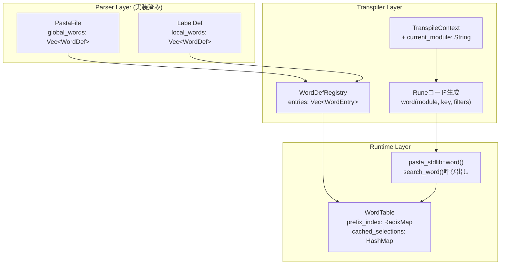
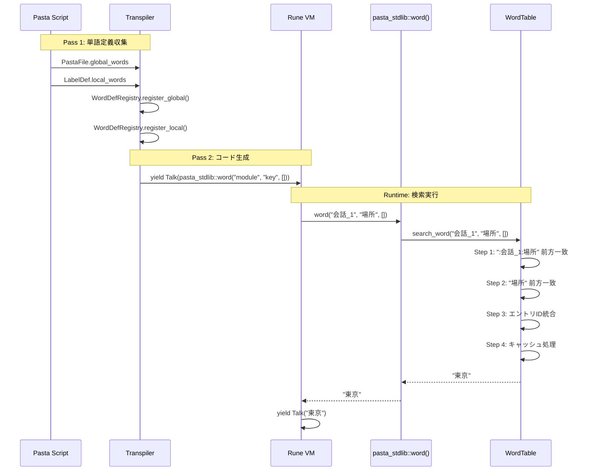
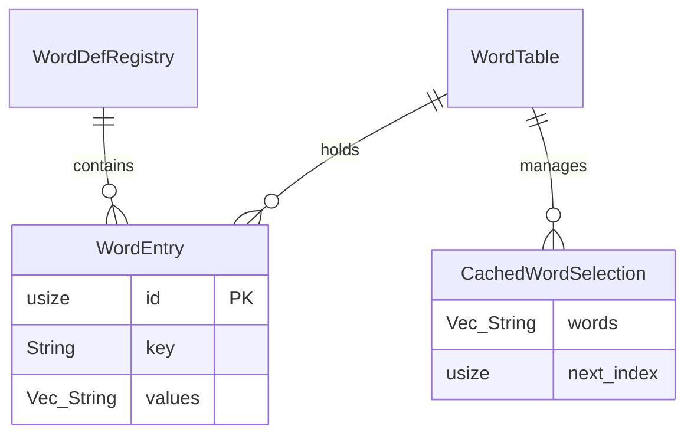

# 技術設計書: pasta-word-definition-dsl

## Overview

**Purpose**: 本機能はPasta DSLに単語定義機能を追加し、スクリプト作成者が`＠場所：東京　大阪`のような簡潔な構文で単語リストを定義し、会話行内から`＠場所`でランダム選択・展開できるようにする。

**Users**: Pasta DSLでデスクトップマスコット（伺か）のスクリプトを作成する開発者が、会話の多様性を高めるために使用する。

**Impact**: 既存の前方一致ラベル機構を補完し、より軽量で直感的な単語管理を実現。パーサー層は実装済みのため、本設計はトランスパイラ層とランタイム層に焦点を当てる。

### Goals
- トランスパイラ層: `WordDefRegistry`による単語定義収集とRuneコード生成
- ランタイム層: `WordTable`による前方一致検索とシャッフルキャッシュ
- 2段階検索: ローカル（`:module:key`前方一致）→ グローバル（`key`前方一致）→ 統合
- シャッフルキャッシュによる重複回避ランダム選択

### Non-Goals
- 外部ファイルからの単語辞書読み込み（将来機能）
- 単語定義のホットリロード
- call/jump構文からの単語辞書アクセス（明示的に除外 - 要件6）
- パーサー層の変更（実装済み、スコープ外）

---

## Architecture

### Existing Architecture Analysis

Pasta DSLは以下の層構造で構成される：

| Layer | 責務 | 主要ファイル | 本機能での変更 |
|-------|------|-------------|---------------|
| Parser | PEG文法によるAST生成 | `pasta.pest`, `ast.rs` | なし（実装済み） |
| Transpiler | AST→Runeコード変換 | `transpiler/mod.rs`, `label_registry.rs` | `WordDefRegistry`追加 |
| Runtime | Rune VM実行、テーブル管理 | `runtime/labels.rs` | `WordTable`追加 |
| Stdlib | Rune側関数提供 | `stdlib/mod.rs` | `word()`実装変更 |

**既存パターンの活用**:
- `LabelRegistry`: トランスパイラ層でラベルを収集、IDを採番 → `WordDefRegistry`で踏襲
- `LabelTable`: ランタイム層で前方一致検索、シャッフルキャッシュ → `WordTable`で踏襲
- `RadixMap<Vec<usize>>`: 前方一致インデックス（キー → エントリIDリスト）

### Architecture Pattern & Boundary Map



**アーキテクチャ選択**: LabelRegistry/LabelTableパターン踏襲（詳細は`research.md`参照）

### Technology Stack

| Layer | Choice / Version | Role in Feature | Notes |
|-------|------------------|-----------------|-------|
| Transpiler | Rust 2024 | WordDefRegistry実装、コード生成 | 既存パターン踏襲 |
| Runtime | Rust 2024 + Rune 0.14 | WordTable実装、stdlib関数 | LabelTableと同構造 |
| Data Structure | fast_radix_trie 1.1.0 | RadixMap前方一致検索 | 既存依存、追加なし |
| Random | rand 0.9 | シャッフル処理 | 既存依存 |

---

## System Flows

### 単語検索フロー



**フロー説明**:
1. Pass 1でWordDefRegistryに全単語定義を収集
2. Pass 2でRuneコードを生成（`word(module, key, filters)`呼び出し）
3. Runtime実行時にWordTableで2段階前方一致検索
4. シャッフルキャッシュから単語を選択して返却

---

## Requirements Traceability

| Requirement | Summary | Components | Interfaces | Flows |
|-------------|---------|------------|------------|-------|
| 1.1-1.7 | グローバルスコープ単語定義 | WordDefRegistry, WordTable | register_global() | Pass 1 |
| 2.1-2.7 | ローカルスコープ単語定義 | WordDefRegistry, WordTable | register_local() | Pass 1 |
| 3.1-3.8 | 会話内での単語参照と展開 | Transpiler, Stdlib | word(), Talk() | Pass 2 + Runtime |
| 4.1-4.8 | 前方一致による複合検索 | WordTable | search_word() | Runtime |
| 5.1-5.8 | AST構造と内部データ表現 | WordDefRegistry, WordTable | WordEntry | 全フェーズ |
| 6.1-6.4 | Call/Jump文からの非アクセス | (変更なし) | - | - |
| 7.1-7.3 | エラーハンドリングと診断 | WordTable, Stdlib | Result型 | Runtime |
| 8.1-8.9 | ドキュメント更新 | - | - | - |
| 9.1-9.5 | テスト可能性と検証 | 全コンポーネント | - | - |

---

## Components and Interfaces

### Summary

| Component | Domain/Layer | Intent | Req Coverage | Key Dependencies | Contracts |
|-----------|--------------|--------|--------------|------------------|-----------|
| WordDefRegistry | Transpiler | 単語定義収集とエントリ管理 | 1, 2, 5 | LabelRegistry (P0) | Service |
| WordTable | Runtime | 前方一致検索とキャッシュ管理 | 1, 2, 4, 5, 7 | RadixMap (P0), RandomSelector (P0) | Service |
| TranspileContext拡張 | Transpiler | モジュール名伝播 | 3 | - | State |
| pasta_stdlib::word() | Stdlib | ランタイム単語検索API | 3, 4, 7 | WordTable (P0) | Service |

---

### Transpiler Layer

#### WordDefRegistry

| Field | Detail |
|-------|--------|
| Intent | 単語定義の収集、エントリID採番、キー形式管理 |
| Requirements | 1.1-1.7, 2.1-2.7, 5.5-5.6 |

**Responsibilities & Constraints**
- グローバル単語定義を`key`形式で登録
- ローカル単語定義を`:module:key`形式で登録
- エントリ単位で保持（早期マージなし）
- LabelRegistryと並行してPass 1で使用

**Dependencies**
- Inbound: Transpiler::transpile_pass1() — 単語定義収集 (P0)
- Outbound: WordTable::from_word_def_registry() — ランタイムテーブル構築 (P0)

**Contracts**: Service [x]

##### Service Interface
```rust
/// 単語エントリ（マージなしの個別定義）
pub struct WordEntry {
    /// エントリID（Vec<WordEntry>のインデックス）
    pub id: usize,
    /// 検索キー（グローバル: "key", ローカル: ":module:key"）
    pub key: String,
    /// 単語リスト
    pub values: Vec<String>,
}

/// 単語定義レジストリ（トランスパイラ層）
pub struct WordDefRegistry {
    entries: Vec<WordEntry>,
}

impl WordDefRegistry {
    /// 新規レジストリ作成
    pub fn new() -> Self;
    
    /// グローバル単語を登録
    /// - name: 単語名（例: "挨拶"）
    /// - values: 単語リスト
    /// - returns: 割り当てられたエントリID
    pub fn register_global(&mut self, name: &str, values: Vec<String>) -> usize;
    
    /// ローカル単語を登録
    /// - module_name: サニタイズ済みモジュール名（例: "会話_1"）
    /// - name: 単語名（例: "挨拶"）
    /// - values: 単語リスト
    /// - returns: 割り当てられたエントリID
    pub fn register_local(
        &mut self, 
        module_name: &str, 
        name: &str, 
        values: Vec<String>
    ) -> usize;
    
    /// 全エントリを取得
    pub fn all_entries(&self) -> &[WordEntry];
    
    /// サニタイズ関数（LabelRegistryと同一ロジック）
    pub fn sanitize_name(name: &str) -> String;
}
```

**Preconditions**:
- `name`は空文字列でないこと
- `values`は空でないこと（パーサーが保証）

**Postconditions**:
- エントリIDは0から連番で採番
- グローバルキーは`"name"`形式
- ローカルキーは`":module_name:name"`形式

**Implementation Notes**
- `sanitize_name()`は`LabelRegistry::sanitize_name()`と同一ロジックを使用
- 将来の属性フィルタリング用にフィールド拡張の余地を残す

---

#### TranspileContext拡張

| Field | Detail |
|-------|--------|
| Intent | 現在のモジュール名をコード生成に伝播 |
| Requirements | 3.2 |

**Responsibilities & Constraints**
- 現在トランスパイル中のグローバルラベル名（サニタイズ済み）を保持
- `transpile_speech_part_to_writer()`に渡す

**Contracts**: State [x]

##### State Management
```rust
/// トランスパイルコンテキスト（既存構造体への追加）
pub struct TranspileContext {
    // ... 既存フィールド ...
    
    /// 現在のモジュール名（サニタイズ済みグローバルラベル名）
    pub current_module: String,
}

impl TranspileContext {
    /// モジュール名を設定
    pub fn set_current_module(&mut self, module_name: String);
    
    /// モジュール名を取得
    pub fn current_module(&self) -> &str;
}
```

**Implementation Notes**
- `transpile_global_label()`でモジュール名を設定
- `transpile_speech_part_to_writer()`でモジュール名を使用

---

### Runtime Layer

#### WordTable

| Field | Detail |
|-------|--------|
| Intent | 前方一致検索、シャッフルキャッシュ、ランダム単語選択 |
| Requirements | 1.7, 2.6-2.7, 4.1-4.8, 5.7-5.8, 7.1-7.2 |

**Responsibilities & Constraints**
- `RadixMap<Vec<usize>>`で前方一致インデックス構築
- `(module_name, key)`タプルでキャッシュ分離
- シャッフル＋Pop方式でランダム選択
- マッチなし時は空文字列返却（panic禁止）

**Dependencies**
- Inbound: pasta_stdlib::word() — 検索要求 (P0)
- Inbound: WordDefRegistry — テーブル構築 (P0)
- Outbound: RandomSelector — シャッフル処理 (P0)
- External: fast_radix_trie::RadixMap — 前方一致検索 (P0)

**Contracts**: Service [x] / State [x]

##### Service Interface
```rust
use fast_radix_trie::RadixMap;
use std::collections::HashMap;

/// キャッシュキー（モジュール名 + 検索キー）
#[derive(Debug, Clone, PartialEq, Eq, Hash)]
pub struct WordCacheKey {
    pub module_name: String,
    pub search_key: String,
}

/// キャッシュ済み選択状態
struct CachedWordSelection {
    /// シャッフル済み単語リスト
    words: Vec<String>,
    /// 次に返す単語のインデックス
    next_index: usize,
}

/// 単語テーブル（ランタイム層）
pub struct WordTable {
    /// 単語エントリ保持（ID = Vecインデックス）
    entries: Vec<WordEntry>,
    /// 前方一致インデックス（キー → エントリIDリスト）
    prefix_index: RadixMap<Vec<usize>>,
    /// シャッフルキャッシュ（(module, key) → CachedWordSelection）
    cached_selections: HashMap<WordCacheKey, CachedWordSelection>,
    /// ランダムセレクタ
    random_selector: Box<dyn RandomSelector>,
}

impl WordTable {
    /// WordDefRegistryからテーブルを構築
    pub fn from_word_def_registry(
        registry: WordDefRegistry,
        random_selector: Box<dyn RandomSelector>,
    ) -> Self;
    
    /// 単語検索（メインAPI）
    /// - module_name: 呼び出し元モジュール名
    /// - key: 検索キー
    /// - filters: 属性フィルタ（将来用、現在は未使用）
    /// - returns: Ok(単語) or Err(PastaError::WordNotFound)
    pub fn search_word(
        &mut self, 
        module_name: &str, 
        key: &str, 
        filters: &[String]
    ) -> Result<String, PastaError>;
    
    /// テスト用: シャッフル無効化
    pub fn set_shuffle_enabled(&mut self, enabled: bool);
}
```

**search_word()アルゴリズム**:
```
Step 1: ローカル検索
  - prefix_index で ":module_name:key" 前方一致
  - マッチしたエントリIDリストを取得（ヒットなしなら空リスト）

Step 2: グローバル検索（常に実行）
  - prefix_index で "key" 前方一致
  - マッチしたエントリIDリストを取得

Step 3: 統合とマージ
  - ローカルとグローバルのエントリIDリストを結合
  - 結合IDリストから各 entries[id].values を順次取得
  - Vec::extend ですべての単語リストをマージ

Step 4: キャッシュ処理
  - キャッシュキー (module_name, key) でマッチを確認
  - キャッシュ未作成時: マージした単語リストをシャッフルして格納
  - キャッシュ存在時: 残り単語から1つをPop
  - 残り単語がない場合: 全単語を再シャッフル

Step 5: 返却
  - 選択された単語をOk(word)で返却
  - マッチなし時はErr(PastaError::WordNotFound { key })を返却
```

**Preconditions**:
- `from_word_def_registry()`でテーブル構築済み

**Postconditions**:
- 同一(module, key)ペアは枯渇まで重複なし
- エントリ追加順序に依存しない（シャッフルで公平化）

**Implementation Notes**
- `LabelTable`の`CachedSelection`パターンを参考に実装
- `history`フィールドは不要（単語選択履歴の追跡は要件にない）

---

### Stdlib Layer

#### pasta_stdlib::word()

| Field | Detail |
|-------|--------|
| Intent | Runeからの単語検索APIエントリポイント |
| Requirements | 3.2-3.6, 7.1-7.2 |

**Responsibilities & Constraints**
- `WordTable::search_word(module_name, key, filters)`を呼び出し
- `filters`引数をそのまま伝播（現在未使用、将来拡張用）
- 結果をそのまま文字列で返却
- `Talk()`ラッピングはトランスパイラが生成

**Dependencies**
- Inbound: Runeコード — word()呼び出し (P0)
- Outbound: WordTable — search_word() (P0)

**Contracts**: Service [x]

##### Service Interface
```rust
/// 単語検索関数（Rune側から呼び出し）
/// 
/// # Arguments
/// * `module_name` - 呼び出し元モジュール名（サニタイズ済み）
/// * `key` - 検索キー
/// * `filters` - 属性フィルタ（将来用、現在は未使用）
/// 
/// # Returns
/// 選択された単語文字列（エラー時は空文字列）
/// 
/// # Error Handling
/// - WordNotFound: WARNログ発行、空文字列返却
/// - その他エラー: ERRORログ発行、空文字列返却
/// - panic禁止（no panic原則）
pub fn word(
    module_name: String,
    key: String,
    filters: rune::runtime::Value,
) -> String;
```

**Implementation Notes**
- 現行実装の`word(ctx, word, args)`から`word(module_name, key, filters)`に変更
- `WordTable`への参照は`Mutex<WordTable>`でラップ（`select_label_to_id`と同様）
- `WordTable::search_word()`呼び出し：
  - `Ok(word)` → そのまま`word`を返却
  - `Err(PastaError::WordNotFound)` → WARNログ発行、`""`返却
  - その他`Err` → ERRORログ発行、`""`返却
- Rune側にエラーを伝播せず、常に`String`返却（no panic原則）

---

## Data Models

### Domain Model



**集約境界**:
- `WordDefRegistry`: トランスパイラ層の集約ルート（Pass 1でのみ変更）
- `WordTable`: ランタイム層の集約ルート（実行中に変更）

**不変条件**:
- `WordEntry.id`は`Vec<WordEntry>`のインデックスと一致
- `WordEntry.key`はグローバル（`"name"`）またはローカル（`":module:name"`）形式
- `CachedWordSelection.next_index <= words.len()`

### Logical Data Model

**キー形式設計**:

| スコープ | キー形式 | 例 |
|---------|---------|---|
| グローバル | `"単語名"` | `"挨拶"`, `"場所"`, `"場所_日本"` |
| ローカル | `":モジュール名:単語名"` | `":会話_1:挨拶"`, `":会話_1:場所"` |

**前方一致検索パターン**:

| 検索キー | マッチ対象（グローバル） | マッチ対象（ローカル） |
|---------|----------------------|---------------------|
| `"場所"` | `"場所"`, `"場所_日本"`, `"場所_外国"` | - |
| `":会話_1:場所"` | - | `":会話_1:場所"`, `":会話_1:場所_日本"` |

**インデックス構造**:
```
RadixMap<Vec<usize>>:
  "挨拶" → [0]
  "場所" → [1, 2]
  "場所_日本" → [2]
  ":会話_1:挨拶" → [3]
  ":会話_1:場所" → [4]
```

---

## Error Handling

### Error Strategy

| エラー種別 | 発生箇所 | 対応 | ログ |
|-----------|---------|------|------|
| 単語未発見 | search_word() | Err(WordNotFound) | - |
| レジストリ構築失敗 | from_word_def_registry() | Err(PastaError) | ERROR |
| 単語未発見 | word() | 空文字列返却 | WARN |
| キャッシュロック失敗 | word() | 空文字列返却 | ERROR |

**内部APIと公開APIの分離**:
- **内部API** (`WordTable::search_word`): `Result<String, PastaError>`返却、テスト可能性高
- **公開API** (`pasta_stdlib::word`): `String`返却、エラー時はログ発行のみ、no panic

### Error Categories and Responses

**Runtime Errors (Graceful Degradation)**:
- 単語辞書で見つからない → 空文字列として処理を継続（panic禁止）
- エラーログ出力：「単語定義 @場所 が見つかりません」

**Validation Errors**:
- 空のキーでの検索 → 空文字列返却、WARNログ

---

## Testing Strategy

### Unit Tests

| テスト対象 | テスト内容 | ファイル |
|-----------|----------|---------|
| WordDefRegistry | register_global/local、キー形式検証 | `tests/pasta_transpiler_word_registry_test.rs` |
| WordTable | search_word、前方一致、キャッシュ動作 | `tests/pasta_runtime_word_table_test.rs` |
| pasta_stdlib::word() | Rune統合、エラーハンドリング | `tests/pasta_stdlib_word_test.rs` |

### Integration Tests

| テスト内容 | 検証ポイント | ファイル |
|-----------|------------|---------|
| Pass 1収集 | global_words/local_wordsからの収集 | `tests/pasta_integration_word_definition_test.rs` |
| Pass 2生成 | word()呼び出しコード生成 | `tests/pasta_integration_word_definition_test.rs` |
| E2Eフロー | 定義→参照→出力 | `tests/pasta_integration_word_definition_test.rs` |

### Edge Case Tests

| ケース | 期待動作 |
|-------|---------|
| 同名グローバル定義×複数 | 全エントリの単語を統合 |
| ローカル+グローバル同名 | 両方を統合（優先順位なし） |
| 前方一致で複数マッチ | 全マッチの単語を統合 |
| キャッシュ枯渇 | 再シャッフルして継続 |
| 単語未発見 | 空文字列返却、ログ出力 |
| call/jumpから単語参照 | ラベル/関数検索のみ（単語辞書不参照） |

---

## Security Considerations

- **入力検証**: 単語名・単語値はパーサーが検証済み（トランスパイラは信頼）
- **リソース枯渇**: キャッシュサイズは(module, key)ペア数に比例（実用上問題なし）

---

## Performance & Scalability

### Target Metrics

| 指標 | 目標値 | 測定方法 |
|------|-------|---------|
| 前方一致検索 | O(M) ※M=キー長 | RadixMap.iter_prefix() |
| キャッシュヒット | O(1) | HashMap lookup |
| メモリ | 数千エントリで < 1MB | ベンチマーク |

### Optimization Notes

- RadixMapは既にLabelTableで実績あり
- シャッフルは初回/再シャッフル時のみ（O(N)）
- キャッシュは(module, key)ペアでのみ生成（不要なキャッシュ抑制）

---

## Supporting References

### Runeコード生成例

**Before (現行)**:
```rune
yield Talk(pasta_stdlib::word(ctx, "場所", []));
```

**After (本設計)**:
```rune
yield Talk(pasta_stdlib::word("会話_1", "場所", []));
```

### キー生成ロジック

```rust
impl WordDefRegistry {
    fn make_local_key(module_name: &str, name: &str) -> String {
        format!(":{}:{}", Self::sanitize_name(module_name), name)
    }
    
    fn make_global_key(name: &str) -> String {
        name.to_string()
    }
}
```

---

## Summary

本設計は以下の原則に従う：

1. **既存パターン踏襲**: LabelRegistry/LabelTableのパターンを完全に再利用
2. **2層分離**: トランスパイラ層(WordDefRegistry) + ランタイム層(WordTable)
3. **キー形式によるスコープ区別**: コロンプレフィックスでローカル/グローバルを分離
4. **シャッフルキャッシュ**: 重複回避のためのPop方式ランダム選択
5. **Graceful Degradation**: エラー時は空文字列返却、panic禁止

詳細な調査結果とアーキテクチャ決定の根拠は`research.md`を参照。
