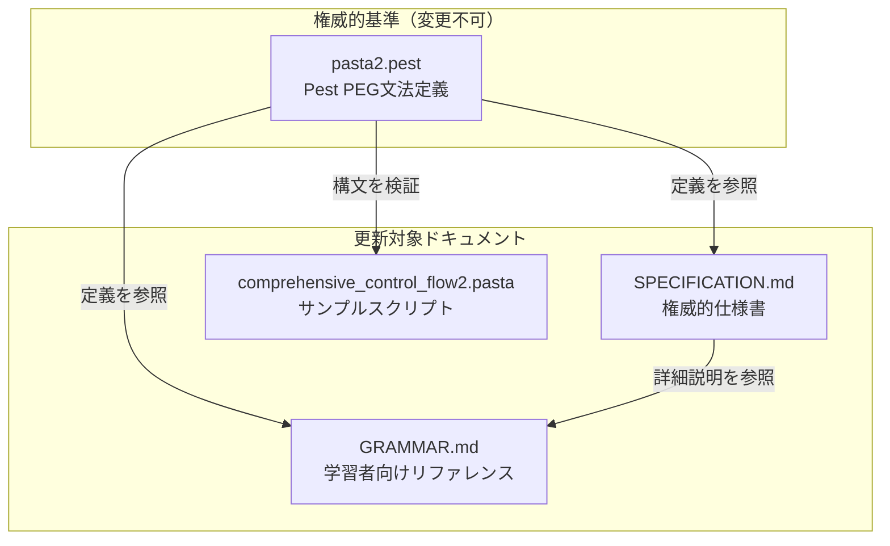

# Technical Design Document

## Overview

**目的**: 本設計は、`pasta2.pest`文法定義（権威的基準・変更不可）と既存ドキュメント（SPECIFICATION.md、GRAMMAR.md）およびサンプルスクリプト（comprehensive_control_flow2.pasta）の間の不整合を解消するためのドキュメント更新計画を定める。

**対象**: ドキュメント執筆者、学習者、パーサー開発者

**影響**: 3ファイルの内容更新のみ。Rustプログラムコード変更なし。

### Goals
- pasta2.pest文法定義を唯一の権威として確立
- SPECIFICATION.md / GRAMMAR.md の文法説明を pasta2.pest と完全一致
- comprehensive_control_flow2.pasta を有効なテストフィクスチャとして整備
- 廃止構文の削除、新規構文（式サポート、グローバル変数）の反映

### Non-Goals
- Rustパーサー/トランスパイラー/ランタイムのコード変更
- pasta2.pest 文法定義自体の変更
- 新規機能の追加（ドキュメント整合のみ）

---

## Architecture

### Existing Architecture Analysis

本仕様は**ドキュメント更新のみ**であり、アーキテクチャ変更を伴わない。

**対象ファイル構成**:

| ファイル | 種別 | 行数 | 役割 | 修正タイプ |
|---------|------|------|------|-----------|
| SPECIFICATION.md | 仕様書 | 1,210 | 権威的文法仕様（パーサー実装用） | セクション更新・追加 |
| GRAMMAR.md | リファレンス | 625 | 学習者向け文法ガイド | セクション更新・例追加 |
| comprehensive_control_flow2.pasta | サンプル | ~70 | テストフィクスチャ | Runeブロック追加 |

**権威的基準**:
- `src/parser/pasta2.pest`: Pest PEG文法定義（変更不可）

### Architecture Pattern & Boundary Map



**アプローチ**: Option A（最小修正アプローチ）
- 既存ドキュメント構造を維持
- 不足セクション追加と矛盾解決に集中
- 複雑度: S（1-3日）、リスク: 低

### Technology Stack

| レイヤー | 選択 | 役割 | 備考 |
|---------|------|------|------|
| 文法定義 | pasta2.pest (Pest 2.8) | PEG文法生成器 | 変更不可、権威的基準 |
| ドキュメント | Markdown | 仕様書・リファレンス | 構造維持 |
| サンプル | .pasta | テストフィクスチャ | Runeブロック追加のみ |

---

## Requirements Traceability

| 要件 | 概要 | 対象コンポーネント | 修正内容 |
|------|------|-------------------|---------|
| 1.1-1.5 | pasta2.pest文法の権威性確立 | SPEC, GRAM, SAMPLE | 矛盾記述削除、定義優先 |
| 2.1-2.15 | SPECIFICATION.md文法整合性 | SPEC | 式セクション更新、グローバル変数追加 |
| 3.1-3.10 | GRAMMAR.md学習者向け整合性 | GRAM | 式例追加、グローバル変数例追加 |
| 4.1-4.11 | サンプルのパース可能性 | SAMPLE | Runeブロック関数追加 |
| 5.1-5.5 | ドキュメント間一貫性 | SPEC, GRAM, SAMPLE | 用語・構文統一 |
| 6.1-6.9 | 廃止構文完全削除 | SPEC, GRAM, SAMPLE | Jump文、全角\\ 削除確認 |
| 7.1-7.8 | 新規構文完全反映 | SPEC, GRAM | 式サポート、グローバル変数記載 |

---

## Components and Interfaces

### ドキュメント修正コンポーネント

| コンポーネント | ドメイン | 意図 | 要件カバレッジ | 依存関係 |
|---------------|---------|------|---------------|---------|
| SPECIFICATION.md更新 | 仕様書 | pasta2.pestとの完全一致 | 1, 2, 5, 6, 7 | pasta2.pest (P0) |
| GRAMMAR.md更新 | リファレンス | 学習者向け正確な例示 | 1, 3, 5, 6, 7 | SPECIFICATION.md (P1), pasta2.pest (P0) |
| サンプル更新 | テスト | パース可能なフィクスチャ | 1, 4, 5, 6 | pasta2.pest (P0) |

---

### SPECIFICATION.md更新

| フィールド | 詳細 |
|----------|------|
| 意図 | pasta2.pest文法定義と完全一致する権威的仕様書を維持 |
| 要件 | 1.1-1.5, 2.1-2.15, 5.1-5.5, 6.1-6.3, 7.1-7.2 |

**責務と制約**
- pasta2.pestで定義されたすべての構文要素を正確に反映
- 廃止構文（Jump文、全角\\）を使用例として記載しない
- 新規構文（式サポート、グローバル変数）を詳細に説明

**修正箇所**

#### 修正1: 1.3節「式の制約」→「式（Expression）のサポート」

**現状**: 「式を記述できない」と説明
**pasta2.pest**: `expr = { term ~ s ~ bin* }` で式をサポート定義
**修正**: セクション名を「式（Expression）のサポート」に改名し、以下を記載

```markdown
## 1.3 式（Expression）のサポート

パスタスクリプトでは式（Expression）を記述できます。式は変数代入、関数引数、条件式などで使用されます。

### 式の構文

| 要素 | pasta2.pest規則 | 説明 |
|------|----------------|------|
| 式 | `expr = { term ~ s ~ bin* }` | 項と二項演算の組み合わせ |
| 項 | `term = { unary | primary }` | 単項演算または基本値 |
| 二項演算 | `bin = { bin_op ~ s ~ term ~ s }` | 演算子と右辺項 |
| 演算子 | `bin_op = { "+" \| "-" \| "*" \| "/" \| "%" \| ... }` | 算術・比較・論理演算子 |

### 使用例

```pasta
＄count＝10 + 5        # 算術式
＄result＝＄a * ＄b    # 変数を含む式
＠func（＄x + 1）      # 関数引数での式
```
```

#### 修正2: 2.3節「変数」にローカル変数とグローバル変数の有効範囲説明を追加

**現状**: ローカル変数のみ説明、有効範囲の明示なし
**pasta2.pest**: `var_ref_global = { var_marker ~ global_marker ~ id ~ s }` を定義
**修正**: ローカル変数の有効範囲説明を追加し、グローバル変数サブセクションを追加

```markdown
### 2.3.2 ローカル変数

ローカル変数は一連のシーンが終わるまで有効な変数です。

| 構文 | pasta2.pest規則 | 説明 |
|------|----------------|------|
| 参照 | `var_ref = { var_marker ~ id ~ s }` | `＄変数名` |
| 代入 | `var_set = { var_marker ~ id ~ s ~ set_marker ~ s ~ expr }` | `＄変数名＝値` |

### 2.3.3 グローバル変数

グローバル変数は永続的に有効な変数です。

| 構文 | pasta2.pest規則 | 説明 |
|------|----------------|------|
| 参照 | `var_ref_global = { var_marker ~ global_marker ~ id ~ s }` | `＄＊変数名` |
| 代入 | `var_set_global = { var_marker ~ global_marker ~ id ~ s ~ set_marker ~ s ~ expr }` | `＄＊変数名＝値` |

### 使用例

```pasta
＄ローカル変数＝10       # ローカル変数代入（一連のシーンが終わるまで有効）
＄＊グローバル変数＝100  # グローバル変数代入（永続的）
Alice：値は ＄ローカル変数 です
Bob：値は ＄＊グローバル変数 です
```
```

#### 修正3: 4.1節「Call ターゲットの形式」からグローバルシーン参照を削除

**現状**: 4.1節に「パターン1: グローバルシーン参照」（`＊シーン`, `>*シーン`）の説明が存在
**pasta2.pest**: `call_scene_global` は存在しない（削除済み）
**決定**: グローバルシーン呼び出しの概念は廃止、`>シーン` に統一
**修正**: 
- パターン1（グローバルシーン参照）を削除
- パターン2（ローカルシーン参照）を「シーン参照」に変更
- 説明を追加: 「呼び出されるシーンは、そのアクションスコープから参照できるローカル・グローバルシーン全てから選択されます」

```markdown
### 4.1 Call ターゲットの形式

Call は以下のターゲット形式をサポート：

#### パターン1: シーン参照
```text
call_target ::= call_marker ~ id
例: ＞選択肢1
   >choice1
```

**セマンティクス**: アクションスコープから参照できるローカル・グローバルシーン全てから、指定名のシーンを検索して呼び出す

#### パターン2: 動的ターゲット
```text
call_target ::= call_marker ~ var_ref
例: ＞＄target_label
   >$dynamic_choice
```

**セマンティクス**: 変数の値をシーン名として解決
```

#### 修正4: 9.1節「変数型」の有効範囲説明を更新

**現状**: グローバル変数「ファイル全体」、ローカル変数「親ローカルシーン内」
**正しい表現**: グローバル変数「永続的」、ローカル変数「一連のシーンが終わるまで」
**修正**: スコープ説明を更新

```markdown
#### グローバル変数
```pasta
宣言: ＄＊var_name ： value
参照: ＄＊var_name
```

**スコープ**: 永続的

#### ローカル変数
```pasta
宣言: ＄var_name ： value
参照: ＄var_name
```

**スコープ**: 一連のシーンが終わるまで
```

---

### GRAMMAR.md更新

| フィールド | 詳細 |
|----------|------|
| 意図 | 学習者向けに正確な文法例を提供 |
| 要件 | 1.1-1.5, 3.1-3.10, 5.1-5.5, 6.4-6.6, 7.6 |

**責務と制約**
- pasta2.pestで定義された文法規則に基づいた例を提供
- 廃止構文を「使用可能」として記載しない
- 新規構文（式サポート、グローバル変数）の例を追加

**修正箇所**

#### 修正1: 3.5節「式の制約」→「式（Expression）のサポート」

**現状**: 「式は記述できない」と説明
**修正**: セクション全体を置換

```markdown
## 3.5 式（Expression）のサポート

パスタスクリプトでは式を記述できます。

### 基本構文

```pasta
＄変数名＝10 + 5           # 算術式
＄結果＝＄a * ＄b           # 変数を含む式
＠関数（＄x + 1, "引数"）  # 関数引数での式
```

### 対応演算子

| 種別 | 演算子 |
|------|--------|
| 算術 | `+`, `-`, `*`, `/`, `%` |
| 比較 | `==`, `!=`, `<`, `>`, `<=`, `>=` |
| 論理 | `&&`, `\|\|`, `!` |

詳細は SPECIFICATION.md 1.3節を参照。
```

#### 修正2: 変数セクションにローカル変数とグローバル変数の有効範囲説明を追加

**現状**: ローカル変数例のみ、有効範囲の明示なし
**修正**: ローカル変数の有効範囲説明を追加し、グローバル変数例を追加

```markdown
### ローカル変数

ローカル変数は一連のシーンが終わるまで有効な変数です。

```pasta
＄ローカル変数＝10  # ローカル変数代入（一連のシーンが終わるまで有効）
Alice：値は ＄ローカル変数 です
```

### グローバル変数

グローバル変数は永続的に有効な変数です。

```pasta
＄＊グローバル変数＝100  # グローバル変数代入（永続的）
Bob：値は ＄＊グローバル変数 です
```
```

#### 修正3: スコープ明示参照構文の説明を削除（スコープ兼用参照は保持）

**現状**: スコープ明示参照構文（`@*id`, `>*id`）の説明がある可能性
**正確な理解**:
- **スコープ明示あり**: `$*var` のみ（グローバル変数）
- **スコープ明示なし**: `@単語`、`>シーン` はスコープ兼用
  - グローバルシーン（`*シーン`）はアクションや呼び出しができない定義位置のみ
  - グローバルシーン内のローカルシーン（`・シーン`）が呼び出し対象
  - `>シーン` は定義側スコープ（グローバル/ローカル）のローカルシーン部分を検索

**削除対象**:
- `@*id`: 削除済み（グローバル単語を明示的に指定する構文 - pasta2.pestで実装不可）
- `>*id`: 削除済み（グローバルシーンを明示的に指定する構文 - pasta2.pestで実装不可）

**保持対象**: 
- `@単語キー`: グローバル単語定義（スコープ兼用、pasta2.pestで定義）
- `>シーン`: シーン参照（スコープ兼用、定義側スコープのローカルシーンを検索）
- `@単語`: 単語参照（スコープ兼用、定義側スコープから検索）

**修正**: スコープ明示参照構文（`@*id`, `>*id`）の説明のみ削除。スコープ兼用参照（`@単語`, `>シーン`）とグローバル単語定義セクションは保持

#### 修正4: 変数スコープテーブルの有効範囲説明を更新

**現状**: グローバル変数「ファイル全体」、ローカル変数「親シーン内」
**正しい表現**: グローバル変数「永続的」、ローカル変数「一連のシーンが終わるまで」
**修正**: 変数スコープテーブルを更新

```markdown
### 変数スコープ

| スコープ | 宣言 | 参照 | 有効範囲 |
|---------|------|------|---------|
| ローカル | `＄var_name：値` | `＄var_name` | 一連のシーンが終わるまで |
| グローバル | `＄＊var_name：値` | `＄＊var_name` | 永続的 |
```

#### 修正5: Callターゲットの形式テーブルからグローバルシーン参照を削除

**現状**: Callターゲットの形式テーブルに「グローバルシーン `＞＊シーン名`」が記載
**決定**: グローバルシーン呼び出しの概念は廃止、`>シーン` に統一
**修正**: テーブルからグローバルシーン行を削除、説明を更新

```markdown
### Callターゲットの形式

| 形式 | 構文 | 説明 |
|------|------|------|
| シーン参照 | `＞シーン名` | アクションスコープから参照できるローカル・グローバルシーン全てから選択 |
| 動的ターゲット | `＞＄変数名` | 変数値をシーン名として解決 |
```

---

### comprehensive_control_flow2.pasta更新

| フィールド | 詳細 |
|----------|------|
| 意図 | pasta2.pestで完全にパース可能なテストフィクスチャを提供 |
| 要件 | 1.5, 4.1-4.11, 5.1-5.5, 6.7-6.9 |

**責務と制約**
- pasta2.pestで認識可能な有効な構文のみを使用
- 廃止構文（Jump文、全角\\）を使用しない
- Runeブロックに有効な関数定義例を追加

**修正箇所**

#### 修正1: Runeブロックに関数定義例を追加

**現状**: 末尾のRuneブロックが空
**決定**: 有効な関数定義例を追加（議題3で確定）

```pasta
```rune
fn is_even(n) => n % 2 == 0
fn greet(name) => "Hello, " + name
```
```

#### 修正2: グローバル参照（@*id）の使用確認

**現状**: 行41に `＠＊天気` が存在
**pasta2.pest**: `word_ref_global` は存在しない（削除済み）
**修正**: `＠＊天気` → `＠天気`（ローカル・グローバル兼用）に変更

---

## Data Models

本仕様はドキュメント更新のみであり、データモデル変更を伴わない。

---

## Error Handling

本仕様はドキュメント更新のみであり、エラーハンドリング設計を伴わない。

**検証方法**:
1. SPECIFICATION.md / GRAMMAR.md の記述が pasta2.pest と一致することを目視確認
2. comprehensive_control_flow2.pasta を `cargo test` でパース可能か確認

---

## Testing Strategy

### 検証テスト

| テスト種別 | 対象 | 検証内容 |
|-----------|------|---------|
| パース検証 | comprehensive_control_flow2.pasta | pasta2.pestパーサーでエラーなくパース可能 |
| 目視確認 | SPECIFICATION.md | pasta2.pest定義との一致確認 |
| 目視確認 | GRAMMAR.md | pasta2.pest定義との一致確認、例の正確性 |

### 既存テスト

```bash
cargo test --all-features  # 既存テストが継続パス
```

---

## Implementation Notes

### 修正順序

1. **SPECIFICATION.md**: 式サポート説明追加、グローバル変数説明追加、Call文説明確認
2. **GRAMMAR.md**: 式セクション更新、グローバル変数例追加、グローバル参照削除
3. **comprehensive_control_flow2.pasta**: Runeブロック関数追加、@*天気 修正

### リスク

| リスク | 影響 | 緩和策 |
|--------|------|--------|
| 既存参照リンク破損 | 低 | セクション構造維持、改名は最小限 |
| 例の不正確さ | 低 | pasta2.pest定義を直接参照して例を作成 |
| テスト失敗 | 低 | 修正後に `cargo test` 実施 |

---

## Supporting References

- pasta2.pest: `src/parser/pasta2.pest` - 権威的文法定義
- GAP_ANALYSIS.md: `.kiro/specs/pasta2-grammar-document-alignment/GAP_ANALYSIS.md` - 既存ギャップ分析
- requirements.md: `.kiro/specs/pasta2-grammar-document-alignment/requirements.md` - 承認済み要件定義
