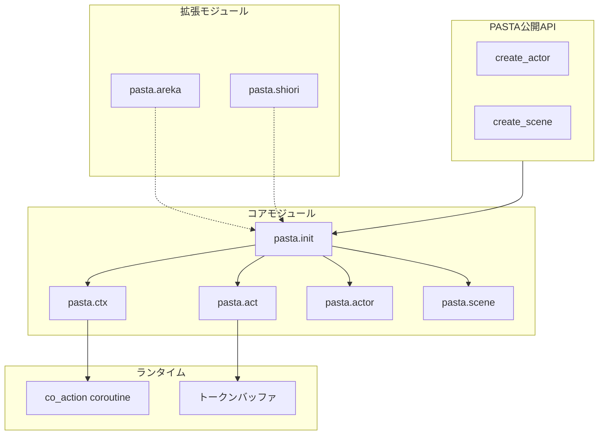
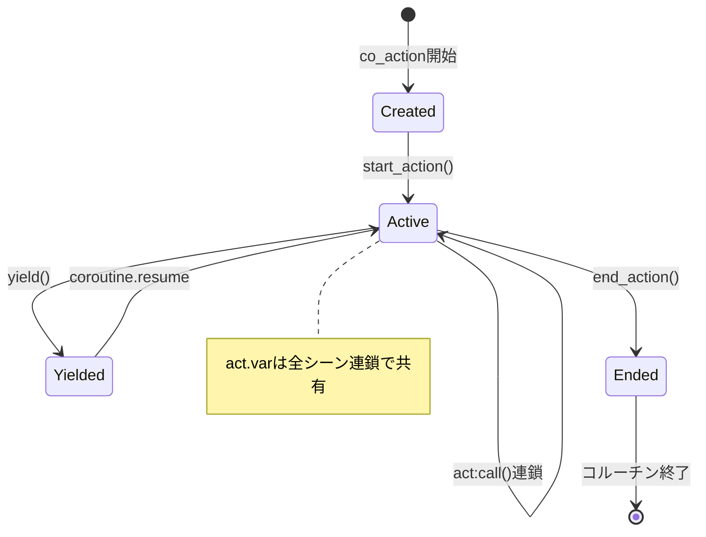
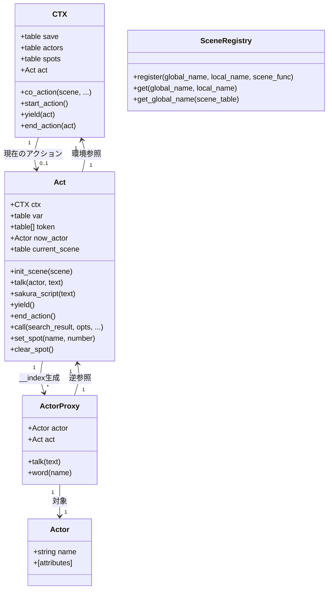
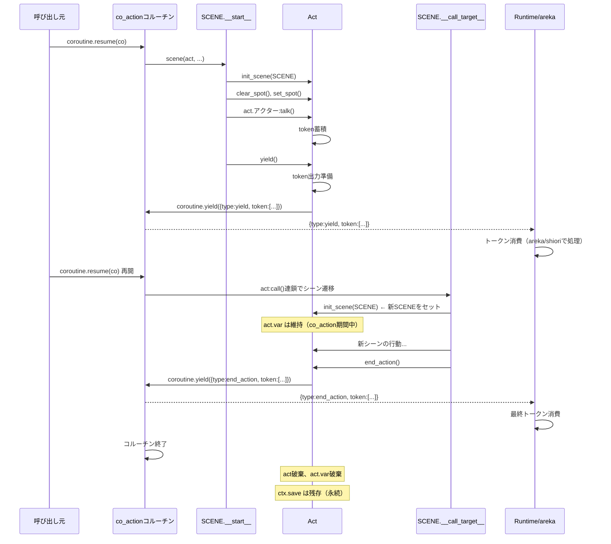

# Technical Design Document

## Overview

**Purpose**: pasta_lua Lua側の設計を整理し、Act-firstアーキテクチャに基づいた明確な責務分担とAPI仕様を定義する設計ドキュメント。

**Users**: pasta_lua開発者、トランスパイラ実装者、将来の拡張開発者

**Impact**: 現在の責務不明確なLuaモジュール設計を、映画撮影比喩に基づいた明確な構造に再定義する。

### Goals
- 5つのコアモジュール（init, ctx, act, actor, scene）の責務を明確に定義
- Act-firstアーキテクチャ（シーン関数がactを第1引数で受け取る）の確立
- Rust側code_generator.rsとの完全なAPI互換性の設計
- areka/shiori拡張ポイントの定義

### Non-Goals
- **本仕様での実装コード変更は対象外**（設計ドキュメントのみ）
- Rust側code_generator.rsの修正（別仕様で実施）
- areka/shioriの具体的実装

## Architecture

### 設計思想：映画撮影の比喩

| 概念       | 映画撮影         | pasta_lua                               |
| ---------- | ---------------- | --------------------------------------- |
| シーン関数 | 台本             | 撮影対象のシーン記述                    |
| act        | 「アクション！」 | 実行コンテキスト（トークン蓄積）        |
| ctx        | 撮影環境         | 永続的な環境情報（save, actors, spots） |

### Architecture Pattern & Boundary Map



**Architecture Integration**:
- **Selected pattern**: Act-first（シーン関数がactを第1引数で受け取る）
- **Domain boundaries**: 
  - init: 公開API提供
  - ctx: 環境管理（save, actors, spots）
  - act: アクション実行（トークン蓄積、actorプロキシ）
  - actor: アクター定義
  - scene: シーンレジストリ
- **Existing patterns preserved**: Luaメタテーブル、コルーチン
- **Steering compliance**: UI独立性、Yield型出力

### Technology Stack

| Layer      | Choice / Version | Role in Feature    | Notes                 |
| ---------- | ---------------- | ------------------ | --------------------- |
| Runtime    | Lua 5.4 (mlua)   | スクリプト実行環境 | pasta_lua crateで統合 |
| Transpiler | Rust / pasta_lua | Lua コード生成     | code_generator.rs     |
| Parser     | pasta_core       | AST生成            | 言語非依存層          |

## System Flows

### シーン実行フロー

```mermaid
sequenceDiagram
    participant Rust as Rust Runtime
    participant CTX as CTX
    participant Act as Act
    participant Scene as シーン関数
    participant Actor as アクタープロキシ
    
    Rust->>CTX: co_action(scene, ...)
    CTX->>Act: start_action()
    Act-->>CTX: act
    CTX->>Scene: scene(act, ...)
    Scene->>Act: init_scene(SCENE)
    Act-->>Scene: save, var
    Scene->>Actor: act.アクター
    Actor-->>Scene: proxy
    Scene->>Actor: proxy:talk(text)
    Actor->>Act: talk(actor, text)
    Act->>Act: token追加
    Scene->>Act: yield()
    Act->>CTX: yield(act)
    CTX-->>Rust: { type: yield, token: [...] }
    Scene->>Act: end_action()
    Act->>CTX: end_action(act)
    CTX-->>Rust: { type: end_action, token: [...] }
```

### actライフサイクル（co_actionコルーチン）



## Requirements Traceability

| Requirement | Summary        | Components                   | Interfaces                   | Flows      |
| ----------- | -------------- | ---------------------------- | ---------------------------- | ---------- |
| 1           | モジュール構造 | init, ctx, act, actor, scene | PASTA API                    | -          |
| 2           | CTX設計        | ctx                          | CTX.new, save, actors, spots | co_action  |
| 3           | Act設計        | act                          | Act API (17項目)             | シーン実行 |
| 4           | Actor設計      | actor                        | Actor API (8項目)            | -          |
| 5           | Scene設計      | scene                        | Scene API (11項目)           | シーン実行 |
| 6           | Spot管理       | act, ctx                     | set_spot, clear_spot         | -          |
| 7           | トークン出力   | act                          | トークン構造体               | シーン実行 |
| 8           | Rust互換性     | 全体                         | code_generator対応API        | -          |
| 9           | 拡張ポイント   | areka, shiori                | 拡張インターフェース         | -          |

## Components and Interfaces

### Components Summary

| Component    | Domain    | Intent           | Req Coverage                    | Key Dependencies  | Contracts      |
| ------------ | --------- | ---------------- | ------------------------------- | ----------------- | -------------- |
| pasta.init   | API       | 公開API提供      | 1.1-1.5                         | actor, scene      | Service        |
| pasta.ctx    | Runtime   | 環境管理         | 2.1-2.6, 6.4-6.5                | -                 | State          |
| pasta.act    | Runtime   | アクション実行   | 3.1-3.17, 6.1-6.3, 6.6, 7.1-7.6 | ctx, actor, scene | Service, State |
| pasta.actor  | Entity    | アクター定義     | 4.1-4.8                         | -                 | Service        |
| pasta.scene  | Registry  | シーンレジストリ | 5.1-5.11                        | -                 | Service        |
| pasta.areka  | Extension | areka拡張        | 9.1                             | init              | Service        |
| pasta.shiori | Extension | shiori拡張       | 9.2                             | init              | Service        |

---

### Core Modules

#### pasta.init

| Field        | Detail                                            |
| ------------ | ------------------------------------------------- |
| Intent       | 公開APIテーブル提供、外部からのエントリーポイント |
| Requirements | 1.1, 1.2, 1.3, 1.4, 1.5                           |

**Responsibilities & Constraints**
- `require "pasta"` で返すPASTA公開APIテーブルの提供
- グローバル状態汚染の防止（すべてローカルテーブル内に閉じる）
- 内部モジュールへのファサードとして機能

**Dependencies**
- Outbound: pasta.actor — create_actor委譲 (P0)
- Outbound: pasta.scene — create_scene委譲 (P0)

**Contracts**: Service [x]

##### Service Interface

```lua
--- @class PASTA 公開APIテーブル
--- @field create_actor fun(name: string): Actor アクター作成
--- @field create_scene fun(global_name: string, local_name: string, scene_func: function): void シーン登録

local PASTA = {}

--- アクターを作成または取得する（キャッシュ機構）
--- @param name string アクター名
--- @return Actor
function PASTA.create_actor(name)
    return ACTOR.get_or_create(name)
end

--- シーン関数をレジストリに登録する
--- @param global_name string グローバルシーン名（モジュール名）
--- @param local_name string ローカルシーン名（__start__, __name_N__ 等）
--- @param scene_func function シーン関数
function PASTA.create_scene(global_name, local_name, scene_func)
    SCENE.register(global_name, local_name, scene_func)
end
```

- Preconditions: なし
- Postconditions: APIテーブルがグローバル汚染なく返される
- Invariants: 内部状態は各サブモジュールが管理

---

#### pasta.ctx

| Field        | Detail                                   |
| ------------ | ---------------------------------------- |
| Intent       | 環境管理（永続変数、アクター、スポット） |
| Requirements | 2.1, 2.2, 2.3, 2.4, 2.5, 2.6             |

**Responsibilities & Constraints**
- save（永続変数）テーブルの保持
- actors（登録アクター）テーブルの保持
- spots（スポット割り当て）情報の保持
- co_actionコルーチンによるアクション実行制御
- actオブジェクトを内包（actがctxを参照する）

**Dependencies**
- Outbound: pasta.act — Act生成 (P0)

**Contracts**: State [x]

##### State Management

```lua
--- @class CTX 環境オブジェクト
--- @field save table 永続変数（コルーチン終了後も残る）
--- @field actors table<string, Actor> 登録アクター
--- @field spots table<string, integer> スポット割り当て
--- @field act Action|nil 現在のアクション

local CTX = {}
CTX.__index = CTX

--- 環境オブジェクトの新規作成
--- @param save table|nil 永続変数（省略時は空テーブル）
--- @param actors table<string, Actor>|nil アクター（省略時は空テーブル）
--- @return CTX
function CTX.new(save, actors)
    local obj = {
        save = save or {},
        actors = actors or {},
        spots = {},
        act = nil,
    }
    setmetatable(obj, CTX)
    return obj
end

--- コルーチンでアクションを実行する
--- @param scene function シーン関数
--- @return thread コルーチン
function CTX:co_action(scene, ...)
    local args = { ... }
    return coroutine.create(function()
        local act = self:start_action()
        scene(act, table.unpack(args))  -- act-first: actを第1引数で渡す
        if #act.token > 0 then
            act:end_action()
        end
    end)
end

--- アクションを開始する
--- @return Action
function CTX:start_action()
    local act = ACT.new(self)
    self.act = act
    return act
end

--- アクションをyieldする
--- @param act Action
function CTX:yield(act)
    local token = act.token
    act.token = {}
    act.now_actor = nil
    coroutine.yield({ type = "yield", token = token })
end

--- アクションを終了する
--- @param act Action
function CTX:end_action(act)
    local token = act.token
    act.token = {}
    coroutine.yield({ type = "end_action", token = token })
    self.act = nil
end
```

- Persistence: saveテーブルはコルーチン終了後も永続
- Consistency: 単一actのみアクティブ（self.act）
- Concurrency: コルーチンによる協調的マルチタスク

**Implementation Notes**
- varはCTXから削除、Act側に移動（2.6）
- spotsテーブルはact.set_spot/clear_spotで更新される

---

#### pasta.act

| Field        | Detail                                             |
| ------------ | -------------------------------------------------- |
| Intent       | アクション実行、トークン蓄積、アクタープロキシ提供 |
| Requirements | 3.1-3.17, 6.1-6.3, 6.6, 7.1-7.6                    |

**Responsibilities & Constraints**
- ctxへの参照を保持
- var（作業変数）テーブルの保持（アクション期間中のみ有効）
- tokenバッファへのトークン蓄積
- __indexメタメソッドによるアクタープロキシ提供
- 現在のSCENEへの参照保持（単語検索用）

**Dependencies**
- Inbound: pasta.ctx — Act生成 (P0)
- Outbound: pasta.actor — アクタープロキシ生成 (P0)
- Outbound: pasta.scene — シーン取得 (P0)

**Contracts**: Service [x] / State [x]

##### Service Interface

```lua
--- @class Act アクションオブジェクト
--- @field ctx CTX 環境オブジェクト
--- @field var table 作業変数（アクション期間中のみ有効）
--- @field token table[] トークンバッファ
--- @field now_actor Actor|nil 現在のアクター
--- @field current_scene table|nil 現在のSCENE

local ACT = {}

--- __indexメタメソッド: アクタープロキシを動的生成
--- @param key string プロパティ名
--- @return any
function ACT.__index(self, key)
    -- 組み込みプロパティの処理
    local raw = rawget(ACT, key)
    if raw then return raw end
    
    -- アクター名としてプロキシを生成
    local actor = self.ctx.actors[key]
    if actor then
        return ACTOR.create_proxy(actor, self)
    end
    return nil
end

--- アクションの新規作成
--- @param ctx CTX 環境オブジェクト
--- @return Act
function ACT.new(ctx)
    local obj = {
        ctx = ctx,
        var = {},  -- 作業変数（co_action期間中のみ有効）
        token = {},
        now_actor = nil,
        current_scene = nil,
    }
    setmetatable(obj, ACT)
    return obj
end

--- シーン初期化、save/var参照を返す
--- @param scene table SCENEテーブル
--- @return table save 永続変数への参照
--- @return table var 作業変数への参照
function ACT:init_scene(scene)
    self.current_scene = scene
    return self.ctx.save, self.var
end

--- talkトークンを蓄積
--- @param actor Actor アクター
--- @param text string テキスト
function ACT:talk(actor, text)
    if self.now_actor ~= actor then
        table.insert(self.token, { type = "actor", actor = actor })
        self.now_actor = actor
    end
    table.insert(self.token, { type = "talk", text = text })
end

--- sakura_scriptトークンを蓄積
--- @param text string さくらスクリプト
function ACT:sakura_script(text)
    table.insert(self.token, { type = "sakura_script", text = text })
end

--- トークンを出力しコルーチンをyield
function ACT:yield()
    table.insert(self.token, { type = "yield" })
    self.ctx:yield(self)
end

--- アクションを終了
function ACT:end_action()
    table.insert(self.token, { type = "end_action" })
    self.ctx:end_action(self)
end

--- 別シーンを呼び出す（act継続）
--- @param search_result table {global_name, local_name} タプル
--- @param opts table オプション（現在未使用）
--- @param ... any 引数
function ACT:call(search_result, opts, ...)
    local global_name, local_name = search_result[1], search_result[2]
    local scene_func = SCENE.get(global_name, local_name)
    if scene_func then
        scene_func(self, ...)  -- act継続
    end
end

--- スポットを設定（ctx内部を更新）
--- @param name string アクター名
--- @param number integer 立ち位置
function ACT:set_spot(name, number)
    self.ctx.spots[name] = number
end

--- 全スポットをクリア（ctx内部を更新）
function ACT:clear_spot()
    self.ctx.spots = {}
end
```

##### State Management

- State model: token配列（蓄積→出力→クリア）
- Persistence: var はco_action内で共有、終了時に消滅
- Concurrency: 単一act（CTXで保証）

**Implementation Notes**
- act:call()連鎖中もactは継続される（3.16）
- current_sceneは単語検索のグローバルシーン名取得に使用（3.14）

---

#### pasta.actor

| Field        | Detail                     |
| ------------ | -------------------------- |
| Intent       | アクター定義、プロキシ生成 |
| Requirements | 4.1-4.8                    |

**Responsibilities & Constraints**
- アクターオブジェクトの生成・キャッシュ
- アクタープロキシの生成（actへの逆参照保持）
- 動的属性（word定義）の保持

**Contracts**: Service [x]

##### Service Interface

```lua
--- @class Actor アクターオブジェクト
--- @field name string アクター名
--- @field [string] string 動的属性（word定義）

local ACTOR = {}
ACTOR.__index = ACTOR

local actor_cache = {}  -- キャッシュ

--- アクターを取得または作成
--- @param name string アクター名
--- @return Actor
function ACTOR.get_or_create(name)
    if not actor_cache[name] then
        local actor = { name = name }
        setmetatable(actor, ACTOR)
        actor_cache[name] = actor
    end
    return actor_cache[name]
end

--- @class ActorProxy アクタープロキシ
--- @field actor Actor 対象アクター
--- @field act Act 逆参照

local PROXY = {}
PROXY.__index = PROXY

--- プロキシを作成
--- @param actor Actor 対象アクター
--- @param act Act 逆参照
--- @return ActorProxy
function ACTOR.create_proxy(actor, act)
    local proxy = { actor = actor, act = act }
    setmetatable(proxy, PROXY)
    return proxy
end

--- プロキシ経由でtalk（actにトークン蓄積）
--- @param text string テキスト
function PROXY:talk(text)
    self.act:talk(self.actor, text)
end

--- プロキシ経由でword（単語解決してトークン蓄積）
--- 検索優先順位: 1. アクターfield, 2. グローバルシーン名での単語検索, 3. 全体検索
--- @param name string 単語名
function PROXY:word(name)
    local resolved = nil
    
    -- 1. アクターfield
    local actor_word = self.actor[name]
    if actor_word then
        resolved = actor_word
    end
    
    -- 2. グローバルシーン名での単語検索（Rust側呼び出し）
    if not resolved and self.act.current_scene then
        local global_name = SCENE.get_global_name(self.act.current_scene)
        -- Rust側: word_registry.search_prefix(global_name, name)
        resolved = PASTA_RUNTIME.search_word(global_name, name)
    end
    
    -- 3. 全体検索
    if not resolved then
        resolved = PASTA_RUNTIME.search_word(nil, name)
    end
    
    if resolved then
        self.act:sakura_script(resolved)
    end
end
```

- Preconditions: name は空文字列でない
- Postconditions: 同名アクターは同一インスタンスを返す
- Invariants: キャッシュは不変（削除なし）

---

#### pasta.scene

| Field        | Detail               |
| ------------ | -------------------- |
| Intent       | シーンレジストリ管理 |
| Requirements | 5.1-5.11             |

**Responsibilities & Constraints**
- 階層構造 `{ [global_name] = { [local_name] = scene_func } }` の管理
- Rust側検索結果からのシーン関数取得
- グローバルシーン名の逆引き

**Contracts**: Service [x]

##### Service Interface

```lua
--- @class SceneRegistry シーンレジストリ

local SCENE = {}

--- 階層構造: { [global_name] = { [local_name] = scene_func, __global_name__ = global_name } }
local registry = {}

--- シーン関数を登録
--- @param global_name string グローバルシーン名
--- @param local_name string ローカルシーン名
--- @param scene_func function シーン関数
function SCENE.register(global_name, local_name, scene_func)
    if not registry[global_name] then
        registry[global_name] = { __global_name__ = global_name }
    end
    registry[global_name][local_name] = scene_func
end

--- シーン関数を取得
--- @param global_name string グローバルシーン名
--- @param local_name string ローカルシーン名
--- @return function|nil シーン関数
function SCENE.get(global_name, local_name)
    local global_table = registry[global_name]
    if global_table then
        return global_table[local_name]
    end
    return nil
end

--- シーンテーブルからグローバルシーン名を取得
--- @param scene_table table SCENEテーブル
--- @return string|nil グローバルシーン名
function SCENE.get_global_name(scene_table)
    return scene_table.__global_name__
end

--- エントリーポイント取得
--- @param global_name string グローバルシーン名
--- @return function|nil __start__関数
function SCENE.get_start(global_name)
    return SCENE.get(global_name, "__start__")
end
```

---

### Extension Modules

#### pasta.areka

| Field        | Detail                                                      |
| ------------ | ----------------------------------------------------------- |
| Intent       | areka（次世代デスクトップマスコット）固有機能の拡張ポイント |
| Requirements | 9.1, 9.3, 9.4                                               |

**Responsibilities & Constraints**
- コアpastaモジュールの独立動作を阻害しない
- オプショナルな拡張として機能

**Contracts**: Service [x]

```lua
--- @class PastaAreka areka拡張モジュール
--- 将来の拡張ポイント

local AREKA = {}

-- 拡張APIはここに定義

return AREKA
```

---

#### pasta.shiori

| Field        | Detail                                       |
| ------------ | -------------------------------------------- |
| Intent       | SHIORI.DLL（従来伺か）固有機能の拡張ポイント |
| Requirements | 9.2, 9.3, 9.4                                |

**Responsibilities & Constraints**
- コアpastaモジュールの独立動作を阻害しない
- オプショナルな拡張として機能

**Contracts**: Service [x]

```lua
--- @class PastaShiori shiori拡張モジュール
--- 将来の拡張ポイント

local SHIORI = {}

-- 拡張APIはここに定義

return SHIORI
```

---

## Data Models

### Domain Model



### Token構造（Requirement 7）

| Type          | Structure                                   | Description      |
| ------------- | ------------------------------------------- | ---------------- |
| talk          | `{ type = "talk", text = string }`          | 発話テキスト     |
| actor         | `{ type = "actor", actor = Actor }`         | アクター切り替え |
| sakura_script | `{ type = "sakura_script", text = string }` | さくらスクリプト |
| yield         | `{ type = "yield" }`                        | 一時停止マーカー |
| end_action    | `{ type = "end_action" }`                   | 終了マーカー     |

### コルーチンyield戻り値構造

```lua
--- yield時の戻り値
--- @class YieldResult
--- @field type "yield"|"end_action" イベント種別
--- @field token table[] 蓄積トークン配列
```

---

## Error Handling

### Error Strategy

本設計は「設計ドキュメント」であり、エラーハンドリングの詳細実装は将来の実装仕様で定義する。

基本方針:
- **Fail Fast**: 不正なアクター名、シーン名は即座にエラー
- **Graceful Degradation**: 未定義の単語は空文字列として処理
- **Observability**: Rust側でログ出力

---

## Token Output & CTX State Synchronization

本セクションはデータフロー全体を明確にするもので、Requirement 3.17 と Requirement 2 の詳細化である。

### コルーチン実行とトークン出力フロー



### act.var のライフサイクル

| Timing | act.var状態 | 説明 |
|--------|-----------|------|
| co_action開始 | 初期化 | `ACT.new(ctx)` で `var = {}` |
| シーン実行中 | 読み書き可能 | `local save, var = act:init_scene()` で参照を取得 |
| yield/end_action出力 | 値維持 | トークン出力後も act.var は継続 |
| act:call()連鎖 | 共有 | 新シーンから同じ act.var にアクセス可能 |
| co_action終了 | 破棄 | コルーチン終了と同時に act 破棄、var は失われる |

### CTX.save の永続性

| Timing | ctx.save状態 | 説明 |
|--------|-------------|------|
| CTX.new() | 初期化 | `save = {}` で作成 |
| シーン実行中 | 読み書き可能 | `save.変数名 = 値` でアクセス |
| yield/end_action出力 | 値維持・永続 | トークン出力後も値は保持 |
| co_action終了 | 継続残存 | コルーチン終了後も ctx.save は存在 |
| 次のco_action | 再利用可能 | 同じctx使用時は前回の値がアクセス可能 |

### 実装時の注意点

1. **トークン出力タイミング**:
   - `act:yield()` は token バッファを出力し、新しいバッファを初期化
   - yield後も act オブジェクトは存在し、act:call() で別シーンへ遷移可能
   
2. **act.var の共有範囲**:
   - 単一の co_action 内でのみ有効
   - act:call() で連鎖するすべてのシーンが同じ act.var を参照
   
3. **スポット情報（ctx.spots）の同期**:
   - act:set_spot() / act:clear_spot() は即座に ctx.spots を更新
   - 次のyield/end_action出力時に、areka/shiori層がスポット情報を利用可能

---

## Error Handling

### Error Strategy

本設計は「設計ドキュメント」であり、エラーハンドリングの詳細実装は将来の実装仕様で定義する。

基本方針:
- **Fail Fast**: 不正なアクター名、シーン名は即座にエラー
- **Graceful Degradation**: 未定義の単語は空文字列として処理
- **Observability**: Rust側でログ出力

---

## Testing Strategy

### Unit Tests
本仕様は設計ドキュメントのため、テスト実装は別仕様で定義。

設計上のテスト対象:
1. CTX.new() による環境オブジェクト生成
2. ACT.new() によるアクション生成
3. __indexメタメソッドによるアクタープロキシ生成
4. SCENE.register/get によるシーンレジストリ操作
5. トークン蓄積とyield出力

### Integration Tests
1. co_action によるシーン実行フロー
2. act:call() によるシーン連鎖
3. act.init_scene() による save/var 取得

---

## Rust生成コードとの互換性（Requirement 8）

### ⚠️ 前提条件（Critical）

本設計の実装開始には、**別仕様『pasta_lua_code_gen_refactor』** で以下のRust側修正が先行実施される必要があります：

1. `PASTA.create_scene()` を `PASTA.create_scene(global_name, local_name, scene_func)` に変更（グローバル名・ローカル名の階層対応）
2. `PASTA.create_session()` を廃止、`act.init_scene(SCENE)` メソッドに置き換え
3. `PASTA.set_spot()`, `PASTA.clear_spot()` をグローバルAPIから削除、`act:set_spot()`, `act:clear_spot()` メソッドに統一
4. `act:call()` の引数を `{global_name, local_name}` タプル形式に変更

**別仕様実施なしでは、本設計のLua側実装が生成Runeコードと互換性を失い、テスト不合格になります。**

### 現在のRust生成パターンと対応API

| Rust生成コード（現在）                                    | Lua API（設計）                         | 状態                        |
| --------------------------------------------------------- | --------------------------------------- | --------------------------- |
| `PASTA.create_actor("name")`                              | PASTA.create_actor                      | ✅ 互換                      |
| `PASTA.create_scene("module")`                            | PASTA.create_scene(global, local, func) | ⚠️ 別仕様で修正前提          |
| `local act, save, var = PASTA.create_session(SCENE, ctx)` | act.init_scene(SCENE) → save, var       | ⚠️ 別仕様で修正前提          |
| `PASTA.set_spot(ctx, "name", num)`                        | act:set_spot(name, num)                 | ⚠️ 別仕様で修正前提          |
| `PASTA.clear_spot(ctx)`                                   | act:clear_spot()                        | ⚠️ 別仕様で修正前提          |
| `act.アクター:talk(text)`                                 | ActorProxy:talk                         | ✅ 互換                      |
| `act.アクター:word("name")`                               | ActorProxy:word                         | ✅ 互換                      |
| `act:call("module", "label", {}, ...)`                    | act:call(search_result, opts, ...)      | ⚠️ 別仕様で修正前提          |
| `save.変数名`, `var.変数名`                               | save/var参照                            | ✅ 互換                      |

**Note**: 
- ✅印：既存Rust生成コードと互換性あり、本設計で対応可能
- ⚠️印：Rust側code_generator.rs修正が前提条件（別仕様『pasta_lua_code_gen_refactor』で実施、P0優先度）

---

## Supporting References

### シーン関数の標準パターン（Requirement 5.7, 5.8, 5.9）

```lua
-- シーン関数の標準パターン（将来のcode_generator.rs出力形式）
function SCENE.__start__(act, ...)
    local args = { ... }
    local save, var = act:init_scene(SCENE)
    
    -- スポット設定
    act:clear_spot()
    act:set_spot("さくら", 0)
    act:set_spot("うにゅう", 1)
    
    -- アクタープロキシ経由のメソッド呼び出し
    act.さくら:talk("こんにちは")
    act.さくら:word("笑顔")
    
    -- 変数アクセス（短記法）
    save.挨拶回数 = (save.挨拶回数 or 0) + 1
    var.一時フラグ = true
    
    -- シーン呼び出し
    return act:call({"メインシーン", "__会話_1__"}, {}, table.unpack(args))
end
```
