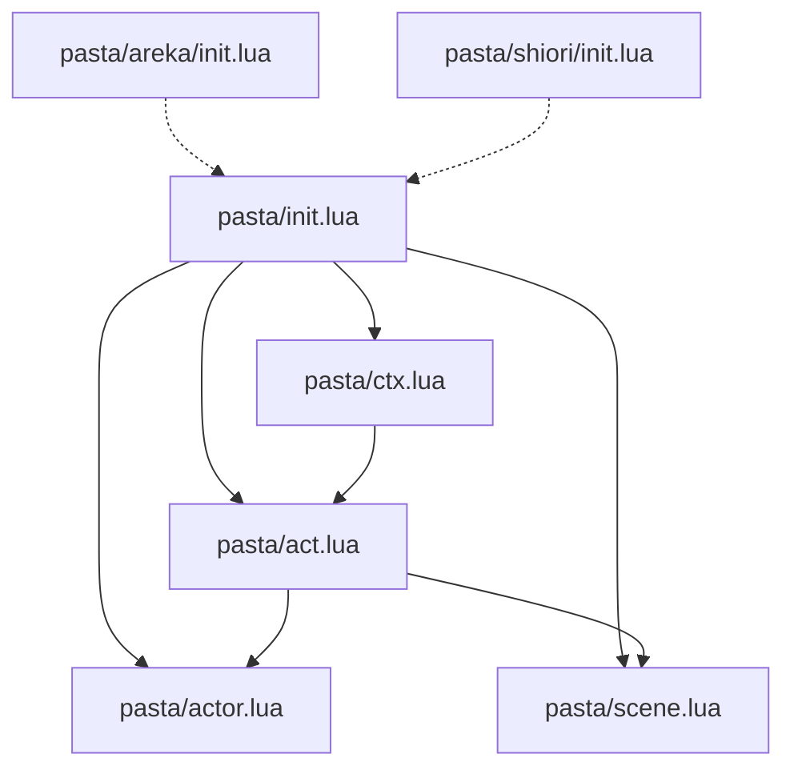

# Technical Design Document

## Overview

**Purpose**: pasta_lua Luaモジュールの内部実装設計

**Parent Spec**: `pasta_lua_design_refactor`

## Requirements Traceability

| Requirement | Summary | 実装ファイル |
|-------------|---------|-------------|
| 1 | init.lua | `pasta/init.lua` |
| 2 | ctx.lua | `pasta/ctx.lua` |
| 3 | act.lua | `pasta/act.lua` |
| 4 | actor.lua | `pasta/actor.lua` |
| 5 | scene.lua | `pasta/scene.lua` |
| 6 | トークン構造 | `pasta/act.lua` |
| 7 | 拡張モジュール | `pasta/areka/init.lua`, `pasta/shiori/init.lua` |
| 8 | テスト | `tests/lua_specs/` |

## モジュール依存関係



## 実装詳細

### pasta/init.lua

```lua
--- @module pasta
--- PASTA公開APIモジュール

local CTX = require("pasta.ctx")
local ACT = require("pasta.act")
local ACTOR = require("pasta.actor")
local SCENE = require("pasta.scene")

local PASTA = {}

--- アクターを作成・取得
--- @param name string アクター名
--- @return Actor
function PASTA.create_actor(name)
    return ACTOR.get_or_create(name)
end

--- シーンを登録
--- @param global_name string グローバルシーン名
--- @param local_name string ローカルシーン名
--- @param scene_func function|nil シーン関数
--- @return table グローバルシーンテーブル
function PASTA.create_scene(global_name, local_name, scene_func)
    if scene_func then
        SCENE.register(global_name, local_name, scene_func)
    end
    return SCENE.get_global_table(global_name) or SCENE.create_global_table(global_name)
end

--- CTXを公開（ランタイム用）
PASTA.CTX = CTX

return PASTA
```

### pasta/ctx.lua

```lua
--- @module pasta.ctx
--- 環境コンテキストモジュール

local ACT  -- 前方宣言（循環参照回避）

local CTX = {}
CTX.__index = CTX

--- 新規CTXを作成
--- @param save table|nil 永続変数
--- @param actors table|nil 登録アクター
--- @return CTX
function CTX.new(save, actors)
    local obj = {
        save = save or {},
        actors = actors or {},
    }
    setmetatable(obj, CTX)
    return obj
end

--- ACTモジュールを遅延ロード（循環参照回避）
local function get_act()
    if not ACT then
        ACT = require("pasta.act")
    end
    return ACT
end

--- コルーチンでアクションを実行
--- @param scene function シーン関数
--- @return thread コルーチン
function CTX:co_action(scene, ...)
    local args = { ... }
    local act_mod = get_act()
    return coroutine.create(function()
        local act = act_mod.new(self)
        scene(act, table.unpack(args))
        if #act.token > 0 then
            self:end_action(act)
        end
    end)
end

--- アクション開始
--- @return Act
function CTX:start_action()
    local act_mod = get_act()
    return act_mod.new(self)
end

--- yieldでトークン出力
--- @param act Act
function CTX:yield(act)
    local token = act.token
    act.token = {}
    act.now_actor = nil
    coroutine.yield({ type = "yield", token = token })
end

--- アクション終了
--- @param act Act
function CTX:end_action(act)
    local token = act.token
    act.token = {}
    coroutine.yield({ type = "end_action", token = token })
end

return CTX
```

### pasta/act.lua

```lua
--- @module pasta.act
--- アクションオブジェクトモジュール

local ACTOR  -- 前方宣言
local SCENE  -- 前方宣言

local ACT = {}

--- __indexメタメソッド
--- @param key string
--- @return any
function ACT.__index(self, key)
    local raw = rawget(ACT, key)
    if raw then return raw end
    
    -- アクター名としてプロキシ生成
    if not ACTOR then
        ACTOR = require("pasta.actor")
    end
    local actor = self.ctx.actors[key]
    if actor then
        return ACTOR.create_proxy(actor, self)
    end
    return nil
end

--- 新規Actを作成
--- @param ctx CTX
--- @return Act
function ACT.new(ctx)
    local obj = {
        ctx = ctx,
        var = {},
        token = {},
        now_actor = nil,
        current_scene = nil,
    }
    setmetatable(obj, ACT)
    return obj
end

--- シーン初期化
--- @param scene table SCENEテーブル
--- @return table save, table var
function ACT:init_scene(scene)
    self.current_scene = scene
    return self.ctx.save, self.var
end

--- talkトークン蓄積
--- @param actor Actor
--- @param text string
function ACT:talk(actor, text)
    if self.now_actor ~= actor then
        table.insert(self.token, { type = "actor", actor = actor })
        self.now_actor = actor
    end
    table.insert(self.token, { type = "talk", text = text })
end

--- 単語検索（アクター非依存）
--- @param name string
--- @return string|nil
function ACT:word(name)
    if not SCENE then
        SCENE = require("pasta.scene")
    end
    -- 1. SCENEfield
    if self.current_scene and self.current_scene[name] then
        return self.current_scene[name]
    end
    -- 2. グローバルシーン名での検索（Rust関数呼び出し予定）
    -- 3. 全体検索（Rust関数呼び出し予定）
    return nil  -- スタブ
end

--- sakura_scriptトークン蓄積
--- @param text string
function ACT:sakura_script(text)
    table.insert(self.token, { type = "sakura_script", text = text })
end

--- トークン出力とyield
function ACT:yield()
    table.insert(self.token, { type = "yield" })
    self.ctx:yield(self)
end

--- アクション終了（co_action自動呼び出し）
function ACT:end_action()
    table.insert(self.token, { type = "end_action" })
    self.ctx:end_action(self)
end

--- シーン呼び出し
--- @param search_result table {global_name, local_name}
--- @param opts table オプション
function ACT:call(search_result, opts, ...)
    if not SCENE then
        SCENE = require("pasta.scene")
    end
    local global_name, local_name = search_result[1], search_result[2]
    local scene_func = SCENE.get(global_name, local_name)
    if scene_func then
        scene_func(self, ...)
    end
end

--- スポット設定
--- @param name string アクター名
--- @param number integer 位置
function ACT:set_spot(name, number)
    -- ActorProxyへの設定は実装で決定
end

--- 全スポットクリア
function ACT:clear_spot()
    -- 全ActorProxyのspot情報リセット
end

return ACT
```

### pasta/actor.lua

```lua
--- @module pasta.actor
--- アクターモジュール

local ACTOR = {}
ACTOR.__index = ACTOR

local actor_cache = {}

--- アクター取得・作成
--- @param name string
--- @return Actor
function ACTOR.get_or_create(name)
    if not actor_cache[name] then
        local actor = { name = name }
        setmetatable(actor, ACTOR)
        actor_cache[name] = actor
    end
    return actor_cache[name]
end

--- @class ActorProxy
local PROXY = {}
PROXY.__index = PROXY

--- プロキシ作成
--- @param actor Actor
--- @param act Act
--- @return ActorProxy
function ACTOR.create_proxy(actor, act)
    local proxy = { actor = actor, act = act }
    setmetatable(proxy, PROXY)
    return proxy
end

--- talk（act逆参照）
--- @param text string
function PROXY:talk(text)
    self.act:talk(self.actor, text)
end

--- word（4レベル検索）
--- @param name string
--- @return string|nil
function PROXY:word(name)
    -- 1. アクターfield
    if self.actor[name] then
        return self.actor[name]
    end
    -- 2. SCENEfield
    local scene = self.act.current_scene
    if scene and scene[name] then
        return scene[name]
    end
    -- 3. グローバルシーン名での検索（Rust関数）
    -- 4. 全体検索（Rust関数）
    return nil  -- スタブ
end

return ACTOR
```

### pasta/scene.lua

```lua
--- @module pasta.scene
--- シーンレジストリモジュール

local SCENE = {}

local registry = {}

--- シーン登録
--- @param global_name string
--- @param local_name string
--- @param scene_func function
function SCENE.register(global_name, local_name, scene_func)
    if not registry[global_name] then
        registry[global_name] = { __global_name__ = global_name }
    end
    registry[global_name][local_name] = scene_func
end

--- グローバルシーンテーブル作成
--- @param global_name string
--- @return table
function SCENE.create_global_table(global_name)
    if not registry[global_name] then
        registry[global_name] = { __global_name__ = global_name }
    end
    return registry[global_name]
end

--- グローバルシーンテーブル取得
--- @param global_name string
--- @return table|nil
function SCENE.get_global_table(global_name)
    return registry[global_name]
end

--- シーン関数取得
--- @param global_name string
--- @param local_name string
--- @return function|nil
function SCENE.get(global_name, local_name)
    local global_table = registry[global_name]
    if global_table then
        return global_table[local_name]
    end
    return nil
end

--- グローバルシーン名取得
--- @param scene_table table
--- @return string|nil
function SCENE.get_global_name(scene_table)
    return scene_table.__global_name__
end

--- エントリーポイント取得
--- @param global_name string
--- @return function|nil
function SCENE.get_start(global_name)
    return SCENE.get(global_name, "__start__")
end

return SCENE
```

## 循環参照対策

### 問題

- ctx → act（co_actionでAct生成）
- act → actor（__indexでプロキシ生成）
- act → scene（callでシーン取得）

### 解決策

1. **前方宣言 + 遅延ロード**
   ```lua
   local ACT  -- 前方宣言
   local function get_act()
       if not ACT then ACT = require("pasta.act") end
       return ACT
   end
   ```

2. **メソッド内requireパターン**
   ```lua
   function ACT:call(...)
       local SCENE = require("pasta.scene")
       -- ...
   end
   ```

## テスト戦略

### ユニットテスト

1. **actor_test.lua**: ACTOR.get_or_create(), PROXY:talk/word()
2. **scene_test.lua**: SCENE.register/get/get_global_table()
3. **act_test.lua**: ACT.new(), init_scene(), talk(), token蓄積
4. **ctx_test.lua**: CTX.new(), co_action(), yield/end_action

### 統合テスト

1. **flow_test.lua**: シーン実行フロー全体
2. **call_test.lua**: シーン遷移テスト
