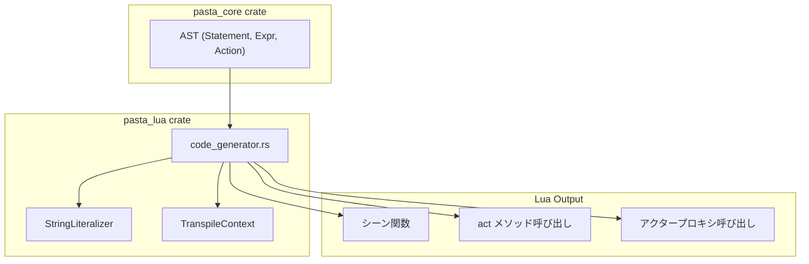

# Design Document

## Overview

**Purpose**: `code_generator.rs` の Lua 出力形式を親仕様 `pasta_lua_design_refactor` で定義された Act-first アーキテクチャに準拠させる。

**Users**: Pasta DSL ユーザーが記述したスクリプトから生成される Lua コードが、新しい pasta Lua ランタイムで正常に動作するようになる。

**Impact**: 既存の Lua 出力形式を 6 箇所で変更。既存テストの期待値更新が必要。

### Goals

- シーン関数が `act` を第1引数で受け取る形式に変更
- `PASTA.*` モジュール呼び出しを `act:*` メソッド呼び出しに変更
- 親仕様 API（init_scene, clear_spot, set_spot, sakura_script）との完全互換
- 既存の StringLiteralizer 統一ルールの維持

### Non-Goals

- Lua 側モジュール実装（`pasta_lua_implementation` 仕様で対応）
- Rust 側検索モジュール実装
- pasta_core パーサーの変更
- 新しい Action バリアントの追加

---

## Architecture

### Existing Architecture Analysis

**変更対象**: `crates/pasta_lua/src/code_generator.rs`

| メソッド | 責務 | 変更箇所 |
|---------|------|---------|
| `generate_local_scene()` | シーン関数出力 | L253, L268, L270, L278 |
| `generate_action()` | 個別アクション処理 | L509, L510 |

**維持するパターン**:
- StringLiteralizer による文字列リテラル処理
- TranspileContext によるインデント管理
- 2-pass トランスパイル（Pass1: シーン登録、Pass2: コード生成）

### Architecture Pattern & Boundary Map



**Architecture Integration**:
- **Selected pattern**: 行レベル修正（既存構造維持）
- **Domain boundaries**: code_generator.rs 内の出力パターン変更のみ
- **Existing patterns preserved**: StringLiteralizer, TranspileContext, 2-pass トランスパイル
- **Steering compliance**: UI独立性、Yield型出力、型安全性

### Technology Stack

| Layer | Choice / Version | Role in Feature | Notes |
|-------|------------------|-----------------|-------|
| Transpiler | Rust / pasta_lua | Lua コード生成 | code_generator.rs |
| Parser | pasta_core | AST 生成 | 変更なし |
| Output | Lua 5.4 | 生成コード形式 | Act-first パターン |

---

## Requirements Traceability

| Requirement | Summary | Components | Interfaces | Changes |
|-------------|---------|------------|------------|---------|
| 1 | シーン関数シグネチャ | generate_local_scene | `function SCENE.*(act, ...)` | L253 |
| 2 | init_scene呼び出し | generate_local_scene | `act:init_scene(SCENE)` | L278 |
| 3 | スポット管理API | generate_local_scene | `act:clear_spot()`, `act:set_spot()` | L268, L270 |
| 4 | アクタープロキシ（word） | generate_action | `act.actor:talk(act.actor:word())` | L510 |
| 5 | さくらスクリプト | generate_action | `act:sakura_script()` | L509 |
| 7 | 変数アクセス | - | 現行仕様維持 | 変更なし |
| 8 | テスト互換性 | テストファイル | 期待値更新 | 20-25テスト |
| 9 | ドキュメント更新 | code_generator.rs | ドキュメントコメント | ヘッダー更新 |

---

## Components and Interfaces

### Components Summary

| Component | Domain | Intent | Req Coverage | Key Dependencies | Contracts |
|-----------|--------|--------|--------------|------------------|-----------|
| generate_local_scene | Transpiler | シーン関数生成 | 1, 2, 3 | TranspileContext (P0) | Service |
| generate_action | Transpiler | アクション生成 | 4, 6 | StringLiteralizer (P0) | Service |
| StringLiteralizer | Utility | 文字列リテラル化 | 7 | - | Service |

---

### Transpiler Layer

#### generate_local_scene

| Field | Detail |
|-------|--------|
| Intent | シーン関数のLuaコード生成 |
| Requirements | 1, 2, 3 |

**Responsibilities & Constraints**
- シーン関数シグネチャを `act` 第1引数形式で出力
- スポット管理を `act:clear_spot()`, `act:set_spot()` 形式で出力
- セッション初期化を `act:init_scene(SCENE)` 形式で出力

**Dependencies**
- Inbound: Transpiler — シーンAST変換 (P0)
- Outbound: TranspileContext — インデント管理 (P0)

**Contracts**: Service [x]

##### Service Interface

```rust
/// シーン関数を生成する
/// 
/// # 出力形式（設計後）
/// ```lua
/// function SCENE.__start__(act, ...)
///     local args = { ... }
///     act:clear_spot()
///     act:set_spot("さくら", 0)
///     local save, var = act:init_scene(SCENE)
///     
///     -- アクション処理
/// end
/// ```
pub fn generate_local_scene(
    &mut self,
    scene: &LocalSceneScope,
    counter: usize,
    actors: &[SceneActorItem],
) -> Result<(), TranspileError>
```

**変更詳細**:

| 行番号 | 現状 | 設計 |
|--------|------|------|
| L253 | `function SCENE.{}(ctx, ...)` | `function SCENE.{}(act, ...)` |
| L268 | `PASTA.clear_spot(ctx)` | `act:clear_spot()` |
| L270 | `PASTA.set_spot(ctx, "{}", {})` | `act:set_spot("{}", {})` |
| L278 | `local act, save, var = PASTA.create_session(SCENE, ctx)` | `local save, var = act:init_scene(SCENE)` |

**Implementation Notes**
- L253: 文字列パターンの `ctx` を `act` に変更
- L268: `PASTA.clear_spot(ctx)` → `act:clear_spot()`（引数削除）
- L270: `PASTA.set_spot(ctx, ...)` → `act:set_spot(...)`（ctx引数削除）
- L278: 戻り値パターンを 3値 → 2値 に変更、呼び出し形式も変更

---

#### generate_action

| Field | Detail |
|-------|--------|
| Intent | 個別アクションのLuaコード生成 |
| Requirements | 4, 6 |

**Responsibilities & Constraints**
- SakuraScript を `act:sakura_script()` 形式で出力
- word() 呼び出しを `act.actor:talk(act.actor:word())` 形式で出力
- StringLiteralizer による文字列リテラル処理を維持

**Dependencies**
- Inbound: generate_action_line — アクション行処理 (P0)
- Outbound: StringLiteralizer — 文字列リテラル化 (P0)

**Contracts**: Service [x]

##### Service Interface

```rust
/// 個別アクションを生成する
/// 
/// # word() 出力形式（設計後）
/// ```lua
/// act.さくら:talk(act.さくら:word("笑顔"))
/// ```
/// 
/// # SakuraScript 出力形式（設計後）
/// ```lua
/// act:sakura_script("\\s[0]")
/// ```
fn generate_action(
    &mut self,
    action: &Action,
    actor: &str,
) -> Result<(), TranspileError>
```

**変更詳細**:

| 行番号 | 現状 | 設計 |
|--------|------|------|
| L509 | `act.{}:talk({})` (SakuraScript) | `act:sakura_script({})` |
| L510 | `act.{}:word({})` | `act.{}:talk(act.{}:word({}))` |

**Implementation Notes**
- L509: Action::SakuraScript マッチング時の出力を変更
- L510: Action::Word マッチング時に talk() でラッピング
- StringLiteralizer は両方で引き続き使用

---

#### StringLiteralizer

| Field | Detail |
|-------|--------|
| Intent | Lua文字列リテラルのエスケープ処理 |
| Requirements | 7 |

**Responsibilities & Constraints**
- すべての文字列リテラル出力で統一使用（例外なし）
- Lua 特殊文字（`[`, `]`, `"`, `\` 等）の適切なエスケープ
- 長い文字列は `[=[...]=]` 形式で出力

**Contracts**: Service [x]

##### Service Interface

```rust
/// 文字列をLuaリテラル形式に変換
/// 
/// # 使用箇所
/// - talk() の文字列引数
/// - word() の単語名引数
/// - sakura_script() の文字列引数
/// 
/// # Example
/// ```rust
/// let literal = StringLiteralizer::literalize("hello")?;
/// // => "\"hello\""
/// ```
pub fn literalize(s: &str) -> Result<String, TranspileError>
```

**Implementation Notes**
- 現行実装を維持（変更なし）
- word() 引数でも必ず使用することを確認

---

## Data Models

### 出力コード構造（変更後）

```lua
-- シーン関数パターン
do
    local SCENE = PASTA.create_scene("モジュール名_1")
    
    function SCENE.__start__(act, ...)
        local args = { ... }
        act:clear_spot()
        act:set_spot("さくら", 0)
        local save, var = act:init_scene(SCENE)
        
        act.さくら:talk("こんにちは")
        act.さくら:talk(act.さくら:word("笑顔"))
        act:sakura_script("\\s[0]")
    end
end
```

### 変更マッピング

| # | 要件 | 現状出力 | 設計出力 | 対象行 |
|---|------|---------|---------|-------|
| 1 | Req 1 | `function SCENE.__start__(ctx, ...)` | `function SCENE.__start__(act, ...)` | L253 |
| 2 | Req 2 | `PASTA.create_session(SCENE, ctx)` | `act:init_scene(SCENE)` | L278 |
| 3 | Req 3 | `PASTA.clear_spot(ctx)` | `act:clear_spot()` | L268 |
| 4 | Req 3 | `PASTA.set_spot(ctx, "name", idx)` | `act:set_spot("name", idx)` | L270 |
| 5 | Req 4 | `act.actor:word()` | `act.actor:talk(act.actor:word())` | L510 |
| 6 | Req 6 | `act.actor:talk(sakura_text)` | `act:sakura_script(text)` | L509 |

---

## Error Handling

### Error Strategy

変更による新しいエラーケースは発生しない。既存のエラー処理を維持。

| Error Category | Handling |
|---------------|----------|
| TranspileError | 既存のエラー型を継続使用 |
| StringLiteralizer::Error | 既存のエスケープエラー処理を維持 |

---

## Testing Strategy

### Unit Tests

変更なし（code_generator.rs のユニットテストは既存のまま）

### Integration Tests

**更新対象**: `crates/pasta_lua/tests/transpiler_integration_test.rs`

| テストカテゴリ | 更新内容 | 概算数 |
|--------------|---------|-------|
| シーン関数シグネチャ | `ctx` → `act` アサーション更新 | 5-8 |
| セッション初期化 | `create_session` → `init_scene` アサーション更新 | 3-5 |
| スポット管理 | `PASTA.*` → `act:*` アサーション更新 | 3-5 |
| アクション出力 | word(), sakura_script アサーション更新 | 8-12 |

**テスト実行戦略**:
1. Phase 1（L253, L268, L270）完了 → 初期化関連テスト実行
2. Phase 2（L278）完了 → セッション関連テスト実行
3. Phase 3（L509, L510）完了 → アクション関連テスト実行
4. 全完了 → `cargo test --all`

### Fixture Updates

**更新対象**: 
- `crates/pasta_lua/tests/fixtures/`
- `crates/pasta_lua/tests/lua_specs/`

期待出力ファイルの更新が必要。

---

## Implementation Strategy

### 採用アプローチ: Option A（行レベル修正）

6つの変更を段階的に実施し、各段階でテスト検証を行う。

### 実装順序

| Phase | 変更 | 対象行 | テスト範囲 | 工数 |
|-------|------|-------|-----------|------|
| 1 | シグネチャ `ctx` → `act` | L253 | シグネチャ検証 | 0.5h |
| 2 | スポット管理 | L268, L270 | スポット API 検証 | 0.5h |
| 3 | init_scene | L278 | 初期化検証 | 0.5h |
| 4 | word() ラッピング | L510 | アクション検証 | 0.5h |
| 5 | sakura_script | L509 | さくらスクリプト検証 | 0.5h |
| 6 | テスト統合 | - | 全テスト実行 | 1.0h |

**合計工数**: 3.5h

### コミット粒度

各 Phase 完了後にコミット（合計 5-6 コミット）。

---

## Supporting References

### 親仕様 API 定義

**pasta.act Service Interface** (親仕様 design.md L300-400 より):

```lua
--- シーン初期化、save/var参照を返す
--- @param scene table SCENEテーブル
--- @return table save 永続変数への参照
--- @return table var 作業変数への参照
function ACT:init_scene(scene)

--- スポットを設定
--- @param name string アクター名
--- @param number integer 立ち位置
function ACT:set_spot(name, number)

--- 全スポットをクリア
function ACT:clear_spot()

--- sakura_scriptトークンを蓄積
--- @param text string さくらスクリプト
function ACT:sakura_script(text)
```

**pasta.actor ActorProxy** (親仕様 design.md L500-550 より):

```lua
--- プロキシ経由でtalk（actにトークン蓄積）
--- @param text string テキスト
function PROXY:talk(text)

--- プロキシ経由でword（単語検索して結果を返す）
--- @param name string 単語名
--- @return string|nil 検索結果
function PROXY:word(name)
```

### word() ラッピングパターン

親仕様 design.md L891 の例:
```lua
act.さくら:talk(act.さくら:word("笑顔"))
```

word() は検索のみを行い、結果を talk() メソッドに渡す。
