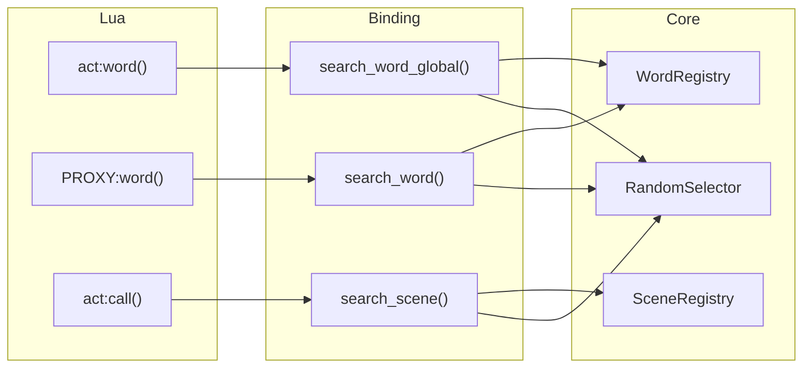

# Technical Design Document

## Overview

**Purpose**: Rust側検索モジュールの mlua バインディング設計

**Parent Spec**: `pasta_lua_design_refactor`

## Requirements Traceability

| Requirement | Summary | 実装ファイル |
|-------------|---------|-------------|
| 1 | シーン検索API | `pasta_lua/src/runtime/search.rs` |
| 2 | 単語検索API（アクター指定） | `pasta_lua/src/runtime/search.rs` |
| 3 | 単語検索API（アクター非指定） | `pasta_lua/src/runtime/search.rs` |
| 4 | mluaバインディング | `pasta_lua/src/runtime/mod.rs` |
| 5 | ランダム選択 | pasta_core RandomSelector 利用 |

## アーキテクチャ



## API設計

### search_scene

```lua
--- シーン検索（前方一致）
--- @param prefix string 検索プレフィックス
--- @return table|nil {global_name, local_name} または nil
function search_scene(prefix)
end
```

**Rustシグネチャ**:
```rust
fn search_scene(lua: &Lua, prefix: String) -> mlua::Result<Option<(String, String)>>
```

### search_word

```lua
--- 単語検索（アクター指定、Level 3-4のみ）
--- @param name string 単語名
--- @param actor_name string|nil アクター名（Level 3で使用）
--- @param global_scene_name string|nil グローバルシーン名（Level 3で使用）
--- @return string|nil 検索結果
function search_word(name, actor_name, global_scene_name)
end
```

**Rustシグネチャ**:
```rust
fn search_word(
    lua: &Lua,
    (name, actor_name, global_scene_name): (String, Option<String>, Option<String>)
) -> mlua::Result<Option<String>>
```

### search_word_global

```lua
--- 単語検索（アクター非指定、Level 2-3のみ）
--- @param name string 単語名
--- @param global_scene_name string|nil グローバルシーン名
--- @return string|nil 検索結果
function search_word_global(name, global_scene_name)
end
```

**Rustシグネチャ**:
```rust
fn search_word_global(
    lua: &Lua,
    (name, global_scene_name): (String, Option<String>)
) -> mlua::Result<Option<String>>
```

## 実装詳細

### ファイル構成

```
pasta_lua/src/
├── runtime/
│   ├── mod.rs      # モジュール公開、Lua初期化
│   └── search.rs   # 検索関数実装
```

### search.rs

```rust
//! Lua検索バインディング

use mlua::{Lua, Result as LuaResult, Function, MultiValue};
use pasta_core::registry::{SceneRegistry, WordRegistry, RandomSelector};
use std::sync::Arc;

/// 検索コンテキスト（レジストリへの参照を保持）
pub struct SearchContext {
    scene_registry: Arc<SceneRegistry>,
    word_registry: Arc<WordRegistry>,
    selector: RandomSelector,
}

impl SearchContext {
    pub fn new(
        scene_registry: Arc<SceneRegistry>,
        word_registry: Arc<WordRegistry>,
    ) -> Self {
        Self {
            scene_registry,
            word_registry,
            selector: RandomSelector::new(),
        }
    }
    
    /// シーン検索
    pub fn search_scene(&self, prefix: &str) -> Option<(String, String)> {
        let candidates = self.scene_registry.search_prefix(prefix);
        if candidates.is_empty() {
            return None;
        }
        let selected = self.selector.select(&candidates);
        Some((selected.global_name.clone(), selected.local_name.clone()))
    }
    
    /// 単語検索（アクター指定）
    pub fn search_word(
        &self,
        name: &str,
        actor_name: Option<&str>,
        global_scene_name: Option<&str>,
    ) -> Option<String> {
        // Level 3: グローバルシーン名での検索
        if let Some(scene_name) = global_scene_name {
            if let Some(result) = self.word_registry.search_with_scope(name, scene_name) {
                return Some(self.selector.select_word(&result));
            }
        }
        // Level 4: 全体検索
        if let Some(result) = self.word_registry.search(name) {
            return Some(self.selector.select_word(&result));
        }
        None
    }
    
    /// 単語検索（アクター非指定）
    pub fn search_word_global(
        &self,
        name: &str,
        global_scene_name: Option<&str>,
    ) -> Option<String> {
        // Level 2: グローバルシーン名での検索
        if let Some(scene_name) = global_scene_name {
            if let Some(result) = self.word_registry.search_with_scope(name, scene_name) {
                return Some(self.selector.select_word(&result));
            }
        }
        // Level 3: 全体検索
        if let Some(result) = self.word_registry.search(name) {
            return Some(self.selector.select_word(&result));
        }
        None
    }
}

/// Luaにグローバル関数を登録
pub fn register_search_functions(lua: &Lua, ctx: Arc<SearchContext>) -> LuaResult<()> {
    let globals = lua.globals();
    
    // search_scene
    let ctx_clone = ctx.clone();
    let search_scene_fn = lua.create_function(move |_, prefix: String| {
        Ok(ctx_clone.search_scene(&prefix))
    })?;
    globals.set("search_scene", search_scene_fn)?;
    
    // search_word
    let ctx_clone = ctx.clone();
    let search_word_fn = lua.create_function(move |_, args: (String, Option<String>, Option<String>)| {
        Ok(ctx_clone.search_word(&args.0, args.1.as_deref(), args.2.as_deref()))
    })?;
    globals.set("search_word", search_word_fn)?;
    
    // search_word_global
    let ctx_clone = ctx.clone();
    let search_word_global_fn = lua.create_function(move |_, args: (String, Option<String>)| {
        Ok(ctx_clone.search_word_global(&args.0, args.1.as_deref()))
    })?;
    globals.set("search_word_global", search_word_global_fn)?;
    
    Ok(())
}
```

## Lua側との連携

### PROXY:word() の実装（更新版）

```lua
function PROXY:word(name)
    -- Level 1: アクターfield
    if self.actor[name] then
        return self.actor[name]
    end
    -- Level 2: SCENEfield
    local scene = self.act.current_scene
    if scene and scene[name] then
        return scene[name]
    end
    -- Level 3-4: Rust側検索
    local global_name = scene and scene.__global_name__ or nil
    return search_word(name, self.actor.name, global_name)
end
```

### ACT:word() の実装（更新版）

```lua
function ACT:word(name)
    -- Level 1: SCENEfield
    if self.current_scene and self.current_scene[name] then
        return self.current_scene[name]
    end
    -- Level 2-3: Rust側検索
    local global_name = self.current_scene and self.current_scene.__global_name__ or nil
    return search_word_global(name, global_name)
end
```

## テスト戦略

### ユニットテスト

1. **search_scene_test.rs**: 前方一致検索、ランダム選択
2. **search_word_test.rs**: 優先順位検索、スコープ検索

### 統合テスト

1. Lua側から search_scene() を呼び出し、結果を検証
2. Lua側から search_word() を呼び出し、優先順位を検証
