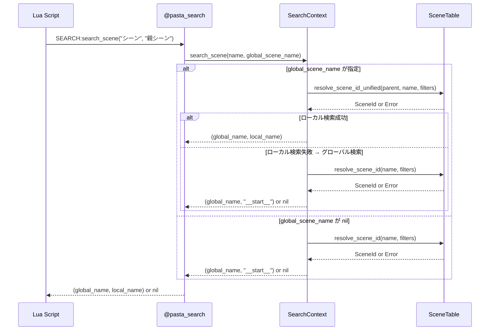
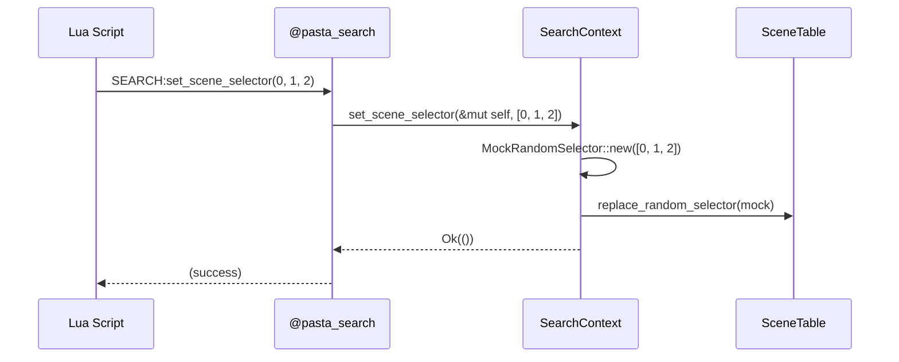
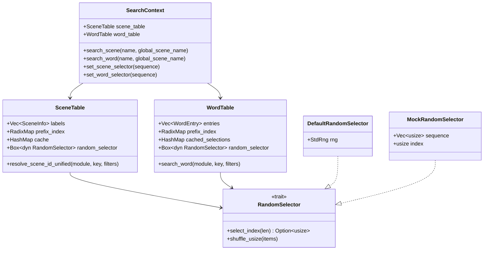

# Design Document: pasta_search_module

## Overview

**Purpose**: Rust 側のシーン辞書・単語辞書検索機能を mlua バインディングで Lua 側に公開し、`act:word()`, `PROXY:word()`, `act:call()` から呼び出せるようにする。

**Users**: Lua スクリプト開発者（pasta.act, pasta.actor モジュール利用者）

**Impact**: pasta_lua crate に新規 `search` モジュールを追加。pasta_core の SceneTable/WordTable を Lua 環境から利用可能にする。

### Goals

- `@pasta_search` モジュールとして Lua に検索 API を公開
- シーン検索・単語検索の段階的フォールバック戦略を実装
- 複数 Lua ランタイムインスタンスで独立した検索コンテキストを維持
- テスト時の決定的選択を Lua 側から制御可能にする

### Non-Goals

- Lua 側モジュール（pasta.act, pasta.actor）の実装（別仕様）
- Level 1/2 検索（アクター field, SCENE field）- Lua 側で処理
- SceneRegistry/WordDefRegistry の構築ロジック（pasta_core で既存）

---

## Architecture

### Existing Architecture Analysis

**現行システム**:
- **pasta_core**: SceneTable, WordTable, RandomSelector が完全実装済み
- **pasta_lua**: code_generator.rs で Lua コード生成、TranspileContext でレジストリ管理
- **mlua-stdlib**: loader/register パターンの参照実装

**尊重すべきパターン**:
- mlua-stdlib の loader() + register() パターン
- pasta_core の Registry → Table 変換フロー
- Rust 2024 edition のエラーハンドリング慣習

### Architecture Pattern & Boundary Map

```mermaid
graph TB
    subgraph Lua側
        LuaScript[Lua Script]
        PastaAct[pasta.act]
        PastaActor[pasta.actor]
    end
    
    subgraph pasta_lua
        SearchModule[@pasta_search Module]
        SearchContext[SearchContext UserData]
        Loader[loader / register]
    end
    
    subgraph pasta_core
        SceneTable[SceneTable]
        WordTable[WordTable]
        RandomSelector[RandomSelector]
    end
    
    LuaScript --> PastaAct
    LuaScript --> PastaActor
    PastaAct --> SearchModule
    PastaActor --> SearchModule
    SearchModule --> SearchContext
    SearchContext --> SceneTable
    SearchContext --> WordTable
    SceneTable --> RandomSelector
    WordTable --> RandomSelector
    Loader --> SearchContext
```

**Architecture Integration**:
- **Selected pattern**: UserData ラッピングによる状態隔離
- **Domain boundaries**: pasta_lua が mlua 依存を持ち、pasta_core は言語非依存を維持
- **Existing patterns preserved**: loader/register パターン、Result<T> エラーハンドリング
- **New components**: SearchContext UserData、search モジュール
- **Steering compliance**: 複数インスタンス対応、Static 変数禁止

### Technology Stack

| Layer | Choice / Version | Role in Feature | Notes |
|-------|------------------|-----------------|-------|
| Binding | mlua 0.11 | Lua ↔ Rust バインディング | 既存依存 |
| Runtime | pasta_core | SceneTable, WordTable, RandomSelector | 検索ロジック提供 |
| Language | Rust 2024 | 実装言語 | 型安全性 |
| Testing | mlua + cargo test | 統合テスト | 複数インスタンス検証 |

---

## System Flows

### シーン検索フロー（Requirement 2）



### Selector 切り替えフロー（Requirement 8）



---

## Requirements Traceability

| Requirement | Summary | Components | Interfaces | Flows |
|-------------|---------|------------|------------|-------|
| 1.1-1.5 | @pasta_search モジュール公開 | SearchModule, Loader | register(), loader() | - |
| 2.1-2.8 | シーン検索 API | SearchContext | search_scene() | シーン検索フロー |
| 3.1-3.8 | 単語検索 API | SearchContext | search_word() | 同様 |
| 4.1-4.8 | mlua バインディング | SearchContext, Loader | UserData impl | - |
| 5.1-5.4 | ランダム選択循環 | SceneTable, WordTable | (pasta_core 既存) | - |
| 6.1-6.3 | エラーハンドリング | SearchContext | Result<T, mlua::Error> | - |
| 7.1-7.3 | パフォーマンス | SearchContext | (設計考慮) | - |
| 8.1-8.10 | Selector 制御 API | SearchContext | set_scene_selector(), set_word_selector() | Selector 切り替えフロー |

---

## Components and Interfaces

### Component Summary

| Component | Domain/Layer | Intent | Req Coverage | Key Dependencies | Contracts |
|-----------|--------------|--------|--------------|------------------|-----------|
| SearchContext | pasta_lua/search | 検索状態管理 UserData | 1-8 | SceneTable (P0), WordTable (P0) | Service, State |
| SearchModule | pasta_lua/search | @pasta_search モジュール登録 | 1, 4 | Loader (P0), mlua (P0) | API |
| Loader | pasta_lua/search | モジュール初期化 | 4 | SearchContext (P0) | Service |

---

### pasta_lua/search Layer

#### SearchContext

| Field | Detail |
|-------|--------|
| Intent | Lua ランタイムごとの検索状態を管理する UserData |
| Requirements | 1.3, 2.1-2.8, 3.1-3.8, 4.8, 5.1-5.4, 7.1-7.3, 8.1-8.10 |

**Responsibilities & Constraints**
- シーン検索・単語検索の実行
- RandomSelector 状態の保持・切り替え
- 各 Lua インスタンスで独立したインスタンスを維持
- Static 変数禁止

**Dependencies**
- Inbound: SearchModule — モジュール登録時に生成 (P0)
- Outbound: SceneTable — シーン検索実行 (P0)
- Outbound: WordTable — 単語検索実行 (P0)
- External: pasta_core::registry — SceneTable, WordTable, RandomSelector (P0)

**Contracts**: Service [x] / API [ ] / Event [ ] / Batch [ ] / State [x]

##### Service Interface

```rust
/// 検索コンテキスト - 各 Lua インスタンスで独立したインスタンスを持つ
pub struct SearchContext {
    scene_table: SceneTable,
    word_table: WordTable,
}

impl SearchContext {
    /// SceneRegistry と WordDefRegistry から SearchContext を生成
    pub fn new(
        scene_registry: SceneRegistry,
        word_registry: WordDefRegistry,
    ) -> Result<Self, SearchError>;
    
    /// シーン検索（段階的フォールバック）
    /// 
    /// # Arguments
    /// * `name` - 検索プレフィックス
    /// * `global_scene_name` - 親シーン名（None でグローバルのみ検索）
    /// 
    /// # Returns
    /// * `Ok(Some((global_name, local_name)))` - 検索成功
    /// * `Ok(None)` - 候補なし
    /// * `Err(e)` - エラー
    pub fn search_scene(
        &mut self,
        name: &str,
        global_scene_name: Option<&str>,
    ) -> Result<Option<(String, String)>, SearchError>;
    
    /// 単語検索（段階的フォールバック）
    /// 
    /// # Arguments
    /// * `name` - 検索キー
    /// * `global_scene_name` - 親シーン名（None でグローバルのみ検索）
    /// 
    /// # Returns
    /// * `Ok(Some(word))` - 検索成功
    /// * `Ok(None)` - 候補なし
    /// * `Err(e)` - エラー
    pub fn search_word(
        &mut self,
        name: &str,
        global_scene_name: Option<&str>,
    ) -> Result<Option<String>, SearchError>;
    
    /// シーン用 RandomSelector をリセットまたは切り替え
    /// 
    /// # Arguments
    /// * `sequence` - None でデフォルト、Some で MockRandomSelector
    pub fn set_scene_selector(
        &mut self,
        sequence: Option<Vec<usize>>,
    ) -> Result<(), SearchError>;
    
    /// 単語用 RandomSelector をリセットまたは切り替え
    pub fn set_word_selector(
        &mut self,
        sequence: Option<Vec<usize>>,
    ) -> Result<(), SearchError>;
}
```

- Preconditions: SceneRegistry/WordDefRegistry が有効な状態であること
- Postconditions: 検索結果が返される、または nil
- Invariants: RandomSelector 状態は SearchContext 内で完結

##### State Management

- **State model**: SearchContext は SceneTable/WordTable を所有し、各テーブルが内部キャッシュと RandomSelector を持つ
- **Persistence**: なし（インメモリ）
- **Concurrency**: Lua シングルスレッド前提、mlua が exclusive access を保証

**Implementation Notes**
- Integration: TranspileContext から SceneRegistry/WordDefRegistry を受け取り SearchContext を生成
- Validation: 引数型チェックは mlua が自動実行
- Risks: MockRandomSelector が pasta_core で `#[cfg(test)]` 限定 → **公開化が必要**

---

#### SearchModule (Loader/Register)

| Field | Detail |
|-------|--------|
| Intent | @pasta_search モジュールを Lua に登録 |
| Requirements | 1.1-1.5, 4.1-4.5 |

**Responsibilities & Constraints**
- loader() で SearchContext UserData を含むテーブル生成
- register() で `@pasta_search` として Lua globals に登録
- 複数回 require で同じインスタンスを返す

**Dependencies**
- Inbound: pasta_lua 初期化フロー — モジュール登録呼び出し (P0)
- Outbound: SearchContext — UserData 生成 (P0)
- External: mlua — モジュール登録 API (P0)

**Contracts**: Service [x] / API [x] / Event [ ] / Batch [ ] / State [ ]

##### Service Interface

```rust
/// @pasta_search モジュールテーブルを生成
/// 
/// SearchContext を UserData として含む Table を返す
pub fn loader(
    lua: &Lua,
    scene_registry: SceneRegistry,
    word_registry: WordDefRegistry,
) -> Result<Table, mlua::Error>;

/// @pasta_search モジュールを Lua globals に登録
pub fn register(
    lua: &Lua,
    scene_registry: SceneRegistry,
    word_registry: WordDefRegistry,
) -> Result<Table, mlua::Error>;
```

##### API Contract (Lua側)

| Method | Signature | Returns | Errors |
|--------|-----------|---------|--------|
| search_scene | `SEARCH:search_scene(name, global_scene_name?)` | `global_name, local_name` or `nil` | type error |
| search_word | `SEARCH:search_word(name, global_scene_name?)` | `string` or `nil` | type error |
| set_scene_selector | `SEARCH:set_scene_selector(n1, n2, ...)` | (none) | type error |
| set_word_selector | `SEARCH:set_word_selector(n1, n2, ...)` | (none) | type error |

**Implementation Notes**
- Integration: mlua-stdlib の loader/register パターンに従う
- Validation: 引数なし呼び出しで Selector リセット
- Risks: なし

---

## Data Models

### Domain Model



**Aggregates**: SearchContext が SceneTable/WordTable を所有
**Invariants**: RandomSelector は各テーブルで独立管理

---

## Error Handling

### Error Strategy

- **User Errors**: 引数型不正 → mlua が自動検出、エラーメッセージ返却
- **Business Logic**: 検索候補なし → `nil` を返す（エラーではない）
- **System Errors**: 内部エラー → mlua::Error にラップして返却

### Error Categories and Responses

| Category | Condition | Response | Req |
|----------|-----------|----------|-----|
| Type Error | 引数が string でない | "expected string argument" | 6.1 |
| Type Error | Selector 引数が integer でない | "expected integer argument" | 8.9 |
| Not Found | 検索候補なし | `nil` を返す | 6.3 |
| Internal | pasta_core エラー | mlua::Error でラップ | 6.2 |

---

## Testing Strategy

### Unit Tests
- SearchContext::search_scene() の段階的フォールバック動作
- SearchContext::search_word() のローカル/グローバル検索
- set_scene_selector() / set_word_selector() の MockSelector 切り替え
- 引数型検証エラー

### Integration Tests
- Lua からの `require "@pasta_search"` + 検索呼び出し
- 複数 Lua インスタンスでの独立性検証
- MockSelector 設定後の決定的選択動作

### E2E Tests (Lua)
- pasta.act モジュールからの search_word 呼び出し
- pasta.actor モジュールからの search_scene 呼び出し

---

## Optional Sections

### pasta_core 変更要件

**MockRandomSelector の公開化**:

現在、`MockRandomSelector` は `#[cfg(test)]` で限定されている。Requirement 8 の Lua 側 Selector 制御を実現するため、以下の変更が必要：

```rust
// crates/pasta_core/src/registry/random.rs

// 変更前
#[cfg(test)]
pub struct MockRandomSelector { ... }

// 変更後（オプション A: 常時公開）
pub struct MockRandomSelector { ... }

// 変更後（オプション B: feature フラグ）
#[cfg(any(test, feature = "mock-selector"))]
pub struct MockRandomSelector { ... }
```

**推奨**: オプション A（常時公開）— テスト以外での利用シナリオ（Lua テスト）が正当

---

## File Structure

```
pasta_lua/src/
├── lib.rs (修正: pub mod search)
├── search/
│   ├── mod.rs
│   │   ├── pub struct SearchContext
│   │   ├── impl UserData for SearchContext
│   │   ├── pub fn loader(...)
│   │   └── pub fn register(...)
│   ├── scene_search.rs
│   │   └── search_scene 実装
│   └── word_search.rs
│       └── search_word 実装
└── (既存ファイル)
```

---

## UserData Implementation Detail

```rust
impl mlua::UserData for SearchContext {
    fn add_methods<'lua, M: mlua::UserDataMethods<'lua, Self>>(methods: &mut M) {
        // 不変メソッド（&self）
        // 注: search_scene/search_word は &mut self だがキャッシュ更新のため
        //     add_method_mut を使用
        
        methods.add_method_mut("search_scene", |lua, this, (name, global_scene_name): (String, Option<String>)| {
            match this.search_scene(&name, global_scene_name.as_deref())? {
                Some((global, local)) => Ok((global, local).into_lua_multi(lua)?),
                None => Ok(mlua::Value::Nil.into_lua_multi(lua)?),
            }
        });
        
        methods.add_method_mut("search_word", |lua, this, (name, global_scene_name): (String, Option<String>)| {
            match this.search_word(&name, global_scene_name.as_deref())? {
                Some(word) => Ok(word.into_lua(lua)?),
                None => Ok(mlua::Value::Nil),
            }
        });
        
        // 可変メソッド（&mut self）
        methods.add_method_mut("set_scene_selector", |lua, this, args: mlua::MultiValue| {
            if args.is_empty() {
                this.set_scene_selector(None)?;
            } else {
                let sequence: Vec<usize> = args.iter()
                    .map(|v| v.as_integer().ok_or_else(|| mlua::Error::RuntimeError("expected integer argument".into())))
                    .collect::<Result<Vec<_>, _>>()?
                    .into_iter()
                    .map(|i| i as usize)
                    .collect();
                this.set_scene_selector(Some(sequence))?;
            }
            Ok(())
        });
        
        methods.add_method_mut("set_word_selector", |lua, this, args: mlua::MultiValue| {
            // 同様の実装
            Ok(())
        });
    }
}
```

**Lua 呼び出し形式**:
- `SEARCH:search_scene("シーン", "親シーン")` — メソッド形式
- `SEARCH.search_scene(SEARCH, "シーン", "親シーン")` — 関数形式（メタテーブルで対応）
