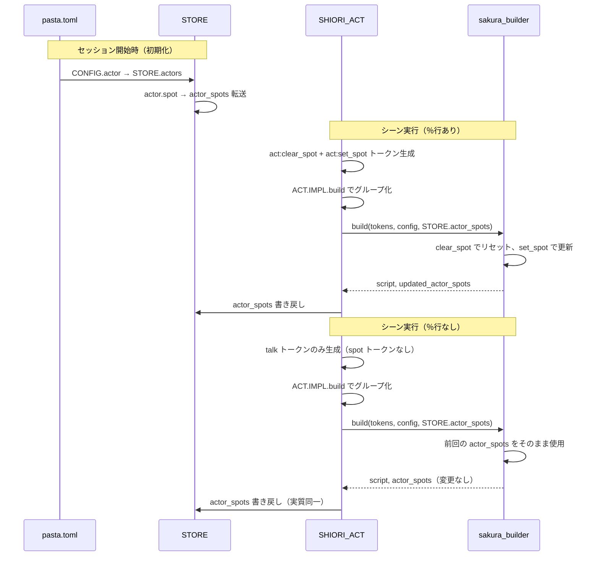

# Technical Design: persist-spot-position

## Overview

**Purpose**: アクターのスポット位置（`\p[ID]`）をシーン間で継続保持する機能。`％`アクター行が省略されたシーンでも前回のスポット位置を引き継ぎ、冗長な記述を削減する。

**Users**: ゴースト制作者がPasta DSLで対話スクリプトを記述する際に利用する。連続会話でアクター構成が変わらない場合に`％`行を省略可能にする。

**Impact**: `STORE`モジュールに`actor_spots`フィールドを追加し、`sakura_builder.build()`のシグネチャを拡張する。`SHIORI_ACT_IMPL.build()`がSTOREとの入出力を仲介する。

### Goals
- `pasta.toml`の`[actor]`セクションからデフォルトスポット値を初期化（**実装済み確認**）
- セッション全体でスポット状態を`STORE.actor_spots`に保持
- `sakura_builder.build()`の純粋関数性を維持しつつスポット状態を入出力
- サンプルゴーストに`[actor]`セクションの設定例を追加

### Non-Goals
- `code_generator.rs`の変更（clear_spot/set_spot出力制御は実装済み）
- CONFIG構造体（Rust側）の変更（`custom_fields`パイプラインで十分）
- スポット位置の永続化（セッション間保存）— 現時点ではセッション内のみ

## Architecture

### Existing Architecture Analysis

現行のスポット関連データフローは以下の通り：

1. **CONFIG パイプライン（実装済み）**: `pasta.toml` → `PastaConfig.custom_fields`（Rust） → `@pasta_config`（Lua） → `STORE.actors`（store.lua末尾で参照共有）
2. **トランスパイラ出力（実装済み）**: `code_generator.rs`が`!actors.is_empty()`ガードで`act:clear_spot()` + `act:set_spot()`をセット出力
3. **トークン処理（実装済み）**: `ACT_IMPL.set_spot()`/`ACT_IMPL.clear_spot()`がステートレスにトークン生成
4. **ビルダー（要変更）**: `sakura_builder.build()`がローカル変数`actor_spots`で状態管理 → 毎回リセットされるためセッション間で保持不可

### Architecture Pattern & Boundary Map

```mermaid
graph TB
    subgraph CONFIG_PIPELINE[CONFIG パイプライン - 実装済み]
        TOML[pasta.toml] --> PastaConfig[PastaConfig.custom_fields]
        PastaConfig --> LuaConfig[@pasta_config]
        LuaConfig --> StoreActors[STORE.actors]
    end

    subgraph STORE_LAYER[STORE レイヤー]
        StoreActors
        ActorSpots[STORE.actor_spots - NEW]
        StoreActors -->|初期化時転送| ActorSpots
    end

    subgraph TRANSPILER[トランスパイラ - 変更不要]
        CodeGen[code_generator.rs]
        CodeGen -->|act:set_spot| Tokens[トークン列]
        CodeGen -->|act:clear_spot| Tokens
    end

    subgraph RUNTIME[ランタイム]
        ACT[ACT_IMPL]
        ACT -->|build| GroupedTokens[グループ化トークン]
        ShioriAct[SHIORI_ACT_IMPL.build]
        ShioriAct -->|1. parent build| ACT
        ShioriAct -->|2. read| ActorSpots
        ShioriAct -->|3. call| Builder[sakura_builder.build]
        Builder -->|4. return script + spots| ShioriAct
        ShioriAct -->|5. write back| ActorSpots
    end
```

**Architecture Integration**:
- **Selected pattern**: STORE集約パターン — 全ランタイム状態をSTOREに一元管理（既存パターン踏襲）
- **Domain boundaries**: STORE=状態保持、sakura_builder=純粋変換、SHIORI_ACT=仲介
- **Existing patterns preserved**: CONFIG→STORE転送、STORE.reset()、純粋関数ビルダー
- **New component rationale**: `STORE.actor_spots`フィールド追加のみ、新コンポーネント不要
- **Steering compliance**: 循環参照回避（STOREは他モジュールを直接requireしない）、純粋関数性維持

### Technology Stack

| Layer | Choice / Version | Role in Feature | Notes |
|-------|------------------|-----------------|-------|
| Runtime | Lua 5.5 (mlua 0.11) | スポット状態管理、ビルダー実行 | 変更対象 |
| Transpiler | Rust (code_generator.rs) | clear_spot/set_spot出力制御 | **変更不要** |
| Config | TOML (toml 0.9.8) | `[actor]`セクション読み込み | **変更不要**（custom_fieldsで対応済み） |
| Sample Ghost | pasta.toml | アクターspot設定の実例 | `[actor]`セクション追加 |

## System Flows

### スポット状態ライフサイクル



## Requirements Traceability

| Requirement | Summary | Components | Interfaces | Flows |
|-------------|---------|------------|------------|-------|
| 1.1 | CONFIG→actor読み込み | store.lua | — | CONFIG パイプライン |
| 1.2 | [actor]未定義時の安全動作 | store.lua | — | — |
| 1.3 | デフォルトspot値の初期設定 | store.lua | — | 初期化フロー |
| 2.1 | STORE.actor_spots初期化 | store.lua | STORE.actor_spots | 初期化フロー |
| 2.2 | build()でactor_spots入力使用 | sakura_builder.lua | BUILDER.build() | シーン実行フロー |
| 2.3 | ％行あり時のspot更新 | sakura_builder.lua, shiori/act.lua | BUILDER.build(), SHIORI_ACT_IMPL.build() | シーン実行（％行あり） |
| 2.4 | ％行なし時の前回値維持 | shiori/act.lua | SHIORI_ACT_IMPL.build() | シーン実行（％行なし） |
| 2.5 | clear_spot/set_setセット出力 | code_generator.rs | — | — |
| 3.1 | サンプルゴースト女の子spot=0 | pasta.toml | — | — |
| 3.2 | サンプルゴースト男の子spot=1 | pasta.toml | — | — |
| 3.3 | 起動時のspot初期化確認 | store.lua | — | 初期化フロー |

## Components and Interfaces

| Component | Domain/Layer | Intent | Req Coverage | Key Dependencies | Contracts |
|-----------|--------------|--------|--------------|------------------|-----------|
| store.lua | Runtime/State | actor_spots フィールド追加と初期化 | 1.1-1.3, 2.1 | CONFIG (P0) | State |
| sakura_builder.lua | Runtime/Builder | build() シグネチャ拡張 | 2.2, 2.3 | — | Service |
| shiori/act.lua | Runtime/SHIORI | STORE↔builder間の仲介 | 2.3, 2.4 | STORE (P0), BUILDER (P0) | Service |
| pasta.toml | Config | サンプルゴーストactor設定 | 3.1, 3.2, 3.3 | — | — |
| pasta.toml.template | Config | テンプレートactor設定 | 3.1, 3.2 | — | — |

### Runtime / State

#### store.lua

| Field | Detail |
|-------|--------|
| Intent | `STORE.actor_spots`フィールド追加とCONFIG→actor_spots初期化 |
| Requirements | 1.1, 1.2, 1.3, 2.1 |

**Responsibilities & Constraints**
- `STORE.actor_spots`テーブルの初期化と管理
- CONFIG.actor からのspot値転送（セッション開始時）
- `STORE.reset()`での`actor_spots`クリア
- 循環参照回避ポリシー: STOREは他モジュールをrequireしない（`@pasta_config`のpcall例外のみ）

**Dependencies**
- Inbound: `@pasta_config` — actor設定の読み込み（P0）
- Outbound: なし（STORE は受動的データストア）

**Contracts**: State [x]

##### State Management

**新規フィールド**:
```lua
--- @type table<string, integer> アクターごとのスポット位置マップ
STORE.actor_spots = {}
```

**初期化ロジック** (store.lua 末尾、既存 CONFIG.actor 転送ブロックの直後):
```
CONFIG.actor の各エントリについて:
  actor.spot が存在する場合 → STORE.actor_spots[name] = actor.spot
```

**reset()** への追加:
```
STORE.actor_spots = {}
```

**Consistency**: `STORE.actor_spots` は `STORE.actors[name].spot` の初期値を転送したもの。以降はランタイム中に`sakura_builder.build()`の戻り値で更新される。

**Implementation Notes**
- Integration: 既存の CONFIG.actor 転送ブロック（pcall保護）の直後に配置
- Validation: CONFIG.actor[name].spot が数値型であることを `type()` で確認（非数値はスキップ）
- Risks: なし（既存パターンの踏襲）

---

### Runtime / Builder

#### sakura_builder.lua

| Field | Detail |
|-------|--------|
| Intent | build()のシグネチャ拡張: actor_spots入出力の追加 |
| Requirements | 2.2, 2.3 |

**Responsibilities & Constraints**
- 入力として受け取った`actor_spots`のシャローコピーを作成
- トークン処理でコピーを更新（spot→設定、clear_spot→リセット）
- 更新後の`actor_spots`を第2戻り値として返却
- 入力テーブルを変更しない（純粋関数性の保証）

**Dependencies**
- Inbound: SHIORI_ACT_IMPL.build() — トークン配列とactor_spots（P0）
- Outbound: `@pasta_sakura_script` — さくらスクリプト変換（P0）

**Contracts**: Service [x]

##### Service Interface

**現行シグネチャ**:
```
BUILDER.build(grouped_tokens, config) → string
```

**変更後シグネチャ**:
```
BUILDER.build(grouped_tokens, config, actor_spots) → string, table
```

- **Parameters**:
  - `grouped_tokens`: `table[]` — グループ化されたトークン配列
  - `config`: `BuildConfig|nil` — ビルド設定（spot_newlines等）
  - `actor_spots`: `table<string, integer>|nil` — アクターごとのスポット位置マップ（nilの場合は`{}`として扱う）
- **Returns**:
  - 第1値: `string` — さくらスクリプト文字列（`\e`終端）
  - 第2値: `table<string, integer>` — 更新後のactor_spotsマップ
- **Preconditions**: grouped_tokens は ACT.IMPL.build() の戻り値
- **Postconditions**: 入力 actor_spots テーブルは変更されない
- **Invariants**: clear_spot トークンは actor_spots を空にリセットし、spot トークンは個別エントリを更新

**Implementation Notes**
- Integration: ローカル変数 `local actor_spots = {}` を、入力のシャローコピーに置き換え
- Validation: actor_spots が nil の場合は空テーブルとして扱う（後方互換性）
- Risks: 既存テストの戻り値チェックが単一値を期待している場合に修正が必要

---

### Runtime / SHIORI

#### shiori/act.lua

| Field | Detail |
|-------|--------|
| Intent | STORE.actor_spots と sakura_builder.build() 間のデータフロー仲介 |
| Requirements | 2.3, 2.4 |

**Responsibilities & Constraints**
- `STORE.actor_spots`を読み取り、`BUILDER.build()`に渡す
- `BUILDER.build()`の第2戻り値を`STORE.actor_spots`に書き戻す
- STORE の require は SHIORI_ACT_IMPL.build() 内で実行

**Dependencies**
- Inbound: イベントディスパッチャ（event/init.lua）— シーン実行時に呼び出し（P0）
- Outbound: STORE — actor_spots の読み書き（P0）
- Outbound: BUILDER — さくらスクリプト生成（P0）

**Contracts**: Service [x]

##### Service Interface

**変更後の SHIORI_ACT_IMPL.build()**:
```
SHIORI_ACT_IMPL.build(self) → string|nil
```

戻り値の型は変更なし。内部実装のみ変更:
1. `ACT.IMPL.build(self)` でトークン取得
2. `STORE.actor_spots` を読み取り
3. `BUILDER.build(token, config, STORE.actor_spots)` を呼び出し
4. 戻り値 `(script, updated_spots)` を受け取り
5. `STORE.actor_spots = updated_spots` で書き戻し
6. `script` を返却

**Implementation Notes**
- Integration: `local STORE = require("pasta.store")` を モジュール先頭の require セクションに追加
- Validation: BUILDER.build() が nil を返した場合（トークン0件時）は STORE 更新をスキップ
- Risks: STORE の require 追加。shiori/act.lua は既に pasta.act, pasta.shiori.sakura_builder, pasta.config を require しており、STORE 追加は既存パターンと整合

---

### Config

#### pasta.toml (サンプルゴースト)

| Field | Detail |
|-------|--------|
| Intent | サンプルゴーストにactorのデフォルトspot設定を追加 |
| Requirements | 3.1, 3.2, 3.3 |

**追加内容**（`[persistence]`セクションの前に配置）:
```toml
[actor."女の子"]
spot = 0

[actor."男の子"]
spot = 1
```

#### pasta.toml.template

同上の`[actor]`セクションをテンプレートに追加。テンプレート変数は使用しない（固定値）。

**Implementation Notes**
- Integration: `[persistence]`の前に配置（論理的グルーピング: ghost → talk → actor → persistence）
- Risks: なし

## Data Models

### Domain Model

**actor_spots マップ**:
- **Aggregate**: STORE（ランタイムデータストア全体）
- **Entity**: actor_spots テーブル — `{[actor_name: string]: spot_id: integer}`
- **Value Object**: spot_id — 整数値（0=sakura, 1=kero, 2+=追加キャラ）
- **Domain Events**: 
  - `spot`トークン処理: `actor_spots[name] = spot_id`
  - `clear_spot`トークン処理: `actor_spots = {}`
- **Business Rules**:
  - spot_id のデフォルトは 0（sakura）
  - `spot_to_id()` 関数が各種表現（"sakura", "kero", "char2", 数値）を正規化
  - clear_spot は全エントリをリセット（個別削除ではない）

### Logical Data Model

**STORE.actor_spots**:
```
table<string, integer>
  key: アクター名（例: "女の子", "男の子"）
  value: スポットID（0, 1, 2, ...）
```

**初期状態のデータフロー**:
```
pasta.toml [actor."女の子"] spot=0
  → PastaConfig.custom_fields (Rust HashMap)
    → @pasta_config Lua module (CONFIG.actor)
      → STORE.actors["女の子"].spot = 0
        → STORE.actor_spots["女の子"] = 0
```

## Error Handling

### Error Strategy

**Graceful Degradation** を採用。スポット状態の管理は非クリティカル機能であり、障害時はデフォルト値（spot=0）にフォールバックする。

### Error Categories and Responses

| Error | Category | Response |
|-------|----------|----------|
| CONFIG.actor未定義 | 正常系 | actor_spots = {} のまま動作（フォールバック） |
| actor.spot非数値 | 入力エラー | スキップ（STORE.actor_spotsに転送しない） |
| BUILDER.build()がnil返却 | 正常系 | STORE.actor_spots更新をスキップ |

## Testing Strategy

### Unit Tests
- `store.lua`: actor_spots 初期化テスト（CONFIG.actor からの転送）
- `store.lua`: reset() が actor_spots をクリアすることの確認
- `sakura_builder.lua`: build() が入力 actor_spots を変更しないことの確認
- `sakura_builder.lua`: clear_spot トークンで actor_spots がリセットされることの確認
- `sakura_builder.lua`: spot トークンで actor_spots が更新されることの確認

### Integration Tests
- `SHIORI_ACT_IMPL.build()`: STORE.actor_spots の読み書きフロー
- シーン連続実行: ％行ありシーン → ％行なしシーンでスポット値が引き継がれること
- CONFIG未設定時: デフォルト動作（spot=0）の確認

### E2E Tests
- サンプルゴースト起動: `[actor]`セクション設定の反映確認
- ランダムトーク: ％行付きシーンでのスポット切り替え正常動作
