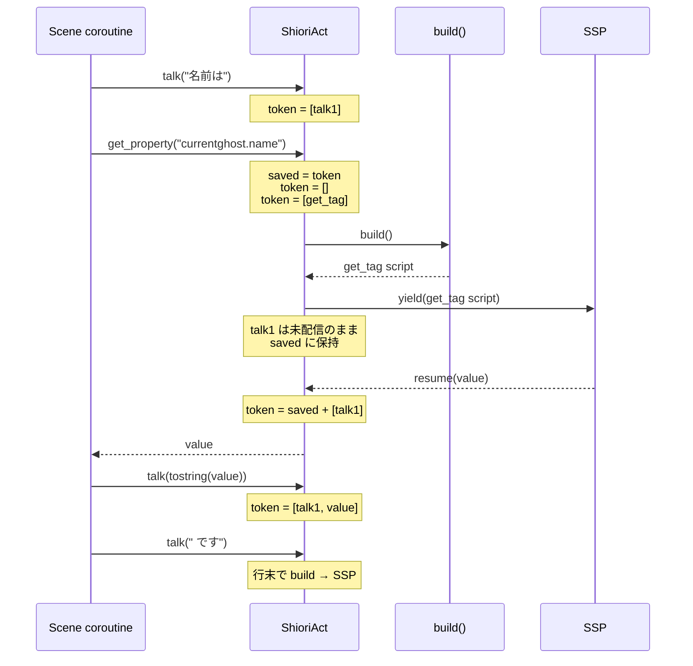

# Technical Design Document

## Overview

**Purpose**: Pasta DSLに `＄％`（プロパティスコープ修飾子）を導入し、SSPプロパティシステムへの読み書きを既存変数構文と一貫した記述で可能にする。これにより、`＄ゴースト名＝＄％currentghost.name` のような自然な記述だけでSSP非同期通信が透過的に行えるようになる。

**Users**: ゴースト作者（pasta DSL辞書作成者）が、Luaブロックを経由せずに `.pasta` ファイル内で直接プロパティアクセスを記述できる。

**Impact**: 既存の `pasta_dsl`（パーサー）・`pasta_lua`（トランスパイラ）・`pasta_lua/pasta_scripts/pasta/shiori/act.lua`（Lua API）の3層を協調的に拡張する。既存の `＄var`・`＄＊var` 構文への影響はなし。`pasta_lsp` のシンタックスハイライトも追従更新する。

### Goals
- `＄％prop.path` を変数スコープ修飾子として認識し、`act:set_property()` / `act:get_property()` への透過的なトランスパイルを実現する
- `get_property()` 呼び出し時の既存トークンバッファ非汚染を保証する
- 既存の `VarScope` 拡張パターン（`Args` 追加時の前例）に倣い、最小の変更で済ませる

### Non-Goals
- 式中でのプロパティ参照 `＄var＝＄％a ＋ ＄％b`（将来拡張）
- インラインGETのバッチ最適化（後付け可能、本specでは逐次呼び出し）
- LSPでのプロパティ名補完・バリデーション（シンタックスハイライトのみ追従）
- `%property[name]` 環境変数展開（`get_property` が上位互換）
- 新規プロパティ専用Lua APIの導入（既存 `set_property` / `get_property` を再利用）

## Boundary Commitments

### This Spec Owns
- Pestグラマー: `property_marker`・`property_id`・`var_ref_property`・`var_set_property` ルールおよび既存ルール順序の調整
- AST: `VarScope::Property` バリアントの追加
- パーサー: `var_ref_property` / `var_set_property` を `VarScope::Property` へマッピング
- トランスパイラ: `VarScope::Property` の3経路（VarSet、Action::VarRef、Expr::VarRef）でのコード生成
- Lua API改修: `SHIORI_ACT_IMPL.get_property()` のトークンバッファ退避・復元
- 既存LSP `visitors.rs` の `VarScope` matchへの `Property` バリアント追加（シンタックスハイライト互換維持）

### Out of Boundary
- 新規プロパティアクセス用Lua API（`get_property_silent` 等）の追加
- バッチプリフェッチによるyield最適化
- LSP補完・診断・ホバー情報（シンタックスハイライト以外のLSP機能）
- プロパティ名の存在検証や型変換
- 既存 `act:set_property()` のシグネチャ・挙動変更（変更なし）

### Allowed Dependencies
- 既存パーサー基盤: `Pest 2.8.x`、`pasta_dsl/parser/grammar.pest`、AST/ParseError構造
- 既存トランスパイラ基盤: `pasta_lua/code_gen/element_gen.rs`、`StringLiteralizer`
- 既存Lua API: `act:set_property(name, value)`（無変更で利用）、`act:get_property(name_or_names, ...)`（トークン保全のため内部改修）
- 既存非同期通信基盤: `CALLBACK.stage_pending`、`coroutine.yield`、`STORE.co_scene`（`shiori-async-talk` spec成果物）

### Revalidation Triggers
- `VarScope` enum 変更時: LSP `visitors.rs` および code_gen 全 `match scope` 箇所の網羅性再確認
- `act:get_property()` シグネチャ変更時: 本specのトランスパイラ生成コードの再検証
- Pestグラマーの `var_ref` / `var_set` 順序変更時: 既存テスト + 本spec新規テスト全件回帰

## Architecture

### Existing Architecture Analysis

本機能は既存3層パイプラインの**水平拡張**である。

| 層                                                | 既存パターン                                                                                            | 拡張点                                                                                 |
| ------------------------------------------------- | ------------------------------------------------------------------------------------------------------- | -------------------------------------------------------------------------------------- |
| パーサー (`pasta_dsl`)                            | Pestグラマー → AST構築（`parse_action`, `parse_elements`, `parse_scene`）                               | `var_ref_property`・`var_set_property` ルール追加、`VarScope::Property` AST バリアント |
| トランスパイラ (`pasta_lua`)                      | AST走査 → Lua文字列生成（`element_gen.rs` の `generate_var_set` / `generate_action` / `generate_expr`） | 3経路すべてに `VarScope::Property` match arm追加                                       |
| ランタイム (`pasta_scripts/pasta/shiori/act.lua`) | コルーチン内で `coroutine.yield(self:build())` → SSP通信 → resume                                       | `get_property()` 内のyield前後でトークン退避・復元                                     |
| LSP (`pasta_lsp`)                                 | AST走査 → セマンティックトークン生成                                                                    | `visitors.rs` の `match scope` に Property バリアント追加                              |

**保持される既存パターン**:
- Pest silent rule（`_{...}`）による既存マーカー定義
- `VarScope` enum の `Copy + PartialEq + Eq` derive
- `generate_var_set()` の `var_path = expr` 形式（Local/Global 用）

### Architecture Pattern & Boundary Map

```mermaid
graph LR
    subgraph DSL[.pasta source]
        Src[\$%prop = value<br/>\$var = \$%prop<br/>actor: \$%prop text]
    end
    subgraph Parser[pasta_dsl]
        Grammar[grammar.pest<br/>property_marker]
        AST[VarScope::Property<br/>VarRef/VarSet]
    end
    subgraph Transpiler[pasta_lua code_gen]
        Gen[element_gen.rs<br/>3 match arms]
    end
    subgraph Runtime[Lua runtime]
        SetAPI[act:set_property<br/>unchanged]
        GetAPI[act:get_property<br/>token save/restore]
    end
    subgraph LSP[pasta_lsp]
        Vis[visitors.rs<br/>highlight only]
    end

    Src --> Grammar
    Grammar --> AST
    AST --> Gen
    AST --> Vis
    Gen --> SetAPI
    Gen --> GetAPI
```

**選択パターン**: 既存コンポーネント拡張（Option A、ギャップ分析より）
- **理由**: `VarScope::Args` 追加時の前例と完全同型。matchの網羅性チェックにより漏れを自動検出可能
- **境界**: パーサー/トランスパイラ/Lua API/LSP の4層協調拡張。各層の責務は不変

### Technology Stack

| Layer      | Choice / Version              | Role in Feature        | Notes                                |
| ---------- | ----------------------------- | ---------------------- | ------------------------------------ |
| Parser     | Pest 2.8.x (既存)             | グラマー拡張、AST構築  | 新規ルール4本追加                    |
| Transpiler | Rust (既存 `pasta_lua` crate) | AST → Lua文字列        | `match scope` 4箇所に arm 追加       |
| Runtime    | LuaJIT 2.1 (既存)             | プロパティ呼び出し     | `get_property` 内のテーブル退避/復元 |
| LSP        | Rust (既存 `pasta_lsp` crate) | シンタックスハイライト | `match scope` 2箇所に arm 追加       |

### Dependency Direction
```
grammar.pest → AST (action.rs) → parser modules → transpiler (element_gen.rs) → Lua runtime (act.lua)
                              ↘ LSP visitors (visitors.rs)
```
各層は下流方向のみに依存。逆方向の参照は禁止。

## File Structure Plan

### Modified Files

| ファイル                                              | 変更内容                                                                                                                                                              |
| ----------------------------------------------------- | --------------------------------------------------------------------------------------------------------------------------------------------------------------------- |
| `crates/pasta_dsl/src/parser/grammar.pest`            | `property_marker`, `property_id`, `var_ref_property`, `var_set_property` ルール追加。`var_ref` / `var_set` の選択順を `property` → `global` → `local` に更新          |
| `crates/pasta_dsl/src/parser/ast/action.rs`           | `VarScope` enum に `Property` バリアント追加                                                                                                                          |
| `crates/pasta_dsl/src/parser/parse_action.rs`         | `parse_actions()` 内に `Rule::var_ref_property` match arm追加                                                                                                         |
| `crates/pasta_dsl/src/parser/parse_elements.rs`       | `parse_var_set()` の `match pair.as_rule()` に `Rule::var_set_property => VarScope::Property` 追加                                                                    |
| `crates/pasta_dsl/src/parser/parse_scene.rs`          | `Rule::var_set_local \| ... \| var_set_none` の match パターン2箇所に `var_set_property` を追加                                                                       |
| `crates/pasta_lua/src/code_gen/element_gen.rs`        | `generate_var_set()` / `generate_action()` (`Action::VarRef`) / `generate_expr()` / `generate_expr_to_buffer()` の `match scope` 4箇所に `VarScope::Property` arm追加 |
| `crates/pasta_lua/pasta_scripts/pasta/shiori/act.lua` | `SHIORI_ACT_IMPL.get_property()` の yield前後でトークンバッファ退避・復元                                                                                             |
| `crates/pasta_lsp/src/analysis/visitors.rs`           | `Expr::VarRef` および `Action::VarRef` の `match scope` 2箇所に `VarScope::Property` arm追加（`＄％name`/`$%name` パターン認識）                                      |

### New Test Files

| ファイル                                                     | 責務                                                                                                                  |
| ------------------------------------------------------------ | --------------------------------------------------------------------------------------------------------------------- |
| `crates/pasta_dsl/tests/property_scope_test.rs`              | パーサー: `＄％prop`、`＄％prop.path`、`＄％scope(0).x` のパース、`VarScope::Property` 確認、不正パターンのエラー検証 |
| `crates/pasta_lua/tests/property_scope_codegen_test.rs`      | トランスパイラ: SET/GET代入/インラインGET/式中エラーのLuaコード生成検証                                               |
| `crates/pasta_lua/tests/property_token_preservation_test.rs` | Lua APIテスト: `get_property()` がトークンバッファを汚染しないこと（既存 `shiori-event-test-framework` ベース）       |

## System Flows

### GETインライン展開フロー（トークン保全）



**鍵となる決定**:
- `talk1` は `get_property` 呼び出し時には配信されず、scene末尾の通常buildでまとめて配信される
- yield時に送信されるscriptは get_tag のみで構成され、SSP側のトーク表示には影響しない

### 各 `＄％` 形式のトランスパイル経路

```mermaid
flowchart LR
    A[＄％prop = value<br/>SET] --> B[parse_var_set<br/>→ VarSet { scope: Property }]
    C[＄var = ＄％prop<br/>GET代入] --> D[parse_var_set<br/>→ VarSet name + Expr::VarRef Property]
    E[actor: ＄％prop<br/>インライン] --> F[parse_actions<br/>→ Action::VarRef Property]

    B --> G[generate_var_set<br/>Property arm]
    D --> H[generate_var_set<br/>Property直接代入パス]
    F --> I[generate_action<br/>Property arm]

    G --> J[act:set_property name, val]
    H --> K[var.x = act:get_property name]
    I --> L[act.actor:talk tostring act:get_property name]
```

## Requirements Traceability

| Requirement | Summary                                           | Components                                    | Interfaces                                       | Flows              |
| ----------- | ------------------------------------------------- | --------------------------------------------- | ------------------------------------------------ | ------------------ |
| 1.1         | `＄％` をスコープ修飾子として認識                 | PestGrammar, ParseAction                      | `property_marker`, `var_ref_property`            | —                  |
| 1.2         | プロパティ名文字クラス `[a-zA-Z][_().a-zA-Z0-9]*` | PestGrammar                                   | `property_id`                                    | —                  |
| 1.3         | プロパティ名にドットを含む                        | PestGrammar                                   | `property_id`                                    | —                  |
| 1.4         | プロパティ名に括弧と数字を含む                    | PestGrammar                                   | `property_id`                                    | —                  |
| 1.5         | 許容外文字で終端                                  | PestGrammar                                   | `property_id`                                    | —                  |
| 1.6         | 全角・半角同等                                    | PestGrammar                                   | `property_marker`                                | —                  |
| 2.1〜2.6    | SET各種値タイプ                                   | ParseVarSet, GenerateVarSet                   | `parse_var_set`, `generate_var_set` Property arm | SET経路            |
| 3.1〜3.4    | GET代入・nil                                      | ParseVarSet, GenerateVarSet, GetProperty      | `generate_var_set` Property直接代入パス          | GET代入経路        |
| 3.5         | get_property トークン非汚染                       | GetPropertyLua                                | `SHIORI_ACT_IMPL.get_property`                   | トークン保全フロー |
| 4.1〜4.4    | インラインGET展開・分断なし                       | ParseActions, GenerateAction, GetPropertyLua  | `generate_action` Property arm                   | インラインフロー   |
| 4.5         | nilインライン → `"nil"` 文字列                    | GenerateAction                                | `tostring()` ラップ                              | —                  |
| 5.1〜5.4    | 既存構文互換                                      | PestGrammar (rule order)                      | 全 var_ref / var_set ルール                      | —                  |
| 6.1〜6.2    | 構文エラー                                        | PestGrammar                                   | Pest自動エラー報告                               | —                  |

## Components and Interfaces

| Component      | Domain/Layer   | Intent                                                 | Req Coverage                 | Key Dependencies                          | Contracts |
| -------------- | -------------- | ------------------------------------------------------ | ---------------------------- | ----------------------------------------- | --------- |
| PestGrammar    | Parser/Grammar | `＄％` 構文の文法定義                                  | 1.1〜1.6, 5.1〜5.4, 6.1〜6.2 | 既存grammar.pest (P0)                     | State     |
| VarScopeEnum   | Parser/AST     | `Property` バリアント追加                              | 1.1, 2.1, 3.1, 4.1           | action.rs (P0)                            | State     |
| ParseAction    | Parser         | `var_ref_property` → `VarScope::Property` 変換         | 1.1, 4.1                     | PestGrammar (P0), VarScopeEnum (P0)       | Service   |
| ParseVarSet    | Parser         | `var_set_property` → `VarSet { scope: Property }` 変換 | 2.1, 3.1                     | PestGrammar (P0), VarScopeEnum (P0)       | Service   |
| ParseScene     | Parser         | scene走査で `var_set_property` をディスパッチ          | 2.1, 3.1                     | ParseVarSet (P0)                          | Service   |
| GenerateVarSet | Transpiler     | SET/GET代入のLuaコード生成                             | 2.1〜2.6, 3.1〜3.4           | VarScopeEnum (P0), StringLiteralizer (P0) | Service   |
| GenerateAction | Transpiler     | インラインGETのLuaコード生成                           | 4.1〜4.5                     | VarScopeEnum (P0)                         | Service   |
| GenerateExpr   | Transpiler     | 式中Property参照のエラー化                             | 3.1〜3.4                     | VarScopeEnum (P0)                         | Service   |
| GetPropertyLua | Runtime        | yield前後のトークン退避・復元                          | 3.5, 4.4                     | 既存ACT.IMPL.build (P0), CALLBACK (P0)    | Service   |
| LspVisitors    | LSP            | `＄％prop` のシンタックスハイライト                    | 1.1, 5.1〜5.4                | VarScopeEnum (P0)                         | Service   |

### Parser

#### PestGrammar

| Field        | Detail                                |
| ------------ | ------------------------------------- |
| Intent       | `＄％` プロパティ構文のPest文法ルール |
| Requirements | 1.1〜1.6, 5.1〜5.4, 6.1〜6.2          |

**Responsibilities & Constraints**
- `property_marker` を `var_marker ~ actor_marker`（つまり `dollar ~ modulo`）として定義
- `property_id` を ASCII半角文字クラス `'a'..'z' | 'A'..'Z'` で始まり `'_' | '.' | '(' | ')' | digit | ASCII alpha` を後続として許容するatomic ruleとして定義（全角は許容しない、要件1.2準拠）
- `var_ref` の選択肢順序を `var_ref_property | var_ref_global | var_ref_local` に変更（PEG優先順）
- `var_set` の選択肢順序を `var_set_property | var_set_global | var_set_local | var_set_none` に変更
- 既存 `id` ルール（XID_START）との衝突なし — `％` は XID_START 外

**Dependencies**
- Inbound: ParseAction, ParseVarSet, ParseScene (P0)
- Outbound: 既存 dollar / modulo / set マーカー (P0)

**Contracts**: State

##### Grammar Additions
```pest
property_marker  = _{ dollar ~ modulo }
property_id      = @{ ASCII_ALPHA ~ ( "_" | "." | "(" | ")" | ASCII_DIGIT | ASCII_ALPHA )* }
var_ref_property = { property_marker ~ property_id ~ s }
var_set_property = { property_marker ~ property_id ~ s ~ set }
```

**Implementation Notes**
- Integration: 既存 `var_ref` / `var_set` ルール定義の選択肢順を変更
- Validation: 既存全パーサーテストの回帰、新規property test
- Risks: PEGの優先順序ミスで既存 `＄＊` パターンが property にマッチしないこと（`＄＊` の `＊` は modulo ではない、衝突なし）

#### VarScopeEnum

| Field        | Detail                                  |
| ------------ | --------------------------------------- |
| Intent       | `VarScope` に `Property` バリアント追加 |
| Requirements | 1.1, 2.1, 3.1, 4.1                      |

**Responsibilities & Constraints**
- 既存 `Copy + PartialEq + Eq + Debug + Clone` derive を維持
- 全 `match scope { ... }` 箇所（element_gen.rs 4箇所、visitors.rs 2箇所）に対する網羅性チェックでの漏れ検出

**Contracts**: State

##### Enum Definition
```rust
pub enum VarScope {
    Local,
    Global,
    Args(u8),
    Property,  // ＄％prop.path
}
```

#### ParseAction

| Field        | Detail                                                                             |
| ------------ | ---------------------------------------------------------------------------------- |
| Intent       | アクション行内の `var_ref_property` を `Action::VarRef { scope: Property }` に変換 |
| Requirements | 1.1, 4.1                                                                           |

**Responsibilities & Constraints**
- `parse_actions()` の `match inner.as_rule()` に新規 arm を追加
- `inner.into_inner()` から `Rule::property_id` を抽出し `name` フィールドに設定

**Contracts**: Service

##### Service Interface
```rust
// crates/pasta_dsl/src/parser/parse_action.rs
// parse_actions() 内の追加 arm:
Rule::var_ref_property => {
    for id_inner in inner.into_inner() {
        if id_inner.as_rule() == Rule::property_id {
            actions.push(Action::VarRef {
                name: id_inner.as_str().to_string(),
                scope: VarScope::Property,
                span: action_span,
            });
        }
    }
}
```
- Preconditions: `inner.as_rule() == Rule::var_ref_property`
- Postconditions: `actions` に `Action::VarRef` が1件追加される
- Invariants: 既存 `Rule::var_ref_local` / `Rule::var_ref_global` の挙動不変

#### ParseVarSet

| Field        | Detail                                                          |
| ------------ | --------------------------------------------------------------- |
| Intent       | `var_set_property` ルールを `VarSet { scope: Property }` に変換 |
| Requirements | 2.1, 3.1                                                        |

**Responsibilities & Constraints**
- 既存 `parse_var_set()` の `match pair.as_rule()` に `Rule::var_set_property => VarScope::Property` 追加
- 内部の `id` 抽出ロジックは既存 `id` ルール対応を `property_id` 対応に拡張（`Rule::id | Rule::property_id` 両対応）

**Contracts**: Service

##### Service Interface
```rust
// crates/pasta_dsl/src/parser/parse_elements.rs
let scope = match pair.as_rule() {
    Rule::var_set_global => VarScope::Global,
    Rule::var_set_property => VarScope::Property,
    _ => VarScope::Local,
};
// inner 走査で Rule::property_id も name として受理:
match inner.as_rule() {
    Rule::id | Rule::property_id => {
        if name.is_none() {
            name = Some(inner.as_str().to_string());
        }
    }
    // ...
}
```

#### ParseScene

| Field        | Detail                                                                    |
| ------------ | ------------------------------------------------------------------------- |
| Intent       | scene走査で `var_set_property` を `LocalSceneItem::VarSet` にディスパッチ |
| Requirements | 2.1, 3.1                                                                  |

**Responsibilities & Constraints**
- 既存2箇所の `match inner.as_rule()` に `Rule::var_set_property` を `var_set_local | var_set_global | var_set_none` の選択肢に追加

**Contracts**: Service

##### Service Interface
```rust
Rule::var_set_local | Rule::var_set_global | Rule::var_set_none | Rule::var_set_property => {
    scope.items.push(LocalSceneItem::VarSet(parse_var_set(inner)?));
}
```

### Transpiler

#### GenerateVarSet

| Field        | Detail                                       |
| ------------ | -------------------------------------------- |
| Intent       | `VarScope::Property` の SET/GET代入 Lua 生成 |
| Requirements | 2.1〜2.6, 3.1〜3.4                           |

**Responsibilities & Constraints**
- SET (`＄％prop＝value`): `act:set_property("prop", value_expr)` を出力。値が `SetValue::WordRef` の場合は `act:set_property("prop", act:word("word"))` を出力
- GET代入 (`＄var＝＄％prop`): scope match で `var_path` 確定後、value match の前に右辺 `Expr::VarRef { scope: Property }` を検出し、`var.name = act:get_property("prop")` を直接生成（`generate_expr` を通さない）
- 右辺が単一 `Expr::VarRef { Property }` 以外（Binary含む式中Property）の場合: 通常の value match → `generate_expr()` → `TranspileError::property_in_expression` でガード（要件3スコープ外）

**Contracts**: Service

##### Service Interface
```rust
// generate_var_set() 内分岐:

// Step 1: scope match で var_path 確定または SET 早期リターン
let var_path = match var_set.scope {
    VarScope::Local => format!("var.{}", name),
    VarScope::Global => format!("save.{}", name),
    VarScope::Property => {
        // SET: act:set_property("name", expr) を出力
        return self.generate_property_set(name, &var_set.value);
    }
    VarScope::Args(_) => return Err(...),
};

// Step 2: 右辺が単一Property参照なら直接代入を生成（generate_expr をバイパス）
if let SetValue::Expr(Expr::VarRef { name: prop_name, scope: VarScope::Property }) = &var_set.value {
    self.writeln(&format!("{} = act:get_property({})",
        var_path, StringLiteralizer::literalize(prop_name)?))?;
    return Ok(());
}

// Step 3: 通常の value match へフォールスルー
// → generate_expr() で VarScope::Property が出現した場合はエラー
```
- Preconditions: `var_set.scope == VarScope::Property`（SET）または `var_set.value` が `Expr::VarRef { Property }`（GET代入）
- Postconditions: SET は `act:set_property("name", expr)`、GET代入は `var.name = act:get_property("name")` を直接出力
- Invariants: Local/Global の既存出力パスは変更なし

#### GenerateAction

| Field        | Detail                                       |
| ------------ | -------------------------------------------- |
| Intent       | アクション行インラインの `＄％prop` Lua 生成 |
| Requirements | 4.1〜4.5                                     |

**Responsibilities & Constraints**
- `Action::VarRef { scope: Property, name }` で `act.{actor}:talk(tostring(act:get_property("{name}")))` を出力
- nil値は `tostring(nil)` → `"nil"` 文字列展開（要件4.5）
- アクション行内では `generate_action()` を逐次呼び出すため、各 `＄％` 参照ごとに独立した `act:get_property` 行が生成される（バッチ最適化なし、トークン保全がこれを安全にする）

**Contracts**: Service

##### Service Interface
```rust
// generate_action() の Action::VarRef 内:
VarScope::Property => {
    // 直接式に展開（中間変数なし）
    self.writeln(&format!(
        "act.{}:talk(tostring(act:get_property({})))",
        actor,
        StringLiteralizer::literalize(name)?
    ))?;
}
```

#### GenerateExpr

| Field        | Detail                               |
| ------------ | ------------------------------------ |
| Intent       | 式中 `VarScope::Property` のエラー化 |
| Requirements | 3.1〜3.4（境界明示）                 |

**Responsibilities & Constraints**
- `generate_expr()` および `generate_expr_to_buffer()` の `Expr::VarRef` match に `VarScope::Property` arm追加
- 直接ここに来ること自体がスコープ外: `TranspileError::property_in_expression()` を返す（spanなしバリアント — `Expr::VarRef` にspanフィールドが存在しないため。呼び出し側のGenerateVarSetが事前検出して直接式に出ないようにする）

**Contracts**: Service

##### Service Interface
```rust
VarScope::Property => {
    return Err(TranspileError::property_in_expression());
}
```

### Runtime

#### GetPropertyLua

| Field        | Detail                                                                |
| ------------ | --------------------------------------------------------------------- |
| Intent       | `get_property()` のトークンバッファ退避・復元によるバッファ非汚染保証 |
| Requirements | 3.5, 4.4                                                              |

**Responsibilities & Constraints**
- yield前: 既存 `self.token` を `saved_tokens` ローカル変数に退避し、`self.token = {}` で空テーブルに置換
- yield 引数: get タグのみを含む新バッファでの `self:build()` 結果
- resume後: `self.token = saved_tokens`（復元）→ さらに必要があればresume後のresult加工
- 例外パス（reason・nil返却）でも復元保証: pcallまたは退避を関数冒頭でlocal化して常に最後に書き戻す
- 既存シグネチャ（引数・戻り値）は不変

**Contracts**: Service

##### Service Interface (Lua)
```lua
function SHIORI_ACT_IMPL.get_property(self, name_or_names, timeout, timeout_message)
    -- ...既存のバリデーション・event_id生成...

    -- トークンバッファ退避
    local saved_tokens = self.token
    self.token = {}

    -- get タグのみ新バッファに登録
    local parts = { "\\![get,property," .. event_id }
    for i = 1, n do parts[#parts + 1] = escape_tag_arg(names[i]) end
    local tag = table.concat(parts, ",") .. "]"
    table.insert(self.token, { type = "raw_script", text = tag })

    -- yield（get タグのみのスクリプトを送信）
    local refs, reason = coroutine.yield(self:build())

    -- トークンバッファ復元（成功・失敗いずれの経路でも）
    self.token = saved_tokens

    if reason then error(reason) end
    -- ...既存の refs → out 変換...
end
```
- Preconditions: シーンコルーチン内で呼び出される
- Postconditions: 呼び出し前のトークンバッファ内容が呼び出し後も保持される。yield時のSSPへの送信内容には呼び出し前のトークンは含まれない
- Invariants: `self.token` の参照は呼び出し前後で同一テーブルである必要はない（再代入で構わない）

### LSP

#### LspVisitors

| Field        | Detail                              |
| ------------ | ----------------------------------- |
| Intent       | `＄％name` のシンタックスハイライト |
| Requirements | 1.1（互換性維持）                   |

**Responsibilities & Constraints**
- `visitors.rs` 内 `Expr::VarRef` / `Action::VarRef` の `match scope` 2箇所に `VarScope::Property` arm追加
- パターン: `format!("＄％{}", name)` および `format!("$%{}", name)` でテキスト検索し、`token_type::VARIABLE` でハイライト
- 補完・診断・ホバーは本specのスコープ外

**Contracts**: Service

##### Service Interface
```rust
VarScope::Property => vec![format!("＄％{}", name), format!("$%{}", name)],
```

## Data Models

本機能はインメモリAST拡張のみで、永続データモデル変更なし。

### Domain Model
- `VarScope` enum: Local / Global / Args(u8) / **Property（新規）**
- `Action::VarRef { name, scope, span }`: scope に Property を受け入れる
- `Expr::VarRef { name, scope }`: scope に Property を受け入れるが、トランスパイラで式中Propertyはエラー化
- `VarSet { name, scope, value, span }`: scope に Property を受け入れる

## Error Handling

### Error Strategy
- **パース時エラー**: Pest 自動エラー（位置情報付き）が要件6.1〜6.2を満たす
- **トランスパイル時エラー**: 既存 `TranspileError` 列挙型に `property_in_expression()` バリアント追加（spanなし — `Expr::VarRef` にspanフィールドが存在しないため、メッセージのみ）
- **ランタイムエラー**: 既存 `get_property` のエラーパス（コルーチン外呼び出し、引数不正、タイムアウト）に変更なし。トークン退避は関数冒頭で行うため、後続エラーが発生してもtoken復元は保証される（resume後の処理は最後に行うため、エラー時はtoken復元前に error() が呼ばれる可能性 → **設計判断**: バリデーションエラー（yield前）はtoken退避**前**に行うため影響なし、resume後の reason エラーは復元後に発生させる）

### Error Categories and Responses
- **User Errors**:
  - 不正プロパティ名（`＄％1abc` 等）→ Pest パースエラー（要件6.1）
  - プロパティ名なし（`＄％ `）→ Pest パースエラー（要件6.2）
  - 式中Property（`＄var＝＄％a ＋ 1`）→ `TranspileError::property_in_expression()`（spanなし、要件3スコープ外メッセージ）
- **System Errors**:
  - get_property タイムアウト → 既存 `CALLBACK.stage_pending` 仕組みで処理（変更なし）

### Monitoring
本specは新規ロギング項目なし。既存 `act:get_property` のログがそのまま機能する。

## Testing Strategy

### Unit Tests (Parser)
- `property_scope_test.rs`:
  - `＄％simple` → `VarScope::Property`, name="simple"（要件1.1, 1.2）
  - `＄％system.name` → name="system.name"（要件1.3）
  - `＄％scope(0).validwidth.initial` → name にカッコと数字を含む（要件1.4）
  - `＄％prop空白` → 空白で終端、後続Actionは Talk（要件1.5）
  - `$%halfwidth` と `＄％fullwidth` の両方を同一AST構造に解決（要件1.6）
  - 既存 `＄var` / `＄＊var` / `＄＝expr` のパース結果不変回帰（要件5.1〜5.3）

### Unit Tests (Transpiler)
- `property_scope_codegen_test.rs`:
  - SET各種値タイプ: リテラル/変数/単語/式（要件2.1〜2.6）→ `act:set_property("name", value)`
  - GET代入: `＄var＝＄％p` → `var.name = act:get_property("p")`（直接代入、要件3.1）
  - グローバル代入: `＄＊var＝＄％p` → `save.name = act:get_property("p")`（要件3.2）
  - インライン: `さくら：＄％p` → `act.さくら:talk(tostring(act:get_property("p")))`（要件4.1）
  - 式中Property: `＄var＝＄％a＋1` → `TranspileError::property_in_expression`

### Integration Tests (Runtime)
- `property_token_preservation_test.rs`:
  - `act:talk("A"); act:get_property("p"); act:talk("B")` を実行し、SSP宛てに送信される最初のスクリプトに "A" を含まないこと（要件3.5, 4.4）
  - resume後の最終出力に "A"・"B" が両方含まれること
  - get_property の戻り値が呼び出し側に正しく届くこと

### E2E Tests (DSL → ghost behavior)
- `pasta_sample_ghost` 内の任意のシーンに `＄ゴースト名＝＄％currentghost.name` + 後続トークを追加し、生成Luaのバイト一致＋実行時のscriptバイトストリーム検証

## Optional Sections

### Performance & Scalability
本spec導入によりyield回数が増加する（1プロパティ参照ごとに1yield）。バッチ最適化は本specスコープ外。`get_property` 呼び出しはSSPとの往復が発生するため、1アクション行内に多数の `＄％` 参照を含めると応答性に影響する可能性がある。設計判断: 「正確性優先、最適化は後付け」を採用（議題2の決定）。
