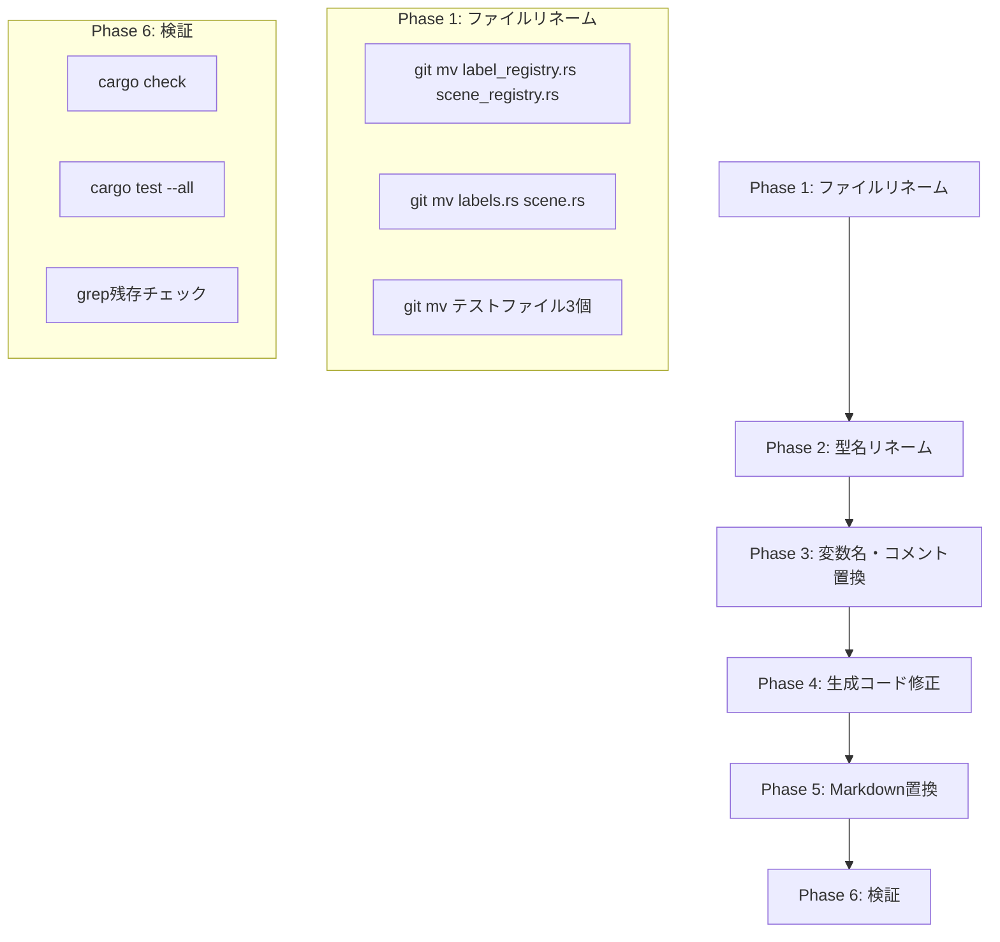

# Design Document: refactor-label-to-scene

## Overview

**Purpose**: Pastaプロジェクト全体で用語「ラベル（Label）」を「シーン（Scene）」に統一し、演劇的メタファーとの整合性を高める。

**Users**: Pasta DSL開発者・利用者、AIコーディングアシスタント

**Impact**: 純粋な用語リファクタリング。動作・API・セマンティクスに変更なし。

### Goals
- 全てのRustソースコード識別子（型名、関数名、変数名、引数名）を「Scene」に統一
- 全てのMarkdownドキュメントで「ラベル」を「シーン」に統一
- ファイル名・ディレクトリ名を「scene」に統一
- 生成されるRuneコード内の用語も統一

### Non-Goals
- 機能変更
- DSL構文マーカー（`＊`、`・`）の変更
- パッケージ名（`pasta`）の変更
- Git履歴の改変

## Architecture

### Existing Architecture Analysis

本リファクタリングは既存アーキテクチャを変更しない。以下のレイヤー構成を維持：

```
Engine (上位API) → Cache/Loader
    ↓
Transpiler (2pass) ← Parser (Pest)
    ↓
Runtime (Rune VM) → IR Output (ScriptEvent)
```

### Architecture Pattern & Boundary Map

**変更なし**: 本リファクタリングはアーキテクチャパターンや境界を変更しない。用語のみの変更。

### Technology Stack

| Layer | Choice / Version | Role in Feature | Notes |
|-------|------------------|-----------------|-------|
| IDE Tooling | rust-analyzer | 型名リネーム | IDE Rename機能使用 |
| CLI | PowerShell / sed | 文字列置換 | スクリプトベース置換 |
| VCS | Git | ファイルリネーム | `git mv`で履歴保持 |

## System Flows

### リファクタリング実行フロー



## Requirements Traceability

| Requirement | Summary | Components | Interfaces | Flows |
|-------------|---------|------------|------------|-------|
| 1.1-1.6 | ドキュメント用語統一 | MarkdownReplacer | - | Phase 5 |
| 2.1-2.4 | ステアリング用語統一 | MarkdownReplacer | - | Phase 5 |
| 3.1-3.10 | Rust識別子リネーム | IDERenamer, FileRenamer | - | Phase 1, 2 |
| 4.1-4.6 | 変数名・コメント置換 | CodeReplacer | - | Phase 3 |
| 5.1-5.3 | テストコード統一 | FileRenamer, CodeReplacer | - | Phase 1, 3 |
| 6.1-6.3 | エラーメッセージ統一 | CodeReplacer | - | Phase 3 |
| 7.1-7.5 | 生成コード統一 | TranspilerPatcher | - | Phase 4 |
| 8.1-8.3 | 仕様ドキュメント統一 | MarkdownReplacer | - | Phase 5 |

## Components and Interfaces

| Component | Domain/Layer | Intent | Req Coverage | Key Dependencies | Contracts |
|-----------|--------------|--------|--------------|-----------------|-----------|
| FileRenamer | Refactoring | ファイル・ディレクトリ名変更 | 3.1-3.10, 5.1 | Git | CLI |
| IDERenamer | Refactoring | Rust型名・構造体名リネーム | 3.1-3.10 | rust-analyzer | IDE |
| CodeReplacer | Refactoring | Rustコード内の変数名・コメント置換 | 4.1-4.6, 5.2-5.3, 6.1-6.3 | - | CLI |
| TranspilerPatcher | Refactoring | 生成Runeコードの文字列リテラル修正 | 7.1-7.5 | - | CLI |
| MarkdownReplacer | Refactoring | Markdownドキュメント内の用語置換 | 1.1-1.6, 2.1-2.4, 8.1-8.3 | - | CLI |
| Validator | Refactoring | リファクタリング結果の検証 | - | cargo | CLI |

### Refactoring Layer

#### FileRenamer

| Field | Detail |
|-------|--------|
| Intent | Git履歴を保持しながらファイル・ディレクトリをリネーム |
| Requirements | 3.1-3.10, 5.1, 8.3 |

**Responsibilities & Constraints**
- `git mv` コマンドでファイルリネーム
- mod.rs内の宣言も連動して更新必要

**対象ファイル**

| 現在のパス | 変更後のパス |
|-----------|------------|
| `src/transpiler/label_registry.rs` | `src/transpiler/scene_registry.rs` |
| `src/runtime/labels.rs` | `src/runtime/scene.rs` |
| `tests/label_id_consistency_test.rs` | `tests/scene_id_consistency_test.rs` |
| `tests/pasta_engine_label_resolution_test.rs` | `tests/pasta_engine_scene_resolution_test.rs` |
| `tests/pasta_transpiler_label_registry_test.rs` | `tests/pasta_transpiler_scene_registry_test.rs` |

**mod.rs更新箇所**

| ファイル | 変更内容 |
|---------|---------|
| `src/transpiler/mod.rs` | `mod label_registry;` → `mod scene_registry;` |
| `src/runtime/mod.rs` | `mod labels;` → `mod scene;` |

#### IDERenamer

| Field | Detail |
|-------|--------|
| Intent | rust-analyzer の Rename機能で型名を型安全にリネーム |
| Requirements | 3.1-3.10 |

**対象型名**

| 現在の型名 | 変更後 | 定義ファイル |
|----------|-------|------------|
| `LabelRegistry` | `SceneRegistry` | `src/transpiler/scene_registry.rs` |
| `LabelInfo` | `SceneInfo` | `src/transpiler/scene_registry.rs` |
| `LabelInfo` | `SceneInfo` | `src/runtime/scene.rs` |
| `LabelDef` | `SceneDef` | `src/parser/ast.rs` |
| `LabelScope` | `SceneScope` | `src/parser/ast.rs` |
| `LabelTable` | `SceneTable` | `src/runtime/scene.rs` |
| `LabelId` | `SceneId` | `src/runtime/scene.rs` |
| `LabelNotFound` | `SceneNotFound` | `src/error.rs` |

#### CodeReplacer

| Field | Detail |
|-------|--------|
| Intent | Rustコード内の変数名・引数名・コメントを置換 |
| Requirements | 4.1-4.6, 5.2-5.3, 6.1-6.3 |

**置換パターン（正規表現）**

| パターン | 置換後 | 対象 |
|---------|-------|------|
| `\blabel\b` | `scene` | 変数名・引数名 |
| `\blabels\b` | `scenes` | 複数形変数名 |
| `\bLabel\b` | `Scene` | キャメルケース（コメント内） |
| `label_registry` | `scene_registry` | スネークケース |
| `local_label` | `local_scene` | スネークケース |
| `global_label` | `global_scene` | スネークケース |

**対象ファイル**: `src/**/*.rs`, `tests/**/*.rs`

#### TranspilerPatcher

| Field | Detail |
|-------|--------|
| Intent | Transpilerが生成するRuneコード内の文字列リテラルを修正 |
| Requirements | 7.1-7.5 |

**対象箇所**

| ファイル | 現在の文字列 | 変更後 |
|---------|------------|-------|
| `src/transpiler/mod.rs` | `label_selector` | `scene_selector` |
| `src/transpiler/mod.rs` | `"ラベルID ${id} が見つかりませんでした"` | `"シーンID ${id} が見つかりませんでした"` |
| `src/stdlib/mod.rs` | `select_label_to_id` | `select_scene_to_id` |

#### MarkdownReplacer

| Field | Detail |
|-------|--------|
| Intent | Markdownドキュメント内の日本語・英語用語を置換 |
| Requirements | 1.1-1.6, 2.1-2.4, 8.1-8.3 |

**置換パターン（日本語）**

長いパターンから先に置換（部分一致を防ぐため）：

1. `グローバルラベル` → `グローバルシーン`
2. `ローカルラベル` → `ローカルシーン`
3. `ラベル定義` → `シーン定義`
4. `ラベル呼び出し` → `シーン呼び出し`
5. `ラベル前方一致` → `シーン前方一致`
6. `重複ラベル` → `重複シーン`
7. `ラベルテーブル` → `シーンテーブル`
8. `ラベル解決` → `シーン解決`
9. `ラベル検索` → `シーン検索`
10. ... （残りの派生語）
11. `ラベル` → `シーン` （最後に基本形）

**置換パターン（英語）**

1. `LabelRegistry` → `SceneRegistry`
2. `LabelTable` → `SceneTable`
3. `LabelNotFound` → `SceneNotFound`
4. `label_registry` → `scene_registry`
5. `label_table` → `scene_table`
6. `Label not found` → `Scene not found`
7. `label` → `scene` （最後に基本形、単語境界考慮）

**対象ファイル**:
- `GRAMMAR.md`, `SPECIFICATION.md`, `README.md`
- `.kiro/steering/*.md`
- `.kiro/specs/**/*.md`
- `examples/**/*.md`

#### Validator

| Field | Detail |
|-------|--------|
| Intent | リファクタリング結果を検証 |
| Requirements | - |

**検証ステップ**

```bash
# 1. コンパイルチェック
cargo check

# 2. 全テスト実行
cargo test --all

# 3. Clippy警告チェック
cargo clippy

# 4. 残存チェック（Rust）
grep -r "\blabel\b\|\bLabel\b" src/ tests/

# 5. 残存チェック（Markdown）
grep -r "ラベル" *.md .kiro/ examples/
```

## Data Models

**変更なし**: データモデルの構造は変更しない。識別子名のみ変更。

## Error Handling

### Error Strategy

リファクタリング中のエラーは即座に停止し、手動修正後に再開。

### Error Categories and Responses

| エラー種別 | 対応 |
|-----------|------|
| コンパイルエラー | 当該ファイルを手動確認・修正 |
| テスト失敗 | テストコードの置換漏れを確認 |
| grep残存検出 | 漏れ箇所を手動置換 |

## Testing Strategy

### 検証テスト

- **コンパイルチェック**: `cargo check` で全ファイルがコンパイル可能
- **ユニットテスト**: `cargo test --all` で全テストパス
- **Lint**: `cargo clippy` で新規警告なし
- **残存チェック**: grep で「label」「ラベル」が残っていないこと

### 回帰テスト

既存のテストスイートが全てパスすることで、機能的な回帰がないことを確認。

## Migration Strategy

### Phase 1: ファイルリネーム

```bash
git mv src/transpiler/label_registry.rs src/transpiler/scene_registry.rs
git mv src/runtime/labels.rs src/runtime/scene.rs
git mv tests/label_id_consistency_test.rs tests/scene_id_consistency_test.rs
git mv tests/pasta_engine_label_resolution_test.rs tests/pasta_engine_scene_resolution_test.rs
git mv tests/pasta_transpiler_label_registry_test.rs tests/pasta_transpiler_scene_registry_test.rs
```

### Phase 2: 型名リネーム

IDE (VS Code + rust-analyzer) の Rename 機能を使用：
1. `LabelRegistry` → `SceneRegistry`
2. `LabelInfo` → `SceneInfo`（両方）
3. `LabelDef` → `SceneDef`
4. `LabelScope` → `SceneScope`
5. `LabelTable` → `SceneTable`
6. `LabelId` → `SceneId`
7. `LabelNotFound` → `SceneNotFound`

### Phase 3: 変数名・コメント置換

PowerShell/sed スクリプトで一括置換。

### Phase 4: 生成コード修正

`src/transpiler/mod.rs`, `src/stdlib/mod.rs` を手動編集。

### Phase 5: Markdown置換

PowerShell/sed スクリプトで一括置換。

### Phase 6: 検証

```bash
cargo check && cargo test --all && cargo clippy
```

### Phase 7: ディレクトリリネーム（最後）

```bash
git mv .kiro/specs/refactor-label-to-scene .kiro/specs/refactor-scene
```

## Supporting References

詳細な調査結果は [research.md](research.md) を参照。
