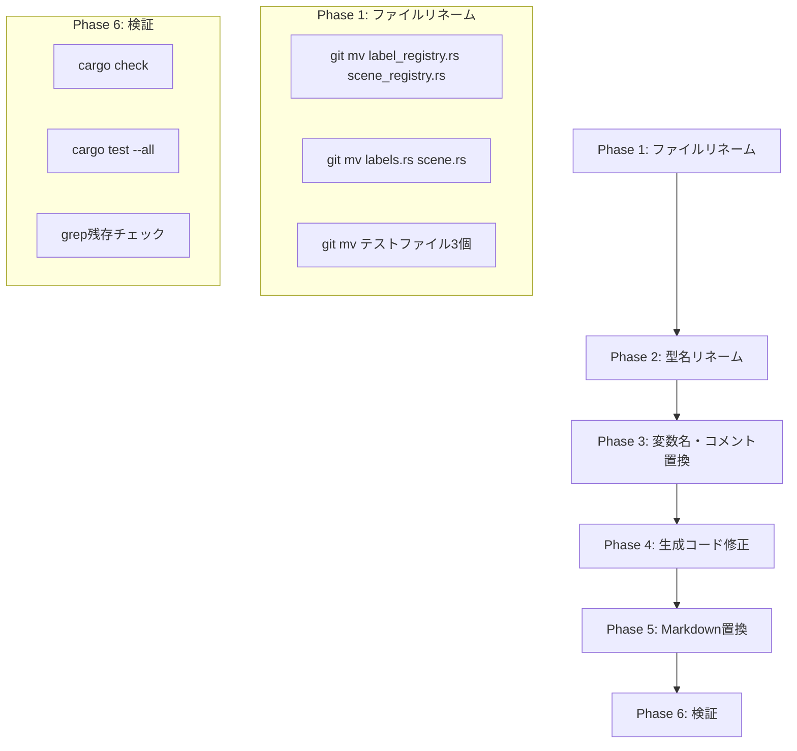

# Design Document: refactor-label-to-scene

## Overview

**Purpose**: Pastaプロジェクト全体で用語「ラベル（Label）」を「シーン（Scene）」に統一し、演劇的メタファーとの整合性を高める。

**Users**: Pasta DSL開発者・利用者、AIコーディングアシスタント

**Impact**: 純粋な用語リファクタリング。動作・API・セマンティクスに変更なし。

### Goals
- 全てのRustソースコード識別子（型名、関数名、変数名、引数名）を「Scene」に統一
- 全てのMarkdownドキュメントで「ラベル」を「シーン」に統一
- ファイル名・ディレクトリ名を「scene」に統一
- 生成されるRuneコード内の用語も統一

### Non-Goals
- 機能変更
- DSL構文マーカー（`＊`、`・`）の変更
- パッケージ名（`pasta`）の変更
- Git履歴の改変

## Architecture

### Existing Architecture Analysis

本リファクタリングは既存アーキテクチャを変更しない。以下のレイヤー構成を維持：

```
Engine (上位API) → Cache/Loader
    ↓
Transpiler (2pass) ← Parser (Pest)
    ↓
Runtime (Rune VM) → IR Output (ScriptEvent)
```

### Architecture Pattern & Boundary Map

**変更なし**: 本リファクタリングはアーキテクチャパターンや境界を変更しない。用語のみの変更。

### Technology Stack

| Layer | Choice / Version | Role in Feature | Notes |
|-------|------------------|-----------------|-------|
| IDE Tooling | rust-analyzer | 型名リネーム | IDE Rename機能使用 |
| CLI | PowerShell / sed | 文字列置換 | スクリプトベース置換 |
| VCS | Git | ファイルリネーム | `git mv`で履歴保持 |

## System Flows

### リファクタリング実行フロー



## Requirements Traceability

| Requirement | Summary | Components | Interfaces | Flows |
|-------------|---------|------------|------------|-------|
| 1.1-1.6 | ドキュメント用語統一 | MarkdownReplacer | - | Phase 5 |
| 2.1-2.4 | ステアリング用語統一 | MarkdownReplacer | - | Phase 5 |
| 3.1-3.10 | Rust識別子リネーム | IDERenamer, FileRenamer | - | Phase 1, 2 |
| 4.1-4.6 | 変数名・コメント置換 | CodeReplacer | - | Phase 3 |
| 5.1-5.3 | テストコード統一 | FileRenamer, CodeReplacer | - | Phase 1, 3 |
| 6.1-6.3 | エラーメッセージ統一 | CodeReplacer | - | Phase 3 |
| 7.1-7.5 | 生成コード統一 | TranspilerPatcher | - | Phase 4 |
| 8.1-8.3 | 仕様ドキュメント統一 | MarkdownReplacer | - | Phase 5 |

## Components and Interfaces

| Component | Domain/Layer | Intent | Req Coverage | Key Dependencies | Contracts |
|-----------|--------------|--------|--------------|-----------------|-----------|
| FileRenamer | Refactoring | ファイル・ディレクトリ名変更 | 3.1-3.10, 5.1 | Git | CLI |
| IDERenamer | Refactoring | Rust型名・構造体名リネーム | 3.1-3.10 | rust-analyzer | IDE |
| CodeReplacer | Refactoring | Rustコード内の変数名・コメント置換 | 4.1-4.6, 5.2-5.3, 6.1-6.3 | - | CLI |
| TranspilerPatcher | Refactoring | 生成Runeコードの文字列リテラル修正 | 7.1-7.5 | - | CLI |
| MarkdownReplacer | Refactoring | Markdownドキュメント内の用語置換 | 1.1-1.6, 2.1-2.4, 8.1-8.3 | - | CLI |
| Validator | Refactoring | リファクタリング結果の検証 | - | cargo | CLI |

### Refactoring Layer

#### FileRenamer

| Field | Detail |
|-------|--------|
| Intent | Git履歴を保持しながらファイル・ディレクトリをリネーム |
| Requirements | 3.1-3.10, 5.1, 8.3 |

**Responsibilities & Constraints**
- `git mv` コマンドでファイルリネーム
- mod.rs内の宣言も連動して更新必要

**対象ファイル**

| 現在のパス | 変更後のパス |
|-----------|------------|
| `src/transpiler/label_registry.rs` | `src/transpiler/scene_registry.rs` |
| `src/runtime/labels.rs` | `src/runtime/scene.rs` |
| `tests/label_id_consistency_test.rs` | `tests/scene_id_consistency_test.rs` |
| `tests/pasta_engine_label_resolution_test.rs` | `tests/pasta_engine_scene_resolution_test.rs` |
| `tests/pasta_transpiler_label_registry_test.rs` | `tests/pasta_transpiler_scene_registry_test.rs` |

**mod.rs更新箇所**

| ファイル | 変更内容 |
|---------|---------|
| `src/transpiler/mod.rs` | `mod label_registry;` → `mod scene_registry;` |
| `src/runtime/mod.rs` | `mod labels;` → `mod scene;` |

#### IDERenamer

| Field | Detail |
|-------|--------|
| Intent | rust-analyzer の Rename機能で型名を型安全にリネーム |
| Requirements | 3.1-3.10 |

**対象型名**

| 現在の型名 | 変更後 | 定義ファイル |
|----------|-------|------------|
| `LabelRegistry` | `SceneRegistry` | `src/transpiler/scene_registry.rs` |
| `LabelInfo` | `SceneInfo` | `src/transpiler/scene_registry.rs` |
| `LabelInfo` | `SceneInfo` | `src/runtime/scene.rs` |
| `LabelDef` | `SceneDef` | `src/parser/ast.rs` |
| `LabelScope` | `SceneScope` | `src/parser/ast.rs` |
| `LabelTable` | `SceneTable` | `src/runtime/scene.rs` |
| `LabelId` | `SceneId` | `src/runtime/scene.rs` |
| `LabelNotFound` | `SceneNotFound` | `src/error.rs` |

#### CodeReplacer

| Field | Detail |
|-------|--------|
| Intent | Rustコード内の変数名・引数名・コメントを置換 |
| Requirements | 4.1-4.6, 5.2-5.3, 6.1-6.3 |

**置換パターン（正規表現）**

| パターン | 置換後 | 対象 |
|---------|-------|------|
| `\blabel\b` | `scene` | 変数名・引数名 |
| `\blabels\b` | `scenes` | 複数形変数名 |
| `\bLabel\b` | `Scene` | キャメルケース（コメント内） |
| `label_registry` | `scene_registry` | スネークケース |
| `local_label` | `local_scene` | スネークケース |
| `global_label` | `global_scene` | スネークケース |

**対象ファイル**: `src/**/*.rs`, `tests/**/*.rs`

#### TranspilerPatcher

| Field | Detail |
|-------|--------|
| Intent | Transpilerが生成するRuneコード内の文字列リテラルを修正 |
| Requirements | 7.1-7.5 |

**対象箇所**

| ファイル | 現在の文字列 | 変更後 |
|---------|------------|-------|
| `src/transpiler/mod.rs` | `label_selector` | `scene_selector` |
| `src/transpiler/mod.rs` | `"ラベルID ${id} が見つかりませんでした"` | `"シーンID ${id} が見つかりませんでした"` |
| `src/stdlib/mod.rs` | `select_label_to_id` | `select_scene_to_id` |

#### MarkdownReplacer

| Field | Detail |
|-------|--------|
| Intent | Markdownドキュメント内の日本語・英語用語を置換 |
| Requirements | 1.1-1.6, 2.1-2.4, 8.1-8.3 |

**置換パターン（日本語）**

長いパターンから先に置換（部分一致を防ぐため）：

1. `グローバルラベル` → `グローバルシーン`
2. `ローカルラベル` → `ローカルシーン`
3. `ラベル定義` → `シーン定義`
4. `ラベル呼び出し` → `シーン呼び出し`
5. `ラベル前方一致` → `シーン前方一致`
6. `重複ラベル` → `重複シーン`
7. `ラベルテーブル` → `シーンテーブル`
8. `ラベル解決` → `シーン解決`
9. `ラベル検索` → `シーン検索`
10. ... （残りの派生語）
11. `ラベル` → `シーン` （最後に基本形）

**置換パターン（英語）**

1. `LabelRegistry` → `SceneRegistry`
2. `LabelTable` → `SceneTable`
3. `LabelNotFound` → `SceneNotFound`
4. `label_registry` → `scene_registry`
5. `label_table` → `scene_table`
6. `Label not found` → `Scene not found`
7. `label` → `scene` （最後に基本形、単語境界考慮）

**対象ファイル** (限定的):

仕様書（Req 1.1-1.6, 2.1-2.4）で指定されたファイルのみ：
- `GRAMMAR.md`, `SPECIFICATION.md`, `README.md`
- `.kiro/steering/*.md` (product.md, tech.md, structure.md, grammar.md, workflow.md)
- `examples/**/*.md`

**除外**: `.kiro/specs/` 内の他仕様ディレクトリ（例：pasta-grammar-revision など）は置換対象外。本リファクタリング仕様内の spec.md/design.md/research.md は最後に個別確認。

#### Validator

| Field | Detail |
|-------|--------|
| Intent | リファクタリング結果を検証 |
| Requirements | - |

**検証ステップ**

```bash
# 1. コンパイルチェック
cargo check

# 2. 全テスト実行
cargo test --all

# 3. Clippy警告チェック
cargo clippy

# 4. 残存チェック（Rust）
grep -r "\blabel\b\|\bLabel\b" src/ tests/

# 5. 残存チェック（Markdown）
grep -r "ラベル" *.md .kiro/ examples/
```

## Data Models

**変更なし**: データモデルの構造は変更しない。識別子名のみ変更。

## Error Handling

### Error Strategy

リファクタリング中のエラーは即座に停止し、手動修正後に再開。
各フェーズ完了後にマイルストーンコミットを実行し、ロールバック対応を容易にする。

### Error Categories and Responses

| エラー種別 | 対応 |
|-----------|------|
| コンパイルエラー | 当該ファイルを手動確認・修正、またはフォールバック手順実行 |
| テスト失敗 | テストコードの置換漏れを確認、手動修正 |
| grep残存検出 | 漏れ箇所を手動置換 |

### ロールバック戦略

大規模エラー発生時の復旧手順：

#### マイルストーンコミット

各フェーズ完了後に確認ポイント設置：

| フェーズ | 検証コマンド | コミット |
|---------|-------------|---------|
| Phase 1完了 | `git status` + `cargo check` | ✓ マイルストーン1 |
| Phase 2完了 | `cargo check` + `cargo test --all` | ✓ マイルストーン2 |
| Phase 3完了 | `cargo clippy` | ✓ マイルストーン3 |
| Phase 4完了 | `cargo test --all` | ✓ マイルストーン4 |
| Phase 5完了 | grep確認 | ✓ マイルストーン5 |
| Phase 6完了 | `cargo test --all` | ✓ マイルストーン6 |

#### エラー時の復旧手順

```bash
# 1. 現在の状態確認
git status
git log --oneline -10

# 2. 差分内容確認
git diff HEAD

# 3. 直前のマイルストーンまでロールバック
# 例：マイルストーン2 まで戻す場合
git reset --hard <マイルストーン2のコミットハッシュ>

# または直前 N コミット分ロールバック
git reset --hard HEAD~3  # 3コミット前まで戻す

# 4. ロールバック後、エラー原因を分析して再実行
```

#### マイルストーンコミットメッセージ形式

```
refactor(label-to-scene): Phase N 完了 - <フェーズ説明>

マイルストーン: M (cumulative X files changed)
```

## Testing Strategy

### 検証テスト

- **コンパイルチェック**: `cargo check` で全ファイルがコンパイル可能
- **ユニットテスト**: `cargo test --all` で全テストパス
- **Lint**: `cargo clippy` で新規警告なし
- **残存チェック**: grep で「label」「ラベル」が残っていないこと

### 回帰テスト

既存のテストスイートが全てパスすることで、機能的な回帰がないことを確認。

## Migration Strategy

### Phase 1: ファイルリネーム

```bash
# 前提コミット
git add -A
git commit -m "refactor(label-to-scene): Phase 1 開始前コミット"

# ファイルリネーム実行
git mv src/transpiler/label_registry.rs src/transpiler/scene_registry.rs
git mv src/runtime/labels.rs src/runtime/scene.rs
git mv tests/label_id_consistency_test.rs tests/scene_id_consistency_test.rs
git mv tests/pasta_engine_label_resolution_test.rs tests/pasta_engine_scene_resolution_test.rs
git mv tests/pasta_transpiler_label_registry_test.rs tests/pasta_transpiler_scene_registry_test.rs

# mod.rs 内の宣言更新
# src/transpiler/mod.rs: mod label_registry; → mod scene_registry;
# src/runtime/mod.rs: mod labels; → mod scene;

# 検証・コミット
cargo check
git add -A
git commit -m "refactor(label-to-scene): Phase 1 ファイルリネーム完了"
```

### Phase 2: 型名リネーム（グラデュアル方式）

**方針**: 実施前コミット → Rename → cargo check → 修正 → コミット を繰り返し、修正不可能な問題を事前に防止。

**実行主体**: AI（開発者）がリネームを実施。

#### 2.1. 前提コミット

```bash
git status
git add -A
git commit -m "refactor(label-to-scene): Phase 2 開始前コミット"
```

#### 2.2. グラデュアルリネーム（4チャンク）

各チャンク：**リネーム → cargo check → 修正必要なら修正 → コミット**

**チャンク1** (Parser層):
1. `LabelDef` → `SceneDef` (src/parser/ast.rs で定義)
2. `LabelScope` → `SceneScope` (src/parser/ast.rs で定義)

```bash
# IDE Rename実行: LabelDef → SceneDef
# IDE Rename実行: LabelScope → SceneScope
cargo check
# 失敗時: 当該ファイルを確認・修正（または grep + sed）
git add -A
git commit -m "refactor(label-to-scene): Phase 2.1 Parser層型リネーム完了"
```

**チャンク2** (Transpiler層):
1. `LabelRegistry` → `SceneRegistry` (src/transpiler/scene_registry.rs)
2. `LabelInfo` → `SceneInfo` (src/transpiler/scene_registry.rs)

```bash
# IDE Rename実行: LabelRegistry → SceneRegistry
# IDE Rename実行: LabelInfo → SceneInfo
cargo check
# 失敗時: 修正
git add -A
git commit -m "refactor(label-to-scene): Phase 2.2 Transpiler層型リネーム完了"
```

**チャンク3** (Runtime層):
1. `LabelTable` → `SceneTable` (src/runtime/scene.rs)
2. `LabelId` → `SceneId` (src/runtime/scene.rs)
3. `LabelInfo` → `SceneInfo` (src/runtime/scene.rs)

```bash
# IDE Rename実行: LabelTable → SceneTable
# IDE Rename実行: LabelId → SceneId
# IDE Rename実行: LabelInfo → SceneInfo (Runtime版)
cargo check
# 失敗時: 修正
git add -A
git commit -m "refactor(label-to-scene): Phase 2.3 Runtime層型リネーム完了"
```

**チャンク4** (Error/その他):
1. `LabelNotFound` → `SceneNotFound` (src/error.rs)

```bash
# IDE Rename実行: LabelNotFound → SceneNotFound
cargo check
# 失敗時: 修正
git add -A
git commit -m "refactor(label-to-scene): Phase 2.4 Error型リネーム完了"
```

#### 2.3. テスト検証

```bash
cargo test --all
# 失敗時: テストコード修正 → 再度 cargo test --all → コミット
git add -A
git commit -m "refactor(label-to-scene): Phase 2 テスト修正・検証完了"
```

### Phase 3: 変数名・コメント置換

**方針**: Phase 2 同様、段階的チェック・コミット方式を採用。

**実行主体**: AI（開発者）が置換スクリプト実施。

#### 3.1. 対象ファイル確認・スクリプト準備

```bash
# 対象ファイルリスト作成
find src -name "*.rs" -type f > /tmp/rust_files.txt
find tests -name "*.rs" -type f >> /tmp/rust_files.txt

# 前提コミット
git add -A
git commit -m "refactor(label-to-scene): Phase 3 開始前コミット"
```

#### 3.2. グラデュアル置換（3チャンク）

**チャンク1** (Transpiler・Runtime層の変数):
```bash
# スネークケース置換: label_* → scene_*
find src/transpiler src/runtime -name "*.rs" -exec sed -i 's/\blabel_/scene_/g' {} +

cargo check
# 失敗時: 修正
git add -A
git commit -m "refactor(label-to-scene): Phase 3.1 label_* 置換完了"
```

**チャンク2** (ローカル変数・引数: label → scene):
```bash
# 単語境界を考慮した置換
find src -name "*.rs" -exec sed -i 's/\blabel\b/scene/g' {} +
find tests -name "*.rs" -exec sed -i 's/\blabel\b/scene/g' {} +

cargo check
# 失敗時: 修正
git add -A
git commit -m "refactor(label-to-scene): Phase 3.2 label→scene 置換完了"
```

**チャンク3** (複数形: labels → scenes、コメント内のLabel):
```bash
# 複数形置換
find src -name "*.rs" -exec sed -i 's/\blabels\b/scenes/g' {} +
find tests -name "*.rs" -exec sed -i 's/\blabels\b/scenes/g' {} +

# コメント内のLabel（キャメルケース）
find src -name "*.rs" -exec sed -i 's/\bLabel\b/Scene/g' {} +
find tests -name "*.rs" -exec sed -i 's/\bLabel\b/Scene/g' {} +

cargo check
# 失敗時: 修正
git add -A
git commit -m "refactor(label-to-scene): Phase 3.3 複数形・コメント置換完了"
```

#### 3.3. テスト検証（重要：トランスパイラー出力修正含む）

```bash
cargo test --all
```

**テスト失敗時の対応**（必須スコープ）:
- トランスパイラー出力の変更により、テストが失敗する可能性あり
- テストコード内の期待値（assertion）を修正
  - 例：`label_selector` → `scene_selector`
  - 例：`label_fn` → `scene_fn`
  - 例：ラベルID関連のエラーメッセージ修正
- テスト修正後、再度 `cargo test --all` で検証
- コミット: `git commit -m "refactor(label-to-scene): Phase 3 テスト修正・検証完了"`

### Phase 4: 生成コード修正（Transpiler出力）

**方針**: Transpiler が生成する Rune コード内の識別子を修正。

#### 4.1. 前提コミット

```bash
git add -A
git commit -m "refactor(label-to-scene): Phase 4 開始前コミット"
```

#### 4.2. 生成コード修正

対象ファイル：
- `src/transpiler/mod.rs`: `label_selector` → `scene_selector`、エラーメッセージ修正
- `src/stdlib/mod.rs`: `select_label_to_id` → `select_scene_to_id`

```bash
# 手動編集（IDE検索置換利用）:
# src/transpiler/mod.rs で:
#   "label_selector" → "scene_selector"
#   "ラベルID" → "シーンID"
# src/stdlib/mod.rs で:
#   "select_label_to_id" → "select_scene_to_id"

cargo check
# 失敗時: 修正
git add -A
git commit -m "refactor(label-to-scene): Phase 4 生成コード修正完了"
```

#### 4.3. テスト検証

```bash
cargo test --all
# 失敗時: テスト修正 → 再度 cargo test --all → コミット
```

### Phase 5: Markdown置換

**方針**: Markdown ドキュメント内の用語を置換。

**実行主体**: AI（開発者）が戦略的に実施。

#### 5.1. 対象ドキュメント確認

```bash
# 前提コミット
git add -A
git commit -m "refactor(label-to-scene): Phase 5 開始前コミット"
```

#### 5.2. グラデュアル Markdown 置換

**チャンク1** (ステアリング・メイン仕様):
```bash
# .kiro/steering/ と メイン仕様（GRAMMAR.md, SPECIFICATION.md, README.md）
# 長いパターンから先に置換: グローバルラベル→グローバルシーン等
# 最後に短いパターン: ラベル→シーン

# 置換スクリプト実行（パターン順序重視）
grep -r "ラベル" .kiro/steering/ GRAMMAR.md SPECIFICATION.md README.md
# 置換実行後:
git add -A
git commit -m "refactor(label-to-scene): Phase 5.1 ステアリング・メイン仕様置換完了"
```

**チャンク2** (Examples・完了仕様):
```bash
# examples/ と .kiro/specs/completed/ 
grep -r "ラベル" examples/ .kiro/specs/completed/
# 置換実行後:
git add -A
git commit -m "refactor(label-to-scene): Phase 5.2 Examples・完了仕様置換完了"
```

#### 5.3. grep 確認

```bash
# 残存確認
grep -r "ラベル" . --include="*.md" | grep -v ".git"
```

### Phase 6: 最終検証

```bash
# コンパイル
cargo check

# 全テスト実行
cargo test --all

# Lint
cargo clippy

# 残存チェック（Rust）
grep -r "\blabel\b\|\bLabel\b" src/ tests/

# 残存チェック（Markdown）
grep -r "ラベル" *.md .kiro/ examples/ | grep -v ".git"

# すべてクリア後
git add -A
git commit -m "refactor(label-to-scene): Phase 6 最終検証完了"
```

### Phase 7: ディレクトリリネーム（最後）

```bash
# 最後に仕様ディレクトリ自体をリネーム（オプション）
git mv .kiro/specs/refactor-label-to-scene .kiro/specs/refactor-scene

git add -A
git commit -m "refactor(label-to-scene): Phase 7 ディレクトリリネーム・リファクタリング完了"
```

## Supporting References

詳細な調査結果は [research.md](research.md) を参照。
