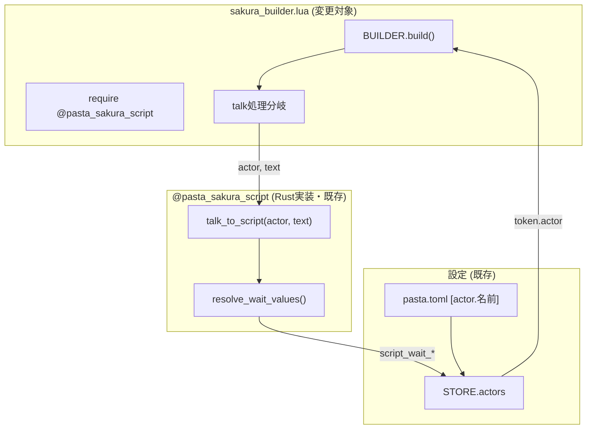
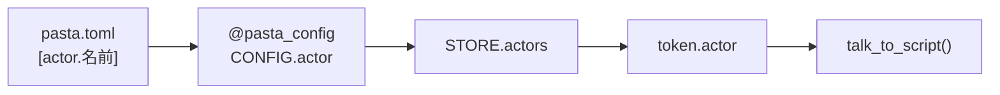

# Technical Design: refine-talk-conversion

## Overview

**Purpose**: 本機能は、`sakura_builder.lua`のトーク変換処理を洗練化し、単純エスケープ処理（`escape_sakura`）を`@pasta_sakura_script.talk_to_script`に置き換えることで、会話テキストに自然なウェイトタグを自動付与する。

**Users**: ゴースト開発者は、pasta.toml設定のみで各キャラクターの会話テンポをカスタマイズ可能になる。

**Impact**: 現在の単純エスケープ処理をウェイト挿入処理に置き換え、さくらスクリプト出力に`\_w[ms]`タグが含まれるようになる。

### Goals
- `escape_sakura`関数呼び出しを`SAKURA_SCRIPT.talk_to_script`に置き換える
- actorオブジェクトを活用したキャラクター固有ウェイト設定の自動適用
- 既存テストの期待値を新形式に更新

### Non-Goals
- `talk_to_script`関数自体の修正（既に実装済み）
- 新しいウェイト設定項目の追加
- actor.talkサブテーブル構造の導入

## Architecture

### Existing Architecture Analysis

**Current Implementation** ([sakura_builder.lua](../../crates/pasta_lua/scripts/pasta/shiori/sakura_builder.lua)):
- 行12-17: `escape_sakura`ローカル関数（単純エスケープ処理）
- 行78: `local actor = token.actor` でactorオブジェクト取得
- 行96: `escape_sakura(inner.text)`呼び出し

**Existing Module** ([mod.rs](../../crates/pasta_lua/src/sakura_script/mod.rs)):
- `@pasta_sakura_script`モジュールは実装済み
- `talk_to_script(actor, text)` 関数が利用可能
- 3段階フォールバック: actor → config → ハードコード値

**Integration Points**:
- `STORE.actors = CONFIG.actor`（pasta.toml設定の共有）
- `token.actor`（group_by_actor経由のactorオブジェクト）

### Architecture Pattern & Boundary Map



**Architecture Integration**:
- **Selected pattern**: 既存モジュール呼び出しパターン（変更最小化）
- **Domain boundaries**: sakura_builder.luaはビルド責務のみ、ウェイト計算は@pasta_sakura_scriptに委譲
- **Existing patterns preserved**: require/モジュール呼び出しパターン、STORE経由の設定共有
- **New components rationale**: 新規コンポーネントなし
- **Steering compliance**: lua-coding.md準拠（モジュールrequire、UPPER_CASE変数）

### Technology Stack

| Layer | Choice / Version | Role in Feature | Notes |
|-------|------------------|-----------------|-------|
| Backend | Lua 5.5 (mlua 0.11) | スクリプト実行環境 | 既存 |
| Module | @pasta_sakura_script | ウェイト挿入処理 | Rust実装、既存 |
| Config | pasta.toml | actor設定 | 既存 |

**デフォルトウェイト値** (pasta.toml `[talk]`セクション、config.rs定義):
- `script_wait_normal`: 50ms（一般文字）
- `script_wait_period`: 1000ms（句点）
- `script_wait_comma`: 500ms（読点）
- `script_wait_strong`: 500ms（強調文字）
- `script_wait_leader`: 200ms（リーダー文字）

## Requirements Traceability

| Requirement | Summary | Components | Interfaces | Flows |
|-------------|---------|------------|------------|-------|
| 1.1, 1.2, 1.3 | escape_sakura→talk_to_script置換 | sakura_builder | talk_to_script | トーク変換フロー |
| 2.1, 2.2 | モジュール読み込み | sakura_builder | require | 初期化フロー |
| 3.1, 3.2, 3.3 | actor情報受け渡し | sakura_builder | talk_to_script | トーク変換フロー |
| 4.1, 4.2 | escape_sakura削除 | sakura_builder | - | - |
| 5.1, 5.2, 5.3 | 互換性維持 | sakura_builder, @pasta_sakura_script | talk_to_script | トーク変換フロー |
| 6.1, 6.2, 6.3 | テスト期待値更新 | sakura_builder_test.lua | - | テスト実行フロー |

## Components and Interfaces

| Component | Domain/Layer | Intent | Req Coverage | Key Dependencies | Contracts |
|-----------|--------------|--------|--------------|------------------|-----------|
| sakura_builder | shiori/ビルダー | トークン→さくらスクリプト変換 | 1-5 | @pasta_sakura_script (P0) | Service |
| @pasta_sakura_script | sakura_script/Rust | ウェイト挿入処理 | 3, 5 | pasta.toml (P1) | Service |
| sakura_builder_test | tests | ビルダー動作検証 | 6 | sakura_builder (P0) | - |

### shiori/ビルダー層

#### sakura_builder

| Field | Detail |
|-------|--------|
| Intent | グループ化されたトークン配列をさくらスクリプト文字列に変換 |
| Requirements | 1.1, 1.2, 1.3, 2.1, 2.2, 3.1, 3.2, 3.3, 4.1, 4.2, 5.1, 5.2, 5.3 |

**Responsibilities & Constraints**
- トークン配列をさくらスクリプト文字列に変換する純粋関数モジュール
- スポット切り替え、表情変更、ウェイト、改行などのタグ生成
- talkトークンの変換は@pasta_sakura_scriptに委譲

**Dependencies**
- Outbound: @pasta_sakura_script — ウェイト挿入処理 (P0)

**Contracts**: Service [x]

##### Service Interface

```lua
--- @module pasta.shiori.sakura_builder

local SAKURA_SCRIPT = require "@pasta_sakura_script"

--- グループ化されたトークン配列をさくらスクリプト文字列に変換
--- @param grouped_tokens table[] グループ化されたトークン配列
--- @param config BuildConfig|nil 設定
--- @return string さくらスクリプト文字列
function BUILDER.build(grouped_tokens, config)
    -- ...
    for _, inner in ipairs(token.tokens) do
        if inner.type == "talk" then
            -- 変更前: escape_sakura(inner.text)
            -- 変更後: SAKURA_SCRIPT.talk_to_script(actor, inner.text)
            table.insert(buffer, SAKURA_SCRIPT.talk_to_script(actor, inner.text))
        end
    end
    -- ...
end
```

- Preconditions: grouped_tokensが有効なトークン配列
- Postconditions: 有効なさくらスクリプト文字列を返却
- Invariants: `\e`終端タグが必ず付与される

**Implementation Notes**
- Integration: `require "@pasta_sakura_script"`をファイル先頭に追加
- Validation: actorがnilの場合もtalk_to_scriptが適切にフォールバック
- Risks: なし（既存モジュールの呼び出しパターン）

### tests層

#### sakura_builder_test

| Field | Detail |
|-------|--------|
| Intent | sakura_builderの動作検証 |
| Requirements | 6.1, 6.2, 6.3 |

**Responsibilities & Constraints**

**期待値変換パターン** (デフォルトウェイト値適用時):

| 変更前 | 変更後 | 説明 |
|--------|--------|------|
| `"こんにちは\\e"` | `"こ\_w[50]ん\_w[50]に\_w[50]ち\_w[50]は\_w[50]\\e"` | 通常文字（各50ms） |
| `"こんにちは。\\e"` | `"こ\_w[50]ん\_w[50]に\_w[50]ち\_w[50]は\_w[50]。\_w[1000]\\e"` | 句点（1000ms） |
| `"こんにちは、\\e"` | `"こ\_w[50]ん\_w[50]に\_w[50]ち\_w[50]は\_w[50]、\_w[500]\\e"` | 読点（500ms） |
| `"あ！\\e"` | `"あ\_w[50]！\_w[500]\\e"` | 強調文字（500ms） |

**対象テストファイル**:
- `crates/pasta_lua/tests/lua_specs/sakura_builder_test.lua` (24テスト)
- 各テストの期待値を上記パターンに従って更新

**注意点**:
- actor固有設定がない場合、上記デフォルト値が適用される
- 既存さくらスクリプトタグ（`\s[ID]`, `\w[ms]`等）は保護される
- `\e`終端タグは必ず維持
- Inbound: sakura_builder — テスト対象 (P0)

**Implementation Notes**
- 期待値の変更例:
  - 変更前: `"こんにちは\\e"`
  - 変更後: `"こ\_w[50]ん\_w[50]に\_w[50]ち\_w[50]は\_w[50]\\e"` (ウェイト値はデフォルト設定依存)
- actor設定なしの場合はpasta.tomlデフォルト値が適用される

## Data Models

本機能ではデータモデルの変更なし。

### Existing Data Flow



**actorオブジェクト構造**（pasta.toml由来）:
```lua
{
    name = "さくら",
    spot = 0,
    script_wait_normal = 50,    -- オプション
    script_wait_period = 100,   -- オプション
    script_wait_comma = 80,     -- オプション
    script_wait_strong = 120,   -- オプション
    script_wait_leader = 200,   -- オプション
}
```

## Implementation Guidance

### 変更箇所サマリー

| ファイル | 変更内容 | 行番号 |
|---------|---------|-------|
| sakura_builder.lua | require追加 | 7行目付近（新規） |
| sakura_builder.lua | escape_sakura関数削除 | 12-17行 |
| sakura_builder.lua | talk_to_script呼び出し | 96行 |
| sakura_builder_test.lua | 期待値更新 | 複数箇所 |

### 変更詳細

#### 1. モジュール読み込み追加（Req 2.1, 2.2）

```lua
-- ファイル先頭、local BUILDER = {} の後に追加
local SAKURA_SCRIPT = require "@pasta_sakura_script"
```

#### 2. escape_sakura関数削除（Req 4.1, 4.2）

行12-17の`escape_sakura`ローカル関数定義を削除。

#### 3. talk_to_script呼び出し（Req 1.1, 1.2, 1.3, 3.1, 3.2）

```lua
-- 変更前（行96）
if inner_type == "talk" then
    table.insert(buffer, escape_sakura(inner.text))

-- 変更後
if inner_type == "talk" then
    table.insert(buffer, SAKURA_SCRIPT.talk_to_script(actor, inner.text))
```

#### 4. テスト期待値更新（Req 6.1, 6.2, 6.3）

sakura_builder_test.luaおよび関連インテグレーションテストの期待値を更新。
ウェイトタグ（`\_w[ms]`）が挿入された形式に修正。

## Supporting References

- [research.md](./research.md) — 調査結果と設計判断の詳細
- [gap-analysis.md](./gap-analysis.md) — 実装ギャップ分析
- [LUA_API.md](../../crates/pasta_lua/LUA_API.md) — @pasta_sakura_scriptモジュールAPI仕様
