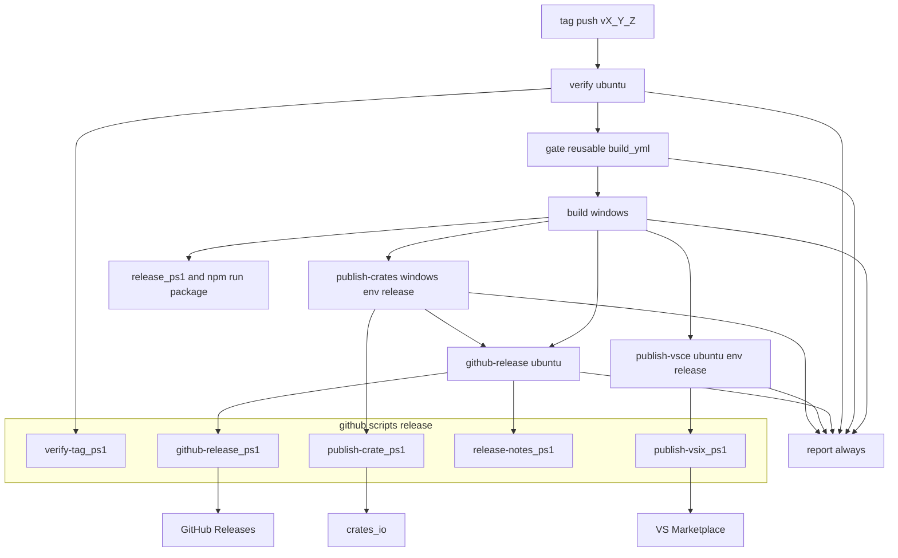
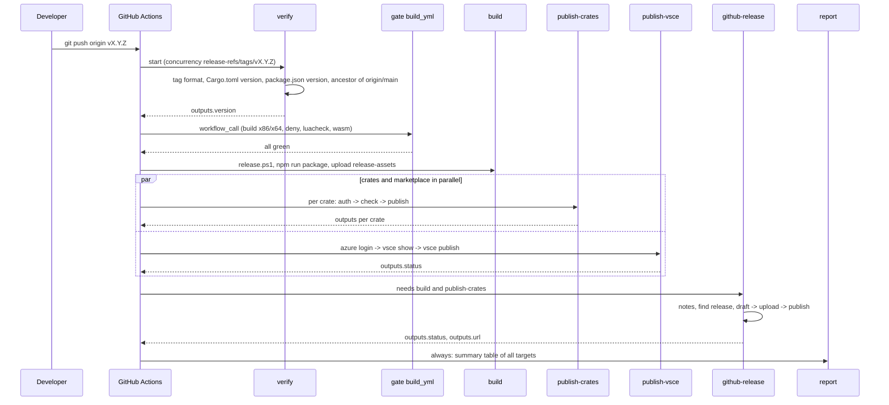
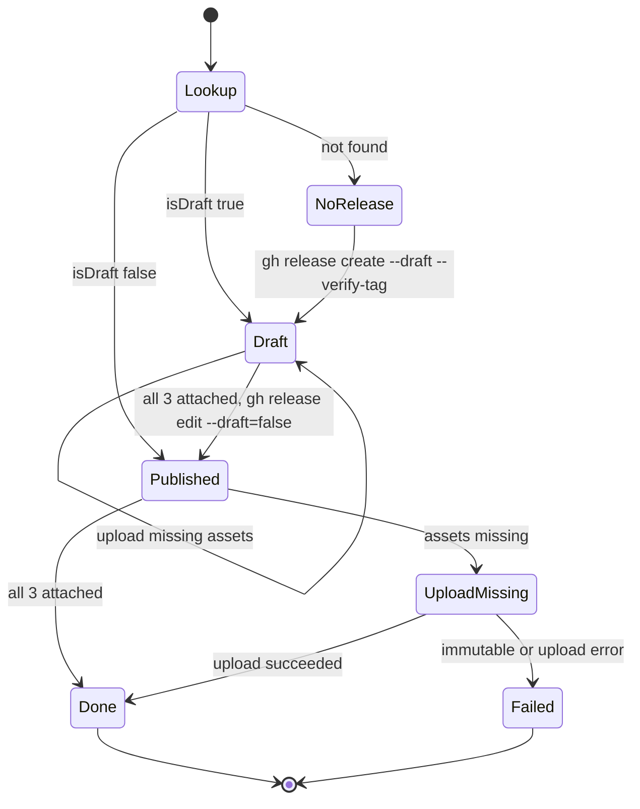
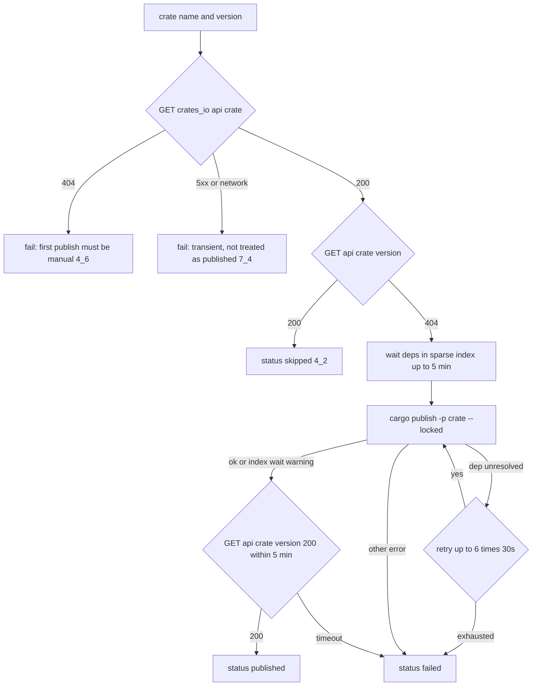
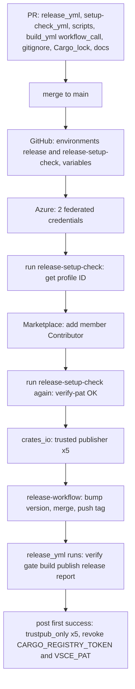

# Technical Design: release-ci

## Overview

**Purpose**: 本機能は、`vX.Y.Z` タグの push だけで crates.io（5 クレート）・VSCode Marketplace・GitHub Release への公開が人手なしに終わる「リリース CI」を、pasta をリリースする開発者とその手順を代行するエージェントに提供する。

**Users**: 開発者（エージェント）は、版を上げたコミットを main に入れてリリースタグを push し、Actions の実行結果の画面で公開先ごとの結果を確かめる。失敗したときは「失敗した job の再実行」を押すだけで、公開済みのものを飛ばして最後まで進める。メンテナーは、一回限りのセットアップの手順書に従って公開先の認証（OIDC・Entra ID）を 1 度だけ設定する。

**Impact**: 現状の「手元の Windows で `release-workflow` の Stage A〜D をたどり、長期の PAT・トークンで公開し、成果物を git にコミットする」運用を、タグ契機の GitHub Actions ワークフロー `.github/workflows/release.yml` に置き換える。公開前の関門は `build.yml` の検査を reusable workflow として呼ぶことで 1 か所に保ち、認証は実行のたびに短期で発行される（crates.io Trusted Publishing・Entra ID ワークロード ID 連携）。ビルドした成果物（`release/**`・サンプルゴーストの `pasta.dll` 等）は git 追跡を解除し、タグのソースから CI が毎回作る。

本文書の **【仮定】** は、要件と research.md だけでは一意に決められなかった前提を示す。対応する論点は末尾の「Open Questions（設計ディスカッションへの申し送り）」に番号付きでまとめた。

### Goals

- `vX.Y.Z` タグの push を唯一の公開の入口とし、verify → gate → build → publish（crates / vsce 並行）→ github-release → report の job 構成で、取り消せない公開の前に関門を通す。
- 公開済みかどうかを各公開先の実際の状態（crates.io API・`vsce show`・`gh release view`）で判定し、「失敗した job の再実行」だけで冪等に最後まで進む。
- 長期の認証情報を置かない。publish job だけに `id-token: write` を与え、GitHub environment `release` に属させてリリースタグからの実行に限る。
- 配布物（`pasta.dll.zip`・`hello-pasta.nar`・VSIX）を今と同じ中身で、タグのソースから 1 度だけ作り、artifact で後続 job へ渡す。
- 成果物の git 追跡を解除し、`Cargo.lock` を追跡して依存の解決を固定する。
- 一回限りのセットアップの手順書と、公開を伴わない確認ワークフローを提供する。期限（2026-12-01）までに Marketplace の Entra ID 経路を動かす。

### Non-Goals

- 版の決定・bump のコミット・タグの作成と push（`release-workflow` 側に残す）。
- `release-workflow` spec 本体の書き換え（本仕様の完了後に別に扱う）。
- `build.yml` の検査内容の変更（`workflow_call` トリガーの追加だけを行う）。
- マニュアルの公開（`manual.yml`）、pasta_lsp の独立リリース、Open VSX、Windows 以外の配布物。
- 新しいクレートの初回公開（Trusted Publishing では作れない。手で行う）。
- GitHub のブランチ保護・Immutable Releases の設定そのもの（設計は Immutable Releases 有効時にも成立する形にする）。
- `vsce publish --oidc`（Marketplace 自身の Trusted Publishing）の採用（議題 1 で Entra ID 経路を本線と確定。正式提供後に別途検討）。
- Rust ツールチェーンの版固定（`rust-toolchain.toml`）。リポジトリ全体の方針変更になるため本仕様では行わない（【仮定】Open Question 3）。

## Boundary Commitments

### This Spec Owns

- リリース CI のワークフロー定義: `.github/workflows/release.yml`（job 構成・トリガー・concurrency・permissions・environment・job summary）。
- セットアップ確認ワークフロー: `.github/workflows/release-setup-check.yml`（公開を行わない。Marketplace の profile ID の表示を担う）。
- `build.yml` への `workflow_call` トリガーの追加（検査内容は変えない）。
- リリース CI の補助スクリプト `.github/scripts/release/*.ps1`（タグと版の検査・公開済み判定と公開・リリースノート生成・GitHub Release の作成）と、その入出力契約。
- 配布物のビルドの CI 向け調整: `crates/pasta_sample_ghost/release.ps1`（`pasta.dll.zip` の生成の取り込み・案内表示の更新）、`editors/vscode/package.json` の `build:wasm`（`pwsh` 経由・`-Release`）。
- 成果物の git 追跡の解除と `.gitignore` の更新、`Cargo.lock` の追跡開始。
- 一回限りのセットアップの手順書 `.github/release-ci-setup.md` と、リリース手順の文書（`RELEASE.md`・pasta-check スキル・サンプルゴースト README・steering の CI/CD 記述）の更新。
- 公開先の認証に使う名前の正本: ワークフローのファイル名 `release.yml`、environment 名 `release` / `release-setup-check`、変数名 `AZURE_CLIENT_ID` / `AZURE_TENANT_ID` / `AZURE_SUBSCRIPTION_ID`。

### Out of Boundary

- 版の bump 箇所（Cargo.toml・`package.json`・`package-lock.json`・マニュアルの版行）の更新と、タグのコミットを main から到達させる統合方式 → `release-workflow`。
- `build.yml` の各 job の検査内容・ツールチェーン構成の変更。
- `.claude/settings.json` の公開系コマンドの許可の整理、`workflow.md` の「main の CI 全緑」の関門の記述 → `release-workflow` の更新。
- シェルの画像（`surface*.png`・`surfaces.txt`）の追跡の扱い → `hello-pasta-shell-art`（本仕様は変えない）。
- 一回限りのセットアップの実施そのもの（人が手順書に従って行う。Azure 側の第 1 部は済み）。
- 外部サービスの設定値（Azure の各 ID・profile ID）をリポジトリへ書くこと。GitHub の variables にだけ置く。

### Allowed Dependencies

- `build.yml`（reusable workflow として呼ぶ。ツールチェーン・ターゲット・日本語ロケールの構成はそこに従う）。
- `crates/pasta_sample_ghost/release.ps1`・`pasta_check release`・`editors/vscode/scripts/build-wasm.ps1`・`npm run package`（配布物の生成。中身の定義はこれらが持つ）。
- `.cargo/config.toml`（crt-static）、`about.toml` / `about.hbs`（第三者ライセンス表示）、`deny.toml`。
- GitHub Actions の公式アクション: `actions/checkout@v6`・`actions/upload-artifact@v4`・`actions/download-artifact@v4`・`actions/setup-node@v4`・`dtolnay/rust-toolchain@stable`・`Swatinem/rust-cache@v2`。
- 認証アクション: `rust-lang/crates-io-auth-action@v1`・`Azure/login@v3`。
- 外部 CLI / API: `cargo`・`gh`・`az`・`@vscode/vsce`（`package-lock.json` が固定する版）・crates.io API（`https://crates.io/api/v1/crates/<crate>/<version>`、User-Agent 必須）・crates.io スパース索引（`https://index.crates.io/`）。
- 依存の方向: `release.yml` → `.github/scripts/release/*.ps1` → 外部 CLI / API。スクリプトはワークフローの文脈（`github.*`）に依存せず、引数と環境変数だけで動く（手元で試せる）。`release.ps1` は `release.yml` を知らない。

### Revalidation Triggers

- `release.yml` のファイル名・environment 名・リポジトリの owner/name の変更（crates.io Trusted Publisher・Azure のフェデレーション資格情報の再設定が要る）。
- `build.yml` の job の追加・名前の変更（関門の所要時間と artifact 名に影響。`workflow_call` の互換は保つ）。
- 公開対象クレートの追加・削除・依存順の変更（`publish-crates` の step 列と手順書の Trusted Publisher 一覧の更新。追加時は初回の手動公開が要る）。
- 配布物の名前・中身・個数の変更（artifact `release-assets` の契約、`github-release.ps1` の「添付済み」判定、手順書）。
- VSIX のビルドツール（`@vscode/vsce` のメジャー更新による Node の要件変更等）。
- `release.ps1` の出力先（`release/`）やサンプルゴーストの生成物の配置の変更（`.gitignore`・artifact の収集パス）。

## Architecture

### Existing Architecture Analysis

- `build.yml` は main への push・PR・手動で動き、windows-latest の x86・x64 matrix で test・clippy、ubuntu で cargo-deny・luacheck・WASM ビルドを行う。`permissions` も secrets も使っていない。タグを契機に動くワークフローは無い。
- 成果物の生成は `release.ps1`（DLL ビルド → 画像生成 → DLL・ライセンス表示・scripts の配置 → `pasta_check release` → 版の表示 → 案内）が担い、`pasta.dll.zip` だけがスクリプトの外（`release-workflow` の手順）で作られている。生成物はソースツリー `crates/pasta_sample_ghost/ghosts/hello-pasta/` へ書き込まれ、そのうち DLL・ライセンス表示・`scripts/README.md`・`release/**` が git で追跡されている。
- VSIX は `editors/vscode` の `npm run package`（`prepackage` = `build:wasm` + `compile`）で作る。`build:wasm` は Windows PowerShell 5.1 経由で `-Release` を渡さず dev ビルドになっている（議題 4 でリリースビルドに確定）。`vscode:prepublish` が無いため、公開は `vsce publish --packagePath` で済ませる。
- `release-workflow` design.md が持つ公開順・公開済み判定・リリースノートの分類は、そのまま本設計のスクリプトへ移す。
- `manual.yml` に `permissions: id-token: write` と `environment` の前例がある。

### Architecture Pattern & Boundary Map

採用パターン: **タグ契機の単一ワークフロー + job 分割（Option C ハイブリッド）**。ワークフローは job の境界・権限・順序を持ち、成果物の生成は既存スクリプトへ、公開済み判定とリリースノートは手元で試せる小さなスクリプトへ委ねる。



**Architecture Integration**:

- **job の境界 = 再実行と権限の単位**: 公開先ごとに job を分け、`id-token: write` は publish-crates / publish-vsce に、`contents: write` は github-release にだけ与える（9.3）。「失敗した job の再実行」は失敗した job とその後続だけを走らせ、成功した job の出力と前の試行の artifact を使う（7.1）。
- **関門は `build.yml` を呼ぶ**: `gate` job は `uses: ./.github/workflows/build.yml`。called workflow の `github` コンテキストは caller のもの（タグ ref・タグのコミット）で、`actions/checkout` はタグのコミットを取り出す。検査の一覧を別に持たない（2.6）。
- **公開済みの判定はスクリプトに閉じる**: ワークフローは順序と権限だけを持ち、判定・公開・再試行の規則は各スクリプトが持つ。スクリプトは引数と環境変数だけで動き、`-DryRun`（判定だけ・公開しない）で手元から試せる。
- **成果物は build で 1 度だけ作る**: artifact `release-assets`（保持 90 日。再実行の期限 30 日を超える）で後続へ渡す。publish job は再ビルドしない（3.8）。`cargo publish` の検証ビルドだけはクレートのソースから行う。
- **既存パターンの維持**: 日本語ロケールの設定（`shell: powershell` で `Set-WinSystemLocale` / `Set-Culture`）、`dtolnay/rust-toolchain@stable` + `Swatinem/rust-cache@v2`、`actions/checkout@v6`、`permissions` の明示（`manual.yml` 準拠）。`NoDefaultCurrentDirectoryInExePath` は開発機だけの制約で、ランナーには現れないため何もしない（research 2.1）。
- **Steering 準拠**: ワークフロー・スクリプトは `.github/` に置き、クレートの責務（`pasta_sample_ghost` = ゴーストのビルド、`pasta_check` = nar）を越えない。

### Technology Stack

| Layer | Choice / Version | Role in Feature | Notes |
|-------|------------------|-----------------|-------|
| CI ランナー | `windows-latest`（Windows Server 2025）・`ubuntu-latest` | gate（`build.yml` が決める）・build・publish-crates は Windows。verify・publish-vsce・github-release・report は ubuntu | `windows-latest` が壊れたら `windows-2022` に退避（提供中）。wasm-pack・cargo-about はプリインストールされていない |
| ワークフロー | GitHub Actions `on: push: tags`、reusable workflow（`workflow_call`）、`concurrency`、`environment`、job summary | 起動・関門・順序・権限・結果の報告 | environment 名 `release` / `release-setup-check`（議題 1 で確定） |
| スクリプト | PowerShell 7（`pwsh`）。Windows・ubuntu の両ランナーに同梱 | 検査・判定・公開・ノート生成。手元でも同じスクリプトを実行できる | `shell: pwsh` を明示。Windows PowerShell 5.1 は使わない |
| Rust | `dtolnay/rust-toolchain@stable` + ターゲット `i686-pc-windows-msvc`、`Swatinem/rust-cache@v2`、`cargo publish --locked` | 配布物のビルド・クレートの公開（検証ビルド） | `Cargo.lock` を追跡して依存の解決を固定（3.9・3.10）。ツールチェーン自体は固定しない（【仮定】Open Question 3） |
| ビルドツール | `wasm-pack`・`cargo-about`（版を固定して導入）、Node 20（`actions/setup-node@v4`）、`@vscode/vsce`（`package-lock.json` の版） | WASM・第三者ライセンス表示・VSIX | 版の固定値は `release.yml` の `env` にまとめる（`WASM_PACK_VERSION`・`CARGO_ABOUT_VERSION`）。導入はビルド済みバイナリの取得を第一候補とし、無ければ `cargo install --locked --version` |
| 認証 | `rust-lang/crates-io-auth-action@v1`（crates.io Trusted Publishing。トークン 30 分・job 終了時に自動失効）、`Azure/login@v3`（OIDC → `az login`） | publish job だけが OIDC トークンを交換 | subject は `repo:ekicyou/pasta:environment:release`。variables: `AZURE_CLIENT_ID`・`AZURE_TENANT_ID`・`AZURE_SUBSCRIPTION_ID` |
| 公開先 API | crates.io API / スパース索引、`vsce show` / `vsce publish --azure-credential --packagePath --skip-duplicate`、`gh release view/create/upload/edit` | 公開済み判定と公開 | crates.io API は User-Agent 必須。`gh release view <tag>` は下書きも見つける（GraphQL 併用） |

## File Structure Plan

### Directory Structure

```
.github/
├── workflows/
│   ├── build.yml                     # 変更: on に workflow_call を追加（検査内容は不変）
│   ├── release.yml                   # 新規: リリース CI 本体（verify/gate/build/publish-crates/publish-vsce/github-release/report）
│   └── release-setup-check.yml       # 新規: セットアップ確認（workflow_dispatch・公開しない・profile ID 表示）
├── scripts/
│   └── release/
│       ├── verify-tag.ps1            # 新規: タグ形式・ワークスペース版・package.json 版・main からの到達性の検査
│       ├── publish-crate.ps1         # 新規: 1 クレートの公開済み判定・索引待ち・cargo publish・結果の出力
│       ├── publish-vsix.ps1          # 新規: Marketplace の公開済み判定と vsce publish
│       ├── release-notes.ps1         # 新規: 前のリリースタグの決定とリリースノートの生成
│       └── github-release.ps1        # 新規: GitHub Release の検索・下書き作成・添付の補完・公開
└── release-ci-setup.md               # 新規: 一回限りのセットアップの手順書（【仮定】置き場所。Open Question 5）

crates/pasta_sample_ghost/
├── release.ps1                       # 変更: [5/7] pasta.dll.zip の生成を取り込む・案内表示を新手順へ
├── RELEASE.md                        # 変更: タグ push → CI の流れ・回復手順へ書き換え
└── README.md                         # 変更: 生成物はコミット対象でないこと・release.ps1 の説明

editors/vscode/
└── package.json                      # 変更: build:wasm を pwsh 経由・-Release に（scripts/build-wasm.ps1 は変更不要）

.gitignore                            # 変更: Cargo.lock の無視を外す・/release/・サンプルゴーストの生成物を無視
Cargo.lock                            # 新規追跡

.claude/skills/pasta-check/SKILL.md   # 変更: リリース後の手順（gh release create）をリリース CI 前提へ
.kiro/steering/tech.md                # 変更: CI/CD に release.yml を追記
.kiro/steering/structure.md           # 変更: release.bat の位置の誤記・.github の構成
```

### Modified Files

- `.github/workflows/build.yml` — `on:` に `workflow_call: {}` を足す。job・step・検査内容・artifact 名は変えない（2.5・2.6）。
- `crates/pasta_sample_ghost/release.ps1` — Step 4 の後に **[5/7] `pasta.dll.zip` の生成**（`release/pasta.dll.zip`。中身は `target/i686-pc-windows-msvc/release/pasta.dll` と `ghost/master/THIRD_PARTY_LICENSES.txt` の 2 つ。`Compress-Archive -Force`）を足し、版の表示を [6/7]、案内表示を [7/7] にする。案内は「成果物はコミットしない。公開はリリースタグの push で CI が行う」に書き換える（3.2・12.3）。画像生成（Step 2）は触らない（`hello-pasta-shell-art` との接点）。
- `editors/vscode/package.json` — `"build:wasm": "pwsh -NoProfile -File scripts/build-wasm.ps1 -Release"`（3.4。手元の `npm run package` もリリースビルドにそろえる。【仮定】Open Question 9）。
- `.gitignore` — `Cargo.lock` の行を削除。追加: `/release/`、`crates/pasta_sample_ghost/ghosts/hello-pasta/ghost/master/pasta.dll`、同 `THIRD_PARTY_LICENSES.txt`、同 `scripts/`（10.1・10.2）。
- 追跡解除（`git rm --cached`）: `release/hello-pasta.nar`、`release/hello-pasta/**`、`crates/pasta_sample_ghost/ghosts/hello-pasta/ghost/master/{pasta.dll,THIRD_PARTY_LICENSES.txt,scripts/README.md}`（10.1）。シェルの画像は触らない（10.5）。
- `Cargo.lock` — `cargo generate-lockfile` 相当の現状の解決結果をコミット（3.10）。
- `crates/pasta_sample_ghost/RELEASE.md` — 全体を新手順へ（12.1・12.4・12.6）。
- `crates/pasta_sample_ghost/README.md` — L41・L54-65・L77 付近（12.3）。
- `.claude/skills/pasta-check/SKILL.md` — 「リリース後の手順」節と `release.bat` の位置（12.2）。
- `.kiro/steering/tech.md`・`structure.md` — CI/CD の記述と `.github/` の構成（DoD の steering 同期）。

## System Flows

### リリースの主経路（job の順序と関門）



流れの決定事項:

- **順序**: verify → gate → build → {publish-crates ‖ publish-vsce} → github-release（`needs: [build, publish-crates]` のみ。Marketplace の成否は待たない）→ report（`if: always()`）。
- **関門の失敗は公開に進めない**: publish job は `needs` の既定（上流がすべて成功）で止まる。report は `needs.*.result` を見て「前の段の失敗で行わなかった」を出す（8.3）。
- **同じタグの同時実行の抑止**: `concurrency: { group: release-${{ github.ref }}, cancel-in-progress: false }`（1.4）。
- **タイムアウト**: job ごとに `timeout-minutes`（verify 10、build 60、publish-crates 90、publish-vsce 20、github-release 20）。

### GitHub Release の作成（下書き → 添付 → 公開）



- 下書きの間は配布物が欠けていても「公開状態」ではない。3 つがそろってから `--draft=false` にする（6.5）。Immutable Releases が有効でも、公開は添付が完了した後に 1 度だけ起きる。
- 再実行では、前の試行が残した下書きを `gh release view <tag> --json isDraft,assets` で見つけて続ける（下書きも tag 名で見つかる。research）。下書きの添付で `state` が `uploaded` でないものは削除して再アップロードする。公開済みの Release の添付は削除・上書きしない（7.6）。
- 公開済みで添付が欠けている Release（本 CI 以外が作ったもの）は、足りない配布物だけを添付する（6.5）。Immutable で拒否されたら失敗として示す。

### 公開済みの判定（publish-crates の 1 クレート分）



- 判定は各クレートを公開する直前に行う（4.3）。判定の問い合わせの一時的な失敗は「公開済み」と見なさない（7.4）。
- 索引の反映待ちの時間切れ（stable は 60 秒固定、警告で終了）は失敗としない。次のクレートの前に依存先の反映をスパース索引で待ち、それでも検証ビルドが依存未解決で失敗したら再試行する（4.5）。

## Requirements Traceability

| Requirement | Summary | Components | Interfaces | Flows |
|-------------|---------|------------|------------|-------|
| 1.1 | リリースタグの push で開始 | release.yml（`on.push.tags`） | タグ契約 | 主経路 |
| 1.2 | 形に合わないタグは起動しない | release.yml（`tags: ['v[0-9]+.[0-9]+.[0-9]+']`）・verify-tag.ps1（厳密な正規表現 `^v\d+\.\d+\.\d+$` で二重に検査） | タグ契約 | 主経路 |
| 1.3 | ブランチ push・PR で起動しない | release.yml（`on` は `push.tags` だけ） | — | — |
| 1.4 | 同じタグの並行実行の抑止 | release.yml（`concurrency`） | — | 主経路 |
| 1.5 | 書き戻さない | release.yml（既定 `permissions: contents: read`。github-release だけ `contents: write`。`gh release create --verify-tag` でタグを作らない） | 権限表 | — |
| 1.6 | 公開の入口はタグ push だけ | release.yml（`workflow_dispatch` を持たない）・release-setup-check.yml（公開しない・別 environment） | 認証名の契約 | — |
| 2.1 | 公開より先に関門 | release.yml（`needs` の連鎖） | — | 主経路 |
| 2.2 | タグとワークスペース版の一致 | verify-tag.ps1 | verify-tag 契約 | 主経路 |
| 2.3 | 拡張の版の一致 | verify-tag.ps1（`editors/vscode/package.json`） | verify-tag 契約 | 主経路 |
| 2.4 | main からの到達性 | verify-tag.ps1（`git merge-base --is-ancestor`） | verify-tag 契約 | 主経路 |
| 2.5 | build.yml の検査を同じ構成で | gate job（`uses: ./.github/workflows/build.yml`） | workflow_call 契約 | 主経路 |
| 2.6 | 検査の一覧を別に持たない | gate job・build.yml（`workflow_call` 追加のみ） | workflow_call 契約 | — |
| 2.7 | 関門の失敗で公開しない | release.yml（`needs`） | — | 主経路 |
| 2.8 | main の CI を参照しない | gate job（タグのコミットで実行。`gh run list` 等を使わない） | — | — |
| 3.1 | 関門後に 3 配布物を作る | build job（release.ps1 → npm run package） | artifact 契約 | 主経路 |
| 3.2 | dll.zip の中身 | release.ps1 [5/7] | artifact 契約 | — |
| 3.3 | nar は pasta_check release | release.ps1 [4/7]（既存） | artifact 契約 | — |
| 3.4 | VSIX（WASM リリースビルド・ライセンス同梱） | package.json `build:wasm`・build-wasm.ps1（既存の `-Release`） | artifact 契約 | — |
| 3.5 | ツールの版固定 | release.yml `env`（`WASM_PACK_VERSION`・`CARGO_ABOUT_VERSION`）・`package-lock.json`（vsce・esbuild）・`Cargo.lock`・Node 20 | — | — |
| 3.6 | ビルド失敗で公開しない・どれが失敗か | build job（step 名が配布物名。`needs`） | — | 主経路 |
| 3.7 | Windows でビルド | build job（`windows-latest`） | — | — |
| 3.8 | 配布物の保持 | artifact `release-assets`（`retention-days: 90`） | artifact 契約 | — |
| 3.9 | 依存の解決まで同じ配布物 | `Cargo.lock` 追跡・`--locked` | — | — |
| 3.10 | Cargo.lock の追跡 | `.gitignore` 変更・`Cargo.lock` コミット | — | — |
| 4.1 | 5 クレートを依存順に公開 | publish-crates job（5 組の auth → publish step） | publish-crate 契約 | 判定フロー |
| 4.2 | 公開済みは飛ばす | publish-crate.ps1（API 200 → skipped） | publish-crate 契約 | 判定フロー |
| 4.3 | 直前に問い合わせ | publish-crate.ps1 | publish-crate 契約 | 判定フロー |
| 4.4 | 失敗で後続を止め、公開済み/未公開を示す | publish-crates job（step の既定の停止）・report | status 契約 | 判定フロー |
| 4.5 | 索引待ちの時間切れは次へ・依存未反映は再試行 | publish-crate.ps1（索引の待ちと再試行） | publish-crate 契約 | 判定フロー |
| 4.6 | 未登録クレートは失敗・手動を案内 | publish-crate.ps1（crate 自体が 404） | publish-crate 契約 | 判定フロー |
| 4.7 | sample_ghost・lsp を公開しない | publish-crates job（step は 5 クレートだけ。`publish = false` も維持） | — | — |
| 5.1 | VSIX を Marketplace へ | publish-vsix.ps1（`vsce publish --azure-credential --packagePath`） | publish-vsix 契約 | 主経路 |
| 5.2 | 公開済みは飛ばす | publish-vsix.ps1（`vsce show` → skipped。`--skip-duplicate` を保険に） | publish-vsix 契約 | — |
| 5.3 | Marketplace に問い合わせ | publish-vsix.ps1（`vsce show <publisher>.<name> --json`） | publish-vsix 契約 | — |
| 5.4 | 失敗は crates に影響しない | release.yml（publish-vsce と publish-crates は互いに `needs` を持たない） | — | 主経路 |
| 5.5 | PAT を使わない・12-01 以降も続く | Azure/login（OIDC）+ `--azure-credential`・手順書 | 認証名の契約 | — |
| 5.6 | 2 トラックを互いに待たない | release.yml（並行 job） | — | 主経路 |
| 6.1 | crates 完了後に Release。Marketplace は待たない | github-release job（`needs: [build, publish-crates]`） | — | 主経路 |
| 6.2 | 3 配布物を添付 | github-release.ps1 | github-release 契約 | Release フロー |
| 6.3 | 題名 `pasta vX.Y.Z` | github-release.ps1（`--title`） | github-release 契約 | — |
| 6.4 | 作成済み・添付済みなら飛ばす | github-release.ps1（Published かつ 3 添付 → skipped） | github-release 契約 | Release フロー |
| 6.5 | 足りない配布物だけ添付・欠けた公開状態を残さない | github-release.ps1（下書き → 添付 → 公開） | github-release 契約 | Release フロー |
| 6.6 | 前のリリースタグからのコミット（マージ除く） | release-notes.ps1 | release-notes 契約 | — |
| 6.7 | Conventional Commits の 6 分類 | release-notes.ps1 | release-notes 契約 | — |
| 6.8 | `spec` スコープ除外・空見出し省略 | release-notes.ps1 | release-notes 契約 | — |
| 6.9 | Full Changelog リンク | release-notes.ps1 | release-notes 契約 | — |
| 6.10 | crates 未完了なら Release を作らない | github-release job（`needs: publish-crates`） | — | 主経路 |
| 7.1 | 再実行で公開済みを飛ばす | 全 publish スクリプト（状態で判定）・artifact の再利用 | status 契約 | 判定フロー |
| 7.2 | 実際の状態で判定 | publish-crate.ps1・publish-vsix.ps1・github-release.ps1 | — | — |
| 7.3 | 全公開済みなら何もせず成功 | 同上（skipped は exit 0） | status 契約 | — |
| 7.4 | 問い合わせの一時障害は公開済みと見なさない | 同上（200/404 以外は失敗） | — | 判定フロー |
| 7.5 | 手元の操作・設定変更を要しない | release.yml（再実行で完結）・RELEASE.md（定義の不具合は版を上げて出し直す） | — | — |
| 7.6 | 取り消し・上書きをしない | スクリプト（yank・削除・`--clobber` を公開済みに使わない） | — | Release フロー |
| 8.1 | 公開先ごとの結果を表示 | report job（`needs.*.outputs` と `needs.*.result` から表を書く） | status 契約 | 主経路 |
| 8.2 | Release の URL を表示 | github-release.ps1（`outputs.url`）・report | status 契約 | — |
| 8.3 | 関門で失敗した検査と未公開を表示 | verify-tag.ps1（失敗理由を summary へ）・report（gate 失敗時） | — | — |
| 9.1 | crates.io は Trusted Publishing | publish-crates job（`rust-lang/crates-io-auth-action@v1`） | 認証名の契約 | — |
| 9.2 | Marketplace は Entra ID 連携 | publish-vsce job（`Azure/login@v3` → `--azure-credential`） | 認証名の契約 | — |
| 9.3 | 権限は公開の処理だけ | release.yml（job ごとの `permissions`） | 権限表 | — |
| 9.4 | environment に属し、タグからに限る | release.yml（`environment: release`）・手順書（保護規則 `v*`） | 認証名の契約 | — |
| 9.5 | 名前の不一致は認証失敗で止まる | 認証アクションの失敗（公開前に止まる）・report | 認証名の契約 | — |
| 9.6 | 開発機の環境変数を要しない | スクリプトは `CARGO_REGISTRY_TOKEN` をアクションの出力から受け、`VSCE_PAT` を参照しない | — | — |
| 10.1 | 成果物を追跡しない | `git rm --cached`・`.gitignore` | — | — |
| 10.2 | 手元で作っても未追跡の変更に出ない | `.gitignore` | — | — |
| 10.3 | 追跡解除後も test・clippy が通る | 検証項目（クリーンなチェックアウトで確認） | — | — |
| 10.4 | 手書きの正本の追跡を続ける | `.gitignore`（対象を生成物に限る） | — | — |
| 10.5 | シェルの画像の扱いを変えない | `.gitignore`（画像を含めない） | — | — |
| 10.6 | 配布物はタグのソースからのビルドだけ | build job（追跡物が無いので必然） | — | — |
| 11.1 | Trusted Publisher の設定値 | release-ci-setup.md（名前の表） | 認証名の契約 | — |
| 11.2 | Azure の手順 | release-ci-setup.md | — | セットアップ順序 |
| 11.3 | 無料試用版の注意・従量課金と予算アラート必須 | release-ci-setup.md | — | — |
| 11.4 | サービスプリンシパルを採らない理由 | release-ci-setup.md | — | — |
| 11.5 | publisher への Contributor 追加 | release-ci-setup.md・release-setup-check.yml（profile ID の表示） | setup-check 契約 | セットアップ順序 |
| 11.6 | environment と variables | release-ci-setup.md | 認証名の契約 | — |
| 11.7 | 公開せずに確かめる方法 | release-setup-check.yml | setup-check 契約 | セットアップ順序 |
| 11.8 | 新クレートの初回公開は手で | release-ci-setup.md・publish-crate.ps1（4.6 の案内文） | — | — |
| 11.9 | ワークフローの外・毎回ではない | release-ci-setup.md（冒頭に明記） | — | — |
| 11.10 | 初回成功後の必須手順（trustpub_only・トークン失効） | release-ci-setup.md | — | セットアップ順序 |
| 12.1 | RELEASE.md の流れ | RELEASE.md | — | — |
| 12.2 | pasta-check スキルの記述 | pasta-check SKILL.md | — | — |
| 12.3 | 手元スクリプトの説明 | release.ps1 の案内・README.md | — | — |
| 12.4 | 環境変数の前提を外す | RELEASE.md・SKILL.md | — | — |
| 12.5 | release-workflow 本体を書き換えない | 境界（Out of Boundary） | — | — |
| 12.6 | 回復の手順 | RELEASE.md | — | — |

## Components and Interfaces

| Component | Domain/Layer | Intent | Req Coverage | Key Dependencies (P0/P1) | Contracts |
|-----------|--------------|--------|--------------|--------------------------|-----------|
| release.yml | ワークフロー | タグ契機の job 構成・権限・順序・報告 | 1, 2.1, 2.7, 3.1, 3.6–3.8, 4.4, 5.4, 5.6, 6.1, 6.10, 8, 9.3–9.4 | build.yml（P0）・各スクリプト（P0）・認証アクション（P0） | Batch, State |
| gate（build.yml `workflow_call`） | ワークフロー | タグのコミットで build.yml の検査をすべて行う | 2.5, 2.6, 2.8 | build.yml（P0） | Batch |
| release-setup-check.yml | ワークフロー | 公開せずにセットアップを確かめ、profile ID を表示 | 1.6, 11.5, 11.7 | Azure/login（P0）・vsce（P1） | Batch |
| verify-tag.ps1 | スクリプト | タグ形式・版の一致・到達性 | 1.2, 2.2–2.4, 8.3 | git・Cargo.toml・package.json | Service |
| publish-crate.ps1 | スクリプト | 1 クレートの判定・公開・再試行 | 4.2–4.6, 7.2–7.4, 9.6 | crates.io API・索引・cargo（P0） | Service |
| publish-vsix.ps1 | スクリプト | Marketplace の判定・公開 | 5.1–5.3, 7.2–7.4 | vsce（P0）・Azure CLI セッション（P0） | Service |
| release-notes.ps1 | スクリプト | リリースノート生成 | 6.6–6.9 | git（履歴とタグ） | Service |
| github-release.ps1 | スクリプト | Release の検索・下書き・添付・公開 | 6.2–6.5, 7.6, 8.2 | gh（P0） | Service, State |
| release.ps1（調整） | 成果物ビルド | DLL・ライセンス表示・nar・dll.zip | 3.2, 3.3, 12.3 | cargo・cargo-about・pasta_check（P0） | Batch |
| VSIX ビルド（package.json） | 成果物ビルド | WASM リリースビルド・VSIX | 3.4 | wasm-pack・cargo-about・vsce（P0） | Batch |
| 追跡解除と .gitignore | リポジトリ設定 | 成果物の非追跡・Cargo.lock 追跡 | 3.9, 3.10, 10 | — | — |
| release-ci-setup.md | 文書 | 一回限りのセットアップ手順書 | 11 | 認証名の契約 | — |
| リリース手順の文書群 | 文書 | RELEASE.md・SKILL.md・README・steering | 12 | — | — |

### 共通契約

#### 認証名の契約（公開先の設定と実物を一致させる名前）

| 項目 | 値 | 使う場所 |
|------|----|----------|
| リポジトリ | owner `ekicyou`・name `pasta` | crates.io Trusted Publisher、Azure フェデレーション資格情報の subject |
| ワークフローのファイル名 | `release.yml` | crates.io Trusted Publisher（完全一致） |
| 公開用 environment | `release`（保護規則: Selected branches and tags → タグ `v*`） | publish-crates・publish-vsce の `environment:`、crates.io の environment 欄、Azure FIC subject `repo:ekicyou/pasta:environment:release` |
| 確認用 environment | `release-setup-check`（保護規則: ブランチ `main` のみ） | release-setup-check.yml の `environment:`、Azure FIC subject `repo:ekicyou/pasta:environment:release-setup-check` |
| Azure の ID | リポジトリ variables `AZURE_CLIENT_ID`・`AZURE_TENANT_ID`・`AZURE_SUBSCRIPTION_ID`（値はリポジトリに書かない） | `Azure/login@v3` の `client-id`・`tenant-id`・`subscription-id` |
| OIDC audience | `api://AzureADTokenExchange`（Azure/login の既定） | FIC の Audience 欄 |
| Marketplace | publisher `ekicyou`・拡張 `pasta-vscode`（`ekicyou.pasta-vscode`） | `vsce show`・`vsce publish` |
| crates | `pasta_core` → `pasta_dsl` → `pasta_lua` → `pasta_shiori` → `pasta_check` | publish-crates の step 列・Trusted Publisher の設定（5 件） |

#### status 契約（公開先ごとの結果）

- 値: `published`（今回公開した）/ `skipped`（公開済みのため飛ばした）/ `failed`（失敗した）/ `not-run`（前の段の失敗で行わなかった）。
- 各公開 step は終了前に `status=<値>` を `$GITHUB_OUTPUT` へ書く（失敗時も `failed` を書いてから非 0 で終える）。job は `outputs` で公開する: publish-crates は `pasta_core`・`pasta_dsl`・`pasta_lua`・`pasta_shiori`・`pasta_check`、publish-vsce は `status`、github-release は `status` と `url`。
- report job は、output が空のものを `needs.<job>.result` から補う（job が `skipped`/`failure` で output 空 → `not-run`。job が `failure` でその step の output 空 → `not-run`。step に到達して失敗 → `failed`）。

#### 権限表（job ごとの `permissions`）

| job | permissions | environment |
|-----|-------------|-------------|
| ワークフロー既定 | `contents: read` | — |
| verify / gate / build / report | 既定のまま | — |
| publish-crates | `contents: read`, `id-token: write` | `release` |
| publish-vsce | `contents: read`, `id-token: write` | `release` |
| github-release | `contents: write` | — |
| release-setup-check.yml（全体） | `contents: read`, `id-token: write` | `release-setup-check` |

#### artifact 契約

- 名前 `release-assets`、`retention-days: 90`、`if-no-files-found: error`。
- 中身（build job が `release/` 直下に集める。`release/hello-pasta/` の展開物は含めない）: `release/pasta.dll.zip`、`release/hello-pasta.nar`、`release/pasta-vscode-X.Y.Z.vsix`（`vsce package` の既定名を `editors/vscode/` から移す）。
- 後続 job は `actions/download-artifact@v4` で `release-assets/` へ展開し、ファイル名で参照する。VSIX は `*.vsix` の glob で 1 つだけ存在することを確かめる。

### ワークフロー層

#### release.yml

| Field | Detail |
|-------|--------|
| Intent | リリースタグの push を契機に、関門・ビルド・公開・Release・報告を job 分割で行う |
| Requirements | 1.1–1.6, 2.1, 2.7, 3.1, 3.5–3.8, 4.1, 4.4, 4.7, 5.4, 5.6, 6.1, 6.10, 7.1, 7.5, 8.1–8.3, 9.1–9.6 |

**Responsibilities & Constraints**
- `name: Release`。`on: push: tags: ['v[0-9]+.[0-9]+.[0-9]+']`。他のトリガーを持たない（1.3・1.6）。
- ワークフロー既定 `permissions: contents: read`。`concurrency: group: release-${{ github.ref }}`、`cancel-in-progress: false`。
- `env`: `WASM_PACK_VERSION`・`CARGO_ABOUT_VERSION`・`NODE_VERSION: '20'`・`RELEASE_ENVIRONMENT`（表示用）。called workflow（gate）には伝わらない（build.yml は自前の構成で動く）。
- job の内容:
  - **verify**（ubuntu-latest）: `actions/checkout@v6`（`fetch-depth: 0`）→ `git fetch origin main` → `verify-tag.ps1 -Tag ${{ github.ref_name }} -Sha ${{ github.sha }} -MainRef origin/main`。`outputs.version`（`X.Y.Z`）。
  - **gate**: `needs: verify`、`uses: ./.github/workflows/build.yml`。`with`・`secrets` は無し。
  - **build**（windows-latest、`needs: gate`）: checkout → rust-toolchain（targets `i686-pc-windows-msvc`）→ rust-cache → 日本語ロケール（`shell: powershell`。`build.yml` と同じ）→ ツール導入（wasm-pack・cargo-about を版固定。`cargo install --locked --version` または版固定のバイナリ取得）→ setup-node 20 → `pwsh crates/pasta_sample_ghost/release.ps1`（step 名「Build pasta.dll.zip and hello-pasta.nar」。`release.ps1` の cargo 呼び出しは `--locked` を持たないため、追跡中の `Cargo.lock` で解決させたうえで、後段の `git diff --exit-code -- Cargo.lock` で lock が変わっていないことを検査する = `--locked` と同等）→ `npm ci` + `npm run package`（`editors/vscode`、step 名「Build VSIX」）→ VSIX を `release/` へ移動 → 版と中身の検査（dll.zip の 2 エントリ、nar の存在、VSIX 名の版 = `needs.verify.outputs.version`、`Cargo.lock` 不変）→ upload `release-assets`。
  - **publish-crates**（windows-latest、`needs: build`、`environment: release`、`permissions: id-token: write, contents: read`）: checkout → rust-toolchain → rust-cache → クレートごとに 2 step（`id: auth_core` `uses: rust-lang/crates-io-auth-action@v1` → `id: pub_core` `run: publish-crate.ps1 -Crate pasta_core -Version ...` with `env: CARGO_REGISTRY_TOKEN: ${{ steps.auth_core.outputs.token }}`）× 5。step は既定の「失敗したら後続を走らせない」で 4.4 を満たす。`outputs`: 5 クレート分。【仮定】トークンをクレートごとに取り直す（Open Question 8）。
  - **publish-vsce**（ubuntu-latest、`needs: build`、`environment: release`、`permissions: id-token: write, contents: read`）: checkout（`editors/vscode` の lock を使うため）→ download `release-assets` → setup-node 20 → `npm ci --ignore-scripts`（`editors/vscode`。vsce の版を lock で固定）→ `Azure/login@v3`（`client-id: ${{ vars.AZURE_CLIENT_ID }}`・`tenant-id`・`subscription-id`）→ `publish-vsix.ps1 -VsixPath release-assets/*.vsix -Version ... -Extension ekicyou.pasta-vscode`（`npx vsce` を呼ぶ）。`outputs.status`。
  - **github-release**（ubuntu-latest、`needs: [build, publish-crates]`、`permissions: contents: write`）: checkout（`fetch-depth: 0`、`fetch-tags: true`）→ download `release-assets` → `release-notes.ps1 -Tag ... -Repo ekicyou/pasta -OutFile notes.md` → `github-release.ps1 -Tag ... -Title "pasta vX.Y.Z" -NotesFile notes.md -AssetDir release-assets`（`GH_TOKEN: ${{ github.token }}`）。`outputs.status`・`outputs.url`。
  - **report**（ubuntu-latest、`needs: [verify, gate, build, publish-crates, publish-vsce, github-release]`、`if: always()`）: `pwsh` の inline step で status 契約に従い表を `$GITHUB_STEP_SUMMARY` へ書く（公開先ごとの結果・Release の URL・関門で失敗した job 名・「どの公開先にも公開していない」の明示）。report 自体は結果に依らず成功で終える（ワークフロー全体の成否は他 job が決める）。

**Dependencies**
- Inbound: タグの push（GitHub）。
- Outbound: build.yml（P0）、`.github/scripts/release/*.ps1`（P0）、`release.ps1`・`npm run package`（P0）。
- External: `rust-lang/crates-io-auth-action@v1`（P0）、`Azure/login@v3`（P0）、`actions/*`・`dtolnay/rust-toolchain`・`Swatinem/rust-cache`（P1）。

**Contracts**: Service [ ] / API [ ] / Event [ ] / Batch [x] / State [x]

##### Batch / Job Contract
- Trigger: `refs/tags/vX.Y.Z` の push。
- Input / validation: タグ名・`github.sha`。verify が版と到達性を検査する。
- Output / destination: artifact `release-assets`、crates.io・Marketplace・GitHub Release への公開、job summary。
- Idempotency & recovery: 「失敗した job の再実行」で、成功 job の outputs と前の試行の artifact を再利用し、各公開 step が実際の状態で判定して飛ばす。初回実行から 30 日・50 回まで（GitHub の制限）。

##### State Management
- State model: 公開先の実際の状態（crates.io の版・Marketplace の版・Release の有無/下書き/添付）だけを状態とする。ワークフロー側に状態を持たない。
- Persistence & consistency: artifact は 90 日。job outputs は run に属し再実行で引き継がれる。
- Concurrency strategy: `concurrency` でタグごとに直列化。異なるタグの実行は並行してよい（公開先の版が異なるため干渉しない）。

**Implementation Notes**
- Integration: `gate` は calling job なので `environment`・`runs-on`・`steps` を持てない（reusable workflow の制約）。`needs: verify` と `uses` だけ。
- Validation: `actionlint` で構文検査。タグのフィルターは `v1.2.3` が合い `v1.2`・`v1.0.0-rc.1`・`test-1` が合わないことを verify-tag.ps1 の正規表現と二重に確かめる。
- Risks: `windows-latest` のイメージ変化（VS の版・node native addon）。退避先 `windows-2022`。publish-crates の所要時間とトークン期限（Open Question 8）。

#### gate（build.yml への `workflow_call` 追加）

| Field | Detail |
|-------|--------|
| Intent | タグのコミットそのもので `build.yml` の全検査を、同じ構成で実行する |
| Requirements | 2.5, 2.6, 2.8 |

**Responsibilities & Constraints**
- `build.yml` の `on:` に `workflow_call: {}` を足す。入力・secrets・outputs は定義しない。job・step・matrix・artifact 名（`pasta-dll-x86/x64`、7 日）は変えない。
- called workflow の `github.ref`・`github.sha` は caller と同じ（タグ ref・タグのコミット）。`actions/checkout` はタグのコミットを取り出す。
- caller の `permissions`（`contents: read`）が上限になる。build.yml は書き込み権限を要しない。
- caller の `env` は伝わらない。build.yml はそれに依存していない。

**Contracts**: Batch [x]
- Trigger: release.yml の gate job。Input: なし。Output: job の成否のみ。Idempotency: 検査は副作用を持たない。

**Implementation Notes**
- Integration: 関門の所要時間 = build.yml の最長 job（x86 の `cargo test --all`）。rust-cache は既定ブランチ（main）のキャッシュを復元できる。
- Validation: PR で `build.yml` が従来どおり動くこと（`workflow_call` の追加が push/PR/手動の起動に影響しないこと）。
- Risks: build.yml に入力必須の `workflow_call` を後から足すと caller が壊れる → Revalidation Trigger。

#### release-setup-check.yml

| Field | Detail |
|-------|--------|
| Intent | 公開を一切行わずに、Azure/Marketplace 側の認証の配線を確かめ、Marketplace の Members 追加に要する profile ID を表示する |
| Requirements | 1.6, 11.5, 11.7 |

**Responsibilities & Constraints**
- `on: workflow_dispatch`（入力なし）。既定ブランチ（main）に入って初めて起動できる。
- 1 job（ubuntu-latest）、`environment: release-setup-check`、`permissions: contents: read, id-token: write`。
- step: checkout → setup-node 20 → `npm ci --ignore-scripts`（`editors/vscode`）→ `Azure/login@v3`（同じ variables）→ `az rest -u https://app.vssps.visualstudio.com/_apis/profile/profiles/me --resource 499b84ac-1321-427f-aa17-267ca6975798` の `id`・`displayName` を job summary に書く → `npx vsce verify-pat ekicyou --azure-credential`（publisher のメンバーに入っているかの確認。未追加の段階では失敗してよく、`continue-on-error: true` で結果を summary に書く）→ `npx vsce show ekicyou.pasta-vscode --json` が返ることの確認（認証なし）→ 名前の表（ワークフロー名・environment 名・リポジトリ・5 クレート）を summary に書き、crates.io の Trusted Publisher 設定画面と目で照合させる。
- crates.io のトークン交換は行わない（公開できる認証を確認用に発行しない。1.6 の趣旨）。crates.io 側の設定の確認は、設定画面の値の照合と初回のリリースで行う（手順書に明記。議題 1 で確定）。
- profile ID は identity の識別子であり秘密ではないが、ログではなく summary にだけ出す。

**Contracts**: Batch [x]
- Trigger: 手動。Input: なし（variables のみ）。Output: job summary。Idempotency: 副作用なし。

**Implementation Notes**
- Integration: マネージド ID のフェデレーション資格情報を 2 件（`environment:release`・`environment:release-setup-check`）作る必要がある → 手順書。
- Validation: Members 追加前は `verify-pat` が失敗、追加後は成功することで配線を確かめる。
- Risks: `verify-pat` が `--azure-credential` を受けることは vsce のソースで確認済み（3.x でも同じかは実地で確認）。

### スクリプト層（`.github/scripts/release/`）

共通規約: `pwsh` 7、`$ErrorActionPreference = 'Stop'`、`Set-StrictMode -Version Latest`。引数は名前付きパラメータ。成否は exit code（0 = 成功または skipped、1 = 失敗）。`$GITHUB_OUTPUT`・`$GITHUB_STEP_SUMMARY` が未設定なら標準出力に同じ内容を書く（手元での実行）。公開を行うスクリプトは `-DryRun`（判定だけを行い、公開・作成はせず「行うはずの操作」を表示）を持つ。crates.io API への HTTP は `User-Agent: pasta-release-ci (https://github.com/ekicyou/pasta)` を付ける。HTTP の結果は 200・404 だけを判定に使い、それ以外（5xx・ネットワーク・タイムアウト）は失敗として終える（7.4）。

#### verify-tag.ps1

| Field | Detail |
|-------|--------|
| Intent | タグ形式・ワークスペース版・拡張の版・main からの到達性を検査し、版を出力する |
| Requirements | 1.2, 2.2, 2.3, 2.4, 8.3 |

**Contracts**: Service [x]

##### Service Interface
```text
verify-tag.ps1 -Tag <string> -Sha <string> -MainRef <string> [-WorkspaceRoot <path>]
  outputs: version=<X.Y.Z>
  exit 0  : すべて一致・到達可能
  exit 1  : いずれかの検査に失敗（summary に「どの検査が失敗したか」と両方の値を書く）
```
- Preconditions: 作業ツリーがタグのコミット。`-MainRef`（`origin/main`）が fetch 済み。
- Postconditions: `version` はタグから `v` を除いた値。ワークスペース版は `Cargo.toml` の `[workspace.package]` 節の `version`、拡張の版は `editors/vscode/package.json` の `version`。到達性は `git merge-base --is-ancestor <Sha> <MainRef>`。
- Invariants: 検査は読み取りだけ。失敗時も summary に「どの公開先にも公開していない」を書く（8.3）。

**Implementation Notes**
- Validation: 手元で `-Tag v0.3.7 -Sha <v0.3.7 のコミット> -MainRef origin/main` が成功、`-Tag v9.9.9` が版不一致で失敗、`-Tag v0.3` が形式で失敗。
- Risks: `package-lock.json` の版は検査しない（`release-workflow` の bump 箇所の更新で扱う）。

#### publish-crate.ps1

| Field | Detail |
|-------|--------|
| Intent | 1 クレートについて、公開済みの判定・依存先の反映待ち・`cargo publish`・結果の出力を行う |
| Requirements | 4.2, 4.3, 4.4, 4.5, 4.6, 7.2, 7.3, 7.4, 9.6 |

**Contracts**: Service [x]

##### Service Interface
```text
publish-crate.ps1 -Crate <name> -Version <X.Y.Z> [-DependsOn <name[]>] [-DryRun]
  env   : CARGO_REGISTRY_TOKEN（アクションの出力。DryRun では不要）
  outputs: status=published|skipped|failed
  exit 0  : published または skipped
  exit 1  : failed（理由を summary に書く）
```
- Preconditions: 作業ツリーがタグのコミット。`Cargo.lock` がある。
- 手順: (1) `GET /api/v1/crates/<Crate>` が 404 → `failed`（「初回の公開は手で行う。手順書 §初回公開」を案内。4.6）。(2) `GET /api/v1/crates/<Crate>/<Version>` が 200 → `skipped`。(3) `-DependsOn` の各クレートの同じ版がスパース索引（`https://index.crates.io/<prefix>/<name>`）に現れるまで待つ（上限 5 分。4.5 の前半）。(4) `cargo publish -p <Crate> --locked`。索引の反映待ちの時間切れ（警告・exit 0）は成功とみなす。依存先の未解決で失敗したら 30 秒間隔で最大 6 回再試行（4.5 の後半）。(5) `GET .../<Version>` が 200 になるまで待つ（上限 5 分）→ `published`。
- Postconditions: `status` を書いてから終了。失敗時も `failed` を書く。
- Invariants: yank・上書きをしない（7.6）。`--no-verify` は使わない（パッケージの検証ビルドを保つ）。

**Implementation Notes**
- Integration: `-DependsOn` は release.yml の step が渡す（`pasta_dsl` → `pasta_core`、`pasta_lua` → `pasta_core,pasta_dsl`、`pasta_shiori` → `pasta_lua`、`pasta_check` → なし）。
- Validation: `-DryRun` で v0.3.7 の 5 クレートが `skipped` になること。存在しないクレート名で 4.6 の失敗になること。
- Risks: 検証ビルドの所要時間（LuaJIT を含む `pasta_lua`・`pasta_shiori`）。rust-cache で短縮を図る。

#### publish-vsix.ps1

| Field | Detail |
|-------|--------|
| Intent | Marketplace の公開済み判定と `vsce publish` |
| Requirements | 5.1, 5.2, 5.3, 7.2, 7.3, 7.4 |

**Contracts**: Service [x]

##### Service Interface
```text
publish-vsix.ps1 -VsixPath <path> -Version <X.Y.Z> -Extension <publisher.name> [-VsceCommand <string>] [-DryRun]
  outputs: status=published|skipped|failed
  exit 0  : published または skipped
  exit 1  : failed
```
- Preconditions: `Azure/login` 済み（`az account get-access-token` が通る）。`-VsceCommand` 既定は `npx --no-install vsce`（`editors/vscode` で `npm ci` 済み）。
- 手順: (1) `vsce show <Extension> --json` の `versions[].version` に `-Version` があれば `skipped`。`show` の失敗（ネットワーク等）は `failed`（7.4）。(2) `vsce publish --azure-credential --packagePath <VsixPath> --skip-duplicate`（`--skip-duplicate` は (1) との競合の保険。「already published」のメッセージで終われば `skipped`）。(3) 再度 `show` で版の存在を確かめて `published`。
- Invariants: `VSCE_PAT` を参照しない（9.6）。unpublish をしない。

**Implementation Notes**
- Validation: `-DryRun` で v0.3.7 が `skipped`。
- Risks: `vsce show --json` の出力形（`versions` 配列）は実地で確かめる。Entra ID 経路の実地確認は期限（2026-12-01）前に行う（最初の release-setup-check と初回リリース）。

#### release-notes.ps1

| Field | Detail |
|-------|--------|
| Intent | 前のリリースタグを決め、分類済みのリリースノートを生成する |
| Requirements | 6.6, 6.7, 6.8, 6.9 |

**Contracts**: Service [x]

##### Service Interface
```text
release-notes.ps1 -Tag <vX.Y.Z> -Repo <owner/name> -OutFile <path>
  exit 0 : ノートを書き出した
```
- 前のタグ: `git tag -l 'v[0-9]*.[0-9]*.[0-9]*'` のうち `^v\d+\.\d+\.\d+$` に合うものを版で並べ、`-Tag` より小さい最大のもの。無ければ全履歴。
- 対象コミット: `git log <prev>..<Tag> --no-merges --format=%s`（HEAD ではなくタグ基準）。
- 分類: `type(scope)!?: subject` を解析し、`feat`→「✨ Features」、`fix`→「🐛 Bug Fixes」、`refactor`→「♻️ Refactoring」、`docs`→「📝 Documentation」、`test`→「🧪 Tests」、`chore`→「🔧 Maintenance」。scope が `spec` のものは除く。空の見出しは出さない。【仮定】6 種以外の type（`perf`・`ci`・`build`・`style`・`revert`）と Conventional Commits でない件名は「🔧 Maintenance」に入れる（コミットを黙って落とさない。Open Question 4）。
- 末尾: `**Full Changelog**: https://github.com/<Repo>/compare/<prev>...<Tag>`（前のタグが無いときは省く）。

**Implementation Notes**
- Validation: 手元で `-Tag v0.3.7` を生成し、v0.3.7 の Release のノートと見出し・件数を比べる。
- Risks: 件名の絵文字・全角コロンなどの揺れ。正規表現は `^(\w+)(\([^)]*\))?!?:\s` に限り、合わないものは Maintenance 扱い。

#### github-release.ps1

| Field | Detail |
|-------|--------|
| Intent | Release を検索し、下書き → 添付 → 公開の順で作る。既存のものは足りない分だけ補う |
| Requirements | 6.2, 6.3, 6.4, 6.5, 7.2, 7.3, 7.6, 8.2 |

**Contracts**: Service [x] / State [x]

##### Service Interface
```text
github-release.ps1 -Tag <vX.Y.Z> -Title <string> -NotesFile <path> -AssetDir <path> [-DryRun]
  env    : GH_TOKEN
  outputs: status=published|skipped|failed, url=<release url>
  exit 0 : published または skipped
  exit 1 : failed
```
- 添付の期待集合: `pasta.dll.zip`、`hello-pasta.nar`、`pasta-vscode-<X.Y.Z>.vsix`（`-AssetDir` に 3 つあることを先に検査）。
- 手順: `gh release view <Tag> --json isDraft,assets,url,name` →
  - 無い: `gh release create <Tag> --draft --verify-tag --title <Title> --notes-file <NotesFile>` → 3 つを `gh release upload` → `gh release edit <Tag> --draft=false` → `published`。
  - 下書き: 添付の `state` が `uploaded` でないものを削除、足りないものを upload → `--draft=false` → `published`。
  - 公開済み・3 つ添付済み: `skipped`（題名・ノートは触らない）。
  - 公開済み・添付不足: 足りないものだけ upload（Immutable で拒否されたら `failed`）→ `published`。
- Invariants: 公開済みの添付を削除・`--clobber` しない（7.6）。タグを作らない（`--verify-tag`）。

##### State Management
- State model: `NoRelease` → `Draft` → `Published`（System Flows の図）。
- Persistence & consistency: 状態は GitHub 側だけ。再実行は `view` から復元する。
- Concurrency strategy: `concurrency` によりタグごとに 1 実行。

**Implementation Notes**
- Validation: `-DryRun` で v0.3.7 が `skipped`（または添付不足なら「upload する」の表示）。
- Risks: 下書きが上流（他ツール）で作られていた場合も同じ経路で続ける。

### 成果物ビルド層

#### release.ps1（調整）

| Field | Detail |
|-------|--------|
| Intent | 既存の 6 ステップに `pasta.dll.zip` の生成を足し、CI と手元の両方で同じ配布物を作る |
| Requirements | 3.2, 3.3, 12.3 |

- 変更点: (a) Step 4 の後に **[5/7] Creating pasta.dll.zip**: `Compress-Archive -Path <target\i686-pc-windows-msvc\release\pasta.dll>,<ghost\master\THIRD_PARTY_LICENSES.txt> -DestinationPath <WorkspaceRoot>\release\pasta.dll.zip -Force`。zip の中身がこの 2 エントリだけであることを検査。(b) 旧 Step 5・6 を [6/7]・[7/7] に。(c) [7/7] の案内を「`release/` の成果物はコミットしない。公開はリリースタグの push で CI（`.github/workflows/release.yml`）が行う。詳細は RELEASE.md」に書き換え、`gh release create` の例を外す。(d) 冒頭の Usage コメントを `pwsh -File release.ps1` 系に。
- 変えないもの: Step 1〜4 の処理順と出力先、`-SkipSetup`・`-SkipDllBuild`、画像生成（Step 2）。
- CI からは `pwsh -NoProfile -File crates/pasta_sample_ghost/release.ps1` を既定の引数で呼ぶ（DLL ビルドを含む）。`cargo-about` は CI 側で導入する。

#### VSIX ビルド（package.json の `build:wasm`）

| Field | Detail |
|-------|--------|
| Intent | VSIX の WASM をリリースビルドにし、Windows PowerShell 5.1 の実行ポリシーの問題を避ける |
| Requirements | 3.4 |

- `build:wasm` を `pwsh -NoProfile -File scripts/build-wasm.ps1 -Release` にする。`build-wasm.ps1` は既に `-Release` を実装しており変更不要。
- CI は `npm ci` → `npm run package`（`prepackage` 経由で WASM とコンパイル）。生成物 `pasta-vscode-X.Y.Z.vsix` を `release/` へ移す。
- 手元の要件: `pwsh`（PowerShell 7）・`wasm-pack`・`cargo-about`。`editors/vscode/README.md` の開発手順に 1 行足す。

### リポジトリ設定

#### 追跡解除と .gitignore

- `.gitignore` から `Cargo.lock` の 2 行（コメント含む）を削除し、`Cargo.lock` をコミットする。CI は `release.yml` の公開で `cargo publish --locked` を使い、ビルドでは `git diff --exit-code -- Cargo.lock` で lock の不変を検査する（`build.yml` は変えない。`build.yml` に `--locked` を足すかは `release-workflow` の更新で扱う）。
- `.gitignore` に追加（コメント付き）: `/release/`（配布物の出力先）、`crates/pasta_sample_ghost/ghosts/hello-pasta/ghost/master/pasta.dll`、同 `THIRD_PARTY_LICENSES.txt`、同 `scripts/`（`release.ps1` が `crates/pasta_lua/scripts` から写す）。
- `git rm --cached -r release/ crates/pasta_sample_ghost/ghosts/hello-pasta/ghost/master/pasta.dll ... THIRD_PARTY_LICENSES.txt ... scripts/README.md`。
- 検証: クリーンなチェックアウト（`git clean -xfd` 相当または別ディレクトリへ `git worktree add`）で `cargo test --all` と `cargo clippy --all-targets --workspace -- -D warnings` が通る（10.3）。追跡解除の前に、追跡中の `release/hello-pasta.nar` のエントリ一覧を記録し、`release.ps1` が作る nar と一覧が一致することを確かめる（3.3 の「今と同じ」の証拠）。

### 文書

#### release-ci-setup.md（一回限りのセットアップの手順書）

| Field | Detail |
|-------|--------|
| Intent | 公開先の認証を 1 度で漏れなく設定し、将来の再設定にも使える手順書 |
| Requirements | 11.1–11.10 |

構成（節の順 = 実施の順。Migration Strategy の図と一致）:
1. **位置づけ**: ワークフローの外・1 度だけ行う（11.9）。値（Azure の各 ID・profile ID）はリポジトリに書かず GitHub の variables に置く。
2. **Azure（第 1 部・済）**: 従量課金（「Azure プラン」）のサブスクリプション、無料試用版・VS サブスクリプションを使わない理由（11.3）、予算アラート `budget-pasta`（¥100/月・1% 通知。11.2）、リソースグループ `rg-pasta-release`、ユーザー割り当てマネージド ID `id-pasta-release`。サービスプリンシパルを採らない理由（vscode-vsce#1023。11.4）。
3. **フェデレーション資格情報（第 2 部）**: エンティティ「環境」で 2 件（`release`・`release-setup-check`）。issuer `https://token.actions.githubusercontent.com`、subject、audience `api://AzureADTokenExchange`。
4. **GitHub**: environment `release`（Selected branches and tags → タグ `v*`）、`release-setup-check`（ブランチ `main`）、variables 3 つ（11.6）。
5. **ワークフローを main へ**: `release.yml`・`release-setup-check.yml` を含む PR をマージする（`workflow_dispatch` は既定ブランチにあるものだけ起動できる）。
6. **確認ワークフローの実行（1 回目）**: profile ID を得る（11.7）。
7. **Marketplace**: Manage Publishers → `ekicyou` → Members に profile ID で追加・Contributor（11.5）。確認ワークフローを再実行し `verify-pat` が通ることを見る。
8. **crates.io**: 5 クレートそれぞれに Trusted Publisher（owner `ekicyou`・repo `pasta`・workflow `release.yml`・environment `release`。11.1）。
9. **初回のリリース**: `release-workflow` の手順で版を上げ、タグを push。結果を確かめる。
10. **初回成功後の必須手順**: 5 クレートで「Trusted Publishing のみ」を有効化、開発機の `CARGO_REGISTRY_TOKEN` を crates.io で失効、`VSCE_PAT` を Azure DevOps で失効。緊急時は owner が「Trusted Publishing のみ」を戻せる（11.10）。
11. **新しいクレートを足したとき**: 初回は classic トークンで手動公開 → Trusted Publisher 設定 → `publish-crates` の step 追加（11.8）。
12. **名前の対応表**: 認証名の契約と同じ表。

#### リリース手順の文書群

- `crates/pasta_sample_ghost/RELEASE.md`: 「版を上げたコミットを main に入れる → `vX.Y.Z` タグを push → Actions の結果を確かめる → 失敗したら失敗した job を再実行」の流れ（12.1）。前提から `gh`・`CARGO_REGISTRY_TOKEN`・`VSCE_PAT` を外す（12.4）。回復手順: 一時的な失敗は再実行、定義の不具合は何も公開していなければタグの付け直し・公開途中なら版を上げて出し直す（12.6）。手元の `release.ps1` は動作確認用で成果物はコミットしない（12.3）。`gh release create` の手順とトラブルシューティングの「タグが既に存在する」を削除する。
- `.claude/skills/pasta-check/SKILL.md`: 「リリース後の手順」を「リリース CI が GitHub Release を作る（`release.yml`）。手元の `pasta_check release` は動作確認用」へ。`release.bat` の位置をワークスペースルートに修正（12.2）。
- `crates/pasta_sample_ghost/README.md`: 生成物（DLL・ライセンス表示・`scripts/`）はコミット対象でないこと、`release/` は無視されること（12.3）。
- steering: `tech.md` の CI/CD に `release.yml`（タグ契機・OIDC・成果物）を追記、`structure.md` の `.github/` と `release.bat` の記述を直す。

## Data Models

本機能に永続データは無い。ワークフロー間で受け渡す値と、公開先の状態の読み取りだけを定義する。

### Domain Model

- **リリース**: 識別子はリリースタグ `vX.Y.Z`（= ワークスペース版 = 拡張の版）。不変条件: タグ・Cargo.toml・package.json の版が一致し、タグのコミットが main から到達できる。
- **公開先の状態**（読み取り専用の外部状態）: crates.io（クレート × 版の有無）、Marketplace（拡張の版の有無）、GitHub Release（無し / 下書き / 公開、添付の集合）。
- **配布物**: `pasta.dll.zip`（2 エントリ）、`hello-pasta.nar`、`pasta-vscode-X.Y.Z.vsix`。artifact `release-assets` に 1 セット。

### Data Contracts & Integration

- **job outputs**: status 契約のとおり。値は文字列（4 値の列挙）。`url` は Release の HTML URL。
- **リリースノート**: Markdown。見出し `## <絵文字> <名前>`、項目 `- <件名>`、末尾に Full Changelog の行。
- **外部 API**: crates.io `GET /api/v1/crates/<crate>`・`/<version>`（200/404 だけを使う）、スパース索引 `GET https://index.crates.io/<2>/<2>/<name>`（JSON Lines、`vers` 欄）、`vsce show --json`（`versions[].version`）、`gh release view --json isDraft,assets,url,name`（`assets[].name`・`assets[].state`）。

## Error Handling

### Error Strategy

- **止めるべきときは早く止める**: verify・build の失敗は公開の前に止まる（`needs`）。publish の失敗はその公開先だけで止まり、他の公開先には波及しない（crates と Marketplace は独立。Release は crates だけに依存）。
- **判定の不確かさは失敗に寄せる**: 公開先への問い合わせが 200/404 以外なら「公開済み」と見なさず失敗する（7.4）。再実行で続けられる状態を保つ。
- **取り消さない**: 公開済みのクレート・拡張・Release の添付を削除・上書きしない（7.6）。下書きの Release だけは整えてよい。
- **冪等な再実行が回復手段**: 「失敗した job の再実行」で続ける。定義の不具合は版を上げて出し直す（RELEASE.md）。

### Error Categories and Responses

| 区分 | 例 | 応答 |
|------|----|------|
| 検査の失敗（verify） | 版の不一致・到達不能・タグ形式 | 失敗。summary に検査名と両方の値、「未公開」を明記（8.3） |
| 関門の失敗（gate） | test・clippy・deny・luacheck・WASM | build.yml の job が失敗。report が「関門で失敗・未公開」を表示 |
| ビルドの失敗（build） | wasm-pack 導入失敗・`npm ci`・`release.ps1` | step 名で配布物を特定。公開は行われない（3.6） |
| 認証の失敗（publish） | Trusted Publisher の名前不一致・FIC の subject 不一致・Members 未追加 | 認証アクション／`vsce publish` が失敗し、公開は行われない。summary に「認証で失敗」。手順書の名前の表を参照（9.5） |
| 公開先の一時障害 | API 5xx・ネットワーク | `failed`。再実行で続行（7.4） |
| 初回未公開のクレート | API が crate 自体を 404 | `failed`。「手で初回公開」を案内（4.6） |
| 索引の反映遅延 | `cargo publish` の 60 秒待ちの時間切れ・依存未解決 | 失敗とせず次へ。依存未解決は再試行（4.5） |
| Release の不整合 | 公開済みで添付不足かつ Immutable | `failed`。summary に理由。手での対応を案内 |
| トークン期限（30 分） | `cargo publish` の 401 | そのクレートが `failed`。再実行で続行（クレートごとに取り直す設計で起きにくくする） |

### Monitoring

- 各 job の summary（`$GITHUB_STEP_SUMMARY`）と report job の表が一次の観測点。Actions の run ページで公開先ごとの結果と Release URL を見る（8.1・8.2）。
- Azure の予算アラート（¥100/月・1%）が費用の監視。

## Testing Strategy

### Unit Tests（スクリプト単体・手元で実行）

- `verify-tag.ps1`: v0.3.7 のコミットで成功、版不一致（`-Tag v9.9.9`）で失敗、形式不正（`v0.3`・`v1.0.0-rc.1`）で失敗、到達不能な SHA で失敗。出力 `version` と summary の文言を確認（1.2・2.2–2.4・8.3）。
- `release-notes.ps1`: `-Tag v0.3.7` のノートが 6 見出しの規則・`spec` 除外・空見出し省略・Full Changelog を満たし、前のタグが `v0.3.6` に決まる。初回タグ相当（前のタグ無し）の分岐も擬似タグで確認（6.6–6.9）。
- `publish-crate.ps1 -DryRun`: 公開済みの版で `skipped`、存在しないクレート名で 4.6 の失敗、API エラーの擬似（到達不能な URL を指すオプション）で `failed`（4.2・4.6・7.4）。
- `publish-vsix.ps1 -DryRun`・`github-release.ps1 -DryRun`: v0.3.7 で `skipped`（5.2・6.4）。
- `release.ps1`: 手元で実行し、`release/pasta.dll.zip` のエントリが 2 つ、`release/hello-pasta.nar` のエントリ一覧が追跡中の nar と一致する（3.2・3.3）。

### Integration Tests（ワークフロー定義）

- `actionlint` による `release.yml`・`release-setup-check.yml`・`build.yml` の検査。
- `build.yml` に `workflow_call` を足した PR で、従来の push/PR 起動が変わらないこと（2.6）。
- `npm run package` が `-Release` の WASM を同梱し、VSIX の版が `package.json` と一致する（3.4）。
- クリーンなチェックアウトで `cargo test --all`・clippy が通る（10.3）。`git status` に生成物が出ない（10.2）。

### E2E（実地）

- `release-setup-check.yml` の手動実行: profile ID が summary に出る。Members 追加後に `verify-pat` が通る（11.5・11.7）。
- 初回のリリース（次の版のタグ）: 3 公開先が `published`、report に表と URL が出る（1.1・8.1・8.2）。
- 同じタグでの「失敗した job の再実行」または全 job の再実行: すべて `skipped` で成功（7.1・7.3）。
- 2026-12-01 より前に Marketplace の Entra ID 経路で 1 度公開できていること（5.5）。

## Security Considerations

- 長期の認証情報を置かない: crates.io は OIDC → 30 分トークン（job 終了時に失効）、Marketplace は OIDC → Entra ID のアクセストークン（`az login` のセッションは job 終了時にログアウト）。GitHub の secrets は使わない（9.1・9.2・9.6）。
- 最小権限: `id-token: write` は publish-crates・publish-vsce・setup-check だけ、`contents: write` は github-release だけ。ワークフロー既定は `contents: read`（9.3）。
- environment による限定: 公開用 `release` はタグ `v*` からの実行だけ。確認用 `release-setup-check` は公開できる認証を持たない（crates.io のトークンを発行しない）。
- 公開リポジトリのため、Azure の各 ID・profile ID をファイルに書かない。variables に置き、ログには Azure/login がマスクする値以外を出さない。
- `pull_request_target`・`workflow_run` は使わない（crates.io が拒否する起動種別でもある）。
- 第三者アクションはメジャー版タグで固定（`@v1`・`@v3`・`@v4`・`@v6`）。SHA 固定は運用負担との兼ね合いで行わない（build.yml と同じ方針）。

## Performance & Scalability

- 所要時間の見積り: verify 1 分 → gate 15〜25 分（x86 の `cargo test --all` が最長）→ build 10〜20 分 → publish-crates 10〜30 分（検証ビルド × 5）‖ publish-vsce 3 分 → github-release 2 分。合計 40〜80 分。
- 短縮の手段: rust-cache（既定ブランチのキャッシュを復元）、`npm ci` のキャッシュ（setup-node の `cache: npm`）。build を gate と並行にはしない（3.1 の順序）。
- トークン期限: publish-crates はクレートごとにトークンを取り直す（各クレートの検証ビルドが 30 分を超えない限り期限に当たらない）。

## Migration Strategy



- ロールバック: 初回リリースが公開前（verify・gate・build）で止まった場合は、定義を直してタグを付け直せる（何も公開していない）。公開の途中で定義の不具合が分かった場合は版を上げて出し直す（7.5・12.6）。
- 移行中の整合: 追跡解除と `Cargo.lock` の追跡は、`release.yml` と同じ PR で入れる（タグのコミットに両方が含まれるようにする）。

## Open Questions（設計ディスカッションへの申し送り）

本文の **【仮定】** に対応する。いずれも設計を進めるための最善の仮定で書いた。

1. ~~**environment 名と変数の置き場所**~~ → **確定（議題 1）**: 公開用 `release`（タグ `v*` のみ）・確認用 `release-setup-check`（`main` のみ）の 2 environment。Azure の 3 つの ID はリポジトリ variables に 1 組だけ置く。<br>旧: 公開用 environment を `release`、確認用を `release-setup-check`、Azure の ID をリポジトリ variables（環境 variables ではなく）に置く。候補: (a) 上記、(b) `production` 等の汎用名、(c) ID を各 environment の variables に重複登録。推奨 (a): crates.io・Azure の設定に写す名前が短く、2 つの environment で同じ値を使うため重複登録を避けられる。
2. ~~**セットアップ確認の方式**~~ → **確定（議題 1）**: 確認用 environment を別に作り、マネージド ID のフェデレーション資格情報を 2 件（`environment:release`・`environment:release-setup-check`）にする。確認ワークフローは crates.io のトークン交換を行わない。<br>旧: 確認用 environment を別に作り、フェデレーション資格情報を 2 件にする。crates.io のトークン交換は確認に含めない。候補: (a) 上記、(b) `release` environment の保護規則に `main` も加えて 1 つで済ます、(c) 確認用 environment にも crates.io Trusted Publisher を設定しトークン交換まで試す。推奨 (a): 公開できる認証をタグからの実行だけに限ったまま（1.6・9.4）、profile ID の表示と Members の確認ができる。
3. **Rust ツールチェーンの固定**（Technology Stack）: 固定しない（`dtolnay/rust-toolchain@stable` のまま。`Cargo.lock` と外部ツールの版固定で再現性を担う）。候補: (a) 上記、(b) `rust-toolchain.toml` を置いて開発機・build.yml・release.yml をそろえる、(c) release.yml だけ版を固定する。推奨 (a): (b) はリポジトリ全体の方針変更で本仕様の境界を越え、(c) は関門（build.yml）とビルドの構成がずれて 2.5 に反する。
4. **リリースノートの 6 種以外の扱い**（release-notes.ps1）: `perf`・`ci`・`build`・`style`・`revert` と Conventional Commits でない件名を「🔧 Maintenance」に入れる。候補: (a) 上記、(b) 今の設計どおり黙って落とす、(c) 「その他」見出しを足す。推奨 (a): コミットが消えず、要件の 6 見出し（6.7）を増やさない。
5. **手順書の置き場所**（File Structure Plan）: `.github/release-ci-setup.md`。候補: (a) 上記、(b) `crates/pasta_sample_ghost/RELEASE.md` の一節、(c) `docs/` を新設、(d) spec 配下。推奨 (a): ワークフローの隣にあり、ゴースト固有の文書に crates.io・Azure の手順を混ぜない。(d) は completed/ へ移ると参照が壊れる。
6. **補助スクリプトの置き場所と言語**（File Structure Plan）: `.github/scripts/release/*.ps1`（pwsh 7、ubuntu でも動かす）。候補: (a) 上記、(b) ルート `scripts/` を新設、(c) bash と pwsh を使い分ける。推奨 (a): CI 専用の補助であることが場所から分かり、1 言語で手元（Windows）と両ランナーで同じものを実行できる。
7. **ubuntu で動かす job**（Architecture）: verify・publish-vsce・github-release・report を ubuntu-latest に置く（Windows は gate・build・publish-crates だけ）。候補: (a) 上記、(b) すべて windows-latest。推奨 (a): 配布物のビルドは Windows の要件（3.7）だが、公開と Release は OS に依らず、ubuntu のほうが起動が速く native addon の問題も無い。publish-crates は `pasta_shiori` の検証ビルドのため Windows に残す。
8. **crates.io トークンの取り直し**（publish-crates）: クレートごとに `crates-io-auth-action` を呼び直す（5 回）。候補: (a) 上記、(b) 1 回だけ取得し 30 分を超えたら再実行で続ける、(c) 実測してから決める。推奨 (a): 期限切れという予見できる失敗を設計で避けられる。ただし同一 job で複数回呼べることは公式文書に無い（research）。初回リリースで (a) が通らなければ (b) に落とす。
9. **`build:wasm` の変更**（VSIX ビルド）: `pwsh -NoProfile -File scripts/build-wasm.ps1 -Release` にし、手元の `npm run package` もリリースビルドにそろえる。候補: (a) 上記、(b) CI だけ `-Release`（手元は dev のまま）、(c) `powershell` のまま `-Release` だけ足す。推奨 (a): 議題 4 の趣旨（意図しない dev ビルドをやめる）と、開発機の AllSigned で `powershell -File` が失敗する既知の問題を同時に解く。開発機には pwsh 7 が要る。
