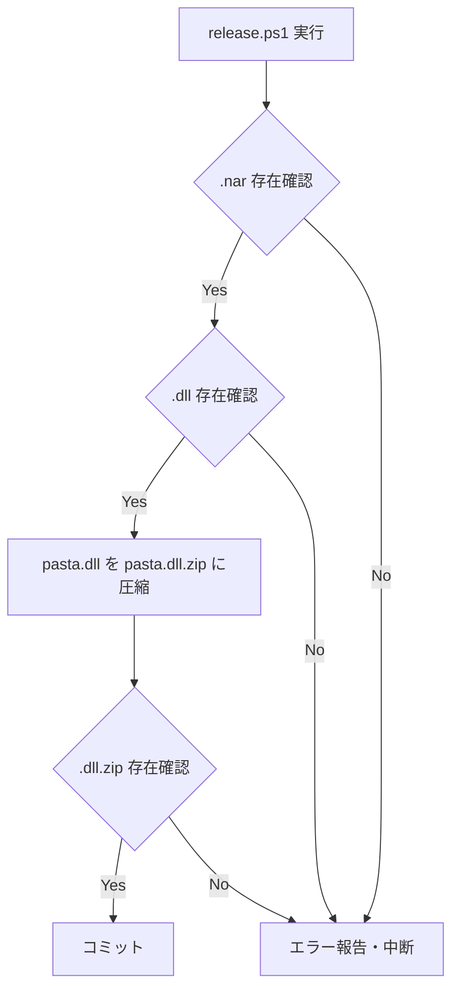
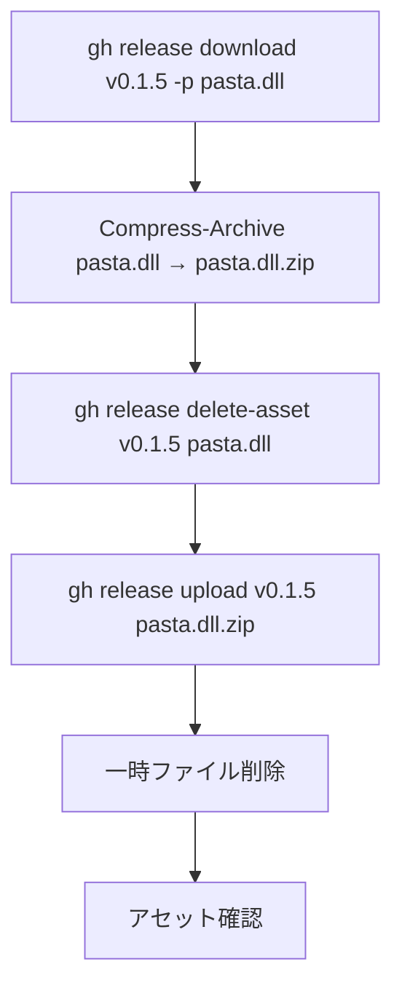

# Technical Design: release-workflow-dll-zip-fix

## Overview

**Purpose**: 既存の `release-workflow` 仕様を修正し、GitHub Release アセットの `pasta.dll` を zip 圧縮形式（`pasta.dll.zip`）に変更する。加えて、既存リリース v0.1.5 のアセットを差し替える。

**Users**: 開発者（ekicyou）が `/kiro-spec-impl release-workflow` を実行する際に、自動的に zip 圧縮が行われるようになる。

**Impact**: `release-workflow` の Phase 4（ゴーストビルド）と Phase 6（GitHub Release 作成）の修正、および v0.1.5 リリースの一回限りのアセット差し替え。

### Goals
- `release-workflow` 仕様に zip 圧縮工程を追加し、今後のリリースで `pasta.dll.zip` を Assets に含める
- v0.1.5 リリースの `pasta.dll` を `pasta.dll.zip` に差し替える
- DLL 同一性を担保するため、v0.1.5 差し替えではリリースからダウンロードした DLL を使用する

### Non-Goals
- `release.ps1` スクリプトの変更（DLL ビルド自体は従来通り）
- VSIX や NAR の追加圧縮（すでに ZIP 形式）
- Phase 0〜3 の変更

## Architecture

### Existing Architecture Analysis

本仕様は `release-workflow` 仕様の拡張であり、Phase 4 と Phase 6 のパイプラインにステップを挿入する。

**現在の Phase 4 フロー**:
1. `release.ps1` 実行 → 2. `.nar` 確認 → 3. `.dll` 確認 → 4. コミット

**現在の Phase 6 アセットリスト**:
- `target/i686-pc-windows-msvc/release/pasta.dll`
- `crates/pasta_sample_ghost/hello-pasta.nar`
- （条件付き）VSIX ファイル

### Architecture Pattern & Boundary Map

**選択パターン**: Sequential Pipeline 拡張 — 既存の Phase 4 パイプラインに zip 圧縮ステップを挿入し、Phase 6 のアセットリストを変更する。

**変更後の Phase 4 フロー**:



**変更後の Phase 6 アセットリスト**:
- `target/i686-pc-windows-msvc/release/pasta.dll.zip` ← 変更
- `crates/pasta_sample_ghost/hello-pasta.nar`
- （条件付き）VSIX ファイル

**v0.1.5 差し替えフロー**（一回限り、本仕様の実装タスクとして実行）:



### Technology Stack

| Layer | Choice / Version | Role in Feature | Notes |
|-------|------------------|-----------------|-------|
| CLI | PowerShell `Compress-Archive` | zip 圧縮 | 5.1+ 標準搭載、`-Force` で冪等性確保 |
| CLI | `gh` CLI | アセット差し替え | `delete-asset`, `upload`, `download` |

## Requirements Traceability

| Requirement | Summary | Components | Flows |
|-------------|---------|------------|-------|
| 1.1 | Phase 4 で DLL を zip 圧縮 | Phase 4: GhostBuild 修正 | Phase 4 フロー |
| 1.2 | zip ファイルの存在確認 | Phase 4: GhostBuild 修正 | Phase 4 フロー |
| 1.3 | zip 圧縮失敗時の中断 | Phase 4: GhostBuild 修正 | Phase 4 エラーフロー |
| 1.4 | アセットを `pasta.dll.zip` に変更 | Phase 6: Release 修正 | Phase 6 フロー |
| 1.5 | `Compress-Archive -Force` 使用 | Phase 4: GhostBuild 修正 | Phase 4 フロー |
| 2.1 | requirements.md Req 4 修正 | 仕様ドキュメント更新 | — |
| 2.2 | requirements.md Req 6 修正 | 仕様ドキュメント更新 | — |
| 2.3 | tasks.md タスク7 修正 | 仕様ドキュメント更新 | — |
| 2.4 | tasks.md タスク10 修正 | 仕様ドキュメント更新 | — |
| 2.5 | design.md 修正 | 仕様ドキュメント更新 | — |
| 3.1 | v0.1.5 DLL ダウンロード | v0.1.5 差し替え | v0.1.5 フロー |
| 3.2 | ダウンロード DLL の zip 圧縮 | v0.1.5 差し替え | v0.1.5 フロー |
| 3.3 | v0.1.5 アセット削除 | v0.1.5 差し替え | v0.1.5 フロー |
| 3.4 | v0.1.5 に zip アップロード | v0.1.5 差し替え | v0.1.5 フロー |
| 3.5 | 一時ファイル削除 | v0.1.5 差し替え | v0.1.5 フロー |
| 3.6 | エラー時の手動対応案内 | v0.1.5 差し替え | v0.1.5 エラーフロー |
| 3.7 | アセット存在確認 | v0.1.5 差し替え | v0.1.5 フロー |

## Components and Interfaces

| Component | Domain/Layer | Intent | Req Coverage | Key Dependencies | Contracts |
|-----------|-------------|--------|--------------|-----------------|-----------|
| Phase 4 修正 | release-workflow 仕様 | zip 圧縮ステップの追加 | 1.1–1.5 | Compress-Archive (P0) | — |
| Phase 6 修正 | release-workflow 仕様 | アセットリスト変更 | 1.4 | — | — |
| 仕様ドキュメント更新 | release-workflow 仕様 | 3ファイルの修正 | 2.1–2.5 | — | — |
| v0.1.5 差し替え | 一回限り操作 | 既存リリースのアセット差し替え | 3.1–3.7 | gh CLI (P0) | — |

### release-workflow 仕様修正

#### Phase 4: GhostBuild への zip 圧縮追加

| Field | Detail |
|-------|--------|
| Intent | DLL 存在確認後に `pasta.dll.zip` への圧縮ステップを挿入する |
| Requirements | 1.1, 1.2, 1.3, 1.5 |

**Responsibilities & Constraints**
- `target/i686-pc-windows-msvc/release/pasta.dll` の zip 圧縮
- 圧縮後ファイルの存在確認
- 失敗時はリリース作業中断

**修正内容**

`release-workflow/requirements.md` Req 4 に以下の AC を追加:
- AC 4.6: When `pasta.dll` の存在が確認される, the Release Workflow shall `Compress-Archive -Force` で `pasta.dll.zip` に圧縮する
- AC 4.7: When zip 圧縮が完了する, the Release Workflow shall `pasta.dll.zip` の存在を確認する
- AC 4.8: If zip 圧縮が失敗する, the Release Workflow shall エラーを報告しリリース作業を中断する

`release-workflow/tasks.md` タスク7 に以下を追加:
```
- DLL 存在確認の直後に zip 圧縮を実行:
  Compress-Archive -Path "target/i686-pc-windows-msvc/release/pasta.dll" `
    -DestinationPath "target/i686-pc-windows-msvc/release/pasta.dll.zip" `
    -Force
- `Test-Path "target/i686-pc-windows-msvc/release/pasta.dll.zip"` で zip 確認
- 失敗時はエラー報告し中断
```

`release-workflow/design.md` Phase 4 セクションに zip 圧縮ステップを追加。

#### Phase 6: Release アセットリスト変更

| Field | Detail |
|-------|--------|
| Intent | GitHub Release のアセットリストで `pasta.dll` を `pasta.dll.zip` に変更する |
| Requirements | 1.4 |

**修正内容**

`release-workflow/requirements.md` Req 6 AC 6.7 を以下に変更:
```
7. When GitHub Release を作成する, the Release Workflow shall 以下のファイルをリリースアセットとして添付する:
   - `target/i686-pc-windows-msvc/release/pasta.dll.zip`
   - `crates/pasta_sample_ghost/hello-pasta.nar`
```

`release-workflow/tasks.md` タスク10 の `$assets` 配列を以下に変更:
```powershell
$assets = @(
  "target/i686-pc-windows-msvc/release/pasta.dll.zip",
  "crates/pasta_sample_ghost/hello-pasta.nar"
)
```

### 一回限り操作

#### v0.1.5 アセット差し替え

| Field | Detail |
|-------|--------|
| Intent | v0.1.5 リリースの `pasta.dll` を `pasta.dll.zip` に差し替える |
| Requirements | 3.1, 3.2, 3.3, 3.4, 3.5, 3.6, 3.7 |

**Responsibilities & Constraints**
- DLL 同一性の担保（リリースからダウンロードした DLL を使用）
- 操作の順序: download → compress → delete-asset → upload → cleanup → verify
- エラー時の手動対応案内

**Dependencies**
- External: `gh` CLI — 認証済み (P0)
- External: GitHub Release v0.1.5 — 操作対象 (P0)

**実行手順**

1. **DLL ダウンロード** (3.1):
   ```powershell
   gh release download v0.1.5 -p "pasta.dll" -D .
   ```

2. **zip 圧縮** (3.2):
   ```powershell
   Compress-Archive -Path "pasta.dll" -DestinationPath "pasta.dll.zip" -Force
   ```

3. **アセット削除** (3.3):
   ```powershell
   gh release delete-asset v0.1.5 pasta.dll -y
   ```

4. **アセットアップロード** (3.4):
   ```powershell
   gh release upload v0.1.5 pasta.dll.zip
   ```

5. **一時ファイル削除** (3.5):
   ```powershell
   Remove-Item pasta.dll, pasta.dll.zip
   ```

6. **アセット確認** (3.7):
   ```powershell
   gh release view v0.1.5 --json assets -q ".assets[].name"
   ```
   - `pasta.dll.zip` と `hello-pasta.nar` の存在を確認

7. **エラーハンドリング** (3.6):
   - いずれかのステップで失敗した場合、エラー内容を報告し手動での対応手順を案内

## Error Handling

### Error Strategy

各操作は**逐次実行・即時停止**方式で制御される。

### Error Categories and Responses

| 操作 | エラー種別 | 対応 | ロールバック |
|------|-----------|------|-------------|
| Compress-Archive | zip 圧縮失敗 | エラー報告・中断 | 不要（元ファイル未変更） |
| gh release download | ダウンロード失敗 | エラー報告・手動案内 | 不要 |
| gh release delete-asset | アセット削除失敗 | エラー報告・手動案内 | 不要（アセット残存） |
| gh release upload | アップロード失敗 | エラー報告・手動案内 | `pasta.dll` は既に削除済みのため、手動で再アップロード案内 |

## Testing Strategy

本仕様はオペレーション仕様（仕様ドキュメントの修正 + CLI 操作）であり、自動テストの対象外。

### 手動検証項目

| 確認項目 | 確認方法 | タイミング |
|----------|---------|-----------|
| v0.1.5 に `pasta.dll.zip` が存在するか | `gh release view v0.1.5 --json assets` | v0.1.5 差し替え後 |
| v0.1.5 から `pasta.dll` が削除されたか | 同上 | v0.1.5 差し替え後 |
| release-workflow 仕様が正しく更新されたか | 各ファイルの diff 確認 | 仕様更新後 |
