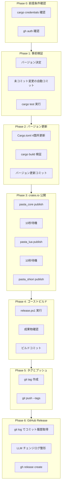
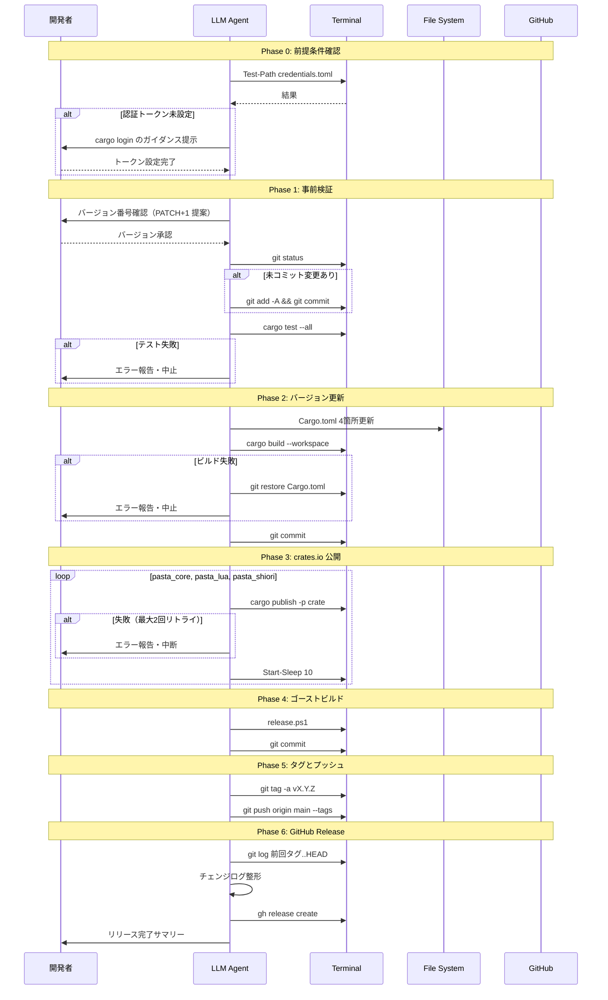
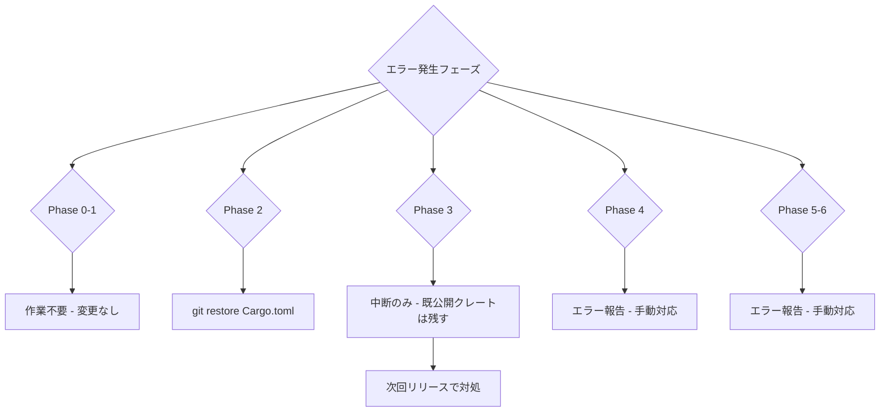

# Technical Design: release-workflow

## Overview

**Purpose**: 本設計は、pasta プロジェクトの crates.io 公開・GitHub Release 作成を含むリリース作業を、LLM エージェントが繰り返し実行するためのオペレーション設計を定義する。

**Users**: 開発者（ekicyou）が `/kiro-spec-impl release-workflow` を実行するたびに、LLM エージェントが本設計に従ってリリース作業を遂行する。

**Impact**: 手動リリース手順（`RELEASE.md`）を体系化し、バージョン管理から GitHub Release 作成までの全工程を一貫した品質で繰り返し実行可能にする。

### Goals
- Cargo.toml のバージョン更新から GitHub Release 作成までの全工程を LLM が逐次実行する
- 各ステップでエラー検出・ロールバック・開発者確認を適切に行う
- Conventional Commits に基づく整形済みチェンジログを自動生成する
- 繰り返し実行可能な設計を維持する（仕様は `completed` に遷移しない）

### Non-Goals
- リリース自動化スクリプトの新規作成（LLM による対話的実行で代替）
- CI/CD パイプラインへの統合（ローカル実行前提）
- クロスプラットフォーム対応（Windows + PowerShell 環境限定）
- `cargo publish` 認証トークンの自動設定（セキュリティ上、手動設定を前提とする）

## Architecture

### Existing Architecture Analysis

本仕様はコードの新規作成・変更を伴わない**オペレーション仕様**である。既存のツール群を組み合わせて LLM が逐次実行する。

**既存アセット**:

| アセット | 状態 | 本設計での役割 |
|----------|------|----------------|
| `Cargo.toml`（ルート） | ✅ ワークスペース集中管理 | バージョン更新対象（4箇所） |
| `release.ps1` | ✅ 成熟スクリプト（387行） | ゴーストビルド実行 |
| `gh` CLI | ✅ 認証済み（ekicyou） | GitHub Release 作成 |
| `cargo` | ✅ 利用可能 | テスト・ビルド・公開 |
| `git` | ✅ 利用可能 | バージョン管理・タグ・プッシュ |

**保持すべきパターン**:
- ワークスペースルート `Cargo.toml` による集中バージョン管理
- `release.ps1` のそのままの利用（変更不要）
- Conventional Commits によるコミットメッセージ規約

### Architecture Pattern & Boundary Map

**選択パターン**: Sequential Pipeline — LLM が各フェーズのステップを逐次実行し、結果を確認して次のフェーズに進む。



**ドメイン境界**:
- 各フェーズは独立したゲートを持ち、失敗時はそのフェーズで停止
- Phase 0〜1 は検証フェーズ（ロールバック不要）
- Phase 2〜6 は実行フェーズ（エラー時のロールバック戦略が定義済み）

**Steering 準拠**:
- workflow.md の「危険な Git 操作の禁止」ポリシーに準拠（`git reset --hard` 等は使用しない）
- tech.md のセマンティックバージョニング準拠
- Conventional Commits によるコミットメッセージ規約

### Technology Stack

| Layer | Choice / Version | Role in Feature | Notes |
|-------|------------------|-----------------|-------|
| CLI | `cargo` (Rust toolchain) | テスト・ビルド・crates.io 公開 | `cargo publish -p <crate>` |
| CLI | `git` | バージョン管理・タグ・プッシュ | アノテーションタグ使用 |
| CLI | `gh` (GitHub CLI) | GitHub Release 作成・アセット添付 | 認証済み（ekicyou） |
| Script | `release.ps1` (PowerShell) | x86 DLL ビルド + .nar 生成 | 既存成熟スクリプト |
| Editor | LLM エディタツール | `Cargo.toml` バージョン編集 | `replace_string_in_file` |
| Runtime | Windows + PowerShell | 実行環境 | `i686-pc-windows-msvc` ターゲット必須 |

## System Flows

### メインリリースフロー



### エラー時ロールバックフロー



## Requirements Traceability

| Requirement | Summary | Components | Flows |
|-------------|---------|------------|-------|
| 1.1 | バージョン番号指定時に使用 | Phase 1 | メインフロー: バージョン確認 |
| 1.2 | PATCH 自動インクリメント | Phase 1 | メインフロー: バージョン確認 |
| 1.3 | 提案バージョン承認確認 | Phase 1 | メインフロー: バージョン確認 |
| 1.4 | 承認拒否時の再入力 | Phase 1 | メインフロー: バージョン確認 |
| 1.5 | semver 妥当性検証 | Phase 1 | メインフロー: バージョン確認 |
| 1.6 | semver 形式エラー報告 | Phase 1 | メインフロー: バージョン確認 |
| 1.7 | git status 確認 | Phase 1 | メインフロー: 事前検証 |
| 1.8 | 未コミット変更の自動コミット | Phase 1 | メインフロー: 事前検証 |
| 1.9 | cargo test 実行 | Phase 1 | メインフロー: 事前検証 |
| 1.10 | テスト失敗時中止 | Phase 1 | エラーフロー: Phase 0-1 |
| 2.1 | workspace.package.version 更新 | Phase 2 | メインフロー: バージョン更新 |
| 2.2 | workspace.dependencies 内部クレート参照更新 | Phase 2 | メインフロー: バージョン更新 |
| 2.3 | cargo build 検証 | Phase 2 | メインフロー: バージョン更新 |
| 2.4 | ビルド失敗時ロールバック | Phase 2 | エラーフロー: Phase 2 |
| 2.5 | バージョン更新コミット | Phase 2 | メインフロー: バージョン更新 |
| 3.1 | 依存関係順 cargo publish | Phase 3 | メインフロー: crates.io 公開 |
| 3.2 | 公開成功確認後に次クレート | Phase 3 | メインフロー: crates.io 公開 |
| 3.3 | 最大2回リトライ | Phase 3 | メインフロー: crates.io 公開 |
| 3.4 | リトライ後失敗時中断 | Phase 3 | エラーフロー: Phase 3 |
| 3.5 | pasta_sample_ghost スキップ | Phase 3 | メインフロー: crates.io 公開 |
| 3.6 | 公開間10秒待機 | Phase 3 | メインフロー: crates.io 公開 |
| 4.1 | release.ps1 実行 | Phase 4 | メインフロー: ゴーストビルド |
| 4.2 | hello-pasta.nar 確認 | Phase 4 | メインフロー: ゴーストビルド |
| 4.3 | pasta.dll 確認 | Phase 4 | メインフロー: ゴーストビルド |
| 4.4 | release.ps1 失敗時中断 | Phase 4 | エラーフロー: Phase 4 |
| 4.5 | ゴーストビルドコミット | Phase 4 | メインフロー: ゴーストビルド |
| 5.1 | アノテーションタグ作成 | Phase 5 | メインフロー: タグとプッシュ |
| 5.2 | タグメッセージ設定 | Phase 5 | メインフロー: タグとプッシュ |
| 5.3 | 既存タグ競合時エラー | Phase 5 | エラーフロー: Phase 5-6 |
| 5.4 | git push origin main --tags | Phase 5 | メインフロー: タグとプッシュ |
| 5.5 | プッシュ失敗時報告 | Phase 5 | エラーフロー: Phase 5-6 |
| 6.1 | git log で履歴取得 | Phase 6 | メインフロー: GitHub Release |
| 6.2 | Conventional Commits 分類 | Phase 6 | メインフロー: GitHub Release |
| 6.3 | グループ別チェンジログ整形 | Phase 6 | メインフロー: GitHub Release |
| 6.4 | gh release create 実行 | Phase 6 | メインフロー: GitHub Release |
| 6.5 | タイトル設定 | Phase 6 | メインフロー: GitHub Release |
| 6.6 | チェンジログをリリースノートに含める | Phase 6 | メインフロー: GitHub Release |
| 6.7 | アセット添付（pasta.dll, hello-pasta.nar） | Phase 6 | メインフロー: GitHub Release |
| 6.8 | gh 失敗時手動手順案内 | Phase 6 | エラーフロー: Phase 5-6 |
| 6.9 | 初回リリース時の全履歴使用 | Phase 6 | メインフロー: GitHub Release |
| 7.1 | タスク状態初期化 | — | 繰り返し実行の仕様特性 |
| 7.2 | phase を completed にしない | — | 繰り返し実行の仕様特性 |
| 7.3 | 独立した作業として動作 | — | 繰り返し実行の仕様特性 |
| 7.4 | 完了サマリー報告 | Phase 6 | メインフロー: 最終報告 |

## Components and Interfaces

| Component | Domain/Layer | Intent | Req Coverage | Key Dependencies | Contracts |
|-----------|-------------|--------|--------------|-----------------|-----------|
| Phase 0: Prerequisites | 検証 | 前提条件の確認 | — | cargo credentials (P0), gh auth (P0) | — |
| Phase 1: Validation | 検証 | バージョン決定と事前検証 | 1.1–1.10 | Cargo.toml (P0), cargo test (P0), git (P0) | — |
| Phase 2: VersionBump | 実行 | Cargo.toml バージョン更新 | 2.1–2.5 | Cargo.toml (P0), cargo build (P0) | — |
| Phase 3: Publish | 実行 | crates.io 公開 | 3.1–3.6 | cargo publish (P0), crates.io index (P1) | — |
| Phase 4: GhostBuild | 実行 | サンプルゴーストビルド | 4.1–4.5 | release.ps1 (P0), i686-pc-windows-msvc (P0) | — |
| Phase 5: TagPush | 実行 | Git タグ作成とプッシュ | 5.1–5.5 | git (P0), GitHub remote (P0) | — |
| Phase 6: Release | 実行 | GitHub Release 作成 | 6.1–6.9, 7.4 | gh CLI (P0), git log (P0) | — |

### 検証レイヤー

#### Phase 0: Prerequisites

| Field | Detail |
|-------|--------|
| Intent | リリース実行に必要な外部ツールの認証状態を確認する |
| Requirements | — （暗黙的前提条件） |

**Responsibilities & Constraints**
- `cargo publish` の認証トークン（`~/.cargo/credentials.toml`）の存在確認
- `gh auth status` による GitHub CLI の認証状態確認
- 未設定時はガイダンスを提示し、設定完了を待つ

**Dependencies**
- External: `~/.cargo/credentials.toml` — cargo publish 認証 (P0)
- External: `gh` CLI 認証 — GitHub Release 作成 (P0)

**実行手順**

1. **cargo credentials 確認**:
   ```
   Test-Path "$env:USERPROFILE\.cargo\credentials.toml"
   ```
   - `False` の場合: 「`cargo login` を実行して crates.io のAPIトークンを設定してください」とガイダンス
   - トークン取得先: https://crates.io/settings/tokens

2. **gh auth 確認**:
   ```
   gh auth status
   ```
   - 認証済みなら続行
   - 未認証の場合: 「`gh auth login` を実行してください」とガイダンス

#### Phase 1: Validation

| Field | Detail |
|-------|--------|
| Intent | リリースバージョンを決定し、ワークツリーとテストの健全性を検証する |
| Requirements | 1.1, 1.2, 1.3, 1.4, 1.5, 1.6, 1.7, 1.8, 1.9, 1.10 |

**Responsibilities & Constraints**
- バージョン番号の決定（指定 or PATCH+1 自動提案）
- semver 形式の妥当性検証
- 未コミット変更の自動コミット（安全なロールバック基盤の確立）
- 全テストの通過確認

**Dependencies**
- Inbound: Phase 0 の前提条件充足 (P0)
- External: `Cargo.toml` — 現在バージョンの読み取り (P0)
- External: `cargo test` — テスト実行 (P0)
- External: `git` — ワークツリー状態確認 (P0)

**実行手順**

1. **バージョン決定** (1.1–1.6):
   - 開発者からバージョン指定がある場合 → そのまま使用 (1.1)
   - 指定がない場合 → `Cargo.toml` の `[workspace.package].version` を読み取り、PATCH を +1 (1.2)
   - 提案形式: 「v0.1.2 から v0.1.3 に更新します。よろしいですか？」 (1.3)
   - 拒否された場合 → 希望バージョンの入力を求める (1.4)
   - semver 形式チェック: `X.Y.Z` の数値3組（`^[0-9]+\.[0-9]+\.[0-9]+$`） (1.5, 1.6)

2. **ワークツリー整理** (1.7, 1.8):
   ```
   git status --porcelain
   ```
   - 出力がある場合:
     ```
     git add -A
     git commit -m "chore(release): prepare release vX.Y.Z"
     ```
   - 出力が空の場合: スキップ

3. **テスト実行** (1.9, 1.10):
   ```
   cargo test --all
   ```
   - 成功: 次のフェーズへ
   - 失敗: エラー内容を報告し、リリース作業を中止

### 実行レイヤー

#### Phase 2: VersionBump

| Field | Detail |
|-------|--------|
| Intent | ワークスペース全体のバージョンを新バージョンに一括更新し、ビルド検証する |
| Requirements | 2.1, 2.2, 2.3, 2.4, 2.5 |

**Responsibilities & Constraints**
- `Cargo.toml` の4箇所を正確に更新
- ビルド検証によるバージョン整合性の確認
- 失敗時は `git restore Cargo.toml` で安全にロールバック

**Dependencies**
- Inbound: Phase 1 のバージョン確定 (P0)
- External: `Cargo.toml`（ルート） — 編集対象 (P0)
- External: `cargo build` — ビルド検証 (P0)

**実行手順**

1. **Cargo.toml 更新** (2.1, 2.2):
   - `replace_string_in_file` で以下の4箇所を更新:
     - `[workspace.package]` セクションの `version = "<OLD>"` → `version = "<NEW>"`
     - `pasta_core = { path = "crates/pasta_core", version = "<OLD>" }` → `version = "<NEW>"`
     - `pasta_lua = { path = "crates/pasta_lua", version = "<OLD>" }` → `version = "<NEW>"`
     - `pasta_shiori = { path = "crates/pasta_shiori", version = "<OLD>" }` → `version = "<NEW>"`

2. **ビルド検証** (2.3):
   ```
   cargo build --workspace
   ```

3. **エラーハンドリング** (2.4):
   - ビルド失敗時:
     ```
     git restore Cargo.toml
     ```
   - エラー内容を報告し中止

4. **コミット** (2.5):
   ```
   git add Cargo.toml
   git commit -m "chore(release): bump version to vX.Y.Z"
   ```

#### Phase 3: Publish

| Field | Detail |
|-------|--------|
| Intent | 依存関係順に3クレートを crates.io に公開する |
| Requirements | 3.1, 3.2, 3.3, 3.4, 3.5, 3.6 |

**Responsibilities & Constraints**
- 依存関係順（`pasta_core` → `pasta_lua` → `pasta_shiori`）を厳守
- 各クレート公開後に10秒待機（crates.io インデックス更新待ち）
- 失敗時は最大2回リトライ、それでも失敗なら中断
- `pasta_sample_ghost`（`publish = false`）はスキップ

**Dependencies**
- Inbound: Phase 2 のバージョン更新コミット (P0)
- External: `cargo publish` — crates.io 公開 (P0)
- External: crates.io index — インデックス更新待ち (P1)
- External: `~/.cargo/credentials.toml` — 認証 (P0)

**実行手順**

公開対象クレートリスト（順序固定）:
1. `pasta_core`
2. `pasta_lua`
3. `pasta_shiori`

各クレートに対して以下を実行:

1. **公開** (3.1, 3.2):
   ```
   cargo publish -p <crate_name>
   ```

2. **リトライ** (3.3, 3.4):
   - 失敗時: 最大2回リトライ（合計3回試行）
   - 3回失敗:
     - エラーを報告
     - 既に公開済みのクレートはそのまま残す
     - 以降の公開を中断
     - 「手動 yank または次回リリースで対処してください」と案内

3. **待機** (3.6):
   ```
   Start-Sleep -Seconds 10
   ```
   - 最後のクレート（`pasta_shiori`）公開後は待機不要

#### Phase 4: GhostBuild

| Field | Detail |
|-------|--------|
| Intent | x86 リリースビルドの pasta.dll とサンプルゴースト hello-pasta.nar を生成する |
| Requirements | 4.1, 4.2, 4.3, 4.4, 4.5 |

**Responsibilities & Constraints**
- `release.ps1` を `crates/pasta_sample_ghost/` ディレクトリで実行
- 成果物（`hello-pasta.nar`, `pasta.dll`）の存在確認
- 失敗時はリリース作業中断

**Dependencies**
- Inbound: Phase 3 の crates.io 公開完了 (P0)
- External: `release.ps1` — ゴーストビルドスクリプト (P0)
- External: `i686-pc-windows-msvc` — 32bit ビルドターゲット (P0)

**実行手順**

1. **ビルド実行** (4.1):
   ```
   Push-Location crates/pasta_sample_ghost
   PowerShell -ExecutionPolicy Bypass -File release.ps1
   Pop-Location
   ```

2. **成果物確認** (4.2, 4.3):
   ```
   Test-Path "crates/pasta_sample_ghost/hello-pasta.nar"
   Test-Path "target/i686-pc-windows-msvc/release/pasta.dll"
   ```
   - いずれかが `False`: エラー報告し中断 (4.4)

3. **コミット** (4.5):
   ```
   git add -A
   git commit -m "chore(release): build hello-pasta vX.Y.Z"
   ```

#### Phase 5: TagPush

| Field | Detail |
|-------|--------|
| Intent | リリースポイントを Git タグで記録し、リモートに反映する |
| Requirements | 5.1, 5.2, 5.3, 5.4, 5.5 |

**Responsibilities & Constraints**
- アノテーションタグ（`-a`）を使用
- 既存タグ競合時は自動削除せず、開発者に確認
- プッシュ失敗時は手動対応を案内

**Dependencies**
- Inbound: Phase 4 のゴーストビルドコミット (P0)
- External: `git` — タグ・プッシュ (P0)
- External: GitHub remote — プッシュ先 (P0)

**実行手順**

1. **既存タグ確認** (5.3):
   ```
   git tag -l "vX.Y.Z"
   ```
   - 出力がある場合: 「タグ vX.Y.Z は既に存在します。既存タグの削除が必要です。手動で `git tag -d vX.Y.Z` を実行しますか？」と確認

2. **タグ作成** (5.1, 5.2):
   ```
   git tag -a vX.Y.Z -m "Release vX.Y.Z"
   ```

3. **プッシュ** (5.4, 5.5):
   ```
   git push origin main --tags
   ```
   - 失敗時: エラー報告し「手動で `git push origin main --tags` を再実行してください」と案内

#### Phase 6: Release

| Field | Detail |
|-------|--------|
| Intent | チェンジログ付きの GitHub Release を作成し、ビルド成果物を添付する |
| Requirements | 6.1, 6.2, 6.3, 6.4, 6.5, 6.6, 6.7, 6.8, 6.9, 7.4 |

**Responsibilities & Constraints**
- `git log` からコミット履歴を取得し、LLM が Conventional Commits 形式で分類・整形
- 仕様管理コミット（`chore(spec):`, `docs(spec):` 等）はチェンジログから除外
- GitHub Release にリリースノートとアセット（2ファイル）を添付

**Dependencies**
- Inbound: Phase 5 のタグプッシュ完了 (P0)
- External: `git log` — コミット履歴取得 (P0)
- External: `gh` CLI — GitHub Release 作成 (P0)

**実行手順**

1. **コミット履歴取得** (6.1, 6.9):
   ```
   git tag -l "v*" --sort=-version:refname
   ```
   - 前回タグが存在する場合:
     ```
     git log <前回タグ>..vX.Y.Z --oneline --no-merges
     ```
   - 前回タグが存在しない場合（初回リリース）:
     ```
     git log --oneline --no-merges
     ```

2. **チェンジログ整形** (6.2, 6.3):
   LLM が以下のルールでコミットを分類:

   **分類マッピング**:

   | Conventional Prefix | チェンジログ見出し |
   |--------------------|--------------------|
   | `feat:` / `feat(*)` | ✨ Features |
   | `fix:` / `fix(*)` | 🐛 Bug Fixes |
   | `refactor:` / `refactor(*)` | ♻️ Refactoring |
   | `docs:` / `docs(*)` | 📝 Documentation |
   | `test:` / `test(*)` | 🧪 Tests |
   | `chore:` / `chore(*)` | 🔧 Maintenance |

   **除外ルール**:
   - スコープが `spec` のコミット（`chore(spec):`, `docs(spec):` 等）は除外
   - 空になったグループは見出しごと省略

   **出力テンプレート**:
   ```markdown
   ## What's Changed

   ### ✨ Features
   - コミットサマリー (@author)

   ### 🐛 Bug Fixes
   - コミットサマリー (@author)

   ### ♻️ Refactoring
   - コミットサマリー (@author)

   ...

   **Full Changelog**: https://github.com/ekicyou/pasta/compare/<前回タグ>...vX.Y.Z
   ```

3. **リリースノートファイル作成**:
   - チェンジログを一時ファイルに書き出し（`release-notes-vX.Y.Z.md`）

4. **GitHub Release 作成** (6.4, 6.5, 6.6, 6.7):
   ```
   gh release create vX.Y.Z `
     "target/i686-pc-windows-msvc/release/pasta.dll" `
     "crates/pasta_sample_ghost/hello-pasta.nar" `
     --title "pasta vX.Y.Z" `
     --notes-file release-notes-vX.Y.Z.md
   ```

5. **一時ファイル削除**:
   ```
   Remove-Item release-notes-vX.Y.Z.md
   ```

6. **エラーハンドリング** (6.8):
   - `gh` 失敗時:
     - エラー報告
     - 手動手順を案内:
       ```
       gh release create vX.Y.Z ^
         "target/i686-pc-windows-msvc/release/pasta.dll" ^
         "crates/pasta_sample_ghost/hello-pasta.nar" ^
         --title "pasta vX.Y.Z" ^
         --notes-file release-notes-vX.Y.Z.md
       ```

7. **完了サマリー** (7.4):
   - バージョン: `vX.Y.Z`
   - 公開クレート: `pasta_core`, `pasta_lua`, `pasta_shiori`
   - Release URL: `https://github.com/ekicyou/pasta/releases/tag/vX.Y.Z`

## Error Handling

### Error Strategy

各フェーズは**ゲート方式**で制御され、失敗時はそのフェーズで停止する。後続フェーズは実行されない。

### Error Categories and Responses

| フェーズ | エラー種別 | 対応 | ロールバック |
|---------|-----------|------|-------------|
| Phase 0 | 認証未設定 | ガイダンス提示 → 設定待ち | 不要 |
| Phase 1 | テスト失敗 | エラー報告・中止 | 不要（変更なし） |
| Phase 2 | ビルド失敗 | `git restore Cargo.toml` | Cargo.toml 復元 |
| Phase 3 | cargo publish 失敗 | 最大2回リトライ → 中断 | 既公開クレートは残す |
| Phase 4 | release.ps1 失敗 | エラー報告・中断 | 手動対応 |
| Phase 5 | タグ競合 | 開発者に確認 | 手動対応 |
| Phase 5 | プッシュ失敗 | エラー報告 | 手動リトライ |
| Phase 6 | gh 失敗 | 手動手順案内 | 手動実行 |

### セッション中断からの復旧

LLM セッションが途中で切断された場合の復旧手順:

1. `git log --oneline -5` で最後のコミットメッセージを確認
2. コミットメッセージから進捗を判断:
   - `chore(release): prepare release vX.Y.Z` → Phase 1 完了
   - `chore(release): bump version to vX.Y.Z` → Phase 2 完了
   - `chore(release): build hello-pasta vX.Y.Z` → Phase 4 完了
3. 完了済みフェーズをスキップして再開

## Testing Strategy

本仕様はオペレーション仕様であり、自動テストの対象外である。品質は以下で担保する:

- **Phase 1**: `cargo test --all` による全テスト通過の確認
- **Phase 2**: `cargo build --workspace` によるビルド検証
- **Phase 4**: `release.ps1` による成果物生成と存在確認
- **Phase 6**: GitHub Release の作成成功確認

### 手動検証項目

| 確認項目 | 確認方法 | タイミング |
|----------|---------|-----------|
| crates.io にクレートが公開されたか | https://crates.io/crates/pasta_core を確認 | Phase 3 完了後 |
| GitHub Release にアセットが添付されたか | Release ページで確認 | Phase 6 完了後 |
| .nar ファイルが正常か | arekaで読み込みテスト | リリース後（任意） |

## 繰り返し実行の仕様特性

本仕様は Requirements 7 に基づき、以下の特殊な運用モデルを持つ:

- `/kiro-spec-impl release-workflow` が実行されるたびに、全タスクの状態は初期化される (7.1)
- `spec.json` の `phase` は `completed` に遷移せず、`ready_for_implementation` を維持する (7.2)
- 各実行は前回の実行状態に依存しない独立した作業として動作する (7.3)
- 実行完了時にサマリーを報告する (7.4)
