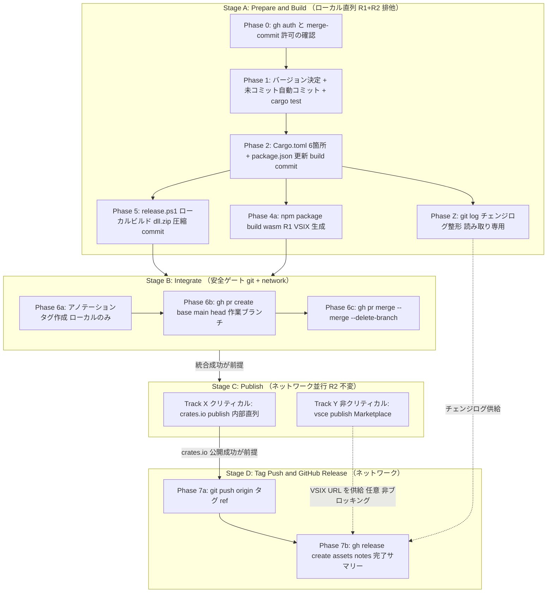
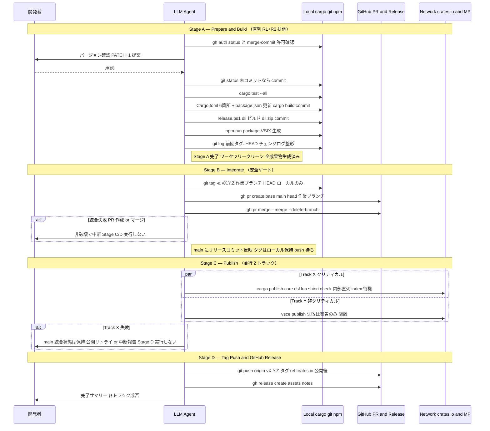
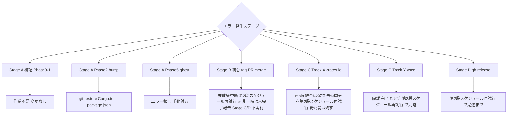

# Technical Design: release-workflow

## Overview

**Purpose**: 本設計は、pasta プロジェクトのリリース作業（crates.io 公開、VSCode Marketplace 公開、GitHub Release 作成）を、LLM エージェントが Claude Code ハーネスのワークツリー上で繰り返し実行するためのオペレーション設計を定義する。各処理が要求する**共有リソース**を分析し、安全に並行化できる処理を並行実行する **リソース認識型ステージ並行モデル（Resource-Aware Staged Concurrency）** を採用する。本改訂版では、(a) ワークツリー（非デフォルトブランチ）上での実行、(b) リリースコミット・タグの **PR マージコミット方式（`gh pr merge --merge`）による main 統合**（直接 push 廃止）、(c) 不可逆な crates.io 公開を可逆な main 統合の**後段**へ置く安全順序の反転、を導入する。

**Users**: 開発者（ekicyou）が `/kiro-impl release-workflow` を実行するたびに、LLM エージェントが本設計に従ってワークツリー上でリリース作業を遂行する。

**Impact**: 旧設計（crates.io 公開 → タグ作成 → main 直接 push）を、ワークツリー隔離実行・PR マージコミット統合・安全順序反転（**統合先・公開後**）へ改める。これにより、ハーネスのワークツリー環境で実行でき、コミット SHA とタグの参照整合性が保たれ、将来の GitHub ブランチ保護（main 直接 push 禁止）に前方互換となり、不可逆な公開を可逆な統合の後段に置くことで「公開済みだが統合不能」という不可逆事故の窓を排除する。

### Goals
- バージョン更新から GitHub Release 作成までの全工程を、ワークツリー上で LLM が実行する
- リリースコミット・タグを **非 squash・マージコミット方式**で main へ統合し、コミット SHA とタグの到達性を保証する（直接 push を行わない）
- 不可逆な crates.io 公開を可逆な main 統合の**後段**に置き、安全順序「main 統合 → crates.io 公開 → GitHub Release」を保証する
- 共有リソース制約（cargo ロック / git ワークツリー / ネットワーク）を尊重した安全な並行スケジューリングを行う
- 非クリティカルフェーズ（Marketplace 公開）を隔離し、独立した公開トラックを並行化する
- 繰り返し実行可能な設計を維持する（仕様は `completed` に遷移しない）
- **完遂優先の自律実行**（基本方針）: 時間がかかっても、なるべく自律的に解決し**完遂できる手順**であることを最優先する。これを条件に、実行中に一時的に外部から観測される中間状態（例: main 統合済みだがタグ未 push）は許容する
- **完遂保証（no half-done）**: 全ターゲット（crates.io 全クレート・Marketplace・タグ・Release）成功までリリースを「完了」としない。失敗しやすい手順（特に Marketplace）はセッション内バックオフ → スケジュール永続リトライで完遂まで粘る（Req 11）

### Non-Goals
- リリース自動化スクリプトの新規作成（LLM による対話的実行で代替）
- CI/CD パイプラインへの統合（ローカル実行前提）
- クロスプラットフォーム対応（Windows + PowerShell 環境限定）
- `cargo publish` / `vsce` 認証トークンの自動設定（手動設定を前提とする）
- pasta_lsp の独立リリース管理
- マルチマシン分散実行（単一ワークツリー・単一マシン前提）
- **GitHub ブランチ保護ルールそのものの構成**（本設計は保護下でも成立する手順を定めるが、保護ルールの設定作業は対象外）
- **spec 完了の squash-PR 統合フロー**（kiro-complete が管轄。リリースは別系統）

## Boundary Commitments

### This Spec Owns
- バージョン番号の決定・検証・全ソース調査
- Cargo.toml（5箇所）および package.json のバージョン更新
- crates.io への依存関係順公開（4クレート + pasta_check の計5クレート）
- VSCode 拡張のビルド（パッケージング）と Marketplace 公開（非クリティカル）
- サンプルゴースト（hello-pasta）のビルドと成果物確認
- Git タグ作成、および **PR マージコミット方式による作業ブランチ → main の統合とタグ公開**
- GitHub Release 作成（チェンジログ生成・アセット添付）
- **リリース作業全体の実行スケジューリング（4ステージ分割・並行トラック管理）、安全順序（統合 → 公開 → Release）、エラーハンドリング・ロールバック**
- **一回限りセットアップ**（repo の merge-commit 有効化、`.claude/settings.json` 許可調整、`workflow.md` カーブアウト改訂）の定義（繰り返し手順とは分離した前提セットアップ）

### Out of Boundary
- pasta_lsp の crates.io 公開（`publish = true` だが本ワークフロー対象外）
- CI/CD パイプラインとの統合
- 認証トークンの設定・管理
- release.ps1 スクリプト自体の修正
- crates.io に公開済みクレートの yank 操作
- **spec 完了の squash-PR 統合フロー**（kiro-complete が管轄）
- **GitHub ブランチ保護／タグ保護ルールの構成**

### Allowed Dependencies
- External: `cargo` CLI — ビルド・テスト・公開（R1 cargo ロックを保持）(P0)
- External: `git` CLI — バージョン管理・タグ・タグ push（R2 ワークツリーを保持）(P0)
- External: `gh` CLI — **PR 作成・マージコミット統合**（`gh pr create` / `gh pr merge --merge --delete-branch`、R3）および GitHub Release 作成（R3）(P0)
- External: `npm` / `vsce` — VSCode 拡張ビルド・公開（build:wasm は R1、publish は R3）(P0)
- Script: `release.ps1` — サンプルゴーストビルド（内部で cargo を呼び R1 を保持）(P0)
- Pattern: `kiro-complete` SKILL.md の PR 統合パターン（PR 可否判定・中断セマンティクス・ローカル削除警告の非致命扱い）を**流用**（`--squash` → `--merge` に置換）(P1)
- One-Time: `gh repo edit --enable-merge-commit` — repo の merge-commit 方式の有効化（前提セットアップ）(P0)
- Infra: crates.io registry / VSCode Marketplace — 公開先（R3）(P1)
- Infra: ハーネスのスケジュール実行機構（cron 系スケジュールタスク）— 第2段スケジュール永続リトライ（セッション跨ぎで完遂まで再起動）(P1)

### Revalidation Triggers
- Cargo.toml の workspace 構造変更（クレート追加・削除）
- release.ps1 のインターフェース変更（特にローカルビルド方式が crates.io 依存へ変わると Req 5.9 / 8.6 の前提が崩れる）
- VSCode 拡張のビルドパイプライン変更（特に `build:wasm` が R1 を要するか）
- **repo の merge-method 設定変更**（merge-commit 無効化／squash 無効化）→ Req 10 AC3 の前提が崩れる
- **GitHub ブランチ保護／タグ保護の有効化**（必須ステータスチェックは `gh pr merge` 即時マージをブロックし得る）
- **ハーネスのワークツリー供給仕様の変更**（作業ブランチが供給されない／デフォルトブランチ上で起動する等）
- `.claude/settings.json` の push 許可エントリの変更

## Architecture

### Existing Architecture Analysis

本仕様はコードの新規作成・変更を伴わない**オペレーション仕様**である。既存のツール群を組み合わせて LLM がワークツリー上で実行する。

**既存アセット**:

| アセット                      | 状態                     | 本設計での役割                       |
| ----------------------------- | ------------------------ | ------------------------------------ |
| `Cargo.toml`（ルート）        | ✅ ワークスペース集中管理 | バージョン更新対象（6箇所）          |
| `editors/vscode/package.json` | ✅ バージョン同期対象     | バージョン更新対象（1箇所）          |
| `release.ps1`                 | ✅ 成熟スクリプト         | ゴーストビルド実行（ローカル）       |
| `gh` CLI                      | ✅ 認証済み（ekicyou）    | PR 統合・GitHub Release 作成         |
| `kiro-complete` SKILL.md      | ✅ PR 統合の参照実装      | PR 可否判定・中断セマンティクスを流用 |
| `cargo` / `git` / `npm`/`vsce`| ✅ 利用可能              | テスト・ビルド・公開・統合           |

**確認済みの重要事実**:
- `release.ps1` は `cargo build --release --target i686-pc-windows-msvc -p pasta_shiori` で **ローカルソースから** pasta.dll をビルドする（crates.io 非依存 → ゴーストビルドは crates.io 公開に非依存）
- VSCode の `prepackage` は `build:wasm`（内部で cargo/wasm ビルド）を実行 → **R1 cargo ロックを保持**
- `cargo publish` は既定で検証ビルド（R1）を行い、クリーンなワークツリー（R2）を前提とする
- **repo merge-method 設定（2026-06-14 確認）**: `mergeCommitAllowed=false`, `squashMergeAllowed=true`, `rebaseMergeAllowed=false`, `deleteBranchOnMerge=true`（`ekicyou/pasta`, default=`main`）。**merge-commit は現状無効**であり、Req 10 成立には一回限りで `gh repo edit --enable-merge-commit` を実施する（squash は spec 完了で使用中のため併存維持）。

### 共有リソースモデル

| リソース | 種別 | 保持する処理 | 並行制約 |
| -------- | ---- | ------------ | -------- |
| **R1: cargo ターゲットロック** | 排他（単一保持） | `cargo build/test/run/publish`、VSCode `build:wasm` | 同時実行不可。cargo は自動でロック待機するため壊れはしないが直列化される |
| **R2: git ワークツリー＋index** | 排他（単一保持） | ファイル生成、`git add/commit/restore/tag`、`release.ps1` の成果物生成 | 同時変更は不整合・コミット競合を招く。`cargo publish` はクリーン状態を要求 |
| **R3: ネットワーク**（crates.io / Marketplace / GitHub） | 非排他（実質無制限） | `cargo publish` の upload・index 待機、`vsce publish`、`gh pr create/merge`、`gh release create`、`git push`（タグ） | 並行実行可。待機時間（index 伝播・backoff）は重ね合わせられる |

**設計上の帰結**:
- R1・R2 を共有する全ローカルビルドは真の並行実行ができないため、1つの直列ステージ（Stage A）に集約し、**ワークツリーをクリーン化してから** main 統合・公開を始める（Req 8.2）。
- main 統合（タグ作成 = R2、PR マージ = R3）は可逆（revert 可能）。crates.io 公開（R3 + 検証ビルド R1）は不可逆。**安全順序は「統合 → 公開」**とし、不可逆処理を可逆処理の後段に置く（Req 8.5・10）。
- crates.io 公開（Track X）と Marketplace 公開（Track Y）は R2 を変更せず互いに独立するため、統合成功後に**並行実行できる**（Req 8.3）。チェンジログ生成は読み取り専用のため Stage A で先行生成する。

### Architecture Pattern & Boundary Map

**選択パターン**: Resource-Aware Staged Concurrency — リソース制約と安全順序に基づき処理を 4 ステージに分割。

- **Stage A — Prepare & Build（ローカル・直列、R1+R2 排他）**: 前提確認 → バージョン決定・検証 → バージョン更新ビルド → ゴーストビルド → VSCode パッケージング → チェンジログ整形（読み取り専用）。終了時ワークツリーはクリーン、全成果物生成済み。
- **Stage B — Integrate（git + ネットワーク、安全順序のゲート）**: タグ作成（ローカル）→ `gh pr create` → `gh pr merge --merge --delete-branch`。成功で main にリリースコミットがマージコミット経由で反映され、タグ対象コミットが main から到達可能になる。**このステージが安全ゲート**であり、失敗時は Stage C/D を実行しない。**タグの push はここでは行わず Stage D まで遅延する**（タグの公開が常に crates.io 公開済みを含意するようにするため）。
- **Stage C — Publish（ネットワーク・並行、R2 不変）**: 統合成功後に 2 トラックを並行実行。
  - Track X（クリティカル）: crates.io 公開（依存関係順に内部直列）
  - Track Y（隔離・完遂必須）: Marketplace 公開（VSIX upload）。他トラックをブロックしないが未公開のまま完了しない（Req 11）
- **Stage D — Tag Push & GitHub Release（ネットワーク）**: Track X 成功後、**タグ push** → アセット＋チェンジログで Release 作成。タグと Release はともに crates.io 公開成功後に公開される。


```mermaid
graph TB
    subgraph StageA ["Stage A: Prepare and Build （ローカル直列 R1+R2 排他）"]
        A0[Phase 0: gh auth と merge-commit 許可の確認]
        A1[Phase 1: バージョン決定 + 未コミット自動コミット + cargo test]
        A2[Phase 2: Cargo.toml 6箇所 + package.json 更新 build commit]
        A3[Phase 5: release.ps1 ローカルビルド dll.zip 圧縮 commit]
        A4[Phase 4a: npm package build wasm R1 VSIX 生成]
        AZ[Phase Z: git log チェンジログ整形 読み取り専用]
        A0 --> A1 --> A2
        A2 --> A3
        A2 --> A4
        A2 --> AZ
    end

    subgraph StageB ["Stage B: Integrate （安全ゲート git + network）"]
        B1[Phase 6a: アノテーションタグ作成 ローカルのみ]
        B2[Phase 6b: gh pr create base main head 作業ブランチ]
        B3[Phase 6c: gh pr merge --merge --delete-branch]
        B1 --> B2 --> B3
    end

    subgraph StageC ["Stage C: Publish （ネットワーク並行 R2 不変）"]
        CX[Track X クリティカル: crates.io publish 内部直列]
        CY[Track Y 非クリティカル: vsce publish Marketplace]
    end

    subgraph StageD ["Stage D: Tag Push and GitHub Release （ネットワーク）"]
        D0[Phase 7a: git push origin タグ ref]
        D1[Phase 7b: gh release create assets notes 完了サマリー]
        D0 --> D1
    end

    A3 --> StageB
    A4 --> StageB
    AZ -.->|チェンジログ供給| D1
    StageB -->|統合成功が前提| StageC
    CX -->|crates.io 公開成功が前提| D0
    CY -.->|VSIX URL を供給 任意 非ブロッキング| D1
```

**スケジューリング規則**:
- Stage A は完全直列（R1+R2 排他）。完了＝ワークツリークリーン＋全成果物（pasta.dll.zip / hello-pasta.nar / VSIX）生成済み＋チェンジログ整形済み。
- **安全ゲート（Req 8.5・10 AC6/7）**: Stage B（タグ作成・PR マージ）が成功するまで Stage C（不可逆な公開）へ進まない。Stage B が失敗（PR 作成・マージ失敗）したら Stage C/D を実行せず、非破壊で中断する。Stage B 到達時点では未プッシュのローカルコミット＋ローカルタグのみが存在するため、失敗時のロールバック負担は最小。
- **タグ公開の遅延（議題3）**: タグ push は Stage D（Track X 成功後）で行う。これによりリモートのタグ `vX.Y.Z` は常に crates.io 公開済みを含意する。実行中、main にリリースコミットが反映されつつタグ未 push という一時状態が外部から観測され得るが、これは許容する（基本方針: 完遂優先・実行中の一時的な外部状態は許容）。
- **統合後の公開失敗（Req 10 AC8）**: Stage C Track X（crates.io）が失敗しても、main は既に正しいリリース状態（コミット反映済み・タグはローカル保持）。公開を段階的バックオフでリトライし、最大リトライ後も失敗なら中断・報告する（既公開クレートは残す）。
- Stage C の 2 トラックは並行。Track Y（隔離・完遂必須）の失敗は他トラックを妨げないが、未公開のまま完了せず Req 11 のスケジュール再試行で完遂する（Req 8.4）。
- Stage D は Track X 成功＋チェンジログ完了を待つ。Track Y は Stage D の Release 作成をブロックしない（VSIX が間に合えば添付、間に合わなければ Resume Mode で後刻添付）。ただし Marketplace 公開自体は完遂必須。

**Steering 準拠**:
- workflow.md「危険な Git 操作の禁止」に準拠（`git reset --hard` / `git revert` / `git checkout -- ` / `git clean -fd` 不使用。ロールバックは `git restore <file>` のファイル単位のみ）
- workflow.md「リモート同期（PR ベース）」の思想に整合（**main 直接 push を行わず PR 経由**）。ただし統合方式は spec 完了の `--squash` ではなく `--merge`（リリースは別系統）。リリースカーブアウト（L113）は本仕様に合わせて改訂する（一回限りセットアップ）。
- tech.md のセマンティックバージョニング、Conventional Commits 規約に準拠

### Technology Stack

| Layer   | Choice / Version           | Role in Feature                          | Resource | Notes                                      |
| ------- | -------------------------- | ---------------------------------------- | -------- | ------------------------------------------ |
| CLI     | `cargo` (Rust toolchain)   | テスト・ビルド・crates.io 公開           | R1+R3    | `cargo publish -p <crate>`                 |
| CLI     | `git`                      | バージョン管理・タグ作成・タグ push      | R2(+R3)  | アノテーションタグ。タグ ref push（非ブランチ push） |
| CLI     | `gh` (GitHub CLI)          | **PR 作成・マージコミット統合**・Release | R3       | `gh pr merge --merge --delete-branch`      |
| CLI     | `npm` / `vsce`             | VSCode 拡張ビルド・公開                  | R1(build)/R3(publish) | `@vscode/vsce ^3.0.0`         |
| Script  | `release.ps1` (PowerShell) | x86 DLL ビルド + .nar 生成               | R1+R2    | 既存成熟スクリプト・ローカルビルド         |
| Config  | repo merge-method 設定     | `--merge` 方式の有効化（一回限り）       | —        | `gh repo edit --enable-merge-commit`       |
| Runtime | Windows + PowerShell       | 実行環境                                 | —        | `i686-pc-windows-msvc` ターゲット必須      |

## One-Time Setup（前提セットアップ・繰り返し手順外）

> **位置づけ**: 以下は**一回限りのセットアップ**であり、`/kiro-impl release-workflow` のたびにリセット・再実行される繰り返しリリース手順には含めない。議題2の決定により、`spawn_task`（別セッション）はワークツリー隔離のため使用せず、本仕様の設計確定後（タスク分解の前後）にエージェントが**本セッション内で手動実施**する。実施後は Stage A Phase 0 が状態を検証する。

| # | セットアップ | コマンド / 変更 | 目的 |
| - | ------------ | --------------- | ---- |
| 1 | repo の merge-commit 有効化 | `gh repo edit ekicyou/pasta --enable-merge-commit` | `gh pr merge --merge` を成立させる（squash は維持＝両方有効） |
| 2 | settings.json 許可調整 | `.claude/settings.json`: タグ push 許可（例 `Bash(git push origin v*:*)`）・`gh pr create`/`gh pr merge` 許可・`git fetch`/`git merge`（ブランチ自動更新用）許可を追加、`Bash(git push origin main:*)` を縮退/撤去 | PR 統合・タグ push・ブランチ自動更新の実行許可。直 push 経路の撤去 |
| 3 | steering カーブアウト改訂 | `.kiro/steering/workflow.md` L113: リリースの main 反映を「直接 push 容認」から「**PR マージコミット方式**」へ改訂。カーブアウトは**タグ ref push 限定**（タグはブランチ push ではないため将来の main ブランチ保護下でも許容）に縮退 | Req 10 と steering の整合（Steering Gate） |

**検証**: `gh repo view --json mergeCommitAllowed` が `true` を返すこと。`workflow.md` と `settings.json` が Req 10 と矛盾しないこと。

## File Structure Plan

本仕様はコードの新規作成を伴わない。以下は変更対象ファイルの一覧である。

### リリース作業中に変更されるファイル（繰り返し手順）

| ファイル                                            | 変更内容                                                                        | Stage   |
| --------------------------------------------------- | ------------------------------------------------------------------------------- | ------- |
| `Cargo.toml`                                        | `[workspace.package].version` + 5クレートの `version` フィールド更新（計6箇所） | A (P2)  |
| `editors/vscode/package.json`                       | `version` フィールド更新                                                        | A (P2)  |
| `release/hello-pasta.nar`                           | release.ps1 による再生成                                                        | A (P5)  |
| `target/i686-pc-windows-msvc/release/pasta.dll(.zip)` | release.ps1 ビルド + zip 圧縮                                                  | A (P5)  |
| `editors/vscode/pasta-vscode-X.Y.Z.vsix`            | npm run package による生成                                                      | A (P4a) |
| `release-notes-vX.Y.Z.md`                           | 一時ファイル（Stage D 完了後削除）                                              | A (Z)   |
| （git 参照）作業ブランチ → `main`、タグ `vX.Y.Z`    | PR マージコミット統合 + タグ push                                               | B (P6)  |

### 一回限りセットアップで変更するファイル（繰り返し手順外）

| ファイル                       | 変更内容                                                                 |
| ------------------------------ | ----------------------------------------------------------------------- |
| repo 設定（GitHub 側）         | `gh repo edit --enable-merge-commit`（merge-commit 有効化、squash 維持） |
| `.claude/settings.json`        | タグ push・`gh pr` 許可を追加、`git push origin main` 許可を縮退/撤去    |
| `.kiro/steering/workflow.md`   | L113 リリースカーブアウトを PR マージコミット方式へ改訂、タグ push 限定へ縮退 |

## System Flows

### メインリリースフロー（4ステージ・統合先/公開後）


```mermaid
sequenceDiagram
    participant Dev as 開発者
    participant LLM as LLM Agent
    participant Local as Local cargo git npm
    participant GH as GitHub PR and Release
    participant Net as Network crates.io and MP

    Note over Dev,Net: Stage A — Prepare and Build （直列 R1+R2 排他）
    LLM->>Local: gh auth status と merge-commit 許可確認
    LLM->>Dev: バージョン確認 PATCH+1 提案
    Dev-->>LLM: 承認
    LLM->>Local: git status 未コミットなら commit
    LLM->>Local: cargo test --all
    LLM->>Local: Cargo.toml 6箇所 + package.json 更新 cargo build commit
    LLM->>Local: release.ps1 dll ビルド dll.zip commit
    LLM->>Local: npm run package VSIX 生成
    LLM->>Local: git log 前回タグ..HEAD チェンジログ整形
    Note right of LLM: Stage A 完了 ワークツリークリーン 全成果物生成済み

    Note over Dev,Net: Stage B — Integrate （安全ゲート）
    LLM->>Local: git tag -a vX.Y.Z 作業ブランチ HEAD ローカルのみ
    LLM->>GH: gh pr create base main head 作業ブランチ
    LLM->>GH: gh pr merge --merge --delete-branch
    alt 統合失敗 PR 作成 or マージ
        LLM->>Dev: 非破壊で中断 Stage C/D 実行しない
    end
    Note right of LLM: main にリリースコミット反映 タグはローカル保持 push 待ち

    Note over Dev,Net: Stage C — Publish （並行 2 トラック）
    par Track X クリティカル
        LLM->>Net: cargo publish core dsl lua shiori check 内部直列 index 待機
    and Track Y 非クリティカル
        LLM->>Net: vsce publish 失敗は警告のみ 隔離
    end
    alt Track X 失敗
        LLM->>Dev: main 統合状態は保持 公開リトライ or 中断報告 Stage D 実行しない
    end

    Note over Dev,Net: Stage D — Tag Push and GitHub Release
    LLM->>GH: git push origin vX.Y.Z タグ ref crates.io 公開後
    LLM->>GH: gh release create assets notes
    LLM->>Dev: 完了サマリー 各トラック成否
```

### 共通リトライ戦略（二段: 短期バックオフ → スケジュール永続リトライ）

外部サービス通信（`cargo publish`, `vsce publish`, `gh pr merge`, `git push`, `gh release create`）は相手側ビジー・レート制限・一時的ネットワーク障害で失敗し得る。**完遂保証（no half-done）**のため、Req 11 に基づき二段で粘る:

```
第1段（セッション内・短期バックオフ）: 1分 → 2分 → ... → 10分（初回+10回=11回、累計約55分）
第2段（スケジュール永続リトライ）: 第1段で未完了が残れば、スケジュールタスクを設定し
        後刻 /kiro-impl を再起動 → Resume Mode で未完了分のみ続行。全完遂まで繰り返し、
        完遂で自己解除。回数・累計時間に固定上限を設けない（Req 11.2–11.4, 11.7）。
```

**一時障害 vs 非一時障害の判別（Req 11.6）**: ビジー/レート制限/タイムアウト/5xx 等は**一時障害**として第2段（スケジュール再試行）へ。認証無効・権限不足・ビルドエラー・コンフリクト等は**非一時障害**としてスケジュール再試行せず未完了報告し、開発者対応後に Resume で完遂する。

**適用とステージ依存**（クリティカル度ではなく「完遂必須・隔離可否」で整理）:
- Stage B: `gh pr merge --merge` — 安全ゲート。第1段で失敗時は Stage C/D へ進まず、一時障害なら第2段、非一時障害（コンフリクト等）なら未完了報告
- Track X: `cargo publish` — 第1段→第2段で全クレート完遂まで。main 統合は保持、既公開クレートは残し未公開分のみ再試行
- Track Y: `vsce publish` — **隔離されるが完遂必須**（他トラックをブロックしないが、未公開のまま完了しない。第1段→第2段で完遂）
- Stage D: `git push`（タグ）/ `gh release create` — 第1段→第2段で完遂まで

> **完了条件**: 全ターゲット（crates.io 全クレート・Marketplace・タグ push・GitHub Release）成功で初めて「完了」。未完了が残る限りリリースは「未完了（再試行待ち）」として扱う（Req 11.1, 11.5）。

### エラー時ロールバックフロー


```mermaid
flowchart TD
    A{エラー発生ステージ} --> B[Stage A 検証 Phase0-1]
    A --> C[Stage A Phase2 bump]
    A --> P5[Stage A Phase5 ghost]
    A --> INT[Stage B 統合 tag PR merge]
    A --> X[Stage C Track X crates.io]
    A --> Y[Stage C Track Y vsce]
    A --> D[Stage D gh release]

    B --> B1[作業不要 変更なし]
    C --> C1[git restore Cargo.toml package.json]
    P5 --> P51[エラー報告 手動対応]
    INT --> INT1[非破壊中断 第2段スケジュール再試行 or 非一時は未完了報告 Stage C/D 不実行]
    X --> X1[main 統合は保持 未公開分を第2段スケジュール再試行 既公開は残す]
    Y --> Y1[隔離 完了とせず 第2段スケジュール再試行 で完遂]
    D --> D1[第2段スケジュール再試行 で完遂まで]
```

## Requirements Traceability

| Requirement | Summary                                       | Stage / Component | Flows                          |
| ----------- | --------------------------------------------- | ----------------- | ------------------------------ |
| 1.1–1.7     | バージョン決定・semver・重複チェック          | A / Phase 1       | メインフロー: Stage A          |
| 1.8–1.9     | 未コミット変更の自動コミット                  | A / Phase 1       | メインフロー: Stage A          |
| 1.10–1.11   | cargo test 実行・失敗時中止                   | A / Phase 1       | エラーフロー: Stage A 検証     |
| 2.1–2.3     | Cargo.toml 6箇所 + package.json 更新          | A / Phase 2       | メインフロー: Stage A          |
| 2.4–2.6     | cargo build 検証・失敗時 git restore・コミット | A / Phase 2       | エラーフロー: Stage A Phase2   |
| 3.1         | ローカル完了＋**統合成功後**に依存関係順 publish | C / Track X     | メインフロー: Stage C Track X  |
| 3.2–3.4     | 成功確認後に次・段階的リトライ・失敗時中断     | C / Track X       | 共通リトライ戦略               |
| 3.5–3.6     | pasta_sample_ghost スキップ・index 待機       | C / Track X       | メインフロー: Stage C Track X  |
| 4.1–4.2     | VSCode 拡張ビルド・VSIX 生成確認              | A / Phase 4a      | メインフロー: Stage A          |
| 4.3–4.7     | Marketplace 公開・リトライ・隔離・URL 記録    | C / Track Y       | メインフロー: Stage C Track Y  |
| 5.1–5.9     | release.ps1 実行・成果物確認・zip・コミット・crates.io 非依存 | A / Phase 5 | メインフロー: Stage A    |
| 6.1         | **統合直前**にアノテーションタグ作成          | B / Phase 6a      | メインフロー: Stage B          |
| 6.2–6.3     | タグメッセージ・既存タグ競合時エラー          | B / Phase 6a      | エラーフロー: Stage B          |
| 6.4         | PR マージコミット統合（Stage B）・タグ push（Stage D） | B,D / Phase 6,7a | メインフロー: Stage B→D    |
| 6.5         | タグ push 失敗時の手動案内                    | D / Phase 7a      | メインフロー: Stage D          |
| 7.1–7.3     | git log 取得・分類・整形                      | A / Phase Z       | メインフロー: Stage A          |
| 7.4–7.9     | Release 作成・アセット添付（VSIX 任意）・初回全履歴 | D / Phase 7   | メインフロー: Stage D          |
| 8.1         | リソース分類とスケジューリング                | 全 Stage          | 共有リソースモデル             |
| 8.2         | ローカルビルド完了→クリーン化後に統合・公開    | A → B → C         | スケジューリング規則           |
| 8.3         | 公開トラックの並行実行                        | C / X∥Y           | Stage C 並行トラック           |
| 8.4         | 非クリティカル失敗の隔離                      | C / Track Y       | 失敗隔離                       |
| 8.5         | 安全順序「統合 → 公開 → Release」             | B → C → D         | スケジューリング規則           |
| 8.6         | 偽の依存関係の排除（ゴーストビルド先行）      | A / Phase 5       | 共有リソースモデル             |
| 8.7         | 各並行トラックの完了検証                      | C → D             | Stage C/D 同期点               |
| 9.1–9.4     | 繰り返し実行・状態初期化・完了サマリー        | — / Phase 7       | 繰り返し実行の仕様特性         |
| 9.5         | 統合済み・部分公開からの resume モード        | A / Phase 1 + Resume Mode | Resume Mode（自動回復）  |
| 10.1        | ワークツリーブランチ上で動作・直 push 非前提  | A–D / 全体        | メインフロー全体               |
| 10.2        | コミットを作業ブランチに保持・統合は統合フェーズのみ | A → B          | メインフロー: Stage A→B        |
| 10.3        | PR マージコミット方式で SHA 保持・main 到達可能 | B / Phase 6b-c   | メインフロー: Stage B          |
| 10.4        | squash-PR・直 push を使用しない               | B / Phase 6       | スケジューリング規則           |
| 10.5        | タグ到達性保証・タグ push は crates.io 公開後（Stage D） | B,D / Phase 6a,7a | メインフロー: Stage B→D |
| 10.6        | 統合成功確認後に crates.io 公開開始           | B → C             | 安全ゲート                     |
| 10.7        | 統合失敗時は公開せず非破壊中断                | B / Phase 6       | エラーフロー: Stage B          |
| 10.8        | 統合成功後の公開失敗は main 保持・リトライ/中断 | C / Track X      | エラーフロー: Track X          |
| 10.9        | ビルド前に main を非破壊マージで取り込み（自動更新）・コンフリクト時中止 | A / Phase 1 (+B Phase6 ff 再検証) | メインフロー: Stage A          |
| 11.1        | 完遂保証（全ターゲット成功まで完了としない）   | 全 Stage / 完了判定 | 共通リトライ戦略・完遂保証      |
| 11.2–11.4   | 短期バックオフ→スケジュール永続リトライ・冪等再試行・自己解除 | 共通リトライ / 完遂保証節 | 共通リトライ戦略 |
| 11.5        | 未完了（再試行待ち）の明示報告                | D / Phase 7 サマリー | 完遂保証                       |
| 11.6        | 非一時障害は再試行せず未完了報告              | 全 Stage / エラー処理 | Error Handling                |
| 11.7        | 固定上限なし・完遂まで継続                    | 共通リトライ戦略   | 共通リトライ戦略               |

## Components and Interfaces

| Component              | Stage | Intent                                   | Req Coverage    | Key Dependencies (Resource)                          | Critical? |
| ---------------------- | ----- | ---------------------------------------- | --------------- | ---------------------------------------------------- | --------- |
| Phase 0: Prerequisites | A     | gh 認証・merge-commit 許可確認           | 10.3（前提）    | gh auth / gh repo view (R3)                          | yes       |
| Phase 1: Validation    | A     | バージョン決定と事前検証                 | 1.1–1.11        | Cargo.toml (R2), cargo test (R1), git (R2)           | yes       |
| Phase 2: VersionBump   | A     | Cargo.toml + package.json 更新           | 2.1–2.6         | Cargo.toml/package.json (R2), cargo build (R1)       | yes       |
| Phase 5: GhostBuild    | A     | サンプルゴーストビルド（ローカル）       | 5.1–5.9         | release.ps1 (R1+R2), i686 target                     | yes       |
| Phase 4a: VsixPackage  | A     | VSCode 拡張ビルド・VSIX 生成             | 4.1, 4.2, 4.6   | npm/build:wasm (R1+R2)                               | no        |
| Phase Z: Changelog     | A     | チェンジログ整形（読み取り専用）         | 7.1–7.3, 7.9    | git log (read-only)                                  | no        |
| Phase 6: Integrate     | B     | タグ作成（ローカル）・PR マージコミット統合 | 6.1–6.4, 10.2–10.4, 10.6–10.7, 10.9 | git (R2), gh pr (R3), GitHub remote (R3) | yes |
| Track X: CratesPublish | C     | crates.io 公開（内部直列）               | 3.1–3.6, 10.8   | cargo publish (R1+R3), crates.io index (R3)          | yes       |
| Track Y: VsixPublish   | C     | Marketplace 公開（隔離・完遂必須）       | 4.3–4.7, 11.1–11.7 | vsce (R3), スケジュール機構                       | 隔離/必須 |
| Phase 7: TagPush & Release | D | タグ push（公開後）・GitHub Release 作成 | 6.4–6.5, 7.4–7.8, 9.4, 10.5 | git (R3), gh CLI (R3)                    | yes       |

### Stage A — Prepare & Build

#### Phase 0: Prerequisites

| Field        | Detail                                                        |
| ------------ | ------------------------------------------------------------ |
| Intent       | GitHub CLI の認証状態と repo の merge-commit 許可を確認する  |
| Requirements | 10.3（前提条件）                                             |

**実行手順**
1. `gh auth status` — 未認証なら「`gh auth login` を実行してください」とガイダンス。
2. `gh repo view --json mergeCommitAllowed` — `false` の場合は「一回限りセットアップ（`gh repo edit --enable-merge-commit`）が未実施です」と報告し中止。`true` なら続行。
3. 現在ブランチが**非デフォルトブランチ（ワークツリー）**であることを確認（`git rev-parse --abbrev-ref HEAD` が `main` でない）。`main` 上ならハーネスのワークツリー上での再実行を促す（10.1）。

**Note**: `cargo publish` の認証は環境変数 `CARGO_REGISTRY_TOKEN`、`vsce` は `VSCE_PAT` で有効なためチェック不要。

#### Phase 1: Validation

| Field        | Detail                                                             |
| ------------ | ------------------------------------------------------------------ |
| Intent       | リリースバージョンを決定し、ワークツリーとテストの健全性を検証する |
| Requirements | 1.1–1.11                                                           |

**実行手順**
1. **バージョン決定** (1.1–1.7): 開発者指定があれば使用 (1.1)。なければ全ソース調査（`Cargo.toml`、`package.json`、`git tag -l "v*"`、crates.io / GitHub Releases / Marketplace）し最大バージョン PATCH+1 を提案 (1.2)、承認を求める (1.3)。拒否時は希望入力 (1.4)、semver 検証 `^[0-9]+\.[0-9]+\.[0-9]+$` (1.5, 1.6)、重複チェック (1.7)。
   - **Resume 検知** (1.7, 9.5): main の現行 Cargo.toml バージョン V を取得し、V が**完全公開**（全公開クレートが crates.io に V で存在 かつ タグ `vV` が push 済み かつ GitHub Release が存在）かを確認する。V が完全公開に至っていなければ（= 前回リリースが途中で中断）V について **Resume Mode**（後述）へ分岐する（バージョン提案・bump・統合をスキップ）。完全公開済みなら通常どおり V の PATCH+1 を提案する。タグ未 push 状態でも統合シグナル（main の bump 反映）で検知できるため、タグ遅延（Stage D）と整合する。
2. **ワークツリー整理** (1.8, 1.9): `git status --porcelain` が空でなければ `git add -A; git commit -m "chore(release): prepare release vX.Y.Z"`。
3. **ブランチ現在性の確保（ビルド前・自動更新）** (10.9): `git fetch origin {default-branch}`。`origin/{default-branch}` が作業ブランチの HEAD の祖先でなければ（= main が先行）、`git merge origin/{default-branch}` で**非破壊マージ**により取り込む（steering の危険 git 操作禁止に準拠。`reset`/`rebase` は使わない）。これによりビルド・公開は統合後 main と同一ツリー上で行われ、公開内容と main の一致が保証される。**コンフリクト時は `git merge --abort` で復帰し中止・報告**。
4. **テスト実行** (1.10, 1.11): `cargo test --all` — 失敗時は中止。

> **配置の根拠**: main の取り込みを**ビルド前**に行うことで、Stage A の成果物（crates / ghost / VSIX）が更新後ツリーを反映する。取り込みを Stage B（ビルド後）に置くと成果物が陳腐化し再ビルドが必要になるため、本フェーズで前倒しする。

#### Phase 2: VersionBump

| Field        | Detail                                                       |
| ------------ | ----------------------------------------------------------- |
| Intent       | ワークスペース全体のバージョンを一括更新し、ビルド検証する  |
| Requirements | 2.1–2.6                                                     |

**実行手順**
1. **Cargo.toml 更新（6箇所）** (2.1, 2.2): `[workspace.package].version` および `[workspace.dependencies]` の `pasta_core`/`pasta_dsl`/`pasta_lua`/`pasta_shiori`/`pasta_check` の `version`。
2. **package.json 更新** (2.3)。
3. **ビルド検証** (2.4): `cargo build --workspace`。失敗時 `git restore Cargo.toml editors/vscode/package.json`（ファイル単位復元）→ 中止 (2.5)。
4. **コミット** (2.6): `git commit -m "chore(release): bump version to vX.Y.Z"`。

#### Phase 5: GhostBuild

| Field        | Detail                                                                             |
| ------------ | --------------------------------------------------------------------------------- |
| Intent       | x86 リリースビルドの pasta.dll と hello-pasta.nar を生成し pasta.dll.zip に圧縮する |
| Requirements | 5.1–5.9                                                                            |

**Responsibilities & Constraints**
- `release.ps1` を `crates/pasta_sample_ghost/` で実行（内部で `cargo build -p pasta_shiori` 等のローカルビルド）。**crates.io 公開に非依存**（5.9, 8.6）。バージョン更新コミット（Phase 2）にのみ依存。

**実行手順**
1. **ビルド** (5.1): `Push-Location crates/pasta_sample_ghost; PowerShell -ExecutionPolicy Bypass -File release.ps1; Pop-Location`。
2. **成果物確認** (5.2–5.4): `Test-Path release/hello-pasta.nar` と `Test-Path target/i686-pc-windows-msvc/release/pasta.dll`。いずれか False なら中断。
3. **zip 圧縮** (5.5–5.7): `Compress-Archive -Path .../pasta.dll -DestinationPath .../pasta.dll.zip -Force` → `Test-Path` 確認。
4. **コミット** (5.8): `git commit -m "chore(release): build hello-pasta vX.Y.Z"`（Stage A の HEAD コミット = タグ対象）。

#### Phase 4a: VsixPackage（非クリティカル）

| Field        | Detail                                               |
| ------------ | ---------------------------------------------------- |
| Intent       | VSCode 拡張をビルドして VSIX を生成する（R1 を要する）|
| Requirements | 4.1, 4.2, 4.6                                        |

**実行手順**: `cd editors/vscode; npm install`（失敗→警告継続）→ `npm run package`（`prepackage`=`build:wasm`=R1）→ `$env:VSIX_PATH = "editors/vscode/pasta-vscode-X.Y.Z.vsix"`。失敗は警告記録し継続。

> **配置の根拠**: `build:wasm` が R1（cargo ロック）を保持するため、ビルドは Stage A で直列実施し、R3 のみの publish（upload）部分のみ Stage C Track Y へ分離する。

#### Phase Z: Changelog（読み取り専用・先行生成）

| Field        | Detail                                       |
| ------------ | -------------------------------------------- |
| Intent       | git log からチェンジログを整形する           |
| Requirements | 7.1, 7.2, 7.3, 7.9                           |

**実行手順**
1. **履歴取得** (7.1, 7.9): `git tag -l "v*" --sort=-version:refname` で前回タグ特定。前回タグありなら `git log <前回タグ>..HEAD --oneline --no-merges`、なければ（初回）`git log --oneline --no-merges`。HEAD = Phase 5 のコミット（タグ作成前でも内容は確定）。
2. **整形** (7.2, 7.3): Conventional Commits で分類。

   | Prefix | 見出し | | Prefix | 見出し |
   | --- | --- | --- | --- | --- |
   | `feat` | ✨ Features | | `docs` | 📝 Documentation |
   | `fix` | 🐛 Bug Fixes | | `test` | 🧪 Tests |
   | `refactor` | ♻️ Refactoring | | `chore` | 🔧 Maintenance |

   **除外**: スコープ `spec` のコミット（`chore(spec):` 等）。空グループは省略。
3. **一時ファイル書き出し**: `release-notes-vX.Y.Z.md`（`**Full Changelog**: https://github.com/ekicyou/pasta/compare/<前回タグ>...vX.Y.Z` を含む）。

> **配置の根拠**: 読み取り専用で副作用がないため、Stage A の最後で先行生成しておき、Stage D で利用する。チェンジログ比較 URL のタグ名は文字列として既知のため、タグ作成前でも整形できる。

### Stage B — Integrate（安全ゲート）

#### Phase 6: Integrate

| Field        | Detail                                                                |
| ------------ | -------------------------------------------------------------------- |
| Intent       | タグを作成し、PR マージコミット方式で作業ブランチを main へ統合する  |
| Requirements | 6.1–6.4, 10.2–10.4, 10.6–10.7, 10.9                                  |

**Responsibilities & Constraints**
- **前提**: Stage A 完了（ワークツリークリーン、全成果物生成済み）。
- `kiro-complete` SKILL.md の PR 統合パターンを流用し、`--squash` を **`--merge`**（マージコミット方式）に置換する。
- **PR 可否判定**（kiro-complete 準拠）: 非デフォルトブランチ かつ `{remote}`（`origin`）あり かつ `gh` 認証あり、のとき PR 統合可。欠ける場合は警告し中断（直 push は行わない）。
- **マージ成否は `gh pr merge` API の結果のみで判定**。`--delete-branch` のローカル削除警告（カレントワークツリーでチェックアウト中のためブロック）は**非致命**として無視。リモートブランチは API で削除済み（repo `deleteBranchOnMerge=true` のため `--delete-branch` は冗長だが無害）。
- **安全ゲート**: 統合（PR 作成・マージ）が成功するまで Stage C（不可逆な公開）へ進まない（10.6）。失敗時は **force push・履歴書き換え・マージ成功前のブランチ削除を行わず**非破壊で中断（10.7, 6.5）。

**実行手順**
0. **最終 ff 検証** (10.6, 10.9): `git fetch origin {default-branch}`。`origin/{default-branch}` が HEAD の祖先であることを再確認する。Phase 1 の取り込み後に main が**再度**先行した稀なケースでは、リビルドループを避けるため**中止して開発者に再実行を促す**（再実行時に Phase 1 が改めて取り込む）。祖先であれば（ff 相当）マージコミットの tree はローカル HEAD の tree と一致し、公開内容・タグ・main の整合が保証される。
1. **既存タグ確認** (6.3): `git tag -l "vX.Y.Z"` — 出力ありなら「既存タグ削除が必要です。手動対応しますか？」と確認（自動削除しない）。
2. **タグ作成** (6.1, 6.2): `git tag -a vX.Y.Z -m "Release vX.Y.Z"`（作業ブランチ HEAD = Phase 5 コミットを指す。マージコミット方式によりこのコミットは統合後 main から到達可能になる = 10.5）。
3. **PR 作成** (6.4, 10.3): `gh pr create --base main --head <作業ブランチ> --title "release: vX.Y.Z" --body <要約>`（本文は `merge-base..HEAD` 履歴と requirements/design 概要から要約。kiro-complete のメッセージ生成方針を流用）。
4. **マージコミット統合** (6.4, 10.3, 10.4): `gh pr merge --merge --delete-branch`（**`--squash`/`--rebase` を使わず**コミット SHA を保持）。失敗時は段階的バックオフ → 最大リトライ後も失敗なら非破壊中断（10.7）。
5. **統合失敗時のローカルタグ** (10.7): マージ失敗で中断する場合、ローカルタグ `vX.Y.Z` は `git tag -d`（安全なローカル操作）で削除し、再実行をクリーンにしてよい。リモートには未反映。

> **タグ push は Stage D へ遅延（議題3）**: タグの push（`git push origin vX.Y.Z`）は本フェーズでは行わず、Track X（crates.io）成功後の Stage D Phase 7a で実行する。これによりリモートのタグ公開が常に crates.io 公開済みを含意する。本フェーズではローカルタグ作成・PR マージまでを完了し、タグは push 待ちの状態とする。

> **設計判断（タグの指す先）**: タグは Stage A HEAD（ゴーストビルドコミット）を指す。マージコミット方式では当該コミットがマージコミットの親として main 履歴に残るため、`git describe`・Release のコミットリンク・チェンジログ compare URL が main 上で有効に解決する。Stage C の `cargo publish` はローカル作業ブランチ（= 同一ツリー内容）から実行するため、公開内容とタグ・main の整合が保たれる。

### Stage C — Publish（並行 2 トラック）

> Stage B 統合成功が Stage C 開始の前提（10.6）。2 トラックは R2 を変更せず並行実行可能（8.3）。

#### Track X: CratesPublish（クリティカル）

| Field        | Detail                                       |
| ------------ | -------------------------------------------- |
| Intent       | 依存関係順に5クレートを crates.io へ公開する |
| Requirements | 3.1–3.6, 10.8                                |

**Responsibilities & Constraints**
- **前提**: Stage B 統合成功（3.1, 10.6）。**公開はローカル作業ブランチ（= Phase 1 で main を取り込み済み・Stage B で ff 相当を検証済みの統合後ツリー）から行う**ため、公開内容は main・タグと一致する（10.9 により保証）。
- 順序固定: `pasta_core` → `pasta_dsl` → `pasta_lua` → `pasta_shiori` → `pasta_check`。`pasta_sample_ghost`（`publish = false`）はスキップ (3.5)。
- 各公開後 `Start-Sleep -Seconds 10`（index 更新待機、最後は不要）(3.6)。
- 失敗時は段階的バックオフ。最大リトライ後も失敗なら**中断**し、既公開クレートは残す。**main は既に正しいリリース状態（コミット・タグ反映済み）であり、公開のみリトライ／中断する**（10.8）。**Stage D は実行しない**（Track X 成功が前提）(3.3, 3.4)。

#### Track Y: VsixPublish（隔離・完遂必須）

| Field        | Detail                                               |
| ------------ | ---------------------------------------------------- |
| Intent       | 生成済み VSIX を Marketplace へ公開する（R3 のみ）    |
| Requirements | 4.3–4.7, 11.1–11.7                                   |

**Responsibilities & Constraints**: Track X と並行実行可能（他トラックを**ブロックしない＝隔離**、Req 8.4）。ただし Marketplace 公開は**完遂必須**であり、未公開のまま完了しない。`vsce publish` 失敗時は第1段バックオフ → なお失敗なら第2段スケジュール再試行で完遂まで粘る（Req 11）。Marketplace に既に当該バージョンが存在すれば公開をスキップ（冪等）。成功時は Marketplace URL を記録 (4.7)。非一時障害（`VSCE_PAT` 無効等）はスケジュール再試行に載せず未完了報告する（11.6）。

### Stage D — Tag Push & GitHub Release

#### Phase 7: Tag Push & Release

| Field        | Detail                                                             |
| ------------ | ------------------------------------------------------------------ |
| Intent       | タグを push し、チェンジログ付きの GitHub Release を作成・添付する  |
| Requirements | 6.4, 6.5, 7.4–7.8, 9.4, 10.5, 11.1, 11.5                            |

**Responsibilities & Constraints**: **前提**: Stage C Track X 成功＋Phase Z（チェンジログ）完了。Track Y は非ブロッキング（VSIX が間に合えば添付、なければ dll.zip + .nar のみ）。

**実行手順**
0. **タグ push** (6.4, 6.5, 10.5): `git push origin vX.Y.Z`（Stage B で作成済みのローカルタグ ref を push）。crates.io 公開成功後に実行するため、リモートのタグは常に crates.io 公開済みを含意する。タグ対象コミットは Stage B の `--merge` で main から到達可能（10.5）。失敗時はバックオフ → 「手動で再実行してください」と案内 (6.5)。
1. **Release 作成** (7.4–7.7):
   ```powershell
   $assets = @(
     "target/i686-pc-windows-msvc/release/pasta.dll.zip",
     "release/hello-pasta.nar"
   )
   if ($env:VSIX_PATH -and (Test-Path $env:VSIX_PATH)) { $assets += $env:VSIX_PATH }
   gh release create vX.Y.Z $assets --title "pasta vX.Y.Z" --notes-file release-notes-vX.Y.Z.md
   ```
2. **一時ファイル削除**: `Remove-Item release-notes-vX.Y.Z.md`。
3. **エラーハンドリング** (7.8): 失敗時は手動 `gh release create ...` 手順を案内。
4. **完了サマリー** (9.4, 11.1, 11.5): 全ターゲット（crates.io 全クレート・Marketplace・タグ push・GitHub Release）完遂時のみ「**完了**」として、バージョン・公開クレート・Release URL・Marketplace 結果・各トラック成否を報告する。**未完了ターゲットが残る場合は「未完了（再試行待ち）」**として、残作業・障害種別（一時/非一時）・第2段スケジュールの次回起動予定を報告する（完了済みと報告しない）。

## Error Handling

### Error Strategy

各ステージはゲート方式で制御される。Stage A の失敗はローカルのみで停止（対外影響なし）。**Stage B（統合）の失敗は不可逆な Stage C/D をブロックする**（安全ゲート）。Stage C Track X の失敗は Stage D をブロックするが main 統合は保持される。Track Y の失敗は他トラックから隔離される。外部通信の一時障害はいずれも**第1段バックオフ → 第2段スケジュール再試行**で完遂まで粘り、**未完了のまま「完了」としない**（Req 11、no half-done）。非一時障害はスケジュール再試行に載せず未完了報告する。

### Error Categories and Responses

| ステージ            | エラー種別             | 対応                                                  | ロールバック                       |
| ------------------- | ---------------------- | ----------------------------------------------------- | ---------------------------------- |
| A / Phase 0         | gh 未認証 / merge-commit 無効 / main 上 | ガイダンス提示 → 中止                | 不要                               |
| A / Phase 1         | テスト失敗             | エラー報告・中止                                      | 不要（変更なし）                   |
| A / Phase 2         | ビルド失敗             | `git restore Cargo.toml editors/vscode/package.json`  | Cargo.toml + package.json 復元     |
| A / Phase 5         | release.ps1 失敗       | エラー報告・中断                                      | 手動対応                           |
| A / Phase 4a        | npm/package 失敗       | 一時障害→第2段スケジュール再試行 / 非一時(ビルドエラー)→未完了報告。**完了とせず**（VSIX 未生成のまま完了しない） | 不要 |
| B / Phase 6         | PR 作成/マージ失敗     | 第1段バックオフ → 一時障害は第2段スケジュール再試行 / 非一時(コンフリクト)は未完了報告。Stage C/D 不実行 | ブランチ非削除・公開未実行・ローカルタグ削除可 |
| C / Track X         | cargo publish 失敗     | 第1段 → 第2段スケジュール再試行（未公開分のみ、Stage D は全公開後） | **main 統合は保持**・既公開クレートは残す |
| C / Track Y         | vsce publish 失敗      | 第1段 → 第2段スケジュール再試行（一時障害）/ 未完了報告（非一時）。**隔離するが完了とせず** | 不要（他トラック非ブロック・Req 11 で完遂） |
| D / Phase 7         | タグ push / gh release 失敗 | 第1段 → 第2段スケジュール再試行（完遂まで）        | 完了とせず Req 11 で完遂           |

### セッション中断からの復旧

LLM セッションが途中で切断された場合の復旧:

1. `git log --oneline -5` で最後のコミットを確認（`prepare` → Phase1 / `bump` → Phase2 / `build hello-pasta` → Phase5 = Stage A 完了）。
2. **統合状態の判定**: `gh pr list --state merged --head <作業ブランチ>` または `git ls-remote origin vX.Y.Z`（タグ）、`gh pr view` で Stage B の完了を判定。
3. **公開進捗の判定**: crates.io の各クレートページで Track X の進捗（どこまで公開済みか）を確認。
4. 完了済みステージ／トラックをスキップして再開。**Track X が一部公開済みの場合、公開済みクレートは再公開せず未公開分から再開**。**Stage B 統合済みなら公開のみ再開**（main 再統合はしない）。

### Resume Mode（統合済み・部分公開からの自動回復）

**新規セッション／新規ワークツリー**で `/kiro-impl` が再実行されると Req 9.1 によりタスク状態はリセットされるが、外部状態（main・crates.io・Marketplace・タグ・Release）は残存する。Phase 1 の Resume 検知（**main の現行バージョン V が完全公開に至っていない**）に該当する場合、V について以下の冪等な回復経路をとる（Req 9.5, 1.7）。タグ push は Stage D で行うため、Resume 検知は**タグの有無に依存しない**（統合シグナル = main の bump 反映で判定）。

| ステップ | 通常実行 | Resume 実行 |
| -------- | -------- | ----------- |
| バージョン決定・bump・統合（Stage A P1-2 / Stage B） | 実行 | **スキップ**（Cargo.toml は main 上で V 済み・統合済み） |
| ローカルビルド成果物（ghost dll.zip / nar / VSIX） | 生成 | **再生成**（新ワークツリーには成果物が無いため、Release 添付用に再ビルド。バージョンは V で確定済み） |
| Track X crates.io 公開 | 全クレート | **未公開クレートのみ**（各 `cargo publish` 前に crates.io で公開済みか確認しスキップ） |
| Track Y Marketplace | 公開 | Marketplace に V が無ければ公開、あればスキップ |
| Stage D タグ push | 実行 | タグ `vV` が未 push なら push、あればスキップ |
| Stage D GitHub Release | 作成 | Release が無ければ作成、あればアセット添付の不足のみ補完 |

**冪等性の担保**:
- Resume 時はローカルワークツリーを統合済み状態に揃える（新ワークツリーは `origin/main`（= マージ済み、Cargo.toml V）を基点とするため追加の checkout は不要。タグ `vV` の指すコミットと内容一致）。
- 公開可否判定は crates.io / Marketplace / GitHub Release / タグの**実状態**を都度確認して行う（タスク状態に依存しない）。これにより Req 9.3（前回実行に依存しない独立動作）と両立する。
- 完全公開（全クレート公開・タグ push・Release 作成）に到達した時点で V のリリースは完了とみなし、次回実行は通常の新規リリース（V の PATCH+1 提案）となる。

### 完遂保証とスケジュール永続リトライ（Req 11）

**目的**: 相手側サーバーのビジー等で失敗しやすい手順を、セッションを跨いで完遂まで自動的に粘る。**中途半端な完了を起こさない**。

**二段リトライの接続**:
1. **第1段（セッション内）**: 各外部通信は短期バックオフ（1→10分、計約55分）で再試行する。
2. **第2段（スケジュール）**: 第1段を使い切っても未完了ターゲットが残る場合、**スケジュールタスクを設定**して `/kiro-impl release-workflow` を後刻自動再起動する。再起動時は **Resume Mode** が未完了分（未公開クレート・Marketplace・タグ push・Release）のみを冪等に続行する。

**スケジュール機構**:
- ハーネスのスケジュール実行機構（cron 系スケジュールタスク）を用いる。LLM エージェントがタスクを**作成・更新・自己解除**する。
- **作成**: 第1段枯渇かつ一時障害のとき、適度な間隔（既定: 30〜60 分間隔、相手側回復を待つ）で再試行タスクを登録。
- **継続**: 各起動で Resume 検知 → 未完了分を第1段リトライ。なお失敗なら次回スケジュールへ。
- **自己解除（Req 11.4）**: 全ターゲット完遂を確認した起動が、当該スケジュールタスクを削除する。重複登録を避けるため、登録前に既存の同一バージョン用タスクの有無を確認する。
- **セッション跨ぎ**: スケジュールはセッション終了後も生存するため、長時間の相手側障害でも現在セッションを拘束しない（議題3 の基本方針「完遂優先・一時的な外部状態は許容」と整合）。

**非一時障害の扱い（Req 11.6）**: 認証無効・権限不足・ビルドエラー・マージコンフリクト等、リトライで解消しない種別はスケジュール再試行に載せず、「未完了・要対応」として原因と必要対応を報告する。開発者対応後、通常の再実行が Resume Mode で完遂する。

**完了判定（Req 11.1, 11.5）**: 全ターゲット（crates.io 全クレート・Marketplace・タグ push・GitHub Release）成功で「完了」。未完了が残る限り「未完了（再試行待ち）」として報告し、スケジュール状態（次回起動予定）を併記する。

## Testing Strategy

本仕様はオペレーション仕様であり自動テストの対象外。品質は以下で担保:

- **Phase 0**: `gh repo view --json mergeCommitAllowed` が `true`（一回限りセットアップ完了の検証）
- **Phase 1**: `cargo test --all` による全テスト通過
- **Phase 2**: `cargo build --workspace` によるビルド検証
- **Phase 5**: `release.ps1` による成果物生成と存在確認
- **Stage B**: `gh pr merge --merge` 成功（API 結果）、タグが main から到達可能（`git describe` / Release コミットリンク）
- **Stage D**: GitHub Release の作成成功確認

### 手動検証項目

| 確認項目                                   | 確認方法                                          | タイミング         |
| ------------------------------------------ | ------------------------------------------------- | ------------------ |
| 作業ブランチがマージコミットで main 反映済 | `git log --merges main` / PR が merged 状態       | Stage B 完了後     |
| タグが main から到達可能                   | `git describe vX.Y.Z` が main 履歴上で解決        | Stage B 完了後     |
| crates.io にクレートが公開されたか         | https://crates.io/crates/pasta_core を確認        | Track X 完了後     |
| Marketplace に拡張が公開されたか           | Marketplace ページで確認                          | Track Y 完了後     |
| GitHub Release にアセットが添付されたか     | Release ページで確認                              | Stage D 完了後     |

## 繰り返し実行の仕様特性

本仕様は Requirement 9 に基づく特殊な運用モデルを持つ:

- `/kiro-impl release-workflow` 実行のたびに全タスク状態が初期化される (9.1)。一回限りセットアップ（One-Time Setup）は対象外。
- `spec.json` の `phase` は `completed` に遷移せず `ready_for_implementation` を維持 (9.2)。
- 各実行は前回に依存しない独立作業として動作 (9.3)。各回でハーネスが新しいワークツリーブランチを供給する。
- 完了時にサマリー（各並行トラックの成否を含む）を報告 (9.4)。
