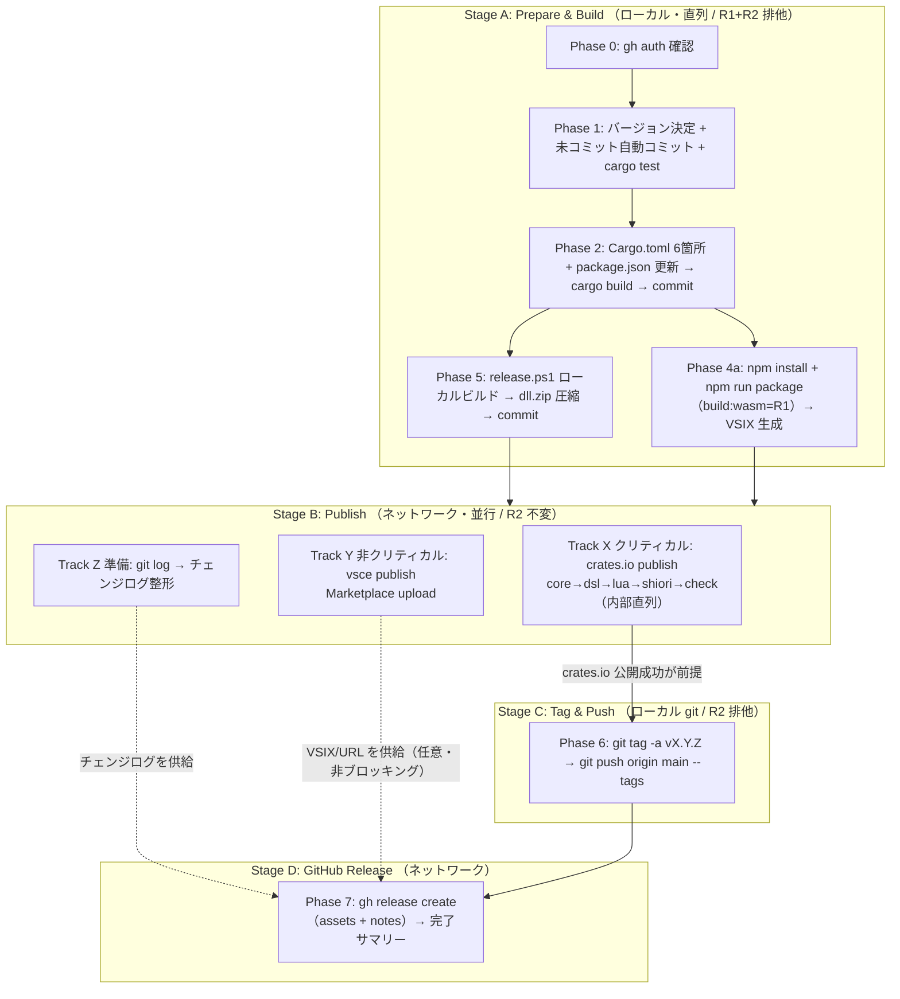
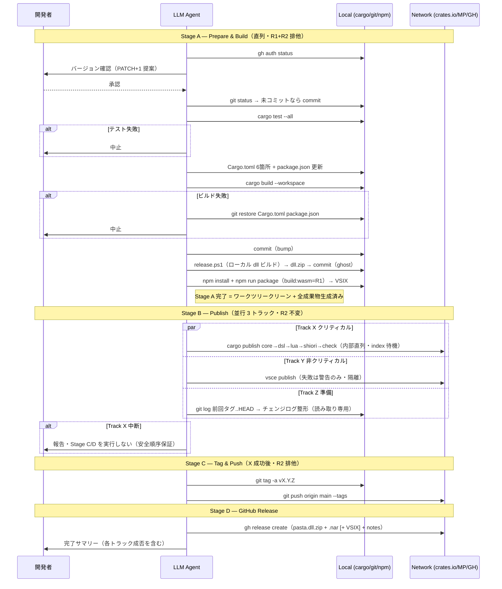
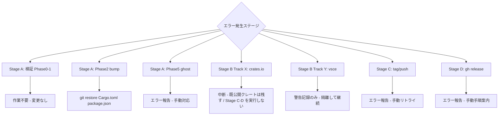

# Technical Design: release-workflow

## Overview

**Purpose**: 本設計は、pasta プロジェクトのリリース作業（crates.io 公開、VSCode Marketplace 公開、GitHub Release 作成）を、LLM エージェントが繰り返し実行するためのオペレーション設計を定義する。本書き直し版では、各処理が要求する**共有リソース**を分析し、安全に並行化できる処理を並行実行する **リソース認識型ステージ並行モデル（Resource-Aware Staged Concurrency）** を採用する。

**Users**: 開発者（ekicyou）が `/kiro-impl release-workflow` を実行するたびに、LLM エージェントが本設計に従ってリリース作業を遂行する。

**Impact**: 手動リリース手順を体系化し、全工程を一貫した品質で繰り返し実行可能にする。旧設計（単一直列 Pipeline）に対し、(a) 偽の依存関係（crates.io → ゴーストビルド）を排除し、(b) 独立した公開トラック（crates.io / Marketplace / チェンジログ）を並行化することで wall-clock を短縮し、(c) 非クリティカルな失敗を隔離する。

### Goals
- バージョン更新から GitHub Release 作成までの全工程を LLM が実行する
- 共有リソース制約（cargo ロック / git ワークツリー / ネットワーク）を尊重した安全な並行スケジューリングを行う
- 非クリティカルフェーズ（Marketplace 公開）を隔離し、独立した公開トラックを並行化する
- 不可逆な処理（crates.io 公開）の順序安全性を保証する
- 繰り返し実行可能な設計を維持する（仕様は `completed` に遷移しない）

### Non-Goals
- リリース自動化スクリプトの新規作成（LLM による対話的実行で代替）
- CI/CD パイプラインへの統合（ローカル実行前提）
- クロスプラットフォーム対応（Windows + PowerShell 環境限定）
- `cargo publish` / `vsce` 認証トークンの自動設定（手動設定を前提とする）
- pasta_lsp の独立リリース管理
- マルチマシン分散実行（単一ワークツリー・単一マシン前提）

## Boundary Commitments

### This Spec Owns
- バージョン番号の決定・検証・全ソース調査
- Cargo.toml（6箇所）および package.json のバージョン更新
- crates.io への依存関係順公開（5クレート）
- VSCode 拡張のビルド（パッケージング）と Marketplace 公開（非クリティカル）
- サンプルゴースト（hello-pasta）のビルドと成果物確認
- Git タグ作成・リモートプッシュ
- GitHub Release 作成（チェンジログ生成・アセット添付）
- **リリース作業全体の実行スケジューリング（ステージ分割・並行トラック管理）とエラーハンドリング・ロールバック**

### Out of Boundary
- pasta_lsp の crates.io 公開（`publish = true` だが本ワークフロー対象外）
- CI/CD パイプラインとの統合
- 認証トークンの設定・管理
- release.ps1 スクリプト自体の修正
- crates.io に公開済みクレートの yank 操作

### Allowed Dependencies
- External: `cargo` CLI — ビルド・テスト・公開（R1 cargo ロックを保持）(P0)
- External: `git` CLI — バージョン管理・タグ・プッシュ（R2 ワークツリーを保持）(P0)
- External: `gh` CLI — GitHub Release 作成（R3 ネットワーク）(P0)
- External: `npm` / `vsce` — VSCode 拡張ビルド・公開（build:wasm は R1、publish は R3）(P0)
- Script: `release.ps1` — サンプルゴーストビルド（内部で cargo を呼び R1 を保持）(P0)
- Infra: crates.io registry — インデックス更新待機（R3）(P1)
- Infra: VSCode Marketplace — 拡張公開（R3）(P1)

### Revalidation Triggers
- Cargo.toml の workspace 構造変更（クレート追加・削除）
- release.ps1 のインターフェース変更（パラメータ・出力パス変更）。**特にローカルビルド方式（`cargo build -p pasta_shiori`）が crates.io 依存へ変わると Req 5.9 / 8.6 の前提が崩れる**
- VSCode 拡張のビルドパイプライン変更（scripts セクション、特に `build:wasm` が R1 を要するか）
- 新しい公開対象（例: pasta_lsp）の追加
- `cargo publish` のワークツリー要件（クリーン状態／`--allow-dirty`）の前提変更

## Architecture

### Existing Architecture Analysis

本仕様はコードの新規作成・変更を伴わない**オペレーション仕様**である。既存のツール群を組み合わせて LLM が実行する。

**既存アセット**:

| アセット                      | 状態                     | 本設計での役割                 |
| ----------------------------- | ------------------------ | ------------------------------ |
| `Cargo.toml`（ルート）        | ✅ ワークスペース集中管理 | バージョン更新対象（6箇所）    |
| `editors/vscode/package.json` | ✅ バージョン同期対象     | バージョン更新対象（1箇所）    |
| `release.ps1`                 | ✅ 成熟スクリプト         | ゴーストビルド実行（ローカル） |
| `gh` CLI                      | ✅ 認証済み（ekicyou）    | GitHub Release 作成            |
| `cargo`                       | ✅ 利用可能               | テスト・ビルド・公開           |
| `git`                         | ✅ 利用可能               | バージョン管理・タグ・プッシュ |
| `npm` / `vsce`                | ✅ 利用可能               | VSCode 拡張ビルド・公開        |

**確認済みの重要事実（並行性判断の根拠）**:
- `release.ps1` は `cargo build --release --target i686-pc-windows-msvc -p pasta_shiori` で **ローカルソースから** pasta.dll をビルドする。crates.io の公開済みクレートには依存しない（→ ゴーストビルドは crates.io 公開に非依存）
- VSCode の `prepackage` は `build:wasm`（`scripts/build-wasm.ps1`、内部で cargo/wasm ビルド）を実行する → **R1 cargo ロックを保持する**
- `cargo publish` は既定で検証ビルド（R1）を行い、クリーンなワークツリー（R2）を前提とする

### 共有リソースモデル

並行スケジューリングの基礎として、各処理が要求する排他／非排他リソースを定義する（Req 8.1）。

| リソース | 種別 | 保持する処理 | 並行制約 |
| -------- | ---- | ------------ | -------- |
| **R1: cargo ターゲットロック** | 排他（単一保持） | `cargo build/test/run/publish`、VSCode `build:wasm` | 同時実行不可。cargo は自動でロック待機（ブロック）するため壊れはしないが直列化される |
| **R2: git ワークツリー＋index** | 排他（単一保持） | ファイル生成、`git add/commit/restore/tag`、`release.ps1` の成果物生成 | 同時変更は不整合・コミット競合を招く。`cargo publish` はクリーン状態を要求 |
| **R3: ネットワーク**（crates.io / Marketplace / GitHub） | 非排他（実質無制限） | `cargo publish` の upload・インデックス待機、`vsce publish`、`gh release create` | 並行実行可。待機時間（index 伝播・backoff）は重ね合わせられる |

**設計上の帰結**:
- R1・R2 を共有する処理（＝全ローカルビルド）は**真の並行実行ができない**。よって全ローカルビルドとコミットを 1 つの直列ステージ（Stage A）に集約し、**ワークツリーをクリーン化してから** crates.io 公開を始める（Req 8.2）。
- crates.io 公開（R3 + 検証ビルド R1）・Marketplace 公開（R3 のみ）・チェンジログ生成（読み取り専用）はワークツリーを変更しないため、Stage B として**並行実行できる**（Req 8.3）。`vsce publish` と `gh` は R1 を必要とせず、crates.io 公開の長いインデックス待機に重ねられる。

### Architecture Pattern & Boundary Map

**選択パターン**: Resource-Aware Staged Concurrency — リソース制約に基づき処理を 4 ステージに分割。ステージ内で安全な処理は並行トラックとして実行する。

- **Stage A — Prepare & Build（ローカル・直列、R1+R2 排他）**: 検証 → バージョン更新 → ゴーストビルド → VSCode パッケージング。終了時ワークツリーはクリーン。
- **Stage B — Publish（ネットワーク・並行、R2 不変）**: 3 トラックを並行実行。
  - Track X（クリティカル）: crates.io 公開（依存関係順に内部直列）
  - Track Y（非クリティカル）: Marketplace 公開（VSIX upload）
  - Track Z（準備・読み取り専用）: チェンジログ生成
- **Stage C — Tag & Push（ローカル git、R2 排他）**: Track X 成功後にタグ作成＋プッシュ。
- **Stage D — GitHub Release（ネットワーク）**: タグプッシュ後、アセット＋チェンジログで Release 作成。


```mermaid
graph TB
    subgraph StageA ["Stage A: Prepare & Build （ローカル・直列 / R1+R2 排他）"]
        A0[Phase 0: gh auth 確認]
        A1[Phase 1: バージョン決定 + 未コミット自動コミット + cargo test]
        A2[Phase 2: Cargo.toml 6箇所 + package.json 更新 → cargo build → commit]
        A3[Phase 5: release.ps1 ローカルビルド → dll.zip 圧縮 → commit]
        A4[Phase 4a: npm install + npm run package（build:wasm=R1）→ VSIX 生成]
        A0 --> A1 --> A2
        A2 --> A3
        A2 --> A4
    end

    subgraph StageB ["Stage B: Publish （ネットワーク・並行 / R2 不変）"]
        BX[Track X クリティカル: crates.io publish<br/>core→dsl→lua→shiori→check（内部直列）]
        BY[Track Y 非クリティカル: vsce publish<br/>Marketplace upload]
        BZ[Track Z 準備: git log → チェンジログ整形]
    end

    subgraph StageC ["Stage C: Tag & Push （ローカル git / R2 排他）"]
        C1[Phase 6: git tag -a vX.Y.Z → git push origin main --tags]
    end

    subgraph StageD ["Stage D: GitHub Release （ネットワーク）"]
        D1[Phase 7: gh release create（assets + notes）→ 完了サマリー]
    end

    A3 --> StageB
    A4 --> StageB
    BX -->|crates.io 公開成功が前提| C1
    BZ -.->|チェンジログを供給| D1
    BY -.->|VSIX/URL を供給（任意・非ブロッキング）| D1
    C1 --> D1
```

**ドメイン境界・スケジューリング規則**:
- Stage A は完全直列（R1+R2 排他）。Stage A 完了＝ワークツリークリーン＋全成果物（pasta.dll.zip / hello-pasta.nar / VSIX）生成済み。
- Stage B の 3 トラックは並行。Track Y（非クリティカル）の失敗は隔離され、X・C・D を妨げない（Req 8.4）。Track Z は読み取り専用で副作用なし。
- **安全順序保証（Req 8.5）**: 不可逆な Track X（crates.io）が成功するまで Stage C（タグ・プッシュ）へ進まない。X が中断したら C・D は実行しない。Stage C 到達時点では git 上に未プッシュのローカルコミットしか存在しないため、X 失敗時のロールバック負担は最小。
- Track Y の成否は GitHub Release（Stage D）の VSIX 添付に影響するのみで、ブロッキングしない。

**Steering 準拠**:
- workflow.md「危険な Git 操作の禁止」に準拠（`git reset --hard` / `git revert` / `git checkout -- ` / `git clean -fd` は使用しない。ロールバックは `git restore <file>` のファイル単位のみ）
- workflow.md「リモート同期」に準拠（main ブランチは直接 push）
- tech.md のセマンティックバージョニング、Conventional Commits 規約に準拠

### Technology Stack

| Layer   | Choice / Version           | Role in Feature                          | Resource | Notes                                 |
| ------- | -------------------------- | ---------------------------------------- | -------- | ------------------------------------- |
| CLI     | `cargo` (Rust toolchain)   | テスト・ビルド・crates.io 公開           | R1+R3    | `cargo publish -p <crate>`            |
| CLI     | `git`                      | バージョン管理・タグ・プッシュ           | R2(+R3)  | アノテーションタグ使用                |
| CLI     | `gh` (GitHub CLI)          | GitHub Release 作成・アセット添付        | R3       | 認証済み（ekicyou）                   |
| CLI     | `npm` / `vsce`             | VSCode 拡張ビルド・公開                  | R1(build)/R3(publish) | `@vscode/vsce ^3.0.0`     |
| Script  | `release.ps1` (PowerShell) | x86 DLL ビルド + .nar 生成               | R1+R2    | 既存成熟スクリプト・ローカルビルド    |
| Editor  | LLM エディタツール         | Cargo.toml / package.json バージョン編集 | R2       | `replace_string_in_file`              |
| Runtime | Windows + PowerShell       | 実行環境                                 | —        | `i686-pc-windows-msvc` ターゲット必須 |

## File Structure Plan

本仕様はオペレーション仕様であり、コードの新規作成を伴わない。以下はリリース作業中に変更されるファイル一覧である。

| ファイル                                            | 変更内容                                                                        | Stage   |
| --------------------------------------------------- | ------------------------------------------------------------------------------- | ------- |
| `Cargo.toml`                                        | `[workspace.package].version` + 5クレートの `version` フィールド更新（計6箇所） | A (P2)  |
| `editors/vscode/package.json`                       | `version` フィールド更新                                                        | A (P2)  |
| `release/hello-pasta.nar`                           | release.ps1 による再生成                                                        | A (P5)  |
| `target/i686-pc-windows-msvc/release/pasta.dll`     | release.ps1 によるビルド                                                        | A (P5)  |
| `target/i686-pc-windows-msvc/release/pasta.dll.zip` | DLL の zip 圧縮                                                                 | A (P5)  |
| `editors/vscode/pasta-vscode-X.Y.Z.vsix`            | npm run package による生成                                                      | A (P4a) |
| `release-notes-vX.Y.Z.md`                           | 一時ファイル（Stage D 完了後削除）                                              | B (Z)   |

## System Flows

### メインリリースフロー（ステージ並行モデル）


```mermaid
sequenceDiagram
    participant Dev as 開発者
    participant LLM as LLM Agent
    participant Local as Local (cargo/git/npm)
    participant Net as Network (crates.io/MP/GH)

    Note over Dev,Net: Stage A — Prepare & Build（直列・R1+R2 排他）
    LLM->>Local: gh auth status
    LLM->>Dev: バージョン確認（PATCH+1 提案）
    Dev-->>LLM: 承認
    LLM->>Local: git status → 未コミットなら commit
    LLM->>Local: cargo test --all
    alt テスト失敗
        LLM->>Dev: 中止
    end
    LLM->>Local: Cargo.toml 6箇所 + package.json 更新
    LLM->>Local: cargo build --workspace
    alt ビルド失敗
        LLM->>Local: git restore Cargo.toml package.json
        LLM->>Dev: 中止
    end
    LLM->>Local: commit（bump）
    LLM->>Local: release.ps1（ローカル dll ビルド）→ dll.zip → commit（ghost）
    LLM->>Local: npm install + npm run package（build:wasm=R1）→ VSIX
    Note right of LLM: Stage A 完了 = ワークツリークリーン + 全成果物生成済み

    Note over Dev,Net: Stage B — Publish（並行 3 トラック・R2 不変）
    par Track X クリティカル
        LLM->>Net: cargo publish core→dsl→lua→shiori→check（内部直列・index 待機）
    and Track Y 非クリティカル
        LLM->>Net: vsce publish（失敗は警告のみ・隔離）
    and Track Z 準備
        LLM->>Local: git log 前回タグ..HEAD → チェンジログ整形（読み取り専用）
    end
    alt Track X 中断
        LLM->>Dev: 報告・Stage C/D を実行しない（安全順序保証）
    end

    Note over Dev,Net: Stage C — Tag & Push（X 成功後・R2 排他）
    LLM->>Local: git tag -a vX.Y.Z
    LLM->>Net: git push origin main --tags

    Note over Dev,Net: Stage D — GitHub Release
    LLM->>Net: gh release create（pasta.dll.zip + .nar [+ VSIX] + notes）
    LLM->>Dev: 完了サマリー（各トラック成否を含む）
```

### Stage B 並行トラックの実行ノート

- **オーケストレーション**: LLM エージェントは Track X（crates.io 公開、長いインデックス待機を含む）を主軸に進めつつ、その待機時間に Track Y（vsce publish）と Track Z（チェンジログ整形）を重ねる。バックグラウンド実行が可能な環境では `run_in_background` で Track Y を起動し、Track X 進行中にポーリングせず完了通知で回収する。逐次環境では「X の各 index 待機の間に Y/Z の 1 ステップを進める」インターリーブで近似する。
- **失敗隔離（Req 8.4）**: Track Y の失敗・タイムアウトは警告として記録し、Stage C/D を妨げない。VSIX が未生成・未公開でも Stage D は dll.zip と .nar のみで Release を作成する。
- **同期点**: Stage C は Track X の成功のみを待つ。Stage D は Stage C 完了＋Track Z 完了を待ち、Track Y は「間に合っていれば VSIX/URL を反映」する非ブロッキング依存とする。

### 共通リトライ戦略（段階的バックオフ）

外部サービス通信（`cargo publish`, `vsce publish`, `git push`, `gh release create`）はネットワーク一時障害に対し段階的バックオフを適用する:

```
待機時間系列: 1分 → 2分 → 3分 → ... → 10分
最大試行回数: 初回 + リトライ10回 = 合計11回（最大累計待機 55分）
```

**手順**: コマンド実行 → 失敗時 N=1 分から `Start-Sleep -Seconds (N*60)` 後にリトライ → 失敗ごとに N を 1 ずつ増加 → N=10 でも失敗なら中断（クリティカル）または警告継続（非クリティカル）。

**適用とクリティカル度**:
- Track X: `cargo publish` — **クリティカル**（失敗時は以降の公開を中断し Stage C/D を実行しない）
- Track Y: `vsce publish` — **非クリティカル**（失敗時は警告のみで後続継続）
- Stage C: `git push` — **クリティカル**（失敗時は手動対応を案内）
- Stage D: `gh release create` — **クリティカル**（失敗時は手動手順を案内）

### エラー時ロールバックフロー


```mermaid
flowchart TD
    A{エラー発生ステージ} --> B[Stage A: 検証 Phase0-1]
    A --> C[Stage A: Phase2 bump]
    A --> P5[Stage A: Phase5 ghost]
    A --> X[Stage B Track X: crates.io]
    A --> Y[Stage B Track Y: vsce]
    A --> CC[Stage C: tag/push]
    A --> D[Stage D: gh release]

    B --> B1[作業不要 - 変更なし]
    C --> C1[git restore Cargo.toml package.json]
    P5 --> P51[エラー報告 - 手動対応]
    X --> X1[中断 - 既公開クレートは残す / Stage C-D を実行しない]
    Y --> Y1[警告記録のみ - 隔離して継続]
    CC --> CC1[エラー報告 - 手動リトライ]
    D --> D1[エラー報告 - 手動手順案内]
```

## Requirements Traceability

| Requirement | Summary                                       | Stage / Component | Flows                          |
| ----------- | --------------------------------------------- | ----------------- | ------------------------------ |
| 1.1–1.7     | バージョン決定・semver・重複チェック          | A / Phase 1       | メインフロー: Stage A          |
| 1.8–1.9     | 未コミット変更の自動コミット                  | A / Phase 1       | メインフロー: Stage A          |
| 1.10–1.11   | cargo test 実行・失敗時中止                   | A / Phase 1       | エラーフロー: Stage A 検証     |
| 2.1–2.3     | Cargo.toml 6箇所 + package.json 更新          | A / Phase 2       | メインフロー: Stage A          |
| 2.4–2.5     | cargo build 検証・失敗時 git restore          | A / Phase 2       | エラーフロー: Stage A Phase2   |
| 2.6         | バージョン更新コミット                        | A / Phase 2       | メインフロー: Stage A          |
| 3.1–3.2     | 依存関係順 publish・成功確認後に次             | B / Track X       | メインフロー: Stage B Track X  |
| 3.3–3.4     | 段階的リトライ・失敗時中断                     | B / Track X       | 共通リトライ戦略               |
| 3.5         | pasta_sample_ghost スキップ                   | B / Track X       | メインフロー: Stage B Track X  |
| 3.6         | crates.io インデックス待機                    | B / Track X       | メインフロー: Stage B Track X  |
| 4.1–4.2     | VSCode 拡張ビルド・VSIX 生成確認              | A / Phase 4a      | メインフロー: Stage A          |
| 4.3–4.4     | Marketplace 公開・リトライ                    | B / Track Y       | メインフロー: Stage B Track Y  |
| 4.5–4.6     | 公開／ビルド失敗→警告・継続（隔離）           | B / Track Y       | エラーフロー: Track Y          |
| 4.7         | Marketplace 成功時 URL 記録                   | B / Track Y       | メインフロー: Stage B Track Y  |
| 5.1–5.4     | release.ps1 実行・成果物確認・失敗時中断      | A / Phase 5       | メインフロー: Stage A          |
| 5.5–5.7     | DLL zip 圧縮・存在確認・失敗時中断            | A / Phase 5       | メインフロー: Stage A          |
| 5.8         | ゴーストビルドコミット                        | A / Phase 5       | メインフロー: Stage A          |
| 5.9         | ゴーストビルドは crates.io 非依存             | A / Phase 5       | 共有リソースモデル             |
| 6.1–6.2     | アノテーションタグ作成・メッセージ            | C / Phase 6       | メインフロー: Stage C          |
| 6.3         | 既存タグ競合時エラー                          | C / Phase 6       | エラーフロー: Stage C          |
| 6.4–6.5     | push・失敗時手動対応案内                      | C / Phase 6       | メインフロー: Stage C          |
| 7.1–7.3     | git log 取得・分類・整形                      | B / Track Z       | メインフロー: Stage B Track Z  |
| 7.4–7.7     | Release 作成・アセット添付（VSIX 任意）       | D / Phase 7       | メインフロー: Stage D          |
| 7.8         | gh 失敗時手動手順案内                         | D / Phase 7       | エラーフロー: Stage D          |
| 7.9         | 初回リリース時の全履歴使用                    | B / Track Z       | メインフロー: Stage B Track Z  |
| 8.1         | リソース分類とスケジューリング                | 全 Stage          | 共有リソースモデル             |
| 8.2         | ローカルビルド完了→ワークツリークリーン化後 publish | A → B        | スケジューリング規則           |
| 8.3         | 公開トラックの並行実行                        | B / X∥Y∥Z         | Stage B 並行トラック           |
| 8.4         | 非クリティカル失敗の隔離                      | B / Track Y       | 失敗隔離                       |
| 8.5         | 不可逆処理の順序安全性                        | B Track X → C/D   | 安全順序保証                   |
| 8.6         | 偽の依存関係の排除                            | A / Phase 5       | 共有リソースモデル             |
| 8.7         | 各並行トラックの完了検証                      | B → D             | Stage B 同期点                 |
| 9.1–9.3     | 繰り返し実行・状態初期化                      | —                 | 繰り返し実行の仕様特性         |
| 9.4         | 完了サマリー報告                              | D / Phase 7       | メインフロー: Stage D          |

## Components and Interfaces

| Component              | Stage | Intent                                   | Req Coverage    | Key Dependencies (Resource)                          | Critical? |
| ---------------------- | ----- | ---------------------------------------- | --------------- | ---------------------------------------------------- | --------- |
| Phase 0: Prerequisites | A     | gh 認証確認                              | —（暗黙的前提） | gh auth (R3)                                         | yes       |
| Phase 1: Validation    | A     | バージョン決定と事前検証                 | 1.1–1.11        | Cargo.toml (R2), cargo test (R1), git (R2)           | yes       |
| Phase 2: VersionBump   | A     | Cargo.toml + package.json 更新           | 2.1–2.6         | Cargo.toml/package.json (R2), cargo build (R1)       | yes       |
| Phase 5: GhostBuild    | A     | サンプルゴーストビルド（ローカル）       | 5.1–5.9         | release.ps1 (R1+R2), i686 target                     | yes       |
| Phase 4a: VsixPackage  | A     | VSCode 拡張ビルド・VSIX 生成             | 4.1, 4.2, 4.6   | npm/build:wasm (R1+R2)                               | no        |
| Track X: CratesPublish | B     | crates.io 公開（内部直列）               | 3.1–3.6         | cargo publish (R1+R3), crates.io index (R3)          | yes       |
| Track Y: VsixPublish   | B     | Marketplace 公開                         | 4.3–4.5, 4.7    | vsce (R3)                                            | no        |
| Track Z: Changelog     | B     | チェンジログ生成（読み取り専用）         | 7.1–7.3, 7.9    | git log (read-only)                                  | no        |
| Phase 6: TagPush       | C     | タグ作成とプッシュ                       | 6.1–6.5         | git (R2+R3), GitHub remote (R3)                      | yes       |
| Phase 7: Release       | D     | GitHub Release 作成                      | 7.4–7.8, 9.4    | gh CLI (R3)                                          | yes       |

### Stage A — Prepare & Build（ローカル・直列）

#### Phase 0: Prerequisites

| Field        | Detail                          |
| ------------ | ------------------------------- |
| Intent       | GitHub CLI の認証状態を確認する |
| Requirements | — （暗黙的前提条件）            |

**実行手順**
1. `gh auth status` — 認証済みなら続行。未認証なら「`gh auth login` を実行してください」とガイダンス。

**Note**: `cargo publish` の認証は環境変数 `CARGO_REGISTRY_TOKEN`、`vsce` は `VSCE_PAT` で有効なためチェック不要。

#### Phase 1: Validation

| Field        | Detail                                                             |
| ------------ | ------------------------------------------------------------------ |
| Intent       | リリースバージョンを決定し、ワークツリーとテストの健全性を検証する |
| Requirements | 1.1–1.11                                                           |

**実行手順**

1. **バージョン決定** (1.1–1.7):
   - 開発者指定があればそれを使用 (1.1)。なければ全ソース調査:
     - `Cargo.toml` の `[workspace.package].version`
     - `editors/vscode/package.json` の `version`
     - `git tag -l "v*"` の最新
     - crates.io / GitHub Releases / Marketplace の最新（参考）
   - 最大バージョンの PATCH を +1 して提案 (1.2)、開発者承認を求める (1.3)
   - 拒否時は希望バージョン入力を求める (1.4)、semver 検証 `^[0-9]+\.[0-9]+\.[0-9]+$` (1.5, 1.6)
   - 重複チェック: 全ソースに同一バージョンが無いことを確認 (1.7)
2. **ワークツリー整理** (1.8, 1.9): `git status --porcelain` が空でなければ `git add -A; git commit -m "chore(release): prepare release vX.Y.Z"`
3. **テスト実行** (1.10, 1.11): `cargo test --all` — 失敗時は中止

#### Phase 2: VersionBump

| Field        | Detail                                                                   |
| ------------ | ------------------------------------------------------------------------ |
| Intent       | ワークスペース全体のバージョンを一括更新し、ビルド検証する               |
| Requirements | 2.1–2.6                                                                  |

**実行手順**

1. **Cargo.toml 更新（6箇所）** (2.1, 2.2): `[workspace.package].version` および `[workspace.dependencies]` の `pasta_core` / `pasta_dsl` / `pasta_lua` / `pasta_shiori` / `pasta_check` の `version` を新バージョンへ
2. **package.json 更新** (2.3): `editors/vscode/package.json` の `"version"`
3. **ビルド検証** (2.4): `cargo build --workspace`
4. **エラーハンドリング** (2.5): 失敗時 `git restore Cargo.toml editors/vscode/package.json`（危険操作禁止に準拠したファイル単位復元）→ 中止
5. **コミット** (2.6): `git add Cargo.toml editors/vscode/package.json; git commit -m "chore(release): bump version to vX.Y.Z"`

#### Phase 5: GhostBuild

| Field        | Detail                                                                                 |
| ------------ | -------------------------------------------------------------------------------------- |
| Intent       | x86 リリースビルドの pasta.dll と hello-pasta.nar を生成し pasta.dll.zip に圧縮する     |
| Requirements | 5.1–5.9                                                                                |

**Responsibilities & Constraints**
- `release.ps1` を `crates/pasta_sample_ghost/` で実行（内部で `cargo build -p pasta_shiori` 等のローカルビルドを行う）
- **crates.io 公開に依存しない**（5.9, 8.6）。バージョン更新コミット（Phase 2）にのみ依存する
- 成果物（`release/hello-pasta.nar`, `target/i686-pc-windows-msvc/release/pasta.dll`）の存在確認
- `pasta.dll` を `pasta.dll.zip` に圧縮（`Compress-Archive -Force`）

**実行手順**
1. **ビルド** (5.1): `Push-Location crates/pasta_sample_ghost; PowerShell -ExecutionPolicy Bypass -File release.ps1; Pop-Location`
2. **成果物確認** (5.2–5.4): `Test-Path release/hello-pasta.nar` と `Test-Path target/i686-pc-windows-msvc/release/pasta.dll`。いずれか False なら中断
3. **zip 圧縮** (5.5–5.7): `Compress-Archive -Path .../pasta.dll -DestinationPath .../pasta.dll.zip -Force` → `Test-Path` 確認。失敗時中断
4. **コミット** (5.8): `git add -A; git commit -m "chore(release): build hello-pasta vX.Y.Z"`

#### Phase 4a: VsixPackage（非クリティカル）

| Field        | Detail                                               |
| ------------ | ---------------------------------------------------- |
| Intent       | VSCode 拡張をビルドして VSIX を生成する（R1 を要する）|
| Requirements | 4.1, 4.2, 4.6                                        |

**Responsibilities & Constraints**
- `npm run package` は `prepackage`（`build:wasm` = cargo/wasm ビルド、R1）→ `vsce package` を実行するため**ローカルビルドステージ（Stage A）に配置**する
- 失敗時は警告を記録し継続（Stage B 以降を妨げない）。生成 VSIX パスを `$env:VSIX_PATH` に保持

**実行手順**
1. `cd editors/vscode; npm install`（失敗→警告・継続）
2. `npm run package`（失敗→警告・継続）→ 生成物 `pasta-vscode-X.Y.Z.vsix`
3. `$env:VSIX_PATH = "editors/vscode/pasta-vscode-X.Y.Z.vsix"`

> **配置の根拠**: `build:wasm` が R1（cargo ロック）を保持するため、crates.io 公開（Track X の検証ビルドも R1）やゴーストビルドと真の並行ができない。よってビルドは Stage A で直列実施し、R3 のみの **publish（upload）部分のみ Stage B Track Y へ分離**する。

### Stage B — Publish（ネットワーク・並行 3 トラック）

> Stage A 完了（ワークツリークリーン、全成果物生成済み）が Stage B 開始の前提条件（8.2）。3 トラックは R2 を変更しないため並行実行可能（8.3）。

#### Track X: CratesPublish（クリティカル）

| Field        | Detail                                       |
| ------------ | -------------------------------------------- |
| Intent       | 依存関係順に5クレートを crates.io へ公開する |
| Requirements | 3.1–3.6                                      |

**Responsibilities & Constraints**
- 順序固定: `pasta_core` → `pasta_dsl` → `pasta_lua` → `pasta_shiori` → `pasta_check`（pasta_check は他 pasta_* に非依存のバイナリ、最後）
- `pasta_sample_ghost`（`publish = false`）はスキップ (3.5)
- 各公開後 `Start-Sleep -Seconds 10`（インデックス更新待機、最後のクレートは不要）(3.6)
- 失敗時は段階的バックオフ。最大リトライ後も失敗なら**中断**し、既公開クレートは残す。**Stage C/D は実行しない**（安全順序保証 8.5） (3.3, 3.4)

#### Track Y: VsixPublish（非クリティカル）

| Field        | Detail                                               |
| ------------ | ---------------------------------------------------- |
| Intent       | 生成済み VSIX を Marketplace へ公開する（R3 のみ）    |
| Requirements | 4.3, 4.4, 4.5, 4.7                                   |

**Responsibilities & Constraints**
- Track X と並行実行可能（R1 不要・R2 不変）。Track X の index 待機に重ねることで wall-clock を短縮
- `vsce publish` 失敗時は段階的バックオフ → 最大リトライ後も失敗なら**警告記録のみで継続**（失敗隔離 8.4）
- 成功時は Marketplace URL を記録 (4.7)

#### Track Z: Changelog（準備・読み取り専用）

| Field        | Detail                                       |
| ------------ | -------------------------------------------- |
| Intent       | git log からチェンジログを整形する           |
| Requirements | 7.1, 7.2, 7.3, 7.9                           |

**実行手順**
1. **履歴取得** (7.1, 7.9): `git tag -l "v*" --sort=-version:refname` で前回タグ特定。前回タグありなら `git log <前回タグ>..HEAD --oneline --no-merges`、なければ（初回）`git log --oneline --no-merges`。HEAD = Phase 5 のゴーストビルドコミット（タグ前でも内容は確定）
2. **整形** (7.2, 7.3): Conventional Commits で分類

   | Prefix | 見出し | | Prefix | 見出し |
   | --- | --- | --- | --- | --- |
   | `feat` | ✨ Features | | `docs` | 📝 Documentation |
   | `fix` | 🐛 Bug Fixes | | `test` | 🧪 Tests |
   | `refactor` | ♻️ Refactoring | | `chore` | 🔧 Maintenance |

   **除外**: スコープ `spec` のコミット（`chore(spec):`, `docs(spec):` 等）。空グループは見出しごと省略。
3. **一時ファイル書き出し**: `release-notes-vX.Y.Z.md`

   ```markdown
   ## What's Changed

   ### ✨ Features
   - サマリー (@author)
   ...
   **Full Changelog**: https://github.com/ekicyou/pasta/compare/<前回タグ>...vX.Y.Z
   ```

### Stage C — Tag & Push

#### Phase 6: TagPush

| Field        | Detail                                                  |
| ------------ | ------------------------------------------------------- |
| Intent       | リリースポイントを Git タグで記録しリモートに反映する   |
| Requirements | 6.1–6.5                                                 |

**Responsibilities & Constraints**
- **前提**: Track X（crates.io 公開）が成功していること（8.5）
- アノテーションタグ（`-a`）を使用。既存タグ競合時は自動削除せず開発者に確認 (6.3)

**実行手順**
1. **既存タグ確認** (6.3): `git tag -l "vX.Y.Z"` — 出力ありなら「既存タグ削除が必要です。手動で対応しますか？」と確認
2. **タグ作成** (6.1, 6.2): `git tag -a vX.Y.Z -m "Release vX.Y.Z"`
3. **プッシュ** (6.4, 6.5): `git push origin main --tags`（main 直接 push、workflow.md 準拠）。失敗時は段階的バックオフ → 「手動で再実行してください」と案内

### Stage D — GitHub Release

#### Phase 7: Release

| Field        | Detail                                                             |
| ------------ | ------------------------------------------------------------------ |
| Intent       | チェンジログ付きの GitHub Release を作成しアセットを添付する        |
| Requirements | 7.4–7.8, 9.4                                                       |

**Responsibilities & Constraints**
- **前提**: Stage C 完了＋Track Z 完了。Track Y は非ブロッキング（VSIX が間に合えば添付、なければ dll.zip + .nar のみ）

**実行手順**
1. **Release 作成** (7.4–7.7):
   ```powershell
   $assets = @(
     "target/i686-pc-windows-msvc/release/pasta.dll.zip",
     "release/hello-pasta.nar"
   )
   if ($env:VSIX_PATH -and (Test-Path $env:VSIX_PATH)) { $assets += $env:VSIX_PATH }
   gh release create vX.Y.Z $assets --title "pasta vX.Y.Z" --notes-file release-notes-vX.Y.Z.md
   ```
2. **一時ファイル削除**: `Remove-Item release-notes-vX.Y.Z.md`
3. **エラーハンドリング** (7.8): 失敗時はエラー報告し手動 `gh release create ...` 手順を案内
4. **完了サマリー** (9.4):
   - バージョン: `vX.Y.Z`
   - 公開クレート: `pasta_core`, `pasta_dsl`, `pasta_lua`, `pasta_shiori`, `pasta_check`
   - Release URL: `https://github.com/ekicyou/pasta/releases/tag/vX.Y.Z`
   - Marketplace（Track Y）: 公開成功 URL or 警告
   - 各並行トラックの成否（X / Y / Z）

## Error Handling

### Error Strategy

各ステージはゲート方式で制御される。Stage A の失敗はその場で停止（ローカルのみ、対外影響なし）。Stage B Track X の失敗は Stage C/D をブロックする（安全順序保証）。Track Y の失敗は隔離される。

### Error Categories and Responses

| ステージ            | エラー種別         | 対応                                          | ロールバック                   |
| ------------------- | ------------------ | --------------------------------------------- | ------------------------------ |
| A / Phase 0         | gh 認証未設定      | ガイダンス提示 → 設定待ち                     | 不要                           |
| A / Phase 1         | テスト失敗         | エラー報告・中止                              | 不要（変更なし）               |
| A / Phase 2         | ビルド失敗         | `git restore Cargo.toml editors/vscode/package.json` | Cargo.toml + package.json 復元 |
| A / Phase 5         | release.ps1 失敗   | エラー報告・中断                              | 手動対応                       |
| A / Phase 4a        | npm/package 失敗   | 警告記録・継続                                | 不要（非クリティカル）         |
| B / Track X         | cargo publish 失敗 | バックオフ → 中断（Stage C/D 不実行）         | 既公開クレートは残す           |
| B / Track Y         | vsce publish 失敗  | 警告記録・隔離継続                            | 不要（非クリティカル）         |
| C / Phase 6         | タグ競合 / push 失敗 | 開発者確認 / 手動リトライ案内                | 手動対応                       |
| D / Phase 7         | gh 失敗            | 手動手順案内                                  | 手動実行                       |

### セッション中断からの復旧

LLM セッションが途中で切断された場合の復旧:

1. `git log --oneline -5` で最後のコミットを確認
2. コミットメッセージから進捗を判断:
   - `chore(release): prepare release vX.Y.Z` → Phase 1 完了
   - `chore(release): bump version to vX.Y.Z` → Phase 2 完了
   - `chore(release): build hello-pasta vX.Y.Z` → Phase 5 完了（= Stage A 完了）
   - タグ `vX.Y.Z` の有無 → Stage C 完了判定
   - `gh release view vX.Y.Z` → Stage D 完了判定
   - crates.io の各クレートページ → Track X の進捗判定（どこまで公開済みか）
3. 完了済みステージ／トラックをスキップして再開。**Track X が一部公開済みの場合、公開済みクレートは再公開せず未公開分から再開**

## Testing Strategy

本仕様はオペレーション仕様であり自動テストの対象外。品質は以下で担保:

- **Phase 1**: `cargo test --all` による全テスト通過
- **Phase 2**: `cargo build --workspace` によるビルド検証
- **Phase 5**: `release.ps1` による成果物生成と存在確認
- **Stage D**: GitHub Release の作成成功確認

### 手動検証項目

| 確認項目                                | 確認方法                                   | タイミング         |
| --------------------------------------- | ------------------------------------------ | ------------------ |
| crates.io にクレートが公開されたか      | https://crates.io/crates/pasta_core を確認 | Track X 完了後     |
| Marketplace に拡張が公開されたか        | Marketplace ページで確認                   | Track Y 完了後     |
| GitHub Release にアセットが添付されたか | Release ページで確認                       | Stage D 完了後     |
| .nar ファイルが正常か                   | areka で読み込みテスト                     | リリース後（任意） |

## 繰り返し実行の仕様特性

本仕様は Requirement 9 に基づく特殊な運用モデルを持つ:

- `/kiro-impl release-workflow` 実行のたびに全タスク状態が初期化される (9.1)
- `spec.json` の `phase` は `completed` に遷移せず `ready_for_implementation` を維持 (9.2)
- 各実行は前回に依存しない独立作業として動作 (9.3)
- 完了時にサマリー（各並行トラックの成否を含む）を報告 (9.4)
