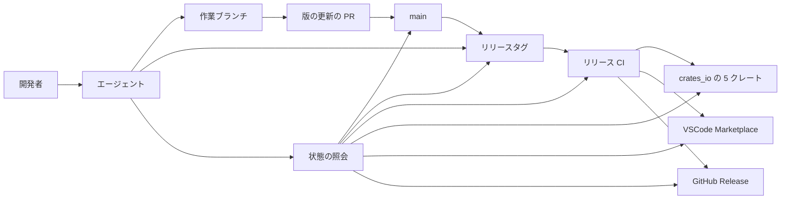
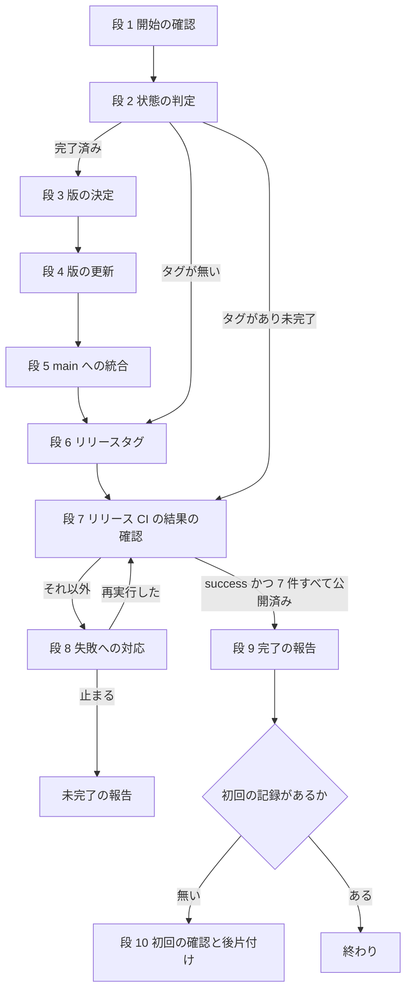
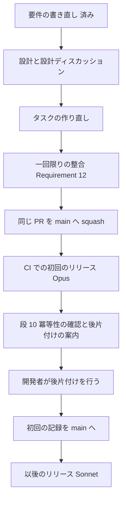

# Technical Design: release-workflow

## Overview

**Purpose**: 本設計は、pasta のリリース手順を、エージェントが開発者の指示のもとで繰り返し実行できる形に定める。エージェントは版を決め、版を上げたコミットを PR で main に入れ、リリースタグを push し、リリース CI の結果を確かめる。検査・ビルド・公開はリリース CI（`.github/workflows/release.yml`）が行う。

**Users**: 開発者は `/kiro-impl release-workflow` を実行し、版の承認と、人の判断が要る失敗の対応だけを行う。エージェントは本設計の段（段 1〜10）を順にたどる。

**Impact**: 手元でビルドして公開し、成果物をコミットする旧手順（Stage A〜D・公開の 2 トラック・Resume・スケジュールによる再試行・マージコミット方式）をやめる。手元で行うのは版の表記の更新だけになる。

**実行するモデルの前提**（開発者の方針 2026-10-10）: CI での初回のリリースは Opus で実行し、実行が安定したら Sonnet で実行する。そのため本設計は、段ごとに実行するコマンド・合否の基準・判定表を明記する。判定表に無い状態に当たったら、推測で進めずに止まって報告する。

設計の時点で入力だけでは決めきれなかった点は、本文に **【仮定】** と書き、末尾の「Open Questions（設計ディスカッションへの申し送り）」にまとめた。

### Goals

- 手順を「版の決定 → 版の更新の PR → リリースタグの push → リリース CI の結果の確認と再実行」に縮め、各段のコマンドと合否の基準を固定する。
- 再開の位置と失敗への対応を、実際の状態（main・リモートのタグ・公開先・リリース CI の実行）から判定表で決める。
- 版の更新で、6 種類の表記（5 ファイル）だけを変え、外部の依存の版を動かさない。
- 一部だけ公開された状態を「完了」と報告しない。
- CI での初回のリリースで、再実行の冪等性と認証の期限に対する余裕を確かめ、後片付けを案内して記録する。
- 文書と設定（`.claude/settings.json`・steering・`RELEASE.md`・認証の失敗の案内文）を、書き換えた手順に 1 度だけ合わせる。

### Non-Goals

- 公開前の検査、配布物のビルド、crates.io・Marketplace への公開、GitHub Release の作成、リリースノートの生成（リリース CI が行う）。
- `release.yml`・`.github/scripts/release/`・`release.ps1` の機能の変更（Requirement 12.5 の案内文の 3 か所だけを直す）。
- `build.yml` の変更（`--locked` を足さない。理由は「段 4」）。
- 失敗の原因になったコードやワークフロー定義の修正（別の PR で行う）。
- 公開先の画面で行う設定と、認証情報の失効の実施（開発者が行う）。
- プレリリースの版、pasta_lsp の独立リリース、新しいクレートの初回公開。
- 補助スクリプトの新設（定型コマンドは本書に置く。Open Questions 2）。

## Boundary Commitments

### This Spec Owns

- リリースの手順: 段 1〜10 の順序・コマンド・合否の基準・判定表（開始時の状態 → 再開の位置、リリース CI の結果 → 次の手）。
- `/kiro-impl release-workflow` での実行の約束（タスクの進め方・コミットしてよいもの・止まり方）。
- 版の更新の対象（5 ファイル）と、その更新・確認の方法。
- 版の更新の PR の題名・コミットの件名 `chore(release): vX.Y.Z`（再開の判定と、タグを付けるコミットの特定に使う）。
- 完了・未完了の報告の形。
- 初回の CI リリースの記録 `.kiro/specs/release-workflow/first-ci-release.md`。
- 一回限りの整合（Requirement 12）の変更の一覧と、行う場所・順。

### Out of Boundary

- リリース CI の job 構成・status 契約・公開済みの判定・再試行（`release-ci` の成果物。本仕様は読むだけ）。
- 一回限りのセットアップの内容（`.github/release-ci-setup.md` が正）。
- main のブランチ保護、GitHub environment、公開先の設定。
- マニュアルの公開（main への統合を契機に `manual.yml` が行う）。
- `kiro-impl`・`kiro-complete` などスキル本体の変更。
- リリースの実行中に `release.ps1`・`release.yml` を触る変更を main に入れないこと（開発者の運用）。

### Allowed Dependencies

- `git`（2.38 以上。`merge-tree --write-tree` を使う）、`gh`（認証済み）、`cargo`、`npm`、`node`、`pwsh` 7、`vsce`（PATH にある `@vscode/vsce`。Marketplace の照会だけに使う）。
- リリース CI の契約: 起動条件（タグ `vX.Y.Z` の push）、job 名（`verify`・`gate`・`build`・`publish-crates`・`publish-vsce`・`github-release`・`report`）、step 名（`Auth crates.io (<crate>)`・`Publish <crate>`・`Azure login (OIDC)`・`Publish VSIX to Marketplace`・`Create GitHub Release`）、公開の step がログに書く `status=<値>`（と `reason=<値>`・`url=<値>`）の行。
- `.github/scripts/release/verify-tag.ps1` の検査の条件（段 6 が同じ条件を push の前に確かめる）。
- `book/tools/verify-content.mjs`（対象バージョン行と `Cargo.toml` の版の照合）。
- 公開先の照会: crates.io API（`https://crates.io/api/v1/crates/<crate>` と `.../<crate>/<version>`。User-Agent 必須）、`vsce show`、`gh release view`。
- リモート名は `origin`、デフォルトブランチは `main` に固定する（リリース CI も `origin/main` に固定している）。
- 依存の方向: 本仕様 → リリース CI の契約 → 公開先。リリース CI は本仕様を知らない。

### Revalidation Triggers

- `release.yml` の job 名・step 名・`status=` 行の形の変更（定型コマンド B と「結果表の作り方」）。
- `verify-tag.ps1` の検査の条件の変更（定型コマンド C）。
- 公開対象クレートの追加・削除、ワークスペースのクレートの追加（定型コマンド A のクレートの一覧、`Cargo.lock` の変更行の数）。
- 版の表記の置き場所の変更（`Cargo.toml` の節の構成、`package.json`、対象バージョン行の書式）。
- main のブランチ保護・統合方式（squash）の変更、`gh` の `run`・`pr` サブコマンドの出力の形の変更。
- `kiro-impl` の進め方の変更（実行の約束が前提にしている: タスクの順次実行・`tasks.md` の完了印）。
- 配布物の名前・個数の変更（定型コマンド A の「添付 3/3」の判定）。

## Architecture

### Existing Architecture Analysis

- **リリース CI が持つもの**: タグの形・版の一致・main からの到達の検査（verify）、`build.yml` の全検査（gate）、3 つの配布物のビルドと `Cargo.lock` の不変検査（build）、5 クレートの公開（publish-crates）、拡張の公開（publish-vsce）、Release の作成（github-release）、結果の表（report）。公開先ごとに「公開済みなら飛ばす」ので、再実行は冪等である。
- **結果の出どころ**: 公開先ごとの `status`・`reason` は、各 job の summary と job outputs に書かれる。どちらも `gh` からは読めない（job summary を返す API が無い）。手元から読めるのは、(1) job・step の結論と時刻（`gh run view --json jobs`）、(2) ログ（`gh run view --log`）、(3) 公開先そのものの状態である。公開の step（3 つのスクリプト）は `status=published` のような行をログにも書くので、本設計は (1)(2) から結果を組み立て、(3) で完了を確かめる。
- **手元に残るもの**: 版の表記の更新、PR、タグ。`Cargo.lock`・`editors/vscode/package-lock.json` は追跡されている。`Cargo.lock` には外部のクレート `fdeflate` が版 `0.3.7` で載っており、文字列の置換で更新すると壊す。`cargo update --workspace` で更新する。
- **main の保護**: main への変更は PR だけが通る（管理者にも適用）。タグの push は通る。PR は CI を待たずに squash で統合する（steering `workflow.md`）。
- **`kiro-impl` との食い違い**: `kiro-impl` はタスクごとにサブエージェント・レビュー・コミット（`tasks.md` を含む）を行う。リリースでは、版の更新のコミットに他の変更を混ぜられず、開発者への確認もあるので、そのままでは使えない。「実行の約束」で埋める。

### Architecture Pattern & Boundary Map


```mermaid
graph LR
    Dev[開発者] --> Agent[エージェント]
    Agent --> Branch[作業ブランチ]
    Branch --> PullReq[版の更新の PR]
    PullReq --> Main[main]
    Main --> Tag[リリースタグ]
    Agent --> Tag
    Tag --> CI[リリース CI]
    CI --> Crates[crates_io の 5 クレート]
    CI --> Market[VSCode Marketplace]
    CI --> Release[GitHub Release]
    Agent --> Probe[状態の照会]
    Probe --> Main
    Probe --> Tag
    Probe --> CI
    Probe --> Crates
    Probe --> Market
    Probe --> Release
```

**Architecture Integration**:

- **選んだ形**: 状態を読んで判定表で次の段を決める、直列の手順。段は 10、定型コマンドは 3 つ（A: 状態の照会、B: リリース CI の結果の読み取り、C: タグを付ける前の検査）。
- **状態は外にだけある**: 進み具合を spec のファイルに書かない。毎回、定型コマンド A で読み直す（8.4・10.3）。
- **書き込みは 4 種類だけ**: 作業ブランチへのコミットと push、PR の作成と統合、タグの push、リリース CI の再実行。公開先へは書き込まない。
- **照会は 1 か所**: 版の重複の検査（1.7）・再開の判定（8）・タグの付け直しの前の確認（7.6）・完了の確認（9.1）は、同じ定型コマンド A を使う。
- **新しい部品を足さない理由**: 補助スクリプト・状態ファイル・スケジュールは要件に無い。定型コマンドは本書に置き、エージェントは写して実行する。
- **Steering 準拠**: PR の squash マージ・CI を待たない運用・main への直接 push をしないこと（`workflow.md`）、破壊的な Git 操作をしないこと（`git reset --hard`・`git checkout -- <file>` を使わない）。

### Technology Stack

| Layer | Choice / Version | Role in Feature | Notes |
|-------|------------------|-----------------|-------|
| 版管理 | git 2.38 以上（開発機は 2.55） | 取り込み・コミット・タグ・`merge-tree --write-tree` | 履歴を書き換えない |
| GitHub の操作 | gh（開発機は 2.102） | PR の作成と統合、実行の照会・再実行、Release の照会 | `gh run view --json jobs`・`--log`・`--attempt` を使う |
| Rust | cargo（stable） | `cargo update --workspace`・`cargo metadata --locked` | どちらもコンパイルしない |
| Node | npm・node | `npm version --no-git-tag-version`・`verify-content.mjs` | 依存の版を変えない |
| 照会 | pwsh 7（`Invoke-WebRequest`）・vsce 4 | crates.io API・Marketplace の照会 | 認証は要らない |
| シェル | Bash ツール・PowerShell ツール | `bash` のブロックは Bash、`powershell` のブロックは PowerShell で実行する | Bash のブロックにはバックスラッシュを書かない |

## File Structure Plan

### Directory Structure

```
.kiro/specs/release-workflow/
├── requirements.md         # 要件
├── design.md               # 本書（段・判定表・定型コマンド・一回限りの整合の一覧）
├── research.md             # 調査と判断の記録（本設計に合わせて書き直した）
├── tasks.md                # リリースのタスク（/kiro-spec-tasks が作り直す。完了印はコミットしない）
├── spec.json               # フェーズの記録
├── first-ci-release.md     # 初回の CI リリースの記録（段 10 が 1 度だけ作る）
└── gap-analysis.md         # 旧設計（v0.1.2 の頃）の記録。一回限りの整合で削除する【仮定】
```

### Modified Files（リリースのたびに変えるもの）

- `Cargo.toml` — `[workspace.package]` の `version`（1 行）と、`[workspace.dependencies]` の内部クレート 5 行の `version`。
- `Cargo.lock` — ワークスペースのクレートの `version`（今は 7 行: `pasta_check`・`pasta_core`・`pasta_dsl`・`pasta_lsp`・`pasta_lua`・`pasta_sample_ghost`・`pasta_shiori`）。
- `editors/vscode/package.json` — `version`（1 行）。
- `editors/vscode/package-lock.json` — 拡張自身の `version`（2 行）。
- `book/src/introduction.md` — 対象バージョン行（1 行）。

これ以外のファイルを、リリースの実行でコミットしない。

### Modified Files（一回限りの整合で変えるもの）

「一回限りの整合（Requirement 12）」の表の 9 項目のファイルである（`.claude/settings.json`・steering の `workflow.md`・`product.md`・`roadmap.md`・`RELEASE.md`・`publish-vsix.ps1`・`release.yml`・`gap-analysis.md`・`kiro-complete` の `SKILL.md`）。

## System Flows

### 主経路


```mermaid
flowchart TD
    S1[段 1 開始の確認] --> S2[段 2 状態の判定]
    S2 -->|完了済み| S3[段 3 版の決定]
    S3 --> S4[段 4 版の更新]
    S4 --> S5[段 5 main への統合]
    S5 --> S6[段 6 リリースタグ]
    S2 -->|タグが無い| S6
    S6 --> S7[段 7 リリース CI の結果の確認]
    S2 -->|タグがあり未完了| S7
    S7 -->|success かつ 7 件すべて公開済み| S9[段 9 完了の報告]
    S7 -->|それ以外| S8[段 8 失敗への対応]
    S8 -->|再実行した| S7
    S8 -->|止まる| Stop[未完了の報告]
    S9 --> Rec{初回の記録があるか}
    Rec -->|無い| S10[段 10 初回の確認と後片付け]
    Rec -->|ある| End[終わり]
```

- 段 2 の分岐は「開始時の状態の判定表」、段 8 の分岐は「失敗の判定表」で決める。
- どの段でも、合否の基準を満たさなければ「止まり方」に従って止まる。止まった後の再開は、`/kiro-impl release-workflow` の再実行だけで行う。

### 取り消せない操作の位置

取り消せないのは公開だけで、それはリリースタグの push の後に、リリース CI の中で起きる。段 1〜5（版の更新と統合）は取り消せる。段 6 のタグの push が公開の入口である。段 6 は、タグを付けるコミットが、リリース CI の verify と同じ条件を満たすことを push の前に確かめる。

## Requirements Traceability

| 要件 | 要約 | 段 | 判定・コマンド |
|------|------|----|----------------|
| 1.1 | 指定された版を使う | 段 3 | 手順 1 |
| 1.2 | 出どころを調べ、最大の PATCH + 1 を提案 | 段 3 | 定型コマンド A の `提案` の行 |
| 1.3 | 調査結果と提案を示し、承認を求める | 段 3 | 手順 2 |
| 1.4 | 承認されなければ希望の版を求める | 段 3 | 手順 2 |
| 1.5 | `X.Y.Z` の形の検査 | 段 3 | 手順 3 |
| 1.6 | 形が違えばエラー・入力し直し | 段 3 | 手順 3 |
| 1.7 | すでにある版はエラー | 段 2・段 3 | 判定表 S1、段 3 の手順 4 |
| 1.8 | 照会の失敗を「無い」と見なさない | 段 2・段 3 | 定型コマンド A の `不明`、判定表 S0 |
| 2.1 | 作業ブランチの上で動く | 段 1 | 手順 1 |
| 2.2 | デフォルトブランチなら止まる | 段 1 | 手順 1 |
| 2.3 | 未コミットの変更・main に無い内容があれば止まる | 段 1 | 手順 4 |
| 2.4 | main を履歴を書き換えずに取り込む | 段 1 | 手順 5 |
| 2.5 | 取り込みの衝突で止まる | 段 1 | 手順 5 |
| 2.6 | 必要な操作ができることを確かめる | 段 1 | 手順 2 |
| 2.7 | できなければ何も変えずに止まる | 段 1 | 手順 2（手順 3 より前） |
| 2.8 | 手元でテスト・ビルド・公開をしない | 実行の約束 | 約束 7 |
| 3.1 | 6 種類の表記の更新 | 段 4 | 手順 2〜5 |
| 3.2 | 他を変えない | 段 4 | 手順 6 の (1)(5) |
| 3.3 | 3 つの確認 | 段 4 | 手順 6 の (1)〜(4) |
| 3.4 | 失敗したら取り消して止まる | 段 4 | 手順 7 |
| 3.5 | 版の更新だけの 1 コミット | 段 4 | 手順 8 |
| 4.1 | PR で統合する | 段 5 | 手順 1〜3 |
| 4.2 | squash・main で 1 コミット | 段 5 | 手順 3 |
| 4.3 | main へ直接 push しない | 段 5・実行の約束 | 約束 6 |
| 4.4 | PR の失敗で止まる（タグ・強制 push・削除なし） | 段 5 | 手順 4 |
| 4.5 | main の版を確かめてからタグへ | 段 5 | 手順 5（定型コマンド C） |
| 5.1 | 統合の結果のコミットに注釈付きタグ | 段 6 | 手順 1・4 |
| 5.2 | 到達と版の一致を push の前に満たす | 段 6 | 手順 2（定型コマンド C） |
| 5.3 | 同名のタグがあればエラー | 段 6 | 手順 3 |
| 5.4 | タグだけを push | 段 6 | 手順 5 |
| 5.5 | push の失敗を示して止まる | 段 6 | 手順 5 |
| 6.1 | タグで起動した実行の特定 | 段 7 | 手順 1 |
| 6.2 | 起動を確かめられなければ止まる | 段 7・段 2 | 手順 1、判定表 S6 |
| 6.3 | 終わるまで追う | 段 7 | 手順 2 |
| 6.4 | 公開先ごとの結果と Release の URL を読む | 段 7 | 手順 3（定型コマンド B・結果表の作り方） |
| 6.5 | すべて `published` か `skipped` で URL があれば完了 | 段 7・段 9 | 段 7 の手順 4 |
| 6.6 | 結果が無い公開先は失敗として調べる | 段 7 | 結果表の作り方 規則 4 |
| 7.1 | 一時的な失敗は失敗した job を再実行 | 段 8 | 判定表 F6・F7 |
| 7.2 | 3 回で自動の再実行をやめる | 段 8 | `N_AUTO` の上限 |
| 7.3 | セットアップが原因なら再実行せず止まる | 段 8 | 判定表 F3・F4 |
| 7.4 | 直したと伝えられたら再実行から続ける | 段 8 | 判定表 F3・F4 の「続き」 |
| 7.5 | 公開前の段の失敗は報告して止まる | 段 8 | 判定表 F1 |
| 7.6 | 承認を得てタグを付け直す | 段 8 | タグの付け直し |
| 7.7 | 公開済みがあれば付け直さず、出し直しを報告 | 段 8 | 判定表 F2・F7 |
| 7.8 | 公開済みを取り消さない・上書きしない | 実行の約束 | 約束 8 |
| 7.9 | 手元から公開しない。手作業は案内する | 段 8・実行の約束 | 判定表 F5、約束 8 |
| 8.1 | タグが無く未公開ならタグから続ける | 段 2 | 判定表 S7 |
| 8.2 | タグが push 済みで未完了なら結果の確認から | 段 2 | 判定表 S4・S5 |
| 8.3 | 統合されていない PR があれば確かめる | 段 3 | 手順 4 の `PR` の行 |
| 8.4 | 実際の状態で判定する | 段 2 | 定型コマンド A |
| 8.5 | 完了済みなら版の決定から | 段 2 | 判定表 S3 |
| 9.1 | すべて公開されるまで完了と報告しない | 段 7・段 9 | 段 7 の手順 4 |
| 9.2 | 完了の報告の項目 | 段 9 | 完了の報告 |
| 9.3 | 未完了の報告の項目 | 止まり方 | 未完了の報告 |
| 9.4 | 公開前の段で止めたら「未公開」を含める | 止まり方・段 8 | 未完了の報告、判定表 F1 |
| 10.1 | 実行のたびにタスクの状態を初期化 | 段 1・実行の約束 | 手順 3、約束 5 |
| 10.2 | 完了済みにせず `completed/` へ移さない | 実行の約束 | 約束 9 |
| 10.3 | 前回の完了印に依存しない | 段 2・実行の約束 | 約束 5、判定表 |
| 11.1 | 全 job の再実行ですべて `skipped` | 段 10 | 手順 2 |
| 11.2 | クレートごとの所要時間と余裕の報告 | 段 10 | 手順 1（定型コマンド B の `step` の行） |
| 11.3 | 必須の後片付けを案内する | 段 10 | 手順 3 |
| 11.4 | `VSCE_PAT` の失効は `published` の後だけ | 段 10 | 手順 3 の条件 |
| 11.5 | 完了を伝えられたら記録する | 段 10 | 手順 4、`first-ci-release.md` |
| 11.6 | 2 つ目以降のクレートの認証だけの失敗 | 段 8 | 判定表 F2 |
| 12.1 | `.claude/settings.json` の許可 | 一回限りの整合 | 項目 1 |
| 12.2 | `workflow.md` の「main の CI 全緑」 | 一回限りの整合 | 項目 2 |
| 12.3 | `workflow.md` のリリースの例外 | 一回限りの整合 | 項目 3 |
| 12.4 | `RELEASE.md` の版の更新の一覧とタグの説明 | 一回限りの整合 | 項目 4 |
| 12.5 | 案内文の見出し名 | 一回限りの整合 | 項目 5 |
| 12.6 | `product.md`・`roadmap.md` | 一回限りの整合 | 項目 6 |
| 12.7 | `cargo test --all` と clippy | 一回限りの整合 | 項目 7 |
| 12.8 | `kiro-complete` スキルの「main の CI 全緑」 | 一回限りの整合 | 項目 9 |

## Components and Interfaces

| 段 | 役割 | 要件 | 主な依存 | 変えるもの |
|----|------|------|----------|------------|
| 実行の約束 | `/kiro-impl` での進め方・止まり方 | 2.8, 4.3, 7.8, 7.9, 10.1–10.3 | kiro-impl | — |
| 段 1 開始の確認 | ブランチ・権限・作業ツリーの確認、main の取り込み | 2.1–2.7, 10.1 | git・gh | 作業ブランチ（取り込みだけ） |
| 段 2 状態の判定 | 再開の位置を決める | 1.7, 1.8, 8.1, 8.2, 8.4, 8.5, 10.3 | 定型コマンド A | — |
| 段 3 版の決定 | 版の提案・承認・検査 | 1.1–1.8, 8.3 | 定型コマンド A | — |
| 段 4 版の更新 | 5 ファイルの更新・確認・コミット | 3.1–3.5 | cargo・npm・node | 5 ファイル |
| 段 5 main への統合 | PR の作成と squash マージ | 4.1–4.5 | gh・定型コマンド C | PR・main |
| 段 6 リリースタグ | 検査・作成・push | 5.1–5.5 | git・定型コマンド C | タグ |
| 段 7 リリース CI の結果の確認 | 実行の特定・待機・読み取り・完了の判定 | 6.1–6.6, 9.1 | gh・定型コマンド A・B | — |
| 段 8 失敗への対応 | 判定表に従う再実行・案内・タグの付け直し | 7.1–7.9, 11.6 | gh・定型コマンド A | 実行の再実行・タグ（承認の後） |
| 段 9 完了の報告 | 報告 | 9.1, 9.2 | — | — |
| 段 10 初回の確認と後片付け | 冪等性の確認・所要時間・案内・記録 | 11.1–11.5 | gh・定型コマンド B | `first-ci-release.md`（PR） |
| 一回限りの整合 | 文書・設定を手順に合わせる | 12.1–12.8 | — | 上の「一回限りの整合で変えるもの」 |

### 実行変数

段の間で受け渡す値。コマンドの中の `{V}` などの波かっこは、この値に置き換える。文脈を失ったら、右の方法で取り直す。

| 変数 | 意味 | 取り直し方 |
|------|------|------------|
| `VREQ` | 開発者が指定した版（無いこともある） | 開発者の指示 |
| `V_MAIN` | `origin/main` の `Cargo.toml` の版 | 定型コマンド A の `main` の行 |
| `V` | 今回リリースする版（`v` を付けない） | 段 3 の承認。再開のときは `V_MAIN` |
| `BRANCH` | 作業ブランチ | `git rev-parse --abbrev-ref HEAD` |
| `PR` | 版の更新の PR の番号 | `gh pr list --state all --head {BRANCH} --json number,title,state` |
| `TARGET` | タグを付けるコミットの SHA | 段 6 の手順 1 |
| `RUN` | リリース CI の実行の ID | 定型コマンド A の `run` の行 |
| `ATTEMPT` | 待つ対象の試行の番号（新しい実行は 1。再実行のたびに 1 増える） | 定型コマンド A の `run` の行の `attempt` |
| `N_AUTO` | この作業の中で行った自動の再実行の回数（初期値 0） | 取り直せない。再実行（`/kiro-impl`）で 0 に戻る |
| `F7_DONE` | 判定表 F7 の切り分けの再実行を行ったか（初期値 いいえ） | 同上 |

### 実行の約束

`/kiro-impl release-workflow` は、次の約束で実行する。`kiro-impl` の一般の手順と食い違うところは、この約束を優先する。タスク生成は、この約束を `tasks.md` の冒頭に写す。

1. タスクはメインの文脈で、番号の順に 1 つずつ行う。サブエージェントへ任せない（開発者への確認があり、値を次のタスクへ渡すため）。
2. テストを書かない。タスクの完了は、段が定める確認のコマンドの結果で判定する。
3. レビュー・デバッグのサブエージェントと、最後の `/kiro-validate-impl` を使わない。失敗は判定表で扱う。
4. コミットしてよいのは、段 4 の版の更新（5 ファイル）と、段 10 の記録だけである。`git add` には必ずファイルのパスを並べる（`git add -A`・`git add .` を使わない）。`tasks.md` と spec のファイルをコミットしない。
5. `tasks.md` の完了印（`[x]`）は、作業ツリーの中だけで付ける。完了印のほかは書き足さない（Implementation Notes を含む）。段 1 が開始時にすべて `[ ]` に戻す。再開の位置は完了印でなく、段 2 の判定表で決める。
6. main へ直接 push しない。push するのは、作業ブランチ（PR のため）とリリースタグだけである。
7. 手元で `cargo build`・`cargo test`・`release.ps1`・`npm run package` を実行しない。main の CI の結果を見ない。
8. 手元から `cargo publish`・`vsce publish`・`gh release create`・`gh release upload` を実行しない。公開済みのものに `cargo yank`・`vsce unpublish`・`gh release delete` を実行しない。
9. 本仕様を完了済みにしない。`/kiro-complete` を実行しない。`completed/` へ移さない。
10. 判定表・手順に無い状態に当たったら、推測で進めず、「止まり方」に従って止まる。
11. 版の指定は、`0.3.8` か `v0.3.8` の形（数字 3 つ）で受け取る。数字 3 つの引数は、タスク番号ではなく版として読む。

#### 止まり方

「止まる」は、残りのタスクを行わず、次の形の報告を出して終えることである。`tasks.md` に `_Blocked:_` を書かない。

```
リリース未完了: v{V}（止まった段: 段 N・理由）
- 公開済みの公開先: <定型コマンド A の「あり」の行。無ければ「なし」>
- 残っている公開先: <公開先と status・reason。無ければ「なし」>
- 原因の区分: <判定表の行の名前>
- 公開前の段で止めた場合: どの公開先にも公開していない
- 次に誰が何をするか: <開発者 / エージェント と、その内容>
- 再開の方法: /kiro-impl release-workflow をもう 1 度実行する（状態から続きを判定する）
```

版が決まる前（段 1〜3）に止まるときは、1 行目を「リリースを開始できない（止まった段: 段 N・理由）」とし、何も公開していないことを書く。

### 段 1: 開始の確認

| Field | Detail |
|-------|--------|
| Intent | リリースと関係のない変更を巻き込まない状態から始める |
| Requirements | 2.1, 2.2, 2.3, 2.4, 2.5, 2.6, 2.7, 10.1 |

手順 1 と 2 は何も変えない。どちらかで不合格なら、何も変えずに止まる。

1. **ブランチ**（2.1・2.2）

   ```bash
   git rev-parse --abbrev-ref HEAD
   ```

   出力が `main` か `HEAD` なら止まり、ハーネスのワークツリーでの再実行を求める。それ以外を `BRANCH` とする。

2. **必要な操作**（2.6・2.7）。4 つとも終了コード 0 で、2 つ目の出力が `ADMIN true`・`MAINTAIN true`・`WRITE true` のどれかであること。

   ```bash
   gh auth status
   gh repo view --json viewerPermission,squashMergeAllowed -q '.viewerPermission + " " + (.squashMergeAllowed|tostring)'
   gh run list --workflow release.yml --limit 1 --json databaseId
   git ls-remote --tags origin 'refs/tags/v*'
   ```

   不合格なら、できない操作（上から順に: GitHub の認証、PR の統合の権限と squash の許可、リリース CI の閲覧、リモートのタグの読み取り）を示して止まる。

3. **タスクの状態の初期化**（10.1）。`.kiro/specs/release-workflow/tasks.md` の `- [x]` を、すべて `- [ ]` に置き換える（Edit の全置換。1 つも無ければ何もしない）。

4. **作業ツリー**（2.3）。`git status --porcelain` の出力が空で、`git merge-tree` の出力と `git rev-parse` の出力が同じであること。

   ```bash
   git fetch origin main
   git status --porcelain
   git merge-tree --write-tree origin/main HEAD
   git rev-parse 'origin/main^{tree}'
   ```

   `git merge-tree` は、作業ブランチを main に取り込んだ結果のツリーを、何も変えずに計算する。main のツリーと同じなら、作業ブランチは main に無い内容を持たない（squash で統合済みのコミットは、内容が同じなので通る）。不合格なら、次の出力を示して止まる。

   ```bash
   git status --short
   git log --oneline --no-merges origin/main..HEAD
   git diff --stat origin/main...HEAD
   ```

   残っているのが版の更新のコミット（`chore(release): vX.Y.Z`。段 4 の後、PR を作る前に会話が終わった場合）だけのときも、同じように止まる。開発者が「段 5 から続ける」と指示したら、その版を `V` として段 5 から続ける。

5. **main の取り込み**（2.4・2.5）

   ```bash
   git merge-base --is-ancestor origin/main HEAD
   ```

   終了コード 0 なら何もしない。1 なら取り込む。

   ```bash
   git merge --no-edit origin/main
   ```

   取り込みが失敗したら `git merge --abort` を実行し、衝突したファイルを示して止まる。`git rebase`・`git reset` を使わない。

### 段 2: 状態の判定

| Field | Detail |
|-------|--------|
| Intent | 実際の状態から、どの段から始めるかを決める |
| Requirements | 1.7, 1.8, 8.1, 8.2, 8.4, 8.5, 10.3 |

定型コマンド A を `$V = ''`（`origin/main` の版を調べる）で実行し、出力を次の表に上から当てる。最初に当てはまった行に従う。

| # | `tag` | `集計` の公開済み | `run` | ほかの条件 | 判定 | 次の手 |
|---|-------|-------------------|-------|------------|------|--------|
| S0 | — | — | — | `不明` が 1 以上、または `main` の 2 行の版が違う | 判定できない | 止まる。`不明` の行を示す（1.8） |
| S1 | あり | 7/7 | — | `VREQ` が `V_MAIN` と同じ | 指定された版はリリース済み | エラーを示し、別の版の入力を求める（1.7）。入力されたら段 3 の手順 3 へ |
| S2 | あり | 7/7 | `completed`・`success` | `初回の記録` が無し、かつ `VREQ` が無い | 初回の確認が残っているかもしれない【仮定】 | 開発者に確かめる: 初回の確認の続き（段 10）か、新しいリリース（段 3）か |
| S3 | あり | 7/7 | — | 上のどれでもない | リリース済み（8.5） | 段 3 から始める |
| S4 | あり | 6/7 以下 | `queued`・`in_progress`・`waiting`・`requested`・`pending` | — | リリース CI が実行中（8.2） | `V` = `V_MAIN` を示し、段 7 の手順 2 から |
| S5 | あり | 6/7 以下 | `completed` | — | リリース CI が未完了で終わっている（8.2） | `V` = `V_MAIN` を示し、段 7 の手順 3 から |
| S6 | あり | 6/7 以下 | 無し | — | タグはあるが、リリース CI の実行が無い | 止まる。起動していないことを示す（6.2） |
| S7 | 無し | 0/7、かつ `GitHub Release` が `無し` | — | `VREQ` が無いか `V_MAIN` と同じ | 版の更新は main にあり、タグが無い（8.1） | `V` = `V_MAIN` を示し、段 6 から |
| S8 | 無し | 0/7、かつ `GitHub Release` が `無し` | — | `VREQ` が `V_MAIN` と違う | main に未リリースの版があるのに、別の版が指定された【仮定】 | 止まる。`V_MAIN` を先に出すか、飛ばすかを開発者に確かめる |
| S9 | 無し | 上以外 | — | — | タグが無いのに公開済みのものがある | 止まる。公開済みの行を示し、開発者に確かめる |

- S4・S5 で `VREQ` が `V_MAIN` と違うときは、`V_MAIN` のリリースが未完了なので先に続きを行うこと、`VREQ` は始めていないことを開発者に示す。
- 判定は毎回やり直す。前回の実行の完了印・会話の記録を使わない（8.4・10.3）。

### 段 3: 版の決定

| Field | Detail |
|-------|--------|
| Intent | すでに出ている版と重ならない版を確定する |
| Requirements | 1.1, 1.2, 1.3, 1.4, 1.5, 1.6, 1.7, 1.8, 8.3 |

1. `VREQ` があれば、それを候補にして手順 3 へ進む（1.1）。
2. `VREQ` が無ければ、段 2 で得た定型コマンド A の出力（出どころごとの `最大` と、`提案` の行）を開発者に示し、提案の版の承認を求める（1.2・1.3）。承認されたら提案の版を候補にする。承認されなければ、希望する版の入力を求め、それを候補にする（1.4）。
3. 候補が次の形かを確かめる（1.5）。`False` ならエラーを示し、入力し直しを求める（1.6）。先頭の `v` は外してから確かめる。

   ```powershell
   '{候補}' -cmatch '^(0|[1-9][0-9]*)\.(0|[1-9][0-9]*)\.(0|[1-9][0-9]*)\z'
   ```

4. 定型コマンド A を `$V = '{候補}'` で実行し、次のすべてを満たすことを確かめる。
   - `集計` の `不明` が 0（満たさなければ、`不明` の行を示して止まる。1.8）
   - `tag` が `無し`、`集計` の公開済みが 0/7、`GitHub Release` が `無し`（満たさなければ、すでにある出どころを示し、別の版の入力を求めて手順 3 へ戻る。1.7）
   - `PR` が `無し`（`未統合` の行があれば、新しい PR を作らず、その PR を示して開発者に扱いを確かめる。8.3）
5. 候補を `V` に確定し、開発者に示す。

### 段 4: 版の更新

| Field | Detail |
|-------|--------|
| Intent | 5 ファイルの版の表記を 1 度でそろえ、1 つのコミットにする |
| Requirements | 3.1, 3.2, 3.3, 3.4, 3.5 |

`V_OLD` は更新の前の版（= `V_MAIN`）である。

1. **事前の確認**（まだ何も変えない）。出力が上から `6`・`1`・`1` で、4 つ目が終了コード 0 であること。違えば、何も変えずに止まる。

   ```bash
   grep -cF 'version = "{V_OLD}"' Cargo.toml
   grep -cF '| 対象 pasta バージョン | **v{V_OLD}** |' book/src/introduction.md
   grep -cF '"version": "{V_OLD}"' editors/vscode/package.json
   cargo metadata --locked --format-version 1 > /dev/null
   ```

   4 つ目が失敗するのは、版の更新より前から main の `Cargo.lock` が `Cargo.toml` と食い違っている場合である。別の PR で直す必要があることを報告する。

2. `Cargo.toml`: `version = "{V_OLD}"` を `version = "{V}"` に、Edit の全置換で置き換える（6 か所）。
3. `book/src/introduction.md`: `| 対象 pasta バージョン | **v{V_OLD}** |` を `| 対象 pasta バージョン | **v{V}** |` に置き換える（1 か所）。
4. `editors/vscode/package.json` と `package-lock.json`:

   ```bash
   npm --prefix editors/vscode version {V} --no-git-tag-version
   ```

5. `Cargo.lock`:

   ```bash
   cargo update --workspace
   ```

   ワークスペースのクレートの版だけを書き換える。外部のクレートの版は動かない。`Cargo.lock` を文字列の置換で直さない（外部のクレートに同じ版の文字列がある）。

6. **確認**（3.2・3.3）。次の 5 つをすべて満たすこと。

   ```bash
   git diff --numstat -- . ':(exclude).kiro/specs/release-workflow/tasks.md'
   git diff -U0 -- Cargo.lock | grep -E '^[+-][^+-]' | sort | uniq -c
   cargo metadata --locked --format-version 1 > /dev/null
   node book/tools/verify-content.mjs
   git status --porcelain
   ```

   | # | 確認 | 合格の基準 |
   |---|------|------------|
   | (1) | すべての表記が同じ版 | 1 つ目の出力が次の 5 行だけ: `N N Cargo.lock`・`6 6 Cargo.toml`・`1 1 book/src/introduction.md`・`2 2 editors/vscode/package-lock.json`・`1 1 editors/vscode/package.json`（`N` は 1 以上。今は 7） |
   | (2) | `Cargo.lock` の変更が版の行だけ | 2 つ目の出力が 2 行だけ: `N +version = "{V}"` と `N -version = "{V_OLD}"`（`N` は (1) と同じ） |
   | (3) | `Cargo.lock` が `Cargo.toml` と食い違わない | `cargo metadata --locked` が終了コード 0 |
   | (4) | マニュアルの内容検証 | `verify-content.mjs` が終了コード 0（`RESULT: OK`） |
   | (5) | 他のファイルを変えていない | `git status --porcelain` に出るのが、上の 5 ファイルと `.kiro/specs/release-workflow/tasks.md` だけ |

7. **不合格のとき**（3.4）。5 ファイルを元に戻し、不合格の確認を示して止まる。

   ```bash
   git restore -- Cargo.toml Cargo.lock editors/vscode/package.json editors/vscode/package-lock.json book/src/introduction.md
   ```

8. **コミット**（3.5）

   ```bash
   git add Cargo.toml Cargo.lock editors/vscode/package.json editors/vscode/package-lock.json book/src/introduction.md
   git commit -m "chore(release): v{V}"
   git show --stat --format=%s HEAD
   ```

   最後の出力が、件名 `chore(release): v{V}` と 5 ファイルであること。

**`build.yml` に `--locked` を足さない理由**: 版の更新での更新し忘れは手順 6 の (3) が、main に前からある食い違いは手順 1 が、PR を作る前に検出する。リリース CI の build の段の検査（`git diff --exit-code -- Cargo.lock`）は、そのまま最後の守りとして残る。`build.yml` を変えると、ふだんの PR の CI の挙動まで変わる。

### 段 5: main への統合

| Field | Detail |
|-------|--------|
| Intent | 版の更新を、ほかの変更と同じ PR の流れ（squash）で main に入れる |
| Requirements | 4.1, 4.2, 4.3, 4.4, 4.5 |

1. PR に入る変更が、段 4 の 5 ファイルだけであることを確かめてから、作業ブランチを push する（main ではない）。1 つ目の出力が 5 ファイルだけでなければ、push せずに止まる（`tasks.md` などがコミットに混ざっている）。

   ```bash
   git diff --name-only origin/main...HEAD
   git push -u origin HEAD
   ```

2. PR を作る。

   ```bash
   gh pr create --base main --head {BRANCH} --title "chore(release): v{V}" --body "v{V} へ版を更新する。統合の後にリリースタグ v{V} を push し、リリース CI が公開する。"
   gh pr view {BRANCH} --json number -q .number
   ```

   2 つ目の出力を `PR` とする。

3. PR の CI を待たずに、squash で統合する。

   ```bash
   gh pr merge {PR} --squash --delete-branch --subject "chore(release): v{V}" --body "v{V} へ版を更新する。"
   gh pr view {PR} --json state,mergeCommit -q '.state + " " + (.mergeCommit.oid // "")'
   ```

   統合の成否は、2 つ目の出力だけで判定する。`MERGED <SHA>` なら成功で、`<SHA>` を `TARGET` とする。`gh pr merge` の出すローカルブランチの削除の警告（`'main' already used by worktree` など）は、失敗ではない。

4. **失敗のとき**（4.4）。手順 1〜3 のどれかが失敗した、または手順 3 の出力が `MERGED` で始まらないときは、止まる。リリースタグを作らない。`git push --force`・履歴の書き換え・ブランチの削除を行わない。PR の URL と失敗の内容を示し、開発者に解消を求める。

5. **main の確認**（4.5）。`git fetch origin main` の後、定型コマンド C を `{V}`・`{TARGET}` で実行する。4 行とも `合格` であること。不合格なら止まる。

### 段 6: リリースタグの作成と push

| Field | Detail |
|-------|--------|
| Intent | 版を上げた main のコミットに注釈付きのタグを付け、タグだけを push する |
| Requirements | 5.1, 5.2, 5.3, 5.4, 5.5 |

1. **`TARGET` の決定**（5.1）。段 5 から来たときは、段 5 の手順 3 の `TARGET` を使う。段 2 の S7 から来たとき（再開）は、次で求める。

   ```bash
   git fetch origin main
   git log origin/main -1 --format=%H -F --grep="chore(release): v{V}"
   ```

   出力が 1 行ならそれを `TARGET` とする。空なら止まり、版の更新のコミットが見つからないことと、`git log origin/main -5 --oneline -- Cargo.toml` の出力を示して、開発者にコミットを確かめる。

2. **タグを付ける前の検査**（5.2）。定型コマンド C を `{V}`・`{TARGET}` で実行する。4 行とも `合格` であること。不合格なら、タグを作らずに止まる。

3. **同名のタグ**（5.3）。2 つとも出力が空であること。

   ```bash
   git ls-remote --tags origin refs/tags/v{V}
   git tag -l v{V}
   ```

   - リモートにある（1 つ目が空でない）: エラーを示して止まり、開発者に扱いを確かめる。削除・付け替えをしない。
   - ローカルにだけある: `git rev-parse 'v{V}^{commit}'` が `TARGET` と同じなら、手順 4 を飛ばして手順 5 へ進む（前回の push の失敗の続き）。違えば、止まって開発者に確かめる。

4. **タグの作成**

   ```bash
   git tag -a v{V} -m "Release v{V}" {TARGET}
   ```

5. **タグだけを push**（5.4）

   ```bash
   git push origin v{V}
   git ls-remote --tags origin refs/tags/v{V}
   ```

   2 つ目の出力が空でなければ成功である。push が失敗したら（5.5）、失敗の内容と「main には版の更新が入っていて、タグだけが無い」ことを示して止まる。再実行すると、段 2 の S7 から続く。

### 段 7: リリース CI の結果の確認

| Field | Detail |
|-------|--------|
| Intent | タグで起動したリリース CI を最後まで追い、公開先ごとの結果を読む |
| Requirements | 6.1, 6.2, 6.3, 6.4, 6.5, 6.6, 9.1 |

1. **実行の特定**（6.1・6.2）。タグの名前とタグのコミットの両方が一致する実行を、最大 3 分待って探す。

   ```powershell
   $V = '{V}'; $sha = git rev-parse "v$V^{commit}"
   foreach ($i in 1..18) {
       $run = @((gh run list --workflow release.yml --limit 30 --json databaseId,headBranch,headSha,status,attempt,url,createdAt) -join "`n" | ConvertFrom-Json |
           Where-Object { $_.headBranch -eq "v$V" -and $_.headSha -eq $sha } | Sort-Object createdAt -Descending)
       if ($run.Count) { break }
       Start-Sleep -Seconds 10
   }
   if ($run.Count) { "run | $($run[0].databaseId) | $($run[0].status) | attempt $($run[0].attempt) | $($run[0].url)" } else { 'run | 無し' }
   ```

   `run | 無し` なら、完了と報告せず、リリース CI が起動していないことを示して止まる。それ以外は、ID を `RUN` とする。

2. **待機**（6.3）。次のコマンドを、ツールのタイムアウトを 10 分にして実行する。`{ATTEMPT}` は、待つ対象の試行の番号（最初は 1。再実行のたびに 1 増える）。出力が `completed` になるまで繰り返す。20 回（約 3 時間）繰り返しても `completed` にならなければ、「リリース CI が実行中」として止まる。

   ```powershell
   $RUN = '{RUN}'; $ATTEMPT = {ATTEMPT}
   foreach ($i in 1..17) {
       $s = (gh run view $RUN --json status,attempt) -join "`n" | ConvertFrom-Json
       if ($s.attempt -ge $ATTEMPT -and $s.status -eq 'completed') { break }
       Start-Sleep -Seconds 30
   }
   "run | $RUN | $(if ($s.attempt -ge $ATTEMPT) { $s.status } else { 'waiting' }) | attempt $($s.attempt)"
   ```

3. **読み取り**（6.4・6.6）。定型コマンド B を `{RUN}` で実行し、下の「結果表の作り方」で、7 つの公開先（5 クレート・Marketplace・GitHub Release）の `status`・`reason` と、GitHub Release の URL（`url=` の値）を決める。

4. **完了の判定**（6.5・9.1）。次のすべてを満たせば完了で、段 9 へ進む。
   - 定型コマンド B の `run` の行の結論が `success`
   - 結果表の 7 つがすべて `published` か `skipped`
   - 定型コマンド A（`$V = '{V}'`）の `集計` が、公開済み 7/7・`不明` 0（`GitHub Release` の行の URL を、報告の URL とする）

   1 つ目と 2 つ目を満たすのに 3 つ目が 7/7 でないときは、1 分後に定型コマンド A を 1 度だけ実行し直す。それでも 7/7 でなければ、未完了として止まる。1 つ目か 2 つ目を満たさないときは、段 8 へ進む。

#### 結果表の作り方

公開先ごとに、定型コマンド B の `step` の行（step の結論）と `line` の行（ログの `status=` の行）を、次の対応で見る。

| 公開先 | 認証の step | 公開の step |
|--------|-------------|-------------|
| crates.io `pasta_core`・`pasta_dsl`・`pasta_lua`・`pasta_shiori`・`pasta_check` | `Auth crates.io (<クレート>)` | `Publish <クレート>` |
| Marketplace `ekicyou.pasta-vscode` | `Azure login (OIDC)` | `Publish VSIX to Marketplace` |
| GitHub Release | なし | `Create GitHub Release` |

規則は上から当て、最初に当てはまったものを使う。リリース CI の集約の step（`Summarize ...`）と同じ読み方である。

| # | 条件 | `status` | `reason` |
|---|------|----------|----------|
| 1 | 公開の step の結論が `success` | その step の `line` のうち、attempt が最大のものの値（`published` か `skipped`）。`line` が無ければ「`published` か `skipped`（区別できない）」 | なし |
| 2 | 認証の step の結論が `failure` | `failed` | `auth` |
| 3 | 公開の step の結論が `failure`・`cancelled` | `failed` | その step の `line` のうち、attempt が最大のものの `reason=` の値。`line` が無ければ `publish` |
| 4 | 公開の step の結論が `skipped`、または `step` の行が無い | `not-run`。ただし、その job の結論が `failure`・`cancelled`・`timed_out` で、その job のどの公開先も `failed` でないときは、その job の先頭の公開先を `failed` にする（6.6） | 読み替えたものは `不明` |

- 「区別できない」は、完了の判定では `published` か `skipped` として扱う。報告には「区別できない」と書く。
- `not-run` は、上流の失敗の結果である。それ自体は対応の対象にしない。

### 段 8: 失敗への対応

| Field | Detail |
|-------|--------|
| Intent | 失敗の種類ごとに、再実行・案内・停止を判定表で決める |
| Requirements | 7.1, 7.2, 7.3, 7.4, 7.5, 7.6, 7.7, 7.8, 7.9, 11.6 |

段 7 の結果表と、定型コマンド B の `job` の行を、次の表に上から当てる。最初に当てはまった行に従う。「手順書」は `.github/release-ci-setup.md` である。

| # | 条件 | 区分 | 次の手 |
|---|------|------|--------|
| F0 | 実行の結論が `cancelled` | 取り消された | 再実行しない。取り消されていることを示して止まる |
| F1 | job `verify`・job `build`・名前が `gate` で始まる job のどれかが `failure`・`cancelled`・`timed_out` | 公開前の段の失敗（7.5） | 再実行しない。定型コマンド A で 0/7 を確かめ、失敗した job と step の名前、失敗のログの末尾、「どの公開先にも公開していない」を報告して止まる（9.4）。0/7 でないときは、「公開していない」と書かず、公開済みの行を示して止まる。続きは「公開前の段の失敗の続き」 |
| F2 | `初回の記録` が無し、かつ `pasta_core` が `published` か `skipped`、かつ `pasta_dsl` 以降のクレートのどれかが `failed`・`auth` | 認証の取り直しの拒否（11.6） | 再実行しない。手順書 9 節「auth の取り直しが拒否されたとき（落とし先）」にあたることを示す。タグを付け直さない。公開済みと未公開の公開先を示し、`release.yml` を直してから版を上げて出し直す必要があることを報告して止まる（7.7） |
| F3 | どれかが `failed`・`auth`（F2 以外） | セットアップ（7.3） | 再実行しない。crates.io なら手順書 8 節と 12 節、Marketplace なら 3 節・7 節・12 節を示して止まる。続きは「セットアップを直した後の続き」 |
| F4 | どれかが `failed`・`not-registered` | セットアップ（7.3） | 再実行しない。手順書 11 節「新しいクレートの初回公開」を示して止まる。続きは F3 と同じ |
| F5 | GitHub Release が `failed`・`immutable` | 手作業（7.9） | 再実行しない。公開済みの Release に足りない配布物（定型コマンド A の `添付不足` の行）を、実行の artifact `release-assets` から手で添付する必要があることを案内して止まる |
| F6 | どれかが `failed`・`transient` | 一時的な失敗（7.1） | `N_AUTO` が 3 未満なら、失敗した job を再実行する。3 なら、自動の再実行をやめ、未完了として止まる（7.2） |
| F7 | どれかが `failed`・`publish`、または `failed`・`不明` | 切り分け【仮定】 | `F7_DONE` が「いいえ」で `N_AUTO` が 3 未満なら、`F7_DONE` を「はい」にして、失敗した job を 1 度だけ再実行する。そうでなければ「再実行では直らない失敗」 |

**失敗した job の再実行**（F6・F7）

```bash
gh run rerun {RUN} --failed
```

終了コード 0 なら `N_AUTO` を 1 増やし、`{ATTEMPT}` を 1 増やして、段 7 の手順 2 へ戻る。再実行は、公開済みのものを飛ばす。

**失敗のログの末尾**（F1・F7 の報告に付ける）

```bash
gh run view {RUN} --log-failed | tail -n 60
```

**再実行では直らない失敗**（F7 の 2 度目）。定型コマンド A（`$V = '{V}'`）を実行する。

- 公開済みが 0/7 で、`GitHub Release` が `無し`: F1 と同じ報告をして止まる（何も公開していない。修正の後にタグを付け直せる）。
- それ以外: タグを付け直さない。公開済みの公開先と未公開の公開先を示し、版を上げて出し直す必要があることを報告して止まる（7.7）。

**セットアップを直した後の続き**（7.4）。開発者が設定を直したと伝えたら、同じ会話なら上の「失敗した job の再実行」から続ける。新しい会話なら、`/kiro-impl release-workflow` の再実行で段 2 の S5 に入り、同じ失敗が残っていれば、また F3・F4 で止まる。そのときは、開発者の「直した」という指示を受けて、失敗した job を再実行する。

**公開前の段の失敗の続き**（7.5・7.6）。開発者が次のどちらかを指示する。

- 「そのまま再実行」: 上の「失敗した job の再実行」を行う（`N_AUTO` は増やさない）。
- 「修正を main に入れた。タグを付け直してよい」: 下の「タグの付け直し」を行う。

**タグの付け直し**（7.6）。開発者の承認が明示されているときだけ行う。

1. 定型コマンド A（`$V = '{V}'`）で、公開済みが 0/7・`不明` が 0・`GitHub Release` が `無し` であることを確かめる。満たさなければ、付け直さずに止まる（7.7）。
2. `git fetch origin main` の後、`git rev-parse origin/main` の出力を `TARGET` とする。定型コマンド C を `{V}`・`{TARGET}` で実行し、4 行とも `合格` であることを確かめる。
3. タグを付け直して push する。この 2 つは許可の一覧に入れない。実行のたびに、開発者が許可の確認に答える。

   ```bash
   git tag -f -a v{V} -m "Release v{V}" {TARGET}
   git push -f origin v{V}
   ```

4. 新しい実行が起動する。`{ATTEMPT}` を 1 に戻し、段 7 の手順 1 から続ける。

### 段 9: 完了の報告

| Field | Detail |
|-------|--------|
| Intent | 完了を、取り違えようのない形で報告する |
| Requirements | 9.1, 9.2 |

段 7 の手順 4 を満たしたときだけ、次の形で報告する。`<...>` は結果表と定型コマンド B の出力から埋める。

```
リリース完了: v{V}
- crates.io: pasta_core <status> / pasta_dsl <status> / pasta_lua <status> / pasta_shiori <status> / pasta_check <status>
- VSCode Marketplace（ekicyou.pasta-vscode）: <status>
- GitHub Release: <URL>
- リリース CI の実行: <URL>
- 再実行の回数: <最後の attempt から 1 を引いた数>
- 手順との食い違い: <なし / 手順どおりに動かなかった箇所>
```

報告の後、定型コマンド A の `初回の記録` が `無し` なら、段 10 へ進む。

### 段 10: CI での初回のリリースの確認と後片付け

| Field | Detail |
|-------|--------|
| Intent | 再実行の冪等性と認証の期限に対する余裕を確かめ、後片付けを案内して記録する |
| Requirements | 11.1, 11.2, 11.3, 11.4, 11.5 |

`初回の記録` が `あり` なら、この段を行わない。

1. **所要時間**（11.2）。全 job の再実行より前に、定型コマンド B の `step` の行から、5 クレートの `Publish <クレート>` の所要秒と「期限まで」の秒を控え、開発者に報告する。認証の期限は 30 分（1800 秒）で、クレートごとに取り直している。
2. **冪等性**（11.1）。同じ実行のすべての job を再実行する。

   ```bash
   gh run rerun {RUN}
   ```

   `{ATTEMPT}` を 1 増やして段 7 の手順 2（待機）と手順 3（読み取り）を行い、次を確かめる。
   - 実行の結論が `success`
   - 定型コマンド B の `line` の行のうち、attempt が最新のものが 7 行あり、すべて `status=skipped`

   満たさなければ、初回の確認が通らなかったことと、その内容を報告して止まる（記録を作らない。リリースそのものは完了のままである）。
3. **後片付けの案内**（11.3・11.4）。手順書 10 節の 3 つを、開発者に案内する。エージェントは行わない。
   - 5 クレートの「Trusted Publishing のみ」の有効化
   - `CARGO_REGISTRY_TOKEN` の失効
   - `VSCE_PAT` の失効。これは、全 job の再実行より前の attempt に `publish-vsce` の `status=published` の `line` があるときだけ案内する。無いとき（Marketplace が今回の実行で公開されていない）は、案内せず、その旨を伝える。この場合は記録を作らず、次のリリースで確かめ直す。
4. **記録**（11.5）。開発者が 3 つの完了を伝えたら、`.kiro/specs/release-workflow/first-ci-release.md` を「初回の記録の形」で作り、`roadmap.md` の「CI での初回のリリースが残る」という記述を、済んだ形に直す。この 2 ファイルを、PR（squash）で main に入れる。

   ```bash
   git fetch origin main
   git merge --no-edit origin/main
   git add .kiro/specs/release-workflow/first-ci-release.md .kiro/steering/roadmap.md
   git commit -m "docs(release-workflow): CI での初回のリリースの確認と後片付けを記録する"
   git push -u origin HEAD
   gh pr create --base main --head {BRANCH} --title "docs(release-workflow): CI での初回のリリースの確認と後片付けを記録する" --body "初回の CI リリースの確認（全 job の再実行ですべて skipped・所要時間）と、後片付けの完了を記録する。"
   ```

   統合と成否の判定は、段 5 の手順 3 と同じである（題名は上のもの）。

開発者が完了を伝える前に会話が終わったときは、次の `/kiro-impl release-workflow` が段 2 の S2 に入り、続きを行うかを確かめる。続きでは、まず定型コマンド B を実行する。最新の attempt の `line` が 7 行すべて `status=skipped` なら、手順 2 は済んでいるので、もう 1 度は行わない。そのときの所要時間は、開発者が前の報告を示せばそれを書き、無ければ「記録なし」と書く。

### 一回限りの整合（Requirement 12）

| Field | Detail |
|-------|--------|
| Intent | 文書と設定を、書き換えた手順に 1 度だけ合わせる |
| Requirements | 12.1, 12.2, 12.3, 12.4, 12.5, 12.6, 12.7, 12.8 |

**行う場所と順**: `tasks.md` に入れない（リリースのたびに繰り返さないため）。`/kiro-impl` を使わない（リリースが始まるため）。本書き直しの作業ブランチの上で、`/kiro-spec-tasks` でタスクが承認された後、開発者の直接の指示で、下の一覧を上から行う。要件・設計・タスクの書き直しと同じ PR（squash）で main に入れる。次のリリースより前に済ませる。済んだことは、項目 6 の `roadmap.md` のチェックで記録する。

| # | 要件 | ファイル | 変更 |
|---|------|----------|------|
| 1 | 12.1 | `.claude/settings.json` | 下の「許可の一覧」のとおりにする |
| 2 | 12.2 | `.kiro/steering/workflow.md`（「CI を待たない」の段落の最後の文） | 「取り消せない crates.io 公開の前にだけ…課す（`release-workflow` Task 1.1）。」を、「取り消せない公開の前の検査は、リリース CI（`release.yml`）がタグのコミットで行う（verify と、`build.yml` の検査をすべて行う gate）。エージェントは main の CI の結果を公開の条件にしない。」に改める |
| 3 | 12.3 | `.kiro/steering/workflow.md`（「release タグ公開のカーブアウト」の段落） | 統合を PR の squash マージ（`gh pr merge --squash`）と書き、マージコミット方式の記述を外す。リリースタグは統合の後に main のコミットへ付けること、タグ ref の push（`git push origin vX.Y.Z`）だけが直接 push の禁止の対象外であること、`.claude/settings.json` がタグ push の許可を持ち main への push の許可を持たないことを書く |
| 4 | 12.4 | `crates/pasta_sample_ghost/RELEASE.md` | Step 1 の版の更新の一覧を、`Cargo.toml`・`Cargo.lock`・`editors/vscode/package.json`・`editors/vscode/package-lock.json`・`book/src/introduction.md` にする。「PR で `main` へマージ」を「PR で `main` へ squash マージ」にする。Step 2 の説明を、「版の更新を `main` へ統合した結果のコミット（squash マージでできたコミット。ふつうは `origin/main` の先頭）に、注釈付きのタグを付けて push する。先頭が別のコミットなら、そのコミットの SHA を指定する」にする（「またはそのマージコミット」を外す）。前提条件の「リポジトリの `main` へ push・PR のマージができ、リリースタグを push できる」を、「PR を `main` へマージでき、リリースタグを push できる（`main` へは直接 push できない）」にする |
| 5 | 12.5 | `.github/scripts/release/publish-vsix.ps1`（1 か所）・`.github/workflows/release.yml`（2 か所） | 案内文の「名前の表と照合する」を「名前の対応表と照合する」にする。ほかは変えない |
| 6 | 12.6 | `.kiro/steering/product.md`・`.kiro/steering/roadmap.md` | `product.md` の本仕様の説明を、「リリース手順（版の決定 → 版の更新の PR → リリースタグの push → リリース CI の結果の確認。`/kiro-impl` 実行のたびにタスクリセット、永続的に未完了）」にする。最終更新の行の「現行バージョン v0.2.4」を、整合を行った日と今の版に直す。`roadmap.md` は、冒頭の「書き換える作業…が残る」と常駐 spec の一覧の「書き換えが残る」を、書き換えが済んで CI での初回のリリースが残る形に直し、「リリース手順の書き換え」の `- [ ] release-workflow` にチェックを入れ、「次のリリースより前に…済ませる」を済んだ形に直す。初回のリリースのための申し送り（前提・合格・運用の注意）は残す |
| 7 | 12.7 | — | `cargo test --all` と `cargo clippy --all-targets --workspace -- -D warnings` が通ることを確かめる（先に環境変数 `NoDefaultCurrentDirectoryInExePath` を外す。テストが書き換える `sample.generated.lua` の改行だけの差分は `git restore` で戻し、コミットに混ぜない） |
| 8 | —【仮定】 | `.kiro/specs/release-workflow/gap-analysis.md` | 削除する（v0.1.2 の頃の記録で、今の手順と合わない。履歴は git に残る） |
| 9 | 12.8 | `.claude/skills/kiro-complete/SKILL.md`（「CI の完了を待たない。」の項の最後の文） | 「「main の CI 全緑」は `release-workflow` が crates.io 公開の前に課す（workflow.md「3. リモート同期」）。」を、「取り消せない公開の前の検査は、リリース CI がタグのコミットで行う（workflow.md「3. リモート同期」）。」に改める。編集が拒否されたときは、項目 1 と同じに扱う |

**許可の一覧**（項目 1）。`permissions.allow` を次にする。外すのは `Bash(cargo publish:*)`・`PowerShell(vsce publish:*)`・`Bash(gh release create:*)` の 3 つ、足すのは `Bash(git push -u origin HEAD)` と `gh run` の 3 つである。`hooks` は変えない。

```json
"allow": [
  "mcp__github__merge_pull_request",
  "Bash(git fetch:*)",
  "Bash(git merge origin/main:*)",
  "Bash(git merge --abort)",
  "Bash(git push -u origin HEAD)",
  "Bash(git push origin v*)",
  "Bash(git push origin v*:*)",
  "Bash(gh pr create:*)",
  "Bash(gh pr merge:*)",
  "Bash(gh run list:*)",
  "Bash(gh run view:*)",
  "Bash(gh run rerun:*)"
]
```

`autoMode.allow` の 2 つ目の文（マージコミット方式・`cargo publish`・`vsce publish`・`gh release create` を許可する説明）を、次に置き換える。

```
release-workflow（/kiro-impl release-workflow）での、版の更新の PR の作成と squash マージ、リリースタグ（vX.Y.Z）の push、リリース CI（release.yml）の実行の閲覧と失敗した job の再実行（gh run rerun）を許可する。手元からの cargo publish・vsce publish・gh release create は行わない。
```

タグの付け直し（`git tag -f`・`git push -f origin vX.Y.Z`）は、許可の一覧に入れない。

**`.claude/settings.json`・スキルの編集が拒否されたとき**（項目 1・9）: ハーネスの許可の判定が、エージェントによる自分の設定・スキルの編集を拒むことがある。そのときは、回避の方法を探さない。入った変更と残った変更を、上の JSON と文（項目 9 は表の文）のまま開発者に示し、開発者が自分で直すか、編集を許可するのを待つ。ほかの項目は先に進めてよい。

## Data Models

### 定型コマンド A の出力（状態の照会）

1 行に 1 つの事実を、` | ` で区切って出す。値の語は固定である。

| 行 | 形 | 値 |
|----|----|----|
| `fetch` | `fetch \| origin/main \| <結果>` | `成功`・`不明` |
| `main` | `main \| Cargo.toml \| <版>` と `main \| package.json \| <版>` | 版・`不明` |
| `tag` | `tag \| 最大 <版> \| v{V} <状態>` | `あり <コミットの SHA>`・`無し`。照会できなければ `tag \| 不明` |
| `crates.io` | `crates.io \| <クレート> \| 最大 <版> \| {V} <状態>`（5 行） | `あり`・`無し`・`不明（HTTP <コード>）` |
| `Marketplace` | `Marketplace \| ekicyou.pasta-vscode \| 最大 <版> \| {V} <状態>` | `あり`・`無し`。照会できなければ `不明` |
| `GitHub Release` | `GitHub Release \| 最大 <版> \| v{V} <状態>` | `あり（公開・添付 3/3） <URL>`・`下書き（添付 n/3）`・`添付不足（公開・添付 n/3） <URL>`・`無し`・`不明` |
| `run` | `run \| <ID> \| <status> \| <conclusion> \| attempt <n> \| <URL>` | 無ければ `run \| 無し`。照会できなければ `run \| 不明` |
| `PR` | `PR \| 未統合 \| #<番号> \| <ブランチ> \| <URL>` | 無ければ `PR \| 無し` |
| `初回の記録` | `初回の記録 \| <状態>` | `あり`・`無し` |
| `集計` | `集計 \| {V} の公開済み <n>/7 \| 不明 <m>` | 7 = 5 クレート + Marketplace + GitHub Release |
| `提案` | `提案 \| <版>（すべての出どころの最大 <版> の PATCH + 1）` | `不明` があれば `提案 \| 出せない（不明がある）` |

「公開済み」に数えるのは、crates.io と Marketplace の `あり`、GitHub Release の `あり（公開・添付 3/3）` だけである。下書きと添付不足は数えない。

### 定型コマンド B の出力（リリース CI の結果）

| 行 | 形 |
|----|----|
| `run` | `run \| <ID> \| <status> \| <conclusion> \| attempt <n> \| <URL>` |
| `job` | `job \| <job 名> \| <結論>`（`gate` の中の job は `gate / <名前>`） |
| `step` | `step \| <job 名> \| <step 名> \| <結論> \| <所要> 秒`（`Publish pasta_*` には ` \| 期限まで <秒> 秒` が付く） |
| `line` | `line \| attempt <n> \| <job 名> \| <step 名> \| status=<値> [reason=<値>] [url=<値>]` |

### 初回の記録の形（`first-ci-release.md`）

```markdown
# CI での初回のリリースの記録

- 版: vX.Y.Z
- リリース CI の実行: <URL>
- 完了した attempt: <n>
- 全 job の再実行: attempt <m> で、7 つの公開先がすべて `skipped`
- クレートごとの公開の所要時間（秒）: pasta_core <n> / pasta_dsl <n> / pasta_lua <n> / pasta_shiori <n> / pasta_check <n>
- 認証の期限（1800 秒）に対する余裕の最小: <n> 秒
- 後片付け（開発者が実施。完了の連絡: YYYY-MM-DD）
  - [x] 5 クレートの「Trusted Publishing のみ」の有効化
  - [x] `CARGO_REGISTRY_TOKEN` の失効
  - [x] `VSCE_PAT` の失効
- 手順との食い違い: <なし / 内容>
```

ID の値・トークンの値を書かない。このファイルが `origin/main` にあることが、「初回の確認と後片付けが済んだ」ことの記録である。

## Error Handling

### Error Strategy

- **取り消せない操作の前で止まる**: 段 1〜5 の不合格は、タグを push する前に止まる。段 6 は、リリース CI の verify と同じ条件を push の前に確かめる。
- **照会できないことを「無い」と見なさない**: 定型コマンド A は、200・404 以外の応答、コマンドの失敗、読めない出力を `不明` にする。`不明` が 1 つでもあれば、版の決定・再開の判定・タグの付け直しを行わない（1.8）。
- **再実行は安全な側に倒す**: 失敗の区分を取り違えても、起きるのは再実行の回数の違いだけである。再実行は公開済みのものを飛ばすので、二重に公開されない。上限は 3 回である。
- **取り消さない・回避しない**: 公開済みのものを取り消さない。手元から公開しない（実行の約束 8）。
- **判定表に無い状態は止まる**: 実行の約束 10。

### Monitoring

- 一次の観測点は、リリース CI の実行のページ（各 job の summary と report の表）である。エージェントの報告には、実行の URL を必ず入れる。
- エージェントの側の観測は、定型コマンド A・B の出力である。報告には、判定に使った行をそのまま引く。

## Testing Strategy

本仕様は製品コードを持たない。確かめる対象は、手順のコマンドと判定である。

### 設計の時点で確かめたこと（2026-10-10・開発機）

- `cargo update --workspace` は、`Cargo.lock` のワークスペースのクレート 7 つの `version` の行だけを変える（外部のクレートは変わらない）。改行が CRLF の作業ツリーでも、`git diff --numstat` は `7 7 Cargo.lock` になる。
- `cargo metadata --locked --format-version 1` は、`Cargo.lock` が食い違うと終了コード 101、合っていれば 0 になる。コンパイルしない。
- `npm --prefix editors/vscode version X.Y.Z --no-git-tag-version` は、`package.json` の 1 行と `package-lock.json` の 2 行だけを変える。
- `node book/tools/verify-content.mjs` は、ビルドなしで動き、作業ツリーを変えない。
- 定型コマンド A は、`0.3.7`（7/7・提案 `0.3.8`）と `0.3.8`（0/7）で、期待どおりの出力になる。
- 定型コマンド B は、実在の実行（`build.yml`）で `run`・`job` の行が出て、合成したログの行から `line` の行が正しく取れる。
- `git merge-tree --write-tree origin/main HEAD` と `origin/main^{tree}` の比較で、main に無い内容を持つブランチを見分けられる。

### CI での初回のリリース（Opus）で確かめること

リリースタグで起動した実行がまだ 1 つも無いので、次は実地でしか確かめられない。食い違いがあれば、その場で止まり、本書を直してから続ける。結果は `first-ci-release.md` の「手順との食い違い」に書く。

1. 段 7 の手順 1: タグで起動した実行の `headBranch` がタグ名（`vX.Y.Z`）、`headSha` がタグのコミットになる。
2. 定型コマンド B: 公開の step のログに `status=...` の行があり、`line` の行として取れる。`gate` の中の job の名前が `gate / ...` の形で出る。
3. 失敗した job の再実行（起きた場合）: 再実行しなかった job の step の結論が、最新の `gh run view --json jobs` に残る。前の attempt の `line` が `--attempt` で読める。
4. 段 10: 全 job の再実行で、最新の attempt の `line` が 7 行・すべて `skipped` になる。
5. 段 5: `gh pr merge --squash --subject` でできたコミットの件名が、`chore(release): vX.Y.Z` を含む（段 6 の再開の検索に使う）。
6. 実行の約束: `tasks.md` の冒頭に写した約束のとおりに進む（サブエージェント・レビュー・`/kiro-validate-impl` が走らない。コミットが版の更新と段 10 の記録だけになる）。約束より `kiro-impl` の一般の手順が優先されることがあれば、`kiro-impl` のスキルに常駐 spec の節を足す案を起票する。

### 一回限りの整合の確認

- `cargo test --all` と clippy（12.7）。
- `.claude/settings.json` が JSON として読めること、`workflow.md`・`RELEASE.md` に「マージコミット方式」「main の CI 全緑」の古い記述が残っていないこと（`git grep` で確かめる）。

## Security Considerations

- 認証情報を扱わない。手元の `CARGO_REGISTRY_TOKEN`・`VSCE_PAT` を使わない。公開先への照会は、認証なしで行う。
- Azure の ID・profile ID・トークンの値を、報告・コミット・`first-ci-release.md` に書かない。
- 強制 push は、開発者が承認したタグの付け直しだけで、許可の一覧に入れない（実行のたびに確認が出る）。ブランチへの強制 push は行わない。
- 許可の一覧（`.claude/settings.json`）から、手元からの公開の許可を外す。エージェントが誤って公開のコマンドを実行する経路を閉じる。

## Migration Strategy


```mermaid
flowchart TD
    A[要件の書き直し 済み] --> B[設計と設計ディスカッション]
    B --> C[タスクの作り直し]
    C --> D[一回限りの整合 Requirement 12]
    D --> E[同じ PR を main へ squash]
    E --> F[CI での初回のリリース Opus]
    F --> G[段 10 冪等性の確認と後片付けの案内]
    G --> H[開発者が後片付けを行う]
    H --> I[初回の記録を main へ]
    I --> J[以後のリリース Sonnet]
```

- A〜E は `/kiro-impl` を使わない。E の統合は、steering `workflow.md` の PR の流れで行う（本仕様は完了しないので `/kiro-complete` は使わない）。
- F は、E の後の新しい作業ブランチ（ハーネスのワークツリー）で `/kiro-impl release-workflow` を実行する。期限は 2026-12-01 より前である。
- Sonnet へ切り替える条件【仮定】: `first-ci-release.md` が main にあり、「CI での初回のリリースで確かめること」の 6 つが確認済みで、食い違いが本書に反映されている。
- 旧設計の `tasks.md` は C で置き換わる。旧設計の `design.md`・`research.md` は、本設計で置き換えた（履歴は git に残る）。

## Supporting References

### 定型コマンド A: 状態の照会

読むだけで、何も変えない。1 行目の `$V` を置き換えて、PowerShell でそのまま実行する。`$V = ''` なら `origin/main` の版を調べる。

```powershell
$V = '{V}'
git fetch origin main --quiet
$fetch = if ($LASTEXITCODE -eq 0) { '成功' } else { '不明' }
"fetch | origin/main | $fetch"
$found = 0; $unknown = 0; $all = [System.Collections.Generic.List[version]]::new()
if ($fetch -ne '成功') { $unknown++ }
function Add-Ver([string]$s) { if ($s -cmatch '^[0-9]+\.[0-9]+\.[0-9]+\z') { $all.Add([version]$s) } }
function Max-Ver([string[]]$list) {
    $v = @($list | Where-Object { $_ -cmatch '^[0-9]+\.[0-9]+\.[0-9]+\z' } | ForEach-Object { [version]$_ } | Sort-Object)
    if ($v.Count) { "$($v[-1])" } else { '無し' }
}
# main の版（verify-tag.ps1 と同じ読み方）
$cargo = (git show origin/main:Cargo.toml) -join "`n"
$vMain = if ($cargo -match '(?ms)^\[workspace\.package\][ \t]*\r?$(.*?)(?=^\[|\z)' -and $Matches[1] -match '(?m)^[ \t]*version[ \t]*=[ \t]*"([^"]*)"') { $Matches[1] } else { '不明' }
$vExt = try { [string]((git show origin/main:editors/vscode/package.json) -join "`n" | ConvertFrom-Json).version } catch { '不明' }
"main | Cargo.toml | $vMain"
"main | package.json | $vExt"
Add-Ver $vMain; Add-Ver $vExt
if ($vMain -eq '不明' -or $vExt -eq '不明') { $unknown++ }
if (-not $V) { $V = $vMain }
"照会する版 | $V"
# Git のタグ（リモート）
$ls = @(git ls-remote --tags origin 'refs/tags/v*')
$sha = ''
if ($LASTEXITCODE -ne 0) { $unknown++; 'tag | 不明' }
else {
    $names = @($ls | ForEach-Object { ($_ -split "`t")[1] -replace '^refs/tags/v', '' -replace '\^\{\}\z', '' } | Select-Object -Unique)
    $names | ForEach-Object { Add-Ver $_ }
    $mine = @($ls | Where-Object { ($_ -split "`t")[1] -in "refs/tags/v$V", "refs/tags/v$V^{}" })
    if ($mine.Count) { $sha = ($mine[-1] -split "`t")[0] }
    "tag | 最大 $(Max-Ver $names) | v$V $(if ($sha) { "あり $sha" } else { '無し' })"
}
# crates.io（User-Agent 必須。200 = あり、404 = 無し、それ以外 = 不明）
$ua = 'pasta-release-workflow (https://github.com/ekicyou/pasta)'
function Get-Http([string]$Url) {
    try { $r = Invoke-WebRequest -Uri $Url -UserAgent $ua -SkipHttpErrorCheck -TimeoutSec 30 -MaximumRetryCount 0; @{ Code = [int]$r.StatusCode; Body = [string]$r.Content } }
    catch { @{ Code = 0; Body = '' } }
}
foreach ($c in 'pasta_core', 'pasta_dsl', 'pasta_lua', 'pasta_shiori', 'pasta_check') {
    $top = Get-Http "https://crates.io/api/v1/crates/$c"
    $max = if ($top.Code -eq 200) { [string]($top.Body | ConvertFrom-Json).crate.max_version } else { '不明' }
    Add-Ver $max
    $one = Get-Http "https://crates.io/api/v1/crates/$c/$V"
    $state = switch ($one.Code) { 200 { $found++; 'あり' } 404 { '無し' } default { "不明（HTTP $($one.Code)）" } }
    if ($max -eq '不明' -or $state -like '不明*') { $unknown++ }
    "crates.io | $c | 最大 $max | $V $state"
}
# VSCode Marketplace（vsce show。ECONNRESET を避けるため IPv4 を優先する）
$env:NODE_OPTIONS = '--dns-result-order=ipv4first'
try {
    $json = vsce show ekicyou.pasta-vscode --json 2>$null
    if ($LASTEXITCODE -ne 0) { throw 'vsce' }
    $vs = @(($json -join "`n" | ConvertFrom-Json).versions | ForEach-Object { [string]$_.version })
    if (-not $vs.Count) { throw 'empty' }
    $vs | ForEach-Object { Add-Ver $_ }
    $state = if ($vs -contains $V) { $found++; 'あり' } else { '無し' }
    "Marketplace | ekicyou.pasta-vscode | 最大 $(Max-Ver $vs) | $V $state"
}
catch { $unknown++; 'Marketplace | ekicyou.pasta-vscode | 不明' }
# GitHub Releases
$list = gh release list --limit 100 --json tagName 2>$null
if ($LASTEXITCODE -ne 0) { $unknown++; 'GitHub Release | 不明' }
else {
    $tags = @(($list -join "`n" | ConvertFrom-Json) | ForEach-Object { $_.tagName -replace '^v', '' })
    $tags | ForEach-Object { Add-Ver $_ }
    $out = gh release view "v$V" --json isDraft,url,assets 2>&1
    $state = if ($LASTEXITCODE -eq 0) {
        $j = ($out -join "`n") | ConvertFrom-Json
        $have = @($j.assets | Where-Object state -eq 'uploaded' | ForEach-Object name)
        $n = @('pasta.dll.zip', 'hello-pasta.nar', "pasta-vscode-$V.vsix" | Where-Object { $have -contains $_ }).Count
        if ($j.isDraft) { "下書き（添付 $n/3）" }
        elseif ($n -eq 3) { $found++; "あり（公開・添付 3/3） $($j.url)" }
        else { "添付不足（公開・添付 $n/3） $($j.url)" }
    }
    elseif (($out -join ' ') -match 'release not found') { '無し' }
    else { $unknown++; '不明' }
    "GitHub Release | 最大 $(Max-Ver $tags) | v$V $state"
}
# リリース CI の実行（タグ名とタグのコミットが一致するもののうち、最も新しいもの）
$runs = gh run list --workflow release.yml --limit 30 --json databaseId,headBranch,headSha,status,conclusion,attempt,url,createdAt 2>$null
if ($LASTEXITCODE -ne 0) { $unknown++; 'run | 不明' }
else {
    $run = @(($runs -join "`n" | ConvertFrom-Json) | Where-Object { $_.headBranch -eq "v$V" -and $sha -and $_.headSha -eq $sha } | Sort-Object createdAt -Descending)
    if ($run.Count) { $r = $run[0]; "run | $($r.databaseId) | $($r.status) | $(if ($r.conclusion) { $r.conclusion } else { '-' }) | attempt $($r.attempt) | $($r.url)" }
    else { 'run | 無し' }
}
# 版の更新の PR（統合されていないもの）
$prs = gh pr list --state open --base main --limit 100 --json number,title,headRefName,url 2>$null
if ($LASTEXITCODE -ne 0) { $unknown++; 'PR | 不明' }
else {
    $pr = @(($prs -join "`n" | ConvertFrom-Json) | Where-Object { $_.title -ceq "chore(release): v$V" })
    if ($pr.Count) { $pr | ForEach-Object { "PR | 未統合 | #$($_.number) | $($_.headRefName) | $($_.url)" } } else { 'PR | 無し' }
}
# 初回の CI リリースの記録
$rec = git ls-tree origin/main --name-only -- .kiro/specs/release-workflow/first-ci-release.md
"初回の記録 | $(if ($rec) { 'あり' } else { '無し' })"
$maxAll = if ($all.Count) { ($all | Sort-Object)[-1] } else { $null }
"集計 | $V の公開済み $found/7 | 不明 $unknown"
if ($maxAll -and $unknown -eq 0) { "提案 | $($maxAll.Major).$($maxAll.Minor).$($maxAll.Build + 1)（すべての出どころの最大 $maxAll の PATCH + 1）" } else { '提案 | 出せない（不明がある）' }
```

### 定型コマンド B: リリース CI の結果の読み取り

読むだけで、何も変えない。実行が `completed` になってから使う。1 行目の `$RUN` を置き換えて、PowerShell でそのまま実行する。

```powershell
$RUN = '{RUN}'
$r = (gh run view $RUN --json status,conclusion,attempt,url,headSha,jobs) -join "`n" | ConvertFrom-Json
"run | $RUN | $($r.status) | $(if ($r.conclusion) { $r.conclusion } else { '-' }) | attempt $($r.attempt) | $($r.url)"
$r.jobs | ForEach-Object { "job | $($_.name) | $($_.conclusion)" }
$r.jobs | Where-Object { $_.name -in 'publish-crates', 'publish-vsce', 'github-release' } | ForEach-Object {
    $job = $_.name
    $_.steps | Where-Object { $_.name -match '^(Auth crates\.io|Publish |Azure login|Create GitHub Release)' } | ForEach-Object {
        $sec = if ($_.startedAt -and $_.completedAt) { [int](([datetime]$_.completedAt) - ([datetime]$_.startedAt)).TotalSeconds } else { 0 }
        "step | $job | $($_.name) | $($_.conclusion) | $sec 秒$(if ($_.name -like 'Publish pasta_*') { " | 期限まで $(1800 - $sec) 秒" })"
    }
}
$pattern = '^(publish-crates|publish-vsce|github-release)\t(Publish [^\t]*|Create GitHub Release)\t\S+ (status=(published|skipped|failed)\b.*)$'
1..$r.attempt | ForEach-Object {
    $a = $_
    gh run view $RUN --attempt $a --log 2>$null | Select-String -Pattern $pattern | ForEach-Object {
        $g = $_.Matches[0].Groups
        "line | attempt $a | $($g[1].Value) | $($g[2].Value) | $($g[3].Value.Trim())"
    }
}
```

### 定型コマンド C: タグを付ける前の検査

`verify-tag.ps1` と同じ 4 つの条件を、タグを付けるコミットの中身で確かめる。読むだけで、何も変えない。

```powershell
$V = '{V}'; $TARGET = '{TARGET}'
$cargo = (git show "${TARGET}:Cargo.toml") -join "`n"
$ws = if ($cargo -match '(?ms)^\[workspace\.package\][ \t]*\r?$(.*?)(?=^\[|\z)' -and $Matches[1] -match '(?m)^[ \t]*version[ \t]*=[ \t]*"([^"]*)"') { $Matches[1] } else { '' }
$ext = try { [string]((git show "${TARGET}:editors/vscode/package.json") -join "`n" | ConvertFrom-Json).version } catch { '' }
git merge-base --is-ancestor $TARGET origin/main
$reach = $LASTEXITCODE
"タグの形 | v$V | $(if ("v$V" -cmatch '^v[0-9]+\.[0-9]+\.[0-9]+\z') { '合格' } else { '不合格' })"
"Cargo.toml の版 | $ws | $(if ($ws -ceq $V) { '合格' } else { '不合格' })"
"package.json の版 | $ext | $(if ($ext -ceq $V) { '合格' } else { '不合格' })"
"main からの到達 | $TARGET | $(if ($reach -eq 0) { '合格' } else { '不合格' })"
```

## Open Questions（設計ディスカッションへの申し送り）

設計の時点の仮定と、決めきれなかった点。本文は、それぞれの「草案」で書いてある。

1. **`kiro-impl` の一般の手順との食い違いの埋め方**（実行の約束）→ **確定（議題 1）**: (a)。約束を `tasks.md` の冒頭に写す。別の常駐 spec でも同じ形で回っている。初回の実行で約束どおりに進むかを確かめる（「CI での初回のリリースで確かめること」の 6）。<br>旧草案: (a) 本書の「実行の約束」を `tasks.md` の冒頭に写し、`kiro-impl` の手順より優先する。ほかの案: (b) タスク番号を並べる手動モード（`/kiro-impl release-workflow 1,2,… --review off`）を正規の起動にする、(c) `kiro-impl` の SKILL.md に常駐 spec の節を足す。推奨 (a): スキルを変えず（スキルの編集は拒否されやすく、cc-sdd の更新で消える）、起動の形 `/kiro-impl release-workflow` を保てる。
2. **定型コマンド A・B・C の置き場所**（Supporting References）。草案: 本書に置き、エージェントが写して実行する（補助スクリプトを足さない方針に従った）。ほかの案: `.kiro/specs/release-workflow/scripts/` か `.github/scripts/release/` に、スクリプトとして置く。スクリプトにすると、実行が 1 行の呼び出しになり、写し間違いが起きず、許可の規則も 1 行で書け、本書が約 140 行短くなる。代わりにファイルが 3 つ増え、作る手順（一回限りの整合と同じ PR）が要る。`.github/scripts/release/` に置く場合は `release-ci` の持ち場に入る。中身は設計の時点で動かして確かめてあるので、どちらにしても書き直しは要らない。
3. **リリース CI の結果の読み方**（段 7・結果表の作り方）。job summary と job outputs は `gh` から読めない。草案: step の結論とログの `status=` の行から組み立て、公開先の実際の状態で完了を確かめる。ほかの案: `release.yml` の report job に、結果を 1 行ずつログへ出す step を足す（`release-ci` 側の変更で、別の PR になる）。推奨: 草案のまま初回で確かめ、読みにくければ後者を起票する。
4. **リリース CI が終わるのを待つ方法**（段 7 の手順 2）。草案: 会話の中で 30 秒おきに照会する（1 回の呼び出しは 8 分半、最大 20 回 = 約 3 時間）。ほかの案: バックグラウンドのコマンドと通知、いったん終えて `/kiro-impl` の再実行で続ける（段 2 の S4）。推奨: 草案。上限の回数は決めの問題である。
5. **`build.yml` に `--locked` を足すか**（段 4）。草案: 足さない。版の更新での食い違いと、main に前からある食い違いは、段 4 が PR の前に検出する。足すと、ふだんの PR の CI の挙動が変わる。
6. **`reason` が `publish`・不明の失敗の扱い**（判定表 F7）【仮定】。草案: 1 度だけ再実行して切り分け、同じ失敗が残れば「再実行では直らない失敗」にする（`publish` には、時間切れのような一時的な原因も含まれるため）。ほかの案: 再実行せずに止まる。
7. **公開前の段の失敗の自動の再実行**（判定表 F1）。草案: 要件 7.5 のとおり、再実行せずに止まり、開発者が「そのまま再実行」か「タグの付け直し」を選ぶ。ほかの案: ランナーの一時的な失敗に備えて、1 度だけ自動で再実行する。推奨: 草案。
8. **初回の記録の置き場所と、記録の前に会話が終わった場合**（段 10・判定表 S2）【仮定】。草案: `.kiro/specs/release-workflow/first-ci-release.md` が main にあることを記録とする。記録が無いままリリース済みで、版の指定が無いときは、続き（段 10）か新しいリリースかを開発者に確かめる。ほかの置き場所の案: `spec.json` の項目、`.github/release-ci-setup.md` の末尾。
9. **Requirement 12 を行う場所と順**（一回限りの整合）。草案: 書き直しの作業ブランチの上で、タスクの承認の後に、開発者の直接の指示で行い、同じ PR で main に入れる。
10. **古い `gap-analysis.md` の扱い**（一回限りの整合の項目 8）【仮定】。草案: 削除する。ほかの案: 冒頭に「旧設計の記録」と書いて残す。`research.md` は、本設計に合わせて書き直した。
11. **タグを付けるコミット**（段 6 の手順 1）。草案: 要件 5.1 のとおり、squash でできたコミット。ほかの案: `origin/main` の先頭（今の `RELEASE.md` の書き方。`verify-tag.ps1` をそのまま手元で使える。統合の直後に別の PR が入ると、その変更もリリースに入る）。推奨: 草案。
12. **main に未リリースの版があるのに別の版が指定された場合**（判定表 S8）【仮定】。草案: 止まって開発者に確かめる。
13. **要件の【仮定】**。本設計は次の 2 つに依存する: 未コミットの変更・main に無い内容があれば止まる（2.3。段 1 の手順 4）、自動の再実行は 3 回まで（7.2。`N_AUTO`）。確認ワークフローのログの識別子（直さない）には依存しない。2.3 の「main に無いコミット」は、コミットの有無でなく内容（main に取り込んだ結果が main と同じか）で判定した。コミットの有無で判定すると、squash で統合した後の同じワークツリーでの再開（8.1）が止まるためである。2.3 の帰結として、版の更新のコミットを作った後・PR を作る前に会話が終わると、再実行だけでは続かず、開発者の指示（「段 5 から続ける」）が要る。この場合を自動で続けるかを決める。
14. **Requirement 12 に無い古い参照**。次の 3 つが、書き換えた手順と食い違う。→ **確定（自明修正）**: 3 つとも足した（要件 12.4・12.6・12.8、一回限りの整合の項目 4・6・9）。(1) `.claude/skills/kiro-complete/SKILL.md` の「『main の CI 全緑』は `release-workflow` が crates.io 公開の前に課す」（スキルの編集は拒否されることがあり、開発者の許可が要る）、(2) `RELEASE.md` の前提条件の「`main` へ push・PR のマージができ」（main へは push できない）、(3) `product.md` の「現行バージョン v0.2.4」。
15. **Sonnet へ切り替える条件**（Migration Strategy）【仮定】。草案: 初回の記録が main にあり、「CI での初回のリリースで確かめること」の 6 つが確認済みであること。
16. **必須の最終タスク「ドキュメント整合性の確認」の中身**（steering `workflow.md` のタスク生成ルール）。リリースでは、文書を変えない。草案: 段 9 の報告の「手順との食い違い」の欄で代える（タスク生成で扱う）。
