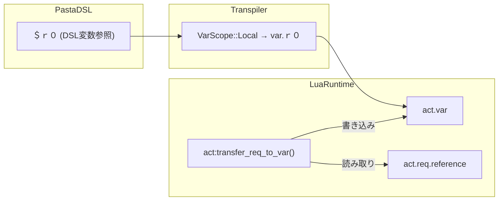
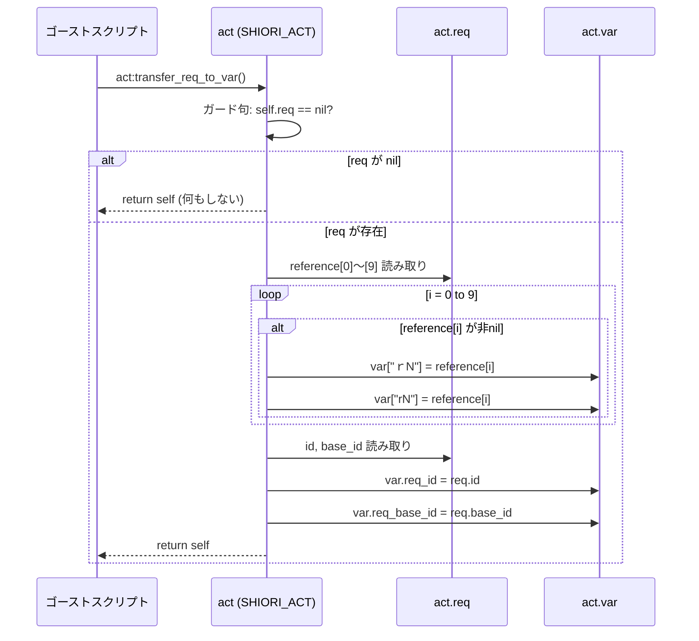

# Design Document: req-var-expansion

## Overview

**Purpose**: SHIORIリクエストテーブル（`act.req`）の主要パラメーターを `act.var` に展開し、Pasta DSLスクリプトから `＄ｒ０`〜`＄ｒ９` 等の変数参照で直接アクセスできるようにする。

**Users**: ゴースト開発者が、Luaコードブロックを使わずにDSL表現内でSHIORIリクエスト情報（Reference, イベントID等）を参照する。

**Impact**: `crates/pasta_lua/scripts/pasta/shiori/act.lua` に `transfer_req_to_var()` メソッドを1つ追加。既存コードへの変更なし。

### Goals
- `act.req.reference[0]`〜`[9]` を `act.var` の全角キー（`ｒ０`〜`ｒ９`）と半角キー（`r0`〜`r9`）に転記
- `act.req.id` / `act.req.base_id` を `act.var.req_id` / `act.var.req_base_id` に転記
- 既存の `transfer_date_to_var()` と同一の明示的呼び出しパターンを維持
- `＄０`〜`＄９`（`digit_id` → `VarScope::Args`）の既存動作を一切変更しない

### Non-Goals
- PEG文法やRustパーサーの変更
- `transfer_req_to_var()` のイベントディスパッチ時の自動呼び出し
- reference[10] 以降の転記（大量アクセスはLuaコードブロックで対応）
- `＄０` のセマンティクス変更（args参照→var参照への変更は行わない）

## Architecture

### Existing Architecture Analysis

本機能は既存の `SHIORI_ACT` クラスに1メソッドを追加するのみの拡張であり、アーキテクチャ変更を伴わない。

**既存パターン**: `transfer_date_to_var()` が確立済み
- ガード句: `if not self.req or not self.req.XXX then return self end`
- 個別フィールドの nil チェック付き転記
- `return self` によるメソッドチェーン

**既存クラス階層**:
```
ACT_IMPL (pasta.act)              ← var={} 初期化
  ↑ __index
SHIORI_ACT_IMPL (pasta.shiori.act) ← req 保持、transfer_date_to_var() 定義
  ↑ __index
act インスタンス                     ← ゴーストスクリプトで使用
```

### Architecture Pattern & Boundary Map



**Architecture Integration**:
- **Selected pattern**: 既存 transfer メソッドパターンの踏襲（追加のみ、変更なし）
- **Domain boundaries**: Lua ランタイム層（`pasta_lua/scripts/`）内で完結
- **Existing patterns preserved**: ガード句 → 転記 → `return self`
- **New components**: なし（既存クラスへのメソッド追加のみ）
- **Steering compliance**: `structure.md` のレイヤー構成を遵守

### Technology Stack

| Layer | Choice / Version | Role in Feature | Notes |
|-------|------------------|-----------------|-------|
| Runtime | Lua 5.5 (mlua 0.11) | `transfer_req_to_var()` メソッド実行 | 変更なし |
| DSL | Pasta DSL (Pest 2.8) | `＄ｒ０` を `var.ｒ０` にトランスパイル | **変更不要**（既存 `id` ルールで解決） |
| Test | lua_test (BDDスタイル) | `transfer_req_to_var` のテスト | 新規テストスイート追加 |

## System Flows

### `transfer_req_to_var()` 呼び出しフロー



## Requirements Traceability

| Requirement | Summary | Components | Interfaces | Flows |
|-------------|---------|------------|------------|-------|
| 1.1 | reference → 全角キー転記 | TransferReqToVar | SHIORI_ACT_IMPL | 転記フロー |
| 1.2 | nil reference のスキップ | TransferReqToVar | SHIORI_ACT_IMPL | ガード分岐 |
| 1.3 | reference → 半角キー転記 | TransferReqToVar | SHIORI_ACT_IMPL | 転記フロー |
| 1.4 | メソッドチェーン | TransferReqToVar | SHIORI_ACT_IMPL | return self |
| 2.1 | req.id → var.req_id | TransferReqToVar | SHIORI_ACT_IMPL | 転記フロー |
| 2.2 | req.base_id → var.req_base_id | TransferReqToVar | SHIORI_ACT_IMPL | 転記フロー |
| 3.1 | SHIORI_ACT メソッド提供 | TransferReqToVar | SHIORI_ACT_IMPL | — |
| 3.2 | 自動呼び出し禁止 | — | — | — |
| 3.3 | 明示的呼び出しで展開 | TransferReqToVar | SHIORI_ACT_IMPL | 転記フロー |
| 3.4 | 未呼出時 var 未設定 | — | — | — |
| 3.5 | req nil ガード句 | TransferReqToVar | SHIORI_ACT_IMPL | ガード分岐 |
| 4.1 | DSL `＄ｒ０` → var.ｒ０ | — (既存パイプライン) | — | — |
| 4.2 | 展開範囲 ｒ０〜ｒ９ 限定 | TransferReqToVar | SHIORI_ACT_IMPL | ループ範囲 |
| 4.3 | 全角・半角両キー転記 | TransferReqToVar | SHIORI_ACT_IMPL | 転記フロー |
| 4.4 | digit_id 既存動作維持 | — (変更なし) | — | — |
| 5.1 | date展開との共存 | — (キー衝突なし) | — | — |
| 5.2 | var初期化タイミング維持 | — (変更なし) | — | — |
| 5.3 | req テーブル読み取り専用 | TransferReqToVar | SHIORI_ACT_IMPL | 読み取りのみ |

## Components and Interfaces

| Component | Domain/Layer | Intent | Req Coverage | Key Dependencies | Contracts |
|-----------|--------------|--------|--------------|-----------------|-----------|
| TransferReqToVar | Lua Runtime | req → var 転記メソッド | 1.1-1.4, 2.1-2.2, 3.1, 3.3, 3.5, 4.2-4.3, 5.3 | SHIORI_ACT_IMPL (P0) | Service |
| TransferReqToVarTest | Lua Test | テストスイート | 全要件 | lua_test (P0), TransferReqToVar (P0) | — |

### Lua Runtime Layer

#### TransferReqToVar

| Field | Detail |
|-------|--------|
| Intent | `act.req` の主要フィールドを `act.var` に転記する SHIORI_ACT メソッド |
| Requirements | 1.1, 1.2, 1.3, 1.4, 2.1, 2.2, 3.1, 3.3, 3.5, 4.2, 4.3, 5.3 |

**Responsibilities & Constraints**
- `act.req.reference[0]`〜`[9]` を全角キー（`ｒ０`〜`ｒ９`）と半角キー（`r0`〜`r9`）に転記
- `act.req.id` / `act.req.base_id` を `req_id` / `req_base_id` に転記
- `act.req` を読み取り専用として扱う（書き込み禁止）
- `nil` フィールドはスキップ（var キーを存在させない）

**Dependencies**
- Inbound: ゴーストスクリプト（Luaコードブロック経由）— メソッド呼び出し (P0)
- Inbound: `SHIORI_ACT_IMPL` メタテーブル — メソッド配置先 (P0)
- Outbound: `self.req` テーブル — 転記元データ (P0)
- Outbound: `self.var` テーブル — 転記先 (P0)

**Contracts**: Service [x]

##### Service Interface

```lua
--- act.req の主要フィールドを act.var に転記する。
--- @param self SHIORI_ACT インスタンス
--- @return SHIORI_ACT self（メソッドチェーン対応）
function SHIORI_ACT_IMPL.transfer_req_to_var(self)
```

- **Preconditions**: なし（`self.req == nil` の場合はガード句で安全に終了）
- **Postconditions**:
  - `self.req` が非nil の場合: `self.var` に最大22キーが設定される
  - `self.req` が nil の場合: `self.var` は変更されない
  - `self.req` の内容は変更されない
- **Invariants**:
  - 戻り値は常に `self`
  - `transfer_date_to_var()` のキーと衝突しない

**Implementation Notes**
- Integration: `transfer_date_to_var()` の直後に配置（同一ファイル内）
- Validation: reference のインデクシングは 0-based（SHIORIプロトコル準拠）
- Risks: なし（既存パターンの完全踏襲、新規依存なし）

## Data Models

### var キーマッピング（転記テーブル）

| ソース | 全角 var キー | 半角 var キー | DSLアクセス | 型 |
|--------|-------------|-------------|-----------|-----|
| `req.reference[0]` | `ｒ０` | `r0` | `＄ｒ０` / `＄r0` | string \| nil |
| `req.reference[1]` | `ｒ１` | `r1` | `＄ｒ１` / `＄r1` | string \| nil |
| `req.reference[2]` | `ｒ２` | `r2` | `＄ｒ２` / `＄r2` | string \| nil |
| `req.reference[3]` | `ｒ３` | `r3` | `＄ｒ３` / `＄r3` | string \| nil |
| `req.reference[4]` | `ｒ４` | `r4` | `＄ｒ４` / `＄r4` | string \| nil |
| `req.reference[5]` | `ｒ５` | `r5` | `＄ｒ５` / `＄r5` | string \| nil |
| `req.reference[6]` | `ｒ６` | `r6` | `＄ｒ６` / `＄r6` | string \| nil |
| `req.reference[7]` | `ｒ７` | `r7` | `＄ｒ７` / `＄r7` | string \| nil |
| `req.reference[8]` | `ｒ８` | `r8` | `＄ｒ８` / `＄r8` | string \| nil |
| `req.reference[9]` | `ｒ９` | `r9` | `＄ｒ９` / `＄r9` | string \| nil |
| `req.id` | — | `req_id` | `＄req_id` | string |
| `req.base_id` | — | `req_base_id` | `＄req_base_id` | string \| nil |

### キー衝突マトリクス

| 展開元 | キー群 | 衝突チェック |
|--------|--------|------------|
| `transfer_date_to_var` | `year`, `month`, `day`, `hour`, `min`, `sec`, `wday`, `年`, `月`, `日`, `時`, `分`, `秒`, `曜日`, `week`, `時１２` | ✅ 衝突なし |
| `transfer_req_to_var` | `ｒ０`〜`ｒ９`, `r0`〜`r9`, `req_id`, `req_base_id` | ✅ 衝突なし |

## Error Handling

### Error Strategy
- **ガード句パターン**: `act.req` が `nil` の場合はサイレントに `self` を返す（エラーは発生させない）
- **nil reference のスキップ**: `reference[N]` が `nil` の場合は対応する var キーを設定しない（暗黙のスキップ）
- 既存の `transfer_date_to_var()` と完全に同一のエラー戦略

### Error Categories and Responses
- **User Errors**: なし（メソッドに不正な引数は渡されない。`self` はメタテーブル経由）
- **System Errors**: なし（純粋なテーブル操作のみ。外部I/Oなし）
- **Business Logic Errors**: なし（転記は無条件。値の妥当性検証は行わない）

## Testing Strategy

### Unit Tests（Lua lua_test BDDスタイル）

`transfer_date_to_var` テストスイート（7テスト）のパターンに従い、以下のテストを実装する:

1. **全角キー転記**: `reference[0]`〜`[9]` → `var["ｒ０"]`〜`var["ｒ９"]` の全転記確認
2. **半角キー転記**: `reference[0]`〜`[9]` → `var.r0`〜`var.r9` の全転記確認
3. **メタデータ転記**: `req.id` → `var.req_id`, `req.base_id` → `var.req_base_id`
4. **req nil ガード**: `req = nil` の場合、クラッシュせず `self` を返す
5. **部分欠落 reference**: `reference[0]` と `reference[2]` のみ存在する疎配列での正常動作
6. **メソッドチェーン**: 戻り値が `self` であることの確認
7. **未呼出時 var 未設定**: `transfer_req_to_var()` を呼ばない場合、req 由来キーが var に存在しない
8. **date 展開との共存**: 両メソッドを順に呼び出し、すべてのキーが共存する
