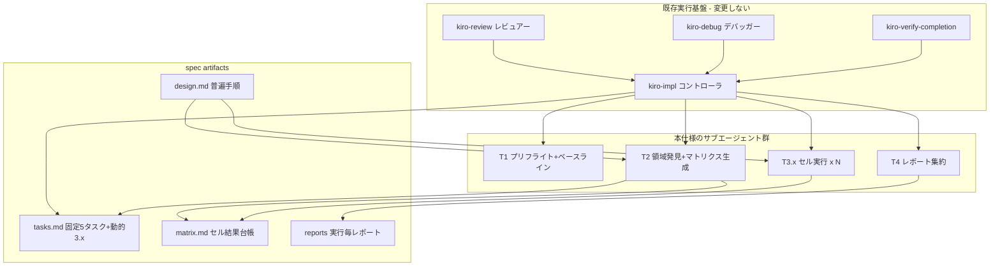
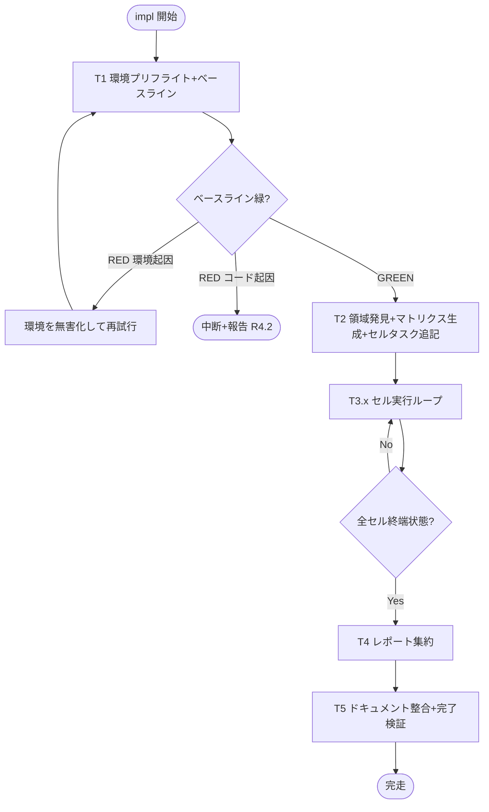
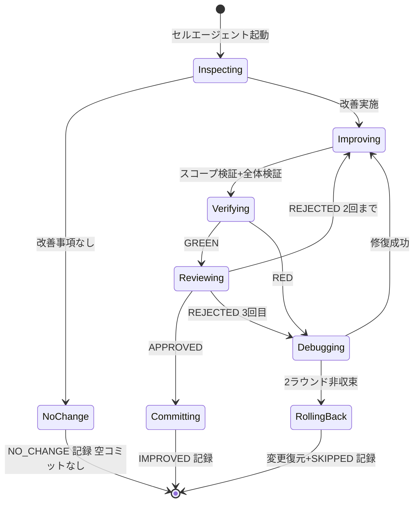

# Technical Design: review-improvement-loop

## Overview

**Purpose**: 本仕様は、リポジトリ全域のコード品質（テスト網羅性・簡潔性・安全性）を外部観測挙動を変えずに底上げする、**自己発見ループ型の再実行可能プロセス**を開発者に提供する。1 回の実装指示（`/kiro-impl review-improvement-loop`）でレビュー領域の自己発見から改善・検証・コミット・レポートまでを中断なく完走する。

**Users**: 開発者が、定期的な品質底上げ・別プロジェクトへの横展開（spec ディレクトリコピー＋再実行）のワークフローとして利用する。

**Impact**: 本仕様は新機能を追加しない。既存コードベースの品質状態と、`.kiro/specs/review-improvement-loop/` 配下の実行アーティファクト（matrix.md・reports/）のみを変化させる。実行エンジンは既存の `kiro-impl` 自律モードをそのまま用い、本設計はその上で動く**手順とコントラクト**を定義する。

### Goals

- レビュー領域 × レビュー 7 次元のマトリクスを実行時に自己発見・生成し、全セルを処理完了（改善コミット済み / 確認済み（改善不要）/ スキップ記録済み）まで完走する
- 正常系挙動の厳密保存と、攻撃面ハードニングに限る挙動変化許容の境界をテストで明示する
- メインエージェントをオーケストレーションに限定し、分析・改善・レビュー・集約をサブエージェントへ委譲する
- 別プロジェクトへコピーして再実行するだけで同等の効果が得られる移植性を持つ

### Non-Goals

- 新機能の追加・外部仕様の変更（挙動保存が前提）
- CI 設定そのものの再設計（ループはローカル実行。CI 整合の確認は次元 7 の範囲）
- 性能チューニングを主目的とする作業
- Kiro ワークフロー自体（kiro-impl 等スキル群）の改修
- 完了済み `audit-pasta-*` spec の改変・再オープン

## Boundary Commitments

### This Spec Owns

- **改善ループの手順定義**: 環境プリフライト → 領域発見 → マトリクス生成 → セル実行 → 検証 → コミット/巻き戻し → レポートの全プロセス
- **実行アーティファクト**: `matrix.md`（セル結果台帳）、`reports/`（実行毎レポート）、tasks.md の GENERATED-CELLS 区間
- **セル実行コントラクト**: セルタスク書式、コミットトレーラ規約（`Riloop-Cell:`）、セル状態モデル（PENDING/IMPROVED/NO_CHANGE/SKIPPED）
- **挙動保存ポリシーの運用規則**: 正常系厳密保存・許容ハードニング境界の判定とテスト明示

### Out of Boundary

- `kiro-impl` / `kiro-review` / `kiro-debug` / `kiro-verify-completion` / `karpathy-guidelines` 各スキルの内部実装（本設計はこれらの公開プロトコルを呼ぶだけ）
- `release-workflow` spec（リリース・配布フロー）
- `book/` マニュアルの内容拡充（次元 7 での同期確認のみ In）
- 改善対象コードの機能仕様（各クレートの外部仕様は不変）

### Allowed Dependencies

- 既存スキル群の公開プロトコル: kiro-impl（実行器）、kiro-review（`VERDICT`）、kiro-debug（`NEXT_ACTION`）、kiro-verify-completion（`STATUS`）、karpathy-guidelines（簡素化基準）
- 対象プロジェクトの品質検証インフラ（本リポジトリでは cargo test/clippy/audit、luacheck/lua_test、npm scripts、book ツール群）
- steering（workflow.md の DoD・Git 安全規則、tech.md の品質基準）
- dev 環境へのツール導入（cargo-deny / cargo-machete — リポジトリ非変更・レポート記録必須）

### Revalidation Triggers

- kiro-impl のタスク駆動プロトコル（チェックボックス・STATUS/VERDICT 書式）が変わったとき → セルタスク生成書式の再検証
- tasks.md テンプレート規約（`.kiro/settings/`）が変わったとき → GENERATED-CELLS 書式の再検証
- workflow.md の Git 禁止操作リストが変わったとき → 巻き戻し手順の再検証
- 対象プロジェクトの検証コマンド体系が変わったとき（例: テストランナー変更）→ 正準コマンド表の再生成

## Architecture

### Existing Architecture Analysis

本設計は既存の kiro 実行基盤に**追加のオーケストレータを作らない**。kiro-impl 自律モードの実行モデル（サブタスク毎に実装サブエージェント → 独立レビュアー → 完了検証 → 選択的コミット、デバッグ 2 ラウンド上限 → `_Blocked:` スキップ）が要件 R4/R5/R6 の機構をほぼ提供することがギャップ分析で確認済み（research.md §3）。本設計が**追加で定義するのは 4 点のみ**:

1. **環境プリフライト**（既知制約の無害化 — PASTA_DEBUG 偽 RED の実証に基づく。research.md §10.1）
2. **領域発見とセルタスク動的生成**（tasks.md 自己拡張 — 固定メジャータスク＋動的サブタスク方式）
3. **巻き戻し手順**（kiro-impl 標準はスキップ時に変更を残置するため、ファイル単位の個別復元を追加）
4. **結果台帳とレポート**（matrix.md / reports/）

### Architecture Pattern & Boundary Map

選択パターン: **固定スケルトン＋動的ワークリスト**（Plan-and-Generate Loop）。メジャータスク構造（1〜5）は不変、セル群（3.x）のみ実行時に生成する。



**Architecture Integration**:

- 選択パターン: 固定スケルトン＋動的ワークリスト — kiro-impl の「毎イテレーション tasks.md 再読」仕様を利用し、Task 2 が追記したサブタスクを後続イテレーションが自然に処理する
- 境界分離: 実行制御（kiro-impl・変更しない）/ 手順定義（design.md・本仕様）/ 実行状態（tasks.md チェックボックス）/ 結果記録（matrix.md）の 4 層を分離
- 既存パターン維持: release-workflow の再実行型運用（`completed/` 非移動・チェックボックスリセット）を踏襲
- Steering 整合: workflow.md の Git 安全規則・回帰責任・MVP 禁止に準拠

### 依存方向

```
design.md（普遍手順） → tasks.md（実行状態） → kiro-impl（実行器） → サブエージェント → 対象リポジトリ＋matrix.md
```

逆方向の依存（サブエージェントが tasks.md の固定部を書き換える、セルエージェントが design.md を変更する等）は禁止。唯一の例外は Task 2 による GENERATED-CELLS 区間への追記。

### Technology Stack

| Layer | Choice / Version | Role in Feature | Notes |
|-------|------------------|-----------------|-------|
| 実行エンジン | kiro-impl（既存スキル） | タスク駆動・サブエージェント分離・コミット | 変更しない |
| レビュー/デバッグ/検証 | kiro-review / kiro-debug / kiro-verify-completion | セル毎の独立検証・非収束判定・完了ゲート | 変更しない |
| Rust 検証 | cargo test / clippy / audit（rustc 1.96 stable） | ベースライン・lint・脆弱性監査 | 警告 117 件（実測）から開始 |
| Rust 追加ツール | cargo-deny（要導入・deny.toml 既存）/ cargo-machete（要導入） | サプライチェーン監査・未使用依存検出 | dev 環境変更のみ・レポート記録 |
| Lua 検証 | luacheck（.luacheckrc 設定済み）/ lua_test（cargo test 経由） | Lua 資産の lint・テスト | `cargo test -p pasta_lua --test lua_unittest_runner` |
| TS/JS 検証 | npm scripts（compile/lint/test）/ node `*-test.mjs` / npm audit | VSCode 拡張・book ツールの検証 | lockfile あり・CI 未ゲート（ローカル価値高） |
| 結果記録 | matrix.md / reports/（Markdown） | セル台帳・最終レポート | git 管理下・追記型 |

## File Structure Plan

本仕様はプロセス仕様であり、ソースコードファイルを新設しない。実行アーティファクトの構造を定義する。

### Directory Structure

```
.kiro/specs/review-improvement-loop/
├── spec.json            # フェーズ管理（phase は completed にしない）
├── brief.md             # discovery 成果（既存）
├── requirements.md      # 要件（既存）
├── design.md            # 本書 = 普遍手順の権威
├── research.md          # ギャップ分析・実測・設計判断ログ（既存）
├── tasks.md             # 固定 5 メジャータスク + GENERATED-CELLS 区間（Task 2 が 3.x を追記）
├── matrix.md            # セル結果台帳（Task 2 が生成・各セル完了時に更新・実行毎にリセット）
└── reports/
    └── {YYYY-MM-DD}-improvement-report.md   # Task 4 が生成（実行毎に蓄積・退避先）
```

### Modified Files

- `tasks.md` — Task 2 が GENERATED-CELLS マーカー区間内にセルサブタスク 3.x を追記する（固定部は不変）
- 改善対象コード（`crates/**`, `editors/vscode/**`, `book/tools/**` 等）— 各セルの改善はセル境界（`_Boundary:_`）内に限定
- `TEST_COVERAGE.md` / クレート README / steering — 次元 7 セルおよび Task 5 が同期する

## System Flows

### ループ全体フロー



### セル実行ライフサイクル（T3.x の 1 件）



フロー上の決定事項: 検証は 2 段（作業中=領域スコープ ~4 秒、コミット前=全体 ~30 秒。research.md §10.1 実測根拠）。レビューは改善があったセルのみ実施（NO_CHANGE セルは点検結果の記録のみで、レビュアー・検証コストを掛けない）。

## Requirements Traceability

| Requirement | Summary | 実現コンポーネント | 主要コントラクト |
|-------------|---------|------------------|----------------|
| 1.1, 1.4 | 実行時の領域自己発見・固定リスト禁止 | 領域発見プロトコル（T2） | 資産インベントリ手順 |
| 1.2 | 全資産カテゴリ・トップレベル粒度 | 領域発見プロトコル | 資産カテゴリ検出表 |
| 1.3 | 大領域の細分化 | 領域発見プロトコル | セルサイズ規則（≦2,000 行/ディスパッチ） |
| 1.5 | マトリクスの記録・確認可能性 | matrix.md 台帳 | matrix.md スキーマ |
| 2.1〜2.9 | 7 次元の実施内容 | セル実行プロトコル（T3.x）＋次元グループ定義 | セルタスク書式・次元別チェックリスト |
| 2.10 | 資産種別適合ツール・該当なし記録 | 検証コマンドメニュー | 正準コマンド表＋N/A 記録 |
| 3.1, 3.5 | 正常系厳密保存・新機能禁止 | 挙動保存ポリシー運用規則 | セルエージェントプロンプト制約 |
| 3.2, 3.3, 3.6, 3.7 | 許容ハードニング・境界テスト明示 | 同上＋セルレビュー観点 | ハードニング判定規則・回帰テスト要求 |
| 3.4 | 等価性検証 | 2 段検証ゲート | 正準コマンド表（テスト＋スナップショット） |
| 4.1, 4.2, 4.7 | ベースライン・中断・環境制約 | 環境プリフライト（T1） | 環境制約表・正準コマンド表 |
| 4.3, 4.4 | セル毎検証・グリーン＝コミット | セル実行プロトコル | コミット規約（Riloop-Cell トレーラ） |
| 4.5 | 破壊時の根本原因デバッグ | kiro-debug 連携（既存） | NEXT_ACTION プロトコル |
| 4.6 | 改善不要セルの記録・空コミット禁止 | セル状態モデル | NO_CHANGE 状態 |
| 5.1〜5.4 | 巻き戻し・スキップ・非破壊 Git | 巻き戻し手順 | porcelain 追跡＋個別 restore |
| 5.5, 5.6 | 全セル終端まで継続・MVP 禁止 | kiro-impl 駆動＋T4 前提条件 | セル終端状態（3 値） |
| 6.1, 6.2 | サブエージェント委譲・メイン専任 | アーキテクチャ全体（T1/T2/T3.x/T4 すべて委譲） | kiro-impl 実行モデル |
| 6.3 | 独立敵対レビュー | kiro-review 連携（既存） | VERDICT プロトコル |
| 6.4 | 完了宣言前の新証拠検証 | kiro-verify-completion 連携（T5） | STATUS プロトコル |
| 7.1〜7.5 | 改善レポート | レポート集約（T4） | レポートスキーマ |
| 8.1, 8.2 | 再実行型運用・状態リセット | 再実行プロトコル | リセット手順 |
| 8.3, 8.4 | 移植性・インフラ自動発見 | 領域発見プロトコル＋検証コマンドメニュー | 資産カテゴリ検出表（言語非依存の検出規則） |

## Components and Interfaces

| Component | Layer | Intent | Req Coverage | Key Dependencies | Contracts |
|-----------|-------|--------|--------------|------------------|-----------|
| 環境プリフライト（T1） | 準備 | 環境制約の無害化とグリーンベースライン確立 | 4.1, 4.2, 4.7 | steering/memory（P1）、正準コマンド表（P0） | Batch |
| 領域発見プロトコル（T2） | 計画 | 資産発見・マトリクス生成・セルタスク追記 | 1.1〜1.5, 8.3, 8.4 | 環境プリフライト（P0）、tasks.md 書式（P0） | Batch, State |
| セル実行プロトコル（T3.x） | 実行 | 1 セルの点検・改善・検証・記録 | 2.1〜2.10, 3.1〜3.7, 4.3〜4.6 | kiro-review（P0）、kiro-debug（P0）、matrix.md（P0） | Batch, State |
| 巻き戻し手順 | 実行（例外系） | 非収束セルの変更を安全に復元 | 5.1〜5.4 | git porcelain（P0） | Batch |
| 検証コマンドメニュー | 横断 | 資産種別ごとの検証コマンド正準化 | 2.10, 3.4, 4.7, 8.4 | 対象プロジェクトのツールチェーン（P0） | State |
| レポート集約（T4） | 報告 | matrix.md＋git log から最終レポート生成 | 7.1〜7.5 | matrix.md（P0）、コミットトレーラ（P1） | Batch |
| 再実行プロトコル | 運用 | 再開と新規ループの区別・状態リセット | 8.1, 8.2 | tasks.md、matrix.md（P0） | State |

### 準備層

#### 環境プリフライト（Task 1）

| Field | Detail |
|-------|--------|
| Intent | 既知の環境制約を無害化し、改善着手前のグリーンベースラインを確立する |
| Requirements | 4.1, 4.2, 4.7 |

**Responsibilities & Constraints**
- 既知制約の発見: steering（tech.md / workflow.md）・プロジェクトメモリ・本設計の環境制約表を読み、検証コマンドに影響する制約を列挙する
- 正準コマンド表の確定: 制約の無害化プレフィックスを織り込んだ検証コマンド文字列を確定し、以後の全サブエージェントへ**コマンド文字列として**伝搬する（解釈余地を残さない）
- ベースライン実行と切り分け: 全体検証が RED の場合、環境起因（env 変数・ポート・ツール不在）かコード起因かを切り分け、環境起因なら無害化して再試行、コード起因なら中断して報告する（R4.2）

**環境制約表（本リポジトリのインスタンス値）**

| 制約 | 無害化 | 根拠 |
|---|---|---|
| `NoDefaultCurrentDirectoryInExePath` 設定済みだと mlua-sys ビルドが exit 101 | cargo 実行前に解除 | 既知制約（要件 4.7 記載） |
| `PASTA_DEBUG`/`PASTA_DEBUG_PORT` 設定済みだと DAP ポート競合で 86 テスト失敗 | cargo test 実行前に解除 | 実測（research.md §10.1） |

> 移植時: この表は対象プロジェクトの steering / メモリ / CLAUDE.md から再発見する。表が空でもプリフライトは「ベースライン RED 時の環境/コード切り分け」を必ず実施する。

##### Batch / Job Contract
- Trigger: ループ開始時（Task 1）
- Input: steering・メモリ・本設計の環境制約表
- Output: 正準コマンド表（tasks.md の Implementation Notes へ記録）＋ベースライン結果（GREEN 確認）
- Idempotency: 何度実行しても安全（読み取り＋検証のみ。コード変更なし）

**Implementation Notes**
- Integration: kiro-impl の「検証コマンド一括発見」ステップに正準コマンド表を供給する形で統合
- Validation: ベースライン GREEN のエビデンス（テスト件数・所要時間）を tasks.md Implementation Notes に記録
- Risks: シェルが毎回プロファイルから環境を再構築するため、無害化はコマンド毎に適用する（セッション単位の unset に依存しない）

### 計画層

#### 領域発見プロトコル（Task 2）

| Field | Detail |
|-------|--------|
| Intent | 対象リポジトリの全ソース資産からレビュー領域を発見し、マトリクスとセルタスクを生成する |
| Requirements | 1.1, 1.2, 1.3, 1.4, 1.5, 8.3, 8.4 |

**Responsibilities & Constraints**
- **資産カテゴリ検出（言語非依存の規則）**: マニフェストファイルの存在からビルド/検証エコシステムを検出する。固定リスト禁止（R1.4）— 以下は検出規則であり領域リストではない

| 検出対象 | 資産カテゴリ | 検証エコシステム |
|---|---|---|
| `Cargo.toml`（workspace members） | Rust クレート | cargo test / clippy / audit |
| `package.json`（lockfile 付き） | Node/TS/JS パッケージ | npm scripts / npm audit |
| `.luacheckrc`・Lua テストランナー | Lua 資産 | luacheck / 当該ランナー |
| `pyproject.toml` 等（移植先で遭遇時） | 当該エコシステム | 当該標準ツール |

- **領域分割規則**: トップレベル構成単位（クレート・パッケージ・資産ディレクトリ）を最小粒度とし、src 実測行数が約 3,000 行を超える単位はサブモジュール境界（ディレクトリモジュール）で細分化する。1 ディスパッチの点検対象は約 2,000 行以下を目安とする（R1.3）
- **セル生成**: 領域 × 次元グループ（後述 5 グループ）でセルを生成。小領域（<1,500 行）はグループを統合し 1〜3 セルに圧縮。横断 D7（サプライチェーン・台帳同期・drift-check）は全体セル 1 件に集約
- **matrix.md 生成**と **tasks.md への GENERATED-CELLS 追記**（書式は Data Models 参照）。追記後にチェックボックス書式の機械検証を行うこと（書式崩れの即時検出）

**本リポジトリでの予想インスタンス（拘束ではなく目安）**: Rust 6 クレート＋pasta_lua サブモジュール約 6 領域＋Lua 資産 1〜2＋VSCode 拡張 1＋book/tools 1 ≒ 15〜17 領域、総セル数 ≈ 55〜65

##### Batch / Job Contract
- Trigger: Task 1 完了後（Task 2）
- Input: リポジトリ構造・正準コマンド表・本設計の検出規則とセルサイズ規則
- Output: matrix.md（全セル PENDING）＋ tasks.md GENERATED-CELLS 区間への 3.x サブタスク追記
- Idempotency: 再実行時は GENERATED-CELLS 区間と matrix.md を再生成（既存区間をクリアしてから追記）

**Implementation Notes**
- Integration: 追記書式は `.kiro/settings/` の tasks.md 規約（チェックボックス・`_Requirements:`・`_Boundary:` フッター）に準拠する
- Validation: 追記後の tasks.md に対し「`- [ ] 3.` で始まる行が matrix.md のセル数と一致する」ことを機械確認
- Risks: 書式崩れ → 完了条件に機械検証を含めることで Task 2 の時点で検出（research.md §10.4）

### 実行層

#### セル実行プロトコル（Task 3.x — 動的生成される各サブタスク）

| Field | Detail |
|-------|--------|
| Intent | 1 セル（領域 × 次元グループ）の点検・改善・検証・記録を完結する |
| Requirements | 2.1〜2.10, 3.1〜3.7, 4.3, 4.4, 4.5, 4.6, 6.1, 6.3 |

**次元グループ定義（R2 の 7 次元の実行束ね・領域内実行順序）**

| グループ | 次元 | 主な作業 | リスク |
|---|---|---|---|
| G1 テスト網羅 | D1 | 未テストの公開挙動・未到達分岐の特定とテスト追加。不要テストの除外は根拠明記の上で慎重に（R2.2, 2.3） | 低（安全網を先に張る） |
| G2 静的衛生 | D4+D5 | lint 警告ゼロ化（機械修正優先）・デッドコード/未使用 pub/未使用依存の除去（R2.6, 2.7） | 低〜中 |
| G3 ハードニング | D3+D6 | 脆弱性レビューと対策・到達可能パニック経路の Result 化（FFI 境界最優先）（R2.5, 2.8, 3.6, 3.7） | 中（挙動変化は回帰テストで境界明示） |
| G4 簡素化 | D2 | karpathy-guidelines 準拠検証と是正（R2.4） | 中（テスト安全網必須） |
| G5 文書/依存整合 | D7 領域分 | 領域のドキュメント同期・依存整合（R2.9 の領域スコープ部分） | 低 |

実行順序は G1→G2→G3→G4→G5 の昇リスク順（領域内でテスト安全網を先に確立する）。資産種別に適用不能な次元は作業せず matrix.md に「N/A＋理由」を記録する（R2.10）。

**セルエージェントへの必須プロンプト制約（挙動保存ポリシーの運用規則）**
1. 正常系（妥当な入力）の外部観測挙動を変更しない（R3.1）。新機能・外部仕様変更は禁止（R3.5）
2. 挙動変化が許されるのは不正入力・攻撃面のハードニングのみ（R3.2）。到達可能なパニック経路の明示エラー化は常に許容ハードニングとして扱う（R3.6）。FFI/SHIORI 境界を越えるパニックは未定義動作であり、その削減は安全性修正である（R3.7）
3. 挙動変化を許容した箇所は、変化の境界を示す回帰テストを必ず追加し、matrix.md の所見に記録する（R3.3）
4. 等価性は既存テスト＋スナップショットテストの GREEN で検証する（R3.4）

##### Batch / Job Contract
- Trigger: kiro-impl が次の未チェック 3.x を選択したとき
- Input: セルタスク記述（領域パス・次元グループ・スコープ検証コマンド）＋正準コマンド表＋上記プロンプト制約
- Output: 改善コミット（または変更なし）＋ matrix.md 更新＋実装者 STATUS 報告
- Idempotency: コミット単位で進むため、中断後の再実行は未チェックセルから安全に再開できる

##### State Management（セル状態モデル）
- 状態: `PENDING` →（点検）→ `IMPROVED`（コミットあり）/ `NO_CHANGE`（改善不要・R4.6）/ `SKIPPED`（巻き戻し済み・理由記録・R5.2）
- **NO_CHANGE の証拠要求**: 次元別の新鮮な点検証拠（lint 実行出力の要約・点検所見のファイル/行参照・適用した検査コマンド等）を matrix.md Notes に記録して初めて成立する。証拠のない NO_CHANGE 宣言は未完了として扱う（沈黙の未達防止）
- 全セルがこの 3 終端状態のいずれかに達するまでループは継続する（R5.5）。途中での完成宣言は禁止（R5.6）
- 永続化: matrix.md の Status 列。**更新はセル実行サブエージェントの完了条件に内包する**（kiro-impl は matrix.md を関知しないため、コントローラへ台帳責務を割り当てない）。台帳更新（matrix.md・tasks.md チェックボックス）はセルのコミットへ同梱する
- **台帳のみコミットの正当性**: NO_CHANGE/SKIPPED セルでは台帳のみの `chore` コミットとなる。R4.6 が禁じる「空コミット」は git の `--allow-empty`（内容ゼロ）を指し、台帳変更を含むコミットは正当である

**自己修復プレリュード（各セル着手前の必須手順 — 巻き戻しの実行主体）**

kiro-impl は Blocked タスクの変更を残置して次タスクへ進むため、巻き戻し手順の実行主体は**次セルのサブエージェント**である。各セルは着手前に必ず以下を実施する:
1. `git status --porcelain` でワークツリーを確認する
2. 非クリーンかつ直前セルに `_Blocked:` 注記がある場合: 巻き戻し手順（後述）を実行し、前セルを matrix.md へ `SKIPPED`（理由 = `_Blocked:` 注記の要約）として遡及記録し、台帳を `chore` コミットする
3. 非クリーンだが Blocked 由来でない場合（他セッションの未コミット作業）: 当該ファイルには触れず matrix.md Notes に記録のみ行い、自セルの変更追跡（porcelain 差分照合）から除外する（R5.3）
4. クリーン（または除外記録済み）を確認してから自セルの作業へ着手する

**検証ゲート（2 段・R4.3）**
1. 作業中: 領域スコープ検証（例: `cargo test -p {crate}`、`npm run test`、対象ツールの `*-test.mjs`）
2. コミット前: 全体検証（本リポジトリでは env 無害化付き `cargo test --workspace`）＋当該資産種別の lint/テスト。GREEN でコミット（R4.4）、RED で kiro-debug（R4.5）

**コミット規約（R4.4・レポート機械集約の前提）**
- メッセージ: `<type>({area}): <summary>`（type はグループに応じ test/refactor/fix/docs/chore）
- 本文末尾トレーラ必須: `Riloop-Cell: {area}x{group}`（例: `Riloop-Cell: pasta_core x G3`）
- ステージング: 触れたファイルの個別 `git add`（`git add -A` 禁止 — kiro-impl 規約踏襲）

**Implementation Notes**
- Integration: 改善があったセルのみ kiro-review の敵対レビューへ回す（R6.3）。NO_CHANGE セルは点検所見の matrix.md 記録のみ
- Validation: レビュー REJECTED は 2 回まで実装者再派遣、3 回目で kiro-debug（kiro-impl 標準）
- Risks: pasta_lua の clippy 101 警告はG2 セルで `cargo clippy --fix` の機械適用を一次手段とし、非機械的警告のみ個別判断（research.md §10.4）

#### 巻き戻し手順（セル実行プロトコルの例外系）

| Field | Detail |
|-------|--------|
| Intent | デバッグ非収束セルの変更のみを直前コミット時点へ安全に復元する |
| Requirements | 5.1, 5.2, 5.3, 5.4 |

**手順（workflow.md の禁止操作を使わない）**
1. 前提: セル開始時点はコミット直後（クリーンワークツリー）である — kiro-impl のセル毎コミットが保証
2. kiro-debug が 2 ラウンド非収束（`NEXT_ACTION: BLOCK_TASK`）を返したら、`git status --porcelain` で当該セルが触れたファイル集合を特定する
3. 変更・削除されたファイル: `git restore <file>` を**個別に**適用（一括ワイルドカード不可）
4. 新規追加（未追跡）ファイル: **個別に**削除（`git clean` 不使用）
5. 復元後に `git status --porcelain` がクリーンであることを確認し、matrix.md に `SKIPPED`＋理由（ROOT_CAUSE 要約）を記録して次セルへ進む
6. 他セッションの未コミット作業が存在する場合（開始時 porcelain が非クリーン）: 当該ファイルは復元対象から除外し、セル開始時に記録したベースライン差分とのみ照合する（R5.3）

**Implementation Notes**
- Integration: kiro-debug の `_Blocked:` 注記（kiro-impl 標準）に加えて本手順を実行する — 「残置せず復元」が本仕様の追加分。**実行主体は次セルの自己修復プレリュード**（kiro-impl 自体は巻き戻しを行わない）。最終セルが Blocked となり後続セルが存在しない場合は、**T4（レポート集約）の前提クリーンチェックが同じ手順を実行**する
- Validation: 復元後のワークツリーがセル開始時点と一致すること（porcelain 照合）
- Risks: `git restore` は破壊的になりうるため、必ず porcelain で特定した**当該セルのファイルのみ**に個別適用する

### 横断層

#### 検証コマンドメニュー（正準コマンド表）

| Field | Detail |
|-------|--------|
| Intent | 資産種別ごとの検証コマンドを 1 回だけ確定し、全サブエージェントへ文字列として伝搬する |
| Requirements | 2.10, 3.4, 4.7, 8.4 |

**本リポジトリのインスタンス値（T1 が確定・移植時は再発見）**

| 資産 | スコープ検証 | 全体検証 | lint | 監査 |
|---|---|---|---|---|
| Rust クレート | `cargo test -p {crate}` | `cargo test --workspace` | `cargo clippy -p {crate} --all-targets` | `cargo audit` / `cargo deny check` |
| Lua 資産 | `cargo test -p pasta_lua --test lua_unittest_runner -- --nocapture` | 同左＋workspace | luacheck（.luacheckrc） | —（cargo audit が包含） |
| VSCode 拡張 | `npm run test`（editors/vscode） | compile+lint+test | `npm run lint` | `npm audit` |
| book/tools | `node book/tools/{tool}/*-test.mjs` | drift-check＋tutorial-check 含む全ツールテスト | —（N/A 記録） | `npm audit`（book/） |

> すべての cargo コマンドには環境制約表の無害化（`NoDefaultCurrentDirectoryInExePath`・`PASTA_DEBUG`・`PASTA_DEBUG_PORT` 解除）をコマンド文字列として織り込む。

**ツール供給ポリシー（research.md 決定 D-6）**: 設定が存在するのに実行手段がないツール（deny.toml→cargo-deny）と次元実施に必要な軽量ツール（cargo-machete）は dev 環境へ導入してよい（リポジトリ非変更・matrix.md と最終レポートへ記録）。導入失敗時は当該検査を「N/A（ツール不可）」とし完走を優先する。

**指摘の帰属規則（同一クレート複数領域の干渉防止）**: lint・デッドコード等の検査はクレート単位で実行されるが、指摘への対処責務は**指摘対象ファイルのパスが当該セルの `_Boundary:` paths 配下にあるもののみ**とする（境界外の指摘は対処せず matrix.md Notes に申し送り）。クレート単位の関心事（Cargo.toml の未使用依存・クレートルートの lint 設定・`src/lib.rs`・`build.rs`）は、**クレートルートを含む領域のセルが所掌**する。これにより pasta_lua のようなサブモジュール分割クレートでも、複数 G2 セルが同一警告を奪い合わない。

### 報告層

#### レポート集約（Task 4）

| Field | Detail |
|-------|--------|
| Intent | matrix.md とコミット履歴から実行 1 回分の改善レポートを生成する |
| Requirements | 7.1, 7.2, 7.3, 7.4, 7.5 |

##### Batch / Job Contract
- Trigger: 全セルが終端状態に達した後（Task 4）。前提条件: ①**前提クリーンチェック** — `git status --porcelain` を確認し、最終セルが Blocked で残置がある場合は自己修復プレリュードと同じ手順（巻き戻し＋SKIPPED 遡及記録）を実行する ②matrix.md に PENDING が存在しないこと
- Input: matrix.md＋`git log --grep "Riloop-Cell:"`（ループ開始コミット以降）
- Output: `reports/{YYYY-MM-DD}-improvement-report.md`
- Idempotency: 同日再実行時は上書きでなく `-2` 等のサフィックスで併存

**レポート必須セクション**: ①セル別実施結果（領域・次元・改善内容・コミットハッシュ — R7.2）②許容した挙動変化と境界回帰テストへの参照（R7.3）③スキップ一覧と理由（R7.4）④確認済み（改善不要）一覧 — 改善実施セルと区別（R7.5）。**うち既知負債領域（T1 ベースライン計測で lint 警告・パニック経路等の負債が確認された領域）の NO_CHANGE は「要注意」として明示**する ⑤導入したツールと環境変更の記録

### 運用層

#### 再実行プロトコル

| Field | Detail |
|-------|--------|
| Intent | 「同一ループの再開」と「新規ループの開始」を区別し、再実行型運用を成立させる |
| Requirements | 8.1, 8.2 |

##### State Management
- **同一ループの再開**: `/kiro-impl review-improvement-loop` 再呼び出し。kiro-impl が tasks.md の未チェックタスクから継続（コンテキスト切れ・中断からの復帰）。状態リセットなし
- **新規ループの開始**（R8.2 が指す初期化）: ①tasks.md の全チェックボックスを `[ ]` へリセット ②GENERATED-CELLS 区間をクリア ③matrix.md を前回レポートと共に reports/ へ退避 ④Task 1 から再実行（領域の再発見）
- 本 spec は完走後も `completed/` へ移動しない（R8.1 — release-workflow と同運用。kiro-spec-complete はアーカイブ手順をスキップする）

## Data Models

### matrix.md スキーマ（セル結果台帳）

```markdown
# Review Matrix — 実行開始: {ISO日時} / ベースライン: {コミットhash}

| Cell | Area | Paths | Groups | Status | Commit | Notes |
|------|------|-------|--------|--------|--------|-------|
| 3.1  | pasta_core | crates/pasta_core/src | G1 | PENDING |  |  |
| 3.2  | pasta_core | crates/pasta_core/src | G2+G3+G4+G5 | PENDING |  |  |
```

- `Status` ∈ {PENDING, IMPROVED, NO_CHANGE, SKIPPED}（終端 3 値＋初期値）
- `Notes`: 次元別所見・N/A 記録（`D4: N/A（lint 基盤なし）`）・許容挙動変化の回帰テスト参照・スキップ理由
- 整合不変条件: tasks.md の 3.x サブタスク数 = matrix.md の行数。`[x]` ⇔ Status が終端状態

### tasks.md GENERATED-CELLS 追記書式（Task 2 が逐語準拠）

```markdown
<!-- GENERATED-CELLS:BEGIN (Task 2 が生成。固定部の編集禁止) -->
- [ ] 3.{i} セル {area} × {groups}: 点検・改善・検証・記録
  - 着手前: 自己修復プレリュード（porcelain 確認・前セル Blocked 残置の巻き戻し＋SKIPPED 遡及記録）を実行
  - 対象: {paths}（この境界外のファイル変更は禁止。クレート単位検査の指摘は帰属規則に従う）
  - 次元グループ: {groups の作業内容 1 行ずつ}
  - スコープ検証: `{scoped command}` / コミット前: 正準全体検証
  - 挙動保存: design.md「セルエージェントへの必須プロンプト制約」に従う
  - 完了 = コミット済み or NO_CHANGE 記録（次元別の新鮮な証拠必須）or 巻き戻し+SKIPPED 記録。matrix.md 更新は完了条件（台帳はコミットへ同梱）
  - _Requirements: 2.1, 3.1, 4.3, 4.4_
  - _Boundary: {paths}_
<!-- GENERATED-CELLS:END -->
```

### コミットトレーラ（git 上の構造化記録）

- 書式: `Riloop-Cell: {area}x{group}`（本文最終行）
- 用途: T4 の機械集約（`git log --grep`）・実行間の改善履歴追跡

## Error Handling

### Error Strategy

エラーは「ループを止める種類」と「セルを終端させる種類」に二分し、後者は完走保証（R5.5）の中で吸収する。

### Error Categories and Responses

**ループ中断系（即停止・開発者報告）**
- 開始時ベースラインがコード起因で RED（R4.2）→ 失敗内容を報告し中断。改善には着手しない
- tasks.md 固定部の破損・GENERATED-CELLS 書式不一致 → Task 2 をやり直し（追記は冪等）
- kiro-debug が `STOP_FOR_HUMAN`（spec 矛盾・外部ブロッカー）→ 当該セルを SKIPPED とせず開発者へエスカレーション

**セル終端系（吸収して継続）**
- セル検証 RED → kiro-debug（最大 2 ラウンド）→ 非収束なら巻き戻し＋SKIPPED（R5.1, 5.2）
- 資産種別にツール不在・導入失敗 → 当該次元を N/A 記録して続行（R2.10）
- レビュー REJECTED 3 回 → kiro-debug 経由で上記フローへ合流

**環境系（無害化して再試行）**
- 環境起因の検証失敗（ポート競合・env 変数・PATH） → 環境制約表に追記し、正準コマンド表を更新して再試行（コードを触らない）

### Monitoring

- 進捗の単一情報源: tasks.md チェックボックス（実行状態）＋ matrix.md（結果）。両者の整合不変条件を各セル完了時に確認
- すべての改善は Riloop-Cell トレーラ付きコミットとして git 履歴に残る（事後監査可能）

## Testing Strategy

本仕様はプロセス仕様であり、「テスト」は (a) ループ自身の検証ゲートの正しさ、(b) 生成アーティファクトの整合で構成する。

### プロセス検証（ループ実行中の継続的ゲート）
1. ベースラインゲート: T1 で全体検証 GREEN を確認（1510 テスト・実測 23 秒 — R4.1）
2. セル毎 2 段検証: スコープ検証→コミット前全体検証（R4.3）。挙動等価セルは既存テスト＋insta スナップショット 27 ファイルが等価性を担保（R3.4）
3. ハードニング境界テスト: 挙動変化を許容した各セルで、新規回帰テストが「変化の境界」を表現していることをレビュアーが確認（R3.3 — kiro-review の追加観点）
4. 巻き戻し検証: 復元後 porcelain クリーン照合（R5.1）

### アーティファクト整合（Task 2/4/5 の完了条件）
1. tasks.md 3.x 件数 = matrix.md 行数（Task 2 完了条件）
2. matrix.md に PENDING 残ゼロ（Task 4 前提条件）
3. レポート必須 5 セクションの存在（Task 4 完了条件）
4. 最終 kiro-verify-completion: 全体検証の新鮮な再実行エビデンスで完了宣言を裏付け（R6.4 — Task 5）

### E2E（本仕様の受け入れそのもの）
- `/kiro-impl review-improvement-loop` 1 回の実行が、T1→T2→全セル終端→T4→T5 を人手介入なしで完走し、レポートが生成されること（移植性検証は別プロジェクトでのコピー実行で行う — 本実行のスコープ外）

## Security Considerations

- 本ループ自体が脆弱性対策（D3/G3）を実施する側であり、優先順位は FFI/SHIORI 境界（unsafe 27 箇所・pasta_shiori 集中）→ 入力検証（パーサー・ローダー）→ サプライチェーン（cargo audit 既 PASS・deny 導入）の順
- ハードニングによる挙動変化は R3.2/R3.3 の枠内でのみ許容し、レポートで全件開示する
- 秘密情報の混入はセル毎の kiro-review 機械チェック（既存）で検出する

## Performance & Scalability

- セル数目標: 55〜65（次元グループ束ねによる圧縮。7 次元素直し実装の 105〜126 から半減）
- 検証コスト実測根拠: 全体テスト warm 23〜36 秒・クレートスコープ 4 秒 → 60 セル想定で検証総コスト約 30〜40 分（research.md §10.1）
- コンテキスト規律: メインエージェントはオーケストレーション専任（R6.2）。セル点検対象 ≦ 約 2,000 行/ディスパッチでサブエージェントのコンテキスト破綻を防止（R1.3）
- ボトルネック想定: pasta_lua（src 24,000 行・clippy 101 警告・expect 346 箇所）— サブモジュール 6 分割と clippy --fix 機械適用で吸収する
