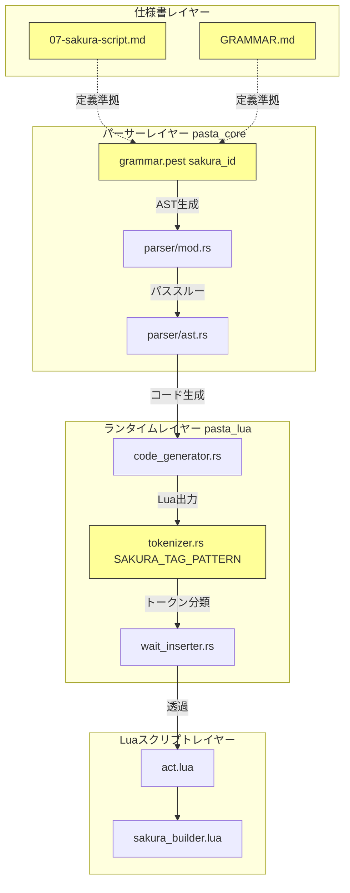
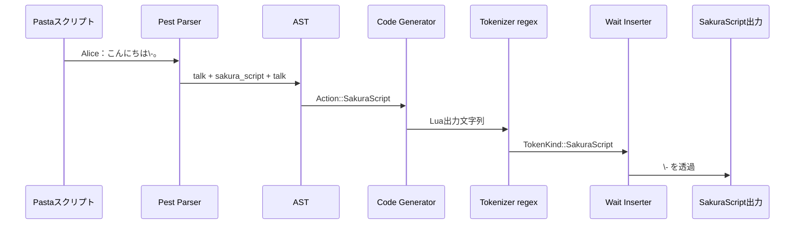

# Technical Design: sakura-script-dash-tag-fix

## Overview

本設計は、Pasta DSLのさくらスクリプトタグ文字クラスに5文字（`-`, `+`, `*`, `?`, `&`）を追加し、ukadoc公式タグリストに記載された全さくらスクリプトタグを認識可能にする。

**Purpose**: ukadocに定義された `\-`（ゴースト終了）、`\+`（ランダム交代）、`\*`（選択タイムアウト無効）、`\_?`（タグ表示モード）、`\&[ID]`（エンティティ参照）等のタグが「ブラックホール問題」（パーサーがどのルールにもマッチできずエラー）を起こさず、正しくさくらスクリプトとして認識・透過されるようにする。

**Users**: Pasta DSLスクリプト作者が、ukadocに記載された全さくらスクリプトタグをPastaスクリプト内で自然に使用できるようになる。

**Impact**: 4箇所の文字クラス定義を同期的に拡張する。パイプライン下流（AST、コード生成、Luaランタイム、ウェイト挿入）は既にパススルー設計であり変更不要。

### Goals
- ukadoc記載の全さくらスクリプトタグを認識可能にする
- 4箇所の文字クラス定義（仕様書×2、Pest文法、ランタイムregex）を一貫して更新する
- 既存タグのパース・トークナイズにリグレッションを発生させない
- テストケースで5文字すべての認識を検証する

### Non-Goals
- さくらスクリプトの意味解釈（Pastaはタグの意味を解釈しない設計方針を維持）
- 角括弧内容（`bracket_content`）の構文変更
- ukadocに存在しない記号文字の対応
- Luaランタイムスクリプト（`act.lua`, `sakura_builder.lua`）の変更

## Architecture

### Existing Architecture Analysis

現在のさくらスクリプト処理パイプライン:

```
Pasta DSL → [Pest Parser] → AST → [Code Generator] → Lua → [Tokenizer (regex)] → Wait Insertion → SakuraScript出力
```

**変更が必要なコンポーネント**: パイプラインの入口2箇所のみ

1. **Pest Parser**（`grammar.pest` L171）: 文字クラス定義 — 入口ゲート
2. **Tokenizer regex**（`tokenizer.rs` L113）: 文字クラス定義 — 再トークナイズゲート

**変更不要なコンポーネント**（確認済み9箇所）:

| コンポーネント | 理由 |
|---------------|------|
| `parser/ast.rs` | `Action::SakuraScript { script: String }` — 文字列パススルー |
| `parser/mod.rs` | `inner.as_str().to_string()` — Pest出力をそのまま格納 |
| `code_generator.rs` | `StringLiteralizer::literalize()` — Lua long string形式で透過 |
| `string_literalizer.rs` | `\` 含有で long string自動選択、追加文字に影響なし |
| `act.lua` | `sakura_script` トークン蓄積のみ（パススルー） |
| `sakura_builder.lua` | `sakura_script` タイプをバッファ追加のみ |
| `wait_inserter.rs` | `TokenKind::SakuraScript => None` — ウェイト非挿入で透過 |
| `runtime/mod.rs` | sakura_scriptモジュール登録のみ |
| `doc/spec/02-markers.md` | エスケープ文字定義、sakura_tokenとは独立 |

### Architecture Pattern & Boundary Map



黄色のノードが変更対象（4箇所）。それ以外はパススルーにより変更不要。

**Architecture Integration**:
- **Selected pattern**: 既存文字クラスの拡張（新コンポーネント不要）
- **Domain boundaries**: pasta_core（パーサー）とpasta_lua（ランタイム）の2クレート境界を横断するが、変更は各クレート内の独立した文字クラス定義のみ
- **Existing patterns preserved**: Pestの ordered choice パターン、regexの文字クラスパターン
- **Steering compliance**: テスト戦略（`<feature>_test.rs`）、レイヤー分離原則に準拠

### Technology Stack

| Layer | Choice / Version | Role in Feature | Notes |
|-------|------------------|-----------------|-------|
| パーサー | Pest 2.8 | `sakura_id` ルールの文字クラス拡張 | PEGリテラル追加のみ |
| ランタイム | regex 1.x (Rust) | `SAKURA_TAG_PATTERN` の文字クラス拡張 | 文字クラス内なので特殊文字エスケープ不要 |
| テスト | Rust標準テスト | パーステスト・トークナイズテスト追加 | 既存パターン準拠 |

新規依存ライブラリの追加はなし。

## System Flows

本機能は文字クラスの拡張のみであり、データフローの変更はない。既存フロー:



**変更後の挙動差分**: `\-` がStep 2で `sakura_script` として認識される（現在は「ブラックホール」でパースエラー）。Step 3以降はパススルー設計のため挙動変化なし。

## Requirements Traceability

| Requirement | Summary | Components | Interfaces | Flows |
|-------------|---------|------------|------------|-------|
| 1.1 | 仕様書に `-+*?&` 追加 | `07-sakura-script.md`, `GRAMMAR.md` | — | — |
| 1.2 | 追加タグを有効タグとして受理 | `07-sakura-script.md`, `GRAMMAR.md` | — | — |
| 1.3 | 文字クラス表記 `[!\-+*?&_a-zA-Z0-9]+` | `07-sakura-script.md`, `GRAMMAR.md` | — | — |
| 2.1 | パーサーが5文字タグをAST認識 | `grammar.pest` | `sakura_id` rule | パースフロー |
| 2.2 | 角括弧なしタグのsakura_id認識 | `grammar.pest` | `sakura_id` rule | パースフロー |
| 2.3 | `\-` を含む混合テキストの3要素分割 | `grammar.pest` | `action` rule | パースフロー |
| 2.4 | 既存タグのリグレッション防止 | `grammar.pest` | 全sakura関連ルール | パースフロー |
| 3.1 | Tokenizerが5文字タグをSakuraScript分類 | `tokenizer.rs` | `SAKURA_TAG_PATTERN` | トークナイズフロー |
| 3.2 | `\-` 前後テキスト分割 | `tokenizer.rs` | `tokenize()` | トークナイズフロー |
| 3.3 | ウェイト挿入での透過 | `wait_inserter.rs`（変更不要） | `TokenKind::SakuraScript` | ウェイト挿入フロー |
| 3.4 | 既存regexのリグレッション防止 | `tokenizer.rs` | `SAKURA_TAG_PATTERN` | トークナイズフロー |
| 4.1 | 4箇所の文字セット同一性 | 全4箇所 | — | — |
| 4.2 | 5文字テストケースの網羅 | テストファイル群 | — | テストフロー |
| 4.3 | 変更箇所リストのドキュメント化 | `07-sakura-script.md` | — | — |

## Components and Interfaces

| Component | Domain/Layer | Intent | Req Coverage | Key Dependencies | Contracts |
|-----------|--------------|--------|--------------|------------------|-----------|
| sakura_id rule | Parser / pasta_core | さくらスクリプトID文字クラス定義 | 2.1, 2.2, 2.3, 2.4 | grammar.pest (P0) | — |
| SAKURA_TAG_PATTERN | Runtime / pasta_lua | ランタイムトークナイズ用正規表現 | 3.1, 3.2, 3.3, 3.4 | regex crate (P0) | — |
| 07-sakura-script.md | Spec / doc | 言語仕様書 sakura_token 定義 | 1.1, 1.2, 1.3, 4.1, 4.3 | — | — |
| GRAMMAR.md | Spec / doc | 文法リファレンス sakura_token 定義 | 1.1, 1.2, 1.3, 4.1 | 07-sakura-script.md と同期 (P0) | — |
| sakura_symbol_tag_test | Test / pasta_core | パーサーレイヤーの5文字タグパーステスト | 2.1, 2.2, 2.3, 2.4, 4.2 | pasta_core parser API (P0) | — |
| tokenizer内テスト | Test / pasta_lua | ランタイムレイヤーの5文字タグトークナイズテスト | 3.1, 3.2, 3.4, 4.2 | Tokenizer API (P0) | — |

### Parser Layer (pasta_core)

#### sakura_id rule (grammar.pest)

| Field | Detail |
|-------|--------|
| Intent | さくらスクリプトタグのID部分を構成する文字クラスを定義する |
| Requirements | 2.1, 2.2, 2.3, 2.4 |

**Responsibilities & Constraints**
- `\` の直後に続く1文字以上のID部分をマッチする
- `action` ルール内の ordered choice で `sakura_escape`（`\\`）の後に評価される
- `talk_word` が `sakura_marker`（`\`）を除外するため、`sakura_id` にマッチしない文字が続くとパースエラーになる（ブラックホール問題）

**Dependencies**
- Inbound: `sakura_script` rule — `sakura_marker ~ sakura_id ~ sakura_args?` として呼び出し (P0)
- Outbound: なし
- External: Pest 2.8 PEGパーサー生成器 (P0)

**変更内容**

現在:
```pest
sakura_id = @{ (('a'..'z') | ('A'..'Z') | ('0'..'9') | "_" | "!" )+ }
```

変更後:
```pest
sakura_id = @{ (('a'..'z') | ('A'..'Z') | ('0'..'9') | "_" | "!" | "-" | "+" | "*" | "?" | "&" )+ }
```

**Implementation Notes**
- Pest文法では各文字は `"x"` リテラルとして個別に追加（正規表現の文字クラスとは異なる）
- `"-"` はPest文字列リテラルなので範囲指定の問題なし
- `"*"`, `"+"`, `"?"` はPest文字列リテラルなのでPEG量指定子として解釈されない
- ordered choice の評価順に影響なし（`sakura_id` 内は代替文字の列挙のみ）

### Runtime Layer (pasta_lua)

#### SAKURA_TAG_PATTERN (tokenizer.rs)

| Field | Detail |
|-------|--------|
| Intent | Lua出力テキスト中のさくらスクリプトタグを正規表現で検出する |
| Requirements | 3.1, 3.2, 3.3, 3.4 |

**Responsibilities & Constraints**
- `\` の後に続く1文字以上のタグID（＋オプションの `[...]` 引数）をマッチする
- `Tokenizer::tokenize()` メソッドで優先的にマッチし、`TokenKind::SakuraScript` を返す
- マッチしない文字は1文字ずつ `CharSets` で分類される

**Dependencies**
- Inbound: `Tokenizer::tokenize()` — regex を使用してテキストからSakuraScriptトークンを抽出 (P0)
- Outbound: `TokenKind::SakuraScript` — Wait Inserter が透過処理に使用 (P1)
- External: Rust `regex` 1.x クレート (P0)

**変更内容**

現在:
```rust
const SAKURA_TAG_PATTERN: &'static str = r"\\[0-9a-zA-Z_!]+(?:\[[^\]]*\])?";
```

変更後:
```rust
const SAKURA_TAG_PATTERN: &'static str = r"\\[0-9a-zA-Z_!+*?&-]+(?:\[[^\]]*\])?";
```

**Implementation Notes**
- **`-` の配置**: 文字クラス `[]` の**末尾**に配置して範囲指定と誤解されないようにする
- **`+`, `*`, `?` のエスケープ**: 文字クラス `[]` 内ではリテラルとして扱われるためエスケープ不要
- **`&` の扱い**: 正規表現の特殊文字ではないため、どの位置でもリテラル
- 推奨文字クラス順: `[0-9a-zA-Z_!+*?&-]`（英数字 → 既存記号 → 新規記号 → ハイフン末尾）

### Specification Layer (doc)

#### 07-sakura-script.md

| Field | Detail |
|-------|--------|
| Intent | Pasta DSL言語仕様書のさくらスクリプト章における `sakura_token` 文字クラス定義 |
| Requirements | 1.1, 1.2, 1.3, 4.1, 4.3 |

**変更内容**

1. `sakura_token` 定義の変更:
   - 現在: `sakura_token ::= [!_a-zA-Z0-9]+`
   - 変更後: `sakura_token ::= [!\-+*?&_a-zA-Z0-9]+`
2. 説明文の更新: 「ASCII 英数字 + `_` + `!`」→「ASCII 英数字 + `_` + `!` + `-` + `+` + `*` + `?` + `&`」
3. **同期箇所一覧の追記**（4.3対応）: `sakura_token` 文字クラス変更時に更新すべき4箇所を明記

#### GRAMMAR.md

| Field | Detail |
|-------|--------|
| Intent | 人間向け文法リファレンスの `sakura_token` 定義を仕様書と同期 |
| Requirements | 1.1, 1.2, 1.3, 4.1 |

**変更内容**
- L508: `sakura_token ::= [!_a-zA-Z0-9]+` → `sakura_token ::= [!\-+*?&_a-zA-Z0-9]+`

## Testing Strategy

### Unit Tests: tokenizer.rs 内テスト（pasta_lua）

`tokenizer.rs` の `#[cfg(test)] mod tests` に追加:

| テスト名 | 対象タグ | 検証内容 | Req |
|---------|---------|---------|-----|
| `test_tokenize_symbol_tag_hyphen` | `\-` | `TokenKind::SakuraScript`, `text == r"\-"` | 3.1 |
| `test_tokenize_symbol_tag_plus` | `\+` | `TokenKind::SakuraScript`, `text == r"\+"` | 3.1 |
| `test_tokenize_symbol_tag_asterisk` | `\*` | `TokenKind::SakuraScript`, `text == r"\*"` | 3.1 |
| `test_tokenize_symbol_tag_underscore_question` | `\_?` | `TokenKind::SakuraScript`, `text == r"\_?"` | 3.1 |
| `test_tokenize_symbol_tag_ampersand` | `\&[ID]` | `TokenKind::SakuraScript`, `text == r"\&[ID]"` | 3.1 |
| `test_tokenize_symbol_tag_mixed_text` | `こんにちは\-。` | 3要素分割: General×5 + SakuraScript + Period | 3.2 |

### Integration Tests: pasta_core パーサーテスト

新規ファイル `crates/pasta_core/tests/sakura_symbol_tag_test.rs` を作成:

| テスト名 | 入力 | 検証内容 | Req |
|---------|------|---------|-----|
| `test_parse_sakura_hyphen_tag` | `＊test\nAlice：\-` | `Action::SakuraScript` で `script == r"\-"` | 2.1, 2.2 |
| `test_parse_sakura_plus_tag` | `＊test\nAlice：\+` | `Action::SakuraScript` で `script == r"\+"` | 2.1, 2.2 |
| `test_parse_sakura_asterisk_tag` | `＊test\nAlice：\*` | `Action::SakuraScript` で `script == r"\*"` | 2.1, 2.2 |
| `test_parse_sakura_underscore_question_tag` | `＊test\nAlice：\_?` | `Action::SakuraScript` で `script == r"\_?"` | 2.1, 2.2 |
| `test_parse_sakura_ampersand_tag` | `＊test\nAlice：\&[entity]` | `Action::SakuraScript` で `script == r"\&[entity]"` | 2.1, 2.2 |
| `test_parse_sakura_symbol_in_mixed_text` | `＊test\nAlice：こんにちは\-。` | talk + sakura_script + talk の3要素分割 | 2.3 |
| `test_parse_existing_tags_no_regression` | `＊test\nAlice：\h\s[0]\_w[500]` | 既存タグが正常にパースされる | 2.4 |

### Regression Tests: 既存テストの活用

- `cargo test --workspace` で全既存テスト（340+）が引き続きパスすることを確認
- 特に `sakura_script_integration_test.rs`（644行、既存テスト群）でリグレッションなしを確認

## Error Handling

本機能は文字クラスの拡張のみであり、新規エラーパスの追加はない。

- **パーサーエラー**: 文字クラス拡張により、従来パースエラーだった `\-` 等が正常にパースされるようになる（エラーの減少）
- **regex エラー**: `SAKURA_TAG_PATTERN` の文字クラス変更のみであり、正規表現コンパイルエラーのリスクはない（テストで検証）

## 同期箇所一覧（Req 4.3）

`sakura_token` の文字クラスを変更する場合、以下の4箇所を**必ず同時に**更新すること:

| # | ファイル | 場所 | 形式 |
|---|---------|------|------|
| 1 | `doc/spec/07-sakura-script.md` | §7.3 sakura_token定義 | EBNF文字クラス |
| 2 | `GRAMMAR.md` | L508付近 sakura_token定義 | EBNF文字クラス |
| 3 | `crates/pasta_core/src/parser/grammar.pest` | L171 sakura_id | Pest ordered choice |
| 4 | `crates/pasta_lua/src/sakura_script/tokenizer.rs` | L113 SAKURA_TAG_PATTERN | Rust regex文字クラス |

**テストファイル**（文字クラス変更時にテストケース追加が必要）:

| # | ファイル | 種類 |
|---|---------|------|
| 5 | `crates/pasta_core/tests/sakura_symbol_tag_test.rs` | パーサー統合テスト |
| 6 | `crates/pasta_lua/src/sakura_script/tokenizer.rs` テスト | トークナイザー単体テスト |
