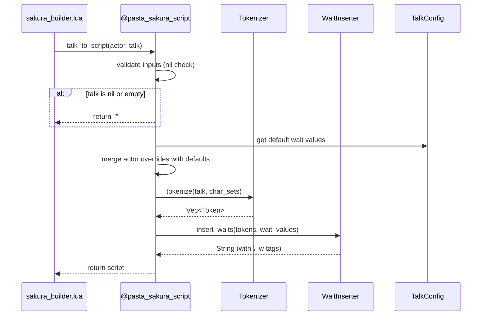
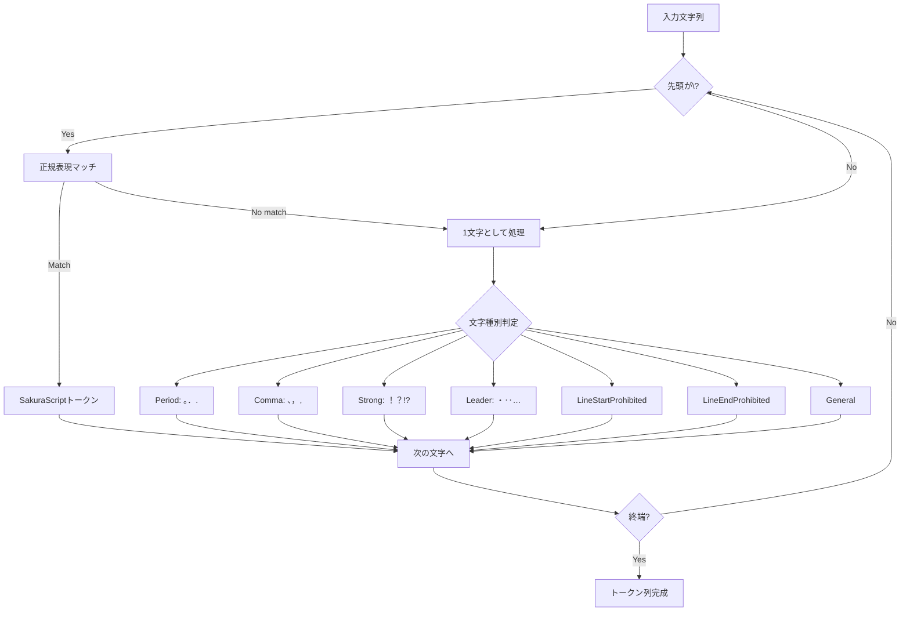
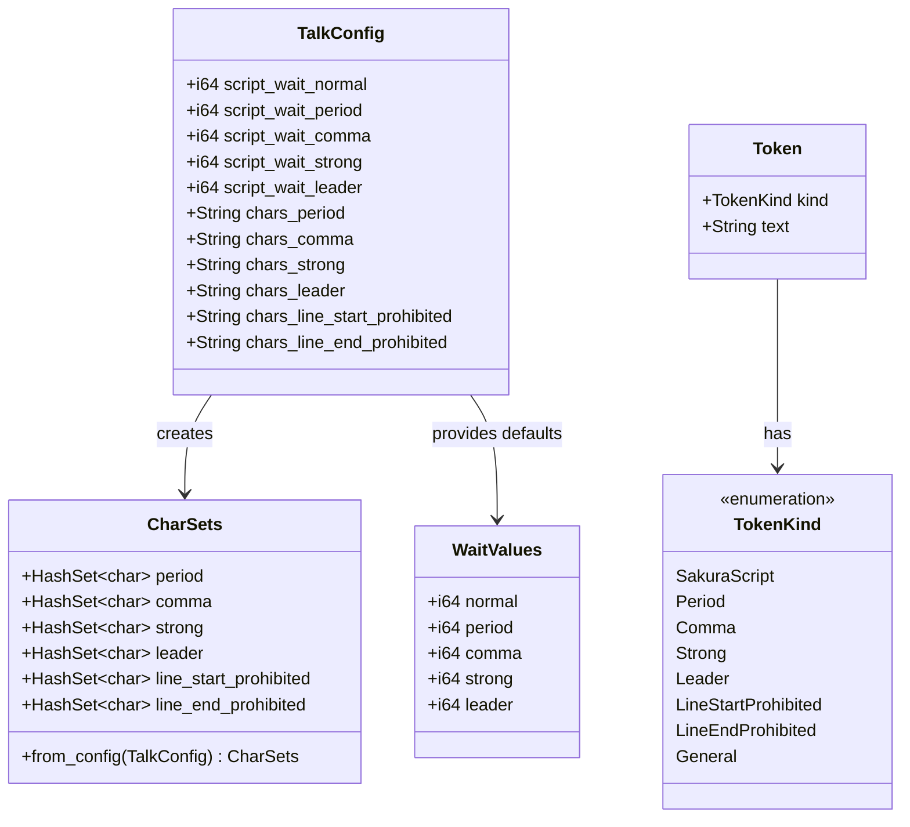

# Technical Design Document: sakura-script-wait

## Overview

**Purpose**: 会話テキストに対してさくらスクリプトウェイト（`\_w[ms]`）を自動付与する機能を提供し、自然な会話テンポを表現する。

**Users**: ゴースト開発者がLuaスクリプト（`sakura_builder.lua`等）から本モジュールを呼び出し、`talk`トークン処理時にウェイト付きスクリプトを取得する。

**Impact**: `pasta_lua`クレートに新規モジュール`sakura_script`を追加。既存のモジュール登録パターンに従い、設定は`PastaConfig`経由で提供。

### Goals

- 日本語テキストの文字種別（句点・読点・強調記号等）に応じたウェイト自動挿入
- キャラクター固有のウェイト設定（actor パラメーター）のサポート
- pasta.tomlでのデフォルト設定および対象文字セットのカスタマイズ
- 既存さくらスクリプトタグの保護（分解しない）

### Non-Goals

- さくらスクリプトのバリデーション（構文チェック）
- 改行やフォーマット制御
- サウンド・アニメーション等のタグ自動挿入
- 他言語（英語等）向け最適化

---

## Architecture

### Architecture Pattern & Boundary Map

```mermaid
graph TB
    subgraph "pasta_lua crate"
        subgraph "loader/"
            CONFIG[config.rs<br/>TalkConfig追加]
        end
        
        subgraph "sakura_script/ (新規)"
            MOD[mod.rs<br/>register関数]
            TOK[tokenizer.rs<br/>トークン分解]
            WAIT[wait_inserter.rs<br/>ウェイト挿入]
        end
        
        subgraph "runtime/"
            RUNTIME[mod.rs<br/>初期化時登録]
        end
    end
    
    subgraph "Lua側"
        BUILDER[sakura_builder.lua]
        ACTOR[CONFIG.actor.XXX]
    end
    
    BUILDER -->|require "@pasta_sakura_script"| MOD
    BUILDER -->|talk_to_script\nactor, talk| MOD
    MOD --> TOK
    MOD --> WAIT
    MOD -->|設定参照| CONFIG
    ACTOR -->|ウェイト値| MOD
    
    RUNTIME -->|register_sakura_script_module| MOD
```

**Architecture Integration**:
- **Selected pattern**: Hybrid（独立モジュール + 設定統合）
- **Domain boundaries**: `sakura_script/`はトークン分解とウェイト挿入を担当、設定は`loader/config.rs`に統合
- **Existing patterns preserved**: `@pasta_*`モジュール登録パターン、`PastaConfig`アクセサパターン
- **New components rationale**: 
  - `sakura_script/mod.rs`: Lua API公開、`@pasta_sakura_script`モジュール登録
  - `sakura_script/tokenizer.rs`: 文字種別判定とトークン分解ロジック
  - `sakura_script/wait_inserter.rs`: ウェイト計算と挿入ロジック
- **Steering compliance**: `tech.md`のレイヤー構成に従い、`runtime/`から呼び出される独立モジュールとして配置

### Technology Stack

| Layer   | Choice / Version    | Role in Feature                    | Notes        |
| ------- | ------------------- | ---------------------------------- | ------------ |
| Runtime | mlua 0.11 (Lua 5.5) | Lua VMバインディング、テーブル操作 | 既存         |
| Regex   | regex 1.x           | さくらスクリプトタグ検出           | **新規追加** |
| Config  | toml 0.9.8          | pasta.toml設定読み込み             | 既存         |
| Logging | tracing 0.1         | 警告ログ出力                       | 既存         |

---

## System Flows

### talk_to_script 処理フロー



### トークン分解ロジック



---

## Requirements Traceability

| Requirement | Summary                    | Components                     | Interfaces        | Flows                    |
| ----------- | -------------------------- | ------------------------------ | ----------------- | ------------------------ |
| 1.1         | Luaモジュール公開          | SakuraScriptModule             | register()        | -                        |
| 1.2         | talk_to_script関数         | SakuraScriptModule             | talk_to_script()  | talk_to_script処理フロー |
| 1.3         | nilフォールバック          | SakuraScriptModule, TalkConfig | -                 | -                        |
| 2.1         | actorパラメーター取得      | WaitValueResolver              | get_wait_values() | -                        |
| 2.2         | デフォルト値フォールバック | WaitValueResolver, TalkConfig  | -                 | -                        |
| 2.3         | 型検証                     | WaitValueResolver              | -                 | -                        |
| 3.1         | [talk]セクション認識       | TalkConfig                     | talk()            | -                        |
| 3.2         | 文字セット設定             | TalkConfig                     | CharSets          | -                        |
| 3.3         | セクション不在時デフォルト | TalkConfig                     | Default impl      | -                        |
| 3.4         | 不正型時警告               | TalkConfig                     | -                 | -                        |
| 4.1         | トークン分解               | Tokenizer                      | tokenize()        | トークン分解ロジック     |
| 4.2         | Unicode処理                | Tokenizer                      | -                 | -                        |
| 4.3         | タグ最優先マッチ           | Tokenizer                      | -                 | -                        |
| 5.1-5.6     | ウェイト挿入ルール         | WaitInserter                   | insert_waits()    | talk_to_script処理フロー |
| 6.1-6.3     | エラーハンドリング         | SakuraScriptModule             | -                 | -                        |
| 7.1-7.3     | 出力例                     | -                              | -                 | -                        |

---

## Components and Interfaces

### Component Summary

| Component          | Domain/Layer   | Intent                   | Req Coverage     | Key Dependencies           | Contracts |
| ------------------ | -------------- | ------------------------ | ---------------- | -------------------------- | --------- |
| TalkConfig         | loader/        | [talk]セクション設定管理 | 3.1-3.4          | toml (P1)                  | State     |
| SakuraScriptModule | sakura_script/ | Luaモジュール公開        | 1.1-1.3, 6.1-6.3 | mlua (P0), TalkConfig (P1) | Service   |
| Tokenizer          | sakura_script/ | 文字列トークン分解       | 4.1-4.3          | regex (P1)                 | Service   |
| WaitInserter       | sakura_script/ | ウェイト計算・挿入       | 5.1-5.6          | -                          | Service   |
| WaitValueResolver  | sakura_script/ | ウェイト値解決           | 2.1-2.3          | mlua (P0), TalkConfig (P1) | Service   |

---

### loader/

#### TalkConfig

| Field        | Detail                                    |
| ------------ | ----------------------------------------- |
| Intent       | pasta.toml [talk]セクションの設定値を保持 |
| Requirements | 3.1, 3.2, 3.3, 3.4                        |

**Responsibilities & Constraints**
- [talk]セクションのウェイト値と文字セットを保持
- 存在しない設定項目にはハードコードデフォルト値を提供
- 不正な型の設定値はログ警告後デフォルト値にフォールバック

**Dependencies**
- Inbound: SakuraScriptModule — 設定参照 (P1)
- Outbound: toml — デシリアライズ (P1)

**Contracts**: State [x]

##### State Management

```rust
/// [talk] セクションの設定構造体
#[derive(Debug, Clone, Deserialize)]
#[serde(default)]
pub struct TalkConfig {
    // ウェイト値（ミリ秒）
    pub script_wait_normal: i64,   // デフォルト: 50
    pub script_wait_period: i64,   // デフォルト: 1000
    pub script_wait_comma: i64,    // デフォルト: 500
    pub script_wait_strong: i64,   // デフォルト: 500
    pub script_wait_leader: i64,   // デフォルト: 200

    // 文字セット（対象文字の列挙）
    pub chars_period: String,              // デフォルト: "｡。．."
    pub chars_comma: String,               // デフォルト: "、，,"
    pub chars_strong: String,              // デフォルト: "？！!?"
    pub chars_leader: String,              // デフォルト: "･・‥…"
    pub chars_line_start_prohibited: String,  // デフォルト: "゛゜ヽヾゝゞ々ー）］｝」』):;]}｣､･ｰﾞﾟ"
    pub chars_line_end_prohibited: String,    // デフォルト: "（［｛「『([{｢"
}

impl Default for TalkConfig {
    fn default() -> Self {
        Self {
            script_wait_normal: 50,
            script_wait_period: 1000,
            script_wait_comma: 500,
            script_wait_strong: 500,
            script_wait_leader: 200,
            chars_period: "｡。．.".into(),
            chars_comma: "、，,".into(),
            chars_strong: "？！!?".into(),
            chars_leader: "･・‥…".into(),
            chars_line_start_prohibited: "゛゜ヽヾゝゞ々ー）］｝」』):;]}｣､･ｰﾞﾟ".into(),
            chars_line_end_prohibited: "（［｛「『([{｢".into(),
        }
    }
}
```

- **Persistence**: pasta.toml から読み込み、実行中は不変
- **Consistency**: シングルスレッド前提、同時アクセス考慮不要

**Implementation Notes**
- 配置: `crates/pasta_lua/src/loader/config.rs` に追加
- `PastaConfig::talk()` アクセサを追加

---

### sakura_script/

#### SakuraScriptModule

| Field        | Detail                                      |
| ------------ | ------------------------------------------- |
| Intent       | `@pasta_sakura_script`モジュールをLuaに公開 |
| Requirements | 1.1, 1.2, 1.3, 6.1, 6.2, 6.3                |

**Responsibilities & Constraints**
- `require "@pasta_sakura_script"` でモジュールテーブルを返す
- `talk_to_script(actor, talk)` 関数を提供
- エラー時は元文字列を返し、処理を中断しない

**Dependencies**
- Inbound: Lua側 — require呼び出し (P0)
- Outbound: Tokenizer — トークン分解 (P0)
- Outbound: WaitInserter — ウェイト挿入 (P0)
- Outbound: WaitValueResolver — ウェイト値解決 (P1)
- External: mlua — Lua VMバインディング (P0)

**Contracts**: Service [x]

##### Service Interface

```rust
/// モジュールをLuaに登録
/// 
/// # Arguments
/// * `lua` - Luaステート
/// * `config` - TalkConfig（Noneの場合はハードコードデフォルト使用）
/// 
/// # Returns
/// `@pasta_sakura_script`モジュールテーブル
pub fn register(lua: &Lua, config: Option<&TalkConfig>) -> LuaResult<Table>;

/// talk文字列にウェイトを挿入（Lua公開関数）
/// 
/// # Arguments
/// * `actor` - actorテーブル（ウェイト設定を含む）またはnil
/// * `talk` - 変換対象の文字列
/// 
/// # Returns
/// ウェイト挿入済みスクリプト文字列
fn talk_to_script(actor: Option<Table>, talk: String) -> LuaResult<String>;
```

- Preconditions: `lua`が有効なLuaステート
- Postconditions: `package.loaded["@pasta_sakura_script"]`にモジュール登録済み
- Invariants: 登録後の変更不可

**Implementation Notes**
- 配置: `crates/pasta_lua/src/sakura_script/mod.rs`
- `_VERSION`と`_DESCRIPTION`メタデータを含む
- `runtime/mod.rs`での登録コード例:
  ```rust
  // PastaRuntime::from_loader()内で初期化
  let talk_config = self.config().and_then(|c| c.talk());
  let sakura_module = sakura_script::register(&self.lua, talk_config.as_ref())?;
  self.register_module("@pasta_sakura_script", sakura_module)?;
  ```

---

#### Tokenizer

| Field        | Detail                                 |
| ------------ | -------------------------------------- |
| Intent       | 入力文字列を文字種別ごとにトークン分解 |
| Requirements | 4.1, 4.2, 4.3                          |

**Responsibilities & Constraints**
- さくらスクリプトタグを最優先でマッチング
- Unicode文字を正しく処理（grapheme単位ではなくchar単位）
- 文字セットは`TalkConfig`から取得

**Dependencies**
- Inbound: SakuraScriptModule — tokenize呼び出し (P0)
- External: regex — さくらスクリプトタグ検出 (P1)

**Contracts**: Service [x]

##### Service Interface

```rust
/// トークン種別
#[derive(Debug, Clone, PartialEq)]
pub enum TokenKind {
    SakuraScript,        // さくらスクリプトタグ
    Period,              // 句点文字
    Comma,               // 読点文字
    Strong,              // 強調記号
    Leader,              // リーダー文字
    LineStartProhibited, // 行頭禁則文字
    LineEndProhibited,   // 行末禁則文字
    General,             // 一般文字
}

/// トークン
#[derive(Debug, Clone)]
pub struct Token {
    pub kind: TokenKind,
    pub text: String,
}

/// 文字セット定義
pub struct CharSets {
    pub period: HashSet<char>,
    pub comma: HashSet<char>,
    pub strong: HashSet<char>,
    pub leader: HashSet<char>,
    pub line_start_prohibited: HashSet<char>,
    pub line_end_prohibited: HashSet<char>,
}

impl CharSets {
    /// TalkConfigから生成
    pub fn from_config(config: &TalkConfig) -> Self;
}

/// 入力文字列をトークン分解
/// 
/// # Arguments
/// * `input` - 入力文字列
/// * `char_sets` - 文字種別判定用セット
/// 
/// # Returns
/// トークン列
pub fn tokenize(input: &str, char_sets: &CharSets) -> Vec<Token>;
```

- Preconditions: `input`は有効なUTF-8文字列
- Postconditions: 全入力文字がいずれかのトークンに含まれる
- Invariants: トークン順序は入力文字列の出現順を保持

**Implementation Notes**
- 配置: `crates/pasta_lua/src/sakura_script/tokenizer.rs`
- 正規表現パターン: `\\[0-9a-zA-Z_!]+(?:\[[^\]]*\])?`
- `\`で始まる場合のみ正規表現マッチを試行（最適化）
- **Unicode結合文字処理**: Rust標準`chars()`イテレータに従い、結合文字は個別charとして扱う（例: `が`→`か`+`゛`の2char）。絵文字等の問題報告時は将来改善を検討
- **正規表現キャッシュ**: `Tokenizer`を構造体化し、コンパイル済み`Regex`インスタンスを保持することを推奨。または`lazy_static`/`OnceCell`使用でコンパイルコストを1回のみに削減

---

#### WaitInserter

| Field        | Detail                                               |
| ------------ | ---------------------------------------------------- |
| Intent       | トークン列にウェイトを挿入してスクリプト文字列を生成 |
| Requirements | 5.1, 5.2, 5.3, 5.4, 5.5, 5.6                         |

**Responsibilities & Constraints**
- ウェイト挿入ルールの実装
- 連続トークン処理時の最大ウェイト値追跡
- `\_w[ms]`形式での出力

**Dependencies**
- Inbound: SakuraScriptModule — insert_waits呼び出し (P0)

**Contracts**: Service [x]

##### Service Interface

```rust
/// ウェイト値セット
#[derive(Debug, Clone)]
pub struct WaitValues {
    pub normal: i64,   // 通常文字
    pub period: i64,   // 句点
    pub comma: i64,    // 読点
    pub strong: i64,   // 強調記号
    pub leader: i64,   // リーダー
}

/// トークン列にウェイトを挿入
/// 
/// # Arguments
/// * `tokens` - トークン列
/// * `wait_values` - ウェイト値セット
/// 
/// # Returns
/// ウェイト挿入済みスクリプト文字列
pub fn insert_waits(tokens: &[Token], wait_values: &WaitValues) -> String;
```

- Preconditions: `tokens`は有効なトークン列
- Postconditions: 全トークンが出力文字列に含まれる
- Invariants: ウェイト計算結果が0以下の場合はウェイトタグを挿入しない

**Implementation Notes**
- 配置: `crates/pasta_lua/src/sakura_script/wait_inserter.rs`
- 連続ぶら下げ文字処理: 状態変数`pending_max_wait`で最大値追跡

---

#### WaitValueResolver

| Field        | Detail                                        |
| ------------ | --------------------------------------------- |
| Intent       | actorテーブルとTalkConfigからウェイト値を解決 |
| Requirements | 2.1, 2.2, 2.3                                 |

**Responsibilities & Constraints**
- 3段階フォールバック: actor → TalkConfig → ハードコードデフォルト
- 数値以外の値はデフォルト値にフォールバック

**Dependencies**
- Inbound: SakuraScriptModule — get_wait_values呼び出し (P0)
- Outbound: TalkConfig — デフォルト値参照 (P1)
- External: mlua — Luaテーブル読み取り (P0)

**Contracts**: Service [x]

##### Service Interface

```rust
/// actorテーブルとTalkConfigからウェイト値を解決
/// 
/// # Arguments
/// * `actor` - actorテーブル（Optionでnil対応）
/// * `config` - TalkConfig（デフォルト値）
/// 
/// # Returns
/// 解決済みウェイト値セット
pub fn resolve_wait_values(actor: Option<&Table>, config: &TalkConfig) -> LuaResult<WaitValues>;
```

- Preconditions: なし（nil許容）
- Postconditions: 全ウェイト値が正の整数
- Invariants: フォールバック順序は常にactor → config → hardcoded

**Implementation Notes**
- 配置: `crates/pasta_lua/src/sakura_script/mod.rs`内（小規模のため独立ファイル不要）
- actorキー名: `script_wait_normal`, `script_wait_period`, `script_wait_comma`, `script_wait_strong`, `script_wait_leader`

---

## Data Models

### Domain Model



**Business Rules & Invariants**:
- ウェイト値は正の整数（0以下の場合はウェイト挿入をスキップ）
- 文字セットは重複なし（HashSet使用）
- トークン列は入力順序を保持

---

## Appendix

### pasta.toml 設定例

```toml
[talk]
# ウェイト値（ミリ秒）
script_wait_normal = 50
script_wait_period = 1000
script_wait_comma = 500
script_wait_strong = 500
script_wait_leader = 200

# 文字セット
chars_period = "｡。．."
chars_comma = "、，,"
chars_strong = "？！!?"
chars_leader = "･・‥…"
chars_line_start_prohibited = "゛゜ヽヾゝゞ々ー）］｝」』):;]}｣､･ｰﾞﾟ"
chars_line_end_prohibited = "（［｛「『([{｢"
```

### Lua使用例

```lua
local SAKURA = require "@pasta_sakura_script"

-- 基本使用
local script = SAKURA.talk_to_script(CONFIG.actor.sakura, "こんにちは。")
-- → "こ\_w[50]ん\_w[50]に\_w[50]ち\_w[50]は\_w[50]。\_w[950]"

-- actorがnilの場合（pasta.tomlデフォルト使用）
local script = SAKURA.talk_to_script(nil, "こんにちは。")

-- さくらスクリプトタグ保護
local script = SAKURA.talk_to_script(actor, "\\h\\s[0]こんにちは。")
-- → "\\h\\s[0]こ\_w[50]ん\_w[50]に\_w[50]ち\_w[50]は\_w[50]。\_w[950]"
```

### Supporting References

詳細な調査結果は[research.md](./research.md)を参照。
