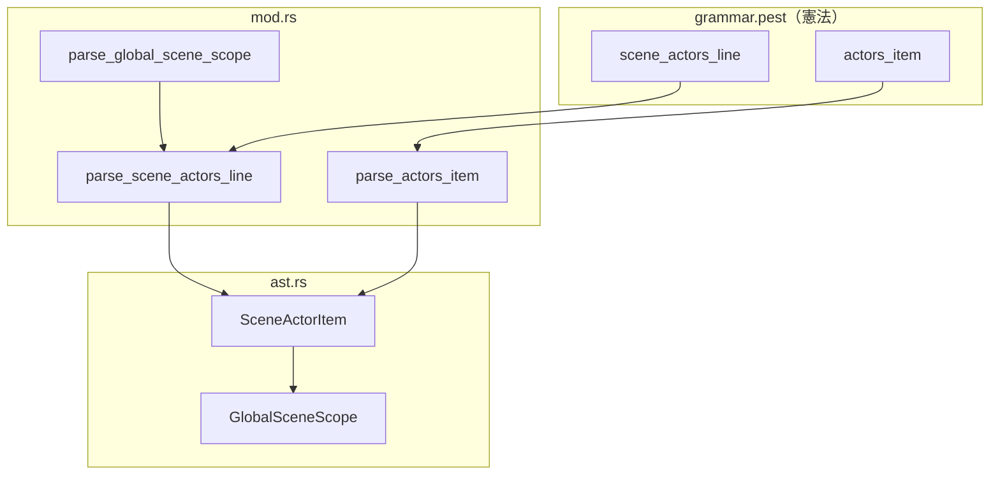
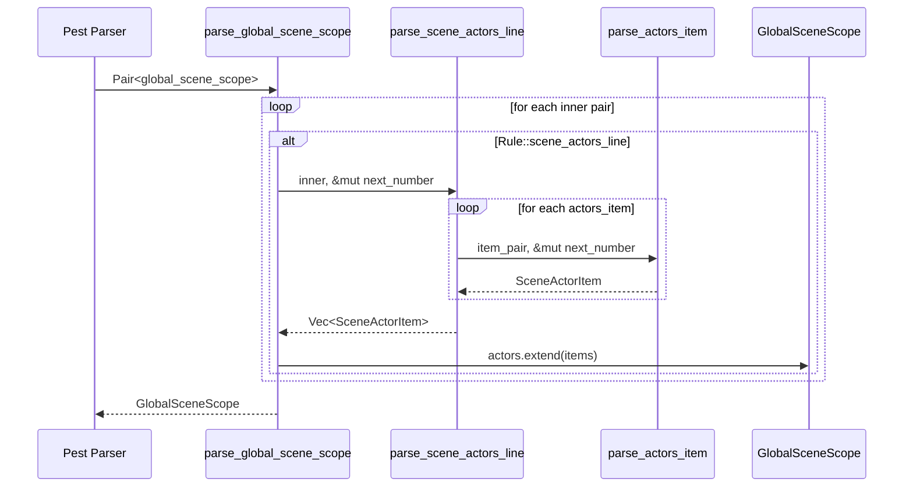
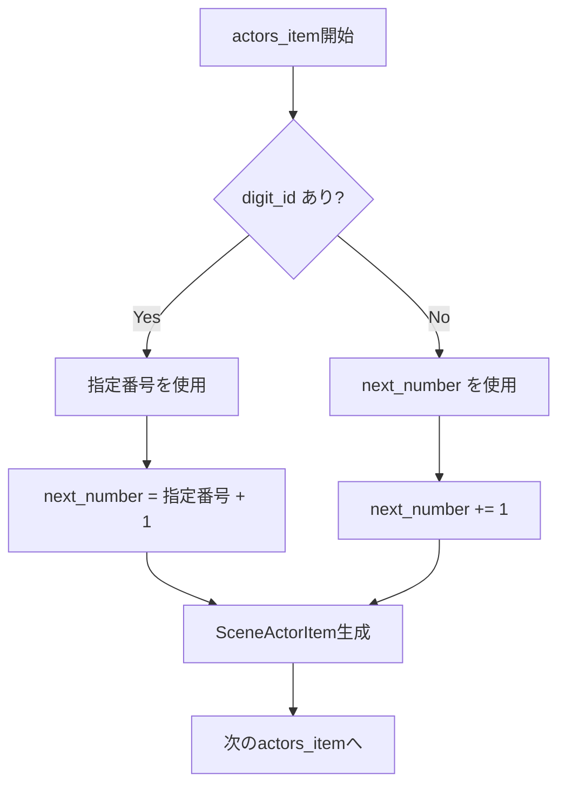

# 設計ドキュメント: scene-actors-ast-support

## 概要

**目的**: `scene_actors_line`文法に対応するAST構造を提供し、グローバルシーンに登場するアクターの一覧と番号を型安全に表現する。

**ユーザー**: pasta_coreを使用するパーサー開発者・トランスパイラ開発者が、シーンに紐づくアクター情報にアクセスできるようになる。

**影響**: `GlobalSceneScope`に`actors`フィールドを追加し、既存のパース処理を拡張する。

### ゴール
- `SceneActorItem`型を定義し、アクター名と番号（C#のenum採番ルール）を保持
- `GlobalSceneScope`への統合により、シーン単位でアクター情報を取得可能にする
- 既存パターンに準拠した最小限の変更で実装

### 非ゴール
- pasta_luaでのアクター情報の活用（将来仕様）
- アクター番号の検証・重複チェック（AST層では行わない）
- `scene_actors_line`のgrammar.pest変更（検証済みの憲法）

---

## アーキテクチャ

### 既存アーキテクチャ分析

**現在の`GlobalSceneScope`構造**:
```rust
pub struct GlobalSceneScope {
    pub name: String,
    pub is_continuation: bool,
    pub attrs: Vec<Attr>,        // ← 類似パターン
    pub words: Vec<KeyWords>,    // ← 類似パターン
    pub code_blocks: Vec<CodeBlock>,
    pub local_scenes: Vec<LocalSceneScope>,
    pub span: Span,
}
```

**パース処理パターン**（`parse_global_scene_scope`内）:
- `Rule::global_scene_attr_line` → `attrs.push()`
- `Rule::global_scene_word_line` → `words.push()`
- **新規**: `Rule::scene_actors_line` → `actors.extend()`

### アーキテクチャパターン & 境界マップ



**アーキテクチャ統合**:
- **選択パターン**: 既存コンポーネント拡張（Option A）
- **ドメイン境界**: pasta_core/parser内で完結
- **既存パターン維持**: `attrs`/`words`と同様の収集パターン
- **ステアリング準拠**: 型安全、明確な責務分離

### 技術スタック

| レイヤー | 選択 / バージョン | 役割 | 備考 |
|---------|------------------|------|------|
| パーサー | Pest 2.8 | PEG文法からRuleを生成 | 既存依存 |
| AST | Rust構造体 | 型安全なAST表現 | 既存パターン |
| 数値正規化 | `normalize_number_str` | 全角→半角変換 | 既存関数再利用 |

---

## システムフロー

### パース処理フロー



### 採番ロジックフロー



---

## 要件トレーサビリティ

| 要件 | 概要 | コンポーネント | インターフェース |
|------|------|---------------|-----------------|
| 1.1 | アクター名と番号を保持 | SceneActorItem | name: String, number: u32 |
| 1.2 | ソース位置情報を保持 | SceneActorItem | span: Span |
| 2.1 | actorsフィールド追加 | GlobalSceneScope | actors: Vec<SceneActorItem> |
| 2.2 | scene_actors_line出現時に追加 | parse_global_scene_scope | Rule::scene_actors_line分岐 |
| 2.3 | 複数行の蓄積 | parse_global_scene_scope | actors.extend() |
| 3.1 | 1行分のVec生成 | parse_scene_actors_line | -> Vec<SceneActorItem> |
| 3.2 | actors_item変換 | parse_actors_item | -> SceneActorItem |
| 3.3 | 番号指定時の設定 | parse_actors_item | number = 指定値 |
| 3.4 | 番号なし時の採番 | parse_actors_item | number = next_number++ |
| 3.5 | Span設定 | parse_actors_item | Span::from() |
| 4.1 | コンパイルエラー回避 | pasta_lua | actors: Vec::new() |
| 4.2 | フィールド無視 | pasta_lua | 変更なし |
| 5.1-5.5 | テスト | mod.rs tests | test_parse_scene_actors_* |

---

## コンポーネント & インターフェース

### コンポーネントサマリー

| コンポーネント | レイヤー | 目的 | 要件カバレッジ | 依存関係 |
|---------------|---------|------|---------------|---------|
| SceneActorItem | AST | アクター情報保持 | 1.1, 1.2 | Span (P0) |
| GlobalSceneScope | AST | actorsフィールド追加 | 2.1, 2.2, 2.3 | SceneActorItem (P0) |
| parse_scene_actors_line | Parser | 1行パース | 3.1 | parse_actors_item (P0) |
| parse_actors_item | Parser | 項目パース・採番 | 3.2, 3.3, 3.4, 3.5 | normalize_number_str (P1) |

---

### AST レイヤー

#### SceneActorItem

| フィールド | 詳細 |
|-----------|------|
| 目的 | シーンに登場するアクター1件の情報を保持 |
| 要件 | 1.1, 1.2 |

**責務 & 制約**
- アクター名（`String`）と番号（`u32`）を保持
- ソース位置情報（`Span`）を保持
- 番号は採番済みの最終値（`Option`ではない）

**依存関係**
- Inbound: parse_actors_item — 生成元 (P0)
- Outbound: なし

**コントラクト**: State ✓

##### 型定義
```rust
/// シーンに登場するアクター項目
/// 
/// grammar.pestの`actors_item = { id ~ ( s ~ set_marker ~ s ~ digit_id )? }`に対応。
/// 番号はC#のenum採番ルールで計算済みの値を保持する。
#[derive(Debug, Clone, PartialEq, Eq)]
pub struct SceneActorItem {
    /// アクター名
    pub name: String,
    /// アクター番号（C#のenum採番ルールで計算済み）
    pub number: u32,
    /// ソース位置
    pub span: Span,
}
```

---

#### GlobalSceneScope（拡張）

| フィールド | 詳細 |
|-----------|------|
| 目的 | actorsフィールドを追加し、シーンに紐づくアクター情報を保持 |
| 要件 | 2.1, 2.2, 2.3 |

**責務 & 制約**
- 既存フィールドに`actors: Vec<SceneActorItem>`を追加
- コンストラクタ（`new()`, `continuation()`）で`actors: Vec::new()`初期化

**依存関係**
- Inbound: parse_global_scene_scope — 生成元 (P0)
- Outbound: SceneActorItem — 保持する型 (P0)

**コントラクト**: State ✓

##### 変更差分
```rust
pub struct GlobalSceneScope {
    // ... 既存フィールド ...
    
    /// シーンに登場するアクター一覧
    pub actors: Vec<SceneActorItem>,  // ← 追加
    
    // ... 残りの既存フィールド ...
}

impl GlobalSceneScope {
    pub fn new(name: String) -> Self {
        Self {
            // ... 既存初期化 ...
            actors: Vec::new(),  // ← 追加
            // ...
        }
    }
    
    pub fn continuation(name: String) -> Self {
        Self {
            // ... 既存初期化 ...
            actors: Vec::new(),  // ← 追加
            // ...
        }
    }
}
```

---

### Parser レイヤー

#### parse_scene_actors_line

| フィールド | 詳細 |
|-----------|------|
| 目的 | 1行分の`scene_actors_line`をパースし、`Vec<SceneActorItem>`を返す |
| 要件 | 3.1 |

**責務 & 制約**
- `Pair<Rule::scene_actors_line>`を受け取り、内部の`actors_item`を順にパース
- 採番状態（`next_number`）を引数で受け取り、更新する

**依存関係**
- Inbound: parse_global_scene_scope — 呼び出し元 (P0)
- Outbound: parse_actors_item — 項目パース (P0)

**コントラクト**: Service ✓

##### 関数シグネチャ
```rust
/// scene_actors_lineをパースしてSceneActorItemのベクタを返す
/// 
/// # Arguments
/// * `pair` - Rule::scene_actors_lineのPair
/// * `next_number` - 次の採番値（可変参照、更新される）
/// 
/// # Returns
/// パースされたSceneActorItemのベクタ
fn parse_scene_actors_line(
    pair: Pair<Rule>,
    next_number: &mut u32,
) -> Result<Vec<SceneActorItem>, ParseError>
```

##### 処理ロジック
```rust
fn parse_scene_actors_line(
    pair: Pair<Rule>,
    next_number: &mut u32,
) -> Result<Vec<SceneActorItem>, ParseError> {
    let mut items = Vec::new();
    
    for inner in pair.into_inner() {
        if inner.as_rule() == Rule::actors_item {
            items.push(parse_actors_item(inner, next_number)?);
        }
    }
    
    Ok(items)
}
```

---

#### parse_actors_item

| フィールド | 詳細 |
|-----------|------|
| 目的 | 1件の`actors_item`をパースし、`SceneActorItem`を返す |
| 要件 | 3.2, 3.3, 3.4, 3.5 |

**責務 & 制約**
- `id`からアクター名を取得
- `digit_id`があれば指定番号を使用、なければ`next_number`を使用
- C#のenum採番ルールに従って`next_number`を更新

**依存関係**
- Inbound: parse_scene_actors_line — 呼び出し元 (P0)
- Outbound: normalize_number_str — 全角数字正規化 (P1)

**コントラクト**: Service ✓

##### 関数シグネチャ
```rust
/// actors_itemをパースしてSceneActorItemを返す
/// 
/// # Arguments
/// * `pair` - Rule::actors_itemのPair
/// * `next_number` - 次の採番値（可変参照、更新される）
/// 
/// # Returns
/// パースされたSceneActorItem
/// 
/// # 採番ルール（C#のenum方式）
/// - digit_idあり: 指定番号を使用、next_number = 指定番号 + 1
/// - digit_idなし: next_numberを使用、next_number += 1
fn parse_actors_item(
    pair: Pair<Rule>,
    next_number: &mut u32,
) -> Result<SceneActorItem, ParseError>
```

##### 処理ロジック
```rust
fn parse_actors_item(
    pair: Pair<Rule>,
    next_number: &mut u32,
) -> Result<SceneActorItem, ParseError> {
    let span = Span::from(&pair.as_span());
    let mut name = String::new();
    let mut explicit_number: Option<u32> = None;
    
    for inner in pair.into_inner() {
        match inner.as_rule() {
            Rule::id => {
                name = inner.as_str().to_string();
            }
            Rule::digit_id => {
                let normalized = normalize_number_str(inner.as_str());
                explicit_number = normalized.parse::<u32>().ok();
            }
            _ => {}
        }
    }
    
    // C#のenum採番ルール
    let number = match explicit_number {
        Some(n) => {
            *next_number = n + 1;
            n
        }
        None => {
            let n = *next_number;
            *next_number += 1;
            n
        }
    };
    
    Ok(SceneActorItem { name, number, span })
}
```

---

#### parse_global_scene_scope（拡張）

| フィールド | 詳細 |
|-----------|------|
| 目的 | `Rule::scene_actors_line`の分岐を追加 |
| 要件 | 2.2, 2.3 |

**変更差分**
```rust
fn parse_global_scene_scope(
    pair: Pair<Rule>,
    last_name: &mut Option<String>,
    filename: &str,
) -> Result<GlobalSceneScope, ParseError> {
    // ... 既存コード ...
    let mut actors = Vec::new();           // ← 追加
    let mut next_actor_number: u32 = 0;    // ← 追加

    for inner in pair.into_inner() {
        match inner.as_rule() {
            // ... 既存の分岐 ...
            
            Rule::scene_actors_line => {   // ← 追加
                let items = parse_scene_actors_line(inner, &mut next_actor_number)?;
                actors.extend(items);
            }
            
            // ... 残りの分岐 ...
        }
    }

    Ok(GlobalSceneScope {
        // ... 既存フィールド ...
        actors,                            // ← 追加
        // ...
    })
}
```

---

### pasta_lua レイヤー

#### 最小変更対応

| フィールド | 詳細 |
|-----------|------|
| 目的 | コンパイルエラー回避 |
| 要件 | 4.1, 4.2 |

**変更箇所**
- `transpiler.rs`: 変更なし（`actors`フィールドは無視）
- `code_generator.rs`: 変更なし
- `context.rs`: テスト内の`GlobalSceneScope`構築に`actors: Vec::new()`追加

##### テストコード修正例
```rust
fn create_test_scene(name: &str) -> GlobalSceneScope {
    GlobalSceneScope {
        name: name.to_string(),
        is_continuation: false,
        attrs: Vec::new(),
        words: Vec::new(),
        actors: Vec::new(),  // ← 追加
        code_blocks: Vec::new(),
        local_scenes: Vec::new(),
        span: Span::default(),
    }
}
```

---

## テスト設計

### テストケース

| テスト名 | 要件 | 入力 | 期待結果 |
|---------|------|------|---------|
| test_parse_scene_actors_single | 5.2 | `＊テスト\n  ％さくら\n  Alice：hello` | actors: [("さくら", 0)] |
| test_parse_scene_actors_with_number | 5.2 | `＊テスト\n  ％さくら、うにゅう＝２\n  Alice：hello` | actors: [("さくら", 0), ("うにゅう", 2)] |
| test_parse_scene_actors_enum_style | 5.3 | `％さくら、うにゅう＝２、まりか` | actors: [("さくら", 0), ("うにゅう", 2), ("まりか", 3)] |
| test_parse_scene_actors_multiline | 5.4 | `％さくら\n  ％うにゅう＝５\n  ％まりか` | actors: [("さくら", 0), ("うにゅう", 5), ("まりか", 6)] |
| test_parse_scene_actors_fullwidth | - | `％さくら＝１０` | actors: [("さくら", 10)] |

---

## 実装ノート

### ファイル変更サマリー

| ファイル | 変更内容 | 工数 |
|---------|---------|------|
| `crates/pasta_core/src/parser/ast.rs` | `SceneActorItem`追加、`GlobalSceneScope`拡張 | S |
| `crates/pasta_core/src/parser/mod.rs` | `parse_scene_actors_line`、`parse_actors_item`追加、`parse_global_scene_scope`拡張、テスト追加 | S |
| `crates/pasta_lua/src/transpiler.rs` | テスト内のGlobalSceneScope構築修正 | S |
| `crates/pasta_lua/src/context.rs` | テスト内のGlobalSceneScope構築修正 | S |

### リスク軽減策

| リスク | 軽減策 |
|-------|--------|
| 全角数字パースエラー | 既存`normalize_number_str`を再利用 |
| 採番状態管理漏れ | `next_number`を`&mut u32`で明示的に管理 |
| pasta_luaビルドエラー | テストコードのみ修正、本体は変更なし |
