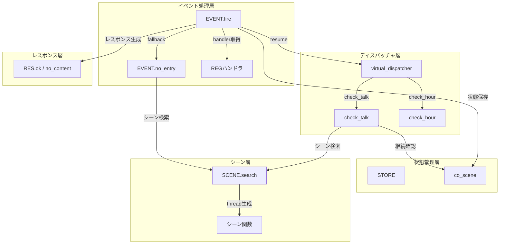
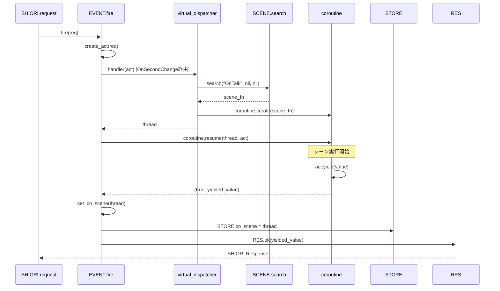
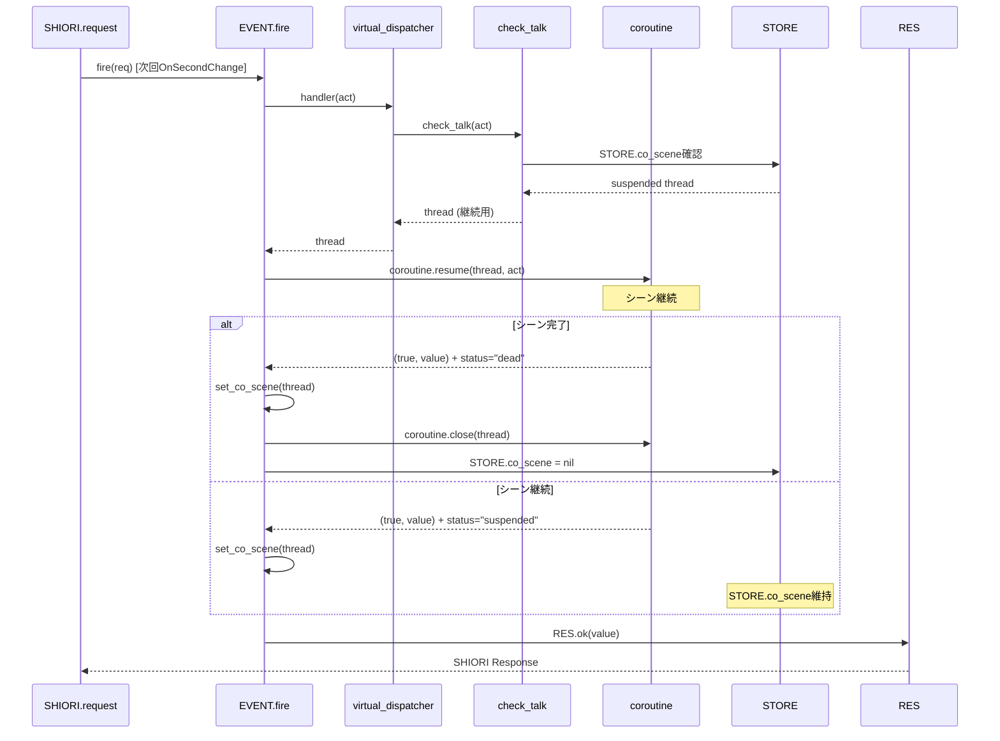
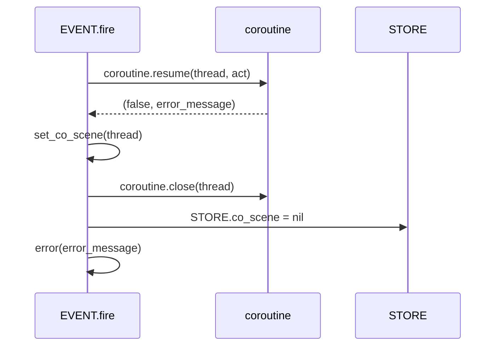

# 設計ドキュメント: scene-coroutine-execution

## Overview

**目的**: 本機能はPasta SHIORIランタイムにおいて、シーン関数をコルーチンとして実行し、`act:yield()`による中断と次回OnTalkでの継続（チェイントーク）を可能にする。

**ユーザー**: ゴースト開発者は長い対話を複数回のトークに分割し、自然な会話フローを実現できる。

**影響**: EVENT.fire、virtual_dispatcher、STOREモジュールを拡張し、コルーチンライフサイクル管理を導入する。

### Goals
- シーン関数をコルーチンとして実行可能にする
- `coroutine.close()`による厳密なリソース解放を保証
- OnTalkイベントでのチェイントーク継続を実現
- 既存ハンドラ（stringを返す）との後方互換性を維持

### Non-Goals
- OnHour/その他イベントでのチェイントーク（対象外）
- 複数の並行コルーチン管理（単一STORE.co_sceneのみ）
- コルーチン永続化（セッション中のみ）

---

## Architecture

### Existing Architecture Analysis

**現行パターン**:
- EVENT.fireはhandler(act)を直接呼び出し、戻り値をそのまま返す
- virtual_dispatcherはシーン関数を取得し直接実行する
- STOREはアプリケーション状態を一元管理するシングルトン

**拡張方針**:
- EVENT.fireでthread判定・resume・状態保存を追加
- virtual_dispatcherはthreadを返す形式に変更
- STOREにco_sceneフィールドを追加

### Architecture Pattern & Boundary Map



**選択パターン**: 既存コンポーネント拡張

**理由**:
- 最小限の変更で機能追加
- 既存アーキテクチャパターン踏襲
- 後方互換性をEVENT.fireで一元管理

### Technology Stack

| Layer | Choice / Version | Role in Feature | Notes |
|-------|------------------|-----------------|-------|
| Runtime | Lua 5.4 (mlua) | コルーチンAPI提供 | coroutine.close()はLua 5.4+ |
| Event | pasta/shiori/event | イベントディスパッチ | thread判定・resume追加 |
| State | pasta/store.lua | 状態管理 | co_sceneフィールド追加 |
| Response | pasta/shiori/res.lua | レスポンス生成 | nil/空文字列処理追加 |

---

## System Flows

### コルーチン実行フロー（初回）



### チェイントーク継続フロー



### エラー処理フロー



---

## Requirements Traceability

| Requirement | Summary | Components | Interfaces | Flows |
|-------------|---------|------------|------------|-------|
| 1.1-1.6 | コルーチン直接管理 | EVENT.fire | coroutine API | 全フロー |
| 2.1-2.8 | EVENT.fire拡張 | EVENT.fire, set_co_scene | fire(), set_co_scene() | 初回・継続・エラー |
| 3.1-3.4 | ハンドラ戻り値 | virtual_dispatcher, EVENT.no_entry | dispatch(), no_entry() | 初回 |
| 4.1-4.4 | virtual_dispatcher改良 | virtual_dispatcher | check_hour(), check_talk(), dispatch() | 初回 |
| 5.1-5.5 | チェイントーク継続 | check_talk, STORE | check_talk(), co_scene | 継続 |
| 6.1-6.4 | act:yield() | (既存) | yield() | 初回・継続 |
| 7.1-7.3 | STOREモジュール | STORE | co_scene, reset() | 全フロー |
| 8.1-8.5 | テスト | (新規テスト) | - | - |
| 9.1-9.3 | RES.ok()拡張 | RES | ok() | 全フロー |

---

## Components and Interfaces

### コンポーネントサマリー

| Component | Domain/Layer | Intent | Req Coverage | Key Dependencies | Contracts |
|-----------|--------------|--------|--------------|------------------|-----------|
| EVENT.fire | Event | ハンドラ実行・コルーチン管理 | 1, 2 | STORE (P0), RES (P0) | Service |
| set_co_scene | Event | STORE.co_scene統一管理 | 2.4 | STORE (P0), coroutine (P0) | Service |
| EVENT.no_entry | Event | 未登録イベントのフォールバック | 3.2 | SCENE (P1) | Service |
| virtual_dispatcher | Dispatcher | 仮想イベント振り分け | 3.1, 4, 5 | SCENE (P1), STORE (P0) | Service |
| STORE.co_scene | State | 継続コルーチン保存 | 7 | - | State |
| RES.ok | Response | レスポンス生成 | 9 | - | Service |

---

### Event Layer

#### EVENT.fire

| Field | Detail |
|-------|--------|
| Intent | ハンドラを実行し、コルーチンの場合はresumeして状態管理を行う |
| Requirements | 1.1-1.6, 2.1-2.8 |

**Responsibilities & Constraints**
- ハンドラ呼び出しと戻り値の型判定（thread/string/nil）
- threadの場合: `coroutine.resume(result, act)`で実行
- 状態管理: `set_co_scene()`でSTORE.co_sceneを更新
- エラー処理: resume失敗時はclose & 例外伝搬

**Dependencies**
- Inbound: SHIORI.request - イベントリクエスト (P0)
- Outbound: STORE.co_scene - 状態保存 (P0)
- Outbound: RES - レスポンス生成 (P0)

**Contracts**: Service [x]

##### Service Interface

```lua
--- イベント振り分け（拡張版）
--- @param req table リクエストテーブル（req.id にイベント名）
--- @return string SHIORI レスポンス
function EVENT.fire(req)
    local act = create_act(req)
    local handler = REG[req.id] or EVENT.no_entry
    local result = handler(act)
    
    -- 型判定
    if type(result) == "thread" then
        -- コルーチン実行
        local ok, yielded_value = coroutine.resume(result, act)
        if not ok then
            -- エラー処理
            set_co_scene(result)  -- closeされる
            error(yielded_value)
        end
        -- 状態保存（set_co_scene内部でstatus判断）
        set_co_scene(result)
        return RES.ok(yielded_value)
    elseif type(result) == "string" then
        -- 既存互換: 文字列をそのまま返す
        return RES.ok(result)
    else
        -- nil
        return RES.no_content()
    end
end
```

- Preconditions: req.idが存在すること
- Postconditions: STORE.co_sceneが適切に設定/クリアされること
- Invariants: コルーチンリークなし

---

#### set_co_scene

| Field | Detail |
|-------|--------|
| Intent | STORE.co_sceneを統一的に管理し、リソースリークを防止 |
| Requirements | 2.4 |

**Responsibilities & Constraints**
- 引数検証: suspended以外のコルーチンはclose
- 同一オブジェクトチェック: 自身をcloseしない
- 旧コルーチンclose: 存在すれば無条件close
- 上書き: coはsuspendedまたはnil確定

**Dependencies**
- Outbound: STORE.co_scene - 状態管理 (P0)
- External: coroutine.close() - リソース解放 (P0)

**Contracts**: Service [x]

##### Service Interface

```lua
--- STORE.co_sceneを統一管理するローカル関数
--- @param co thread|nil コルーチンまたはnil
local function set_co_scene(co)
    -- 1. 引数検証（suspended以外はclose）
    if co and coroutine.status(co) ~= "suspended" then
        coroutine.close(co)
        co = nil
    end

    -- 2. 同一オブジェクトチェック
    if STORE.co_scene == co then
        return
    end

    -- 3. 旧コルーチンをclose（存在すれば無条件）
    if STORE.co_scene then
        coroutine.close(STORE.co_scene)
    end

    -- 4. 上書き（coはsuspendedまたはnil確定）
    STORE.co_scene = co
end
```

- Preconditions: なし
- Postconditions: STORE.co_sceneはsuspendedコルーチンまたはnil
- Invariants: 旧コルーチンは必ずclose済み

---

#### EVENT.no_entry

| Field | Detail |
|-------|--------|
| Intent | 未登録イベントに対してシーン検索を試み、threadを返す |
| Requirements | 3.2 |

**Responsibilities & Constraints**
- シーン関数をSCENE.searchで検索
- 見つかった場合: `coroutine.create(scene_fn)`でthreadを返す
- 見つからない場合: nilを返す（EVENT.fireがno_content処理）

**Contracts**: Service [x]

##### Service Interface

```lua
--- デフォルトハンドラ（未登録イベント用）
--- @param act ShioriAct actオブジェクト
--- @return thread|nil コルーチンまたはnil
function EVENT.no_entry(act)
    local SCENE = require("pasta.scene")
    local scene_fn = SCENE.search(act.req.id, nil, nil)

    if scene_fn then
        -- threadを返す（実行はEVENT.fireに委譲）
        return coroutine.create(scene_fn)
    end

    return nil
end
```

---

### Dispatcher Layer

#### virtual_dispatcher

| Field | Detail |
|-------|--------|
| Intent | 仮想イベント（OnTalk/OnHour）の振り分けとthread生成 |
| Requirements | 3.1, 4.1-4.4, 5.1-5.5 |

**Responsibilities & Constraints**
- check_talk: チェイントーク継続（STORE.co_scene確認）または新規シーン検索
- check_hour: シーン検索してthread返却（チェイントーク非対応）
- dispatch: check_hour優先、次にcheck_talk

**Dependencies**
- Inbound: EVENT.fire - ディスパッチ依頼 (P0)
- Outbound: STORE.co_scene - 継続確認 (P0)
- Outbound: SCENE.search - シーン検索 (P1)

**Contracts**: Service [x]

##### Service Interface

```lua
--- シーン関数からthreadを生成（実行しない）
--- @param event_name string イベント名
--- @param act ShioriAct actオブジェクト（未使用、将来拡張用）
--- @return thread|nil コルーチンまたはnil
local function create_scene_thread(event_name, act)
    if scene_executor then
        -- テスト用オーバーライド
        return scene_executor(event_name, act)
    end

    local SCENE = require("pasta.scene")
    local scene_fn = SCENE.search(event_name, nil, nil)

    if not scene_fn then
        return nil
    end

    -- threadを返す（実行しない）
    return coroutine.create(scene_fn)
end

--- OnTalk判定・発行（チェイントーク対応）
--- @param act ShioriAct actオブジェクト
--- @return thread|nil コルーチンまたはnil
function M.check_talk(act)
    -- チェイントーク継続確認
    if STORE.co_scene then
        -- 継続用コルーチンを返す（新規シーン検索スキップ）
        return STORE.co_scene
    end

    -- 通常のOnTalk判定ロジック...
    -- (時刻判定等は既存ロジック維持)
    
    -- 新規シーンのthread生成
    return create_scene_thread("OnTalk", act)
end

--- OnHour判定・発行（チェイントーク非対応）
--- @param act ShioriAct actオブジェクト
--- @return thread|nil コルーチンまたはnil
function M.check_hour(act)
    -- (時刻判定は既存ロジック維持)
    
    -- 新規シーンのthread生成（毎回完結）
    return create_scene_thread("OnHour", act)
end

--- 仮想イベントディスパッチ
--- @param act ShioriAct actオブジェクト
--- @return thread|nil コルーチンまたはnil
function M.dispatch(act)
    local hour_result = M.check_hour(act)
    if hour_result then
        return hour_result
    end

    return M.check_talk(act)
end
```

---

### State Layer

#### STORE.co_scene

| Field | Detail |
|-------|--------|
| Intent | 継続用コルーチンを保存し、チェイントークを実現 |
| Requirements | 7.1-7.3 |

**Responsibilities & Constraints**
- nilで初期化
- suspended状態のthreadまたはnilを保持
- reset()時にclose処理

**Contracts**: State [x]

##### State Management

```lua
--- @field co_scene thread|nil 継続用コルーチン（OnTalkチェイントーク用）
STORE.co_scene = nil

--- 全データをリセット
function STORE.reset()
    -- 既存フィールドのリセット...
    
    -- co_sceneのクリーンアップ
    if STORE.co_scene and coroutine.status(STORE.co_scene) == "suspended" then
        coroutine.close(STORE.co_scene)
    end
    STORE.co_scene = nil
end
```

- State model: 単一コルーチン参照
- Persistence: セッション中のみ（永続化なし）
- Concurrency: 単一スレッド（Lua VM）

---

### Response Layer

#### RES.ok

| Field | Detail |
|-------|--------|
| Intent | nil/空文字列を自動的にno_contentに変換 |
| Requirements | 9.1-9.3 |

**Responsibilities & Constraints**
- nil → RES.no_content()
- 空文字列"" → RES.no_content()
- 有効な文字列 → 通常レスポンス

**Contracts**: Service [x]

##### Service Interface

```lua
--- 200 OK レスポンス（拡張版）
--- @param value string|nil Value ヘッダーの値
--- @param dic HeaderDic|nil 追加ヘッダー辞書
--- @return string SHIORI/3.0レスポンス文字列
function RES.ok(value, dic)
    -- nil/空文字列チェック
    if value == nil or value == "" then
        return RES.no_content(dic)
    end
    
    dic = dic or {}
    dic["Value"] = value
    return RES.build("200 OK", dic)
end
```

---

## Data Models

### Domain Model

**Aggregates**:
- STORE（ルート集約）: アプリケーション状態の一元管理
  - co_scene: 継続用コルーチン参照

**Entities**:
- thread（コルーチン）: Luaネイティブ型、ステートフル

**Business Rules**:
- STORE.co_sceneは常にsuspended状態またはnilのみ
- dead/running状態のコルーチンは即座にclose
- エラー発生時は即座にクリア

### Logical Data Model

**STORE.co_scene**:
- Type: `thread | nil`
- Cardinality: 0..1（単一参照）
- Lifecycle: セッション中のみ

**状態遷移**:
```
nil → suspended (yield時に設定)
suspended → nil (完了/エラー時にクリア)
suspended → suspended (複数yield)
```

---

## Error Handling

### Error Strategy

| エラー種別 | 対応 |
|-----------|------|
| coroutine.resume失敗 | close → エラー伝搬 |
| シーン関数未発見 | nil返却 → no_content |
| 不正なyield値 | RES.ok()で自動変換 |

### Error Categories and Responses

**System Errors**:
- resume失敗: `set_co_scene()`でclose、`error()`で伝搬
- SHIORI.requestのxpcallでキャッチ

**Business Logic Errors**:
- シーン未発見: 正常系として204 No Content

### Monitoring

- 既存のxpcallエラーハンドリングを活用
- エラー時はX-Error-Reasonヘッダーで理由を通知

---

## Testing Strategy

### Unit Tests
1. **set_co_scene()**: suspended/dead/nil各パターンの状態遷移
2. **RES.ok()拡張**: nil/空文字列/有効文字列の分岐
3. **STORE.reset()**: co_sceneのclose処理

### Integration Tests
1. **EVENT.fire thread処理**: handler→thread→resume→状態保存フロー
2. **チェイントーク継続**: yield→次回OnTalk→resume→完了
3. **エラー伝搬**: resume失敗→close→エラー

### E2E Tests
1. **シーン関数yield/resume**: 実際のシーン関数でact:yield()呼び出し
2. **複数yield**: 3回以上のyield→resume→完了
3. **エラー時クリーンアップ**: シーン関数内エラー→STORE.co_scene=nil確認

### Performance (optional)
- 特に性能要件なし（既存フローへの追加処理は軽量）

---

## Optional Sections

### Security Considerations

- コルーチンはLua VMサンドボックス内で実行
- 外部入力による直接的なコルーチン操作は不可
- 既存のセキュリティモデルを維持

---

## Supporting References

詳細な調査ログは [research.md](research.md) を参照。

- Lua 5.4 コルーチンAPI仕様
- 既存EVENT.fire実装パターン
- set_co_scene()設計決定プロセス
