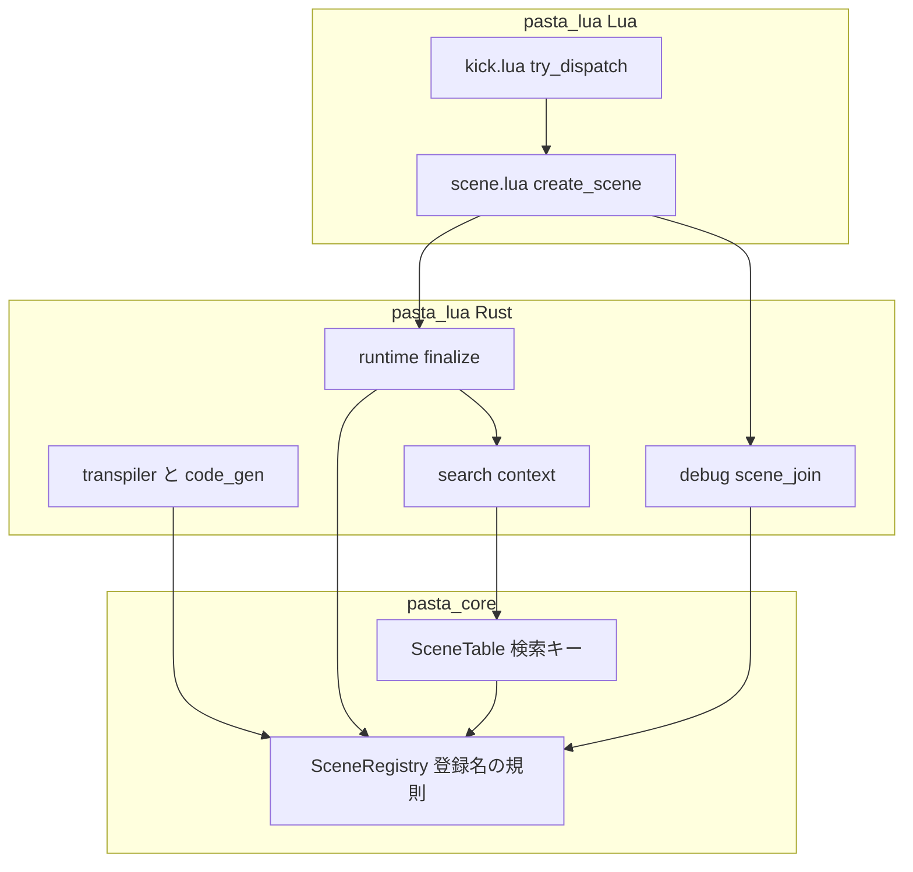
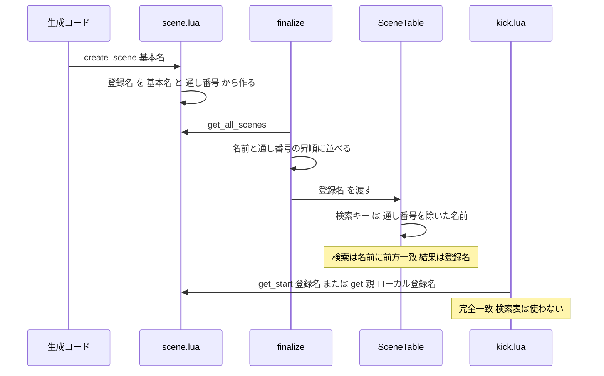

# Design Document: scene-identity-format

## Overview

**Purpose**: グローバルシーンの登録名を「照合用の名前＋`_`＋通し番号」にそろえ、シーン検索の照合相手を「通し番号を除いた照合用の名前」に変える。これにより、末尾が数字のシーン名でもシーンが消えず、`＞A1` が `＊A` を選ばず、デバッガの索引と位置からのキックが正しいシーンを選ぶ。

**Users**: Pasta DSL でゴーストを書く作者、Lua でゴーストを拡張する作者、デバッガ（DAP）でカーソル位置からシーンをキックする作者。

**Impact**: 登録名の形が `メイン1` から `メイン_1` に変わる（Lua に登録名を直書きしたコードの破壊的変更）。`search_scene` の第 1 引数に登録名を渡す使い方は成立しなくなる。生成コード（トランスパイラの出力）は 1 バイトも変わらない。

設計の中心は、research.md 7 章の Option D である。不具合の根は「1 つに特定する名前（登録名）を、名前で探すときの照合相手にも使っていること」であり、特定する名前と探す名前を分ける。

### Goals

- どんなシーン名でも登録名が一意で、最後の `_` と数字で一通りに分けられる（1.1〜1.6）。
- シーン検索は通し番号を除いた照合用の名前と前方一致させる（グローバル・ローカルとも。2.1〜2.12）。
- 位置からのキックは登録名の完全一致で引く（5.1〜5.5）。デバッガの索引は定義元のファイルごとに突き合わせる（4.1〜4.5）。
- 登録名を作る規則・分ける規則を Rust 1 か所・Lua 1 か所にまとめる（6.1〜6.3）。
- マニュアル 7 章と生成スキル `references/` を新形式にそろえる（7.1〜7.6）。

### Non-Goals

- 照合規則（`SceneRegistry::sanitize_name`）の変更。
- 前方一致・シャッフル＆順次消費・Call の 5 段の探索順の変更。
- ローカルシーンの登録名の形式（`選択肢_1`）と通し番号の振り方の変更。
- 旧形式（`メイン1`）の別名受け付け、存在しない登録名の警告、照合用の名前が重なる名前の検出。
- 生成コードの形の変更（`PASTA.create_scene("基本名")`・`function SCENE.名前_N`）。
- `act.lua`・`actor.lua` の変更。

## Boundary Commitments

### This Spec Owns

- 登録名の形式（`照合用の名前_通し番号`）と、それを作る・分ける規則の定義（Rust: `pasta_core::SceneRegistry`、Lua: `pasta.scene` の `create_scene`）。
- シーン検索表（`SceneTable`）の検索キーの形（グローバル `名前`、ローカル `:親の登録名:名前`）。
- 辞書確定（`finalize_scene`）でのシーンの登録順（照合用の名前・通し番号の昇順）。
- トランスパイル時レジストリ（辞書確定前の `@pasta_search` の元）の登録名の形（単語スコープ名・ローカルシーンの番号）。
- 位置からのキックの解決手順（`kick.lua` の `KICK.try_dispatch` のシーン解決部分）。
- デバッガのシーン identity 索引の突き合わせ（`scene_join.rs`）。複数の `.pasta` ファイルに同名のグローバルシーンがある場合を含む。
- 上記に対応するマニュアルの記述と、修正を固定するテスト。

### Out of Boundary

- `act.lua`（`act-token-grouping-fix`）・`actor.lua`（`actor-proxy-act-delegation`）。本設計は 1 行も触れない。
- `pasta_core` の `registry/random.rs` と、`scene_table.rs` のシャッフル部分（`select_from_cache`）。`search-selector-indices` が持つ。
- 生成器（`code_gen`）の出力バイト列。ローカルシーン関数名の組み立てを共通関数に差し替えるだけで、出力は変えない。
- ローカルシーンの通し番号の採番キー（`scope_gen.rs` は生の名前ごとに数える）。変えない（Open Questions 5）。
- 辞書確定前のレジストリに、キャッシュ済みで再トランスパイルされなかったファイルのシーンが入らないこと（既存の制約）。変えない（Open Questions 3）。
- VSCode 拡張（シーン名を解析しない）、保存データ（登録名は永続化されない）。

### Allowed Dependencies

- `pasta_lua` → `pasta_core`（既存の方向。`transpiler.rs`・`code_gen`・`runtime/finalize.rs`・`debug/source_map` が `SceneRegistry` の関数を使う）。`pasta_core` は Lua に依存しない。
- `kick.lua` → `pasta.scene`（`SCENE.get`・`SCENE.get_start`）。`kick.lua` から `act:find_scene`・`SCENE.search`・`SCENE.co_exec` への依存は無くす。
- `scene.lua` は新しい依存を持たない。
- 照合規則は `SceneRegistry::sanitize_name` だけを使う（複製しない）。

### Revalidation Triggers

- 登録名の形式（区切り文字・順序）を変える → `call-execution-correctness`・`scene-attribute-store`・デバッガ・マニュアルを再確認する。
- `SceneRegistry::registered_name`・`split_registered_name` のシグネチャや分ける規則を変える → `scene_table.rs`・`finalize.rs`・`scene_join.rs` を再確認する。
- 検索キーの形を変える → `search-selector-indices`（候補の並びを整数で指す場合、その並びは本設計の「キーのバイト順、同じキーの中は通し番号順」が基準になる）を再確認する。
- 生成コードのローカル関数名・`PASTA.create_scene` の引数の形を変える → 本設計の分ける規則の前提（生成されたローカルシーン名は必ず `名前_番号`）を再確認する。
- `kick_pending` に登録名以外（作者が書いた名前など）を載せる経路を足す → キックの完全一致の前提を再確認する。

## Architecture

### Existing Architecture Analysis

コードを確かめた現状は次のとおりである。

- **登録名の生成元は 3 つあり、形式が食い違っている**。
  - 実行時: `pasta_scripts/pasta/scene.lua` 132 行 `base_name .. counter`（`メイン1`）。生成コードは `PASTA.create_scene("基本名")` と基本名だけを渡す。
  - トランスパイル時のシーン: `SceneRegistry::register_global` は `{sanitize}_{counter}::__start__`（`メイン_1`）。
  - トランスパイル時の単語スコープ: `transpiler.rs` 206 行 `format!("{}{}", …)`（`メイン1`）。
- **検索キーは登録名から作る**。`SceneTable::fn_name_to_search_key` が `fn_name` の `::` より前（グローバル）・`:親:ローカル`（ローカル）をそのままキーにする。検索は `SearchContext::search_scene` が名前をサニタイズしてから前方一致させる。
- **辞書確定は順序を持たない**。`collect_scenes` は Lua の `pairs` の順、`build_scene_registry` は `HashMap` の走査順で `register_global_raw` を呼ぶ。現状はキーが 1 シーン 1 つなので候補の並びはキーのバイト順で決まるが、同名シーンが同じキーに入ると登録順が並びを決める。
- **辞書確定前のローカルシーン**。`transpiler.rs` 222 行は `register_local` に定義位置（`local_idx + 1`。無名の開始シーンも数える）を渡すが、生成器（`scope_gen.rs` 177〜187 行）は名前ごとの通し番号で関数名を作る。両者は一致しない。
- **キック**。`kick.lua` 140〜150 行。グローバルは `SCENE.co_exec(act, name)`（`act:find_scene` の 5 段の探索）、ローカルは `SCENE.search(local, parent)`（前方一致）。`kick_pending` に載るのは、デバッガが確定した identity（`playscene.rs` の `build_kick_scene`）とリロードの予約文字列だけである。
- **デバッガの突き合わせ**。`scene_join.rs` の `split_runtime_global` が実行時の登録名の末尾の数字をすべて通し番号とみなす。記録側のキーは `G:{base}#{counter}`・`L:{base}#{counter}:{関数名}` で、登録名の形式とは独立している。
- **`pasta_shiori` のテスト支援スクリプト**。`crates/pasta_shiori/tests/support/scripts/pasta/scene.lua` は現行 `scene.lua` の複製ではなく、古いランタイムの写しである（`SCENE.search` を持たない）。113 行に同じ `base_name .. counter` がある。

### Architecture Pattern & Boundary Map



**Architecture Integration**:

- 採用パターン: 既存の拡張。`SceneRegistry::sanitize_name`（照合規則の一元化点）の隣に、登録名の規則を 2 関数で足す。新しい型・新しいモジュール・設定は足さない。
- 責務の分離: 「作る・分ける」は `pasta_core`、「実行時に作る」は `scene.lua` の `create_scene`、「探す」は `SceneTable`、「特定して引く」は `SCENE.get`・`SCENE.get_start`。
- 保つパターン: 生成コードが基本名だけを渡し Lua が通し番号を振る構造、`join_key` の形、`SearchContext` の API、キックの保留フラグ方式。
- 新しい部品: `SceneRegistry::registered_name`・`SceneRegistry::split_registered_name` の 2 関数だけ。
- 依存方向: `pasta_core` ← `pasta_lua`（Rust）← Lua スクリプト。逆向きの依存は足さない。

### Technology Stack

| Layer | Choice / Version | Role in Feature | Notes |
|-------|------------------|-----------------|-------|
| Core | `pasta_core`（Rust 2024） | 登録名の規則・検索キー | 新しい依存なし |
| Runtime（Rust） | `pasta_lua`・mlua（LuaJIT） | 辞書確定・デバッガ索引・トランスパイル時レジストリ | 新しい依存なし |
| Runtime（Lua） | `pasta_scripts/pasta/` | 登録名の生成・キック | `scene.lua`・`kick.lua` |
| Docs | mdBook・`book/tools/gen-skill-refs.mjs`・`link-check.mjs` | マニュアルとスキル再生成 | 既存ツール |

## File Structure Plan

新しいソースファイルは作らない（テストとテスト用フィクスチャを除く）。

### Modified Files

**pasta_core**

- `crates/pasta_core/src/registry/scene_registry.rs` — `registered_name`・`split_registered_name` を足す。`register_global`・`register_local` の名前の組み立てを `registered_name` に替える。`register_local` の引数 `local_index` を「名前ごとの通し番号」（`local_counter`）に改める。`register_global_raw` のコメントの例を新形式にする。往復一致の単体テストを足す。
- `crates/pasta_core/src/registry/scene_table.rs` — `fn_name_to_search_key` を「通し番号を除いた名前」のキーに変える（139〜147 行とコメント 73〜80 行だけ。`select_from_cache` には触れない）。
- `crates/pasta_core/src/registry/scene_table_*tests.rs` — 検索キーの期待値の更新と、`A`／`A1`、`章`／`章_1`、ローカル `挨拶`／`挨拶_1` の候補のテスト。

**pasta_lua（Rust）**

- `crates/pasta_lua/src/transpiler.rs` — 206 行の単語スコープ名を `registered_name` に替える。220〜224 行のローカルシーン登録に、生成器と同じ名前ごとの通し番号を渡す。
- `crates/pasta_lua/src/code_gen/scope_gen.rs` — 242 行のローカル関数名 `format!("{}_{}", …)` を `registered_name` に替える（出力は同じ）。157 行付近のコメントの `会話N` を新形式にする。
- `crates/pasta_lua/src/code_gen/source_map.rs` — コメントの例（`会話1`）だけ更新する。
- `crates/pasta_lua/src/runtime/finalize.rs` — `build_scene_registry` を、照合用の名前・通し番号の昇順で登録する形に変える（`HashMap` の走査順に依存しない）。
- `crates/pasta_lua/src/search/context.rs` — コメントの形式の説明を 1 形式にする。振る舞いは変えない。「確定前／確定後」2 形式のテストを 1 つにまとめる。
- `crates/pasta_lua/src/debug/source_map/scene_join.rs` — `split_runtime_global` と `(base, counter)` の表を削除し、実行時のグローバルシーンを定義元の `.pasta` ファイルごとに分けて、ファイルの中の順位で記録と突き合わせる（SceneJoin）。
- `crates/pasta_lua/src/debug/source_map/mod.rs` — 生成 Lua のチャンク名から `.pasta` ファイルを引く読み出しを 1 つ足す（`insert_chunk` が既に両方を受け取っている）。
- `crates/pasta_lua/src/debug/source_map/scene_join_tests.rs` — `split_runtime_global` の直接テストを削除し、組み立て方式のテストに置き換える。
- `crates/pasta_lua/src/debug/source_map/scene_index_tests.rs`・`debug/playscene_tests.rs`・`debug/wiring_play_scene_at_tests.rs` — ID 文字列の例を新形式にする（ロジックは ID を不透明な文字列として扱うので変更なし）。

**pasta_lua（Lua）**

- `crates/pasta_lua/pasta_scripts/pasta/scene.lua` — 132 行を `base_name .. "_" .. counter` にする。冒頭と `create_scene` のコメントの例を新形式にする。
- `crates/pasta_lua/pasta_scripts/pasta/shiori/event/kick.lua` — 140〜150 行のシーン解決を完全一致に替える。コメント（51〜57 行・91〜114 行）を合わせる。

**pasta_shiori**

- `crates/pasta_shiori/tests/support/scripts/pasta/scene.lua` — 113 行を同じ形式にする（古いランタイムの写し。形式だけそろえる）。

**テスト（pasta_lua）**

- `crates/pasta_lua/tests/runtime/` に本仕様のテストを 1 ファイル足す（`scene_identity_format_test.rs`。8.1・8.2・2.9・2.12・6.3）。
- `crates/pasta_lua/tests/fixtures/` に、`＊A1`＋`＊A`×11、`＊章`×11＋`＊章11`、`・挨拶`×10 を持つフィクスチャを足す。
- `crates/pasta_lua/tests/scene_identity_index_test.rs` — 期待値を新形式にし、前方一致で確かめている部分（`kick_search_runtime`）を完全一致の確認に替える。末尾が数字のシーン名のテストを足す（8.3）。
- `crates/pasta_lua/tests/lua_specs/kick_local_composite_test.lua`・`kick_position_path_inheritance_test.lua`・`kick_try_dispatch_test.lua` — `SCENE.search`・`act:find_scene` の差し替えを前提にしたテストを、`STORE.scenes` への登録を前提にした完全一致のテストに書き換える（8.4）。
- `crates/pasta_lua/tests/lua_specs/scene_registry_test.lua`、`tests/runtime/finalize_scene_test.rs`・`local_scene_call_test.rs`・`runtime_toggle_e2e_step_test.rs`、`tests/transpiler/runtime_safety_test.rs` ほか — 期待値の更新（8.6）。全数はタスクの最初に `cargo test --all` の失敗一覧で確定する。

**マニュアル・スキル**

- `book/src/lua/modules/pasta-search.md`・`book/src/lua/patterns.md`・`book/src/lua/script-api.md` — 登録名の説明と例（7.1・7.4・7.5）。
- `book/src/internals/internal-modules.md`・`book/src/internals/debug.md`（7.2・7.3）。
- `book/src/internals/registry-search.md`（検索キーの表・照合規則の共有・不変条件。239 行付近の「確定前は形式が違う」の記述を改める）・`book/src/internals/transpiler.md` 132 行（7.4・7.5）。
- `.claude/skills/pasta-ghost-authoring/references/`・`.claude/skills/pasta-lua-coding/references/` — `node book/tools/gen-skill-refs.mjs` で再生成する（手で編集しない。7.6）。

## System Flows

### 登録から検索・キックまで



- 検索の結果は今までどおり `fn_name` から作る `(登録名, ローカルの登録名)` であり、返す値の形は登録名の新形式だけが変わる。
- キックは検索表（`@pasta_search`）を通らない。`STORE.scenes` を直接引く。

## Requirements Traceability

| Requirement | Summary | Components | Interfaces | Flows |
|-------------|---------|------------|------------|-------|
| 1.1 | 登録名は名前・`_`・通し番号 | SceneLua、RegisteredNameRule | `create_scene`、`registered_name` | 登録 |
| 1.2 | 異なるシーンに異なる登録名 | RegisteredNameRule | `registered_name`（単射） | 登録 |
| 1.3 | `A1`＋`A`×11 の 12 個を保持 | SceneLua | `create_scene` | 登録 |
| 1.4 | 一通りに復元できる | RegisteredNameRule | `split_registered_name` | — |
| 1.5 | `:` を含めない | RegisteredNameRule | `registered_name`（サニタイズ済み＋`_`＋数字） | — |
| 1.6 | 通し番号・ローカル形式を変えない | SceneLua、TranspileRegistry | — | — |
| 2.1 | 通し番号を除いた名前と前方一致 | SceneSearchKey | `fn_name_to_search_key` | 検索 |
| 2.2 | `＞A1` は `＊A` を候補にしない | SceneSearchKey | 同上 | 検索 |
| 2.3 | `SCENE.search("A1")`・`search_scene("A1")` | SceneSearchKey | 同上 | 検索 |
| 2.4 | `＞章・1` は `＊章` を候補にしない | SceneSearchKey | 同上 | 検索 |
| 2.5 | 第 1 引数の登録名は名前として扱う | SceneSearchKey | 同上（入口は既存のサニタイズ） | 検索 |
| 2.6 | 影響の無い検索は同じ候補 | SceneSearchKey | 同上 | 検索 |
| 2.7 | 新形式の登録名を返し第 2 引数で使える | SceneSearchKey、SceneLua | `search_scene` の戻り値 | 検索 |
| 2.8 | 動的ターゲット・SHIORI イベント | SceneSearchKey | 既存の `SCENE.search`・`co_exec`（変更なし） | 検索 |
| 2.9 | 決まった順では通し番号順 | FinalizeOrdering | `build_scene_registry` | 確定 |
| 2.10 | ローカル `＞挨拶・1` | SceneSearchKey | `fn_name_to_search_key`（ローカル） | 検索 |
| 2.11 | Lua で直接定義したシーン関数 | SceneSearchKey、Manual | `split_registered_name` の規則 | 検索 |
| 2.12 | 辞書確定前も同じ形式・照合相手 | TranspileRegistry、SceneSearchKey | `registered_name`、`register_local` | — |
| 3.1 | `scene:create_word` は変更前と同じ | SceneLua | `__global_name__`（新形式が透過） | — |
| 3.2 | `WORD.create_local(登録名, …)` | SceneLua | 既存の単語スコープ（`_` はサニタイズで不変） | — |
| 3.3 | `search_word(キー, 登録名)` | SceneLua、TranspileRegistry | 同上 | — |
| 3.4 | 旧形式は別名にしない | — | 該当なしの既存経路（コードを足さない） | — |
| 3.5 | PR の件名・本文で破壊的変更を告知 | Delivery | Migration Strategy | — |
| 4.1 | `＊章11` を `＊章` の 11 個目にしない | SceneJoin | `split_registered_name` | 索引 |
| 4.2 | どんな名前でも identity に解決 | SceneJoin | 同上 | 索引 |
| 4.5 | 複数ファイルの同名シーンを取り違えない | SceneJoin | 定義元ファイルごとの順位 | 索引 |
| 4.3 | 実行時に無いシーンは索引に入れない | SceneJoin | 順位が無ければ捨てる | 索引 |
| 4.4 | ソースマップ・BP・範囲を保つ | SceneJoin | 突き合わせ以外は変更なし | 索引 |
| 5.1 | グローバルは完全一致 | KickDispatch | `SCENE.get_start` | キック |
| 5.2 | シーン表のシーンだけ再生 | KickDispatch | `SCENE.get_start`（`find_handler` を通らない） | キック |
| 5.3 | ローカルは親の中で完全一致 | KickDispatch | `SCENE.get` | キック |
| 5.4 | 一致なしは破棄＋診断ログ | KickDispatch | 既存の `seam=kick.unresolved` | キック |
| 5.5 | 再生手順・リロード予約を変えない | KickDispatch | 既存のコルーチン化ラッパー | キック |
| 6.1 | 規則を Rust・Lua 各 1 か所に | RegisteredNameRule、SceneLua | `registered_name`・`split_registered_name`・`create_scene` | — |
| 6.2 | デバッガは推測で分けない | SceneJoin | `split_registered_name` | 索引 |
| 6.3 | 形式が食い違えばテストが落ちる | Tests | Rust で組み立てた名前と実行時の登録名の一致テスト | — |
| 7.1〜7.5 | マニュアル更新 | Manual | — | — |
| 7.6 | `references/` の再生成 | Manual | `gen-skill-refs.mjs`・`link-check.mjs` | — |
| 8.1〜8.6 | 修正を固定するテスト | Tests | Testing Strategy | — |

## Components and Interfaces

| Component | Domain/Layer | Intent | Req Coverage | Key Dependencies | Contracts |
|-----------|--------------|--------|--------------|------------------|-----------|
| RegisteredNameRule | pasta_core | 登録名を作る・分ける規則 | 1.1, 1.2, 1.4, 1.5, 6.1 | `sanitize_name`（P0） | Service |
| SceneSearchKey | pasta_core | 通し番号を除いた名前を検索キーにする | 2.1〜2.8, 2.10, 2.11 | RegisteredNameRule（P0） | Service |
| FinalizeOrdering | pasta_lua runtime | 辞書確定の登録順を決める | 2.9 | RegisteredNameRule（P0） | Batch |
| TranspileRegistry | pasta_lua transpiler | 辞書確定前のレジストリを同じ形式にする | 2.12, 3.3, 6.1 | RegisteredNameRule（P0） | Service |
| SceneLua | pasta_lua Lua | 実行時に登録名を作る | 1.1, 1.3, 1.6, 3.1〜3.3, 6.1 | `STORE.counters`（P0） | Service |
| KickDispatch | pasta_lua Lua | キックを完全一致で解決する | 5.1〜5.5 | `SCENE.get`・`get_start`（P0） | Service |
| SceneJoin | pasta_lua debug | 定義元のファイルごとに記録と登録名を突き合わせる | 4.1〜4.5, 6.2 | RegisteredNameRule（P0）、`collect_scenes`（P0） | Batch |
| Manual | book・skills | 新形式と規則を書く | 7.1〜7.6, 2.11 | `gen-skill-refs.mjs`（P0） | — |

### pasta_core

#### RegisteredNameRule

| Field | Detail |
|-------|--------|
| Intent | 登録名を作る規則と分ける規則を 1 か所に定義する |
| Requirements | 1.1, 1.2, 1.4, 1.5, 6.1 |

**Responsibilities & Constraints**

- `SceneRegistry` の関連関数として、`sanitize_name` の隣に置く。状態を持たない。
- グローバルシーンの登録名とローカルシーンの登録名は同じ形（`名前_番号`）なので、同じ 2 関数を両方に使う。

**Dependencies**

- Inbound: `register_global`・`register_local`・`transpiler.rs`・`scope_gen.rs`・`scene_join.rs`（作る）、`scene_table.rs`・`finalize.rs`（分ける）（P0）
- Outbound: `SceneRegistry::sanitize_name`（P0）

**Contracts**: Service [x]

##### Service Interface

```rust
impl SceneRegistry {
    /// 登録名を作る: sanitize_name(name) + "_" + counter
    pub fn registered_name(name: &str, counter: usize) -> String;

    /// 登録名を分ける: 最後の '_' の後ろが ASCII 数字だけ（1 文字以上）で、
    /// 手前が空でないとき (手前, Some(番号))。それ以外は (全体, None)。
    pub fn split_registered_name(registered: &str) -> (&str, Option<usize>);
}
```

- Preconditions: `counter` は 1 以上（呼び出し側が保証する。関数は検査しない）。
- Postconditions:
  - `registered_name` の結果は Unicode の英字・数字と `_` だけからなる（`:` を含まない。1.5）。
  - 任意の `name`・`counter` で `split_registered_name(&registered_name(name, counter)) == (sanitize_name(name), Some(counter))`（1.4）。
  - `(sanitize_name(name), counter)` が異なれば `registered_name` も異なる（1.2）。
- Invariants: `sanitize_name` は何度かけても同じ結果なので、サニタイズ済みの名前を渡しても結果は同じ。
- 例: `registered_name("会話・朝", 1)` = `会話_朝_1`。`split_registered_name("章_1_1")` = (`章_1`, 1)。`split_registered_name("章_11")` = (`章`, 11)。`split_registered_name("__start__")` = (`__start__`, None)。`split_registered_name("加算ループ")` = (`加算ループ`, None)。
- 番号が `usize` に収まらない数字列は (全体, None) とする。

**Implementation Notes**

- Integration: `register_global` の `format!("{}_{}::__start__", …)` と `register_local` の 2 か所の `{}_{}` を `registered_name` に替える。出力は同じ。
- Validation: 往復一致の単体テスト（末尾が数字・`_` と数字で終わる・記号を含む名前。8.5）。
- Risks: なし（純粋関数）。

#### SceneSearchKey

| Field | Detail |
|-------|--------|
| Intent | 検索表のキーを、通し番号を除いた照合用の名前にする |
| Requirements | 2.1, 2.2, 2.3, 2.4, 2.5, 2.6, 2.7, 2.8, 2.10, 2.11 |

**Responsibilities & Constraints**

- `SceneTable::fn_name_to_search_key` だけを変える。候補の収集（`collect_scene_candidates`）・属性フィルタ・キャッシュ・シャッフルは変えない。
- キーの形:

| 種類 | `fn_name` | 変更前のキー | 変更後のキー |
|------|-----------|--------------|--------------|
| グローバル | `メイン_1::__start__` | `メイン_1`（確定後は `メイン1`） | `メイン` |
| ローカル | `メイン_1::選択肢_1` | `:メイン_1:選択肢_1` | `:メイン_1:選択肢` |
| Lua で直接定義 | `メイン_1::加算ループ` | `:メイン_1:加算ループ` | `:メイン_1:加算ループ`（変わらない） |
| Lua で直接定義（`_数字` で終わる） | `メイン_1::step_2` | `:メイン_1:step_2` | `:メイン_1:step` |

- 同じ名前のシーンは同じキーに入り、キーの中の並びはレジストリの登録順である。
- ローカルのキーの親の部分は登録名のまま（特定する名前）である。親は完全一致で区切られる（`:メイン_1:` は `:メイン_10:` に一致しない。既存の性質）。
- 検索の結果は `fn_name` から作るので、返す `(登録名, ローカルの登録名)` は変わらない（2.7）。
- **Lua で直接定義したシーン関数（2.11）**: 生成されたローカルシーン（`名前_番号`）と、手書きの `_数字` で終わる名前は、関数名だけでは見分けられない。**見分けない**ことにし、一律に `split_registered_name` の規則で分ける。したがって、名前が `_` と数字で終わらない関数は名前の全体が、`_` と数字で終わる関数（`SCENE.step_2`）は最後の `_` と数字を除いた部分（`step`）が照合相手になる。マニュアルにこの規則を書く（Open Questions 1）。

**Dependencies**

- Inbound: `SearchContext::search_scene`（P0）
- Outbound: `SceneRegistry::split_registered_name`（P0）

**Contracts**: Service [x]

##### Service Interface

```rust
impl SceneTable {
    /// グローバル: split_registered_name("::" より前).0
    /// ローカル:   ":" + "::" より前 + ":" + split_registered_name("::" より後).0
    fn fn_name_to_search_key(fn_name: &str, is_local: bool) -> String;
}
```

- Postconditions: 検索する名前（サニタイズ済み）は、通し番号・区切りの部分に一致しない（2.1）。`A1` は キー `A` に前方一致しない（2.2・2.3）。`章_1` はキー `章` に前方一致しない（2.4）。`メイン_1` はキー `メイン` に前方一致しない（2.5）。
- Invariants: 検索する名前がどの登録名の通し番号の部分にも一致していなかった場合、候補の集合は変更前と同じ（2.6）。キーが短くなるだけで、名前の部分への前方一致は同じ結果になる。

**Implementation Notes**

- Integration: 辞書確定前（トランスパイル時レジストリ）と確定後（`register_global_raw`）の両方が同じ `from_scene_registry` を通るので、1 か所の変更で両方に効く（2.12）。`search-selector-indices` が触りうる `select_from_cache`（264〜289 行）とは別の関数であり、編集箇所は重ならない。
- Validation: `scene_table` の単体テストと、Lua からの統合テスト（8.2）。
- Risks: 手書きの `_数字` で終わるシーン関数を、その名前の全体で Call していたコードは見つからなくなる（Open Questions 1）。

### pasta_lua（Rust）

#### FinalizeOrdering

| Field | Detail |
|-------|--------|
| Intent | 辞書確定でのシーンの登録順を、名前・通し番号の昇順に決める |
| Requirements | 2.9 |

**Responsibilities & Constraints**

- `build_scene_registry` は、集めた `(登録名, ローカルの登録名)` を次の順で並べてから `register_global_raw` を呼ぶ。`HashMap` の走査順と Lua の `pairs` の順には依存しない。
  1. グローバル: `split_registered_name(登録名)` の（名前, 番号）の昇順。番号なしは番号ありより前。
  2. 同じグローバルの中のローカル: `split_registered_name(ローカルの登録名)` の（名前, 番号）の昇順。
- これにより、同じキーに入る同名シーンは通し番号の小さい順に並ぶ（`メイン_2` は `メイン_10` より先）。シャッフルを止めた設定では、候補は「キーのバイト順、同じキーの中は通し番号順」になる。
- `collect_scenes` と `register_global_raw` のシグネチャは変えない（`scene_join.rs` が `collect_scenes` を共有している）。

**Contracts**: Batch [x]

##### Batch / Job Contract

- Trigger: `PASTA.finalize_scene()`（`pasta.scene_dic` の読み込みの最後）。
- Input / validation: `collect_scenes` の結果。検査は足さない。
- Output / destination: `SceneRegistry` → `search::register`。
- Idempotency & recovery: 同じ入力から同じ登録順になる（決定的）。

**Implementation Notes**

- Integration: 並べ替えは `finalize.rs` の中で閉じる。`scene_table.rs` には並べ替えを足さない（並走する spec との重なりを最小にする）。
- Validation: `set_scene_selector(0)` の下で、`＊メイン` を 10 個以上定義したときに `メイン_1`・`メイン_2`・…・`メイン_10` の順に返るテスト（2.9）。
- Risks: トランスパイル時レジストリは定義順に登録するので、同じ並びになる（ファイルをまたぐ場合を除く。Open Questions 3）。

#### TranspileRegistry

| Field | Detail |
|-------|--------|
| Intent | 辞書確定前の `@pasta_search` が、確定後と同じ形式の登録名と照合相手を使うようにする |
| Requirements | 2.12, 3.3, 6.1 |

**Responsibilities & Constraints**

- `transpiler.rs` 206 行の単語スコープ名を `SceneRegistry::registered_name(&scene.name, counter)` にする（`メイン1` → `メイン_1`）。
- ローカルシーンの登録に、生成器（`scope_gen.rs` 179〜187 行）と同じ「名前ごとの通し番号」を渡す。`register_local` の引数を `local_counter` に改め、登録名が生成コードの関数名（`選択肢_1`）と一致するようにする。
- `scope_gen.rs` 242 行のローカル関数名は `registered_name` で作る。出力バイト列は変わらない（スナップショットは変わらない）。
- 範囲: 本コンポーネントが保証するのは「登録名の形式」と「照合相手」が確定後と同じであること。ファイルをまたぐ通し番号と、キャッシュ済みファイルのシーンが入らないことは、既存の制約のまま（Open Questions 3）。

**Contracts**: Service [x]

##### Service Interface

```rust
impl SceneRegistry {
    pub fn register_local(
        &mut self,
        name: &str,
        parent_name: &str,
        parent_counter: usize,
        local_counter: usize, // 名前ごとの通し番号（生成器の関数名と同じ番号）
        attributes: HashMap<String, String>,
    ) -> i64;
}
```

- Postconditions: `fn_name` は `registered_name(parent_name, parent_counter) + "::" + registered_name(name, local_counter)`。1 ファイルのゴーストでは、確定後の `fn_name` と一致する。

**Implementation Notes**

- Integration: 無名の開始シーンは今までどおり登録しない。
- Validation: 開始シーン＋名前の異なるローカルシーン 2 つ＋同名のローカルシーン 2 つを持つ 1 ファイルで、トランスパイル時レジストリの `fn_name` の集合が、確定後の `collect_scenes` の集合と一致するテスト（2.12・6.3）。
- Risks: `register_local` を直接呼ぶ既存テストの期待値が変わる。

#### SceneJoin

| Field | Detail |
|-------|--------|
| Intent | 記録（ファイルごとの名前・通し番号）と実行時の登録名を、定義元のファイルごとに突き合わせる |
| Requirements | 4.1, 4.2, 4.3, 4.4, 4.5, 6.2 |

**背景（既存の不具合）**

- 記録（`join_key`）の通し番号は `.pasta` ファイルごとに 1 から数える（デバッグ用のソースマップは、ファイルごとに新しいレジストリでトランスパイルし直す。`loader/source_map_build.rs`）。
- 実行時の通し番号は、全ファイルを通して数える（`STORE.counters`。`scene_dic.lua` がモジュール名の順に `require` する）。
- 変更前は（名前, 通し番号）で全体を引くため、`a.pasta` と `b.pasta` の両方に `＊雑談` があると、`b.pasta` の記録 `G:雑談#1` が `a.pasta` のシーンに解決される。

**Responsibilities & Constraints**

- `split_runtime_global` と `global_by_base_counter` を削除する。
- **実行時のグローバルシーンを、定義元の `.pasta` ファイルごとに分ける**。
  - シーン表の中の関数（`__start__` を優先し、無ければ任意の関数）の定義元チャンク名を mlua の `Function::info().source` で得る。
  - チャンク名を `SourceMap` で `.pasta` ファイルに引く。引けないシーン（利用者の `.lua` で作ったシーン、関数を 1 つも持たないシーン）は索引の対象にしない。
- **ファイルの中で、順位で突き合わせる**。
  - そのファイルの実行時のグローバルシーンを `SceneRegistry::split_registered_name` で（名前, 通し番号）に分け、名前ごとに通し番号の昇順に並べる。
  - 記録 `G:{base}#{k}` は、そのファイルの名前 `base` の k 番目の登録名を `scene_id` にする。k 番目が無ければ索引に入れない（4.3）。
  - 読み込み順の仮定（どのファイルが先に `require` されるか）には頼らない。ファイルの中の定義順と実行時の通し番号の大小が一致することだけを使う。
- `L:{base}#{k}:{関数名}` の記録は、親を同じ方法で登録名にし、その配下に同じ関数名があるときだけ採る（今までどおり）。`__start__` は索引に入れない（今までどおり）。
- 登録名を分けるのは `split_registered_name`（一か所の規則）だけで、独自に末尾の数字を推測しない（6.2）。`＊章` を 11 個と `＊章11` の場合、実行時の `章_11` は（`章`, 11）、`章11_1` は（`章11`, 1）に分かれ、取り違えが起きない（4.1）。
- `join_key` の形、`end_line`・`level` の計算、`SceneIdentityIndex` の作り方は変えない（4.4）。`scene_index.rs`・`playscene.rs` は ID を不透明な文字列として扱うので変えない。`collect_scenes` のシグネチャも変えない（定義元の取得は `scene_join.rs` の中で行う）。

**Contracts**: Batch [x]

##### Batch / Job Contract

- Trigger: ランタイム構築の最後（`scene_dic` の読み込み後。デバッグ有効時だけ）。
- Input / validation: `SourceMap::scene_records()`、`collect_scenes`、シーン表の関数の定義元チャンク名。
- Output / destination: `SceneIdentityIndex`。
- Idempotency & recovery: 突き合わなかった記録は捨てる。失敗は致命にしない（今までどおり）。

**Implementation Notes**

- Integration: チャンク名は `canonicalize_chunk_name` で正規化してから引く（フックのチャンク名と同じ規則）。
- Validation: `scene_join_tests.rs`（単体）と `scene_identity_index_test.rs`（実行時との突き合わせ）。2 つの `.pasta` ファイルに同名のグローバルシーンを置き、2 つ目のファイルのシーンの identity が 2 つ目のファイルのシーンを指すテスト（4.5）。Rust と Lua の形式が食い違うと全件が索引から落ちて失敗する（6.3）。
- Risks: 同じ `.pasta` ファイルの Lua ブロックで、利用者が `名前_数字` の形の名前のシーンを手で登録すると、順位がずれる。生成コード以外でそうする理由は無く、対処しない。

### pasta_lua（Lua）

#### SceneLua

| Field | Detail |
|-------|--------|
| Intent | 実行時の登録名を 1 か所で作る |
| Requirements | 1.1, 1.3, 1.6, 3.1, 3.2, 3.3, 6.1 |

**Responsibilities & Constraints**

- `SCENE.create_scene` が Lua 側で登録名を作る唯一の場所である。`base_name .. "_" .. counter` にする。
- 通し番号の振り方（`STORE.counters[base_name]`、1 始まり）は変えない（1.6）。
- Lua 側には「分ける」関数を置かない。Lua で登録名を分ける処理は存在しないためである（分けるのは Rust の `split_registered_name` だけ。Open Questions 2）。
- `scene:create_word`・`WORD.create_local`・`search_word` は `__global_name__`（新形式）をそのまま使う。`_` は照合規則で置き換わらないので、単語のスコープの経路にコードの変更は無い（3.1〜3.3）。旧形式の名前は、該当する登録名が無いときの既存の経路（何も見つからない）にそのまま入る（3.4）。

**Contracts**: Service [x]

##### Service Interface

```lua
--- @param base_name string 照合用の名前（生成コードがサニタイズ済みで渡す）
--- @return SceneTable  __global_name__ = base_name .. "_" .. 通し番号
function SCENE.create_scene(base_name, local_name, scene_func) end
```

- Postconditions: `STORE.scenes` のキーは `registered_name(base_name, counter)`（Rust）と同じ文字列になる。`＊A1` の 1 つ目は `A1_1`、`＊A` の 11 個目は `A_11` で、上書きが起きない（1.3）。

**Implementation Notes**

- Integration: `crates/pasta_shiori/tests/support/scripts/pasta/scene.lua` 113 行にも同じ 1 行の変更を入れる。
- Validation: `lua_specs/scene_registry_test.lua` の期待値の更新、12 個のシーンを実行するテスト（8.1）。
- Risks: Lua に登録名を直書きした利用者コードが壊れる（Migration Strategy）。

#### KickDispatch

| Field | Detail |
|-------|--------|
| Intent | キックの対象を、シーン identity の完全一致で引く |
| Requirements | 5.1, 5.2, 5.3, 5.4, 5.5 |

**Responsibilities & Constraints**

- `KICK.try_dispatch` のシーン解決（手順 3）だけを替える。保留フラグの消費、リロードの予約文字列の判定、解決できないときの破棄と診断ログ、コルーチンを返すだけで据えない契約は変えない（5.4・5.5）。
- 解決:
  - `:親:ローカル` の形 → `SCENE.get(親, ローカル)`。
  - それ以外 → `SCENE.get_start(名前)`。
  - 得た値が関数なら、既存の `wrap_local_func`（`SCENE.co_exec` と同じラッパー）でコルーチンにする。関数でなければ解決できない扱いにする。
- `act:find_scene`・`SCENE.search`・`SCENE.co_exec` を使わない。したがって `find_handler` の 5 段（act のメソッド・`GLOBAL[key]`・前方一致）を通らず、シーン表のシーンだけを再生する（5.2）。
- `act` 引数は解決に使わなくなるが、シグネチャ `KICK.try_dispatch(act)` は保つ（呼び出し側 `virtual_dispatcher` を変えない）。

**Contracts**: Service [x]

##### Service Interface

```lua
--- @param act Act  （解決には使わない。シグネチャを保つ）
--- @return thread|nil  シーンコルーチン。保留なし・一致なしは nil
function KICK.try_dispatch(act) end
```

- Preconditions: `STORE.kick_pending` は、登録名（グローバル）、`:親の登録名:ローカルの登録名`、またはリロードの予約文字列。
- Postconditions: `会話_1` のキックは `STORE.scenes["会話_1"].__start__` だけを再生し、`会話_10` を再生しない（5.1）。`:会話_1:挨拶_1` のキックは `挨拶_10` を再生しない（5.3）。

**Implementation Notes**

- Integration: 形式の変更と独立しているので、タスクの順序では最初に出す（Migration Strategy）。
- Validation: `lua_specs` のキックのテストを、`STORE.scenes` に `会話_1`・`会話_10`（および `挨拶_1`・`挨拶_10`）を登録した状態での完全一致のテストに書き換える（8.4）。`GLOBAL` に同名の関数を置いても再生しないことを確かめる（5.2）。
- Risks: `kick_pending` に作者が書いた名前（登録名でない名前）を載せる経路があれば解決できなくなる。本番の経路は `build_kick_scene` とリロードだけであることをコードで確かめた（`debug/playscene.rs` 75 行・`debug/wiring/inbound.rs` 418 行）。

### Manual

| Field | Detail |
|-------|--------|
| Intent | マニュアルを新形式と新しい照合相手にそろえ、スキルを再生成する |
| Requirements | 7.1, 7.2, 7.3, 7.4, 7.5, 7.6, 2.11 |

- 利用者章（`lua/modules/pasta-search.md`・`lua/patterns.md`・`lua/script-api.md`）: 登録名の説明と例を `"メイン_1"`・`"会話_朝_1"` にする。`search_scene` の第 1 引数は作者が書くシーン名であり、登録名を渡してもそのシーンを指さないことを書く。決まった順に選ぶときの並び（キーのバイト順、同名は通し番号順）を書く。Lua で直接定義したシーン関数の照合相手（名前の全体。`_` と数字で終わる名前は最後の `_` と数字を除いた部分）を書く。
- 内部設計章（`internals/internal-modules.md`・`internals/debug.md`・`internals/registry-search.md`・`internals/transpiler.md`）: 登録名の構成と分ける規則、検索キーの表、デバッガの突き合わせ（組み立て方式）、キックの完全一致、辞書確定の登録順を書く。「区切り無し」「確定前は形式が違う」「`split_runtime_global`」の記述を残さない。
- 回避の書き方（「代わりにこう書く」）は載せない。規則だけを書く。
- `node book/tools/gen-skill-refs.mjs` で再生成し、`--check` と `node book/tools/link-check.mjs` を通す。

## Error Handling

- **キックの対象が無い**（5.4）: 既存どおり `log.warn("seam=kick.unresolved scene=…")` を残して `nil` を返す。進行中の会話は保持される。
- **突き合わない記録**（4.3）: 索引に入れない。起動は止めない（既存どおり）。
- **旧形式の登録名**（3.4）: 何も足さない。該当なしの既存の経路（検索結果なし・登録した単語が参照されない）に入り、エラーにしない。
- 新しいエラー型・新しいログは足さない。

## Testing Strategy

### Unit Tests

- `SceneRegistry::registered_name`／`split_registered_name` の往復一致: `メイン`・`章11`・`章_1`・`会話・朝`・`_` だけの名前（8.5・1.4）。分けられない名前（`__start__`・`加算ループ`・`_1`・数字が大きすぎる名前）は (全体, None)。
- `registered_name("A1", 1)` ≠ `registered_name("A", 11)`（1.2）。結果に `:` が無い（1.5）。
- `SceneTable`: `A`×11＋`A1` で、`A1` の検索の候補が `A1_1` だけ（2.2）。`章`×2＋`章_1` で、`章_1` の検索の候補に `章_1`・`章_2` が入らない（2.4）。ローカル `挨拶`×10＋`挨拶_1` で同様（2.10）。`メイン_1` を検索しても `メイン` の 1 つ目が候補にならない（2.5）。`加算ループ` はキーが名前の全体、`step_2` はキーが `step`（2.11）。
- `scene_join`: `章`×11＋`章11` の記録と実行時の名前で、`G:章11#1` が `章11_1` に、`G:章#11` が `章_11` に解決する（4.1・8.3）。実行時に無い記録は索引に入らない（4.3）。2 ファイルの記録がどちらも `G:雑談#1` のとき、それぞれ自分のファイルの登録名（`雑談_1`・`雑談_2`）に解決する（4.5）。

### Integration Tests

- `＊A1`＋`＊A`×11 のフィクスチャを読み込み、`STORE.scenes` に 12 個あり、`A1_1` と `A_11` の両方が実行できる（1.3・8.1）。
- 同じフィクスチャで `＞A1` と `SEARCH:search_scene("A1")` を繰り返し、`＊A` が 1 度も選ばれない。`＊章`／`＊章・1`、同じシーンの中の `・挨拶`／`・挨拶・1` も同様（8.2）。
- `search_scene` の戻り値の登録名を第 2 引数に渡して、ローカルシーンが返る（2.7）。動的ターゲット・SHIORI イベント（`SCENE.co_exec(act, "OnBoot")`）が同じ候補から選ぶ（2.8）。
- `set_scene_selector(0)` の下で `＊メイン`×10 以上が通し番号順に返る（2.9）。
- Rust と Lua の形式の一致: 実行時の `collect_scenes` の登録名の集合が、定義から `registered_name` で組み立てた集合と一致する（6.3）。
- 辞書確定前と確定後: 1 ファイルのフィクスチャで、トランスパイル時レジストリから作った検索の結果と、確定後の検索の結果が同じ `(登録名, ローカルの登録名)` になる（2.12）。
- `WORD.create_local("メイン_1", キー)` と `search_word(キー, "メイン_1")` が動き、`"メイン1"` では見つからずエラーにもならない（3.2〜3.4）。
- `scene_identity_index_test.rs`: 2 つの `.pasta` ファイルに同名のグローバルシーン（とその中のローカルシーン）を置き、2 つ目のファイルの行から得た identity が 2 つ目のファイルのシーンを指す（4.5）。末尾が数字・`_` と数字で終わる・記号を含むシーン名で、索引の identity が `SCENE.get`／`SCENE.get_start` で引ける（4.2・8.3）。行の対応の往復テストは変更なしで通る（4.4）。

### Lua Specs

- キック: `会話_1`・`会話_10` を登録し、`kick_pending = "会話_1"` で `会話_1` だけが再生される。`:会話_1:挨拶_1` で `挨拶_10` が再生されない。`GLOBAL["会話_1"]` に関数を置いても再生されない。一致なしで警告ログ＋`nil`（5.1〜5.4・8.4）。リロードの予約文字列のテストは変更なしで通る（5.5）。

### 回帰

- `cargo test --all` と `cargo clippy --all-targets --workspace -- -D warnings`。トランスパイラの insta スナップショット 29 件は変わらない（変わったら設計の前提が崩れているので、原因を調べる）。
- `cargo test` の後に `sample.generated.lua` の改行だけの差分が出たら戻す。
- luacheck（`scene.lua`・`kick.lua`）。
- `node book/tools/gen-skill-refs.mjs --check`・`node book/tools/link-check.mjs`（7.6）。

## Migration Strategy

**出す順序（1 つの spec・1 つの PR の中で）**:

1. 規則の関数を足す（`registered_name`・`split_registered_name` と往復テスト。振る舞いは変わらない）。
2. キックの完全一致（形式に依存しない。単独でテストが通る）。
3. 形式の切り替え（`scene.lua`・`pasta_shiori` の写し・`transpiler.rs` の単語スコープ名・`scene_join.rs` の組み立て方式・期待値の更新を 1 つのタスクで同時に入れる。Rust と Lua の片方だけを変えると突き合わせが全滅するため、分けない）。
4. 検索キーの変更と辞書確定の登録順、辞書確定前のローカルシーンの番号。
5. マニュアルと `references/` の再生成。

各段階の終わりで `cargo test --all` が通る。別の PR に分けて先に出すことはしない（完了フローは 1 spec 1 PR の squash マージであり、3.5 の告知も 1 つの PR に書く）。

**破壊的変更の告知（3.5）**: PR の件名に破壊的変更であることを書き、本文に次を書く。

- 登録名の形が `メイン1` から `メイン_1` に変わる。`WORD.create_local("メイン1", …)`・`search_scene(名前, "メイン1")`・`search_word(キー, "メイン1")` は `"メイン_1"` に書き換える。
- `search_scene` の第 1 引数に登録名を渡す使い方は無くなる。第 1 引数には作者が書くシーン名を渡す。
- Lua で直接定義したシーン関数のうち、名前が `_` と数字で終わるものは、最後の `_` と数字を除いた部分が照合相手になる。

**Wave 2 の並走条件**: `search-selector-indices` とは `scene_table.rs` の別の関数を触るので、ソースの編集箇所は重ならない。重なるのはマニュアルの 2 章（`lua/modules/pasta-search.md` のセレクタの節・`internals/registry-search.md`）であり、後からマージする側が取り込む。意味の上では、同 spec が整数を「候補の並びの添字」と決める場合、その並びは本設計の登録順（キーのバイト順、同名は通し番号順）が基準になる（Open Questions 6）。

**保存データ**: 登録名は永続化されないので、移行は不要である。

## Decisions / Open Questions

### 決定済み（設計ディスカッションで確定）

1. **Lua で直接定義した `_数字` で終わるシーン関数（2.11）**: 生成されたローカルシーンと見分けない。最後の `_` と数字を除いた部分を照合相手にする（`SCENE.step_2` は `＞step` で見つかる）。見分けるには生成コードを変える必要があり、スナップショット 29 件と下流 spec との順序制約に響くため採らない。要件ディスカッションの議題 2 で合意済み。PR 本文の告知に含める。
2. **Lua 側の「分ける規則」（6.1）**: 置かない。Lua に登録名を分ける処理は無い。使う所の無い関数は足さない。要件 6.1 の文言を「作る規則は Rust・Lua 各 1 か所、分ける規則は Rust の 1 か所」に直した。
3. **辞書確定前の一致の範囲（2.12）**: 形式と照合相手をそろえる。ファイルをまたぐ同名シーンの通し番号と、キャッシュ済みファイルのシーンが入らないことは、既存の制約のまま残す（マニュアルの「確定前は内容が異なる」は残し、「形式が異なる」だけを消す）。
4. **`search-selector-indices` との重なり**: ソースの編集箇所は重ならない。マニュアル 2 章の重なりは、後からマージする側が `origin/main` を取り込んで解消する。候補の並びの基準は本設計（キーのバイト順、同名は通し番号順）。
5. **`pasta_shiori` のテスト支援 `scene.lua`**: 形式の 1 行だけをそろえる（形式の定義を 2 つ残さない）。
6. **要件 8.6 とキックのテスト**: キックのテストは、要件 5（完全一致）の振る舞いの変更に伴って前提ごと書き換える。要件 8.6 にその旨を足した。

7. **ファイルをまたぐ同名シーンのデバッガ索引（4.5）**: 本仕様に含める。実行時のシーンを定義元の `.pasta` ファイルごとに分け、ファイルの中の順位で記録と突き合わせる（SceneJoin）。読み込み順の仮定には頼らない。

### 未決（設計ディスカッションの議題）

- **ローカルシーンの通し番号の採番キー**: `scope_gen.rs` 182 行は生の名前ごとに数えるため、照合用の名前が同じになる 2 つのローカル名（`・挨拶・1` と `・挨拶_1`）は同じ関数名になり、片方が上書きされる。
