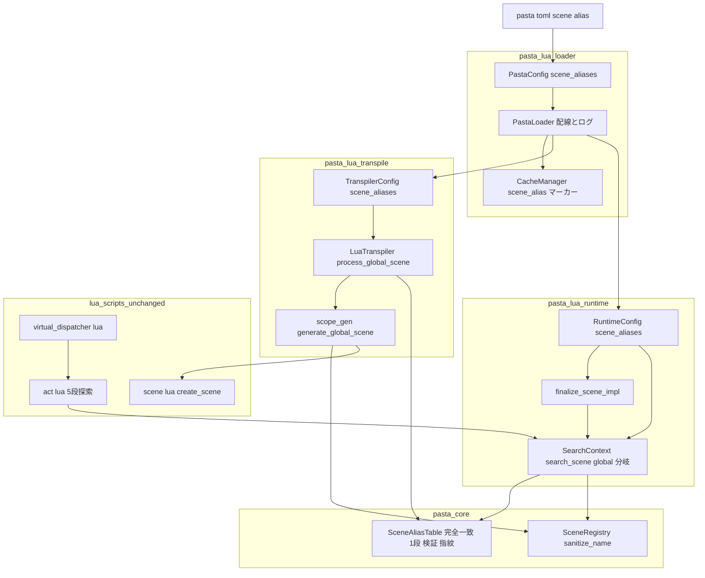
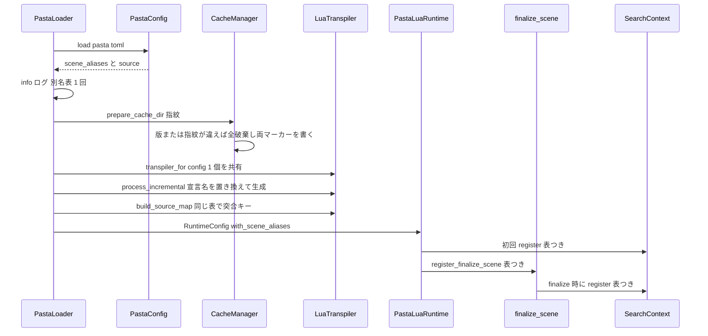
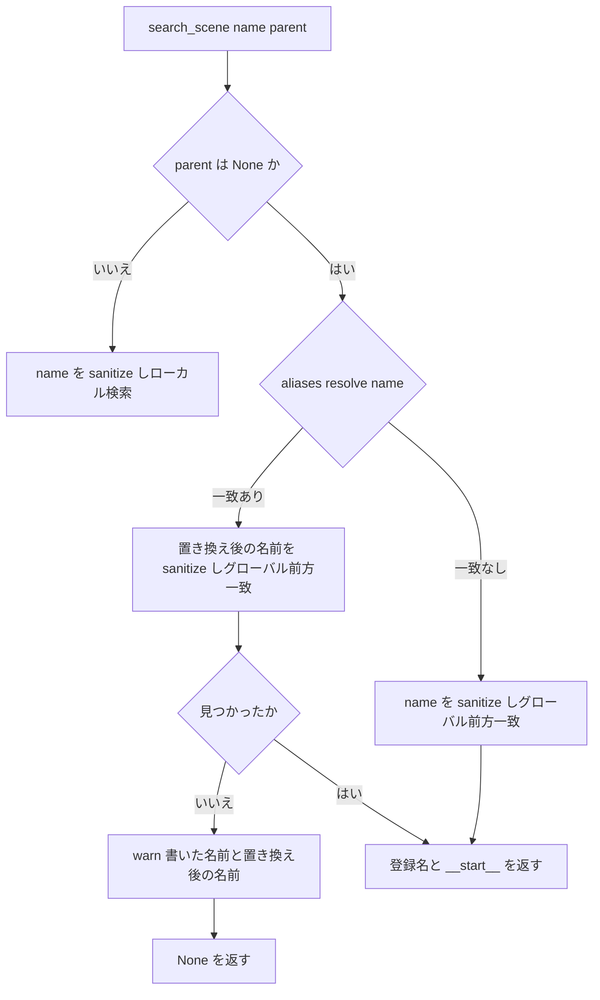

# 技術設計: scene-name-alias

- 作成日: 2026-10-08
- 入力: `requirements.md`（Requirement 1〜10・確定した論点 OQ-1〜8）、`research.md`（ギャップ分析・推奨案 C・R-1〜R-7）、`brief.md`、steering（product / tech / structure / grammar）
- 基準コード: worktree `claude/ontalk-scene-name-a0749f`（`d9541dac`）

## Overview

**Purpose**: グローバルシーン名の**別名表**を導入し、何も設定しなくても `＊会話` が OnTalk のシーンとして登録・検索・発行されるようにする。別名は pasta.toml の `[scene.alias]` で作者が定義でき、未定義なら「会話 → OnTalk」の 1 件が既定になる。

**Users**: 辞書を書くゴースト作者（とくに入門ガイドの読者）が、ランダムトークを日本語の名前で書くために使う。自分の別名（`OnBoot = ["起動"]` など）を足す作者、既定を外したい既存ゴーストの作者も対象である。

**Impact**: 現行の「シーン名は登録と検索の両側で `sanitize_name` の 1 規則を通る」構造の**前段**に、グローバルシーン名の経路だけに効く「完全一致・1 段だけ」の置き換えを差し込む。`sanitize_name` 自体、ローカルシーン・単語・アクターの経路、仮想ディスパッチャ、シーン検索の前方一致・シャッフル＆順次消費、Lua スクリプト（`act.lua`・`scene.lua`・`virtual_dispatcher.lua`）は変えない。置き換えは**トランスパイル時の宣言**と**実行時のグローバル検索**の 2 か所で同じ値を使い、トランスパイルのキャッシュは別名表の変更で無効化する。

### Goals

- `＊会話` で宣言したシーンが、既定の別名表のもとで OnTalk の候補として登録・発行される（1.1〜1.5）。
- 別名表を pasta.toml の `[scene.alias]` で定義・置き換え・空にでき、不正な表は読み込みエラーで止まる（2.1〜2.7）。
- 置き換えの規則が「書いた名前との完全一致・1 段だけ・グローバルシーン名だけ・置き換え後は前方一致」で一貫する（3.1〜3.7・4.1〜4.8）。
- 別名表の変更が次の読み込みで宣言と検索の両方に確実に効く（6.1〜6.3）。
- デバッグ（ブレークポイント・カーソル位置のシーン再生）が `＊会話` のシーンで壊れない（7.1〜7.3）。
- 失敗表記・ログ・登録名に出す名前が OQ-6 の決定どおりになる（8.1〜8.3）。
- マニュアルとスキル references が同じ変更で更新される（9.1〜9.7）。
- 自動テストが規則を守る（10.1〜10.5）。

### Non-Goals

- hello-pasta の辞書（`crates/pasta_sample_ghost/ghosts/hello-pasta/ghost/master/dic/`）の書き換え（`hello-pasta-tutorial-stages` の持ち場）。
- OnHour の候補の探し方の変更、既定表への `時報 → OnHour` の追加。
- 部分一致・前方一致・正規表現による置き換え。多段（連鎖）の置き換え。
- 単独の `＊` 行の意味の変更。アクター名・単語名・ローカルシーン名の別名。
- 仮想ディスパッチャの発行条件・チェイントークの扱い。シーン検索の前方一致・シャッフル＆順次消費の変更。
- LSP・pasta_check に pasta.toml を読ませること。
- `act.lua`・`element_gen.rs` の変更（Phase 11 の持ち場の規則。失敗表記の出口は現行の `act:failure` のまま）。

## Boundary Commitments

### This Spec Owns

- **別名表の型と規則**: `pasta_core` の `SceneAliasTable`（完全一致の置き換え 1 段、空文字列・重複・連鎖の検証、正準な指紋）。
- **別名表の読み込み**: pasta.toml の `[scene.alias]` の解釈、既定表（`OnTalk = ["会話"]`）の適用、読み込みエラーの判定と文言、読み込み時の info ログ。
- **宣言側の適用**: トランスパイラがグローバルシーンの名前を置き換えてから、登録・単語モジュール名・生成コードの基本名・ソースマップの突合キー・ローカルシーンの親名へ同じ値を渡すこと。
- **検索側の適用**: `SearchContext::search_scene` のグローバル検索の分岐（第 2 引数が `None`）での置き換えと、見つからなかったときの両名ログ。
- **表の配線**: ローダーが同じ表をトランスパイラ（増分トランスパイルとソースマップ構築の両方）・`RuntimeConfig`・`finalize_scene` へ渡すこと。
- **キャッシュの無効化**: 別名表の指紋をキャッシュディレクトリに記録し、違えば全破棄すること。
- **マニュアルの規則の記述・例題名の整理・スキル references の再生成**、および本 spec のテスト。

### Out of Boundary

- `SceneRegistry::sanitize_name`・`registered_name`・`split_registered_name` の規則（`scene-search-key-normalization`・`scene-identity-format` の成果をそのまま使う）。
- `SceneTable` の前方一致・候補キャッシュ・フィルター（`call-attribute-filter` が後で触る）。シーン属性の保持（`scene-attribute-store`）。
- Lua スクリプト（`act.lua` の 5 段探索と失敗表記、`scene.lua` の `create_scene`・`search`、`choice_select.lua`、`virtual_dispatcher.lua`、`kick.lua`）。本 spec は Lua を 1 行も変えない。
- デバッグの突合・再生（`scene_join.rs`・`playscene.rs`・`dap/decode.rs`）のロジック。宣言側で置き換えるため追加変更は無い（検証だけ行う）。
- 失敗表記の一本化（`failure-output-unification`）。本 spec は「失敗表記は書いた名前」の決定を現行の `act:failure` の上で満たし、Lua 側の警告文は変えない。
- hello-pasta の辞書と、それに依存する `pasta_shiori` のゴールデンテスト（`byte_invariant_test.rs`・`kick_unused_byte_invariant_test.rs`・`shiori_sample_ghost_test.rs`）。本 spec の E2E は独自の fixture ゴーストを使い、これらのファイルに触れない。

### Allowed Dependencies

- `pasta_core::registry`（`SceneRegistry::sanitize_name`・`registered_name`）— 別名はこの前段に置く。`pasta_core` は他クレートに依存しない（新しい依存を足さない）。
- `pasta_lua::loader::config::PastaConfig`（既存の読み込み経路）、`toml` クレート（`toml::from_str`・`toml::Spanned`・`toml::de::Error`。既存依存）。
- `tracing`（既存のログ基盤）。
- `pasta_lua::loader::CacheManager`（既存の版管理の仕組みを拡張する）。
- 制約: `pasta_core` → `pasta_lua::config`（`TranspilerConfig`）／`pasta_lua::runtime::runtime_config`／`pasta_lua::loader::config` の方向にだけ依存を足す。`search/`・`transpiler`・`code_gen` から `loader` へ逆向きの依存を作らない。

### Revalidation Triggers

- `SceneAliasTable` の公開 API（`resolve` の戻り・検証の種類・指紋の形）を変えたとき → `call-attribute-filter`・`scene-attribute-store` は `search/context.rs`・`scope_gen.rs` の rebase で再確認する。
- `search::register` / `SearchContext::new` / `register_finalize_scene` / `TranspilerConfig` / `RuntimeConfig` の引数を変えたとき → 直接呼ぶテスト（`tests/common/e2e_helpers.rs`・`lua_unittest_runner.rs`・`tests/search/`）と `pasta_shiori` の起動経路。
- `[scene]` セクションに `alias` 以外のキーを足すとき → `@pasta_config.scene` の見え方と pasta.toml リファレンスの 3 分類表。
- キャッシュディレクトリのマーカーファイル（`.scene_alias`）の形を変えたとき → キャッシュ全破棄が起きる（互換の注記が要る）。
- hello-pasta の辞書を `＊会話` に切り替えるとき（`hello-pasta-tutorial-stages`。本 spec の main マージ後に着手と調整済み）→ 既定表に依存するため、上記 3 本のゴールデンテストと `first-ghost.md` の逐語照合はそちらで更新する。

## Architecture

### 既存アーキテクチャの分析

- **登録はトランスパイル時、検索は実行時**。宣言側は `transpiler.rs` `process_global_scene` → `context.register_global_scene`（通し番号）・`registered_name`（単語のモジュール名）・`scope_gen.rs` `generate_global_scene`（`PASTA.create_scene("基本名")` と突合キー `G:{base}#{counter}`）の 3 か所が `scene.name` を個別に使う。実行時は `scene.lua` `create_scene` が基本名に通し番号を付けて登録し、`finalize.rs` が `SceneRegistry` を作り直して `@pasta_search` を登録する。
- **全ての検索の入口は `SearchContext::search_scene` に集まる**（`act.lua` の L2/L5、`choice_select.lua`、`SCENE.co_exec` → `act:find_scene`、仮想ディスパッチャ、`SEARCH:search_scene`）。グローバル検索は第 2 引数 `None` の分岐である。
- **トランスパイラは 2 回作られる**: `process.rs` `process_incremental` と `source_map_build.rs` `build_source_map_inner` がそれぞれ `LuaTranspiler::default()` を作る。別名表は**両方**に同じ値を渡さなければ、デバッグの突合キーと実行時の登録名が食い違う（ギャップ分析 1.6 の懸念の実体）。
- **`@pasta_search` は 2 回登録される**: `runtime/mod.rs` `with_config_and_source_map` が `TranspileContext` の登録表から 1 回、`finalize_scene_impl` が Lua 側の登録表から 1 回（本番ではこちらが上書きする）。表は両方に同じ値を渡す。
- **設定は Phase 1 で読む**（`loader/mod.rs`）。`PastaConfig::parse` は `toml::Table` にしてから `[loader]` だけ型付きで取り出す（`toml::Value` からの変換なので位置情報は無い）。`[talk]` 等は `custom_fields` に残り `@pasta_config` へそのまま出る。
- **キャッシュの有効性**は `.cache_version`（クレートの版）とファイルごとの更新時刻だけで決まる（`cache.rs`）。
- **SHIORI のリロード**は `PastaLoader::load_with_config` をもう一度呼ぶ（`pasta_shiori/src/shiori.rs`）ので、pasta.toml は毎回読み直される。
- **LSP・pasta_check** は `pasta_lua` のトランスパイラも `SceneRegistry` も使わず、pasta.toml も読まない（現状どおり。変更しない）。

### アーキテクチャパターンと境界マップ

選んだ案は `research.md` 3 章の**案 C（ハイブリッド）**: `pasta_core` に別名表の小さな型を置き、`sanitize_name` は変えずにその前段として、トランスパイル時の宣言と実行時のグローバル検索の両方で同じ値を使う。



**Architecture Integration**:
- 選んだパターン: 共有の値型（`SceneAliasTable`）を 2 つの消費点（宣言・検索）に注入する。表の正本は `PastaConfig` の 1 か所、配線はローダーの 1 か所。
- 境界の分け方: `pasta_core` は規則だけ（I/O・設定を知らない）。`loader/config` は pasta.toml の形と既定の決定だけ。トランスパイラと検索は「渡された表で置き換える」だけで、既定が何かを知らない（ライブラリ層の既定は**空の表**）。
- 維持する既存パターン: 設定セクションの型付き読み込み（`[loader]` 流）、`RuntimeConfig` のビルダー（`with_debug` と同形の `with_scene_aliases`）、`CacheManager` の「不一致なら全破棄」、`tracing` の構造化ログ。
- 新しい部品の理由: `SceneAliasTable` は「別名表の規則が 1 か所にあり、宣言と検索で同じ結果になる」ことを型で保証するために要る。他に新しい抽象は作らない（Lua の app data・新しいエラー型・トレイトは不要）。
- steering との整合: `pasta_core` は言語非依存層のまま（I/O を持たない）、`pasta_lua` のレイヤー方向（loader → transpiler → runtime → core）を守る、Lua 集約（Lua スクリプトは触らない）、マニュアルが権威。

### 依存方向

```
pasta_core::registry::scene_alias  →  pasta_lua::config (TranspilerConfig)
                                   →  pasta_lua::runtime::runtime_config (RuntimeConfig)
                                   →  pasta_lua::loader::config (PastaConfig)
pasta_lua::loader::{mod,process,source_map_build,cache}  →  上の 3 つを束ねる（唯一の配線点）
pasta_lua::transpiler / code_gen::scope_gen  →  TranspilerConfig の表だけを見る
pasta_lua::runtime::{mod,factory,finalize} / search::context  →  RuntimeConfig の表だけを見る
```

- `search/`・`transpiler`・`code_gen` から `loader` へ依存しない。`loader` 以外は既定表（「会話 → OnTalk」）を知らない。
- Lua スクリプトへの依存方向は変わらない（Rust → Lua は `@pasta_search` の登録だけ）。

### 技術スタック

| Layer | Choice / Version | Role in Feature | Notes |
|-------|------------------|-----------------|-------|
| Registry | `pasta_core`（Rust 2024・thiserror 2） | `SceneAliasTable`・`SceneAliasError` | 新しい依存なし |
| Config | `toml` 1.x・`serde` 1（既存） | `[scene.alias]` の型付き読み込み（`toml::from_str` + `toml::Spanned`）、既定表の適用 | 位置情報つきのエラーのため文字列から直接デシリアライズする |
| Transpiler | `pasta_lua`（既存） | `TranspilerConfig.scene_aliases` を宣言の名前解決に使う | 生成 Lua の形は不変 |
| Runtime / Search | `pasta_lua`・mlua 0.11（既存） | `RuntimeConfig.scene_aliases` → `@pasta_search` の両登録点 | Lua API の形は不変 |
| Loader / Cache | `pasta_lua::loader`（既存） | 配線・info ログ・`.scene_alias` マーカーによる全破棄 | `.cache_version` の意味は変えない |
| Docs | mdBook・`gen-skill-refs.mjs`・`link-check.mjs`（既存） | マニュアル更新と references 再生成 | Manual Sync Gate |

## File Structure Plan

### 新規ファイル

```
crates/pasta_core/src/registry/
└── scene_alias.rs                 # SceneAliasTable（完全一致 1 段の置き換え・検証・正準指紋・Display）＋単体テスト

crates/pasta_lua/tests/
├── scene_alias_search_test.rs     # 既定/作者/空 × 宣言と検索の全入口の結合テスト（10.1・4.x・5.x・8.x）
├── loader/scene_alias_cache_test.rs  # 別名表だけ変えて読み直す（6.1〜6.3・10.4）
└── fixtures/scene_alias_mixed.pasta  # ＊会話 と ＊OnTalk の混在（7.3 の identity 突合）

crates/pasta_shiori/tests/
├── scene_alias_ontalk_e2e_test.rs # ＊会話 だけのゴーストが OnSecondChange でランダムトークを発行（10.2）
└── fixtures/scene_alias_ontalk/   # 独自の最小ゴースト（pasta.toml・dic/talk.pasta に ＊会話 のみ）
```

### 変更ファイル

| ファイル | 変更 |
|----------|------|
| `crates/pasta_core/src/registry/mod.rs`・`src/lib.rs` | `scene_alias` モジュールの追加と `SceneAliasTable` の再公開 |
| `crates/pasta_core/src/error.rs` | `SceneAliasError`（空文字列・重複・連鎖）の追加 |
| `crates/pasta_lua/src/loader/config/mod.rs` | `PastaConfig` に `scene_aliases: SceneAliasTable`・`scene_alias_source: SceneAliasSource` を追加。`parse` で `[scene.alias]` を位置情報つきで読み、検証して既定を適用する |
| `crates/pasta_lua/src/loader/config/sections.rs` | `SceneSection`（`alias: Option<BTreeMap<String, Vec<toml::Spanned<String>>>>`）と `SceneAliasSource` の定義 |
| `crates/pasta_lua/src/loader/config_tests.rs` | `[scene.alias]` の読み込みテスト（既定・空・作者定義・型不一致・空文字列・重複・連鎖・他キー無視） |
| `crates/pasta_lua/src/loader/cache.rs` | `prepare_cache_dir(&self, alias_fingerprint: &str)`: `.scene_alias` マーカーの照合と全破棄 |
| `crates/pasta_lua/src/loader/mod.rs` | Phase 1 の後に別名表の info ログ、Phase 2 へ指紋を渡す、`transpiler_for(&config)` の共有、`process_incremental`・`build_source_map` に表を渡す、`RuntimeConfig` へ表を載せる |
| `crates/pasta_lua/src/loader/process.rs` | `process_incremental(..., transpiler: &LuaTranspiler)` に変更（`LuaTranspiler::default()` を作らない） |
| `crates/pasta_lua/src/loader/source_map_build.rs` | `build_source_map(..., transpiler: &LuaTranspiler, ...)` に変更（同じ表のトランスパイラを使う） |
| `crates/pasta_lua/src/config.rs` | `TranspilerConfig.scene_aliases: SceneAliasTable`（既定は空）と `with_scene_aliases` |
| `crates/pasta_lua/src/transpiler.rs` | `process_global_scene` が `self.config.scene_aliases.resolve` で**宣言名**を決め、登録・単語モジュール名・生成・ローカルの親名へ同じ値を渡す |
| `crates/pasta_lua/src/context.rs` | `register_global_scene_named(name, attrs)`（宣言名で登録する入口。既存 `register_global_scene(scene)` はこれに委譲） |
| `crates/pasta_lua/src/code_gen/scope_gen.rs` | `generate_global_scene(scene, declared_name, counter, ...)`: 基本名と突合キーを `declared_name` から作る |
| `crates/pasta_lua/src/runtime/runtime_config.rs` | `RuntimeConfig.scene_aliases: SceneAliasTable`（既定は空）と `with_scene_aliases` |
| `crates/pasta_lua/src/runtime/mod.rs` | 初回の `search::register` に `config.scene_aliases` を渡す |
| `crates/pasta_lua/src/runtime/factory.rs` | `from_loader_with_scene_dic` で `pasta_config.scene_aliases` を `RuntimeConfig` へ載せ、`register_finalize_scene(lua, aliases)` に渡す |
| `crates/pasta_lua/src/runtime/finalize.rs` | `finalize_scene_impl(lua, &aliases)`・`register_finalize_scene(lua, aliases)`: `search::register` へ表を渡す |
| `crates/pasta_lua/src/search/mod.rs` | `loader`/`register` に `aliases: SceneAliasTable` 引数 |
| `crates/pasta_lua/src/search/context.rs` | `SearchContext` に表を保持。`search_scene` のグローバル分岐で置き換え、見つからなければ両名の warn ログ。`new` は空の表（既存テスト互換）、`with_aliases` を追加 |
| `crates/pasta_lua/src/lib.rs` | `SceneAliasTable` の再公開（`pasta_lua::SceneAliasTable`） |
| `crates/pasta_lua/tests/scene_identity_index_test.rs` | fixture `scene_identity_index.pasta` の `＊会話` が既定表で `OnTalk_1`/`OnTalk_2` になるため期待値を更新（10.5・7.2 の間接検証） |
| `book/src/grammar/block-structure.md` | 「グローバルシーン」節に別名の規則・既定表・`＊会話` が OnTalk であること（9.1） |
| `book/src/grammar/call-jump.md` | 「シーン名の照合」に別名の小節（完全一致・1 段・グローバル名だけ・置き換え後は前方一致・適用する段）、例（9.2）。`会話・朝`・`＞会話・` の例題名を別名と無関係な名前へ付け替え（9.6(2)） |
| `book/src/lua/shiori-events.md` | 「OnTalk」節に既定の別名 `＊会話`、「シーン関数フォールバック」にイベント名の別名の例（`OnBoot = ["起動"]`）（9.1・4.5） |
| `book/src/reference/pasta-toml.md` | 概要の「値の型が合わないとき」表・3 分類表・フルリファレンステンプレート・`### [scene]（シーン名）` 詳細節（既定表・置き換え・空の表・エラー・互換の変化・LSP/pasta_check の注記）（9.1・9.3・9.4） |
| `book/src/lua/modules/pasta-search.md` | `search_scene` の `name` に「別名を置き換えてから照合用の名前に揃える」、登録名の説明、`会話_朝_1` の例題名の付け替え（9.5） |
| `book/src/lua/modules/pasta-config.md` | `[scene]` は書いたとおりに見え、既定の別名は補完されないこと |
| `book/src/lua/script-api.md` | 登録名の例（`会話_朝_1`）の付け替え（9.5・9.6(3)） |
| `book/src/internals/registry-search.md`・`internal-modules.md`・`debug.md` | `会話_1`・`会話_朝_1` の例題名の付け替え（9.6(3)）、デバッグ章に「宣言側で置き換えるため突合キーは置き換え後の名前」の 1 文 |
| `book/src/internals/transpiler.md`・`loader.md` | キャッシュの無効化条件に別名表の指紋を追加、起動シーケンス Phase 1 の別名表ログ |
| `.claude/skills/pasta-ghost-authoring/references/*`・`pasta-lua-coding/references/*` | `node book/tools/gen-skill-refs.mjs` で再生成（9.7。手編集しない） |

- `grammar/markers.md`・`action-line.md`・`actor-dictionary.md`・`words.md`・`block-structure.md` の `＊会話` の例は、ランダムトークとして読んで差し支えないので残す（9.6(1)）。実装時に各例を読み直し、OnTalk の意味で食い違うものだけを付け替える。
- 触らないファイル（本 spec の境界の外）: `crates/pasta_lua/pasta_scripts/**`、`debug/source_map/scene_join.rs`・`playscene.rs`・`dap/`、`pasta_core/src/registry/scene_registry.rs`・`scene_table.rs`、`crates/pasta_sample_ghost/**`、`crates/pasta_lsp/**`、`crates/pasta_check/**`。

## System Flows

### 読み込み（別名表の配線）



- 表は `PastaConfig` から 1 回取り出し、ローダーが 3 つの消費点（キャッシュ・トランスパイラ・ランタイム）に渡す。消費点は既定を知らない。
- 増分トランスパイルとソースマップ構築が**同じ** `LuaTranspiler` を使うことで、生成コードの基本名と突合キー `G:{base}#{counter}` が常に一致する（7.1〜7.3 の前提）。

### 検索（グローバル分岐だけに効く置き換え）



- 置き換えは第 2 引数が `None` のときだけ（4.3〜4.6）。ローカル検索（第 2 引数あり）と `search_word` は触らない（4.7・4.8）。
- 完全一致は書いた名前（sanitize 前）と別名の文字列の等価比較（3.2）。置き換え後の前方一致は現行どおり（3.6・3.7）。

## Requirements Traceability

| Requirement | Summary | Components | Interfaces | Flows |
|-------------|---------|------------|------------|-------|
| 1.1 | 未定義なら既定表「会話 → OnTalk」 | SceneAliasConfig | `PastaConfig::parse`・`SceneAliasTable::builtin_default` | 読み込み |
| 1.2 | `＊会話` が OnTalk として登録・発行 | DeclaredNameResolver・SearchAlias | `process_global_scene`・`search_scene` | 読み込み・検索 |
| 1.3 | `＊会話` と `＊OnTalk` は同じ候補の集まり | DeclaredNameResolver | `register_global_scene_named`（sanitize 後の名前で採番） | 読み込み |
| 1.4 | `＊OnTalk` はこれまでどおり | SceneAliasTable | `resolve` は別名にだけ一致 | 検索 |
| 1.5 | 発行条件は不変 | （Lua 不変） | `virtual_dispatcher.lua` を触らない | — |
| 2.1 | `[scene.alias]` の形 | SceneAliasConfig | `SceneSection` | 読み込み |
| 2.2 | 作者の表は既定とマージしない | SceneAliasConfig | `alias: Some(_)` なら作者の表だけ | 読み込み |
| 2.3 | 空の表は別名なし | SceneAliasConfig | `Some(空)` → `SceneAliasTable::empty` | 読み込み |
| 2.4 | 既定と自分の別名の併記 | SceneAliasTable | `from_entries` | 読み込み |
| 2.5 | 型不一致・空文字列は読み込みエラー | SceneAliasConfig・SceneAliasError | `toml::from_str` の位置情報・`EmptyName` | 読み込み |
| 2.6 | 重複は読み込みエラー | SceneAliasError | `DuplicateAlias { alias, targets }` | 読み込み |
| 2.7 | 有効な表を info で 1 回 | LoaderWiring | `tracing::info!` Phase 1 | 読み込み |
| 3.1 | 完全一致なら置き換えてから照合用の名前へ | DeclaredNameResolver・SearchAlias | `resolve` → `sanitize_name` | 読み込み・検索 |
| 3.2 | 完全一致は書いた名前どうし | SceneAliasTable | `resolve(&str)` は生文字列の等価比較 | — |
| 3.3 | 一致しなければ置き換えない | SceneAliasTable | `resolve` → `None` | — |
| 3.4 | 1 段だけ | SceneAliasTable | `resolve` は 1 回だけ引く（連鎖表は 3.5 で拒否） | — |
| 3.5 | 連鎖は読み込みエラー | SceneAliasError | `Chain { name }` | 読み込み |
| 3.6 | 置き換え後は前方一致 | SearchAlias | `resolve_scene_id_unified` は不変 | 検索 |
| 3.7 | 置き換え前の名前で始まるシーンは候補外 | SearchAlias | 検索キーが置き換え後の名前になる | 検索 |
| 4.1 | 宣言行の置き換え | DeclaredNameResolver | `process_global_scene` | 読み込み |
| 4.2 | 単独 `＊` の受け継いだ名前にも適用 | DeclaredNameResolver | パーサが `scene.name` を受け継ぐため同じ経路 | 読み込み |
| 4.3 | Call の 5 段目 | SearchAlias | `act.lua` L5 → `search_scene(key, nil)` | 検索 |
| 4.4 | 選択肢の飛び先 | SearchAlias | `choice_select.lua` → `SCENE.search(id, nil)` | 検索 |
| 4.5 | SHIORI イベント・仮想ディスパッチャ | SearchAlias | `act:find_scene` → L5 | 検索 |
| 4.6 | Lua 公開 API | SearchAlias | `SEARCH:search_scene(name)`・`SCENE.co_exec`・`act:call` | 検索 |
| 4.7 | ローカル・完全一致の段・単語・アクターには適用しない | SearchAlias・DeclaredNameResolver | 第 2 引数ありの分岐、`search_word`、`register_local_scene` の子名、`WordDefRegistry` は不変 | 検索 |
| 4.8 | 登録名を受け取る入口には適用しない | （不変） | `scene_join.rs`・`playscene.rs`・`kick.lua`・`search_scene` の第 2 引数 | — |
| 5.1 | 単独 `＊` の意味は不変 | （不変） | パーサは触らない | — |
| 5.2 | OnHour の探し方は不変・既定表に含めない | SceneAliasTable | `builtin_default` は 1 件 | — |
| 5.3 | 前方一致・シャッフル＆順次消費は不変 | （不変） | `SceneTable` は触らない | — |
| 5.4 | 一致しない名前の結果は導入前と同じ | SceneAliasTable | `resolve` → `None` で現行経路 | 検索 |
| 5.5 | 既存の「会話」シーンは OnTalk になる | SceneAliasConfig・Docs | 既定表・pasta-toml.md の互換の注記 | — |
| 5.6 | 空の表で導入前と同じ | SceneAliasConfig | `SceneAliasTable::empty` | — |
| 6.1 | 別名表だけ変えても次の読み込みで反映 | CacheAliasMarker | `prepare_cache_dir(fingerprint)` の全破棄 | 読み込み |
| 6.2 | 宣言と検索に常に同じ表 | LoaderWiring | `transpiler_for` と `RuntimeConfig` に同じ値 | 読み込み |
| 6.3 | 表を削除すれば既定へ戻る | SceneAliasConfig・CacheAliasMarker | `alias: None` → 既定、指紋が変わり全破棄 | 読み込み |
| 7.1 | ブレークポイント | DeclaredNameResolver | 行の対応（`record_span`）は名前に依存しない | — |
| 7.2 | カーソル位置のシーン再生 | DeclaredNameResolver | 突合キーの base が置き換え後の名前 | 読み込み |
| 7.3 | `＊会話`/`＊OnTalk` 混在の対応づけ | DeclaredNameResolver | 同じ base の出現順で突合（`scene_join.rs` 不変） | 読み込み |
| 8.1 | 失敗表記は書いた名前 | （Lua 不変） | `act:call` の `key` は書いた名前のまま | 検索 |
| 8.2 | 警告ログに両方の名前 | SearchAlias | `search_scene` の warn（`name`・`resolved`） | 検索 |
| 8.3 | 登録名は置き換え後から作る | DeclaredNameResolver | `create_scene(基本名)` の基本名が置き換え後 | 読み込み |
| 9.1 | 規則と既定表をマニュアルへ | Docs | block-structure / call-jump / shiori-events / pasta-toml | — |
| 9.2 | 完全一致×前方一致の例 | Docs | call-jump.md の別名小節 | — |
| 9.3 | 挙動が変わる範囲と戻し方 | Docs | pasta-toml.md `[scene]` 節 | — |
| 9.4 | LSP・pasta_check は読まない | Docs | pasta-toml.md `[scene]` 節 | — |
| 9.5 | Lua 検索 API と登録名の説明 | Docs | pasta-search.md・script-api.md | — |
| 9.6 | `＊会話` 例題の整理 | Docs | 変更ファイル表の方針 (1)(2)(3) | — |
| 9.7 | references 再生成・鮮度照合・リンク検証 | Docs | `gen-skill-refs.mjs`・`link-check.mjs` | — |
| 10.1 | 既定/作者/空 × 宣言と検索の一致 | Tests | `scene_alias_search_test.rs` | — |
| 10.2 | E2E でランダムトーク発行 | Tests | `scene_alias_ontalk_e2e_test.rs` | — |
| 10.3 | 置き換えない名前・読み込みエラー | Tests | `scene_alias.rs` 単体・`config_tests.rs`・`scene_alias_search_test.rs` | — |
| 10.4 | 表だけ変えて読み直し | Tests | `scene_alias_cache_test.rs` | — |
| 10.5 | 既存テストの更新 | Tests | `scene_identity_index_test.rs` ほか（下表） | — |

## Components and Interfaces

| Component | Domain/Layer | Intent | Req Coverage | Key Dependencies (P0/P1) | Contracts |
|-----------|--------------|--------|--------------|--------------------------|-----------|
| SceneAliasTable | pasta_core / registry | 別名表の規則（完全一致 1 段・検証・指紋） | 1.4, 2.4, 3.1〜3.5, 5.2, 5.4 | `SceneRegistry::sanitize_name`（P1・利用者側が後段で呼ぶ） | Service |
| SceneAliasConfig | pasta_lua / loader::config | `[scene.alias]` の読み込み・既定の決定・エラー | 1.1, 2.1〜2.6, 5.5, 5.6, 6.3 | `toml`（P0）・SceneAliasTable（P0） | Service |
| CacheAliasMarker | pasta_lua / loader::cache | 指紋マーカーの照合と全破棄 | 6.1, 6.3 | CacheManager（P0） | State |
| LoaderWiring | pasta_lua / loader | 表の 3 消費点への配線・info ログ・共有トランスパイラ | 2.7, 6.2 | PastaConfig・CacheManager・LuaTranspiler・RuntimeConfig（P0） | Service |
| DeclaredNameResolver | pasta_lua / transpiler + code_gen | 宣言名を 1 回決め、登録・単語・生成・突合キー・ローカル親名へ渡す | 1.2, 1.3, 3.1, 4.1, 4.2, 7.1〜7.3, 8.3 | TranspilerConfig（P0）・SceneRegistry（P0） | Service |
| SearchAlias | pasta_lua / search + runtime | グローバル検索の置き換えと両名 warn、表の受け渡し | 1.2, 3.1, 3.6, 3.7, 4.3〜4.7, 8.2 | RuntimeConfig（P0）・SceneTable（P0・不変） | Service |
| Docs | book + skills | 規則・既定・互換・注記・例題整理・references | 9.1〜9.7 | gen-skill-refs / link-check（P0） | — |
| Tests | crates/*/tests | 規則の自動検証・既存テストの更新 | 10.1〜10.5 | 上記すべて | — |

### pasta_core

#### SceneAliasTable

| Field | Detail |
|-------|--------|
| Intent | グローバルシーン名の別名表。書いた名前と完全一致した別名を置き換え先へ 1 段だけ写す |
| Requirements | 1.4, 2.4, 3.1, 3.2, 3.3, 3.4, 3.5, 5.2, 5.4 |

**Responsibilities & Constraints**
- 値型（`Clone + Debug + Default + PartialEq`）。I/O・設定・ログを持たない。`Default` は**空の表**（ライブラリ層の既定）。
- 不変条件: 表の中で (a) 空文字列のキー・別名が無い、(b) 同じ別名が 2 か所以上に無い、(c) 置き換え先の名前が別名としても書かれていない（自分自身を含む）。`from_entries` が構築時に検証し、満たさない表は作れない。
- 完全一致は生文字列の `==`。`sanitize_name` は呼ばない（後段の利用者が呼ぶ）。

**Dependencies**
- Inbound: TranspilerConfig・RuntimeConfig・PastaConfig・SearchContext・LuaTranspiler — 値の保持と `resolve`（P0）
- Outbound: なし
- External: なし

**Contracts**: Service [x] / API [ ] / Event [ ] / Batch [ ] / State [ ]

##### Service Interface
```rust
// crates/pasta_core/src/registry/scene_alias.rs
#[derive(Debug, Clone, Default, PartialEq, Eq)]
pub struct SceneAliasTable { /* alias -> target */ }

impl SceneAliasTable {
    /// 空の表（別名を 1 件も持たない）。`Default` と同じ。
    pub fn empty() -> Self;
    /// 内蔵の既定表: `OnTalk = ["会話"]` の 1 件。既定を使う判断はローダー層が行う。
    pub fn builtin_default() -> Self;
    /// (置き換え先, 別名の列) の並びから作る。検証に失敗した表は作れない。
    pub fn from_entries<I, A>(entries: I) -> Result<Self, SceneAliasError>
    where I: IntoIterator<Item = (String, A)>, A: IntoIterator<Item = String>;
    /// 書いた名前が別名に完全一致すれば置き換え先を返す。1 段だけ。
    pub fn resolve<'a>(&'a self, name: &str) -> Option<&'a str>;
    pub fn is_empty(&self) -> bool;
    /// ログ・指紋用: 置き換え先ごとに別名を並べた一覧（置き換え先・別名ともに辞書順で安定）。
    pub fn entries(&self) -> Vec<(&str, Vec<&str>)>;
    /// 正準な指紋。同じ表なら常に同じ文字列、異なる表なら異なる文字列。
    /// 形: 先頭行 `scene_alias/1`、以下 `entries()` の順に 1 行ずつ、名前は長さ接頭辞つき（`{len}:{name}`）で曖昧さを無くす。
    pub fn fingerprint(&self) -> String;
}
impl std::fmt::Display for SceneAliasTable;   // 例 `OnTalk <- 会話, 雑談; OnBoot <- 起動` / 空なら `(empty)`

// crates/pasta_core/src/error.rs
#[derive(thiserror::Error, Debug, Clone, PartialEq, Eq)]
pub enum SceneAliasError {
    #[error("scene alias: empty name is not allowed (target '{target}')")]
    EmptyName { target: String },
    #[error("scene alias: alias '{alias}' is defined more than once (targets: {targets:?})")]
    DuplicateAlias { alias: String, targets: Vec<String> },
    #[error("scene alias: '{name}' is both a target and an alias (chained aliases are not allowed)")]
    Chain { name: String },
}
```
- Preconditions: `from_entries` の入力は TOML から読んだ生文字列（トリム・正規化しない）。
- Postconditions: `resolve(a) == Some(t)` ⇔ 表に `t = [.., a, ..]` がある。`resolve(t)` は `None`（連鎖禁止により保証）。`resolve` は入力を変えない。
- Invariants: 上の (a)(b)(c)。検証の順序は空文字列 → 重複 → 連鎖で、最初に見つけたものを返す。

**Implementation Notes**
- Integration: `pasta_core::registry::mod.rs` と `lib.rs` で再公開。`pasta_lua::lib.rs` からも `pub use pasta_core::SceneAliasTable`。
- Validation: 単体テストで `resolve` の完全一致（`会話・朝`・`会話朝`・sanitize 後だけ等しい名前は `None`）、3 種のエラー、`fingerprint` の安定性（順序を変えて作っても同じ）と識別性（`OnTalk=["会話"]` と空の表、`OnTalk=["会話"]` と `OnTalk=["会話","雑談"]`）。
- Risks: なし（純粋な値型）。

### pasta_lua / loader

#### SceneAliasConfig（`PastaConfig` の拡張）

| Field | Detail |
|-------|--------|
| Intent | pasta.toml の `[scene.alias]` を読み、既定を決め、不正な表を読み込みエラーにする |
| Requirements | 1.1, 2.1, 2.2, 2.3, 2.4, 2.5, 2.6, 5.5, 5.6, 6.3 |

**Responsibilities & Constraints**
- 有効な表は `PastaConfig.scene_aliases`（型付き）に置く。出どころを `scene_alias_source`（`BuiltinDefault` / `PastaToml`）で持ち、2.7 のログに使う。
- 「定義した」の判定は **`scene.alias` がテーブルとして存在すること**。`[scene.alias]` の見出しだけ（行なし）は作者定義の空の表（2.3）。`[scene]` に `alias` が無い、または `[scene]` 自体が無いときは既定（1.1・6.3）。
- `scene` キー自体はテーブルでなければならない（`scene = 1` のような値は `SceneProbe` の型不一致で読み込みエラー。従来は `custom_fields` に素通りしていた。`scene` を予約名にする代償として受け入れ、マニュアルの `[scene]` 節に書く）。`[scene]` の `alias` 以外のキーは読まず、`custom_fields` にそのまま残す（R-7）。`[scene]` テーブル全体も `custom_fields` に残り、`@pasta_config.scene` に**書いたとおり**出る。既定の表は `@pasta_config` に補完しない（R-6。`[ghost]` の補完は Lua 側に消費者がある別の決定で、別名表には Lua の消費者が無い）。
- 位置情報: 既存の `parse` は `toml::Table` から `try_into` するため行番号が得られない。`[scene.alias]` は**同じ `content` 文字列から** `toml::from_str::<SceneProbe>` でもう 1 度読む（未知のキーは serde の既定で無視される）。型が合わない値は `toml::de::Error` が行・列つきで出る。要素は `toml::Spanned<String>` で受け、空文字列・重複・連鎖の文言に該当する別名の行番号を含める（キーの位置は取れないため、置き換え先はキー名で示す）。
- エラーは既存の `LoaderError::Config(path, toml::de::Error)` に乗せる（`[loader]` と同じ経路）。意味上のエラーは `serde::de::Error::custom` で `toml::de::Error` にし、文言にキー名・別名・行番号を入れる。新しい `LoaderError` の種類は増やさない。

**Dependencies**
- Inbound: PastaLoader（P0）
- Outbound: SceneAliasTable（P0）、`toml`（P0）
- External: なし

**Contracts**: Service [x] / API [ ] / Event [ ] / Batch [ ] / State [ ]

##### Service Interface
```rust
// crates/pasta_lua/src/loader/config/sections.rs
/// `[scene]` の読み取り専用プローブ。`alias` 以外のキーは無視する（R-7）。
#[derive(Debug, Deserialize)]
pub(crate) struct SceneSection {
    pub alias: Option<std::collections::BTreeMap<String, Vec<toml::Spanned<String>>>>,
}
#[derive(Debug, Deserialize)]
pub(crate) struct SceneProbe { pub scene: Option<SceneSection> }

/// 有効な別名表の出どころ（2.7 のログ用）。
#[derive(Debug, Clone, Copy, PartialEq, Eq)]
pub enum SceneAliasSource { BuiltinDefault, PastaToml }

// crates/pasta_lua/src/loader/config/mod.rs
pub struct PastaConfig {
    pub loader: LoaderConfig,
    pub custom_fields: toml::Table,          // `[scene]` はここにも残る
    pub scene_aliases: SceneAliasTable,      // 有効な表（既定か作者の定義）
    pub scene_alias_source: SceneAliasSource,
}
impl Default for PastaConfig { /* scene_aliases = builtin_default, source = BuiltinDefault */ }
impl PastaConfig {
    fn parse(content: &str) -> Result<Self, toml::de::Error>;   // 既存。`[scene.alias]` の読み込みを追加
    fn parse_scene_aliases(content: &str) -> Result<(SceneAliasTable, SceneAliasSource), toml::de::Error>;
}
```
- Preconditions: `content` は pasta.toml 全体。
- Postconditions: `alias == None` → `(builtin_default, BuiltinDefault)`。`alias == Some(map)` → `from_entries(map)` の結果と `PastaToml`（空なら空の表）。`Err` のときゴーストの読み込みは `LoaderError::Config` で失敗する。
- Invariants: `PastaConfig::default()` と「`[scene]` の無い pasta.toml」は同じ表になる。

**Implementation Notes**
- Integration: `parse` の `[loader]` 取り出しの直後に `parse_scene_aliases(content)` を呼ぶ。`apply_shiori_defaults` は触らない（`[scene]` を補完しない）。
- Validation: `config_tests.rs` に (1) `[scene]` なし → 既定、(2) `[scene.alias]` 見出しのみ → 空、(3) `OnTalk = ["会話","雑談"]` と `OnBoot = ["起動"]`、(4) `OnTalk = "会話"`（配列でない）→ Err に行番号、(5) `OnTalk = ["会話", 1]` → Err、(6) `OnTalk = [""]`・`"" = ["x"]` → Err、(7) 重複（配列内・配列間）→ Err に別名と両方の置き換え先、(8) 連鎖（`会話 = ["雑談"]`・`OnTalk = ["OnTalk"]`）→ Err、(9) `[scene] other = 1` は無視され `custom_fields` に残る、(10) `[scene] alias = "x"` は Err（予約キー）。
- Risks: `toml::de::Error` の `custom` は位置情報を持たない → 文言に自前で行番号を入れる。`Spanned` のバイト範囲から行番号を数える小さな補助関数が要る（`content` は手元にある）。最初の実装タスクで `toml::Spanned` と `serde::de::Error::custom` が現行の `toml` 版で使えることを確かめる。使えなければ、型不一致は toml の行・列つきのまま、意味エラー（空文字列・重複・連鎖）はキー名と別名だけの文言に落とす（2.5 の「原因の行」は型不一致側で満たす）。

#### CacheAliasMarker（`CacheManager` の拡張）

| Field | Detail |
|-------|--------|
| Intent | 別名表の指紋をキャッシュに記録し、変わっていればキャッシュを丸ごと破棄する |
| Requirements | 6.1, 6.3 |

**Responsibilities & Constraints**
- マーカーファイル `<cache_dir>/.scene_alias` に `SceneAliasTable::fingerprint()` を書く。`.cache_version` の意味と形は変えない。
- 判定は「版の不一致 **または** 指紋の不一致（マーカーが無い場合を含む）なら全破棄」。破棄後に版とマーカーの両方を書く。初回（マーカーが無い）は 1 回だけ全破棄が起きる（受け入れる）。
- 部分的な再トランスパイル（別名を含むファイルだけ）はしない。別名表の変更は稀で、どのファイルが影響を受けるかは全ファイルをパースしなければ分からないため、全破棄が安全で単純である。

**Contracts**: Service [ ] / API [ ] / Event [ ] / Batch [ ] / State [x]

##### State Management
- State model: `<cache_dir>/.cache_version`（既存・クレートの版）と `<cache_dir>/.scene_alias`（新規・別名表の指紋）。
- Persistence & consistency: `prepare_cache_dir(alias_fingerprint)` が両方を読み、どちらかが違えば `cache_dir` を削除してから両方を書く。読めない・書けないときは既存どおり `LoaderError::CacheDirectoryError`（致命）。
- Concurrency strategy: 既存と同じ（単一プロセスの起動シーケンス内で順次）。

```rust
// crates/pasta_lua/src/loader/cache.rs
const SCENE_ALIAS_MARKER_FILE: &str = ".scene_alias";
impl CacheManager {
    /// 版と別名表の指紋を照合し、どちらかが違えばキャッシュを全破棄して両方を書く。
    pub fn prepare_cache_dir(&self, alias_fingerprint: &str) -> Result<(), LoaderError>;
}
```

**Implementation Notes**
- Integration: `loader/mod.rs` Phase 2 で `cache_manager.prepare_cache_dir(&config.scene_aliases.fingerprint())`。不一致時は `info!(reason = "scene alias table changed", "Clearing all cache")`。
- Validation: `scene_alias_cache_test.rs` で (1) `＊会話` の辞書を既定で読む → `OnTalk_1`、(2) pasta.toml に `[scene.alias]`（空）を足して `.pasta` を触らずに読み直す → `会話_1`、(3) `[scene.alias]` を消して読み直す → `OnTalk_1`。各段で `SEARCH:search_scene` と登録名の両方を見る（6.2）。
- Risks: マーカー不在での初回全破棄。ただし `.cache_version` は `CARGO_PKG_VERSION` なので、版の上がるリリース更新では既に全破棄が起きており、マーカー不在が単独で効くのは同じ版での開発ビルドだけ。マニュアルの内部設計章には「別名表が変わると全破棄」だけを書く。

#### LoaderWiring（`PastaLoader` の拡張）

| Field | Detail |
|-------|--------|
| Intent | 有効な表を 1 回取り出し、キャッシュ・トランスパイラ（2 つの用途）・ランタイムへ同じ値を渡す。info ログを 1 回出す |
| Requirements | 2.7, 6.2 |

**Responsibilities & Constraints**
- `transpiler_for(&config) -> LuaTranspiler` を 1 回だけ作り、`process_incremental` と `build_source_map` に**同じ参照**を渡す。`LuaTranspiler::default()` をローダー内で直接作る箇所を無くす。
- `RuntimeConfig` に `with_scene_aliases(config.scene_aliases.clone())` を載せてから `from_loader_with_scene_dic` に渡す。
- ログ: Stage 1.5（ロガー登録）の後に 1 回、`info!(source = ?config.scene_alias_source, table = %config.scene_aliases, "Scene alias table")`。

```rust
// crates/pasta_lua/src/loader/mod.rs
impl PastaLoader {
    fn transpiler_for(config: &PastaConfig) -> LuaTranspiler;   // TranspilerConfig::default().with_scene_aliases(..)
}
// crates/pasta_lua/src/loader/process.rs
pub(super) fn process_incremental(pasta_files, lua_files, cache_manager, transpiler: &LuaTranspiler) -> ...;
// crates/pasta_lua/src/loader/source_map_build.rs
pub fn build_source_map(pasta_files, cache_manager, sidecar: bool, transpiler: &LuaTranspiler) -> Arc<SourceMap>;
```

**Implementation Notes**
- Integration: SHIORI のリロードは `load_with_config` を再実行するため、pasta.toml・ログ・キャッシュ判定がそのたびに行われる（6.1 の「読み込み直し」はこれで満たす）。
- Validation: `scene_alias_cache_test.rs`・`scene_identity_index_test.rs`（デバッグ有効時にソースマップ側のトランスパイラも同じ表であることを、`＊会話` の identity が `OnTalk_1` へ解決することで確かめる）。
- Risks: 2 つのトランスパイラのどちらかに表を渡し忘れる → 共有 1 個にすることで構造的に防ぐ。

### pasta_lua / transpiler + code_gen

#### DeclaredNameResolver（`process_global_scene` の拡張）

| Field | Detail |
|-------|--------|
| Intent | グローバルシーンの**宣言名**（別名を置き換えた後の名前）を 1 回決め、名前を使う全ての箇所に同じ値を渡す |
| Requirements | 1.2, 1.3, 3.1, 4.1, 4.2, 7.1, 7.2, 7.3, 8.3 |

**Responsibilities & Constraints**
- `declared_name = self.config.scene_aliases.resolve(&scene.name).unwrap_or(&scene.name)`。この値を (1) `context.register_global_scene_named(declared_name, attrs)`（通し番号は sanitize 後の名前で採番。既存の `increment_counter` のまま）、(2) 単語のモジュール名 `registered_name(declared_name, counter)`、(3) `generate_global_scene(scene, declared_name, counter, ..)`（基本名 `sanitize_name(declared_name)` と突合キー `G:{base}#{counter}`・ローカルの `parent_ref`）、(4) `register_local_scene(local, declared_name, counter, local_counter)` の親名、に渡す。
- 単独の `＊` 行はパーサが直前の名前を `scene.name` として受け継ぐため、同じ経路で置き換わる（4.2）。
- ローカルシーン名・単語名・アクター名には `resolve` を呼ばない（4.7）。`scene.span`（ブレークポイント行）は名前に依存しない（7.1）。
- `TranspilerConfig::default()` の表は空。トランスパイラを直接使うテスト（`sample.pasta` の生成比較など）は変わらない。

```rust
// crates/pasta_lua/src/config.rs
pub struct TranspilerConfig { pub comment_mode: bool, pub line_ending: LineEnding, pub scene_aliases: SceneAliasTable }
impl TranspilerConfig { pub fn with_scene_aliases(self, aliases: SceneAliasTable) -> Self; }

// crates/pasta_lua/src/transpiler.rs
impl LuaTranspiler {
    fn process_global_scene<W: Write>(&self, context: &mut TranspileContext, codegen: &mut LuaCodeGenerator<W>, scene: &GlobalSceneScope) -> Result<(), TranspileError>;
}
// crates/pasta_lua/src/context.rs
impl TranspileContext {
    /// 宣言名で登録する（別名の置き換え後の名前を渡す）。`register_global_scene(scene)` はこれに委譲する。
    pub fn register_global_scene_named(&mut self, name: &str, attrs: &[Attr]) -> (i64, usize);
}
// crates/pasta_lua/src/code_gen/scope_gen.rs
pub fn generate_global_scene(&mut self, scene: &GlobalSceneScope, declared_name: &str, scene_counter: usize, context: &TranspileContext, file_attrs: &HashMap<String, AttrValue>) -> Result<(), TranspileError>;
```
- Preconditions: `declared_name` は `resolve` を 1 回通した名前（呼び出し側の責務。`generate_global_scene` は再度 `resolve` しない）。
- Postconditions: 生成コードの `PASTA.create_scene("…")`、突合キーの base、単語モジュール名、ローカル関数の親、`SceneRegistry` の通し番号キーが全て `sanitize_name(declared_name)` で一致する。
- Invariants: 既定表のもとで `＊会話`・`＊OnTalk` の混在は同じ base `OnTalk` の出現順で採番され、`scene_join.rs` のファイル内順位と一致する（7.3）。

**Implementation Notes**
- Integration: `process_global_scene` は現在 `Self::` の関連関数。`self.config` を読むためメソッドにする（`process_global_word`・`process_actor` は変えない）。
- Validation: `scene_alias_search_test.rs` の登録名の検証（`OnTalk_1`）、`scene_identity_index_test.rs`（`＊会話` → `OnTalk_1`/`OnTalk_2` と kick 名 `:OnTalk_1:挨拶_1`）、`fixtures/scene_alias_mixed.pasta`（`＊会話`・`＊OnTalk`・`＊会話` の順で `OnTalk_1`〜`OnTalk_3` と各行の identity）。
- Risks: 名前を使う箇所の取り漏れ（たとえば `generate_local_scene` の `parent_ref`）。`generate_global_scene` の中で `base_name` を 1 回だけ作り、以下すべてそれを使う現行の形を保てば漏れない。

### pasta_lua / runtime + search

#### SearchAlias（`SearchContext`・`search::register`・`finalize`・`RuntimeConfig` の拡張）

| Field | Detail |
|-------|--------|
| Intent | グローバル検索の分岐でだけ別名を置き換え、見つからなければ両方の名前を warn で記録する。表をランタイムの 2 つの登録点へ渡す |
| Requirements | 1.2, 3.1, 3.6, 3.7, 4.3, 4.4, 4.5, 4.6, 4.7, 8.2 |

**Responsibilities & Constraints**
- `search_scene(name, None)`: `resolve(name)` が `Some(t)` なら `t` を検索キーにする（その後 `sanitize_name` → `resolve_scene_id_unified("", key, ..)` は現行どおり）。`Some(parent)` の分岐と `search_word` は触らない。
- 置き換えが起きて結果が `None` のとき: `tracing::warn!(name = %written, resolved = %target, "Scene not found (alias applied)")`。置き換えが起きなかった不一致は現行どおりログを出さない（Lua 側の `act:call - handler not found` が出る）。Lua 側の警告文は変えないため、別名の Call 失敗ではログに 2 行（Rust の両名・Lua の書いた名前）が残る（Open Question 1）。
- 表はランタイム側で `RuntimeConfig.scene_aliases` の 1 か所に持ち、(a) `with_config_and_source_map` の初回 `search::register`、(b) `register_finalize_scene(lua, aliases)` → `finalize_scene_impl(lua, &aliases)` → `search::register` の両方へ同じ値を渡す。
- `SearchContext::new(scene_registry, word_registry)` は空の表のまま残す（既存テスト・`e2e_helpers.rs`・`lua_unittest_runner.rs` の互換）。`with_aliases` を追加する。

```rust
// crates/pasta_lua/src/search/context.rs
pub struct SearchContext { scene_table: SceneTable, word_table: WordTable, scene_aliases: SceneAliasTable }
impl SearchContext {
    pub fn new(scene_registry: SceneRegistry, word_registry: WordDefRegistry) -> Result<Self, SearchError>;          // 空の表
    pub fn with_aliases(scene_registry: SceneRegistry, word_registry: WordDefRegistry, aliases: SceneAliasTable) -> Result<Self, SearchError>;
    pub fn search_scene(&mut self, name: &str, global_scene_name: Option<&str>) -> Result<Option<(String, String)>, SearchError>;  // 署名は不変
}
// crates/pasta_lua/src/search/mod.rs
pub fn loader(lua: &Lua, scene_registry: SceneRegistry, word_registry: WordDefRegistry, aliases: SceneAliasTable) -> LuaResult<AnyUserData>;
pub fn register(lua: &Lua, scene_registry: SceneRegistry, word_registry: WordDefRegistry, aliases: SceneAliasTable) -> LuaResult<AnyUserData>;
// crates/pasta_lua/src/runtime/finalize.rs
pub fn finalize_scene_impl(lua: &Lua, aliases: &SceneAliasTable) -> LuaResult<bool>;
pub fn register_finalize_scene(lua: &Lua, aliases: SceneAliasTable) -> LuaResult<()>;   // クロージャが表を保持
// crates/pasta_lua/src/runtime/runtime_config.rs
pub struct RuntimeConfig { pub libs: Vec<String>, pub debug: DebugConfig, pub kick_sink: Option<KickSink>, pub scene_aliases: SceneAliasTable }
impl RuntimeConfig { pub fn with_scene_aliases(self, aliases: SceneAliasTable) -> Self; }
```
- Preconditions: `RuntimeConfig.scene_aliases` と、`TranspileContext`／キャッシュ `.lua` を生成したトランスパイラの表が同じ値であること（ローダーが保証。ライブラリを直接使う呼び出し側の責務でもある）。
- Postconditions: 既定表のもとで `search_scene("会話", None)` は `search_scene("OnTalk", None)` と同じ候補の集まり・同じ順次消費の記録を進める（候補キャッシュのキーは置き換え後の照合用の名前）。`search_scene("会話・朝", None)` は `会話_朝` の候補だけを返す（3.7）。
- Invariants: Lua から見える `SEARCH:search_scene` の引数・戻りの形は不変。

**Implementation Notes**
- Integration: `factory.rs` の `from_loader_with_scene_dic` は `with_debug_from_file_and_env` と並べて `with_scene_aliases(pasta_config.as_ref().map(|c| c.scene_aliases.clone()).unwrap_or_default())` を適用し、`register_finalize_scene` へ渡す値は `with_config_and_source_map` に `runtime_config` を渡す前に `clone` しておく。旧経路 `from_loader` は `with_config(context, config)` 経由で自然に表が効く。
- Validation: `search/context.rs` の単体テスト（既定表で `会話` → `OnTalk_1`、`会話・朝` は対象外、ローカル検索は対象外、空の表で現行と同じ、warn の発生は `tracing-test` で確認）、`scene_alias_search_test.rs`（Call 静的・動的、`＞「会話」`、選択肢の飛び先、`REG` 経由のイベントで `OnBoot = ["起動"]`、`SEARCH:search_scene`・`SCENE.co_exec`・`act:call`、失敗表記 `【Call失敗：「会話」が見つからない】`）。
- Risks: `find_act_handler` の expr モード（`＠会話（）`）も L5 で同じ `search_scene(key, nil)` を通るため、OnTalk のシーン関数に解決されうる（Open Question 2）。これは構造上の帰結で、本 spec はモードごとの分岐を足さない。

### Docs

#### マニュアルとスキル references

| Field | Detail |
|-------|--------|
| Intent | 別名の規則・既定・互換の変化・注記を権威の文書に書き、例題名を整理し、references を再生成する |
| Requirements | 9.1, 9.2, 9.3, 9.4, 9.5, 9.6, 9.7 |

- 書く内容（各章の要点）:
  - `grammar/block-structure.md`「グローバルシーン」: 「グローバルシーンの名前が pasta.toml の別名表の別名に完全一致すると、置き換え先の名前で登録される。既定の表は `OnTalk = ["会話"]` の 1 件で、`＊会話` はランダムトーク（OnTalk）のシーンになる」。
  - `grammar/call-jump.md`「シーン名の照合」: 新しい小節「シーン名の別名」。規則 4 点（完全一致・1 段だけ・グローバルシーン名だけ・置き換え後は前方一致）、適用する段（2 段目は適用しない・5 段目に進んだ全ての検索に効く。`＠名前（）` は名指ししない）、適用する入口（Call・選択肢・SHIORI イベント・Lua API）、例（`＊会話・朝` は対象外、`＞会話` は `＊OnTalk朝` を候補にし `＊会話・朝` を候補にしない）。既存の `会話・朝`／`＞会話・` の例題名は `挨拶・朝`／`＞挨拶・` のような別名と無関係な名前へ付け替える。
  - `lua/shiori-events.md`「OnTalk」: `＊OnTalk` と `＊会話`（既定の別名）の両方が候補になること。「シーン関数フォールバック」: イベント名の別名の例。
  - `reference/pasta-toml.md`: 「値の型が合わないとき」表に `[scene]`（`[loader]` と同じ行）、3 分類表に `[scene]`・`[scene.alias]`（SHIORI デフォルト有・既定 `OnTalk = ["会話"]`）、フルテンプレートに `[scene.alias]` の注記つき行、詳細節 `### [scene]（シーン名）`（形・既定・丸ごと置き換え・空の表・エラーになる書き方 4 種・「会話」を別の目的で使っていたゴーストの挙動の変化と戻し方・別名表は読み込み時にだけ効き LSP と pasta_check は読まないこと・`[scene]` の他のキーは予約）。
  - `lua/modules/pasta-search.md`・`lua/script-api.md`: `search_scene` の `name` は別名を置き換えてから照合用の名前に揃える（第 2 引数ありのときは置き換えない）。別名で宣言したシーンの登録名は置き換え後の名前から作られる（`＊OnTalk` の無いゴーストの 1 つ目の `＊会話` は `OnTalk_1`）。`会話_朝_1` の例題名は付け替える。
  - `lua/modules/pasta-config.md`: `[scene]` は書いたとおりに現れ、既定の別名表は補完されない。
  - `internals/*`: `会話_1` の例題名を別名表（既定・例題）に現れない名前へ付け替える。`transpiler.md` のキャッシュ節に「別名表の指紋（`.scene_alias`）が違えば全破棄」、`loader.md` の段階表に Phase 1 の別名表ログ。
- 例題名の整理方針（OQ-7 の確定どおり）: (1) `grammar/` のランダムトークとして読める `＊会話` の例は残す。(2) `call-jump.md` の照合の説明は付け替える。(3) `会話_1` の登録名の例は付け替える（または `OnTalk_1` に直す）。付け替え先は、既定表にも例題の別名表（`会話`・`雑談`・`起動`）にも現れない名前にする。
- 手順: マニュアルを直す → `node book/tools/gen-skill-refs.mjs` → `node book/tools/gen-skill-refs.mjs --check` と `node book/tools/link-check.mjs` に合格（workflow.md の Manual Sync Gate）。

## Data Models

### Domain Model

- **別名表（`SceneAliasTable`）**: 値オブジェクト。`別名 → 置き換え先` の全単射でない写像（多対一）。不変条件は (a) 空文字列なし、(b) 別名は一意、(c) 置き換え先の集合と別名の集合は交わらない。
- **宣言名**: `resolve(書いた名前).unwrap_or(書いた名前)`。トランスパイル時に 1 回決まり、以後の登録名・突合キー・単語モジュール名はすべてこれから派生する。
- **検索キー**: グローバル検索では `sanitize_name(resolve(name).unwrap_or(name))`、ローカル検索では `sanitize_name(name)`。

### pasta.toml の形（`[scene.alias]`）

```toml
[scene.alias]
# 置き換え後の名前 = [置き換え前の名前（別名）の配列]
OnTalk = ["会話", "雑談"]
OnBoot = ["起動"]
```

| 書き方 | 有効な表 |
|--------|----------|
| `[scene]` も `[scene.alias]` も無い | 既定 `OnTalk = ["会話"]` |
| `[scene.alias]` の見出しだけ | 空（別名なし） |
| 行を書いた | 書いた行だけ（既定とマージしない） |
| 配列でない値・文字列でない要素・空文字列・重複・連鎖・`alias` が表でない | 読み込みエラー（ゴーストの読み込み失敗） |

### キャッシュのマーカー

| ファイル | 内容 | 変更時の扱い |
|----------|------|--------------|
| `<cache_dir>/.cache_version` | `pasta_lua` の版（既存） | 不一致で全破棄 |
| `<cache_dir>/.scene_alias` | `SceneAliasTable::fingerprint()`（新規） | 不一致・不在で全破棄 |

## Error Handling

### Error Strategy

- **設定エラーは起動を止める（fail fast）**: `[scene.alias]` の型不一致・空文字列・重複・連鎖は `LoaderError::Config(path, toml::de::Error)` として `PastaLoader::load` を失敗させ、SHIORI では既存の起動失敗の可視化（`X-ERROR-REASON`・error ログ）に乗る。黙って既定へ戻さない（2.5・2.6・3.5）。文言にはキー名・別名・（取れるときは）行番号を入れる。
- **実行時の見つからない検索はエラーにしない**: 現行どおり `None` を返し、Lua 側が失敗表記（書いた名前）と警告を出す。Rust 側は置き換えが起きたときだけ両名の warn を足す（8.1・8.2）。
- **キャッシュのマーカー I/O の失敗**は既存の `CacheDirectoryError`（致命）に揃える。

### Error Categories and Responses

| 種類 | 例 | 応答 |
|------|----|------|
| 設定の型不一致 | `OnTalk = "会話"` | 読み込み失敗。toml の行・列つきの文言 |
| 設定の意味エラー | `OnTalk = [""]`／`OnTalk = ["会話"]` と `OnBoot = ["会話"]`／`会話 = ["雑談"]` | 読み込み失敗。`SceneAliasError` の文言＋別名の行番号 |
| 予約キーの誤用 | `[scene] alias = 1` | 読み込み失敗（型不一致と同じ） |
| 別名の Call が見つからない | `＞会話` で OnTalk のシーンが無い | 失敗表記 `【Call失敗：「会話」が見つからない】`、Lua warn（書いた名前）、Rust warn（書いた名前と置き換え後） |
| キャッシュマーカーの読み書き失敗 | 権限なし | `CacheDirectoryError`（致命・既存） |

### Monitoring

- 読み込み時 info 1 回: `Scene alias table` に `source`（既定か pasta.toml か）と表の内容（2.7）。
- キャッシュ全破棄時 info: 理由（版か別名表か）。
- 検索時 warn: 置き換えが起きて見つからなかったときだけ（`name`・`resolved`）。

## Testing Strategy

### Unit Tests（pasta_core・pasta_lua src 内）

1. `SceneAliasTable::resolve` — 既定表で `会話` → `OnTalk`、`会話・朝`・`会話朝`・`OnTalk`・sanitize 後だけ等しい `会話_` 系は `None`（3.1〜3.4・5.4）。
2. `SceneAliasTable::from_entries` — 空文字列・重複（配列内／配列間）・連鎖（自己参照を含む）がそれぞれの `SceneAliasError` になる（2.5・2.6・3.5）。
3. `SceneAliasTable::fingerprint` — 入力順に依存せず同じ、表が違えば違う（6.1 の判定の正しさ）。
4. `PastaConfig::parse` — 既定・空・作者定義・各エラーの文言と行番号・`[scene]` の他キー無視（1.1・2.1〜2.6・6.3）。
5. `SearchContext::search_scene` — 既定表で `会話` が `OnTalk_1` に当たり、ローカル検索と `search_word` は不変、置き換え後の不一致で warn が出る（3.6・3.7・4.7・8.2）。

### Integration Tests（pasta_lua/tests）

1. `scene_alias_search_test.rs` — 既定／作者定義（`OnTalk = ["会話","雑談"]`・`OnBoot = ["起動"]`）／空の 3 表 × 入口（`＞会話`、`＞「会話」`、`＞＄変数`、選択肢の飛び先、`REG` を通る `OnBoot` イベントで `＊起動`、`SEARCH:search_scene`、`SCENE.co_exec`、`act:call`）で同じシーンに解決され、登録名が `OnTalk_1`（既定）／`会話_1`（空）になる。`＊会話・朝`・`・会話`（ローカル）・単語 `＠会話`・アクター `％会話` が置き換わらない。見つからないときの失敗表記が書いた名前になる（10.1・10.3・4.1〜4.8・5.4〜5.6・8.1・8.3）。
2. `loader/scene_alias_cache_test.rs` — pasta.toml の別名表だけを 3 段階（既定 → 空 → 削除）で変えて読み直し、`.pasta` を触らずに宣言と検索の両方が切り替わる。`.scene_alias` マーカーの内容が更新される（6.1〜6.3・10.4）。
3. `scene_identity_index_test.rs`（更新）と `fixtures/scene_alias_mixed.pasta`（新規） — デバッグ有効で `＊会話`・`＊OnTalk` が混在するファイルの各宣言行が `OnTalk_1`〜`OnTalk_3` の identity に対応づき、kick 名が `OnTalk_N` になる（7.2・7.3・10.5）。
4. `PastaConfig` の既定（`PastaConfig::default()`）と `[scene]` 無しの pasta.toml が同じ表になる（1.1）。

### E2E（pasta_shiori/tests）

1. `scene_alias_ontalk_e2e_test.rs` — 独自 fixture ゴースト（`＊会話` を 2 つ、`＊OnTalk` なし）を `PastaShiori::load` → `OnBoot` → `OnSecondChange`。`ontalk_probe_test.rs` と同じく仮想ディスパッチャの内部状態を Lua で進めて `check_talk` を発火させ、応答に `＊会話` の台詞が含まれることを確かめる（10.2・1.2）。同じ fixture に `[scene.alias]`（空）を書いた版では OnTalk が発行されない（5.6）。

### 既存テストの更新（10.5）

| テスト | 現状 | 変更 |
|--------|------|------|
| `crates/pasta_lua/tests/scene_identity_index_test.rs`（fixture `scene_identity_index.pasta` の `＊会話`×2） | `PastaLoader` 経由で `会話_1`/`会話_2`・kick 名 `:会話_1:挨拶_1` を期待 | 既定表で `OnTalk_1`/`OnTalk_2`・`:OnTalk_1:挨拶_1` に期待値を変える（fixture は変えず行番号を保つ。これで 7.2 の間接検証にもなる）。衝突部（`会話·A`／`会話_A`）は完全一致しないため不変 |
| `crates/pasta_lua/tests/loader/startup_test.rs`（fixture `with_custom_config/dic/test/conversation.pasta` の `＊会話`） | 読み込み成功だけを見る | 変更不要の見込み（登録名を見ていない）。実装時に確認 |
| `crates/pasta_lua/tests/symbol_name_search_test.rs`・`runtime/scene_identity_format_test.rs`・`fixtures/sample.pasta`（`会話・朝`・`会話分岐`） | 完全一致しない | 変更不要 |
| `pasta_core` のテスト・`tests/lua_specs/kick_*.lua`（`SCENE.register("会話_1")`） | 別名層より下 | 変更不要 |
| `crates/pasta_shiori/tests/scene_kick_*_e2e_test.rs`（`ゲート前会話…`） | 完全一致しない | 変更不要 |
| hello-pasta と `byte_invariant_test.rs`・`kick_unused_byte_invariant_test.rs`・`shiori_sample_ghost_test.rs` | `＊OnTalk` のまま | 本 spec では不変。`hello-pasta-tutorial-stages` が `＊会話` へ切り替えるときにそちらで更新する（調整済み: 相手は pasta.toml を変えず既定表に依存し、本 spec の main マージ後に着手） |

## 互換性と移行

- **挙動が変わる範囲**: 別名表を定義していないゴーストで「会話」という名前のグローバルシーン（完全一致）だけが OnTalk の候補になる（5.5）。`＊会話・朝` などは変わらない。戻すには `[scene.alias]` の見出しだけを書く（5.6）。マニュアルの `[scene]` 節に書く（9.3）。
- **キャッシュ**: 初回起動でマーカーが無いため 1 回だけ全破棄が起きる。以後は別名表を変えたときだけ。
- **ライブラリ利用者**: `search::register`・`register_finalize_scene`・`TranspilerConfig`・`RuntimeConfig` に表の引数／フィールドが増える。`SearchContext::new`・`TranspilerConfig::default()`・`RuntimeConfig::new()` は空の表で、既存の呼び出しの挙動は変わらない。表の運び手が `TranspilerConfig` と `RuntimeConfig` の 2 つになるのは、既存の `with_debug` と同じ「ローダーが pasta.toml の値を載せる」形に揃えるため。`TranspileContext` に表を持たせて 1 本にする案は、`with_config_and_source_map` が context を消費するため `finalize` 用の clone が同じく要り、簡単にならないので採らない。両側の一致はローダーだけが保証し、`scene_alias_search_test.rs` の「既定・作者・空 × 宣言・検索」で守る。
- **後続 spec への申し送り**: `failure-output-unification` が失敗表記と警告の出口を一本化するとき、Rust 側 `search_scene` の両名 warn（`name`・`resolved`）は 8.2 の唯一の両名ログなので残すこと（Lua 側の 1 行に両名を含める形へ移すなら、その時点で Rust 側を落としてよい）。`search/context.rs` の `search_scene` に別名の分岐が入る（`call-attribute-filter` はこの後の `resolve_scene_id_unified` にフィルターを足す）。`scope_gen.rs` の `generate_global_scene` に `declared_name` 引数が増える（`scene-attribute-store` はこの関数の `file_attrs` を使い始める）。

## Open Questions / 設計ディスカッション用

1. **R-4 ログの重複（決定・2026-10-08）**: 別名の Call が見つからないとき、Rust（両名・warn）と Lua `act:call`（書いた名前・warn）で 2 行出ることを**受け入れる**。`SEARCH:resolve_scene_alias(name)` を足して `act.lua` で 1 行にする案は、brief の「`act.lua` は触らない」と `failure-output-unification` の持ち場を破るため採らない。別名の Call 失敗は作者の書き損じを直すときにだけ出るもので、2 行でも原因は分かる。
2. **R-5 expr モード（決定・2026-10-08）**: `＠会話（）` は 5 段目で同じ `search_scene(key, nil)` を通るため OnTalk のシーン関数に解決される（単語モードの L5 は `search_word` なので対象外）。これを構造上の帰結として**認める**。マニュアルの別名小節は「グローバルシーンを探す段（5 段目）に進んだ全ての検索に効く」と書いて包含し、`＠名前（）` を名指しの例にはしない。モードごとの分岐はコードに足さない（`SCENE.search` にモードが無く、足すと Lua を触る）。
3. **R-6 `@pasta_config` の見え方（決定・2026-10-08）**: `[ghost]` と違い、既定の別名表を `@pasta_config.scene.alias` に**補完しない**（書いたとおりだけ見える。`[scene]` が無ければ `nil`）。`[ghost]` の補完は Lua 側に消費者（`virtual_dispatcher.lua` の `get_config`）があるための決定で、別名表の消費者は Rust 側だけで Lua から読む需要は要件に無い。要件 2.2「既定とマージしない」と見え方も揃う。需要が出たときに補完か別 API かを選ぶ。
4. **R-1 キャッシュの全破棄（解決済み・議論不要）**: 別名表が変わったら全破棄（部分再トランスパイルはしない）。マーカー不在の初回全破棄は、`.cache_version` が `CARGO_PKG_VERSION` なので版が上がるリリース更新ではもともと全破棄が起きるため、実際に効くのは同じ版での開発ビルドだけ。利用者に見える追加の遅延は無い。
5. **10.5 の方針**: `scene_identity_index_test.rs` は fixture を変えず期待値を `OnTalk_N` に変える（既定表に依存するテストになるが 7.2 の検証を兼ねる）。fixture の名前を別名と無関係な名前に変えて独立させる案もある。**仮定**: 期待値の変更。
6. **hello-pasta との順序（解決済み・2026-10-08 に同セッションと調整）**: `hello-pasta-tutorial-stages` は hello-pasta の pasta.toml を変えず既定表 `OnTalk = ["会話"]` に依存し、段階辞書を `＊会話` の繰り返しと単独 `＊` で書く。登録名 `OnTalk_N` と失敗表記（書いた名前）は相手側の design.md に反映済み。相手の実装着手は**本 spec の main マージ後**。`pasta_shiori` のゴールデン 3 本（`byte_invariant_test.rs`・`kick_unused_byte_invariant_test.rs`・`shiori_sample_ghost_test.rs`）と `first-ghost.md` の逐語照合は相手側で更新し、本 spec は触らない。同じページを触ることになったら後から入る側が rebase する。
