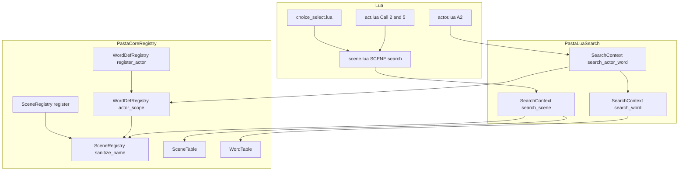
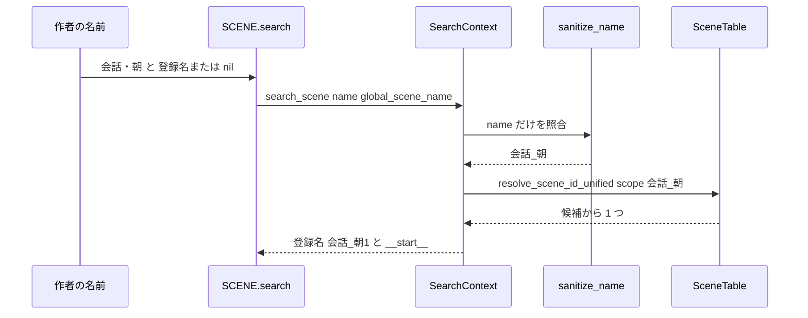

# Design Document: scene-search-key-normalization

## Overview

**Purpose**: 記号を含むシーン名（グローバル・ローカル）とアクター名を、ゴースト作者が書いた元の名前のまま Call・シーン検索・アクター単語参照できるようにする。

**Users**: ゴースト作者（`.pasta` と Lua スクリプトを書く人）。`＊会話・朝` を `＞会話・朝` で呼ぶ、`さくら・改：＠通常` でアクター辞書を引く、といった普通の書き方がそのまま動く。

**Impact**: 登録側はすでに 1 つの照合規則（`SceneRegistry::sanitize_name`）を共有している。検索側の入口 2 か所（シーン検索・アクター単語検索）だけがこの規則を通っていない。本設計は検索側の入口を同じ規則に通す。登録キーの形式・検索アルゴリズム・既存メソッドの引数と戻り値は変えない。

### Goals

- シーン検索の入口 1 か所で、第 1 引数（作者が書いた名前）を照合用の名前に揃える。
- アクター単語の検索を、Rust 側でアクター名を照合用の名前に揃える入口（`@pasta_search` の新しい公開メソッド）に通す。
- 登録と検索が同じ関数を呼ぶ構造にし、食い違いをテストで検出できるようにする。
- マニュアルを変更後の挙動に合わせ、生成スキルの `references/` を再生成する。

### Non-Goals

- 登録名の形式（名前と通し番号の区切り）の変更。`scene-identity-format` が持つ。
- 検索アルゴリズム（前方一致・シャッフル＆順次消費・Call の 5 段）の変更。
- 照合用の名前が重なる名前の検出・警告。
- 単語名（単語キー）の照合、Lua テーブルを完全一致で引く段（Call の 1・3・4 段、A1 段）の変更。
- 照合規則の関数の移動・改名。
- `search_word` の挙動変更（第 2 引数のスコープは今までどおり渡された文字列のまま使う）。

## Boundary Commitments

### This Spec Owns

- `SearchContext::search_scene` の第 1 引数を照合用の名前に揃える処理。
- `@pasta_search` の新しい公開メソッド `search_actor_word(name, actor_name)` と、その契約（引数・戻り値・照合の仕方）。
- アクター単語のスコープ名（`__actor_{照合用の名前}__`）を作る規則の置き場所（`WordDefRegistry::actor_scope`）。登録と検索の両方がこれを呼ぶ。
- `actor.lua` の A2 段（アクター辞書の前方一致）が呼ぶ検索メソッドの選択。
- 上記を固定するテストと、マニュアルの該当記述・生成スキルの `references/`。

### Out of Boundary

- `crates/pasta_lua/src/search/`・`crates/pasta_core/src/registry/`（`random.rs` を除く）・`actor.lua` の A2 段、以外のソース。特に `act.lua`・`scene.lua`・`choice_select.lua`・`code_gen/`・`transpiler.rs`・`runtime/finalize.rs`・`random.rs` は編集しない。
- `actor.lua` の `PROXY_IMPL` の呼び出し規約（`find_actor_handler(self, mode, key, skip_methods)` の引数・戻り値・A1→A2 の順）。
- `SceneTable`・`WordTable` の検索表（`scene_table.rs`・`word_table.rs`）。照合は検索表の手前（`SearchContext`）で済ませる。
- `crates/pasta_shiori/tests/support/scripts/` にある Lua スクリプトの写し（本体と内容がずれている既存のテスト用資産。本仕様では触らない。`search_word` を変えないので今までどおり動く）。
- 内部 API（`PASTA.create_scene` など）を生成コード以外から置き換え前の名前で呼ぶ利用。

### Allowed Dependencies

- `pasta_lua::search` → `pasta_core::registry`（既存の依存方向。`SceneRegistry::sanitize_name`・`WordDefRegistry::actor_scope` を呼ぶ）。
- `actor.lua` → `@pasta_search`（既存。`pcall(require, …)` で取得し、取得できなければ A2 を飛ばす作りは変えない）。
- `pasta_core` は `pasta_lua` に依存しない（逆向きの依存を作らない）。
- 新しいクレート・外部ライブラリは足さない。

### Revalidation Triggers

次の変更があったときは、本仕様に依存する spec（`scene-identity-format`・`actor-proxy-act-delegation`・`search-selector-indices`・`call-attribute-filter`）と利用者向けマニュアルを確認し直す。

- `search_scene(name, global_scene_name)`・`search_actor_word(name, actor_name)` の引数・戻り値の意味が変わる。
- 照合規則（`SceneRegistry::sanitize_name`）で残る文字・置き換える文字が変わる。
- 登録名の区切り文字が、照合規則で `_` に置き換わる文字になる（要件 3.2 の前提が崩れる）。
- アクター単語のキー形式（`:__actor_{名前}__:{単語名}`）が変わる。
- `search_scene` の第 2 引数や `search_word` のスコープ引数に照合規則を適用するようになる。

## Architecture

### Existing Architecture Analysis

- 照合規則の実体は `SceneRegistry::sanitize_name`（`crates/pasta_core/src/registry/scene_registry.rs:241`）1 つである。`WordDefRegistry::sanitize_name` はこれに委譲する。登録（`register_global`・`register_local`・`increment_counter`・`WordDefRegistry::register_local`・`register_actor`）と生成（`scope_gen.rs:120,241`・`transpiler.rs:206`）はすでにこれを呼んでいる。
- シーン検索は、Call の 2・5 段、`SCENE.search`、`SCENE.co_exec`（SHIORI イベント）、選択肢のルーティング（`choice_select.lua:61-62`）、キック、辞書確定前の検索のすべてが `SearchContext::search_scene`（`crates/pasta_lua/src/search/context.rs:68`）を通る。ここは第 1 引数をそのまま検索表へ渡している。
- アクター単語の検索は `actor.lua:142-143` が Lua 側でスコープ名 `"__actor_" .. self.actor.name .. "__"` を組み立て、`SEARCH:search_word(key, scope)` を呼ぶ。Lua 側に照合規則の実装は無い。一方、登録側（`word_registry.rs:83-84`）はアクター名を照合用の名前に置き換えてキーを作る。
- 「見つからない」警告は Lua 側（`act.lua:513`）が元のキーで出す。Rust 側で名前を置き換えても表示は変わらない。
- 文法上、`・`（U+30FB）・`·`（U+00B7）・`＿`（U+FF3F）は識別子の 2 文字目以降に書ける（pest の `XID_CONTINUE` に含まれることを確認済み）。したがって `＊会話・朝`・`％さくら・改` は構文エラーにならず、照合だけが食い違う。

### Architecture Pattern & Boundary Map



**Architecture Integration**:

- **Selected pattern**: 入口での正規化。検索表（`SceneTable`・`WordTable`）は照合済みのキーだけを扱い、「作者が書いた名前」を知るのは `SearchContext` の入口だけにする。
- **Domain/feature boundaries**: 規則そのもの（`sanitize_name`）とキー形式（`actor_scope`）は `pasta_core::registry` が持つ。規則をいつ適用するか（検索の入口）は `pasta_lua::search` が持つ。Lua 側は規則を持たない。
- **Existing patterns preserved**: `SearchContext` の Rust メソッド＋同名の Lua メソッドの対（`search_scene`・`search_word`）。`actor.lua` の `pcall(require, "@pasta_search")` による取得。
- **New components rationale**:
  - `search_actor_word`: Lua 側に照合規則が無いため、アクター名を照合する入口が Rust 側に要る（要件 4.5）。
  - `WordDefRegistry::actor_scope`: スコープ名の形 `__actor_…__` を登録と検索が別々に書くと、そこが新しい食い違いの元になる。1 つの関数にして両方から呼ぶ（要件 3.1・7.6）。
- **Steering compliance**: 依存方向（`pasta_lua` → `pasta_core`）を保つ。マニュアルを文法・API の唯一の権威として同じ変更で更新する。

### 設計判断（要件ディスカッションから設計へ持ち越された項目）

| 項目 | 判断 | 理由 |
| ---- | ---- | ---- |
| シーン検索の修正場所 | `SearchContext::search_scene` の冒頭で第 1 引数だけを `SceneRegistry::sanitize_name` に通す | すべての呼び出し元がここを通るので 1 か所で効く。並走条件の範囲内。検索表（`pasta_core`）に「作者の名前」という概念を持ち込まない。第 2 引数に触れないので要件 3.3 を満たす |
| 照合規則の関数の置き場所 | 動かさない（`SceneRegistry::sanitize_name` のまま。改名もしない） | 実体はすでに 1 つである。動かすと並走条件の範囲外（`scope_gen.rs`・`transpiler.rs`）の呼び出しも変わる。要件に移動の理由が無い |
| アクター単語の公開メソッドの形 | `SEARCH:search_actor_word(name, actor_name) -> string \| nil`（ギャップ分析の案 A1） | `search_word(name, global_scene_name?)` と引数の並び・戻り値が同じで覚えやすい。規則の適用を呼び出し側が忘れる余地が無い（案 A2 の `normalize_name` 公開より再発防止が強い）。キー形式 `__actor_…__` が Lua に漏れなくなる。汎用の正規化 API は、それを必要とする要件が無いので足さない |
| SHIORI 応答を確かめるテストの置き場所 | `crates/pasta_lua/tests/` の新しい結合テスト（`PastaLoader::load` で実際の `.pasta` とランタイムの Lua スクリプトを読み込み、`EVENT.fire` の応答文字列を確かめる） | `pasta_lua` の `tests/common` には実物の `pasta_scripts` を使う一時ゴースト作成ヘルパー（`create_temp_with_pasta`）がある。`pasta_shiori` のテスト環境（`ShioriTestEnv`）は `tests/support/scripts` にある古い写しを使うため、選択肢のルーティング（`pasta/shiori/event/`）が入っておらず、要件 2.4 を確かめられない |

### Technology Stack

| Layer | Choice / Version | Role in Feature | Notes |
|-------|------------------|-----------------|-------|
| レジストリ | `pasta_core::registry`（Rust 2024） | 照合規則とアクタースコープ名の規則を持つ | 既存。`actor_scope` を 1 つ足す |
| 検索モジュール | `pasta_lua::search`（mlua 経由で `@pasta_search` として公開） | 検索の入口で名前を照合する | 既存。メソッドを 1 つ足す |
| ランタイム Lua | `pasta_scripts/pasta/actor.lua`（LuaJIT 2.1） | A2 段が新しいメソッドを呼ぶ | 2 行の置き換え |
| マニュアル | `book/src/`（mdBook）＋ `book/tools/gen-skill-refs.mjs` | 挙動の記述と生成スキルの再生成 | 既存の道具を使う |

新しい依存は無い。

## File Structure Plan

### Directory Structure

```
crates/
├── pasta_core/src/registry/
│   └── word_registry.rs          # 変更: actor_scope を足し、register_actor がそれを呼ぶ
├── pasta_lua/
│   ├── src/search/
│   │   └── context.rs            # 変更: search_scene の入口で照合／search_actor_word を足す
│   ├── pasta_scripts/pasta/
│   │   └── actor.lua             # 変更: A2 段（142-143 行）だけ
│   └── tests/
│       ├── symbol_name_search_test.rs        # 新規: 記号を含む名前の結合テスト（SHIORI 応答を含む）
│       └── lua_specs/
│           ├── proxy_find_handler_test.lua   # 変更: A2 の代役を search_actor_word に合わせる
│           └── act_dynamic_ref_test.lua      # 変更: 同上
book/src/
├── grammar/call-jump.md          # 変更: シーン名の記号と照合
├── grammar/actor-dictionary.md   # 変更: 記号を含むアクター名と照合
├── lua/modules/pasta-search.md   # 変更: search_scene の説明／search_actor_word の追加
├── internals/internal-modules.md # 変更: A2 段の記述
└── internals/registry-search.md  # 変更: 「検索キーはサニタイズされない」の訂正／規則の共有
.claude/skills/
├── pasta-ghost-authoring/references/   # 再生成（手で編集しない）
└── pasta-lua-coding/references/        # 再生成（手で編集しない）
```

### Modified Files

- `crates/pasta_core/src/registry/word_registry.rs` — `WordDefRegistry::actor_scope(actor_name)` を足す。`register_actor` のキー作成をこの関数経由にする（できあがるキーは変更前と同じ）。同ファイルの単体テストに `actor_scope` のテストを足す。
- `crates/pasta_lua/src/search/context.rs` — `search_scene` の冒頭で第 1 引数を照合する。`search_actor_word` の Rust メソッドと Lua メソッドを足す。同ファイルの単体テストに記号を含む名前のテストを足す。
- `crates/pasta_lua/pasta_scripts/pasta/actor.lua` — A2 段の 2 行（スコープ名の組み立てと `search_word` の呼び出し）を `SEARCH:search_actor_word(key, self.actor.name)` に置き換える。関数冒頭のコメント（A2 の説明）を合わせる。ほかの行は触らない。
- `crates/pasta_lua/tests/lua_specs/proxy_find_handler_test.lua`・`act_dynamic_ref_test.lua` — A2 段の代役（`@pasta_search` の差し替え）が `search_word(key, "__actor_…__")` の形を前提にしている箇所を、`search_actor_word(key, アクター名)` の形に直す。観測できる結果（返る単語）の期待値は変えない。ほかの Lua テストで、表で作った代役が A2 段に届くものがあれば同じく `search_actor_word` を足す（`lua_test.mocks` の既定の代役はどのメソッド名でも `nil` を返すので変更不要）。
- `book/src/` の 5 ファイル — 「マニュアルの更新」の節を参照。
- `crates/pasta_core/src/registry/scene_registry.rs` — コードは変えない。`sanitize_name` のドキュメントコメントに「検索の入口でも使う」ことを書き足すだけにとどめる。

### 新規ファイル

- `crates/pasta_lua/tests/symbol_name_search_test.rs` — 記号を含む名前の結合テスト。ほかの spec が同じ波で触るテストファイルと衝突しないよう、独立したファイルにする。テスト用の `.pasta` はテストコードに文字列で書く（`create_temp_with_pasta` に渡す）。

## System Flows



- 第 2 引数（`global_scene_name`）は照合しない。渡された登録名のまま検索表へ渡す（要件 3.3）。
- 順次消費のキャッシュキーは照合後の名前になる。`会話・朝` と `会話_朝` で検索した場合、同じ並び順の記録を進める（要件 5.1 の「同じ名前の候補」と整合する）。
- アクター単語は `actor.lua` → `search_actor_word(key, actor_name)` → `actor_scope(actor_name)` → `search_word(key, Some(scope))` の順に進む。キャッシュキーは（スコープ名, キー）のままなので、記号を含まないアクター名では変更前と同じ記録を使う（要件 3.4）。

## Requirements Traceability

| Requirement | Summary | Components | Interfaces | Flows |
|-------------|---------|------------|------------|-------|
| 1.1 | 記号を含むグローバルシーンを Call | SearchContext | `search_scene` | シーン検索 |
| 1.2 | 動的ターゲットでも同じ結果 | SearchContext | `search_scene` | シーン検索（入口が同じ） |
| 1.3 | `SCENE.search`・`search_scene` で検索 | SearchContext | `search_scene` | シーン検索 |
| 1.4 | 照合用の名前どうしの前方一致 | SearchContext | `search_scene` | シーン検索 |
| 1.5 | SHIORI イベントで 204 にしない | SearchContext | `search_scene` | シーン検索（`SCENE.co_exec` 経由） |
| 2.1 | 記号を含むローカルシーンを Call | SearchContext | `search_scene`（第 2 引数あり） | シーン検索 |
| 2.2 | `SCENE.search(名前, 登録名)` | SearchContext | `search_scene` | シーン検索 |
| 2.3 | ローカルの前方一致 | SearchContext | `search_scene` | シーン検索 |
| 2.4 | 選択肢のジャンプ先 | SearchContext | `search_scene`（`choice_select.lua` は無変更） | シーン検索 |
| 3.1 | 登録と検索が同じ規則 | SceneRegistry.sanitize_name、WordDefRegistry.actor_scope | 両関数 | 構成図 |
| 3.2 | 登録名を渡したときは変更前と同じ | SearchContext | `search_scene`（規則は登録名に対して恒等） | — |
| 3.3 | 第 2 引数は照合しない | SearchContext | `search_scene` | シーン検索 |
| 3.4 | 記号を含まない名前は変更前と同じ | SearchContext、actor.lua A2 | `search_scene`・`search_actor_word` | — |
| 3.5 | 見つからないときの警告は元の名前 | （変更なし。`act.lua` が元のキーで警告） | `search_scene` は `nil` を返すだけ | — |
| 3.6 | `:` で始まる名前はローカルを候補にしない | SearchContext | `search_scene` | — |
| 3.7 | 辞書確定前も同じ規則 | SearchContext | `search_scene`（確定前後で同じ入口） | — |
| 4.1 | `さくら・改：＠通常` | SearchContext、actor.lua A2 | `search_actor_word` | アクター単語検索 |
| 4.2 | `WORD.create_actor` で登録した単語 | 同上 | `search_actor_word` | アクター単語検索 |
| 4.3 | pasta.toml の `[actor."名前"]` | 同上 | `search_actor_word` | アクター単語検索 |
| 4.4 | 見つからなければ次の段へ | actor.lua A2 | `search_actor_word` が `nil` | — |
| 4.5 | アクター名を登録と同じ規則で照合 | WordDefRegistry.actor_scope | `actor_scope` | 構成図 |
| 4.6 | `:` を含むアクター名を取り違えない | WordDefRegistry.actor_scope | `actor_scope`（`:` は `_` になる） | — |
| 5.1 | 重なるシーン名は同じ名前の候補 | SearchContext（既存の採番と前方一致） | `search_scene` | — |
| 5.2 | 重なるアクター名は同じ辞書 | WordDefRegistry.actor_scope | `actor_scope` | — |
| 5.3 | 重なる名前の扱いをマニュアルに書く | マニュアル | `grammar/call-jump.md`・`grammar/actor-dictionary.md` | — |
| 6.1 | Call の章 | マニュアル | `grammar/call-jump.md` | — |
| 6.2 | アクター辞書の章 | マニュアル | `grammar/actor-dictionary.md` | — |
| 6.3 | 食い違う記述を残さない | マニュアル | `grammar/call-jump.md`・`internals/registry-search.md` | — |
| 6.4 | `search_scene` の説明 | マニュアル | `lua/modules/pasta-search.md` | — |
| 6.5 | 内部構造の章 | マニュアル | `internals/internal-modules.md`・`internals/registry-search.md` | — |
| 6.6 | 足したメソッドを公開 API として書く | マニュアル | `lua/modules/pasta-search.md` | — |
| 6.7 | 生成スキルの再生成と検査 | 生成スキル | `gen-skill-refs.mjs`・`link-check.mjs` | — |
| 7.1 | グローバルシーンのテスト | テスト | 単体＋結合 | — |
| 7.2 | ローカルシーンと選択肢のテスト | テスト | 単体＋結合 | — |
| 7.3 | アクター単語のテスト | テスト | 単体＋結合 | — |
| 7.4 | 登録名の不変と衝突のテスト | テスト | 単体 | — |
| 7.5 | 既存テストを期待値を変えずに通す | テスト | 既存テスト一式 | — |
| 7.6 | 片側だけ規則が変わると失敗する | テスト | 登録→元の名前で検索の往復テスト | — |

## Components and Interfaces

| Component | Domain/Layer | Intent | Req Coverage | Key Dependencies (P0/P1) | Contracts |
|-----------|--------------|--------|--------------|--------------------------|-----------|
| SearchContext | pasta_lua / search | 検索の入口で作者の名前を照合する | 1.1–1.5, 2.1–2.4, 3.2–3.7, 4.1–4.4, 5.1 | SceneRegistry.sanitize_name (P0), WordDefRegistry.actor_scope (P0) | Service |
| WordDefRegistry.actor_scope | pasta_core / registry | アクター単語のスコープ名を作る規則を 1 か所にする | 3.1, 4.5, 4.6, 5.2 | SceneRegistry.sanitize_name (P0) | Service |
| SceneRegistry.sanitize_name | pasta_core / registry | 照合規則（既存・無変更） | 3.1 | — | Service |
| actor.lua A2 段 | pasta_lua / ランタイム Lua | アクター辞書の前方一致を新しいメソッドで引く | 4.1–4.4, 3.4 | @pasta_search (P0) | Service |
| マニュアルと生成スキル | book / skills | 挙動の記述 | 5.3, 6.1–6.7 | gen-skill-refs.mjs (P0) | — |
| テスト | tests | 修正の固定 | 7.1–7.6 | — | — |

### pasta_core / registry

#### WordDefRegistry.actor_scope

| Field | Detail |
|-------|--------|
| Intent | アクター名から、アクター単語のスコープ名 `__actor_{照合用の名前}__` を作る |
| Requirements | 3.1, 4.5, 4.6, 5.2 |

**Responsibilities & Constraints**

- アクター単語のスコープ名の形を決める唯一の場所である。登録（`register_actor`）と検索（`SearchContext::search_actor_word`）の両方がこれを呼ぶ。
- アクター名は `SceneRegistry::sanitize_name` に通す。したがって `:` などキーの区切りと紛れる文字は `_` になる（要件 4.6）。
- `register_actor` が作るキー（`:__actor_{照合用の名前}__:{単語名}`）は変更前とバイト単位で同じである。

**Dependencies**

- Inbound: `WordDefRegistry::register_actor` — 登録キーの作成 (P0)
- Inbound: `SearchContext::search_actor_word` — 検索スコープの作成 (P0)
- Outbound: `SceneRegistry::sanitize_name` — 照合規則 (P0)

**Contracts**: Service [x] / API [ ] / Event [ ] / Batch [ ] / State [ ]

##### Service Interface

```rust
impl WordDefRegistry {
    /// アクター単語のスコープ名を返す。例: "さくら・改" → "__actor_さくら_改__"
    pub fn actor_scope(actor_name: &str) -> String;
}
```

- Preconditions: なし（任意の文字列を受ける）。
- Postconditions: 戻り値は `__actor_` ＋ `sanitize_name(actor_name)` ＋ `__`。英数字と `_` だけからなる。
- Invariants: 照合用の名前が同じアクター名は同じスコープ名になる（要件 5.2）。`register_actor(a, w, …)` が作るキーは `":" + actor_scope(a) + ":" + w` に等しい。

**Implementation Notes**

- Integration: `register_actor` の中のキー作成を `actor_scope` 経由に置き換える。既存テスト（`test_register_actor_basic`・`test_register_actor_with_sanitization`、`transpiler_tests.rs` のキー形式の検証）は期待値を変えずに通る。
- Validation: `actor_scope` の単体テスト（記号なし・`・`・`:` を含む名前）。
- Risks: なし（純粋な関数の切り出し）。

### pasta_lua / search

#### SearchContext

| Field | Detail |
|-------|--------|
| Intent | シーン検索・アクター単語検索の入口で、作者が書いた名前を照合用の名前に揃える |
| Requirements | 1.1, 1.2, 1.3, 1.4, 1.5, 2.1, 2.2, 2.3, 2.4, 3.2, 3.3, 3.4, 3.5, 3.6, 3.7, 4.1, 4.2, 4.3, 4.4, 5.1 |

**Responsibilities & Constraints**

- `search_scene`: 冒頭で第 1 引数 `name` だけを `SceneRegistry::sanitize_name` に通し、以降の処理（`resolve_scene_id_unified` の呼び出し、エラーの `None` への変換、戻り値の組み立て）は変えない。第 2 引数 `global_scene_name` は照合しない。
- `search_actor_word`: `WordDefRegistry::actor_scope(actor_name)` でスコープ名を作り、既存の `search_word(name, Some(スコープ名))` に委ねる。単語キー `name` は照合しない（単語名は範囲外）。
- `search_word` は変えない。`SEARCH:search_word(key, "__actor_さくら__")` のように、スコープ名を直接渡す既存の呼び方は今までどおり動く。
- 検索表・キャッシュ・セレクターの扱いは変えない。

**Dependencies**

- Inbound: `scene.lua` の `SCENE.search` — シーン検索 (P0)
- Inbound: `actor.lua` の A2 段 — アクター単語検索 (P0)
- Inbound: 利用者の Lua スクリプト — `@pasta_search` の公開メソッド (P1)
- Outbound: `SceneRegistry::sanitize_name`・`WordDefRegistry::actor_scope` — 照合 (P0)
- Outbound: `SceneTable`・`WordTable` — 検索表（無変更） (P0)

**Contracts**: Service [x] / API [ ] / Event [ ] / Batch [ ] / State [ ]

##### Service Interface

Rust（`crates/pasta_lua/src/search/context.rs`）:

```rust
impl SearchContext {
    /// シグネチャは変更しない。name だけを照合用の名前に揃えてから検索する。
    pub fn search_scene(
        &mut self,
        name: &str,
        global_scene_name: Option<&str>,
    ) -> Result<Option<(String, String)>, SearchError>;

    /// 新規。アクター名を照合用の名前に揃え、そのアクター辞書から単語を引く。
    pub fn search_actor_word(
        &mut self,
        name: &str,
        actor_name: &str,
    ) -> Result<Option<String>, SearchError>;
}
```

Lua（`@pasta_search`。利用者に公開する API）:

```lua
SEARCH:search_scene(name, global_scene_name?) -> global_name, local_name | nil   -- 引数・戻り値は変更なし
SEARCH:search_actor_word(name, actor_name)    -> string | nil                    -- 新規
```

`search_scene`:

- Preconditions: `name` は文字列。`global_scene_name` は `search_scene` が返した登録名、または `nil`。
- Postconditions:
  - `name` を照合用の名前に置き換えた文字列で、変更前と同じ前方一致・シャッフル＆順次消費を行う（要件 1.4・2.3）。
  - 英数字と `_` だけの `name`（記号を含まない名前、登録名）では、候補・選択・戻り値が変更前と同じ（要件 3.2・3.4）。
  - 戻り値は登録名（`会話_朝1`・`選択_A_1` の形）で、変更前と同じ意味を持つ。
  - 見つからなければ `nil`（Rust では `Ok(None)`）。警告は出さない（呼び出し側が元の名前で出す。要件 3.5）。
  - 第 2 引数なしで `:` で始まる `name` を渡しても、ローカルシーンは候補にならない（`:` が `_` になるため、ローカルのキーに前方一致しない。要件 3.6）。
- Invariants: 辞書確定前の `SearchContext`（トランスパイル時のレジストリから作る）と確定後の `SearchContext` は同じメソッドを使うので、同じ規則で照合する（要件 3.7）。

`search_actor_word`:

- Preconditions: `name`（単語キー）と `actor_name` は文字列。
- Postconditions:
  - `actor_name` を照合用の名前に揃えたアクター辞書から、`name` に前方一致する単語を 1 つ返す。選び方（シャッフル＆順次消費）は `search_word` と同じで、並び順の記録も `search_word(name, "__actor_{照合用の名前}__")` と共有する。
  - 前方一致する単語が無ければ `nil`（要件 4.4）。グローバル単語・ローカル単語へは移らない。
- Invariants: 照合用の名前が同じアクター名は同じ辞書を引く（要件 5.2）。

**Implementation Notes**

- Integration: Lua メソッドは既存の `search_word` と同じ形（`add_method_mut`、`Ok(None)` は戻り値なし、`Err` は `mlua::Error`）で足す。
- Validation: `context.rs` の単体テスト（「Testing Strategy」）。既存の `test_search_scene_global_excludes_local_keys` は期待値を変えずに通る。
- Risks:
  - 記号を含む検索キーが、これまで一致しなかったシーンに一致するようになる（意図した変更）。SHIORI のイベント ID に `.` などが入るもの（例: `sakura.recommendsites`）は、`＊sakura_recommendsites` という名前のシーンがあれば一致するようになる。変更前はどのシーンにも一致しなかったので、既存のゴーストの挙動を壊すことは無い。
  - 内部 API（`PASTA.create_scene`）を生成コード以外から記号を含む名前で直接呼んで登録したシーンは、変更後はその名前で検索できなくなる（要件の Out of scope に明記済み）。

### pasta_lua / ランタイム Lua

#### actor.lua A2 段

| Field | Detail |
|-------|--------|
| Intent | アクター辞書の前方一致を `search_actor_word` で引く |
| Requirements | 3.4, 4.1, 4.2, 4.3, 4.4 |

**Responsibilities & Constraints**

- `PROXY_IMPL.find_actor_handler` の A2 段だけを変える。`SEARCH:search_word(key, "__actor_" .. self.actor.name .. "__")` を `SEARCH:search_actor_word(key, self.actor.name)` に置き換える。
- `find_actor_handler` の引数・戻り値・A1→A2 の順、`pcall(require, "@pasta_search")` で取得できないときに A2 を飛ばす作りは変えない。
- Lua 側でスコープ名を組み立てない。照合規則を Lua に書かない。

**Dependencies**

- Outbound: `@pasta_search` の `search_actor_word` (P0)

**Contracts**: Service [x] / API [ ] / Event [ ] / Batch [ ] / State [ ]

**Implementation Notes**

- Integration: `crates/pasta_shiori/tests/support/scripts/pasta/actor.lua`（テスト用の古い写し）は触らない。
- Validation: `lua_specs` の A2 段のテストを新しい呼び方に合わせる。結合テストで実物の `@pasta_search` と組み合わせて確かめる。
- Risks: `@pasta_search` を表で差し替える既存の Lua テストのうち、A2 段に届くものは、代役に `search_actor_word` が無いとエラーになる。実装時に `lua_specs` を全件実行して洗い出し、代役に `search_actor_word` を足す（Open Question 1）。

### マニュアルの更新

内容の権威は実装後の挙動である。利用者向けの章では「照合用の名前」という言葉で説明し、内部構造の章では既存の用語「サニタイズ」と対応づける。回避策のレシピは書かない。

| ファイル | 書くこと | 要件 |
| -------- | -------- | ---- |
| `book/src/grammar/call-jump.md` | シーン名に記号（識別子に書ける文字）を使えること。検索は、書いた名前を照合用の名前に揃えてから照合用の名前どうしで前方一致すること。「書いた名前をそのまま検索キーにする」の訂正。照合用の名前が同じになる名前は区別されず、同じ名前の候補になること | 5.3, 6.1, 6.3 |
| `book/src/grammar/actor-dictionary.md` | 記号を含むアクター名でもアクター辞書の単語を引けること。アクター名は照合用の名前で照合すること。照合用の名前が同じアクター名は同じアクター辞書を共有すること | 5.3, 6.2 |
| `book/src/lua/modules/pasta-search.md` | `search_scene` の第 1 引数は照合用の名前で照合されること。返る登録名・第 2 引数に渡す登録名は照合用の名前を元にした名前であること（例: `会話・朝` の 1 つ目は `会話_朝1`）。`search_actor_word(name, actor_name)` を `search_word` と同じ体裁で公開 API として追加 | 6.4, 6.6 |
| `book/src/internals/internal-modules.md` | `find_actor_handler` の A2 段が `search_actor_word` を呼ぶこと。スコープ名の組み立てが Rust 側に移ったこと | 6.5 |
| `book/src/internals/registry-search.md` | 「検索キーとして渡す名前はサニタイズされない」の訂正。登録と検索が同じ照合規則（`sanitize_name`・`actor_scope`）を共有すること。`SearchContext` のメソッド一覧に `search_actor_word` を追加 | 6.3, 6.5 |

- 更新後に `node book/tools/gen-skill-refs.mjs` で `.claude/skills/pasta-ghost-authoring/references/`・`.claude/skills/pasta-lua-coding/references/` を再生成し、`node book/tools/gen-skill-refs.mjs --check` と `node book/tools/link-check.mjs` に通す（要件 6.7）。
- `book/src/internals/transpiler.md`・`debug.md`・`grammar/markers.md`・`lua/script-api.md` は、変更後の挙動と食い違う記述が無いことを確認するだけにとどめる（食い違いが見つかった場合だけ直す）。

## Error Handling

### Error Strategy

新しいエラーの種類は足さない。

- 見つからない場合: `search_scene`・`search_actor_word` は `nil` を返す。警告は今までどおり呼び出し側（`act.lua`）が元の名前で出す（要件 3.5）。
- 空文字列の `name`: `search_scene` は変更前と同じく検索表のエラー（`InvalidScene`）を Lua エラーとして返す。
- 引数の型が違う場合: mlua の型変換エラーになる（`search_word` と同じ）。

### Monitoring

ログの追加は無い。

## Testing Strategy

### Unit Tests

`crates/pasta_core/src/registry/word_registry.rs`:

- `actor_scope` が、記号なしの名前（`さくら` → `__actor_さくら__`）、記号を含む名前（`さくら・改` → `__actor_さくら_改__`）、`:` を含む名前（`a__:b` → `__actor_a___b__`）を期待どおりに返す（4.5, 4.6）。
- `register_actor` が作るキーが `":" + actor_scope(名前) + ":" + 単語名` に等しい（3.1）。

`crates/pasta_lua/src/search/context.rs`（トランスパイル時の形のレジストリと、`register_global_raw` で作る確定後の形のレジストリの両方で確かめる）:

- 記号を含むグローバルシーン（`会話・朝`）を元の名前と先頭部分（`会話・`）で検索できる（1.3, 1.4, 3.7, 7.1）。
- 記号を含むローカルシーン（`選択・A`）を、親の登録名を第 2 引数にして元の名前と先頭部分で検索できる。第 2 引数は置き換えられない（2.2, 2.3, 3.3, 7.2）。
- 登録名（`会話_朝_1`・`会話_朝1`・`選択_A_1`）を渡した結果が、照合なしの場合と同じである（3.2, 7.4）。
- `会話・朝` と `会話_朝` を両方登録し、どちらの名前で検索しても 2 つのシーンが候補になり、順次消費で両方が 1 回ずつ返る（5.1, 7.4）。
- 第 2 引数なしで `:` で始まる名前を渡してもローカルシーンが返らない（既存テスト。3.6）。
- `search_actor_word` が、記号を含むアクター名（`さくら・改`）の単語を返し、単語が無ければ `None` を返す（4.4, 7.3）。
- アクター `a__:b` の単語 `x` と、アクター `a` の単語 `b__:x` を取り違えない（4.6）。
- `さくら・改` と `さくら_改` に登録した単語が、どちらのアクター名でも同じ辞書の候補になる（5.2）。
- **往復テスト**（7.6）: 記号の見本（`・`・`·`・`＿`・`-`・`:` など）を含む名前を登録の API（`register_global`・`register_local`・`register_actor`）で登録し、同じ元の名前で検索の API（`search_scene`・`search_actor_word`）から見つかることを、見本ごとに確かめる。登録か検索のどちらか一方だけで規則が変わると失敗する。

### Integration Tests

`crates/pasta_lua/tests/symbol_name_search_test.rs`（新規。`create_temp_with_pasta` → `PastaLoader::load` で実物のランタイムを起こす）:

- `＊会話・朝` を別のシーンから `＞会話・朝` で Call すると、そのシーンの出力が得られ、警告が出ない（1.1, 7.1）。
- 動的ターゲット（文字列・変数）で `会話・朝` を指すと、同じシーンが実行される（1.2）。
- `SCENE.search("会話・朝")` と `SEARCH:search_scene("会話・朝")` が結果を返す（1.3）。
- グローバルシーンの中の `・選択・A` を `＞選択・A` で Call できる。`SCENE.search("選択・A", 登録名)` が結果を返す（2.1, 2.2, 7.2）。
- `EVENT.fire` でイベントを起こし、そのイベントのシーンが記号を含むグローバルシーンを Call したとき、応答が 200 でシーンの出力を含む（204 にならない）（1.5）。
- 選択肢行（`＠？選択・A「Aにする」`）を出したあと、`OnChoiceSelectEx`（Reference1 = `選択・A`）を `EVENT.fire` で起こすと、応答が 200 でローカルシーンの出力を含む（2.4, 7.2）。
- `％さくら・改` のアクター辞書の単語を `さくら・改：＠通常` で出力できる（4.1, 7.3）。
- `scripts/main.lua` から `WORD.create_actor("さくら・改", キー)` で登録した単語を、そのアクターの単語参照で引ける（4.2）。
- pasta.toml の `[actor."名前"]` に記号を含む名前を設定し、同じ名前のアクター辞書の単語を引ける（4.3）。
- 存在しない記号つきの名前を Call すると、次の行へ進み、警告に元の名前が出る（3.5）。

`crates/pasta_lua/tests/lua_specs/`:

- `proxy_find_handler_test.lua`・`act_dynamic_ref_test.lua` の A2 段のテストを、`search_actor_word(key, アクター名)` の呼び出しを確かめる形に直す。返る単語の期待値は変えない（3.4, 4.4）。

### 回帰（7.5）

- `cargo test --workspace` と Lua の単体テスト（`lua_unittest_runner`）がすべて通ること。記号を含まない名前に関する既存テストは期待値を変えない。
- `cargo clippy --workspace` に警告を足さないこと。

## Performance & Scalability

検索 1 回につき、名前の長さに比例する文字列の置き換えが 1 回増える。検索表・キャッシュの構造は変わらない。測定が必要な規模の変化ではない。

## Open Questions（設計ディスカッションで決める）

1. **A2 段の代役を持つ既存の Lua テストの扱い**（要件 7.5 との関係）。`proxy_find_handler_test.lua`（74–94 行）と `act_dynamic_ref_test.lua`（161–170・468 行）は、A2 段が `search_word(key, "__actor_…__")` を呼ぶことを前提にしている。本設計では代役と「どのメソッドを呼ぶか」の検証を `search_actor_word` に合わせて書き換える（返る単語の期待値は変えない）。これを要件 7.5 の「期待値を変えずに通す」の範囲内とみなしてよいか。**仮定**: 内部の呼び出しの形を確かめるテストの追従は 7.5 に反しない。
   - 代案（不採用・参考）: `search_word` の第 2 引数（スコープ）を Rust 側で常に照合規則に通す。登録側（`register_local`・`register_actor`）がスコープをすでに置き換えているので対称になり、Lua・代役・公開 API を一切変えずに済む。ただし brief の「スコープ引数には適用しない」と、要件ディスカッションの決定（議題 1・3: 検索側に入口を足し公開 API として載せる）に反するため採らなかった。
2. **`WordDefRegistry::actor_scope` を公開関数として足してよいか**。スコープ名の形を登録と検索で共有するための最小の切り出しである。**仮定**: 足してよい（`pasta_core::registry` の中で完結し、並走条件の範囲内）。
3. **記号を含む SHIORI イベント ID が `_` の名前のシーンに一致するようになる副次効果**（例: `sakura.recommendsites` → `＊sakura_recommendsites`）。**決定**: 意図した挙動の帰結として受け入れる。マニュアルには個別に書かない（`grammar/call-jump.md` に書く照合の規則がそのまま当てはまる）。
4. **SHIORI 応答のテストの水準**。本設計は `pasta_lua` の結合テストで `EVENT.fire` の応答文字列（200／204）を確かめる。`pasta_shiori` の DLL 入口（`ShioriTestEnv`）までは通さない（テスト用スクリプトの写しが古く、選択肢のルーティングが入っていないため）。**仮定**: `EVENT.fire` の水準で要件 1.5・2.4 を満たすとみなす。
5. **マニュアルの用語**。利用者向けの章は「照合用の名前」、内部構造の章は既存の「サニタイズ」を使い、内部構造の章で両者を対応づける。**決定**: この使い分けにする。
