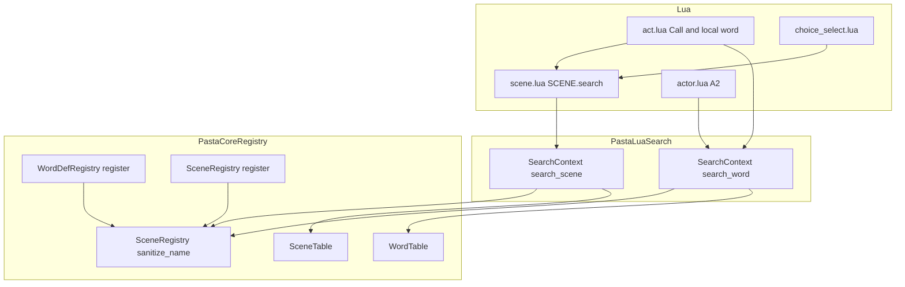
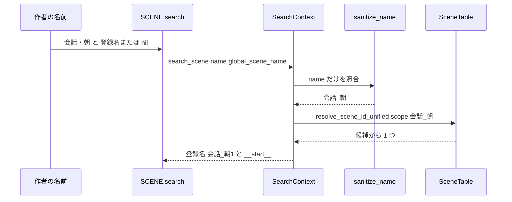

# Design Document: scene-search-key-normalization

## Overview

**Purpose**: 記号を含むシーン名（グローバル・ローカル）とアクター名を、ゴースト作者が書いた元の名前のまま Call・シーン検索・アクター単語参照できるようにする。

**Users**: ゴースト作者（`.pasta` と Lua スクリプトを書く人）。`＊会話・朝` を `＞会話・朝` で呼ぶ、`さくら・改：＠通常` でアクター辞書を引く、といった普通の書き方がそのまま動く。

**Impact**: 登録側はすでに 1 つの照合規則（`SceneRegistry::sanitize_name`）を共有している。検索側の入口 2 か所（`SearchContext::search_scene` の名前、`SearchContext::search_word` のスコープ）だけがこの規則を通っていない。本設計はこの 2 か所を同じ規則に通す。変更は Rust の 2 行で、登録キーの形式・検索アルゴリズム・公開メソッドの引数と戻り値・Lua スクリプトは変えない。

### Goals

- シーン検索の入口（`search_scene`）で、第 1 引数（作者が書いた名前）を照合用の名前に揃える。
- 単語検索の入口（`search_word`）で、第 2 引数（スコープ）を照合用の名前に揃える。これで、`actor.lua` が元のアクター名から組み立てたスコープ名が、登録キーと一致する。
- 登録と検索が同じ関数（`SceneRegistry::sanitize_name`）を呼ぶ構造にし、食い違いをテストで検出できるようにする。
- マニュアルを変更後の挙動に合わせ、生成スキルの `references/` を再生成する。

### Non-Goals

- 登録名の形式（名前と通し番号の区切り）の変更。`scene-identity-format` が持つ。
- 検索アルゴリズム（前方一致・シャッフル＆順次消費・Call の 5 段）の変更。
- 照合用の名前が重なる名前の検出・警告。
- 単語名（単語キー。`search_word` の第 1 引数）の照合、Lua テーブルを完全一致で引く段（Call の 1・3・4 段、A1 段）の変更。
- 照合規則の関数の移動・改名。
- `@pasta_search` へのメソッドの追加。公開 API は増やさない。
- Lua スクリプト（`actor.lua` を含む）の変更。スコープ名 `__actor_…__` は今までどおり `actor.lua` が組み立てる。
- `search_scene` の第 2 引数（グローバルシーンの登録名）の照合。

## Boundary Commitments

### This Spec Owns

- `SearchContext::search_scene` の第 1 引数を照合用の名前に揃える処理。
- `SearchContext::search_word` の第 2 引数（スコープ）を照合用の名前に揃える処理。
- 上記を固定するテストと、マニュアルの該当記述・生成スキルの `references/`。

### Out of Boundary

- `crates/pasta_lua/src/search/context.rs` 以外のソース。`crates/pasta_core/src/registry/` は、ドキュメントコメントとテスト以外は変えない。`actor.lua`・`act.lua`・`scene.lua`・`choice_select.lua`・`code_gen/`・`transpiler.rs`・`runtime/finalize.rs`・`random.rs` は編集しない。
- `actor.lua` の `PROXY_IMPL` の呼び出し規約と、A2 段のスコープ名の組み立て（`"__actor_" .. self.actor.name .. "__"`）。
- `SceneTable`・`WordTable` の検索表（`scene_table.rs`・`word_table.rs`）。照合は検索表の手前（`SearchContext`）で済ませる。
- 既存の Lua テスト（`lua_specs/`）と、`@pasta_search` の代役。`actor.lua` が呼ぶメソッドと引数が変わらないので、書き換えない。
- `crates/pasta_shiori/tests/support/scripts/` にある Lua スクリプトの写し。本仕様では触らない（写しの `actor.lua` も `search_word` を呼ぶので、修正はそのまま効く）。
- 内部 API（`PASTA.create_scene` など）を生成コード以外から置き換え前の名前で呼ぶ利用。

### Allowed Dependencies

- `pasta_lua::search` → `pasta_core::registry`（既存の依存方向。`SceneRegistry::sanitize_name` を呼ぶ）。
- `pasta_core` は `pasta_lua` に依存しない（逆向きの依存を作らない）。
- 新しいクレート・外部ライブラリは足さない。

### Revalidation Triggers

次の変更があったときは、本仕様に依存する spec（`scene-identity-format`・`actor-proxy-act-delegation`・`search-selector-indices`・`call-attribute-filter`）と利用者向けマニュアルを確認し直す。

- `search_scene(name, global_scene_name)`・`search_word(name, global_scene_name)` の引数・戻り値の意味が変わる。
- 照合規則（`SceneRegistry::sanitize_name`）で残る文字・置き換える文字が変わる。
- 登録名の区切り文字が、照合規則で `_` に置き換わる文字になる。要件 3.2 の前提が崩れるほか、`search_word` に渡す登録名（ローカル単語のスコープ）が照合で変わってしまう。
- アクター単語のキー形式（`:__actor_{名前}__:{単語名}`）、または `actor.lua` が組み立てるスコープ名の形（`__actor_{名前}__`）が変わる。
- `search_scene` の第 2 引数に照合規則を適用するようになる。

## Architecture

### Existing Architecture Analysis

- 照合規則の実体は `SceneRegistry::sanitize_name`（`crates/pasta_core/src/registry/scene_registry.rs:241`）1 つである。`WordDefRegistry::sanitize_name` はこれに委譲する。登録（`register_global`・`register_local`・`increment_counter`・`WordDefRegistry::register_local`・`register_actor`）と生成（`scope_gen.rs:120,241`・`transpiler.rs:206`）はすでにこれを呼んでいる。
- シーン検索は、Call の 2・5 段、`SCENE.search`、`SCENE.co_exec`（SHIORI イベント）、選択肢のルーティング（`choice_select.lua:61-62`）、キック、辞書確定前の検索のすべてが `SearchContext::search_scene`（`crates/pasta_lua/src/search/context.rs:68`）を通る。ここは第 1 引数をそのまま検索表へ渡している。
- 単語検索は、ローカル単語（`act.lua:292`）もアクター単語（`actor.lua:142-143`）も `SearchContext::search_word`（`context.rs:160`）を通る。ここは第 2 引数（スコープ）をそのまま検索表へ渡している（`context.rs:165` の `let module_name = global_scene_name.unwrap_or("");`）。検索表は `:{スコープ}:{単語キー}` の前方一致で探す。
- 単語の登録側は、ローカル単語（`word_registry.rs:64`）もアクター単語（`word_registry.rs:83`）も、スコープの元になる名前を照合規則に通してからキーを作る。つまり単語表では「登録はスコープを置き換えるが、検索は置き換えない」という非対称がある。
- `actor.lua` は元のアクター名からスコープ名 `"__actor_" .. self.actor.name .. "__"` を組み立てる。記号を含むアクター名では、これが登録キーのスコープ（`__actor_{照合用の名前}__`）と食い違う。
- ローカル単語のスコープに渡るのは登録名（`会話_朝1` の形。英数字と `_` だけ）なので、照合規則を通しても変わらない。
- 「見つからない」警告は Lua 側（`act.lua:513` など）が元のキーで出す。Rust 側で名前を置き換えても表示は変わらない。
- 文法上、`・`（U+30FB）・`·`（U+00B7）・`＿`（U+FF3F）は識別子の 2 文字目以降に書ける（pest の `XID_CONTINUE` に含まれることを確認済み）。したがって `＊会話・朝`・`％さくら・改` は構文エラーにならず、照合だけが食い違う。

### Architecture Pattern & Boundary Map



**Architecture Integration**:

- **Selected pattern**: 入口での正規化。検索表（`SceneTable`・`WordTable`）は照合済みのキーだけを扱い、「作者が書いた名前」を知るのは `SearchContext` の入口だけにする。
- **Domain/feature boundaries**: 規則そのもの（`sanitize_name`）は `pasta_core::registry` が持つ。規則をいつ適用するか（検索の入口）は `pasta_lua::search` が持つ。Lua 側は規則を持たない。
- **Existing patterns preserved**: `@pasta_search` の公開メソッド（`search_scene`・`search_word`）の引数と戻り値。`actor.lua` の A2 段の呼び方。
- **New components rationale**: 新しい部品は無い。既存の 2 つのメソッドに、照合規則の呼び出しを 1 行ずつ足す。
- **Steering compliance**: 依存方向（`pasta_lua` → `pasta_core`）を保つ。マニュアルを文法・API の唯一の権威として同じ変更で更新する。

### 設計判断

| 項目 | 判断 | 理由 |
| ---- | ---- | ---- |
| シーン検索の修正場所 | `SearchContext::search_scene` の冒頭で第 1 引数だけを `SceneRegistry::sanitize_name` に通す | すべての呼び出し元がここを通るので 1 か所で効く。検索表（`pasta_core`）に「作者の名前」という概念を持ち込まない。第 2 引数に触れないので要件 3.3 を満たす |
| アクター単語の直し方 | `SearchContext::search_word` の第 2 引数（スコープ）を `SceneRegistry::sanitize_name` に通す（設計ディスカッションで決定） | 登録側がスコープをすでに置き換えているので、検索側も置き換えれば対称になる。公開 API を増やさない。Lua スクリプトを変えない。既存のテストを書き換えない（要件 7.5 を文字どおり満たす） |
| 照合規則の関数の置き場所 | 動かさない（`SceneRegistry::sanitize_name` のまま。改名もしない） | 実体はすでに 1 つである。動かすと `scope_gen.rs`・`transpiler.rs` の呼び出しも変わる。要件に移動の理由が無い |
| SHIORI 応答を確かめるテストの置き場所 | `crates/pasta_lua/tests/` の新しい結合テスト（`PastaLoader::load` で実際の `.pasta` とランタイムの Lua スクリプトを読み込み、`EVENT.fire` の応答文字列を確かめる） | `pasta_lua` の `tests/common` には実物の `pasta_scripts` を使う一時ゴースト作成ヘルパー（`create_temp_with_pasta`）がある。`pasta_shiori` のテスト環境（`ShioriTestEnv`）は `tests/support/scripts` にある古い写しを使うため、選択肢のルーティング（`pasta/shiori/event/`）が入っておらず、要件 2.4 を確かめられない |

スコープを照合規則に通しても安全である理由:

- **ローカル単語**: スコープは登録名（英数字と `_` だけ）なので、照合規則を通しても同じ文字列になる。結果は変更前と同じである。
- **アクター単語（記号なし）**: `__actor_さくら__` は英数字と `_` だけなので、同じ文字列になる。結果もキャッシュの記録も変更前と同じである。
- **アクター単語（記号あり）**: `__actor_さくら・改__` は `__actor_さくら_改__` になり、登録キー `:__actor_さくら_改__:通常` のスコープと一致する。
- **要件 4.6**: アクター `a__:b` の単語 `x` は、登録キーが `:__actor_a___b__:x`、検索の前方一致キーも `:__actor_a___b__:x` になる。アクター `a` の単語 `b__:x` は、登録キーも検索キーも `:__actor_a__:b__:x` になる（単語キーは置き換えない）。2 つは `a__` の次の文字（`_` と `:`）で分かれるので、取り違えない。
- **スコープなし**: `nil` は今までどおり空のスコープ（グローバル単語の検索）として扱う。

### Technology Stack

| Layer | Choice / Version | Role in Feature | Notes |
|-------|------------------|-----------------|-------|
| レジストリ | `pasta_core::registry`（Rust 2024） | 照合規則を持つ | 既存。コードは変えない |
| 検索モジュール | `pasta_lua::search`（mlua 経由で `@pasta_search` として公開） | 検索の入口で名前とスコープを照合する | 既存。2 行の変更 |
| マニュアル | `book/src/`（mdBook）＋ `book/tools/gen-skill-refs.mjs` | 挙動の記述と生成スキルの再生成 | 既存の道具を使う |

新しい依存は無い。

## File Structure Plan

### Directory Structure

```
crates/
├── pasta_core/src/registry/
│   └── scene_registry.rs         # ドキュメントコメントだけ（検索の入口でも使うことを書く）
├── pasta_lua/
│   ├── src/search/
│   │   └── context.rs            # 変更: search_scene の名前と search_word のスコープを照合／単体テストを足す
│   └── tests/
│       └── symbol_name_search_test.rs   # 新規: 記号を含む名前の結合テスト（SHIORI 応答を含む）
book/src/
├── grammar/call-jump.md          # 変更: シーン名の記号と照合
├── grammar/actor-dictionary.md   # 変更: 記号を含むアクター名と照合
├── lua/modules/pasta-search.md   # 変更: search_scene の名前と search_word のスコープの照合
├── internals/internal-modules.md # 変更: A2 段のスコープ名が検索の入口で照合されること
└── internals/registry-search.md  # 変更: 「検索キーはサニタイズされない」の訂正／規則の共有
.claude/skills/
├── pasta-ghost-authoring/references/   # 再生成（手で編集しない）
└── pasta-lua-coding/references/        # 再生成（手で編集しない）
```

### Modified Files

- `crates/pasta_lua/src/search/context.rs` — 次の 2 か所を変える。同ファイルの単体テストに記号を含む名前のテストを足す。メソッドのドキュメントコメントも合わせる。
  - `search_scene`（68 行〜）: 関数の冒頭（73 行の `let filters = …` の前後）で `name` を `SceneRegistry::sanitize_name` に通し、以降の 2 つの `resolve_scene_id_unified` 呼び出し（80・103 行）に照合後の名前を渡す。
  - `search_word`（160 行〜）: 165 行の `let module_name = global_scene_name.unwrap_or("");` を、スコープを `SceneRegistry::sanitize_name` に通した文字列（`nil` のときは空文字列）に置き換え、167 行の `self.word_table.search_word(…)` にそれを渡す。
- `crates/pasta_core/src/registry/scene_registry.rs` — コードは変えない。`sanitize_name` のドキュメントコメントに「検索の入口でも使う」ことを書き足すだけにとどめる。
- `book/src/` の 5 ファイル — 「マニュアルの更新」の節を参照。

変更しないファイル（確認用）: `crates/pasta_core/src/registry/word_registry.rs`、`crates/pasta_lua/pasta_scripts/pasta/actor.lua`、`crates/pasta_lua/tests/lua_specs/` の既存テスト。

### 新規ファイル

- `crates/pasta_lua/tests/symbol_name_search_test.rs` — 記号を含む名前の結合テスト。ほかの spec が同じ波で触るテストファイルと衝突しないよう、独立したファイルにする。テスト用の `.pasta` はテストコードに文字列で書く（`create_temp_with_pasta` に渡す）。

## System Flows



- `search_scene` の第 2 引数（`global_scene_name`）は照合しない。渡された登録名のまま検索表へ渡す（要件 3.3）。
- 順次消費のキャッシュキーは照合後の名前になる。`会話・朝` と `会話_朝` で検索した場合、同じ並び順の記録を進める（要件 5.1 の「同じ名前の候補」と整合する）。
- アクター単語は、`actor.lua` が `SEARCH:search_word(key, "__actor_さくら・改__")` を呼び、`search_word` がスコープを `__actor_さくら_改__` に揃えてから検索表を引く。単語キー `key` は照合しない。
- 単語のキャッシュキーは（照合後のスコープ, 単語キー）になる。記号を含まないスコープでは変更前と同じ記録を使う（要件 3.4）。`さくら・改` と `さくら_改` は同じ記録を進める（要件 5.2 と整合する）。

## Requirements Traceability

| Requirement | Summary | Components | Interfaces | Flows |
|-------------|---------|------------|------------|-------|
| 1.1 | 記号を含むグローバルシーンを Call | SearchContext | `search_scene` | シーン検索 |
| 1.2 | 動的ターゲットでも同じ結果 | SearchContext | `search_scene` | シーン検索（入口が同じ） |
| 1.3 | `SCENE.search`・`search_scene` で検索 | SearchContext | `search_scene` | シーン検索 |
| 1.4 | 照合用の名前どうしの前方一致 | SearchContext | `search_scene` | シーン検索 |
| 1.5 | SHIORI イベントで 204 にしない | SearchContext | `search_scene` | シーン検索（`SCENE.co_exec` 経由） |
| 2.1 | 記号を含むローカルシーンを Call | SearchContext | `search_scene`（第 2 引数あり） | シーン検索 |
| 2.2 | `SCENE.search(名前, 登録名)` | SearchContext | `search_scene` | シーン検索 |
| 2.3 | ローカルの前方一致 | SearchContext | `search_scene` | シーン検索 |
| 2.4 | 選択肢のジャンプ先 | SearchContext | `search_scene`（`choice_select.lua` は無変更） | シーン検索 |
| 3.1 | 登録と検索が同じ規則 | SceneRegistry.sanitize_name、SearchContext | `sanitize_name` を登録と検索の両方が呼ぶ | 構成図 |
| 3.2 | 登録名を渡したときは変更前と同じ | SearchContext | `search_scene`（規則は登録名に対して恒等） | — |
| 3.3 | シーン検索の第 2 引数は照合しない | SearchContext | `search_scene` | シーン検索 |
| 3.4 | 記号を含まない名前は変更前と同じ | SearchContext | `search_scene`・`search_word`（規則は英数字と `_` に対して恒等） | — |
| 3.5 | 見つからないときの警告は元の名前 | （変更なし。`act.lua` が元のキーで警告） | `search_scene` は `nil` を返すだけ | — |
| 3.6 | `:` で始まる名前はローカルを候補にしない | SearchContext | `search_scene` | — |
| 3.7 | 辞書確定前も同じ規則 | SearchContext | `search_scene`（確定前後で同じ入口） | — |
| 4.1 | `さくら・改：＠通常` | SearchContext | `search_word`（スコープを照合） | アクター単語検索 |
| 4.2 | `WORD.create_actor` で登録した単語 | SearchContext | `search_word`（スコープを照合） | アクター単語検索 |
| 4.3 | pasta.toml の `[actor."名前"]` | SearchContext | `search_word`（スコープを照合） | アクター単語検索 |
| 4.4 | 見つからなければ次の段へ | SearchContext（`actor.lua` は無変更） | `search_word` が `nil` | — |
| 4.5 | アクター名を登録と同じ規則で照合 | SearchContext | `search_word`（スコープごと `sanitize_name` に通す） | 構成図 |
| 4.6 | `:` を含むアクター名を取り違えない | SearchContext | `search_word`（スコープの `:` は `_` になる。単語キーは置き換えない） | — |
| 5.1 | 重なるシーン名は同じ名前の候補 | SearchContext（既存の採番と前方一致） | `search_scene` | — |
| 5.2 | 重なるアクター名は同じ辞書 | SearchContext | `search_word`（同じスコープになる） | — |
| 5.3 | 重なる名前の扱いをマニュアルに書く | マニュアル | `grammar/call-jump.md`・`grammar/actor-dictionary.md` | — |
| 6.1 | Call の章 | マニュアル | `grammar/call-jump.md` | — |
| 6.2 | アクター辞書の章 | マニュアル | `grammar/actor-dictionary.md` | — |
| 6.3 | 食い違う記述を残さない | マニュアル | `grammar/call-jump.md`・`internals/registry-search.md` | — |
| 6.4 | `search_scene`・`search_word` の説明 | マニュアル | `lua/modules/pasta-search.md` | — |
| 6.5 | 内部構造の章 | マニュアル | `internals/internal-modules.md`・`internals/registry-search.md` | — |
| 6.6 | 生成スキルの再生成と検査 | 生成スキル | `gen-skill-refs.mjs`・`link-check.mjs` | — |
| 7.1 | グローバルシーンのテスト | テスト | 単体＋結合 | — |
| 7.2 | ローカルシーンと選択肢のテスト | テスト | 単体＋結合 | — |
| 7.3 | アクター単語のテスト | テスト | 単体＋結合 | — |
| 7.4 | 登録名の不変と衝突のテスト | テスト | 単体 | — |
| 7.5 | 既存テストを期待値を変えずに通す | テスト | 既存テスト一式（書き換えない） | — |
| 7.6 | 片側だけ規則が変わると失敗する | テスト | 登録→元の名前で検索の往復テスト | — |

## Components and Interfaces

| Component | Domain/Layer | Intent | Req Coverage | Key Dependencies (P0/P1) | Contracts |
|-----------|--------------|--------|--------------|--------------------------|-----------|
| SearchContext | pasta_lua / search | 検索の入口で作者の名前とスコープを照合する | 1.1–1.5, 2.1–2.4, 3.1–3.7, 4.1–4.6, 5.1, 5.2 | SceneRegistry.sanitize_name (P0) | Service |
| SceneRegistry.sanitize_name | pasta_core / registry | 照合規則（既存・無変更） | 3.1 | — | Service |
| マニュアルと生成スキル | book / skills | 挙動の記述 | 5.3, 6.1–6.6 | gen-skill-refs.mjs (P0) | — |
| テスト | tests | 修正の固定 | 7.1–7.6 | — | — |

### pasta_lua / search

#### SearchContext

| Field | Detail |
|-------|--------|
| Intent | シーン検索の名前と、単語検索のスコープを、検索の入口で照合用の名前に揃える |
| Requirements | 1.1, 1.2, 1.3, 1.4, 1.5, 2.1, 2.2, 2.3, 2.4, 3.1, 3.2, 3.3, 3.4, 3.5, 3.6, 3.7, 4.1, 4.2, 4.3, 4.4, 4.5, 4.6, 5.1, 5.2 |

**Responsibilities & Constraints**

- `search_scene`: 冒頭で第 1 引数 `name` だけを `SceneRegistry::sanitize_name` に通し、以降の処理（`resolve_scene_id_unified` の呼び出し、エラーの `None` への変換、戻り値の組み立て）は変えない。第 2 引数 `global_scene_name` は照合しない。
- `search_word`: 第 2 引数（スコープ）を `SceneRegistry::sanitize_name` に通してから検索表へ渡す。第 1 引数（単語キー）は照合しない。スコープが `nil` のときは今までどおりグローバル単語を検索する。
- 検索表・キャッシュ・セレクターの扱いは変えない。メソッドは足さない。

**Dependencies**

- Inbound: `scene.lua` の `SCENE.search` — シーン検索 (P0)
- Inbound: `act.lua` のローカル単語検索、`actor.lua` の A2 段 — 単語検索 (P0)
- Inbound: 利用者の Lua スクリプト — `@pasta_search` の公開メソッド (P1)
- Outbound: `SceneRegistry::sanitize_name` — 照合 (P0)
- Outbound: `SceneTable`・`WordTable` — 検索表（無変更） (P0)

**Contracts**: Service [x] / API [ ] / Event [ ] / Batch [ ] / State [ ]

##### Service Interface

Rust（`crates/pasta_lua/src/search/context.rs`）。シグネチャはどちらも変更しない。

```rust
impl SearchContext {
    /// name だけを照合用の名前に揃えてから検索する。global_scene_name は照合しない。
    pub fn search_scene(
        &mut self,
        name: &str,
        global_scene_name: Option<&str>,
    ) -> Result<Option<(String, String)>, SearchError>;

    /// global_scene_name（スコープ）を照合用の名前に揃えてから検索する。name は照合しない。
    pub fn search_word(
        &mut self,
        name: &str,
        global_scene_name: Option<&str>,
    ) -> Result<Option<String>, SearchError>;
}
```

Lua（`@pasta_search`。引数・戻り値は変更なし）:

```lua
SEARCH:search_scene(name, global_scene_name?) -> global_name, local_name | nil
SEARCH:search_word(name, global_scene_name?)  -> string | nil
```

`search_scene`:

- Preconditions: `name` は文字列。`global_scene_name` は `search_scene` が返した登録名、または `nil`。
- Postconditions:
  - `name` を照合用の名前に置き換えた文字列で、変更前と同じ前方一致・シャッフル＆順次消費を行う（要件 1.4・2.3）。
  - 英数字と `_` だけの `name`（記号を含まない名前、登録名）では、候補・選択・戻り値が変更前と同じ（要件 3.2・3.4）。
  - 戻り値は登録名（`会話_朝1`・`選択_A_1` の形）で、変更前と同じ意味を持つ。
  - 見つからなければ `nil`（Rust では `Ok(None)`）。警告は出さない（呼び出し側が元の名前で出す。要件 3.5）。
  - 第 2 引数なしで `:` で始まる `name` を渡しても、ローカルシーンは候補にならない（`:` が `_` になるため、ローカルのキーに前方一致しない。要件 3.6）。
- Invariants: 辞書確定前の `SearchContext`（トランスパイル時のレジストリから作る）と確定後の `SearchContext` は同じメソッドを使うので、同じ規則で照合する（要件 3.7）。

`search_word`:

- Preconditions: `name`（単語キー）は文字列。`global_scene_name` は、グローバルシーンの登録名、`actor.lua` が組み立てるアクターのスコープ名（`__actor_{アクター名}__`）、または `nil`。
- Postconditions:
  - スコープを照合用の名前に置き換えた文字列で、変更前と同じ前方一致・シャッフル＆順次消費を行う。
  - 英数字と `_` だけのスコープ（登録名、記号を含まないアクター名のスコープ）と `nil` では、候補・選択・戻り値・並び順の記録が変更前と同じ（要件 3.4）。
  - 記号を含むアクター名のスコープは、登録キーのスコープと一致する（要件 4.1〜4.3・4.5）。
  - 前方一致する単語が無ければ `nil`（要件 4.4）。ほかのスコープへは移らない。
- Invariants: 照合用の名前が同じアクター名は同じ辞書を引く（要件 5.2）。単語キーは置き換えないので、`:` を含むアクター名と `:` を含む単語キーを取り違えない（要件 4.6。「設計判断」の節を参照）。

**Implementation Notes**

- Integration: `search_word` は `Option<&str>` を照合後の `String` に写し、`nil` のときは空文字列にする。Lua メソッドの登録（`add_method_mut`）は変えない。
- Validation: `context.rs` の単体テスト（「Testing Strategy」）。既存の `test_search_scene_global_excludes_local_keys` と、スコープに登録名を渡す既存の `search_word` のテストは、期待値を変えずに通る。
- Risks:
  - 記号を含む検索キーが、これまで一致しなかったシーンに一致するようになる（意図した変更）。SHIORI のイベント ID に `.` などが入るもの（例: `sakura.recommendsites`）は、`＊sakura_recommendsites` という名前のシーンがあれば一致するようになる。変更前はどのシーンにも一致しなかったので、既存のゴーストの挙動を壊すことは無い。
  - 内部 API（`PASTA.create_scene`）を生成コード以外から記号を含む名前で直接呼んで登録したシーンは、変更後はその名前で検索できなくなる（要件の Out of scope に明記済み）。
  - スコープ名の形 `__actor_…__` は、登録（`word_registry.rs`）と検索（`actor.lua`）が別々に書いたままである。形の食い違いは、実物の `actor.lua` を通す結合テストで検出する。
  - 後続の `scene-identity-format` が登録名の区切りを照合規則で消える文字にすると、ローカル単語の検索が壊れる。Revalidation Triggers に記載済み。

### マニュアルの更新

内容の権威は実装後の挙動である。利用者向けの章では「照合用の名前」という言葉で説明し、内部構造の章では既存の用語「サニタイズ」と対応づける。回避策のレシピは書かない。

| ファイル | 書くこと | 要件 |
| -------- | -------- | ---- |
| `book/src/grammar/call-jump.md` | シーン名に記号（識別子に書ける文字）を使えること。検索は、書いた名前を照合用の名前に揃えてから照合用の名前どうしで前方一致すること。「書いた名前をそのまま検索キーにする」の訂正。照合用の名前が同じになる名前は区別されず、同じ名前の候補になること | 5.3, 6.1, 6.3 |
| `book/src/grammar/actor-dictionary.md` | 記号を含むアクター名でもアクター辞書の単語を引けること。アクター名は照合用の名前で照合すること。照合用の名前が同じアクター名は同じアクター辞書を共有すること | 5.3, 6.2 |
| `book/src/lua/modules/pasta-search.md` | `search_scene` の第 1 引数は照合用の名前で照合されること。返る登録名・第 2 引数に渡す登録名は照合用の名前を元にした名前であること（例: `会話・朝` の 1 つ目は `会話_朝1`）。`search_word` の第 2 引数（スコープ）は照合用の名前に揃えてから照合されること（単語キーは揃えない） | 6.4 |
| `book/src/internals/internal-modules.md` | `find_actor_handler` の A2 段が渡すスコープ名（`"__actor_" .. アクター名 .. "__"`）は、`search_word` の入口でサニタイズされてから照合されること | 6.5 |
| `book/src/internals/registry-search.md` | 「検索キーとして渡す名前はサニタイズされない」の訂正（`search_scene` の名前と `search_word` のスコープはサニタイズされる。`search_scene` の第 2 引数と単語キーはされない）。登録と検索が同じ照合規則（`sanitize_name`）を共有すること | 6.3, 6.5 |

- 更新後に `node book/tools/gen-skill-refs.mjs` で `.claude/skills/pasta-ghost-authoring/references/`・`.claude/skills/pasta-lua-coding/references/` を再生成し、`node book/tools/gen-skill-refs.mjs --check` と `node book/tools/link-check.mjs` に通す（要件 6.6）。
- `book/src/internals/transpiler.md`・`debug.md`・`grammar/markers.md`・`lua/script-api.md` は、変更後の挙動と食い違う記述が無いことを確認するだけにとどめる（食い違いが見つかった場合だけ直す）。

## Error Handling

### Error Strategy

新しいエラーの種類は足さない。

- 見つからない場合: `search_scene`・`search_word` は `nil` を返す。警告は今までどおり呼び出し側（`act.lua`・`actor.lua` 経由の `proxy:word`）が元の名前で出す（要件 3.5）。
- 空文字列の `name`: `search_scene` は変更前と同じく検索表のエラー（`InvalidScene`）を Lua エラーとして返す。
- 引数の型が違う場合: mlua の型変換エラーになる（変更前と同じ）。

### Monitoring

ログの追加は無い。

## Testing Strategy

### Unit Tests

`crates/pasta_lua/src/search/context.rs`（トランスパイル時の形のレジストリと、`register_global_raw` で作る確定後の形のレジストリの両方で確かめる）:

- 記号を含むグローバルシーン（`会話・朝`）を元の名前と先頭部分（`会話・`）で検索できる（1.3, 1.4, 3.7, 7.1）。
- 記号を含むローカルシーン（`選択・A`）を、親の登録名を第 2 引数にして元の名前と先頭部分で検索できる。第 2 引数は置き換えられない（2.2, 2.3, 3.3, 7.2）。
- 登録名（`会話_朝_1`・`会話_朝1`・`選択_A_1`）を渡した結果が、照合なしの場合と同じである（3.2, 7.4）。
- `会話・朝` と `会話_朝` を両方登録し、どちらの名前で検索しても 2 つのシーンが候補になり、順次消費で両方が 1 回ずつ返る（5.1, 7.4）。
- 第 2 引数なしで `:` で始まる名前を渡してもローカルシーンが返らない（既存テスト。3.6）。
- `register_actor("さくら・改", …)` で登録した単語を、`search_word(キー, Some("__actor_さくら・改__"))`（`actor.lua` が作るのと同じ形のスコープ）で引ける。単語が無ければ `None` を返す（4.4, 4.5, 7.3）。
- アクター `a__:b` の単語 `x` と、アクター `a` の単語 `b__:x` を取り違えない（4.6）。
- `さくら・改` と `さくら_改` に登録した単語が、どちらのアクター名のスコープでも同じ辞書の候補になる（5.2）。
- スコープに登録名（`メイン_1`）と `None` を渡した結果が変更前と同じである（既存テスト。3.4）。
- **往復テスト**（7.6）: 記号の見本（`・`・`·`・`＿`・`-`・`:` など）を含む名前を登録の API（`register_global`・`register_local`・`register_actor`）で登録し、同じ元の名前で検索の API（`search_scene`、および元のアクター名から作ったスコープでの `search_word`）から見つかることを、見本ごとに確かめる。登録か検索のどちらか一方だけで規則が変わると失敗する。

### Integration Tests

`crates/pasta_lua/tests/symbol_name_search_test.rs`（新規。`create_temp_with_pasta` → `PastaLoader::load` で実物のランタイムを起こす。アクター単語は実物の `actor.lua` の A2 段を通る）:

- `＊会話・朝` を別のシーンから `＞会話・朝` で Call すると、そのシーンの出力が得られ、警告が出ない（1.1, 7.1）。
- 動的ターゲット（文字列・変数）で `会話・朝` を指すと、同じシーンが実行される（1.2）。
- `SCENE.search("会話・朝")` と `SEARCH:search_scene("会話・朝")` が結果を返す（1.3）。
- グローバルシーンの中の `・選択・A` を `＞選択・A` で Call できる。`SCENE.search("選択・A", 登録名)` が結果を返す（2.1, 2.2, 7.2）。
- `EVENT.fire` でイベントを起こし、そのイベントのシーンが記号を含むグローバルシーンを Call したとき、応答が 200 でシーンの出力を含む（204 にならない）（1.5）。
- 選択肢行（`＠？選択・A「Aにする」`）を出したあと、`OnChoiceSelectEx`（Reference1 = `選択・A`）を `EVENT.fire` で起こすと、応答が 200 でローカルシーンの出力を含む（2.4, 7.2）。
- `％さくら・改` のアクター辞書の単語を `さくら・改：＠通常` で出力できる（4.1, 7.3）。
- `scripts/main.lua` から `WORD.create_actor("さくら・改", キー)` で登録した単語を、そのアクターの単語参照で引ける（4.2）。
- pasta.toml の `[actor."名前"]` に記号を含む名前を設定し、同じ名前のアクター辞書の単語を引ける（4.3）。
- 存在しない記号つきの名前を Call すると、次の行へ進み、警告に元の名前が出る（3.5）。

### 回帰（7.5）

- `cargo test --workspace` と Lua の単体テスト（`lua_unittest_runner`）がすべて通ること。既存のテストは書き換えない（`actor.lua` が呼ぶメソッドと引数が変わらないので、`@pasta_search` の代役を持つ `lua_specs` のテストもそのまま通る）。
- `cargo clippy --workspace` に警告を足さないこと。

## Performance & Scalability

シーン検索・単語検索 1 回につき、名前またはスコープの長さに比例する文字列の置き換えが 1 回増える。検索表・キャッシュの構造は変わらない。測定が必要な規模の変化ではない。

## Open Questions（設計ディスカッションで決める）

1. **アクター単語の直し方**（A2 段の代役を持つ既存の Lua テストの扱いと、要件 7.5 との関係）。**決定**: `search_word` の第 2 引数（スコープ）を Rust 側で照合規則に通す。新しい公開メソッドは足さず、`actor.lua` も既存の Lua テストも変えない。brief の「スコープ引数には適用しない」は、`search_word` についてはこの決定で置き換える（`search_scene` の第 2 引数は今までどおり照合しない）。
2. **アクターのスコープ名を作る公開関数を `pasta_core` に足すか**。**決定**: 足さない。スコープ名は今までどおり `actor.lua` が組み立て、形の食い違いは往復テストと結合テストで検出する。
3. **記号を含む SHIORI イベント ID が `_` の名前のシーンに一致するようになる副次効果**（例: `sakura.recommendsites` → `＊sakura_recommendsites`）。**決定**: 意図した挙動の帰結として受け入れる。マニュアルには個別に書かない（`grammar/call-jump.md` に書く照合の規則がそのまま当てはまる）。
4. **SHIORI 応答のテストの水準**。本設計は `pasta_lua` の結合テストで `EVENT.fire` の応答文字列（200／204）を確かめる。`pasta_shiori` の DLL 入口（`ShioriTestEnv`）までは通さない（テスト用スクリプトの写しが古く、選択肢のルーティングが入っていないため）。**仮定**: `EVENT.fire` の水準で要件 1.5・2.4 を満たすとみなす。
5. **マニュアルの用語**。利用者向けの章は「照合用の名前」、内部構造の章は既存の「サニタイズ」を使い、内部構造の章で両者を対応づける。**決定**: この使い分けにする。
