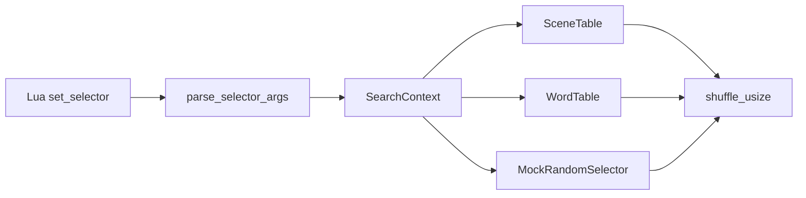
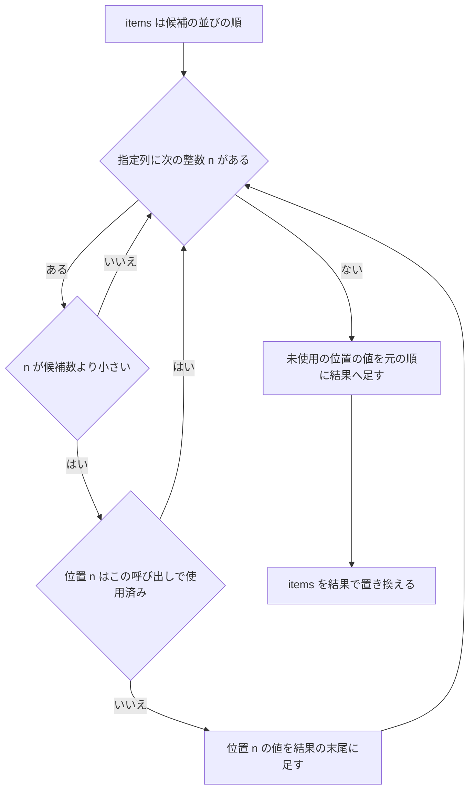

# Design Document: search-selector-indices

## Overview

**Purpose**: `@pasta_search` の `set_scene_selector(n1, n2, …)`・`set_word_selector(n1, n2, …)` に渡した整数を、**巡の中で候補を返す順番（候補の並びの 0 始まりの位置）の指定**として選択に効かせる。ゴースト作者が Lua のテストで「2 番目の候補を選ばせる」と決め打ちできるようにする。

**Users**: ゴースト作者（Lua のテストで選択を固定する）と pasta の開発者（退行をテストで検出する）。

**Impact**: 現行は `MockRandomSelector::shuffle_usize` が何もしないため、整数はシャッフルを止めるだけで値は使われない。本設計はモックの並べ替え 1 メソッドを実装し、シーン表の一巡後の作り直しが候補の並びを基準にするよう 1 か所直し、API 口で負の整数を弾く。本番（`DefaultRandomSelector`）の選び方の分布と乱数の消費回数は変えない。

### Goals
- 指定列が、単語・シーンの両方で、巡ごと・検索ごとに先頭から当てはまる（1.1〜1.8）
- 範囲外・重複は無視、負の整数は呼んだ時点で Lua のエラー（2.1〜2.5）
- 既定の選択・切り替えの挙動を保つ（3.1〜3.5）
- 整数が効くことを自動テストで固定する（4.1〜4.5）
- 利用者章と内部設計章が同じ意味を書く（5.1〜5.5）

### Non-Goals
- 本番の選択アルゴリズム（シャッフルと順次消費）の変更
- 候補の並びの規則（文字コード順・同名シーン 10 個以上の並び）の変更
- 「検索のたびに指定列の次の値の位置を返す」意味（要件ディスカッションで不採用）
- 巡ごとに違う順を指定する機能（呼び直しで対応する。要件の「限界」）
- `RandomSelector` トレイトの形の変更、`select_index` の整理（検索表は使っていない。触らない）
- `set_shuffle_enabled(false)` のときに指定列を効かせること（Lua から呼べない内部テスト用の経路。現行どおり並べ替えを呼ばない）

## Boundary Commitments

### This Spec Owns
- `MockRandomSelector::shuffle_usize` の並べ替え規則（指定列の意味の実体）
- `SceneTable::select_from_cache` の一巡後の作り直し（Phase 4）が `shuffle_usize` に渡す配列の基準
- `@pasta_search` の API 口（`parse_selector_args`）での負の整数の拒否
- 上記を固定するテスト（`pasta_core` の単体テスト、Lua からの結合テスト）
- マニュアル 2 章（`lua/modules/pasta-search.md` のセレクタ節、`internals/registry-search.md` の該当記述）と、マニュアルから生成するスキル参照（`references/pasta-search.md`）の再生成

### Out of Boundary
- `DefaultRandomSelector` の実装
- `WordTable`（`word_table.rs`）— 巡ごとに `0..len` を渡す現行のままで要件を満たすため、変更しない
- `scene_registry.rs`・`word_registry.rs`・検索キーの照合規則（`scene-search-key-normalization` が完了済みで持つ）
- 属性フィルター、候補の収集順
- 手書きのスキル文書 `references/testing-lint.md`（spec 完了時のスキル文書同期で扱う。Open Question 4）

### Allowed Dependencies
- `pasta_lua` → `pasta_core`（既存の向き。逆向きの依存を作らない）
- 新しいクレート・新しい型・新しいトレイトメソッドを足さない
- マニュアルの見出し `### set_scene_selector(...) / set_word_selector(...)` を変えない（`book/tools/link-check-test.mjs` がアンカーを検査する）

### Revalidation Triggers
- `SceneTable`・`WordTable` が `shuffle_usize` に渡す配列の意味（「候補の並びの順に並んだ配列」）を変えるとき
- 候補の並びの規則を変えるとき（マニュアルの例が変わる）
- `RandomSelector` トレイトの形を変えるとき
- `call-attribute-filter`（Wave 5）が `select_from_cache` の `filtered_ids` の作り方を変えるとき（指定列の位置は、フィルタ後の候補の並びに対する位置である）

## Architecture

### Existing Architecture Analysis

- 検索表（`SceneTable`・`WordTable`）は、巡の始まりに候補の配列を `RandomSelector::shuffle_usize` で 1 回だけ並べ替え、先頭から順に消費する。`select_index` は検索表から呼ばれない。
- `set_*_selector` は、引数があれば `MockRandomSelector`、無ければ新しい `DefaultRandomSelector` を作り、`replace_selector` で差し替える。差し替えはキャッシュ（巡の記録）を消す。シーン表と単語表は別々のセレクタを持つ。3.2・3.3・3.4・3.5 は現行で満たす。
- 1 つのモックを、その表のすべての検索が共有する。
- 単語表が `shuffle_usize` に渡すのは、初回・一巡後とも `0..len`（候補の並びの位置）。
- シーン表が渡すのは、初回は候補の並びの順の `SceneId` の配列、一巡後は**前の巡で並べ替えた後の配列**。`SceneId` の昇順は候補の並びの順と一致しない（research.md で確認済み）。

### Architecture Pattern & Boundary Map

既存の「乱数の抽象を差し替える」構造をそのまま使う。新しい部品は無い。



**Architecture Integration**:
- Selected pattern: 既存の `RandomSelector` 差し替え。検索表は「並べ替えてから順次消費」のまま、モックの並べ替えだけが指定列を解釈する。
- 契約: **検索表は、巡の始まりごとに、候補の並びの順に並んだ配列を `shuffle_usize` に渡す**。モックはその配列の位置で並べ替える。単語表は現行で満たす。シーン表は一巡後だけ満たしていないので直す。
- Existing patterns preserved: シャッフルと順次消費、`replace_selector` によるキャッシュ消去、表ごとのセレクタ。
- New components rationale: なし。
- Steering compliance: マニュアルが唯一の権威（同じ変更で更新）。`pasta_core` は言語非依存のまま。

### Technology Stack

| Layer | Choice / Version | Role in Feature | Notes |
|-------|------------------|-----------------|-------|
| Core | Rust 2024 / `pasta_core` | モックの並べ替え、シーン表の作り直し | 依存の追加なし |
| Lua 結合 | mlua 0.11（`luajit52`） / `pasta_lua` | 引数の検査 | `as_integer()` の挙動は実測済み（research.md） |
| マニュアル | mdBook（`book/`）、`gen-skill-refs.mjs` | 意味の記述、スキル参照の再生成 | 見出しは変えない |

## File Structure Plan

新規ファイルは無い。

### Modified Files
- `crates/pasta_core/src/registry/random.rs` — `MockRandomSelector::shuffle_usize` を指定列に従う並べ替えにする。型の doc コメントを新しい意味に直す。単体テスト `test_mock_selector_shuffle_usize_is_noop` を新しい規則のテストに置き換える。
- `crates/pasta_core/src/registry/scene_table.rs` — `select_from_cache` の Phase 4 が、`cached.candidates` ではなく引数 `filtered_ids` から配列を作って `shuffle_usize` に渡す（1 か所）。
- `crates/pasta_core/src/registry/scene_table_candidate_tests.rs` — モック＋シャッフル有効で、指定列が 1 巡目・2 巡目とも候補の並びに当てはまることのテストを足す。
- `crates/pasta_core/tests/word_table_test.rs` — 単語表で指定列が効き、次の巡で当てはめ直すことのテストを足す。
- `crates/pasta_lua/src/search/context.rs` — `parse_selector_args` で負の整数を Lua のエラーにする。
- `crates/pasta_lua/tests/search/module_test.rs` — Lua から `set_word_selector`・`set_scene_selector` を呼ぶ結合テストを足す（Requirement 4）。
- `book/src/lua/modules/pasta-search.md` — セレクタ節の本文を書き換える（見出しはそのまま）。
- `book/src/internals/registry-search.md` — 構成要素の表の `RandomSelector` 行、「候補の選択と乱数」の表（シーンの一巡後）と段落を書き換える。
- `.claude/skills/pasta-lua-coding/references/pasta-search.md` — `node book/tools/gen-skill-refs.mjs` で再生成する（手で編集しない）。

## System Flows

指定列を当てはめる手順（`shuffle_usize` 1 回分。呼び出しごとに指定列の先頭から始める）。



- 結果は常に入力の並べ替え（要素の増減なし）。
- 指定列が空・すべて無視された場合は、入力のままになる。

## Requirements Traceability

| Requirement | Summary | Components | Interfaces | Flows |
|-------------|---------|------------|------------|-------|
| 1.1 | 単語: 巡の先頭から位置 n1, n2, … | MockRandomSelector、WordTable（変更なし） | `shuffle_usize` | 並べ替え手順 |
| 1.2 | シーン: 同上 | MockRandomSelector、SceneTable | `shuffle_usize`、`select_from_cache` | 並べ替え手順 |
| 1.3 | `set_word_selector(1)` で 2 番目 | MockRandomSelector | `shuffle_usize` | 並べ替え手順 |
| 1.4 | 使い切った後は残りを候補の並びの順 | MockRandomSelector | `shuffle_usize` | 「未使用の位置を元の順に」 |
| 1.5 | 次の巡で先頭から当てはめ直す | WordTable（現行）、SceneTable Phase 4 | `select_from_cache` | — |
| 1.6 | 検索ごとに独立 | MockRandomSelector（並べ替えは状態を持たない） | `shuffle_usize` | — |
| 1.7 | `(0)` は現行と同じ | MockRandomSelector | `shuffle_usize` | 恒等になる |
| 1.8 | `(0, 1, 2)` は現行と同じ | MockRandomSelector | `shuffle_usize` | 恒等になる |
| 2.1 | 範囲外は無視 | MockRandomSelector | `shuffle_usize` | 「n が候補数より小さい」 |
| 2.2 | 巡の中の重複は無視 | MockRandomSelector | `shuffle_usize` | 「使用済み」 |
| 2.3 | 負の整数は Lua のエラー、選び方を変えない | parse_selector_args | `set_*_selector` | — |
| 2.4 | 整数でない引数は現行のエラー | parse_selector_args（現行） | `set_*_selector` | — |
| 2.5 | すべて無視なら候補の並びの順 | MockRandomSelector | `shuffle_usize` | 恒等になる |
| 3.1 | 既定はシャッフルと順次消費 | DefaultRandomSelector（変更なし）、SceneTable Phase 4 | — | — |
| 3.2 | シーンのセレクタはシーンだけ | SearchContext（現行） | — | — |
| 3.3 | 単語のセレクタは単語だけ | SearchContext（現行） | — | — |
| 3.4 | 呼ぶと巡の記録を消す | `replace_selector`（現行） | — | — |
| 3.5 | ランタイム全体に効く | SearchContext（現行） | — | — |
| 4.1 | 先頭以外の位置を Lua から指定 | module_test.rs | — | — |
| 4.2 | 使い切り後の順と次の巡 | module_test.rs、scene_table_candidate_tests.rs、word_table_test.rs | — | — |
| 4.3 | 範囲外・重複・負 | random.rs の単体テスト、module_test.rs | — | — |
| 4.4 | 既定に戻ることの検証 | module_test.rs | — | — |
| 4.5 | 整数が使われなくなると失敗する | 4.1〜4.3 のテスト | — | — |
| 5.1 | 利用者章に意味を書く | pasta-search.md | — | — |
| 5.2 | 「2 番目」の例と呼び直し | pasta-search.md | — | — |
| 5.3 | 内部設計章から「使われない」を除く | registry-search.md | — | — |
| 5.4 | 2 章が食い違わない | 両章 | — | — |
| 5.5 | 同じ変更の中で更新 | 両章＋生成物の再生成 | — | — |

## Components and Interfaces

| Component | Domain/Layer | Intent | Req Coverage | Key Dependencies | Contracts |
|-----------|--------------|--------|--------------|------------------|-----------|
| MockRandomSelector | pasta_core / registry | 指定列に従って配列を並べ替える | 1.1〜1.8、2.1、2.2、2.5 | なし | Service |
| SceneTable（Phase 4） | pasta_core / registry | 一巡後の作り直しで候補の並びを基準にする | 1.2、1.5、3.1 | RandomSelector (P0) | State |
| parse_selector_args | pasta_lua / search | 負の整数を弾く | 2.3、2.4 | mlua (P0) | API |
| マニュアル 2 章 | book | 意味の記述 | 5.1〜5.5 | gen-skill-refs.mjs、link-check | — |

### pasta_core / registry

#### MockRandomSelector

| Field | Detail |
|-------|--------|
| Intent | `shuffle_usize` が、渡された配列を指定列に従って並べ替える |
| Requirements | 1.1, 1.2, 1.3, 1.4, 1.6, 1.7, 1.8, 2.1, 2.2, 2.5 |

**Responsibilities & Constraints**
- 入力 `items` を「候補の並びの順に並んだ配列」とみなし、指定列の整数を**位置**として読む（値としては読まない）。
- 呼び出しごとに指定列の先頭から当てはめる。`shuffle_usize` は `self` の状態を読むだけで書かない（既存の `index` フィールドは `select_index` 専用のままで、触らない）。これにより、ある検索の巡が他の検索の回数に左右されない（1.6）。
- 範囲外（`n >= items.len()`）と、同じ呼び出しの中ですでに使った位置は読み飛ばす。
- 型・コンストラクタ（`MockRandomSelector::new(Vec<usize>)`）・トレイトの形は変えない。

**Contracts**: Service [x]

##### Service Interface
```rust
impl RandomSelector for MockRandomSelector {
    /// items を指定列に従って並べ替える（呼び出しごとに指定列の先頭から）。
    fn shuffle_usize(&mut self, items: &mut [usize]);
}
```
- Preconditions: なし（空の `items`・空の指定列を受け付ける）。
- Postconditions: `items` は入力の並べ替えである。先頭側に、指定列の有効な整数（範囲内・初出）の位置にあった値が指定列の順で並び、その後ろに残りの値が入力の順で並ぶ。
- Invariants: 要素の増減なし。同じ `items` と同じ指定列なら、何度呼んでも同じ結果。

例（`items = [a, b, c]`）:

| 指定列 | 結果 | 関係する要件 |
| ------ | ---- | ------------ |
| `[1]` | `b, a, c` | 1.3・1.4 |
| `[2, 0]` | `c, a, b` | 1.1 |
| `[0]`・`[0, 1, 2]`・`[]` | `a, b, c` | 1.7・1.8 |
| `[7, 1]` | `b, a, c` | 2.1 |
| `[1, 1, 0]` | `b, a, c` | 2.2 |
| `[5, 9]` | `a, b, c` | 2.5 |

**Implementation Notes**
- Integration: 既存の `pasta_core` のテストで、シャッフル有効のモックが使う指定列は `[0]` と `[]` だけで、どちらも恒等になる。期待値は変わらない。
- Validation: `random.rs` の単体テストで上の表を固定する。
- Risks: `select_index`（剰余で巡回・状態あり）は `shuffle_usize` と意味が異なるまま残る。検索表は使わないため挙動には影響しない（Open Question 3）。

#### SceneTable::select_from_cache（Phase 4）

| Field | Detail |
|-------|--------|
| Intent | 一巡後の作り直しで、候補の並びの順の配列を `shuffle_usize` に渡す |
| Requirements | 1.2, 1.5, 3.1 |

**Responsibilities & Constraints**
- Phase 4（一巡後の作り直し）が `shuffle_usize` に渡す配列を、`cached.candidates`（前の巡の並べ替え済み）ではなく、引数 `filtered_ids`（その呼び出しで集めた候補の並びの順）から作る。Phase 3（初回）と同じ入力になる。
- 元の並びをキャッシュに別に保存しない。`select_from_cache` は呼び出しのたびに `filtered_ids` を受け取っている。
- `shuffle_enabled` が偽のときは現行どおり並べ替えを呼ばず、`candidates` も変えない。
- 関数の形・`CachedSelection` の形・エラーは変えない。

**Contracts**: State [x]

##### State Management
- State model: `CachedSelection { candidates, next_index, history }`（変更なし）。一巡後は `next_index = 0`、`history` を空にし、`candidates` を「`filtered_ids` を並べ替えたもの」で置き換える。
- Consistency: 検索表は作成後に変わらず、キャッシュのキーは親・検索キー・フィルタを含むため、同じキーの `filtered_ids` は巡をまたいで同じ集合・同じ順である。

**本番（`DefaultRandomSelector`）への影響**（3.1）
- 一様なシャッフルは入力の順に依らず一様な並びを返すため、選ばれ方の分布は変わらない。
- 乱数の消費回数は配列の長さだけで決まるため、変わらない。
- 種を固定した `DefaultRandomSelector::with_seed` では、2 巡目以降の具体的な並びが現行と変わりうる。本番は種を固定しない（`SearchContext::new` はシステムの乱数で種を決める）。種固定の既存テスト `test_resolve_scene_id_cycling_reshuffles` は候補の集合だけを見ており、並びを固定していない。
- 「巡の中で重複なく 1 つずつ返す」「一巡の境目で前の巡の最後と次の巡の最初が同じになりうる」性質は現行と同じ。

### pasta_lua / search

#### parse_selector_args

| Field | Detail |
|-------|--------|
| Intent | Lua の可変長引数を指定列に変換し、不正な値を呼んだ時点で弾く |
| Requirements | 2.3, 2.4 |

**Responsibilities & Constraints**
- 整数でない引数は現行どおり `expected integer argument` のエラー。
- 負の整数は Lua のエラー（メッセージ: `expected non-negative integer argument`。Open Question 2）。
- 0 以上の整数は `usize` に変換する。`usize` に収まらない値（32 ビットのターゲットでの大きな整数）は `usize::MAX` にする（どの検索でも範囲外として無視される。2.1）。`as usize` の折り返しを残さない。
- 検査は `replace_selector` より前に終わる（現行の呼び出し順のまま）。エラーのとき、セレクタも巡の記録も変わらない（2.3「それまでの選び方を変えない」）。

**Contracts**: API [x]

##### API Contract

| Lua の呼び出し | 結果 |
| -------------- | ---- |
| `SEARCH:set_*_selector(n1, n2, …)`（すべて 0 以上の整数） | 指定列を設定し、巡の記録を消す |
| `SEARCH:set_*_selector()` | 既定（シャッフル）に戻し、巡の記録を消す |
| 整数でない引数を含む（文字列・`1.5`・`nil`・真偽値・`2^63` 以上） | Lua のエラー `expected integer argument`。何も変えない |
| 負の整数を含む | Lua のエラー `expected non-negative integer argument`。何も変えない |

実測（LuaJIT＋mlua 0.11。research.md）: `1`・`1.0` は同じ整数。`1.5` は整数でない。`-1` は整数 `-1` として届く。`2^62` までは整数、`2^63` 以上は整数でない。`-0` は数値の `-0` として届き、整数でない（`expected integer argument`）。

### マニュアル

#### `book/src/lua/modules/pasta-search.md`（セレクタ節）

見出し `### set_scene_selector(...) / set_word_selector(...)` は変えない。本文に次を書く（5.1・5.2）。

- 整数は、巡（候補を重複なく返し切るまで）の中で返す順番を、候補の並びの 0 始まりの位置で指定する。
- 候補の並びの規則（現行の記述: 文字コード順、同じ単語キーの値は定義した順、`メイン10` が `メイン2` より先）はそのまま残し、「候補の並び」の定義として使う。
- 指定列を使い切ったら、まだ返していない候補を候補の並びの順に返す。一巡すると、次の巡も指定列の先頭から当てはめる。
- 指定列は検索（名前と範囲の組）ごとに独立して当てはまる。
- 候補の数以上の整数と、巡の中ですでに返した位置の整数は無視する。負の整数は Lua のエラー。整数でない引数は `expected integer argument`。
- 指定列は 1 本で、すべての巡に同じ順を当てはめる。巡ごとに違う順は指定できない。別の順にするには `set_*_selector` を呼び直す（呼ぶと巡の記録が消える）。
- 例: `set_word_selector(1)` で 2 番目の候補を最初に選ばせる例、`set_word_selector(2, 0)` の例。既存の `set_*_selector(0)` の例は結果が変わらないので残す。
- パラメータ表の説明を「0 以上の整数（候補の並びの位置。0 始まり）」にする。
- 既存の「ランタイム全体に効く」「テストの後は既定に戻す」は残す。

#### `book/src/internals/registry-search.md`

- 構成要素の表の `RandomSelector` 行: 「モックはシャッフルしない」→「モックは `shuffle_usize` で、渡された配列を指定列（位置の並び）に従って並べ替える」。
- 「候補の選択と乱数」の表、シーンの「一巡した後」: 「同じ候補の並びをシャッフルし直して」→「その呼び出しで集めた候補（収集した順）をシャッフルし直して」。
- 段落「`MockRandomSelector` の `shuffle_usize` は何もしないため…渡した整数の値は検索表の選択に影響しない」を除き、次を内部の言葉で書く（5.3・5.4）: 検索表は巡の始まりごとに収集した順の配列を `shuffle_usize` に渡す。モックは指定列の整数を配列の位置として読み、有効な位置の値を先に、残りを元の順に並べる。範囲外・重複は読み飛ばす。並べ替えは呼び出しごとに指定列の先頭から始まり、状態を持たないため、検索ごと・巡ごとに同じ順になる。負の整数は API 口（`parse_selector_args`）がエラーにする。`set_shuffle_enabled(false)` のときは `shuffle_usize` を呼ばないため、指定列は効かない。

#### スキル参照
- `.claude/skills/pasta-lua-coding/references/pasta-search.md` はマニュアルからの生成物。`node book/tools/gen-skill-refs.mjs` で再生成する（CI の `--check` が鮮度を見る）。

## Error Handling

### Error Strategy
- 不正な引数は API 口で早く弾く（呼んだ時点の Lua のエラー）。検索の時点ではエラーを出さない。
- 範囲外・重複は検索ごとに候補数が違うため誤りと決められず、黙って無視する（要件の確定事項 3・4）。ログも出さない。

### Error Categories and Responses
- **利用者の誤り**: 負の整数・整数でない引数 → `mlua::Error::RuntimeError`。セレクタも巡の記録も変えない。
- **システムの誤り**: 追加なし。

## Testing Strategy

### Unit Tests（`pasta_core`）
- `random.rs`: 指定列 `[2, 0]` で `[10, 20, 30]` が `[30, 10, 20]` になる（位置で読む。値では読まない）（1.1・1.4）。
- `random.rs`: 範囲外 `[7, 1]`・重複 `[1, 1, 0]`・すべて無視 `[5, 9]`・空 `[]` の結果（2.1・2.2・2.5・1.7）。
- `random.rs`: 長さの違う配列に続けて 2 回呼んでも、どちらも指定列の先頭から当てはまる（1.6）。`test_mock_selector_shuffle_usize_is_noop` はこれらに置き換える。
- `scene_table_candidate_tests.rs`: 索引の `SceneId` の並びを昇順でない順（例 `[2, 0, 1]`）にした表に、モック `[2, 0]`・シャッフル有効で、1 巡目と 2 巡目が同じ順になる（1.2・1.5。Phase 4 を直さないと 2 巡目で失敗する）。
- `word_table_test.rs`: モック `[1]`・シャッフル有効で、2 番目 → 1 番目 → 3 番目、次の巡も 2 番目から（1.1・1.3・1.5）。

### Integration Tests（`pasta_lua` の `tests/search/module_test.rs`。Lua から `@pasta_search` を呼ぶ）
- `set_word_selector(1)` の直後、候補 3 つの単語（`挨拶`）で 2 番目 → 1 番目 → 3 番目 → 2 番目（4.1・4.2、1.3・1.4・1.5）。
- `set_scene_selector(1)` で、同名シーン 3 つの検索が 2 番目 → 1 番目 → 3 番目 → 2 番目（4.1・4.2、1.2・1.5）。同名シーン 3 つはテスト内で登録する。
- 範囲外 `set_word_selector(7, 1)`・重複 `set_word_selector(1, 1, 0)` の結果（4.3、2.1・2.2）。
- 負の整数: `set_word_selector(1)` → 1 回検索 → `pcall` で `set_word_selector(-1)` がエラー → 次の検索が巡の続き（1 番目）を返す（4.3、2.3）。
- 検索の独立: `set_word_selector(1)` の後、`場所` の検索を挟んでも `挨拶` の巡が変わらない（1.6）。
- シーンと単語の独立: `set_scene_selector(2)` と `set_word_selector(1)` を両方設定し、それぞれが自分の指定列に従う（3.2・3.3）。
- 既定への復帰: `set_word_selector(1)` の後 `set_word_selector()` を呼び、「`set_word_selector()` → 最初の検索」を 40 回くり返して、最初の結果が 2 種類以上あることを見る（4.4。候補 3 つで誤って失敗する確率は 3^-39 程度。Open Question 5）。
- 既存の `set_word_selector(0)`（東京 → 大阪）・`set_word_selector(0, 1, 2)`（scene_test.rs）は変更せずに通る（1.7・1.8）。

4.5 は、上の「先頭以外の位置」を期待するテストが、整数が使われない実装（恒等の並び）で失敗することで満たす。

### マニュアルの検証
- `node book/tools/gen-skill-refs.mjs --check` と `node book/tools/link-check.mjs`（見出しのアンカーが残っていること）。

## Open Questions（設計ディスカッションで確定する）

1. **Phase 4 の入力の変更と 3.1**: 本番でも一巡後のシャッフルの入力が「前の巡の並び」から「収集した順」に変わる。分布と乱数の消費回数は同じ、種固定時の 2 巡目以降の具体的な並びだけが変わる。**仮定**: これは「本番の選択を変えない」に反しない（確定事項 7 が許す最小変更）。
2. **負の整数のエラー文言**: **仮定**: `expected non-negative integer argument`。既存の `expected integer argument` を流用する案もある。利用者章にどこまで文言を書くか（`-0` が `expected integer argument` になる実測結果は利用者章に書かない仮定）。
3. **`select_index` と `index` フィールド**: 検索表は使わないが、`shuffle_usize` と意味が異なるまま残る。**仮定**: 触らない（公開クレートのトレイトの形を変えない）。
4. **手書きのスキル文書 `testing-lint.md`**: 現行の記述（「整数を 1 個以上渡すと、シャッフルをやめて候補を決まった順に返す」）は新しい意味でも誤りではない。**仮定**: 本 spec の実装では触らず、spec 完了時のスキル文書同期で扱う（要件の Adjacent expectations）。生成物 `references/pasta-search.md` は実装の中で再生成する。
5. **既定への復帰のテスト（4.4）**: Lua からは種を固定できない。**仮定**: 40 回の試行で「最初の結果が 2 種類以上」を見る確率的なテスト。
