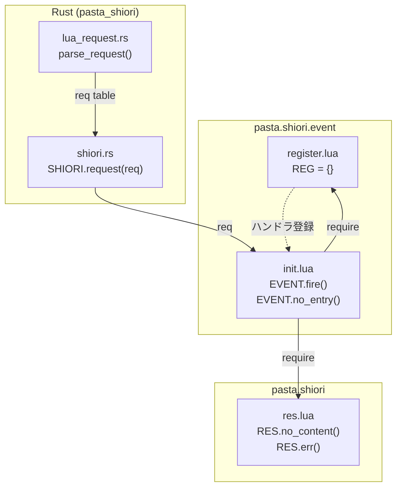
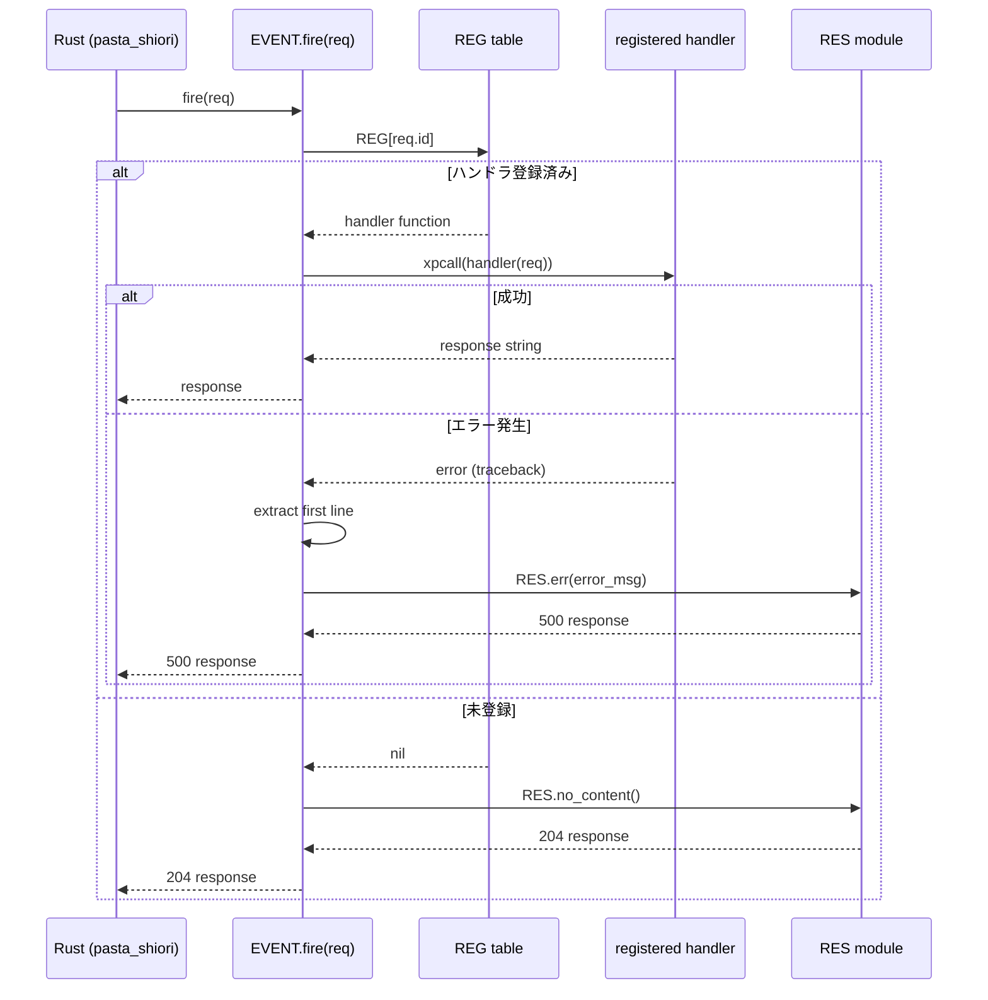
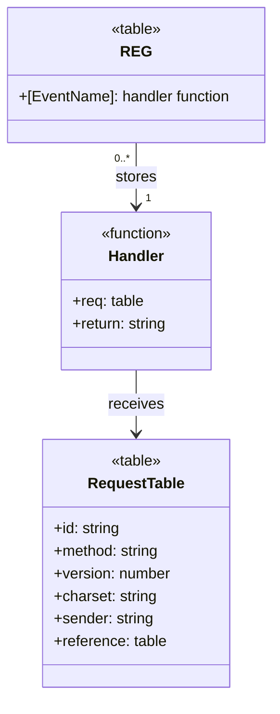

# Design Document: shiori-event-module

## Overview

**Purpose**: 本機能は、SHIORIイベントの振り分けとハンドラ登録の仕組みを提供し、ゴースト開発者がイベントハンドラを簡潔に定義できる基盤を実現する。

**Users**: ゴースト開発者が `REG.OnBoot = function(req) ... end` 形式でイベントハンドラを登録し、`EVENT.fire(req)` により自動的に適切なハンドラが呼び出される。

**Impact**: 既存の `pasta.shiori` 名前空間にサブモジュール `event/` を追加。既存ファイルへの変更なし。

### Goals
- イベントハンドラの登録と振り分けを実現
- 未登録イベントに対する適切なデフォルト応答（204 No Content）
- ハンドラ内エラーのキャッチと500レスポンス変換
- `pasta.shiori.res` との統合

### Non-Goals
- `pasta.shiori.main` の修正（Rust側統合で対応）
- 状態管理機構（`data` 引数）
- 外部ファイルからの自動登録機構
- シーン検索・実行機能

---

## Architecture

### Existing Architecture Analysis

```
crates/pasta_lua/scripts/pasta/shiori/
├── init.lua        # 空のSHIORIモジュール（未使用）
├── main.lua        # グローバルSHIORIテーブル（minimal実装）
└── res.lua         # レスポンス組み立てモジュール（完成済み）
```

**既存パターン**:
- `res.lua` は lua-coding.md に準拠したモジュール構造
- UPPER_CASE のモジュールテーブル（`RES`）
- LuaDoc アノテーション付きの公開関数

**統合ポイント**:
- `RES.no_content()` — デフォルトハンドラ用
- `RES.err(reason)` — エラーレスポンス用

### Architecture Pattern & Boundary Map



**Architecture Integration**:
- **Selected pattern**: サブモジュール分離（`event/init.lua`, `event/register.lua`）
- **Domain boundaries**: REGはデータのみ、EVENTはロジックのみ
- **Existing patterns preserved**: `res.lua` と同一のモジュール構造
- **New components rationale**: 責任分離とテスタビリティ向上
- **Steering compliance**: `lua-coding.md` 規約に完全準拠

### Technology Stack

| Layer | Choice / Version | Role in Feature | Notes |
|-------|------------------|-----------------|-------|
| Runtime | Lua 5.4 (mlua) | モジュール実行 | 既存 |
| Error Handling | xpcall / debug.traceback | エラーキャッチ | Lua標準 |
| Response Build | pasta.shiori.res | SHIORI/3.0レスポンス生成 | 依存 |

---

## System Flows

### イベント振り分けフロー



**Key Decisions**:
- `xpcall` は `EVENT.fire` レベルのみで適用（ハンドラ内部の末尾再帰を妨げない）
- エラーメッセージは最初の行のみ抽出（SHIORI/3.0ヘッダー改行禁止）
- `req.id` が `nil` の場合は `REG[nil]` → `nil` → `no_entry` へ自然フォールバック

---

## Requirements Traceability

| Requirement | Summary | Components | Interfaces | Flows |
|-------------|---------|------------|------------|-------|
| 1.1-1.5 | ハンドラ登録テーブル | register.lua | REG table | - |
| 2.1-2.5 | モジュール構造 | init.lua | EVENT table | - |
| 3.1-3.3 | デフォルトハンドラ | init.lua | EVENT.no_entry | 未登録フロー |
| 4.1-4.6 | イベント振り分け | init.lua | EVENT.fire | 振り分けフロー |
| 5.1-5.6 | エラーハンドリング | init.lua | EVENT.fire | エラーフロー |
| 6.1-6.4 | ハンドラシグネチャ | - | handler(req)->string | - |
| 7.1-7.4 | reqテーブル構造 | - | req.id, req.* | ドキュメント |
| 8.1-8.4 | 公開API | init.lua, register.lua | EVENT, REG | - |
| 9.1-9.4 | 使用例ドキュメント | - | - | LuaDocコメント |

---

## Components and Interfaces

### Summary

| Component | Domain/Layer | Intent | Req Coverage | Key Dependencies | Contracts |
|-----------|--------------|--------|--------------|------------------|-----------|
| register.lua | Data | ハンドラ登録テーブル | 1 | なし | State |
| init.lua | Logic | イベント振り分け | 2,3,4,5,6,8 | REG (P0), RES (P0) | Service |

### pasta.shiori.event (Logic Layer)

#### register.lua

| Field | Detail |
|-------|--------|
| Intent | イベントハンドラを登録するための共有テーブルを提供 |
| Requirements | 1.1, 1.2, 1.3, 1.4, 1.5 |

**Responsibilities & Constraints**
- 空のLuaテーブル `REG` をエクスポート
- 依存モジュールなし（循環参照回避）
- ハンドラは `REG.EventName = function(req) ... end` 形式で登録

**Dependencies**
- Inbound: init.lua — ハンドラ参照 (P0)
- Inbound: ゴースト開発者スクリプト — ハンドラ登録 (P0)

**Contracts**: State [x]

##### State Management

```lua
--- @module pasta.shiori.event.register
--- イベントハンドラ登録テーブル
---
--- ゴースト開発者がイベントハンドラを登録するためのテーブル。
--- 使用例:
---   local REG = require("pasta.shiori.event.register")
---   REG.OnBoot = function(req) return RES.ok("Hello") end

--- @type table<string, fun(req: table): string>
local REG = {}

return REG
```

- **State model**: グローバルシングルトン（requireキャッシュ）
- **Persistence**: なし（インメモリのみ）
- **Concurrency**: シングルスレッド（Lua VM）

---

#### init.lua

| Field | Detail |
|-------|--------|
| Intent | イベント振り分けとエラーハンドリングを提供 |
| Requirements | 2.1, 2.2, 2.3, 2.4, 2.5, 3.1, 3.2, 3.3, 4.1, 4.2, 4.3, 4.4, 4.5, 4.6, 5.1, 5.2, 5.3, 5.4, 5.5, 5.6, 8.1, 8.2, 8.3, 8.4 |

**Responsibilities & Constraints**
- `EVENT.fire(req)`: イベント振り分けとエラーハンドリング
- `EVENT.no_entry(req)`: 未登録イベント用デフォルトハンドラ
- xpcallによる例外キャッチ
- エラーメッセージの改行除去（SHIORI/3.0準拠）

**Dependencies**
- Outbound: pasta.shiori.event.register — ハンドラテーブル参照 (P0)
- Outbound: pasta.shiori.res — レスポンス生成 (P0)

**Contracts**: Service [x]

##### Service Interface

```lua
--- @module pasta.shiori.event
--- イベント振り分けモジュール
---
--- SHIORI リクエストのイベント ID に応じてハンドラを呼び分ける。
--- 未登録イベントはデフォルトハンドラ（no_entry）で処理する。
--- エラー発生時は xpcall でキャッチし、エラーレスポンスに変換する。

local REG = require("pasta.shiori.event.register")
local RES = require("pasta.shiori.res")

--- @class EVENT
local EVENT = {}

--- デフォルトハンドラ（未登録イベント用）
--- @param req table リクエストテーブル
--- @return string SHIORI レスポンス（204 No Content）
function EVENT.no_entry(req)
    return RES.no_content()
end

--- イベント振り分け
--- @param req table リクエストテーブル（req.id にイベント名）
--- @return string SHIORI レスポンス
function EVENT.fire(req)
    local handler = REG[req.id] or EVENT.no_entry
    
    local ok, result = xpcall(function()
        return handler(req)
    end, debug.traceback)
    
    if ok then
        return result
    else
        -- 最初の行（エラーメッセージ本体）のみを抽出（改行禁止）
        local error_msg = result:match("^[^\n]+") or "Unknown error"
        return RES.err(error_msg)
    end
end

return EVENT
```

- **Preconditions**: req テーブルが渡される（nil不可）
- **Postconditions**: 常に有効な SHIORI/3.0 レスポンス文字列を返す
- **Invariants**: 例外は EVENT.fire() から外に伝播しない

**Implementation Notes**
- **Integration**: Rust側から `EVENT.fire(req)` として呼び出される
- **Validation**: req.id の存在チェックは不要（Lua標準挙動で処理）
- **Risks**: なし（既存パターン踏襲、低リスク）

**Rust Integration Pattern**:

Rust側（`pasta_shiori/src/shiori.rs`）では以下のパターンで統合される：

```rust
// 1. リクエストテキストをパース
let req_table = lua_request::parse_request(lua, request)?;

// 2. SHIORI.request関数を呼び出し（Lua側でEVENT.fireにディスパッチ）
let response: String = request_fn.call(req_table)?;
```

Lua側（`main.lua`）では以下のパターンで統合される：

```lua
local EVENT = require("pasta.shiori.event")

function SHIORI.request(req)
    return EVENT.fire(req)
end
```

`parse_request()` が生成するreqテーブル構造：
- `req.id`: イベント名（例: "OnBoot", "OnClose"）
- `req.method`: "get" | "notify"
- `req.version`: 30（SHIORI/3.0）
- `req.charset`: 文字セット（例: "UTF-8"）
- `req.sender`: 送信者名（例: "SSP"）
- `req.reference`: 参照テーブル（`reference[0]`, `reference[1]`, ...）
- `req.dic`: 全ヘッダー辞書

---

## Data Models

### Domain Model



**Entities**:
- `REG`: ハンドラ登録テーブル（シングルトン）
- `Handler`: イベントハンドラ関数 `function(req) -> string`
- `RequestTable`: Rust側で生成されるリクエスト情報

**Invariants**:
- ハンドラは常に文字列（SHIORIレスポンス）を返す
- reqテーブルはハンドラ内で変更されない（read-only契約）

---

## Error Handling

### Error Strategy

| Error Type | Detection | Response | Recovery |
|------------|-----------|----------|----------|
| 未登録イベント | `REG[req.id]` = nil | 204 No Content | 正常終了 |
| ハンドラ内エラー | xpcall失敗 | 500 Internal Server Error | エラーメッセージ返却 |
| req.id = nil | Lua標準挙動 | 204 No Content | no_entryへフォールバック |

### Error Categories and Responses

**User Errors (204)**:
- 未登録イベント → `RES.no_content()` で正常終了

**System Errors (500)**:
- ハンドラ内例外 → `RES.err(error_msg)` で詳細返却
- エラーメッセージは最初の行のみ（改行除去）
- `match()` が nil を返す境界条件（空文字列、改行のみ）では "Unknown error" にフォールバック
  - 理由: `RES.err(nil)` は文字列連結エラーを発生させるため、`or "Unknown error"` は必須

---

## Testing Strategy

### Test Implementation Pattern

テストは `crates/pasta_lua/tests/shiori_event_test.rs` に配置し、既存の `shiori_res_test.rs` と同様のパターンで実装する。

**Setup Pattern**:
```rust
use pasta_lua::PastaLuaRuntime;
use std::path::PathBuf;

fn create_runtime_with_pasta_path() -> PastaLuaRuntime {
    let ctx = TranspileContext::new();
    let runtime = PastaLuaRuntime::new(ctx).unwrap();
    let scripts_dir = PathBuf::from(env!("CARGO_MANIFEST_DIR"))
        .join("scripts")
        .to_string_lossy()
        .replace('\\', "/");
    runtime
        .exec(&format!(
            r#"package.path = "{scripts_dir}/?.lua;{scripts_dir}/?/init.lua;" .. package.path"#
        ))
        .expect("Failed to configure package.path");
    runtime
}
```

### Unit Tests

#### `test_reg_module_exports_empty_table`
REGモジュールが空テーブルをエクスポートすること。

```rust
#[test]
fn test_reg_module_exports_empty_table() {
    let runtime = create_runtime_with_pasta_path();
    let result = runtime.exec(r#"
        local REG = require("pasta.shiori.event.register")
        return type(REG) == "table" and next(REG) == nil
    "#);
    assert!(result.unwrap().as_boolean().unwrap());
}
```

#### `test_event_fire_dispatches_registered_handler`
登録済みハンドラが正しく呼び出されること。

```rust
#[test]
fn test_event_fire_dispatches_registered_handler() {
    let runtime = create_runtime_with_pasta_path();
    runtime.exec(r#"
        local REG = require("pasta.shiori.event.register")
        local EVENT = require("pasta.shiori.event")
        local RES = require("pasta.shiori.res")
        
        REG.OnTest = function(req)
            return RES.ok("test response")
        end
        
        local req = { id = "OnTest", method = "get", version = 30 }
        local response = EVENT.fire(req)
        
        assert(response:find("200 OK"), "should return 200 OK")
        assert(response:find("Value: test response"), "should return handler result")
    "#).unwrap();
}
```

#### `test_event_fire_returns_no_content_for_unregistered`
未登録イベントで204を返すこと。

#### `test_event_fire_catches_handler_error`
ハンドラ内エラーで500レスポンスを返すこと。

#### `test_event_fire_handles_nil_id`
req.id=nilで204を返すこと。

#### `test_event_fire_handles_empty_error_message`
エラーメッセージが空の場合に "Unknown error" にフォールバックすること。

```rust
#[test]
fn test_event_fire_handles_empty_error_message() {
    let runtime = create_runtime_with_pasta_path();
    runtime.exec(r#"
        local REG = require("pasta.shiori.event.register")
        local EVENT = require("pasta.shiori.event")
        
        -- エラーメッセージが空文字列のハンドラ
        REG.OnTest = function(req)
            error("")
        end
        
        local req = { id = "OnTest", method = "get", version = 30 }
        local response = EVENT.fire(req)
        
        assert(response:find("500 Internal Server Error"), "should return 500")
        assert(response:find("X%-Error%-Reason: Unknown error"), "should fallback to Unknown error")
    "#).unwrap();
}
```

### Integration Tests

#### `test_event_module_with_res_module`
RESモジュールとの連携確認。

#### `test_handler_registration_and_dispatch`
ハンドラ登録から呼び出しまでの完全なフロー。

#### `test_error_message_no_newline`
エラーメッセージに改行が含まれないこと。

---

## Usage Examples

### ハンドラ登録

```lua
local REG = require("pasta.shiori.event.register")
local RES = require("pasta.shiori.res")

-- イベントハンドラを登録
REG.OnBoot = function(req)
    return RES.ok([[\0\s[0]こんにちは\e]])
end

REG.OnClose = function(req)
    return RES.ok([[\0\s[0]さようなら\e]])
end

REG.OnMouseDoubleClick = function(req)
    return RES.ok([[\0\s[0]なあに？\e]])
end
```

### イベント振り分け

```lua
local EVENT = require("pasta.shiori.event")

-- Rust側から呼び出される
local req = {
    id = "OnBoot",
    method = "get",
    version = 30,
    charset = "UTF-8",
    sender = "SSP",
    reference = { [0] = "master" },
}

local response = EVENT.fire(req)
-- → 登録済みなら RES.ok() の結果
-- → 未登録なら 204 No Content
-- → エラーなら 500 Internal Server Error
```

### テスト用reqテーブル

```lua
-- テスト用の最小reqテーブル
local test_req = {
    id = "OnTest",
    method = "get",
    version = 30,
}
```
