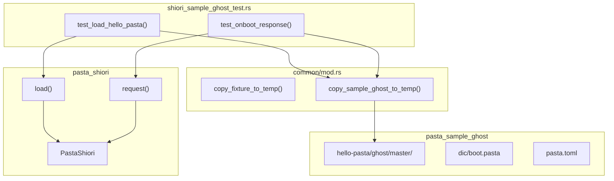
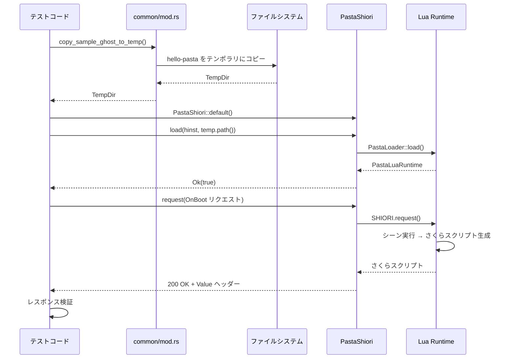

# Technical Design: shiori-integration-test

## Overview

**Purpose**: 本機能は、pasta_shiori クレートの `PastaShiori::load` および `request` メソッドのインテグレーションテストを提供し、実際のゴースト定義（hello-pasta）を使用して SHIORI プロトコル経由のパスタスクリプト実行パイプライン全体を検証する。

**Users**: pasta 開発者および CI/CD パイプラインが、ゴースト初期化とリクエスト処理の正常動作を自動検証するために使用する。

**Impact**: pasta_sample_ghost の boot.pasta を修正し OnBoot シーンを1つに削減、pasta.toml に `[talk]` セクションを追加。新規テストファイル `shiori_sample_ghost_test.rs` を作成。

### Goals
- hello-pasta ゴースト定義を使用した PastaShiori::load の検証
- OnBoot リクエストに対するさくらスクリプト応答の検証
- ランダム要素を排除した決定的テストの実現

### Non-Goals
- 単語辞書のランダム選択機能のテスト（別仕様で対応）
- 新しい SHIORI プロトコル機能の追加
- pasta.dll のビルドプロセスの変更

## Architecture

### Existing Architecture Analysis

**Current Test Infrastructure**:
- `crates/pasta_shiori/tests/common/mod.rs`: `copy_fixture_to_temp()` 関数でテスト環境構築
- `tests/support/`: 共有の scripts/ と scriptlibs/
- `tests/fixtures/`: 各テスト固有のゴースト定義

**Current hello-pasta Structure**:
- `crates/pasta_sample_ghost/ghosts/hello-pasta/ghost/master/`: 完全なゴースト定義
- scripts/ が含まれるため support/ からのコピー不要
- OnBoot シーンが2つ存在（ランダム選択による不安定性）

### Architecture Pattern & Boundary Map



**Architecture Integration**:
- **Selected pattern**: 既存テストパターン拡張（Extension）
- **Domain boundaries**: テストコードは pasta_shiori/tests/ に配置、ゴースト定義は pasta_sample_ghost に維持
- **Existing patterns preserved**: `copy_fixture_to_temp()` パターン、`mod common;` 構造
- **New components rationale**: `copy_sample_ghost_to_temp()` はクレート間参照を解決するために必要
- **Steering compliance**: structure.md のテストファイル命名規則 `<feature>_test.rs` に準拠

### Technology Stack

| Layer | Choice / Version | Role in Feature | Notes |
|-------|------------------|-----------------|-------|
| テストフレームワーク | Rust std test | テスト実行 | 既存 |
| 一時ファイル | tempfile 3.x | テスト環境構築 | 既存依存 |
| SHIORI 実装 | pasta_shiori | テスト対象 | 既存 |
| ゴースト定義 | pasta_sample_ghost | テストデータ | 既存 |

## System Flows

### OnBoot リクエスト処理フロー



## Requirements Traceability

| Requirement | Summary | Components | Interfaces | Flows |
|-------------|---------|------------|------------|-------|
| 1.1, 1.2, 1.3 | OnBoot シーン修正 | boot.pasta | - | 前提条件 |
| 2.1-2.6 | [talk] 設定追加 | pasta.toml | TalkConfig | 設定読み込み |
| 3.1, 3.2, 3.3 | テスト環境セットアップ | common/mod.rs | copy_sample_ghost_to_temp() | コピーフロー |
| 4.1, 4.2, 4.3 | load 検証 | shiori_sample_ghost_test.rs | PastaShiori::load() | load フロー |
| 5.1-5.6 | OnBoot リクエスト検証 | shiori_sample_ghost_test.rs | PastaShiori::request() | request フロー |
| 6.1, 6.2, 6.3 | テストファイル配置 | shiori_sample_ghost_test.rs | - | - |

## Components and Interfaces

| Component | Domain/Layer | Intent | Req Coverage | Key Dependencies | Contracts |
|-----------|--------------|--------|--------------|------------------|-----------|
| boot.pasta | ゴースト定義 | OnBoot シーン定義 | 1.1 | - | - |
| pasta.toml | ゴースト設定 | [talk] セクション追加 | 2.1-2.6 | TalkConfig (P1) | - |
| common/mod.rs | テストユーティリティ | ゴーストコピー関数 | 3.1-3.3 | tempfile (P0), fs (P0) | Service |
| shiori_sample_ghost_test.rs | テスト | インテグレーションテスト | 4.1-5.6, 6.1-6.3 | PastaShiori (P0), common (P0) | - |

### ゴースト定義層

#### boot.pasta

| Field | Detail |
|-------|--------|
| Intent | OnBoot シーンを1つのみ定義し、決定的なテストを可能にする |
| Requirements | 1.1 |

**Responsibilities & Constraints**
- OnBoot シーン定義を1つのみ含む
- 単語辞書呼び出し（＠起動挨拶）を含まないパターンを使用
- 他のイベント（OnFirstBoot, OnClose）は変更しない

**変更内容**:
```
# 削除対象（行11-13）
＊OnBoot
　女の子：＠笑顔　＠起動挨拶
　男の子：＠元気　へえ、また来たんだ。

# 残すシーン（行16-18）
＊OnBoot
　女の子：＠通常　起動したよ～。
　男の子：＠通常　さあ、始めようか。
```

#### pasta.toml

| Field | Detail |
|-------|--------|
| Intent | [talk] セクションを追加しウェイト設定を有効化 |
| Requirements | 2.1-2.6 |

**追加内容**:
```toml
[talk]
# ウェイト設定（テスト用にデフォルト値を明示）
script_wait_normal = 50
script_wait_period = 1000
script_wait_comma = 500
script_wait_strong = 500
script_wait_leader = 200
```

### テストユーティリティ層

#### common/mod.rs

| Field | Detail |
|-------|--------|
| Intent | hello-pasta ゴーストをテンポラリディレクトリにコピー |
| Requirements | 3.1, 3.2, 3.3 |

**Responsibilities & Constraints**
- pasta_sample_ghost の hello-pasta を完全にコピー
- profile/ ディレクトリはスキップ（既存パターン踏襲）
- CARGO_MANIFEST_DIR からの相対パスで解決

**Dependencies**
- Outbound: tempfile — 一時ディレクトリ作成 (P0)
- Outbound: std::fs — ファイルコピー (P0)

**Contracts**: Service [x]

##### Service Interface

```rust
/// Copy hello-pasta ghost to a temporary directory for isolated testing.
///
/// This function copies the complete hello-pasta ghost from pasta_sample_ghost
/// to a temporary directory, enabling integration tests with real ghost definitions.
///
/// # Returns
/// TempDir containing the copied hello-pasta ghost
///
/// # Panics
/// Panics if the ghost directory doesn't exist or copy fails.
pub fn copy_sample_ghost_to_temp() -> TempDir {
    let manifest_dir = PathBuf::from(env!("CARGO_MANIFEST_DIR"));
    let temp = TempDir::new().expect("Failed to create temp directory");
    
    // Navigate to pasta_sample_ghost crate
    let sample_ghost_dir = manifest_dir
        .parent()
        .expect("Failed to get parent directory")
        .join("pasta_sample_ghost/ghosts/hello-pasta/ghost/master");
    
    // Copy ghost files (skip profile/)
    copy_dir_recursive(&sample_ghost_dir, temp.path())
        .expect("Failed to copy hello-pasta ghost");
    
    temp
}
```

### テスト層

#### shiori_sample_ghost_test.rs

| Field | Detail |
|-------|--------|
| Intent | PastaShiori の load/request を hello-pasta で検証 |
| Requirements | 4.1-4.3, 5.1-5.6, 6.1-6.3 |

**Responsibilities & Constraints**
- `crates/pasta_shiori/tests/` に配置
- 既存の common モジュールを使用
- さくらスクリプト応答の部分一致検証

**Dependencies**
- Inbound: PastaShiori — テスト対象 (P0)
- Inbound: common — テスト環境構築 (P0)

**テスト関数**:

##### test_load_hello_pasta

```rust
/// hello-pasta ゴーストの load が正常に完了することを検証
#[test]
fn test_load_hello_pasta() {
    let temp = copy_sample_ghost_to_temp();
    let mut shiori = PastaShiori::default();
    
    let result = shiori.load(1, temp.path().as_os_str());
    assert!(result.is_ok());
    assert!(result.unwrap(), "load should return true");
}
```

##### test_onboot_response

```rust
/// OnBoot リクエストに対する応答を検証
#[test]
fn test_onboot_response() {
    let temp = copy_sample_ghost_to_temp();
    let mut shiori = PastaShiori::default();
    assert!(shiori.load(1, temp.path().as_os_str()).unwrap());
    
    // 完全な OnBoot リクエスト（CRLF 改行）
    let request = "GET SHIORI/3.0\r\n\
        Charset: UTF-8\r\n\
        Sender: SSP\r\n\
        SecurityLevel: local\r\n\
        ID: OnBoot\r\n\
        Reference0: マスターシェル\r\n\
        \r\n";
    
    let response = shiori.request(request).unwrap();
    
    // 200 OK 応答
    assert!(response.contains("SHIORI/3.0 200 OK"));
    
    // Value ヘッダーにさくらスクリプト
    assert!(response.contains("Value:"));
    
    // スポット切り替えタグ
    assert!(response.contains("\\0") || response.contains("\\1"));
    
    // 表情タグ
    assert!(response.contains("\\s[通常]"));
    
    // ウェイトタグ（パターン検証）
    assert!(response.contains("\\_w["));
    
    // テキスト内容
    assert!(response.contains("起動したよ"));
    assert!(response.contains("さあ、始めようか"));
}
```

## Testing Strategy

### Integration Tests

| テスト名 | 検証内容 | 要件 |
|---------|---------|------|
| test_load_hello_pasta | load 正常完了 | 4.1, 4.2 |
| test_onboot_response | OnBoot 応答検証 | 5.1-5.6 |

### 前提条件
- `setup.bat` が実行済みで hello-pasta ゴーストが生成されていること
- i686-pc-windows-msvc ターゲットがインストールされていること（CI 環境）

## Error Handling

### Error Categories and Responses
- **ゴースト未生成**: setup.bat 未実行 → テスト失敗時のエラーメッセージで案内
- **パス解決失敗**: CARGO_MANIFEST_DIR 不正 → パニック（テスト環境問題）
- **load 失敗**: ゴースト定義不正 → `Ok(false)` 返却を検証
