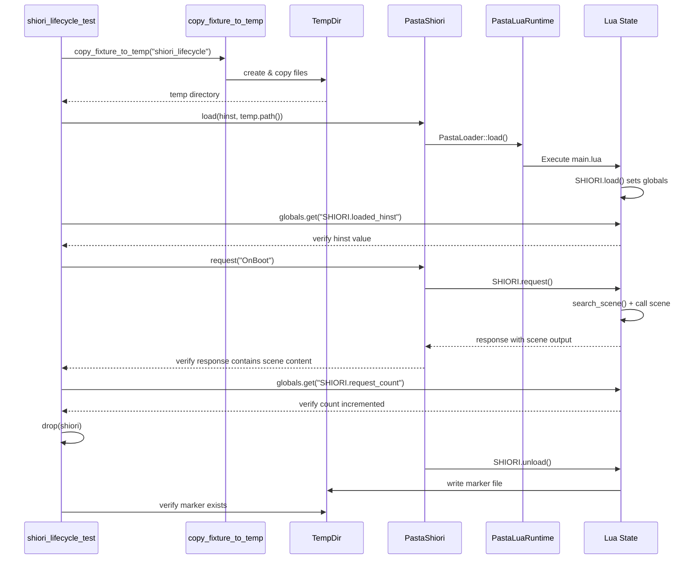
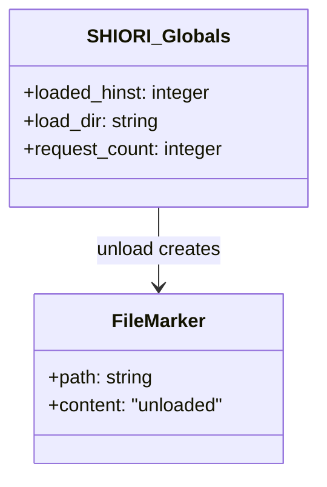

# Design Document

## Overview

**Purpose**: 本機能は、PastaShioriのSHIORI load/request/unloadライフサイクルにおいて、Luaコードが実際に実行されていることを検証可能なE2Eテストを提供する。

**Users**: pasta開発者がCI/CDおよびローカル開発でSHIORI統合の正当性を担保するために使用する。

**Impact**: 新規インテグレーションテストとフィクスチャの追加。既存コードへの変更なし。

### Goals
- SHIORI.load/request/unload各フェーズでLuaコードが実行されたことを観測可能な副作用で検証
- Pasta DSLがトランスパイルされ`@pasta_search`経由で呼び出し可能であることを検証
- pasta_shiori専用の静的テストフィクスチャを整備

### Non-Goals
- PastaShiori本体コードの変更
- パフォーマンス最適化
- Unicode path問題の解決（既知の制約として記録）

---

## Architecture

### Existing Architecture Analysis

現行のテスト構造:
- `crates/pasta_shiori/src/shiori.rs` 内の `mod tests` に19個のユニットテスト
- `copy_fixture_to_temp()` がpasta_lua/tests/fixturesを使用（クロスクレート依存）
- `test_unload_called_on_drop` がファイルマーカーパターンを実証済み

既存制約:
- pasta_shioriテストがpasta_luaフィクスチャに依存
- main.luaは固定204応答のみ、観測可能な副作用なし

### Architecture Pattern & Boundary Map

```mermaid
graph TB
    subgraph "pasta_shiori/tests"
        TEST[shiori_lifecycle_test.rs]
        COMMON[common/mod.rs]
        subgraph "fixtures/shiori_lifecycle"
            PASTA_TOML[pasta.toml]
            MAIN_LUA[scripts/pasta/shiori/main.lua]
            LIFECYCLE_PASTA[dic/test/lifecycle.pasta]
        end
    end

    subgraph "pasta_shiori/src"
        SHIORI[PastaShiori]
    end

    subgraph "pasta_lua"
        RUNTIME[PastaLuaRuntime]
        LOADER[PastaLoader]
        SEARCH[@pasta_search]
    end

    TEST --> COMMON
    COMMON --> PASTA_TOML
    COMMON --> MAIN_LUA
    COMMON --> LIFECYCLE_PASTA
    TEST --> SHIORI
    SHIORI --> LOADER
    LOADER --> RUNTIME
    RUNTIME --> SEARCH
    MAIN_LUA --> SEARCH
```

**Architecture Integration**:
- **Selected pattern**: Integration Test with Static Fixture
- **Domain/feature boundaries**: テストコード（tests/）とフィクスチャ（fixtures/）を分離
- **Existing patterns preserved**: copy_fixture_to_temp、TempDir isolation、Lua global access
- **New components rationale**: pasta_shiori専用フィクスチャでクロスクレート依存を解消
- **Steering compliance**: テストファイル命名規則（`<feature>_test.rs`）に準拠

### Technology Stack

| Layer | Choice / Version | Role in Feature | Notes |
|-------|------------------|-----------------|-------|
| Test Framework | Rust #[test] | テスト実行 | 既存パターン |
| Fixture Isolation | tempfile 3 | TempDir生成 | 既存依存 |
| Lua Runtime | mlua (via pasta_lua) | Lua状態検証 | runtime.lua().globals() |
| File System | std::fs | マーカーファイル検証 | 既存パターン |

---

## System Flows

### SHIORI Lifecycle Test Flow



---

## Requirements Traceability

| Requirement | Summary | Components | Interfaces | Flows |
|-------------|---------|------------|------------|-------|
| 1 | SHIORI.load実行確認 | main.lua, TestHelper | globals.get() | Load Phase |
| 2 | SHIORI.request実行確認 | main.lua, TestHelper | request(), globals.get() | Request Phase |
| 3 | SHIORI.unload実行確認 | main.lua, TestHelper | marker file check | Unload Phase |
| 4 | Pasta DSL読み込み確認 | lifecycle.pasta, main.lua | @pasta_search | Request Phase |
| 5 | テストフィクスチャ整備 | Fixture Directory | copy_fixture_to_temp | Setup Phase |

---

## Components and Interfaces

| Component | Domain/Layer | Intent | Req Coverage | Key Dependencies | Contracts |
|-----------|--------------|--------|--------------|------------------|-----------|
| shiori_lifecycle_test.rs | Test | E2Eライフサイクル検証 | 1, 2, 3, 4 | PastaShiori, tempfile | Test |
| common/mod.rs | Test Helper | フィクスチャコピー | 5 | std::fs, tempfile | Helper |
| main.lua | Fixture | 観測可能SHIORI関数 | 1, 2, 3, 4 | @pasta_search | Lua Script |
| lifecycle.pasta | Fixture | テスト用シーン | 4 | - | Pasta DSL |
| pasta.toml | Fixture | 設定 | 5 | - | Config |

### Test Layer

#### shiori_lifecycle_test.rs

| Field | Detail |
|-------|--------|
| Intent | SHIORIライフサイクル全フェーズのLua実行検証 |
| Requirements | 1, 2, 3, 4 |

**Responsibilities & Constraints**
- load/request/unload各フェーズの実行証拠を検証
- TempDir内でフィクスチャを分離実行
- 既存テストパターン（assert!マクロ）に準拠

**Dependencies**
- Inbound: None
- Outbound: PastaShiori — SHIORI API実行 (P0)
- Outbound: common/mod.rs — フィクスチャコピー (P0)
- External: tempfile — TempDir生成 (P0)

**Contracts**: Test [ ✓ ]

##### Test Interface

```rust
#[test]
fn test_shiori_lifecycle_lua_execution_verified() {
    // Setup
    let temp = copy_fixture_to_temp("shiori_lifecycle");
    let mut shiori = PastaShiori::default();
    
    // Phase 1: load - verify SHIORI.load execution
    assert!(shiori.load(42, temp.path().as_os_str()).unwrap());
    // Access Lua globals to verify load was called
    let runtime = shiori.runtime.as_ref().unwrap();
    let loaded_hinst: i64 = runtime.lua().globals()
        .get::<mlua::Table>("SHIORI").unwrap()
        .get("loaded_hinst").unwrap();
    assert_eq!(loaded_hinst, 42);
    
    // Phase 2: request - verify SHIORI.request execution
    let response = shiori.request("GET SHIORI/3.0\r\nID: OnBoot\r\n\r\n").unwrap();
    assert!(response.contains("テスト挨拶"));  // Scene output
    
    let request_count: i64 = runtime.lua().globals()
        .get::<mlua::Table>("SHIORI").unwrap()
        .get("request_count").unwrap();
    assert_eq!(request_count, 1);
    
    // Phase 3: unload - verify file marker created
    let marker_path = temp.path().join("unload_called.marker");
    drop(shiori);
    assert!(marker_path.exists());
}
```

**Implementation Notes**
- `runtime`へのアクセスは`shiori.runtime.as_ref()`で取得
- ファイルマーカー検証は`drop(shiori)`後に実施
- Unicode path制約: TempDirパスは通常ASCIIのため問題なし

---

#### common/mod.rs

| Field | Detail |
|-------|--------|
| Intent | pasta_shiori専用フィクスチャコピーヘルパー |
| Requirements | 5 |

**Responsibilities & Constraints**
- `tests/fixtures/`配下のフィクスチャをTempDirにコピー
- `scripts/`、`scriptlibs/`もコピー（SHIORI動作に必要）

**Dependencies**
- Inbound: shiori_lifecycle_test.rs — ヘルパー呼び出し (P0)
- Outbound: None
- External: tempfile, std::fs — ファイル操作 (P0)

**Contracts**: Helper [ ✓ ]

##### Helper Interface

```rust
use std::path::{Path, PathBuf};
use tempfile::TempDir;

/// Copy fixture directory to a temporary location for isolated testing.
///
/// # Arguments
/// * `fixture_name` - Name of fixture under tests/fixtures/
///
/// # Returns
/// TempDir containing copied fixture
pub fn copy_fixture_to_temp(fixture_name: &str) -> TempDir {
    let src = PathBuf::from(env!("CARGO_MANIFEST_DIR"))
        .join("tests/fixtures")
        .join(fixture_name);
    let temp = TempDir::new().unwrap();
    copy_dir_recursive(&src, temp.path()).unwrap();
    
    // Copy scripts from pasta_lua crate
    let pasta_lua_root = PathBuf::from(env!("CARGO_MANIFEST_DIR"))
        .parent().unwrap()
        .join("pasta_lua");
    copy_support_dirs(&pasta_lua_root, temp.path());
    
    temp
}

fn copy_dir_recursive(src: &Path, dst: &Path) -> std::io::Result<()>;
fn copy_support_dirs(pasta_lua_root: &Path, dst: &Path);
```

---

### Fixture Layer

#### main.lua (scripts/pasta/shiori/main.lua)

| Field | Detail |
|-------|--------|
| Intent | 観測可能な副作用を持つSHIORI関数定義 |
| Requirements | 1, 2, 3, 4 |

**Lua Contract**

```lua
-- Global SHIORI table with observable side effects
SHIORI = SHIORI or {}

-- Track load state (Requirement 1)
SHIORI.loaded_hinst = nil
SHIORI.load_dir = nil

-- Track request count (Requirement 2)
SHIORI.request_count = 0

-- File marker path for unload verification (Requirement 3)
local unload_marker_path = nil

--- SHIORI.load - Sets observable globals
--- @param hinst integer DLL handle
--- @param load_dir string Load directory path
--- @return boolean success
function SHIORI.load(hinst, load_dir)
    SHIORI.loaded_hinst = hinst
    SHIORI.load_dir = load_dir
    unload_marker_path = load_dir .. "/unload_called.marker"
    return true
end

--- SHIORI.request - Increments counter, calls Pasta scene
--- @param request_text string SHIORI request
--- @return string SHIORI response with scene output
function SHIORI.request(request_text)
    SHIORI.request_count = SHIORI.request_count + 1
    
    -- Call Pasta scene via @pasta_search (Requirement 4)
    local SEARCH = require "@pasta_search"
    local global_name, local_name = SEARCH:search_scene("テスト挨拶", nil)
    
    local scene_output = ""
    if global_name then
        local scene_module = _G[global_name]
        if scene_module and scene_module[local_name] then
            scene_output = scene_module[local_name]() or ""
        end
    end
    
    return "SHIORI/3.0 200 OK\r\n" ..
        "Charset: UTF-8\r\n" ..
        "Value: " .. scene_output .. "\r\n" ..
        "\r\n"
end

--- SHIORI.unload - Creates file marker for verification
function SHIORI.unload()
    if unload_marker_path then
        local f = io.open(unload_marker_path, "w")
        if f then
            f:write("unloaded")
            f:close()
        end
    end
end
```

---

#### lifecycle.pasta (dic/test/lifecycle.pasta)

| Field | Detail |
|-------|--------|
| Intent | テスト用Pastaシーン定義 |
| Requirements | 4 |

**Pasta DSL Contract**

```pasta
# ライフサイクルテスト用Pastaシーン

＊テスト挨拶
  ゴースト：「ライフサイクルテスト成功！」
```

---

#### pasta.toml

| Field | Detail |
|-------|--------|
| Intent | フィクスチャ設定 |
| Requirements | 5 |

**Config Contract**

```toml
[loader]
debug_mode = true
```

---

## Data Models

本機能はテストコードのみであり、永続データモデルは不要。

### Runtime State Model



---

## Error Handling

### Error Strategy
テストコードのため、エラーはpanic/assertで即座に失敗させる。

### Error Categories
| Category | Handling | Example |
|----------|----------|---------|
| Setup Error | panic! | フィクスチャコピー失敗 |
| SHIORI Error | assert! | load()がfalse返却 |
| Verification Error | assert! | グローバル変数不一致 |

---

## Testing Strategy

### Unit Tests
本機能自体がテストコードのため、ユニットテストは不要。

### Integration Tests
| Test | Description | Requirement Coverage |
|------|-------------|---------------------|
| test_shiori_lifecycle_lua_execution_verified | 全フェーズE2E検証 | 1, 2, 3, 4, 5 |
| test_shiori_load_sets_globals | SHIORI.loadグローバル検証 | 1 |
| test_shiori_request_increments_counter | request_count検証 | 2 |
| test_shiori_request_calls_pasta_scene | シーン出力検証 | 4 |
| test_shiori_unload_creates_marker | ファイルマーカー検証 | 3 |
| test_pasta_dsl_transpiled_and_callable | DSLトランスパイル検証 | 4 |

### E2E Tests
上記Integration Testsが本機能のE2Eテストに相当。

---

## Security Considerations

テストコードのため、セキュリティ考慮は最小限。
- TempDirは自動削除されるため、テストアーティファクト漏洩なし
- io.open()はテスト用マーカーファイルのみ書き込み

---

## Performance & Scalability

テストコードのため、パフォーマンス要件なし。
- テスト実行時間: 数秒以内（既存テストと同等）
- 並列実行: TempDir分離により安全
