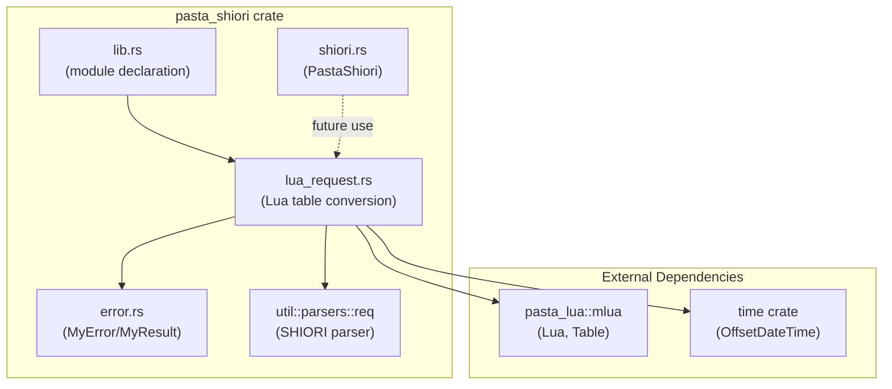

# Technical Design Document

## Feature: shiori-request-lua-integration

---

## Overview

**Purpose**: 本機能は、SHIORI requestテキストをLuaテーブル形式に変換する機能をpasta_shioriクレートに統合します。これにより、Luaスクリプト内でSHIORI requestの各フィールドに直接アクセスし、日時情報を取得できるようになります。

**Users**: pasta_shioriを使用するゴースト開発者が、Luaスクリプト内でSHIORI通信データを処理する際に使用します。

**Impact**: 既存の`lua_request.rs`ファイルを現行mlua環境に適合させ、`time`クレートへの依存を追加、lib.rsへのモジュール宣言を行います。

### Goals
- SHIORI requestテキストをLuaテーブルに変換する`parse_request`関数を統合
- 現在時刻をLuaテーブルで提供する`lua_date`関数を統合
- `<'lua>`ライフタイムを削除し、現行mlua 0.11+ APIに準拠
- 既存の`MyError`/`MyResult`エラー型との統合

### Non-Goals
- ShioriRequest構造体の高レベルAPI（`ShioriRequest::parse`）の使用変更
- shiori.rsからの呼び出し実装（本設計はモジュール統合のみ）

---

## Architecture

### Existing Architecture Analysis

**現行構成**:
```
pasta_shiori/
├── src/
│   ├── lib.rs           # クレートエントリー（モジュール宣言）
│   ├── error.rs         # MyError/MyResult定義
│   ├── shiori.rs        # SHIORI実装メイン
│   ├── lua_request.rs   # [未統合] 移植済みファイル
│   └── util/
│       └── parsers/
│           ├── mod.rs
│           ├── req.rs   # SHIORIリクエストパーサー
│           └── req_parser.rs
```

**既存パターン**:
- エラー型: `MyResult<T> = Result<T, MyError>` 統一
- mlua使用: `pasta_lua::mlua::{Lua, Table}` 再エクスポート経由
- パーサー: Pest PEGパーサー（`util::parsers::req`）
- インポート: 明示的`use`（`prelude`非推奨）

### Architecture Pattern & Boundary Map



**Architecture Integration**:
- **Selected pattern**: Module Extension（既存モジュール構造への追加）
- **Domain boundaries**: lua_requestはSHIORI request→Lua変換に専念、パース処理は既存parsersに委譲
- **Existing patterns preserved**: MyResult統一、pasta_lua::mlua経由のmlua使用
- **New components rationale**: time依存追加のみ（lua_date関数のローカル時刻取得用）
- **Steering compliance**: 明示的インポート、スネークケース命名、`tests/`配下テスト配置

### Technology Stack

| Layer | Choice / Version | Role in Feature | Notes |
|-------|------------------|-----------------|-------|
| Backend | Rust 2024 edition | メイン実装言語 | ワークスペース設定 |
| DateTime | time 0.3.x + local-offset | ローカル時刻取得 | **新規追加** |
| Lua VM | mlua (via pasta_lua) | Luaテーブル生成 | 既存依存 |
| Parser | pest 2.8 | SHIORI request解析 | 既存依存 |

---

## Requirements Traceability

| Requirement | Summary | Components | Interfaces | Flows |
|-------------|---------|------------|------------|-------|
| 1.1 | SHIORIパーサー使用 | lua_request | parse_request() | パース→テーブル変換 |
| 1.2 | 基本フィールド設定 | lua_request | parse_request() | フィールドマッピング |
| 1.3 | reference配列設定 | lua_request | parse_request() | 配列変換 |
| 1.4 | dicサブテーブル設定 | lua_request | parse_request() | 辞書変換 |
| 1.5 | パースエラー返却 | lua_request, error | MyError | エラー変換 |
| 2.1 | 日時フィールド返却 | lua_request | lua_date() | 時刻テーブル生成 |
| 2.2 | yday/wdayフィールド | lua_request | lua_date() | 通算日/曜日変換 |
| 2.3 | time crate使用 | lua_request | - | 依存追加 |
| 2.4 | Result型ハンドリング | lua_request, error | MyError | エラー変換 |
| 3.1 | ライフタイム削除 | lua_request | 全関数 | シグネチャ変更 |
| 3.2 | pasta_lua::mlua使用 | lua_request | - | インポート修正 |
| 3.3 | shiori3::req削除 | lua_request | - | インポート修正 |
| 3.4 | prelude削除 | lua_request | - | インポート修正 |
| 4.1 | MyResult使用 | lua_request | 全関数 | 戻り値型統一 |
| 4.2 | mlua::Error変換 | error | From impl | 既存 |
| 4.3 | ParseError変換 | error | From impl | 既存 |
| 5.1 | モジュール宣言 | lib.rs | - | mod追加 |

---

## Components and Interfaces

### Component Summary

| Component | Domain/Layer | Intent | Req Coverage | Key Dependencies | Contracts |
|-----------|--------------|--------|--------------|------------------|-----------|
| lua_request | Conversion | SHIORI request→Luaテーブル変換 | 1.1-1.5, 2.1-2.4, 3.1-3.4, 4.1 | parsers::req (P0), pasta_lua::mlua (P0), time (P0) | Service |
| error | Error Handling | MyError/MyResult定義 | 4.2, 4.3 | thiserror (P0) | Service |
| lib | Module | モジュール公開 | 5.1 | - | - |

### Conversion Layer

#### lua_request

| Field | Detail |
|-------|--------|
| Intent | SHIORI requestテキストをLuaテーブルに変換、現在時刻テーブルを生成 |
| Requirements | 1.1-1.5, 2.1-2.4, 3.1-3.4, 4.1 |

**Responsibilities & Constraints**
- SHIORI requestテキスト→Luaテーブル変換（method, version, id, reference[], dic{}）
- 現在ローカル時刻→Luaテーブル変換（year, month, day, hour, min, sec, ns, yday, wday）
- `<'lua>`ライフタイム使用禁止（mlua 0.11+準拠）
- `crate::prelude::*`使用禁止（明示的インポート）

**Dependencies**
- Inbound: shiori.rs — SHIORI request変換要求 (P1)
- Outbound: util::parsers::req — SHIORI requestパース (P0)
- External: pasta_lua::mlua — Lua, Table型 (P0)
- External: time — OffsetDateTime (P0)

**Contracts**: Service [x]

##### Service Interface

```rust
use pasta_lua::mlua::{Lua, Table};
use crate::error::MyResult;

/// 現在時刻でdateテーブルを作成します。
/// 
/// # Returns
/// year, month, day, hour, min, sec, ns, yday, wday フィールドを含むLuaテーブル
/// 
/// # Errors
/// - ローカルタイムゾーン取得失敗時: MyError::Script
pub fn lua_date(lua: &Lua) -> MyResult<Table>;

/// SHIORI REQUESTを解析し、Luaテーブルに展開します。
/// 
/// # Returns
/// - req.method: "get" | "notify"
/// - req.version: 20-30
/// - req.charset: Option<String>
/// - req.id: Option<String>
/// - req.base_id: Option<String>
/// - req.status: Option<String>
/// - req.security_level: Option<String>
/// - req.sender: Option<String>
/// - req.reference[n]: reference0～n の配列
/// - req.dic[key]: 全キー・バリューの辞書
/// 
/// # Errors
/// - パースエラー時: MyError::ParseRequest
/// - Luaテーブル操作エラー時: MyError::Script
pub fn parse_request(lua: &Lua, text: &str) -> MyResult<Table>;
```

- **Preconditions**: 
  - `lua`: 有効なLuaインスタンス参照
  - `text` (parse_request): SHIORI/3.0 または SHIORI/2.x 形式のリクエスト文字列
- **Postconditions**: 
  - 成功時: 指定フィールドを含むLuaテーブル
  - エラー時: MyError variant
- **Invariants**: 
  - 返却テーブルは常にreference配列とdic辞書を含む（空でも存在）

**Implementation Notes**
- **Integration**: 既存`util::parsers::req::{Parser, Rule}`を使用、パースロジック変更なし
- **Validation**: パーサーエラーは自動的にMyError::ParseRequestに変換（From impl既存）

**Detailed Conversion Guidance (lua_date関数)**:

Before (chrono):
```rust
use chrono;
use chrono::Datelike;
use chrono::Timelike;

pub fn lua_date<'lua>(lua: &'lua Lua) -> MyResult<LuaTable<'lua>> {
    let now = chrono::Local::now();
    let t = lua.create_table()?;
    t.set("year", now.year())?;
    t.set("month", now.month())?;
    t.set("day", now.day())?;
    t.set("hour", now.hour())?;
    t.set("min", now.minute())?;
    t.set("sec", now.second())?;
    t.set("ns", now.nanosecond())?;
    
    let ordinal = now.ordinal();
    let num_days_from_sunday = now.weekday().num_days_from_sunday();
    
    t.set("yday", ordinal)?;
    t.set("ordinal", ordinal)?;
    t.set("wday", num_days_from_sunday)?;
    t.set("num_days_from_sunday", num_days_from_sunday)?;
    Ok(t)
}
```

After (time):
```rust
use time::OffsetDateTime;

pub fn lua_date(lua: &Lua) -> MyResult<Table> {
    let now = OffsetDateTime::now_local()
        .map_err(|e| MyError::Script { message: format!("Failed to get local time: {}", e) })?;
    
    let t = lua.create_table()?;
    t.set("year", now.year())?;
    t.set("month", now.month() as u8)?;           // Month enum → u8
    t.set("day", now.day())?;
    t.set("hour", now.hour())?;
    t.set("min", now.minute())?;
    t.set("sec", now.second())?;
    t.set("ns", now.nanosecond())?;
    
    let ordinal = now.ordinal();
    let num_days_from_sunday = now.weekday().number_days_from_sunday();  // メソッド名変更
    
    t.set("yday", ordinal)?;
    t.set("ordinal", ordinal)?;
    t.set("wday", num_days_from_sunday)?;
    t.set("num_days_from_sunday", num_days_from_sunday)?;
    Ok(t)
}
```

**Key Changes**:
1. ライフタイム削除: `<'lua>` → なし、`LuaTable<'lua>` → `Table`
2. chrono削除: `use chrono;`, `use chrono::{Datelike, Timelike};` → `use time::OffsetDateTime;`
3. 時刻取得: `chrono::Local::now()` → `OffsetDateTime::now_local().map_err(...)?`（Result型）
4. Month変換: `now.month()` → `now.month() as u8`（enum → u8キャスト）
5. Weekday変換: `now.weekday().num_days_from_sunday()` → `now.weekday().number_days_from_sunday()`

---

## Data Models

### Lua Table Structure

#### DateTable (lua_date出力)

```
{
  year: i32,           -- 年 (e.g., 2026)
  month: u8,           -- 月 (1-12)
  day: u8,             -- 日 (1-31)
  hour: u8,            -- 時 (0-23)
  min: u8,             -- 分 (0-59)
  sec: u8,             -- 秒 (0-59)
  ns: u32,             -- ナノ秒 (0-999999999)
  yday: u16,           -- 年間通算日 (1-366)
  ordinal: u16,        -- yday別名
  wday: u8,            -- 曜日 (0=日曜, 6=土曜)
  num_days_from_sunday: u8  -- wday別名
}
```

#### RequestTable (parse_request出力)

```
{
  method: string,      -- "get" | "notify"
  version: i32,        -- 20-30
  charset: string?,    -- e.g., "UTF-8"
  id: string?,         -- イベントID
  base_id: string?,    -- ベースID
  status: string?,     -- ステータス
  security_level: string?, -- セキュリティレベル
  sender: string?,     -- 送信元
  reference: table,    -- reference[1..n] 配列
  dic: table           -- { key: value } 辞書
}
```

---

## Error Handling

### Error Strategy
既存のMyError enumを活用し、新規variantは追加しない。

### Error Categories and Responses

| Error Source | MyError Variant | Condition | Recovery |
|--------------|-----------------|-----------|----------|
| Parser | ParseRequest | 不正なSHIORI request形式 | エラーメッセージ確認 |
| mlua | Script | Luaテーブル操作失敗 | Luaステート確認 |
| time | Script | ローカルオフセット取得失敗 | UTC使用またはリトライ |

### Error Conversion Implementation

**Required Addition to error.rs**:

```rust
// time::IndeterminateOffset → MyError (新規)
impl From<time::error::IndeterminateOffset> for MyError {
    fn from(error: time::error::IndeterminateOffset) -> MyError {
        MyError::Script {
            message: format!("Failed to get local time: {}", error),
        }
    }
}
```

**Rationale**: 既存の`From<mlua::Error>`, `From<ParseError>`パターンとの一貫性を維持。`?`演算子で自動変換が可能になり、コードが簡潔化。

---

## Testing Strategy

### Test File Location
- **New file**: `crates/pasta_shiori/tests/lua_request_test.rs`
- **Common utilities**: `crates/pasta_shiori/tests/common/mod.rs` (既存の場合は流用)

### Unit Tests
- `lua_date`: 日時フィールドの存在確認、型確認
- `parse_request`: 基本フィールドマッピング、reference配列、dic辞書
- エラーケース: 不正リクエスト、空文字列

### Integration Tests
- Luaインスタンス経由でのテーブル生成・検証
- SHIORI 3.0 / 2.x 両形式のパーステスト
- エッジケース: 大量reference、日本語値

### Rationale
Tech Steering「テスト: 新機能必須、リグレッション防止」に準拠。DoD (Definition of Done) のTest Gate「`cargo test --all` 成功」を満たすために必須。

---

## File Changes Summary

| File | Change Type | Description |
|------|-------------|-------------|
| `Cargo.toml` | Modify | `time = { version = "0.3", features = ["local-offset"] }` 追加 |
| `src/lib.rs` | Modify | `mod lua_request;` 追加 |
| `src/lua_request.rs` | Modify | インポート修正、ライフタイム削除、chrono→time変更 |
| `src/error.rs` | Modify | `From<time::error::IndeterminateOffset>` trait実装追加 |

---

## Supporting References

詳細な調査結果は [research.md](./research.md) を参照。

- time crate API: `OffsetDateTime::now_local()`, コンポーネントメソッド
- mlua 0.11+ ライフタイム仕様
- 既存parsers統合ポイント
