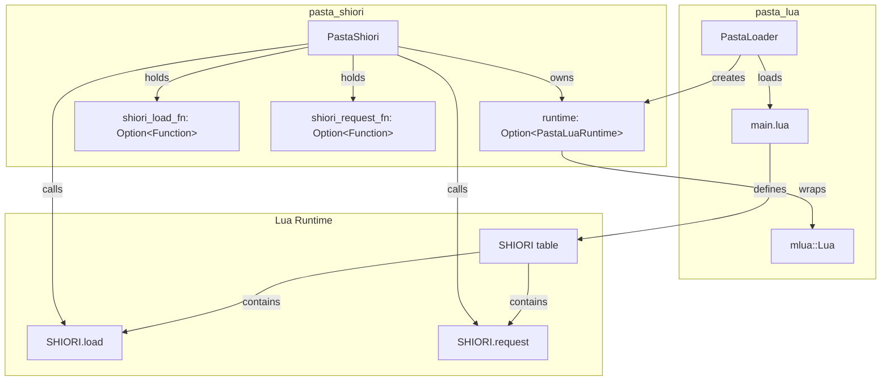
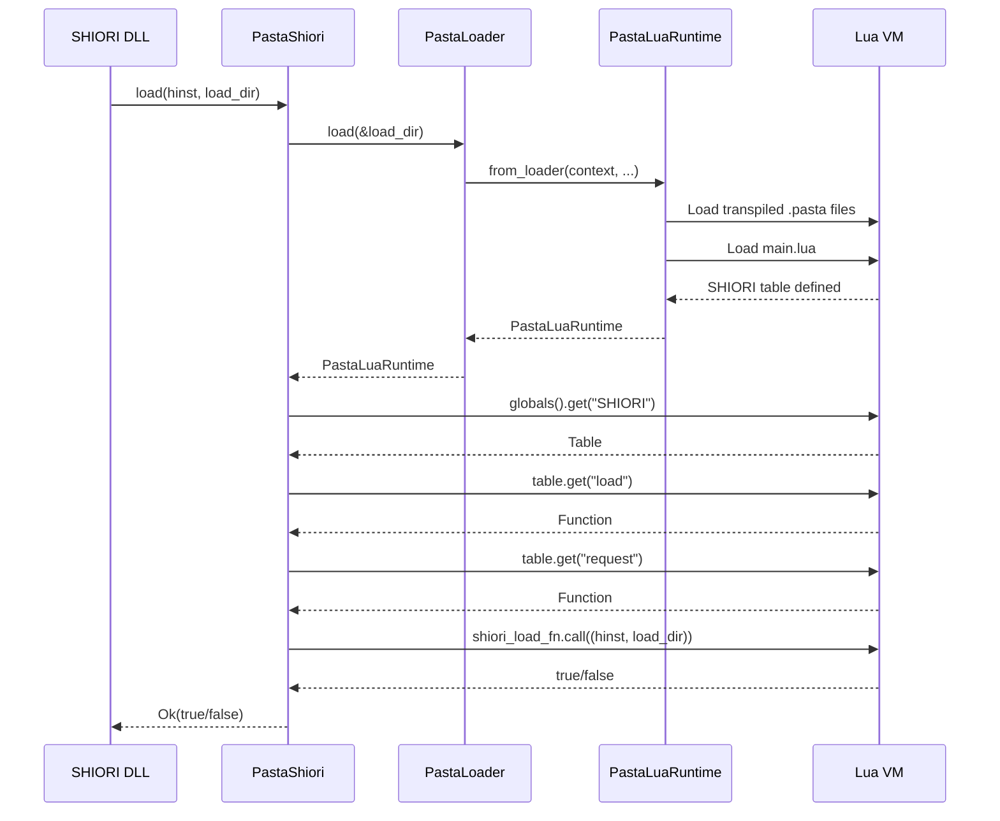
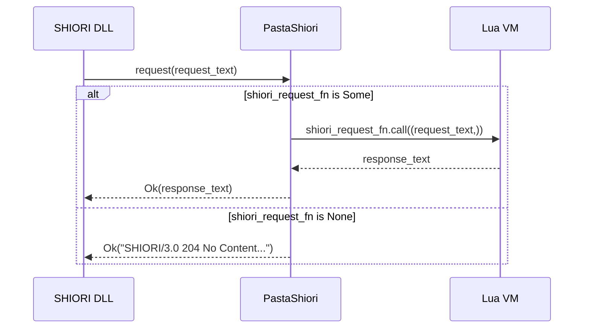

# 技術設計書: shiori-request-minimal-implementation

> SHIORI.request/SHIORI.load 最小実装の技術設計

## 1. Overview

### 1.1 目的

pasta_shiori に対して最低限の SHIORI.request 実装を行う。main.lua に SHIORI.load と SHIORI.request 関数を配置し、DLL ロード時に hinst/load_dir を Lua 側に伝達、リクエスト処理時に Lua 関数を呼び出して SHIORI/3.0 レスポンスを返す。

### 1.2 スコープ

**対象**:
- `crates/pasta_shiori/src/shiori.rs` - PastaShiori 構造体拡張
- `crates/pasta_lua/src/runtime/mod.rs` - main.lua 自動ロード
- `crates/pasta_lua/scripts/pasta/shiori/main.lua` - SHIORI 関数実装（新規）

**対象外**:
- SHIORI リクエストパース処理（将来の Phase 2）
- イベント処理（OnBoot, OnClose 等）
- 汎用 Lua 関数呼び出し API

### 1.3 設計原則

- **最小実装**: 204 No Content を返すことが目標
- **関数参照保持**: Load 時に mlua::Function を取得・保持、Request 時に呼び出し
- **後方互換性**: main.lua 不在時はデフォルト 204 を返却

## 2. Architecture

### 2.1 コンポーネント関連図



### 2.2 シーケンス図: Load



### 2.3 シーケンス図: Request



## 3. Components

### 3.1 PastaShiori 構造体拡張

#### 3.1.1 フィールド追加

```rust
pub(crate) struct PastaShiori {
    hinst: isize,
    load_dir: Option<PathBuf>,
    runtime: Option<PastaLuaRuntime>,
    
    // 新規追加
    shiori_load_fn: Option<mlua::Function<'static>>,
    shiori_request_fn: Option<mlua::Function<'static>>,
}
```

**注意**: `Function<'static>` は mlua の `owned` feature により Lua インスタンスからの独立した所有権を持つ。実際には `Function<'lua>` を使用し、`runtime` と同一生存期間で管理。

#### 3.1.2 load() メソッド拡張

**責務**:
1. 既存の PastaLoader::load() 呼び出し
2. SHIORI テーブルから load/request 関数を取得・保持
3. SHIORI.load 関数を呼び出し

**エラーハンドリング**:
- SHIORI テーブル不在: warn ログ、関数参照は None
- SHIORI.load 関数不在: warn ログ、shiori_load_fn は None
- SHIORI.request 関数不在: warn ログ、shiori_request_fn は None
- SHIORI.load 呼び出し失敗: error ログ、Ok(false) 返却
- SHIORI.load が false 返却: warn ログ、Ok(false) 返却

#### 3.1.3 request() メソッド実装

**責務**:
1. shiori_request_fn の存在確認
2. 関数呼び出しまたはデフォルトレスポンス返却

**エラーハンドリング**:
- runtime 未初期化: Err(MyError::NotInitialized)
- shiori_request_fn が None: デフォルト 204 返却
- Lua 実行エラー: Err(MyError::Script { message })

### 3.2 main.lua 自動ロード

#### 3.2.1 ロードポイント

**ファイル**: `crates/pasta_lua/src/runtime/mod.rs`
**メソッド**: `PastaLuaRuntime::from_loader()`

**追加ロジック**:
```rust
// Load main.lua if exists (after transpiled code)
let main_lua_path = loader_context.base_dir.join("scripts/pasta/shiori/main.lua");
if main_lua_path.exists() {
    match std::fs::read_to_string(&main_lua_path) {
        Ok(script) => {
            if let Err(e) = runtime.lua.load(&script).set_name("main.lua").exec() {
                tracing::warn!(error = %e, "Failed to load main.lua, continuing without SHIORI functions");
            } else {
                tracing::debug!("Loaded main.lua");
            }
        }
        Err(e) => {
            tracing::warn!(error = %e, "Failed to read main.lua, continuing without SHIORI functions");
        }
    }
}
```

#### 3.2.2 main.lua 配置場所

**パス**: `scripts/pasta/shiori/main.lua`

**理由**:
- 既存の pasta モジュール構造に準拠（`scripts/pasta/` 以下）
- shiori 専用サブディレクトリで明確化

### 3.3 main.lua 実装

#### 3.3.1 ファイル構造

```lua
-- scripts/pasta/shiori/main.lua
-- SHIORI/3.0 Protocol Entry Point

-- Global SHIORI table
SHIORI = {}

--- Handle SHIORI load
--- @param hinst integer DLL handle
--- @param load_dir string Load directory path
--- @return boolean success
function SHIORI.load(hinst, load_dir)
    -- Minimal implementation: always succeed
    return true
end

--- Handle SHIORI/3.0 request
--- @param request_text string Raw SHIORI request
--- @return string SHIORI response
function SHIORI.request(request_text)
    -- Minimal implementation: return 204 No Content
    return "SHIORI/3.0 204 No Content\r\n" ..
           "Charset: UTF-8\r\n" ..
           "Sender: Pasta\r\n" ..
           "\r\n"
end

return SHIORI
```

#### 3.3.2 関数シグネチャ

| 関数 | 引数 | 戻り値 |
|-----|------|--------|
| `SHIORI.load` | `hinst: integer, load_dir: string` | `boolean` |
| `SHIORI.request` | `request_text: string` | `string` |

## 4. Data Models

### 4.1 SHIORI/3.0 レスポンス形式

**204 No Content**:
```
SHIORI/3.0 204 No Content\r\n
Charset: UTF-8\r\n
Sender: Pasta\r\n
\r\n
```

**500 Internal Server Error**（既存）:
```
SHIORI/3.0 500 Internal Server Error\r\n
Charset: UTF-8\r\n
X-ERROR-REASON: <error message>\r\n
\r\n
```

### 4.2 エラー型拡張

```rust
// 既存
#[derive(Clone, Eq, PartialEq, Debug, Error)]
pub enum MyError {
    // ...existing variants...
    
    #[error("script error: {}", message)]
    Script { message: String },
}

// 追加: mlua::Error からの変換
impl From<mlua::Error> for MyError {
    fn from(error: mlua::Error) -> MyError {
        MyError::Script { 
            message: format!("{}", error) 
        }
    }
}
```

## 5. Interface Definitions

### 5.1 Rust → Lua インターフェース

#### 5.1.1 SHIORI.load 呼び出し

```rust
// 呼び出し側 (PastaShiori::load)
let load_dir_str = load_dir_path.to_string_lossy().to_string();
let result: bool = shiori_load_fn.call((hinst, load_dir_str))?;
```

```lua
-- Lua側シグネチャ
function SHIORI.load(hinst, load_dir)
    -- hinst: integer (isize from Rust)
    -- load_dir: string
    -- return: boolean
end
```

#### 5.1.2 SHIORI.request 呼び出し

```rust
// 呼び出し側 (PastaShiori::request)
let response: String = shiori_request_fn.call((req,))?;
```

```lua
-- Lua側シグネチャ
function SHIORI.request(request_text)
    -- request_text: string
    -- return: string (SHIORI response)
end
```

### 5.2 SHIORI DLL → PastaShiori インターフェース

**既存 trait（変更なし）**:
```rust
pub(crate) trait Shiori {
    fn load<S: AsRef<OsStr>>(&mut self, hinst: isize, load_dir: S) -> MyResult<bool>;
    fn request<S: AsRef<str>>(&mut self, request: S) -> MyResult<String>;
}
```

## 6. Error Handling

### 6.1 エラー分類

| 発生箇所 | エラー種別 | 対応 |
|---------|-----------|------|
| PastaLoader::load | LoaderError | Ok(false) 返却（既存動作） |
| SHIORI テーブル取得 | mlua::Error | warn ログ、関数参照 None |
| SHIORI.load 取得 | mlua::Error | warn ログ、shiori_load_fn = None |
| SHIORI.request 取得 | mlua::Error | warn ログ、shiori_request_fn = None |
| SHIORI.load 呼び出し | mlua::Error | error ログ、Ok(false) 返却 |
| SHIORI.load false 返却 | - | warn ログ、Ok(false) 返却 |
| SHIORI.request 呼び出し | mlua::Error | Err(MyError::Script) |
| SHIORI.request 戻り値型不正 | mlua::Error | Err(MyError::Script) |

### 6.2 デフォルトレスポンス

shiori_request_fn が None の場合のフォールバック:

```rust
const DEFAULT_204_RESPONSE: &str = 
    "SHIORI/3.0 204 No Content\r\nCharset: UTF-8\r\nSender: Pasta\r\n\r\n";
```

## 7. Testing Strategy

### 7.1 単体テスト

#### 7.1.1 PastaShiori テスト（shiori.rs）

| テスト名 | 内容 |
|---------|------|
| `test_load_with_main_lua` | main.lua 存在時に関数参照が取得されること |
| `test_load_without_main_lua` | main.lua 不在時に関数参照が None であること |
| `test_load_shiori_load_returns_false` | SHIORI.load が false を返す場合の動作 |
| `test_request_with_function` | SHIORI.request 呼び出しでレスポンス取得 |
| `test_request_without_function` | 関数不在時にデフォルト 204 返却 |
| `test_request_lua_error` | Lua エラー時に MyError::Script 返却 |

#### 7.1.2 main.lua テスト（Lua）

| テスト名 | 内容 |
|---------|------|
| `test_shiori_load_returns_true` | SHIORI.load が true を返すこと |
| `test_shiori_request_returns_204` | SHIORI.request が 204 形式を返すこと |

### 7.2 統合テスト

#### 7.2.1 テスト用 Fixture

**新規作成**: `tests/fixtures/shiori/minimal-main/`
```
minimal-main/
├── pasta.toml
├── dic/
│   └── test.pasta
└── scripts/
    └── pasta/
        └── shiori/
            └── main.lua
```

#### 7.2.2 E2E テストケース

| テスト名 | 内容 |
|---------|------|
| `test_shiori_full_lifecycle` | load → request → 204 の一連フロー |
| `test_shiori_load_passes_hinst_and_loaddir` | Lua 側で hinst/load_dir が正しく受信できること |

## 8. Requirements Traceability

| 要件 ID | 設計セクション | 実装箇所 |
|--------|---------------|---------|
| Req 1 | 3.2 main.lua 自動ロード | runtime/mod.rs::from_loader |
| Req 2 | 3.3.2 関数シグネチャ、5.1.1 | main.lua::SHIORI.load |
| Req 3 | 3.3.2 関数シグネチャ、5.1.2 | main.lua::SHIORI.request |
| Req 4 | 3.1.2 load() 拡張 | shiori.rs::load |
| Req 5 | 3.1.3 request() 実装 | shiori.rs::request |
| Req 6 | 3.1.1 フィールド追加 | shiori.rs::PastaShiori struct |
| Req 7 | 4.1 レスポンス形式 | main.lua::SHIORI.request |
| Req 8 | 7. Testing Strategy | tests/ |
