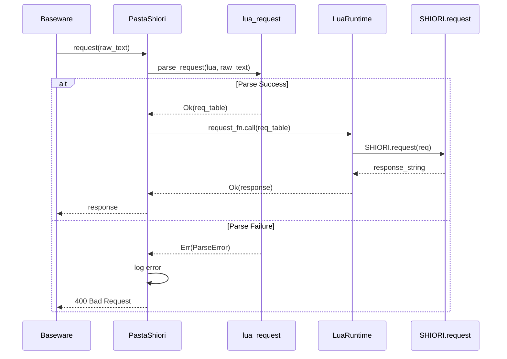

# Design Document: shiori-request-parsed-table

## Overview

**Purpose**: SHIORI.request関数に解析済みLuaテーブルを渡すことで、Luaスクリプト開発者が独自のリクエストパース処理を実装する必要をなくす。

**Users**: Luaスクリプト開発者（ゴースト開発者）が、イベントハンドリング時に構造化されたリクエストデータへ直接アクセスできる。

**Impact**: `PastaShiori::call_lua_request`メソッドを変更し、生テキストの代わりに解析済みテーブルを渡す。既存のLuaスクリプトは新しいシグネチャに対応するよう更新が必要（破壊的変更）。

### Goals
- `lua_request::parse_request`を活用してリクエスト解析をRust側で実行
- Lua側でのパース処理を不要にし、開発者体験を向上
- パース失敗時は400 Bad Requestを返却し、エラー状態を明確化

### Non-Goals
- 後方互換性の維持（未リリースのため不要）
- Luaスクリプト側での代替パース機能の提供
- SHIORI.load/SHIORI.unloadの変更

## Architecture

### Existing Architecture Analysis

現在の`call_lua_request`メソッドは以下のフローで動作：

```
request(&str) → call_lua_request(&str) → request_fn.call(request) → Lua SHIORI.request(request_text)
```

**変更対象**:
- `crates/pasta_shiori/src/shiori.rs` - `call_lua_request`メソッド
- テストフィクスチャ - Lua側`SHIORI.request`関数

**維持対象**:
- `lua_request::parse_request`関数（既存資産を活用）
- `SHIORI.load`/`SHIORI.unload`の呼び出し方式
- キャッシュされた関数参照機構

### Architecture Pattern & Boundary Map



**Architecture Integration**:
- **Selected pattern**: Adapter / Facade（既存パターンを維持）
- **Domain boundaries**: Rust層でパース、Lua層でビジネスロジック
- **Existing patterns preserved**: 関数キャッシュ機構、エラーハンドリング、ログ出力
- **New components rationale**: なし（既存関数の組み合わせのみ）
- **Steering compliance**: レイヤー分離の原則を維持

### Technology Stack

| Layer | Choice / Version | Role in Feature | Notes |
|-------|------------------|-----------------|-------|
| Backend | Rust 2024 edition | リクエストパース、エラーハンドリング | 既存スタック |
| Script Runtime | mlua / Lua 5.4 | SHIORI.request呼び出し | 既存スタック |
| Parser | pest 2.8 | SHIORIリクエストパース | 既存（`lua_request.rs`内） |

## Requirements Traceability

| Requirement | Summary | Components | Interfaces | Flows |
|-------------|---------|------------|------------|-------|
| 1.1 | parse_request使用 | call_lua_request | lua_request::parse_request | Parse Success/Failure |
| 1.2 | reqテーブル渡し | call_lua_request | Function::call(Table) | Parse Success |
| 1.3 | 400 Bad Request返却 | call_lua_request | default_400_response | Parse Failure |
| 2.1-2.8 | テーブル構造 | lua_request::parse_request | - | - |
| 3.1 | テーブル引数 | call_lua_request | request_fn.call | Parse Success |
| 3.2 | 生テキスト不使用 | call_lua_request | - | - |
| 3.3 | load/unload維持 | - | - | - |
| 3.4 | 204レスポンス維持 | call_lua_request | default_204_response | No Function |
| 3.5 | エラーログ+返却 | call_lua_request | MyError | Lua Error |
| 3.6 | フィクスチャ更新 | main.lua | SHIORI.request(req) | - |
| 3.7 | 統合テスト動作 | shiori_lifecycle_test | - | - |

## Components and Interfaces

| Component | Domain/Layer | Intent | Req Coverage | Key Dependencies | Contracts |
|-----------|--------------|--------|--------------|------------------|-----------|
| call_lua_request | SHIORI / Rust | 解析済みテーブルでLua呼び出し | 1.1-1.3, 3.1-3.5 | lua_request (P0), mlua (P0) | Service |
| default_400_response | SHIORI / Rust | パースエラー時のレスポンス生成 | 1.3 | - | Service |
| SHIORI.request | SHIORI / Lua | イベント処理 | 3.6-3.7 | - | - |

### SHIORI Layer (Rust)

#### call_lua_request

| Field | Detail |
|-------|--------|
| Intent | SHIORIリクエストを解析し、Lua側にテーブルとして渡す |
| Requirements | 1.1, 1.2, 1.3, 3.1, 3.2, 3.4, 3.5 |

**Responsibilities & Constraints**
- リクエストテキストを`parse_request`で解析
- パース成功時: 解析済みテーブルでLua関数を呼び出し
- パース失敗時: エラーログ出力 + 400 Bad Request返却
- Lua関数未定義時: 204 No Content返却（既存動作維持）

**Dependencies**
- Inbound: PastaShiori::request — SHIORI request処理 (P0)
- Outbound: lua_request::parse_request — リクエスト解析 (P0)
- External: mlua::Function — Lua関数呼び出し (P0)

**Contracts**: Service [x]

##### Service Interface
```rust
impl PastaShiori {
    /// Call SHIORI.request with parsed table.
    /// Returns 204 if function doesn't exist.
    /// Returns 400 if request parsing fails.
    fn call_lua_request(&self, request: &str) -> MyResult<String>;
}
```
- Preconditions: runtime が初期化済み
- Postconditions: SHIORIレスポンス文字列を返却
- Invariants: request_fn の存在有無に関わらず正常終了

#### default_400_response

| Field | Detail |
|-------|--------|
| Intent | パースエラー時の400 Bad Requestレスポンスを生成 |
| Requirements | 1.3 |

**Responsibilities & Constraints**
- SHIORI/3.0プロトコル準拠のエラーレスポンス生成
- Charset: UTF-8を固定で含める
- Sender: Pastaを固定で含める

**Dependencies**
- Inbound: call_lua_request — エラー時呼び出し (P0)

**Contracts**: Service [x]

##### Service Interface
```rust
impl PastaShiori {
    /// Generate 400 Bad Request response.
    fn default_400_response() -> String;
}
```
- Preconditions: なし（静的メソッド）
- Postconditions: SHIORI/3.0形式の400レスポンス文字列
- Invariants: 常に同一形式のレスポンスを返却

### SHIORI Layer (Lua)

#### SHIORI.request

| Field | Detail |
|-------|--------|
| Intent | イベントIDに基づくゴーストの応答処理 |
| Requirements | 3.6, 3.7 |

**Responsibilities & Constraints**
- 解析済みテーブル`req`からイベントIDを取得
- Pastaシーン検索と実行
- SHIORIレスポンス文字列の生成・返却

**Contracts**: なし（Lua側の仕様変更のみ）

##### 新しいシグネチャ
```lua
--- @param req table 解析済みリクエストテーブル
--- @return string SHIORI response
function SHIORI.request(req)
    local event_id = req.id
    local ref0 = req.reference[0]
    -- ...
end
```

## Data Models

### Lua Request Table Structure

解析済みテーブル`req`の構造（要件2.1-2.8に対応）：

```lua
req = {
    method = "get" | "notify",  -- 2.1
    version = 30,                -- 2.2
    id = "OnBoot",               -- 2.3
    charset = "UTF-8",           -- 2.6 (optional)
    base_id = "OnBoot",          -- 2.7 (optional)
    sender = "SSP",              -- 2.8 (optional)
    status = "starting",         -- (optional)
    security_level = "local",    -- (optional)
    reference = {                -- 2.4
        [0] = "shell",
        [1] = "first",
        -- ...
    },
    dic = {                      -- 2.5
        Charset = "UTF-8",
        ID = "OnBoot",
        Reference0 = "shell",
        -- 全ヘッダーの辞書
    }
}
```

## Error Handling

### Error Strategy

| Error Type | Detection Point | Response | Log Level |
|------------|-----------------|----------|-----------|
| Parse Error | `parse_request` | 400 Bad Request | error |
| Lua Not Found | `request_fn` cache | 204 No Content | debug |
| Lua Execution Error | `request_fn.call` | MyError propagation | error |
| Runtime Not Init | `self.runtime` | MyError::NotInitialized | - |

### Error Categories and Responses

**User Errors (4xx)**:
- パース失敗 → 400 Bad Request + 汎用エラーメッセージ

**System Errors (5xx)**:
- Lua実行エラー → MyError伝播（上位層で処理）

**No Error (2xx)**:
- Lua関数未定義 → 204 No Content（正常動作）

## Testing Strategy

### Unit Tests
- `call_lua_request`パース成功パス - テーブル渡しを検証
- `call_lua_request`パース失敗パス - 400レスポンスを検証
- `default_400_response`フォーマット検証

### Integration Tests
- `shiori_lifecycle_test.rs` - 更新フィクスチャでの全テスト合格
- `lua_request_test.rs` - 既存テスト維持（変更なし）

### E2E Tests
- SHIORI.load → SHIORI.request(req) → SHIORI.unload フルサイクル
- reqテーブルからのフィールドアクセス検証

## Migration Strategy

### Phase 1: 実装
1. `default_400_response`関数を追加
2. `call_lua_request`を変更（parse_request呼び出し追加）
3. Luaフィクスチャ`main.lua`を更新

### Phase 2: 検証
1. `cargo test -p pasta_shiori` 実行
2. 全テスト合格を確認

### Rollback
- 未リリースのため不要
