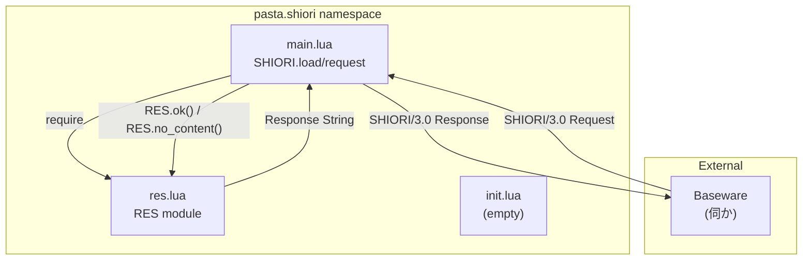
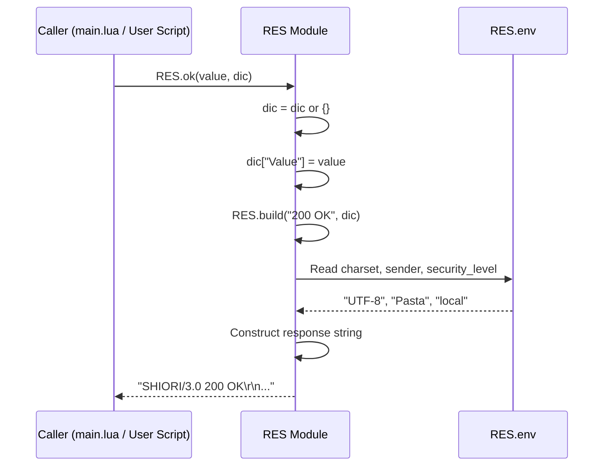

# Design Document: shiori-res-module

## Overview

**Purpose**: SHIORI/3.0プロトコルに準拠したレスポンス文字列を構築するためのユーティリティモジュール `pasta.shiori.res` を提供する。

**Users**: Pastaゴースト開発者が SHIORI リクエストへの応答を効率的に生成するために使用する。

**Impact**: 新規モジュール追加。既存コードへの影響なし。将来的に `pasta.shiori.main` から利用される統合ポイントを提供。

### Goals
- SHIORI/3.0レスポンス形式の正確な生成
- ステータスコード別の便利関数による開発効率向上
- 環境設定（Charset, Sender, SecurityLevel）の一元管理
- Luaコーディング規約への完全準拠

### Non-Goals
- リクエスト解析機能（将来 `pasta.shiori.req` で対応）
- ウェイト処理（`insert_wait` 依存機能は別モジュール）
- 最終送信時刻管理（ステートレス設計のため除外）
- トーク関数（会話処理は別モジュールで対応）

---

## Architecture

### Existing Architecture Analysis

**現状**:
- `pasta/shiori/init.lua` — 空実装（TODOコメントのみ）
- `pasta/shiori/main.lua` — SHIORI/3.0エントリーポイント、ハードコードされた204レスポンス

**パターン**:
- 既存モジュール（`word.lua`, `actor.lua`, `scene.lua`）は `UPPER_CASE` モジュールテーブルを使用
- 依存なしのユーティリティは循環参照の心配なし

### Architecture Pattern & Boundary Map



**Architecture Integration**:
- **Selected pattern**: Utility Module — ステートレスな関数群を提供
- **Domain boundaries**: `pasta.shiori.res` はレスポンス構築のみを担当
- **Existing patterns preserved**: `UPPER_CASE` モジュールテーブル、LuaDoc アノテーション
- **New components rationale**: 責務分離による保守性向上、将来の `req` モジュールとの並列配置
- **Steering compliance**: `lua-coding.md` のモジュール構造規約に完全準拠

### Technology Stack

| Layer | Choice / Version | Role in Feature | Notes |
|-------|------------------|-----------------|-------|
| Runtime | Lua 5.4 (mlua) | スクリプト実行環境 | pasta_lua クレートで提供 |
| Module | `pasta.shiori.res` | レスポンス構築ユーティリティ | 新規作成 |
| Protocol | SHIORI/3.0 | 通信プロトコル | 伺か標準 |

---

## System Flows

### Response Generation Flow



---

## Requirements Traceability

| Requirement | Summary | Components | Interfaces | Flows |
|-------------|---------|------------|------------|-------|
| 1.1-1.3 | モジュール構造 | RES Module | Module return | - |
| 2.1-2.5 | 環境設定テーブル | RES.env | Direct access | - |
| 3.1-3.6 | 汎用ビルダー | RES.build() | Function | Response Generation |
| 4.1-4.4 | 200 OK レスポンス | RES.ok() | Function | Response Generation |
| 5.1-5.3 | 204 No Content | RES.no_content() | Function | Response Generation |
| 6.1-6.3 | TEACH関連 | RES.not_enough(), RES.advice() | Function | Response Generation |
| 7.1-7.4 | エラーレスポンス | RES.bad_request(), RES.err() | Function | Response Generation |
| 8.1-8.4 | ワーニング | RES.warn() | Function | Response Generation |
| 9.1-9.4 | エラーハンドリング | All functions | Defensive pattern | - |

---

## Components and Interfaces

### Summary

| Component | Domain/Layer | Intent | Req Coverage | Key Dependencies | Contracts |
|-----------|--------------|--------|--------------|------------------|-----------|
| RES Module | pasta.shiori | SHIORI/3.0レスポンス構築 | 1-9 | None (P0) | State, API |

### pasta.shiori Layer

#### RES Module

| Field | Detail |
|-------|--------|
| Intent | SHIORI/3.0レスポンス文字列を構築するユーティリティ |
| Requirements | 1.1-1.3, 2.1-2.5, 3.1-3.6, 4.1-4.4, 5.1-5.3, 6.1-6.3, 7.1-7.4, 8.1-8.4, 9.1-9.4 |
| Owner / Reviewers | pasta_lua maintainer |

**Responsibilities & Constraints**
- SHIORI/3.0プロトコル形式のレスポンス文字列生成
- ステートレス設計（`RES.env` 以外の状態を持たない）
- 外部モジュール依存なし

**Dependencies**
- Inbound: None
- Outbound: None
- External: None

**Contracts**: State [x] / API [x]

##### State Contract

```lua
--- @class RESEnv 環境設定テーブル
--- @field charset string 文字セット（デフォルト: "UTF-8"）
--- @field sender string 送信者名（デフォルト: "Pasta"）
--- @field security_level string セキュリティレベル（デフォルト: "local"）

RES.env = {
    charset = "UTF-8",
    sender = "Pasta",
    security_level = "local",
}
```

- **Invariants**: 
  - `RES.env` テーブルは常に存在
  - 各フィールドは文字列型を期待（型検証なし）
- **Mutability**: 直接アクセスで変更可能

##### API Contract

```lua
--- @module pasta.shiori.res
--- SHIORIレスポンス組み立てモジュール

--- @alias HeaderDic table<string, string> ヘッダー辞書

--- 汎用ビルダー関数
--- @param code string ステータスコード（例: "200 OK"）
--- @param dic HeaderDic|nil 追加ヘッダー辞書
--- @return string SHIORI/3.0レスポンス文字列
function RES.build(code, dic) end

--- 200 OK レスポンス
--- @param value string Value ヘッダーの値
--- @param dic HeaderDic|nil 追加ヘッダー辞書
--- @return string SHIORI/3.0レスポンス文字列
function RES.ok(value, dic) end

--- 204 No Content レスポンス
--- @param dic HeaderDic|nil 追加ヘッダー辞書
--- @return string SHIORI/3.0レスポンス文字列
function RES.no_content(dic) end

--- 311 Not Enough レスポンス（TEACH情報不足）
--- @param dic HeaderDic|nil 追加ヘッダー辞書
--- @return string SHIORI/3.0レスポンス文字列
function RES.not_enough(dic) end

--- 312 Advice レスポンス（TEACH解釈不能）
--- @param dic HeaderDic|nil 追加ヘッダー辞書
--- @return string SHIORI/3.0レスポンス文字列
function RES.advice(dic) end

--- 400 Bad Request レスポンス
--- @param dic HeaderDic|nil 追加ヘッダー辞書
--- @return string SHIORI/3.0レスポンス文字列
function RES.bad_request(dic) end

--- 500 Internal Server Error レスポンス
--- @param reason string エラー理由
--- @param dic HeaderDic|nil 追加ヘッダー辞書
--- @return string SHIORI/3.0レスポンス文字列
function RES.err(reason, dic) end

--- ワーニング付き 204 No Content レスポンス
--- @param reason string ワーニング理由
--- @param dic HeaderDic|nil 追加ヘッダー辞書
--- @return string SHIORI/3.0レスポンス文字列
function RES.warn(reason, dic) end
```

**Preconditions**:
- `code` は有効なSHIORI/3.0ステータスコード文字列
- `value`, `reason` は文字列型を期待

**Postconditions**:
- 戻り値は `\r\n\r\n` で終端するSHIORI/3.0形式の文字列

**Error Handling**:
- `dic` が `nil` の場合、空テーブル `{}` として扱う
- 型エラーはLua標準の振る舞いに任せる

---

## Data Models

### Response String Format

```
SHIORI/3.0 {code}\r\n
Charset: {RES.env.charset}\r\n
Sender: {RES.env.sender}\r\n
SecurityLevel: {RES.env.security_level}\r\n
{dic[key1]}: {dic[value1]}\r\n
{dic[key2]}: {dic[value2]}\r\n
...
\r\n
```

### Status Codes

| Code | Status Text | Function | Custom Header |
|------|-------------|----------|---------------|
| 200 | OK | `RES.ok(value, dic)` | `Value` |
| 204 | No Content | `RES.no_content(dic)` | - |
| 311 | Not Enough | `RES.not_enough(dic)` | - |
| 312 | Advice | `RES.advice(dic)` | - |
| 400 | Bad Request | `RES.bad_request(dic)` | - |
| 500 | Internal Server Error | `RES.err(reason, dic)` | `X-Error-Reason` |
| 204 | No Content (with warning) | `RES.warn(reason, dic)` | `X-Warn-Reason` |

---

## Testing Strategy

### Unit Tests

| Test Case | Input | Expected Output | Requirement |
|-----------|-------|-----------------|-------------|
| `RES.ok("test")` | value="test" | 200 OK with Value header | 4.1-4.4 |
| `RES.no_content()` | (none) | 204 No Content | 5.1-5.3 |
| `RES.no_content({["X-Custom"]="val"})` | custom header | 204 with custom header | 3.4 |
| `RES.err("reason")` | reason="reason" | 500 with X-Error-Reason | 7.2-7.4 |
| `RES.warn("warning")` | reason="warning" | 204 with X-Warn-Reason | 8.1-8.4 |
| `RES.env` modification | change charset | reflected in output | 2.5 |

### Integration Tests

| Test Case | Description | Requirement |
|-----------|-------------|-------------|
| `main.lua` 統合 | `RES.no_content()` を `SHIORI.request()` で使用 | 3.1, 5.1 |
| ヘッダー順序 | 標準ヘッダー3種が正しい順序で出力される | 3.3 |
| 終端確認 | レスポンスが `\r\n\r\n` で終端 | 3.6 |

### Test File Location

- `crates/pasta_lua/tests/shiori_res_test.rs` — Rust統合テスト
- `crates/pasta_lua/scripts/pasta/shiori/tests/res_spec.lua` — Lua単体テスト（オプション）

---

## Implementation Notes

### File Structure

```
crates/pasta_lua/scripts/pasta/shiori/
├── init.lua      # 既存（変更なし）
├── main.lua      # 既存（将来統合時に変更）
└── res.lua       # 新規作成 ← 本設計の対象
```

### Code Template

```lua
--- @module pasta.shiori.res
--- SHIORIレスポンス組み立てモジュール
---
--- SHIORI/3.0プロトコルに準拠したレスポンス文字列を構築する。

-- 1. require文（なし）

-- 2. モジュールテーブル宣言
local RES = {}

-- 3. 定数
local CRLF = "\r\n"
local SPLIT = ": "

-- 4. 環境設定テーブル
RES.env = {
    charset = "UTF-8",
    sender = "Pasta",
    security_level = "local",
}

-- 5. 公開関数（build, ok, no_content, not_enough, advice, bad_request, err, warn）

-- 6. 末尾で返却
return RES
```

### Key Implementation Patterns

1. **Defensive nil handling**:
   ```lua
   function RES.ok(value, dic)
       dic = dic or {}
       dic["Value"] = value
       return RES.build("200 OK", dic)
   end
   ```

2. **Header iteration**:
   ```lua
   if type(dic) == 'table' then
       for k, v in pairs(dic) do
           rc = rc .. k .. SPLIT .. v .. CRLF
       end
   end
   ```

3. **Standard headers order**:
   ```lua
   rc = rc .. "Charset" .. SPLIT .. RES.env.charset .. CRLF
   rc = rc .. "Sender" .. SPLIT .. RES.env.sender .. CRLF
   rc = rc .. "SecurityLevel" .. SPLIT .. RES.env.security_level .. CRLF
   ```

---

## Supporting References

- [research.md](.kiro/specs/shiori-res-module/research.md) — 調査ログと設計決定
- [DECISIONS.md](.kiro/specs/shiori-res-module/DECISIONS.md) — 要件フェーズ決定事項
- [lua-coding.md](.kiro/steering/lua-coding.md) — Luaコーディング規約
- [response.lua](.kiro/specs/shiori-res-module/response.lua) — 参考実装
