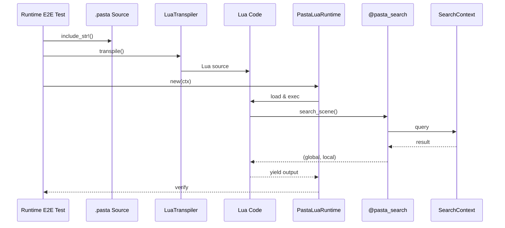
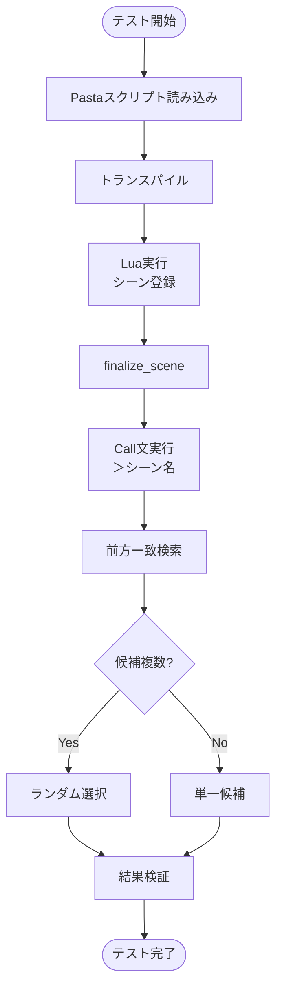
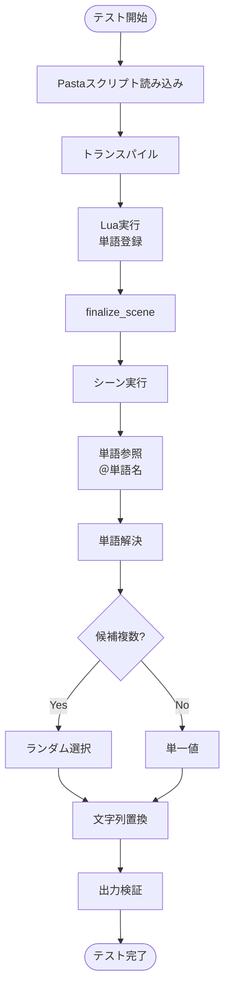
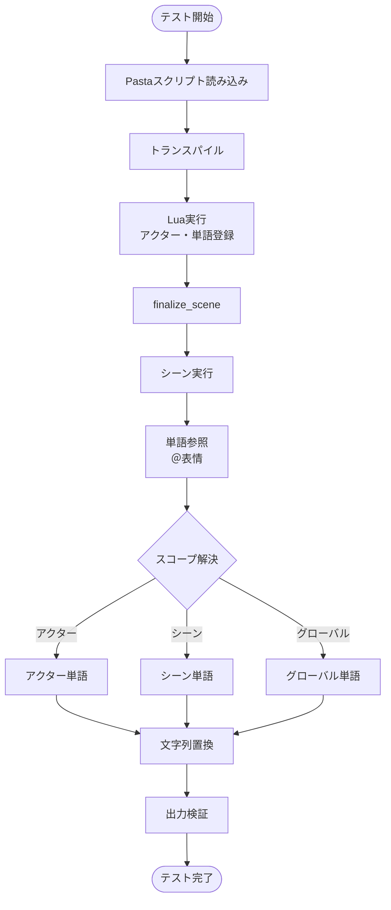
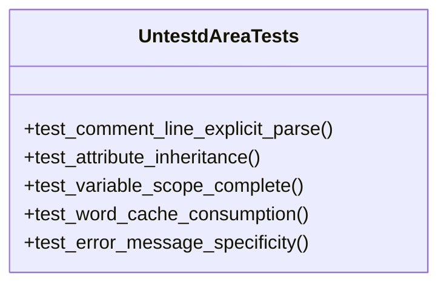
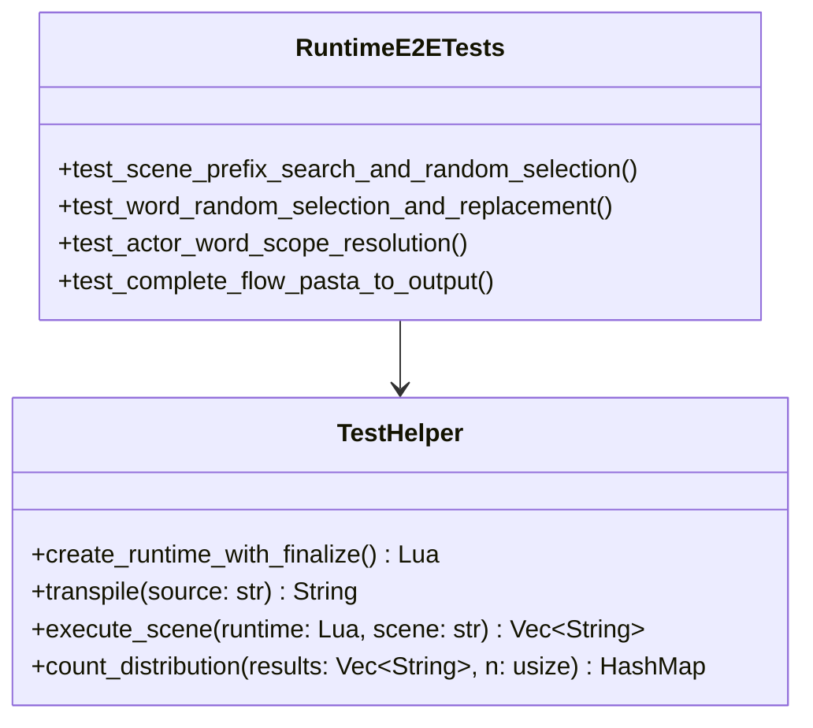
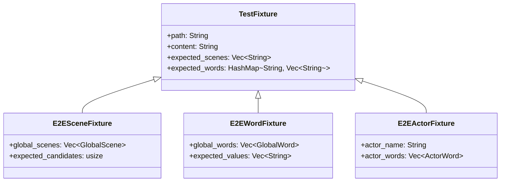

# Design Document: soul-document

## Overview

本設計書は、pastaプロジェクトのソウルドキュメント（SOUL.md）とテストカバレッジ体系（TEST_COVERAGE.md）を整備し、特にRequirement 7で特定されたRuntime E2Eテストを実装するための技術設計を定義します。

### Feature Type: Extension（既存システム拡張）

既存のテスト基盤（313テスト）とドキュメント体系を拡張し、未検証領域のRuntime E2Eテストを追加します。

### Scope

- Runtime E2Eテストの設計と実装
- 既存ドキュメント（SOUL.md, TEST_COVERAGE.md, workflow.md）の整合性維持
- Phase 0完了基準への貢献

---

## Architecture Overview

### コンポーネント図

```mermaid
graph TB
    subgraph "Test Pyramid"
        E2E[Runtime E2E Tests<br/>新規追加]
        INT[Integration Tests<br/>finalize_scene_test等]
        UNIT[Unit Tests<br/>parser, registry等]
    end
    
    subgraph "Runtime Components"
        PASTA[Pastaスクリプト]
        TRANS[LuaTranspiler]
        LUA[Lua Code]
        RT[PastaLuaRuntime]
        SEARCH[@pasta_search]
        REG[SearchContext<br/>SceneTable/WordTable]
    end
    
    subgraph "Documentation"
        SOUL[SOUL.md]
        TEST[TEST_COVERAGE.md]
        WF[workflow.md]
    end
    
    E2E --> RT
    E2E --> SEARCH
    E2E --> REG
    
    PASTA --> TRANS
    TRANS --> LUA
    LUA --> RT
    RT --> SEARCH
    SEARCH --> REG
    
    E2E -.-> TEST
    TEST -.-> SOUL
```

### データフロー



---

## System Flows

### SF-1: シーン辞書E2Eフロー



### SF-2: 単語辞書E2Eフロー



### SF-3: アクター単語スコープ解決フロー



---

## Requirements Traceability

| Requirement | AC | Design Component | Verification |
|-------------|-----|-----------------|--------------|
| Req 1 | 1-5 | SOUL.md | ✅ 既存ドキュメント |
| Req 2 | 1-5 | TEST_COVERAGE.md | ✅ 既存ドキュメント |
| Req 3 | 1-4 | TEST_COVERAGE.md | ✅ 既存ドキュメント |
| Req 4 | 1-4 | TEST_COVERAGE.md | ✅ 既存ドキュメント |
| Req 5 | 1-4 | workflow.md | ✅ 既存ドキュメント |
| Req 6 | 1-4 | SOUL.md Section 5 | ✅ 既存ドキュメント |
| **Req 7** | **1** | **C-1: UntestdAreaTests** | runtime_e2e_test.rs |
| **Req 7** | **2** | **C-2: RuntimeE2ETests** | runtime_e2e_test.rs |
| **Req 7** | **3** | TEST_COVERAGE.md更新 | ドキュメント更新 |
| **Req 7** | **4** | SOUL.md DoD更新 | ドキュメント更新 |
| **Req 7** | **5** | 受容理由ドキュメント | TEST_COVERAGE.md |

---

## Components

### C-1: UntestdAreaTests（未テスト領域テスト）

TEST_COVERAGE.md Section 4で特定された未テスト領域に対するテスト群。



#### Interface Contract

| テスト名 | 入力 | 期待出力 | 検証方法 |
|---------|------|---------|---------|
| test_comment_line_explicit_parse | `＃コメント\n＊シーン` | コメント行が無視される | ASTにコメントが含まれない |
| test_attribute_inheritance | 属性付きシーン | 属性が子に継承 | 属性値の比較 |
| test_variable_scope_complete | `＄x`/`＄＊x`/`＄＊＊x` | 各スコープが分離 | 値の独立性確認 |
| test_word_cache_consumption | 複数値単語 | 全要素消費 | 3要素×3回=全要素出現 |
| test_error_message_specificity | 不正構文 | 行番号・列番号付きエラー | エラーメッセージ検証 |

### C-2: RuntimeE2ETests（Runtime E2Eテスト）

Requirement 7 AC 2の核心部分。シーン辞書/単語辞書の実行時動作を検証。



#### Interface Contract: Scene E2E

| 関数名 | シグネチャ | 責務 |
|--------|-----------|------|
| test_scene_prefix_search_and_random_selection | `fn()` | 前方一致+ランダム選択の完全フロー検証 |

**入力フィクスチャ** (`runtime_e2e_scene.pasta`):
```pasta
＊挨拶
  さくら：おはようございます

＊挨拶
  さくら：こんにちは

＊挨拶
  さくら：こんばんは

＊メイン
  ＞挨拶
```

**期待動作**:
1. `＞挨拶` が3つの「挨拶」シーンのいずれかを選択
2. 1000回実行時、各シーンが30%±10%の範囲で選択される

#### Interface Contract: Word E2E

| 関数名 | シグネチャ | 責務 |
|--------|-----------|------|
| test_word_random_selection_and_replacement | `fn()` | 単語選択+置換の完全フロー検証 |

**入力フィクスチャ** (`runtime_e2e_word.pasta`):
```pasta
＠挨拶：おはよう、こんにちは、こんばんは

＊メイン
  さくら：＠挨拶 
```

**期待動作**:
1. `＠挨拶 ` が3つの値のいずれかに置換される
2. 出力は `さくら：おはよう` / `さくら：こんにちは` / `さくら：こんばんは` のいずれか

#### Interface Contract: Actor Word E2E

| 関数名 | シグネチャ | 責務 |
|--------|-----------|------|
| test_actor_word_scope_resolution | `fn()` | アクタースコープ単語の解決検証 |

**入力フィクスチャ** (`runtime_e2e_actor.pasta`):
```pasta
％さくら
  ＠表情：笑顔、驚き、照れ

＊メイン
  さくら：＠表情 今日もいい天気だね
```

**期待動作**:
1. `＠表情 ` がアクター「さくら」のスコープから解決される
2. 出力は `さくら：笑顔今日もいい天気だね` 等

#### Interface Contract: Complete Flow E2E

| 関数名 | シグネチャ | 責務 |
|--------|-----------|------|
| test_complete_flow_pasta_to_output | `fn()` | 完全フロー（Pasta→Lua→実行→出力）の検証 |

**期待動作**:
1. Pastaスクリプトがトランスパイルされる
2. Luaコードが実行される
3. シーン/単語が正しく解決される
4. yield出力が期待形式である

### C-3: TestHelper（テストヘルパー）

既存の`finalize_scene_test.rs`パターンを拡張したヘルパー関数群。

```rust
/// Runtime E2Eテスト用ヘルパーモジュール
mod e2e_helper {
    use pasta_core::parser::parse_str;
    use pasta_lua::LuaTranspiler;
    use std::collections::HashMap;

    /// finalize_scene対応ランタイムを作成
    pub fn create_runtime_with_finalize() -> mlua::Result<mlua::Lua>;
    
    /// Pastaソースをトランスパイル
    pub fn transpile(source: &str) -> String;
    
    /// シーンを実行し出力を収集
    pub fn execute_scene(lua: &mlua::Lua, scene: &str) -> Vec<String>;
    
    /// N回実行し分布を計測
    pub fn count_distribution(
        lua: &mlua::Lua,
        scene: &str,
        n: usize
    ) -> HashMap<String, usize>;
    
    /// 分布が均等かを検証（χ²検定）
    pub fn assert_uniform_distribution(
        distribution: &HashMap<String, usize>,
        expected_count: usize,
        tolerance: f64
    );
}
```

---

## Data Models

### DM-1: テストフィクスチャ構造



### DM-2: テスト結果データ

```rust
/// 統計的検証結果
struct StatisticalResult {
    /// 各候補の出現回数
    distribution: HashMap<String, usize>,
    /// 総試行回数
    total_trials: usize,
    /// χ²統計量
    chi_squared: f64,
    /// 検定結果（均等分布とみなせるか）
    is_uniform: bool,
}
```

---

## File Structure

```
crates/pasta_lua/tests/
├── runtime_e2e_test.rs          # 新規: Runtime E2Eテスト
├── e2e_helper/                  # 新規: E2Eヘルパーモジュール
│   └── mod.rs
├── fixtures/
│   ├── e2e/                     # 新規: E2E専用フィクスチャ
│   │   ├── runtime_e2e_scene.pasta
│   │   ├── runtime_e2e_word.pasta
│   │   └── runtime_e2e_actor.pasta
│   └── ... (既存)
└── ... (既存)
```

---

## Implementation Notes

### 既存パターンの再利用

`finalize_scene_test.rs`の以下のパターンを再利用：

```rust
/// Helper to create a minimal runtime with finalize_scene capability.
fn create_runtime_with_finalize() -> mlua::Result<mlua::Lua> {
    // ... 既存実装
}

/// Helper to transpile pasta source to Lua code.
fn transpile(source: &str) -> String {
    // ... 既存実装
}
```

### キャッシュ消費検証の実装

単語辞書のキャッシュ機能（初回シャッフル後順次消費）を検証：

```rust
/// キャッシュ消費テスト：全要素が1回ずつ消費されることを検証
#[test]
fn test_word_cache_consumption() {
    let runtime = create_runtime_with_finalize().unwrap();
    
    // 3要素の単語辞書を定義したPastaスクリプトを実行
    let pasta_source = r#"
＠挨拶：おはよう、こんにちは、こんばんは

＊メイン
  さくら：＠挨拶 
"#;
    let lua_code = transpile(pasta_source);
    runtime.load(&lua_code).exec().unwrap();
    runtime.load("require('pasta').finalize_scene()").exec().unwrap();
    
    // 3回呼べば全要素が1回ずつ消費される
    let mut results = HashSet::new();
    for _ in 0..3 {
        let output: String = runtime
            .load("return require('@pasta_search'):search_word('挨拶', nil)")
            .eval()
            .unwrap();
        results.insert(output);
    }
    
    assert_eq!(results.len(), 3, "3回で全要素が消費されるべき");
    assert!(results.contains("おはよう"));
    assert!(results.contains("こんにちは"));
    assert!(results.contains("こんばんは"));
    
    // 4回目は再シャッフル後の要素が返る
    let fourth: String = runtime
        .load("return require('@pasta_search'):search_word('挨拶', nil)")
        .eval()
        .unwrap();
    assert!(["おはよう", "こんにちは", "こんばんは"].contains(&fourth.as_str()));
}
```

### テスト分離戦略

```rust
/// 決定的テスト（常時実行）
#[test]
fn test_scene_selection_basic() {
    // シーン選択の基本動作を検証
}

/// キャッシュ消費テスト（常時実行）
#[test]
fn test_word_cache_consumption() {
    // 全要素が1回ずつ消費されることを検証
}
```

---

## Quality Metrics

| メトリクス | 目標値 | 計測方法 |
|-----------|--------|---------|
| テストカバレッジ（Req 7） | 100% | AC 1-5すべてにテスト存在 |
| キャッシュ消費テスト | 100% | 全要素が1回ずつ消費される |
| テスト実行時間 | <5秒 | `cargo test`計測 |
| フレーキー率 | <1% | CI履歴分析 |

---

## Dependencies

### 既存依存（変更なし）

- `pasta_core`: パーサー、レジストリ
- `pasta_lua`: トランスパイラ、ランタイム
- `mlua`: Lua VM

### 新規依存（検討）

| クレート | 用途 | 必須/オプション |
|---------|------|----------------|
| `insta` | スナップショットテスト | オプション（Phase 1延期可） |

---

## Risks and Mitigations

| リスク | 影響度 | 軽減策 |
|--------|--------|--------|
| フレーキーテスト | 低 | キャッシュ消費テストは決定的 |
| テスト実行時間増大 | 低 | シンプルなキャッシュ消費テストのみ |
| Lua環境依存 | 低 | 既存ヘルパーパターンを再利用 |

---

## Appendix: Requirement 7 Coverage Matrix

| AC | 検証対象 | テストケース | フィクスチャ |
|----|---------|-------------|-------------|
| 1 | コメント行パース | test_comment_line_explicit_parse | inline |
| 1 | 属性継承 | test_attribute_inheritance | inline |
| 1 | 変数スコープ | test_variable_scope_complete | inline |
| 1 | 単語キャッシュ消費 | test_word_cache_consumption | runtime_e2e_word.pasta |
| 1 | エラーメッセージ | test_error_message_specificity | inline |
| 2 | シーン前方一致+ランダム | test_scene_prefix_search_and_random_selection | runtime_e2e_scene.pasta |
| 2 | 単語ランダム+置換 | test_word_random_selection_and_replacement | runtime_e2e_word.pasta |
| 2 | アクター単語スコープ | test_actor_word_scope_resolution | runtime_e2e_actor.pasta |
| 2 | 完全フロー | test_complete_flow_pasta_to_output | runtime_e2e_scene.pasta |
| 3 | TEST_COVERAGE.md更新 | - | ドキュメント |
| 4 | SOUL.md DoD更新 | - | ドキュメント |
| 5 | 受容理由ドキュメント | - | TEST_COVERAGE.md Section 4 |

