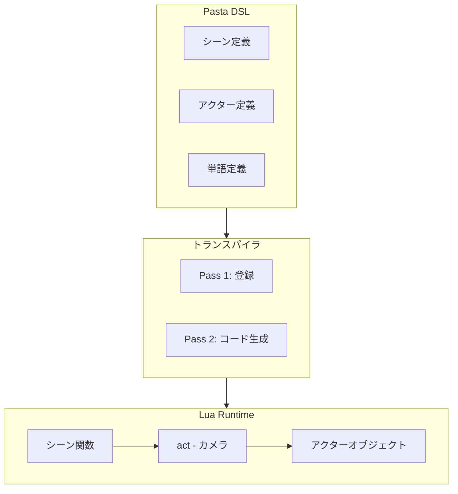

# Design Document: シーン実行アーキテクチャ文書化

## Overview

**Purpose**: SOUL.mdに新章「5. シーン実行アーキテクチャ」を追加し、pastaの動的実行モデルを文書化する。

**Users**: 
- pastaプロジェクトの設計を理解したい開発者
- DSLとLuaランタイムの関係を把握したいスクリプト作者
- AIアシスタント（コード生成・修正時の参照）

**Impact**: SOUL.mdの構造変更（新章挿入、既存章の番号繰り下げ）

### Goals
- 映画撮影メタファー（シーン＝台本、アクター＝役者、アクション＝演技、act＝カメラ）を明確に文書化
- シーン関数のLua実行パターンを説明
- 静的データ構造（辞書）と動的実行モデルの関係を明確化

### Non-Goals
- 実装詳細の記載（SPECIFICATION.mdの領域）
- Lua APIの完全なリファレンス（crate READMEの領域）
- コード変更・新機能実装

## Architecture

### Existing Architecture Analysis

**現行SOUL.md構造**:
```
1. ビジョン
2. コアバリュー
3. 設計原則
4. 辞書アーキテクチャ（静的データ構造）
5. Phase 0: あるべき基盤
6. 開発哲学
7. ターゲットユーザー
8. ロードマップ
```

**課題**: 「4. 辞書アーキテクチャ」は静的データ構造のみを説明し、**シーン関数がどのように実行されるか**（動的実行モデル）について触れていない。

### Architecture Pattern & Boundary Map



**Architecture Integration**:
- 選択パターン: ドキュメント階層モデル（静的構造→動的実行の論理的流れ）
- ドメイン境界: 辞書（静的）とシーン実行（動的）の分離
- 既存パターン維持: SOUL.mdの哲学的・アーキテクチャ的レベルを維持
- Steering準拠: ドキュメントヒエラルキー（SOUL.md > SPECIFICATION.md > GRAMMAR.md）

### Technology Stack

| Layer | Choice / Version | Role in Feature | Notes |
|-------|------------------|-----------------|-------|
| Documentation | Markdown | SOUL.md改訂 | 既存フォーマット維持 |
| Reference | sample.pasta / sample.generated.lua | 実行パターンの具体例 | 最重要情報源 |

## System Flows

### シーン実行フロー

```mermaid
sequenceDiagram
    participant 外部 as 外部呼び出し
    participant act as act（カメラ）
    participant scene as シーン関数
    participant actor as アクター

    外部->>act: シーン呼び出し
    act->>scene: __start__(act, ...)
    scene->>act: init_scene(SCENE)
    act-->>scene: save, var
    
    loop 各アクション行
        scene->>actor: act.アクター:talk(...)
        actor->>act: 発話記録（撮影）
    end
    
    alt シーン呼び出し（Call）
        scene->>act: act:call(...)
        act->>scene: サブルーチン実行
        scene-->>act: 復帰
    else 末尾呼び出し（Jump）
        scene->>act: return act:call(...)
        Note over scene,act: スタック消費なし
    end
```

**Key Decisions**:
- `act`オブジェクトがすべての出力の受け皿（カメラ）として機能
- `return act:call(...)`による末尾呼び出し最適化でスタックオーバーフロー防止

## Requirements Traceability

| Requirement | Summary | Components | Interfaces | Flows |
|-------------|---------|------------|------------|-------|
| 1 | 映画撮影メタファーの明示化 | SOUL.md 5.0 | - | 概念説明 |
| 2 | 新章「シーン実行アーキテクチャ」の追加 | SOUL.md 5.x | - | 章構造 |
| 3 | シーン関数の構造説明 | SOUL.md 5.1 | - | シーン実行フロー |
| 4 | アクター発話の実行モデル | SOUL.md 5.2 | - | talk()シーケンス |
| 5 | シーン呼び出し（Call/Jump）の実行モデル | SOUL.md 5.3 | - | call/jump分岐 |
| 6 | 単語展開の実行モデル | SOUL.md 5.4 | - | word()解決 |
| 7 | ドキュメントヒエラルキー整合性 | SOUL.md全体 | - | - |

## Components and Interfaces

| Component | Domain/Layer | Intent | Req Coverage | Key Dependencies | Contracts |
|-----------|--------------|--------|--------------|------------------|-----------|
| SOUL.md 5.0 | Documentation | 映画撮影メタファー導入 | 1 | - | - |
| SOUL.md 5.1 | Documentation | シーン関数の構造 | 2, 3 | sample.generated.lua (P2) | - |
| SOUL.md 5.2 | Documentation | アクター発話モデル | 4 | sample.generated.lua (P2) | - |
| SOUL.md 5.3 | Documentation | Call/Jump実行モデル | 5 | sample.generated.lua (P2) | - |
| SOUL.md 5.4 | Documentation | 単語展開モデル | 6 | sample.generated.lua (P2) | - |

### Documentation Layer

#### SOUL.md 新章「5. シーン実行アーキテクチャ」

| Field | Detail |
|-------|--------|
| Intent | pastaの動的実行モデルを映画撮影メタファーで説明 |
| Requirements | 1, 2, 3, 4, 5, 6, 7 |

**Responsibilities & Constraints**
- 映画撮影メタファーの4要素（シーン、アクター、アクション、act）を説明
- DSLからLuaへの変換の概要を説明（詳細はSPECIFICATION.mdへ委譲）
- 哲学的・アーキテクチャ的レベルを維持（実装詳細は含めない）

**Dependencies**
- Outbound: SPECIFICATION.md — 技術詳細の参照先 (P2)
- External: sample.pasta, sample.generated.lua — コード例の参照元 (P2)

**Implementation Notes**
- 既存の5～8章は6～9章に繰り下げ
- SPECIFICATION.mdとの用語一貫性を確保
- sample.generated.luaのパターンに基づいたコード例を含める

## Data Models

_このフィーチャーはドキュメント改訂のみであり、データモデルの変更はない。_

## Error Handling

_このフィーチャーはドキュメント改訂のみであり、エラーハンドリングの変更はない。_

## Testing Strategy

### Validation Tests
- [ ] SOUL.md改訂後、Markdown lintエラーがないこと
- [ ] 章番号の一貫性確認
- [ ] 内部リンクの有効性確認

### Review Tests
- [ ] SPECIFICATION.mdとの用語一貫性確認
- [ ] 映画撮影メタファーの4要素がすべて説明されていること
- [ ] 既存章（6～9章）との整合性確認

## Content Specification

### 5.0 導入：映画撮影メタファー

以下の4要素を説明：

| 要素 | メタファー | Lua実体 | 役割 |
|------|-----------|---------|------|
| シーン | 台本 | `SCENE.__シーン名__(act, ...)` | 会話の台本、関数として定義 |
| アクター | 役者 | `act.アクター` | 発話者、表情変更の主体 |
| アクション | 演技 | `talk()`, `word()` | 実際の発話・動作 |
| act | カメラ | `act` オブジェクト | 撮影装置、出力の受け皿 |

### 5.1 シーン関数の構造

**記載内容**:
- シーン定義→Lua関数への変換
- 関数シグネチャ: `function SCENE.__シーン名__(act, ...)`
- `act:init_scene(SCENE)`による初期化
- coroutine/yieldパターンの概要

**コード例**（sample.generated.luaから引用）:
```lua
function SCENE.__start__(act, ...)
    local args = { ... }
    local save, var = act:init_scene(SCENE)
    -- シーンの本体
end
```

### 5.2 アクター発話の実行モデル

**記載内容**:
- `act.アクター:talk(...)`による発話記録
- `act.アクター:word("単語名")`による単語展開
- 表情変更の流れ（`\s[表情ID]`の出力）

**コード例**:
```lua
act.さくら:talk(act.さくら:word("通常"))
act.さくら:talk("こんにちは！")
```

### 5.3 Call/Jump実行モデル

**記載内容**:
- Call: `act:call(...)`によるサブルーチン呼び出し、復帰あり
- Jump: `return act:call(...)`による末尾呼び出し最適化
- 実行スタックの動作

**コード例**:
```lua
-- Call（復帰あり）
act:call(SCENE.__global_name__, "ローカルシーン", {})

-- Jump（末尾呼び出し、スタック消費なし）
return act:call(SCENE.__global_name__, "次のシーン", {})
```

### 5.4 単語展開の実行モデル

**記載内容**:
- `act:word("単語名")`による実行時解決
- ランダム選択メカニズム
- スコープ解決順序: アクター → シーン → グローバル

### 5.5 章番号繰り下げ

| 旧番号 | 新番号 | タイトル |
|--------|--------|---------|
| 5 | 6 | Phase 0: あるべき基盤 |
| 6 | 7 | 開発哲学 |
| 7 | 8 | ターゲットユーザー |
| 8 | 9 | ロードマップ |

## Migration Strategy

_このフィーチャーはドキュメント改訂のみであり、マイグレーション戦略は不要。_

## Supporting References

### Lua実行パターンの完全例

`sample.generated.lua`から抽出した代表的パターン：

```lua
-- シーン定義
do
    local SCENE = PASTA.create_scene("メイン")

    -- シーン単語
    SCENE:create_word("場所"):entry("東京", "大阪", "京都")

    -- シーン関数（エントリーポイント）
    function SCENE.__start__(act, ...)
        local args = { ... }
        local save, var = act:init_scene(SCENE)
        act:clear_spot()
        act:set_spot("さくら", 0)
        act:set_spot("うにゅう", 1)

        -- ローカルシーン呼び出し（Call）
        act:call(SCENE.__global_name__, "グローバル単語呼び出し", {})
        
        -- 末尾呼び出し（Jump）
        return act:call(SCENE.__global_name__, "次のシーン", {})
    end

    -- ローカルシーン
    function SCENE.__グローバル単語呼び出し_1__(act, ...)
        local args = { ... }
        local save, var = act:init_scene(SCENE)

        -- アクター発話
        act.さくら:talk(act.さくら:word("笑顔"))
        act.さくら:talk(act.さくら:word("挨拶"))
        act.さくら:talk("！")
    end
end
```

---

_設計完了: 2026-01-24_
