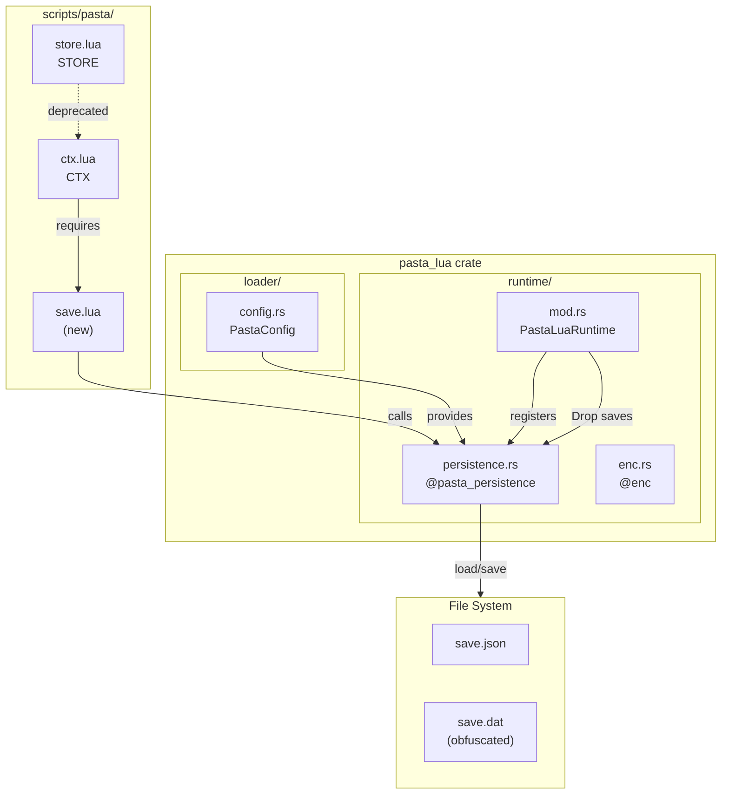
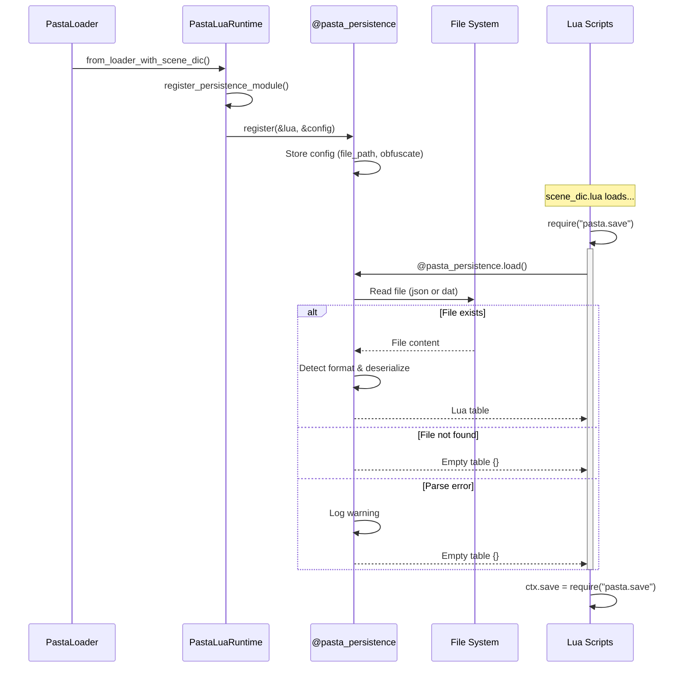
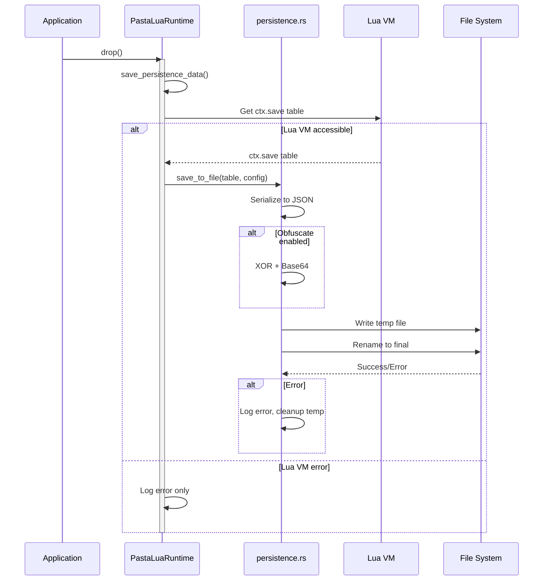
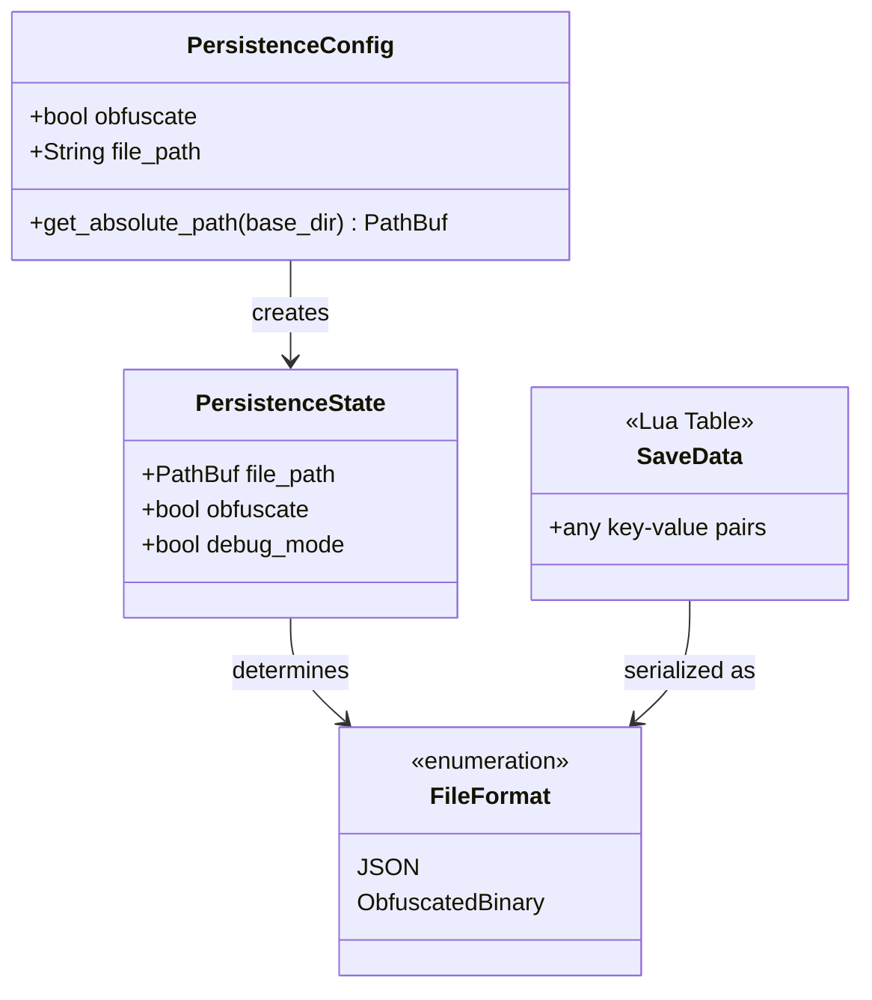

# Design Document: store-save-persistence

## Overview

**Purpose**: この機能は、Lua側の永続化データ(`ctx.save`)に対してRust側からのファイルI/Oサポートを提供する。ランタイム起動時に自動ロード、終了時（Drop）に自動保存を行い、オプションで簡易難読化をサポートする。

**Users**: 
- **スクリプト開発者**: `ctx.save`テーブルを通じて永続化データにアクセスし、ゲーム進行状況やユーザー設定を保存
- **ゴースト開発者**: `pasta.toml`で難読化や保存先を設定
- **システム運用者**: 堅牢なエラーハンドリングにより、ファイルシステム問題時も対話継続可能

**Impact**: 既存の`STORE.save`フィールドを廃止し、新規`pasta.save`モジュールに置き換える。`ctx.save`経由で永続化データにアクセスする設計に変更。

### Goals
- Rust側からLuaへ永続化APIを提供（`@pasta_persistence`モジュール）
- ランタイム起動時に永続化データを自動ロードし`ctx.save`で参照可能に
- ランタイムDrop時に`ctx.save`を自動保存
- 設定可能な簡易難読化サポート（XOR + Base64）
- 堅牢なエラーハンドリング（起動・保存失敗時もパニックしない）

### Non-Goals
- 暗号学的に安全な暗号化（カジュアル難読化のみ）
- リアルタイム同期や定期自動保存（明示的保存 + Drop保存のみ）
- 複数ファイルへの分割保存
- 保存データのスキーマ検証

## Architecture

### Existing Architecture Analysis

**現在のアーキテクチャ**:
- `PastaLuaRuntime`がLua VMをホストし、各種`@module`を登録
- `enc.rs`パターンでRust関数をLuaモジュールとして公開
- `PastaShiori`がDrop時にLua関数を呼び出す既存パターン
- `PastaConfig`が`pasta.toml`を解析し`custom_fields`で任意セクションを保持

**尊重すべきドメイン境界**:
- `runtime/`層: Lua VM操作、モジュール登録
- `loader/`層: 設定管理、スクリプトロード
- Luaスクリプト(`scripts/pasta/`): ビジネスロジック

**維持すべき統合ポイント**:
- `package.loaded`へのモジュール登録
- `ctx.lua`での環境オブジェクト初期化
- `PastaConfig`の設定解析パターン

### Architecture Pattern & Boundary Map



**Architecture Integration**:
- **Selected pattern**: Runtime層統合（enc.rsと同じモジュールパターン）
- **Domain boundaries**: 
  - Rust `persistence.rs`: ファイルI/O、シリアライズ、難読化
  - Lua `save.lua`: 永続化データのコンテナ
  - Lua `ctx.lua`: アクセスポイント統合
- **Existing patterns preserved**: 
  - `register(&Lua) -> LuaResult<Table>`パターン
  - `PastaConfig`の設定セクション解析
- **Steering compliance**: 
  - Graceful Degradation原則（エラー時も継続）
  - 型安全性（明示的なシリアライズ型）

### Technology Stack

| Layer         | Choice / Version      | Role in Feature       | Notes                           |
| ------------- | --------------------- | --------------------- | ------------------------------- |
| Runtime       | mlua 0.11 + serialize | Lua ↔ serde変換       | 既存依存                        |
| Serialization | serde_json 1.x        | JSON形式永続化        | 既存依存                        |
| Config        | serde + toml 0.9.8    | PersistenceConfig解析 | 既存依存                        |
| Compression   | flate2 1.1            | gzip圧縮（難読化）    | 追加依存（軽量、rust-lang公式） |
| File I/O      | std::fs               | アトミック書き込み    | 標準ライブラリ                  |

## System Flows

### 起動時ロードフロー



### Drop時保存フロー



## Requirements Traceability

| Requirement | Summary                       | Components              | Interfaces                | Flows        |
| ----------- | ----------------------------- | ----------------------- | ------------------------- | ------------ |
| 1           | Rust側永続化API               | persistence.rs          | @pasta_persistence module | 起動時ロード |
| 2           | pasta.saveモジュールとCTX統合 | save.lua, ctx.lua       | require pattern           | 起動時ロード |
| 3           | Drop時自動保存                | PastaLuaRuntime Drop    | save_persistence_data()   | Drop時保存   |
| 4           | 難読化シリアライズ            | persistence.rs          | obfuscate/deobfuscate     | 両フロー     |
| 5           | 設定ファイル対応              | config.rs               | PersistenceConfig         | 起動時ロード |
| 6           | エラーハンドリング            | persistence.rs, Runtime | Result types, logging     | 両フロー     |
| 7           | テスト・デバッグ支援          | test modules            | test utilities            | -            |

## Components and Interfaces

### Summary Table

| Component              | Domain/Layer | Intent               | Req Coverage | Key Dependencies         | Contracts      |
| ---------------------- | ------------ | -------------------- | ------------ | ------------------------ | -------------- |
| persistence.rs         | runtime      | Rust永続化API提供    | 1, 4, 6      | mlua, serde_json, config | Service, State |
| PersistenceConfig      | loader       | 永続化設定管理       | 5            | serde, toml              | -              |
| PastaLuaRuntime (Drop) | runtime      | Drop時保存           | 3, 6         | persistence.rs           | -              |
| save.lua               | scripts      | 永続化データコンテナ | 2            | @pasta_persistence       | -              |
| ctx.lua (修正)         | scripts      | ctx.save統合         | 2            | save.lua                 | -              |

### Runtime Layer

#### persistence.rs

| Field        | Detail                                                                         |
| ------------ | ------------------------------------------------------------------------------ |
| Intent       | Lua側に`@pasta_persistence`モジュールを提供し、ファイルI/Oを抽象化             |
| Requirements | 1.1, 1.2, 1.3, 1.4, 1.5, 4.1, 4.2, 4.3, 4.4, 4.5, 4.6, 6.1, 6.2, 6.3, 6.4, 6.5 |

**Responsibilities & Constraints**
- 永続化ファイルの読み書きを担当
- JSON/難読化バイナリ形式の自動判別
- アトミック書き込み（一時ファイル + リネーム）
- エラー時はログ出力のみ（パニック禁止）

**Dependencies**
- Inbound: PastaLuaRuntime — モジュール登録 (P0)
- Inbound: save.lua — load()呼び出し (P0)
- Outbound: std::fs — ファイルI/O (P0)
- External: serde_json — JSON シリアライズ (P0)
- External: mlua LuaSerdeExt — Lua↔serde変換 (P0)

**Contracts**: Service [x] / State [x]

##### Service Interface

```rust
/// @pasta_persistence モジュールを登録
pub fn register(lua: &Lua, config: &PersistenceConfig) -> LuaResult<Table>;

/// 永続化ファイルを読み込み、Luaテーブルとして返す
/// ファイル不在時は空テーブル、エラー時も空テーブル（ログ出力）
fn load_impl(lua: &Lua) -> LuaResult<Table>;

/// Luaテーブルを永続化ファイルに書き込む
/// エラー時はログ出力し(nil, error_msg)を返す
fn save_impl(lua: &Lua, data: Table) -> LuaResult<(Option<bool>, Option<String>)>;

/// Rust側から直接呼び出し可能な保存関数（Drop時使用）
pub fn save_table_to_file(
    data: &serde_json::Value,
    config: &PersistenceConfig,
) -> Result<(), PersistenceError>;

/// ファイルからserde_json::Valueとしてロード（テスト用）
pub fn load_from_file(config: &PersistenceConfig) -> Result<serde_json::Value, PersistenceError>;
```

**Preconditions**:
- `register()`: Lua VMが有効、PersistenceConfigが設定済み
- `save_impl()`: data引数がシリアライズ可能なLuaテーブル

**Postconditions**:
- `load_impl()`: 常にテーブルを返す（エラー時は空）
- `save_impl()`: ファイルが書き込まれるか、エラーがログ出力される

**Invariants**:
- 難読化設定は初期化時に固定（実行中変更不可）
- ファイルパスは設定から決定

##### State Management

```rust
/// モジュール内部状態（Luaのupvalueとして保持）
struct PersistenceState {
    /// 保存先ファイルパス（絶対パス）
    file_path: PathBuf,
    /// 難読化有効フラグ
    obfuscate: bool,
    /// デバッグモードフラグ
    debug_mode: bool,
}
```

- **State model**: Luaクロージャのupvalueとして状態保持
- **Persistence**: ファイルシステム上のJSON/バイナリファイル
- **Concurrency**: シングルスレッド（SHIORI DLLコンテキスト）

**Implementation Notes**
- gzip圧縮: flate2クレートの`GzEncoder`/`GzDecoder`を使用
- Magic header: gzipヘッダー (`\x1f\x8b`) で自動判別可能
- 圧縮レベル: `Compression::default()` (レベル6、バランス重視)

---

### Loader Layer

#### PersistenceConfig

| Field        | Detail                                |
| ------------ | ------------------------------------- |
| Intent       | `[persistence]`セクションの設定を管理 |
| Requirements | 5.1, 5.2, 5.3, 5.4, 5.5               |

**Responsibilities & Constraints**
- pasta.tomlからの設定読み込み
- デフォルト値の提供
- 設定バリデーション

**Dependencies**
- Inbound: PastaConfig — 設定解析 (P0)
- External: serde — デシリアライズ (P0)

**Contracts**: Service [ ]

```rust
/// 永続化設定（[persistence]セクション）
#[derive(Debug, Clone, Deserialize)]
pub struct PersistenceConfig {
    /// 難読化有効フラグ（default: false）
    #[serde(default)]
    pub obfuscate: bool,
    
    /// 保存先ファイルパス（相対パス、default: "profile/pasta/save/save.json"）
    /// obfuscate=trueの場合は拡張子が.datに変更される
    #[serde(default = "default_persistence_file_path")]
    pub file_path: String,
}

impl Default for PersistenceConfig {
    fn default() -> Self {
        Self {
            obfuscate: false,
            file_path: "profile/pasta/save/save.json".to_string(),
        }
    }
}

fn default_persistence_file_path() -> String {
    "profile/pasta/save/save.json".to_string()
}
```

**Implementation Notes**
- `obfuscate=true`時、`file_path`の拡張子を`.dat`に自動変換
- `PastaConfig::persistence()`メソッドを追加して取得

---

### Runtime Layer (Extension)

#### PastaLuaRuntime Drop Implementation

| Field        | Detail                               |
| ------------ | ------------------------------------ |
| Intent       | ランタイム終了時にctx.saveを自動保存 |
| Requirements | 3.1, 3.2, 3.4, 3.5                   |

**Responsibilities & Constraints**
- Drop時にLua VMから`ctx.save`を取得
- `persistence.rs`の保存関数を呼び出し
- エラー時はログ出力のみ（パニック禁止）

**Contracts**: State [x]

```rust
/// PastaLuaRuntime構造体にPastaConfigを保持
pub struct PastaLuaRuntime {
    lua: Lua,
    logger: Option<Arc<PastaLogger>>,
    config: Option<PastaConfig>,  // Rust側設定アクセス用
}

impl Drop for PastaLuaRuntime {
    fn drop(&mut self) {
        // 永続化データを保存（エラーはログのみ）
        if let Err(e) = self.save_persistence_data() {
            tracing::error!(error = %e, "Failed to save persistence data on drop");
        }
    }
}

impl PastaLuaRuntime {
    /// ctx.saveを永続化ファイルに保存
    fn save_persistence_data(&self) -> Result<(), PersistenceError> {
        // 1. self.configからPersistenceConfigを取得
        let config = self.config.as_ref()
            .and_then(|c| c.persistence.as_ref())
            .ok_or_else(|| PersistenceError::ConfigNotFound)?;
        
        // 2. require("pasta.ctx").saveを取得
        // 3. LuaSerdeExtでserde_json::Valueに変換
        // 4. persistence::save_table_to_file(data, config)を呼び出し
    }
}
```

**Architecture Notes**
- **Dual-purpose config architecture**:
  - `LoaderContext::custom_fields`: Lua側からの設定アクセス（既存の`@pasta_config`パターン）
  - `PastaLuaRuntime::config`: Rust側からの型安全な設定アクセス（persistence, logging等）
- `PastaConfig`を`LoaderContext`から`PastaLuaRuntime`初期化時に渡す
- Lua VMアクセス失敗時は警告ログのみ

---

### Lua Scripts Layer

#### save.lua (New)

| Field        | Detail                           |
| ------------ | -------------------------------- |
| Intent       | 永続化データのコンテナモジュール |
| Requirements | 2.1, 2.2                         |

**Location**: `crates/pasta_lua/scripts/pasta/save.lua`

```lua
--- @module pasta.save
--- 永続化データモジュール
---
--- ランタイム起動時に自動ロードされ、セッションを跨いで保持される。
--- ctx.saveから参照可能。

local persistence = require("@pasta_persistence")

--- 永続化データをロードして返す
--- @return table 永続化データテーブル
local save = persistence.load()

return save
```

**Implementation Notes**
- シンプルなモジュール（ロード結果をそのまま返す）
- 追加メソッドは提供しない（通常のテーブル操作）

---

#### ctx.lua (Modification)

| Field        | Detail                         |
| ------------ | ------------------------------ |
| Intent       | ctx.saveをpasta.saveから初期化 |
| Requirements | 2.3, 2.4                       |

**Changes**:
```lua
-- Before (remove):
local STORE = require("pasta.store")
...
save = STORE.save,

-- After (add):
local SAVE = require("pasta.save")
...
save = SAVE,
```

**Implementation Notes**
- STORE.saveへの参照を削除
- pasta.saveモジュールを直接使用

---

#### store.lua (Modification)

| Field        | Detail                     |
| ------------ | -------------------------- |
| Intent       | STORE.saveフィールドを削除 |
| Requirements | 2.5                        |

**Changes**:
```lua
-- Remove:
STORE.save = {}

-- Remove from reset():
STORE.save = {}
```

**Implementation Notes**
- STORE.saveフィールドを完全削除
- 後方互換性は提供しない（破壊的変更）

## Data Models

### Domain Model



### Physical Data Model

#### JSON Format (Non-obfuscated)

**File**: `profile/pasta/save/save.json`

```json
{
  "player_name": "Alice",
  "play_count": 42,
  "flags": {
    "tutorial_complete": true,
    "secret_found": false
  },
  "inventory": ["sword", "shield", "potion"]
}
```

#### Compressed Format (Obfuscated)

**File**: `profile/pasta/save/save.dat`

```
[gzip header: \x1f\x8b...]
[compressed JSON data]
[gzip footer: CRC + size]
```

**Compression Algorithm** (using flate2):
```rust
use flate2::Compression;
use flate2::write::GzEncoder;

let json_bytes = serde_json::to_vec(&data)?;
let mut encoder = GzEncoder::new(Vec::new(), Compression::default());
encoder.write_all(&json_bytes)?;
let compressed = encoder.finish()?;
```

**Decompression Algorithm**:
```rust
use flate2::read::GzDecoder;

let mut decoder = GzDecoder::new(&compressed[..]);
let mut json_bytes = Vec::new();
decoder.read_to_end(&mut json_bytes)?;
let data: serde_json::Value = serde_json::from_slice(&json_bytes)?;
```

**Format Detection**:
- gzipヘッダー (`\x1f\x8b`) の存在で圧縮判定
- ヘッダーがなければJSON形式として解析

## Error Handling Strategy

### Error Types

```rust
#[derive(Debug, thiserror::Error)]
pub enum PersistenceError {
    #[error("Failed to read persistence file: {0}")]
    ReadError(#[from] std::io::Error),
    
    #[error("Failed to parse persistence data: {0}")]
    ParseError(#[from] serde_json::Error),
    
    #[error("Failed to serialize persistence data: {0}")]
    SerializeError(String),
    
    #[error("Failed to convert Lua value: {0}")]
    LuaConversionError(String),
    
    #[error("Invalid file format: {0}")]
    InvalidFormat(String),
    
    #[error("Failed to access Lua VM: {0}")]
    LuaAccessError(String),
}
```

### Error Recovery Strategy

| Scenario                 | Recovery             | Log Level |
| ------------------------ | -------------------- | --------- |
| ファイル不存在           | 空テーブル返却       | DEBUG     |
| ファイル破損             | 空テーブル返却       | WARN      |
| 保存先ディレクトリ不存在 | ディレクトリ作成     | DEBUG     |
| 書き込み失敗             | エラーログ出力、継続 | ERROR     |
| Lua変換エラー            | 空テーブル返却/継続  | WARN      |
| Drop時エラー             | エラーログのみ       | ERROR     |

## Testing Strategy

### Unit Tests (persistence.rs)

```rust
#[cfg(test)]
mod tests {
    // JSON形式のロード/セーブ
    fn test_save_load_json();
    
    // 難読化形式のロード/セーブ
    fn test_save_load_obfuscated();
    
    // ファイル不存在時は空テーブル
    fn test_load_nonexistent_returns_empty();
    
    // 破損ファイル時は空テーブル
    fn test_load_corrupted_returns_empty();
    
    // 形式自動判別
    fn test_auto_detect_format();
    
    // アトミック書き込み
    fn test_atomic_write();
    
    // ネストしたテーブル
    fn test_nested_table_serialization();
}
```

### Integration Tests

```rust
// crates/pasta_lua/tests/persistence_integration_test.rs

// ランタイム経由のロード/セーブ
fn test_runtime_persistence_roundtrip();

// Drop時保存
fn test_drop_saves_data();

// 設定ファイルからの読み込み
fn test_config_integration();
```

### Lua Tests

```lua
-- crates/pasta_lua/tests/lua_specs/persistence_spec.lua

describe("@pasta_persistence", function()
    it("loads empty table when file not exists", function()
        local data = require("@pasta_persistence").load()
        assert.are.same({}, data)
    end)
    
    it("saves and loads data correctly", function()
        local persistence = require("@pasta_persistence")
        local data = { key = "value", nested = { a = 1 } }
        persistence.save(data)
        local loaded = persistence.load()
        assert.are.same(data, loaded)
    end)
end)
```
