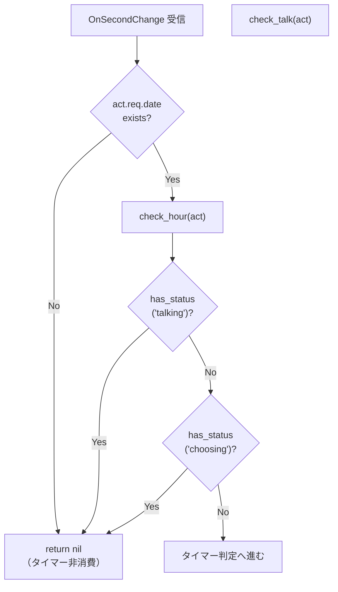

# Design Document: suppress-ontalk-on-choosing

## Overview

**Purpose**: SSP の `Status` ヘッダーに `choosing` が含まれている間、仮想イベント（OnTalk / OnHour）の発動を抑制し、ユーザーが選択肢を選んでいる最中のトーク割り込みを防止する。  
**Users**: ゴースト開発者。選択肢（`\q[]` タグ）を含むトーク中のUX品質を保証する。  
**Impact**: `virtual_dispatcher.lua` の Status 判定方式を完全一致（`==`）から部分一致（`string.find`）に変更し、既存 talking ガードの CSV 不具合も同時に解消する。

### Goals
- choosing 状態検出による OnTalk / OnHour 抑制の実現
- 既存 talking 判定の CSV 対応（`talking,balloon(0=0)` でも talking 検出）
- テストカバレッジによるリグレッション防止

### Non-Goals
- Rust 側（`lua_request.rs`, `req.rs`）の Status パース方式変更
- `act.req.status` の型変更（string → table/array）
- `balloon()`, `teachbox`, `inputbox` 等の他 Status トークンへの対応
- ゴーストスクリプト（scripts/）からの Status 参照 API 提供

## Architecture

### Existing Architecture Analysis

現在の Status データフロー:

```mermaid
flowchart LR
    SSP["SSP<br/>Status: talking,choosing,balloon(0=2)"]
    PEG["req.rs<br/>PEG Parser"]
    LR["lua_request.rs<br/>table.set('status', value)"]
    VD["virtual_dispatcher.lua<br/>act.req.status == 'talking'"]

    SSP -->|"生文字列"| PEG -->|"Option&lt;&#38;str&gt;"| LR -->|"Lua string"| VD
```



- Status ヘッダーの値はパイプライン全体で**文字列のまま**伝播
- `virtual_dispatcher.lua` のみが Status を参照（`act.req.status`）
- 変更対象は `virtual_dispatcher.lua` のガード節のみ。Rust 側は変更なし

### Architecture Pattern & Boundary Map

**Architecture Integration**:
- **Selected pattern**: 既存ガード節パターンの拡張。新たなアーキテクチャパターンは導入しない
- **Domain boundaries**: 変更は Lua ランタイム層（`pasta_lua/pasta_scripts/`）に閉じる
- **Existing patterns preserved**: ガード節 → `return nil` による早期リターン。モジュールローカル関数による内部ヘルパー
- **Steering compliance**: Lua 側のみ変更、Yield 型アーキテクチャ維持

### Technology Stack

| Layer | Choice / Version | Role in Feature | Notes |
|-------|------------------|-----------------|-------|
| Runtime | Lua 5.5 (mlua 0.11) | ガード節ロジック実行 | `string.find` は Lua 標準ライブラリ |
| Test (Lua) | lua_test BDD | choosing/talking テスト | 既存 virtual_dispatcher_spec.lua を拡張 |
| Test (Rust) | Rust 統合テスト | E2E 検証 | 既存 virtual_event_config_test.rs を拡張 |

## System Flows

### Status 判定フロー（変更後）



> `check_talk()` も同一パターン。talking → choosing の順序でガード判定し、いずれかに該当すれば `nil` を返す。talking/choosing ガードの位置はタイマー更新前に配置し、タイマーを消費しない。

## Requirements Traceability

| Requirement | Summary | Components | Interfaces | Flows |
|-------------|---------|------------|------------|-------|
| 1.1 | choosing で OnTalk スキップ | VirtualDispatcher | `has_status()` | Status 判定フロー |
| 1.2 | choosing で OnTalk タイマー非消費 | VirtualDispatcher | — | ガード位置設計 |
| 2.1 | choosing で OnHour スキップ | VirtualDispatcher | `has_status()` | Status 判定フロー |
| 2.2 | choosing で OnHour 正時非更新 | VirtualDispatcher | — | ガード位置設計 |
| 3.1 | choosing 単独検出 | VirtualDispatcher | `has_status()` | — |
| 3.2 | choosing CSV 検出 | VirtualDispatcher | `has_status()` | — |
| 3.3 | talking のみ → choosing 非検出 | VirtualDispatcher | `has_status()` | — |
| 3.4 | talking CSV 検出 | VirtualDispatcher | `has_status()` | — |
| 4.1 | choosing OnTalk テスト | TestSuite | — | — |
| 4.2 | choosing OnHour テスト | TestSuite | — | — |
| 4.3 | choosing CSV テスト | TestSuite | — | — |
| 4.4 | talking CSV テスト | TestSuite | — | — |

## Components and Interfaces

| Component | Domain/Layer | Intent | Req Coverage | Key Dependencies | Contracts |
|-----------|--------------|--------|--------------|------------------|-----------|
| `has_status` | Lua Runtime | Status 文字列から指定キーワードの存在を判定 | 3.1–3.4 | なし | Service |
| `check_hour` ガード拡張 | Lua Runtime | choosing ガード追加 | 2.1, 2.2 | `has_status` (P0) | — |
| `check_talk` ガード拡張 | Lua Runtime | choosing ガード追加 + talking ガード修正 | 1.1, 1.2 | `has_status` (P0) | — |
| TestSuite 拡張 | Test | choosing/talking CSV テスト追加 | 4.1–4.4 | VirtualDispatcher (P0) | — |

### Lua Runtime

#### `has_status` ヘルパー関数

| Field | Detail |
|-------|--------|
| Intent | Status 文字列にキーワードが含まれるかを判定するモジュールローカルヘルパー |
| Requirements | 3.1, 3.2, 3.3, 3.4 |

**Responsibilities & Constraints**
- Status 文字列（`act.req.status`）に対する `string.find` ベースの部分一致検索
- `nil` / 空文字列を安全にハンドリング（`nil` → `false`）
- `string.find` の第 4 引数 `true` でプレーンテキスト検索（パターンマッチ無効化）

**Dependencies**
- External: Lua 標準ライブラリ `string.find` — 部分一致検索 (P0)

##### Service Interface

```lua
---@param status string|nil Status ヘッダー値（カンマ区切り複合文字列）
---@param keyword string 検索キーワード（例: "talking", "choosing"）
---@return boolean キーワードが含まれていれば true
local function has_status(status, keyword)
    if not status then return false end
    return status:find(keyword, 1, true) ~= nil
end
```

- Preconditions: `keyword` は非 nil・非空文字列
- Postconditions: `status` が `nil` の場合は `false` を返す
- Invariants: パターンマッチは使用しない（第 4 引数 `true`）

**Implementation Notes**
- スコープ: `virtual_dispatcher.lua` 内のモジュールローカル関数（`local function`）。モジュールテーブル `M` にはエクスポートしない
- 配置: `calculate_next_talk_time()` の直後、`create_scene_thread()` の直前（内部関数セクション）

#### `check_hour` ガード拡張

| Field | Detail |
|-------|--------|
| Intent | 既存 talking ガードを `has_status` に置換し、choosing ガードを追加 |
| Requirements | 2.1, 2.2, 3.4 |

**Responsibilities & Constraints**
- 既存の `if act.req.status == "talking" then return nil end` を `has_status` 呼び出しに置換
- choosing ガードを talking ガードの直後に配置
- ガード位置: 「正時到達チェック後」かつ「`next_hour_unix` 更新前」を維持（タイマー非消費を保証）

**変更箇所**（現行 L98–100）:

```lua
-- 変更前:
if act.req.status == "talking" then
    return nil
end

-- 変更後:
if has_status(act.req.status, "talking") then
    return nil
end
if has_status(act.req.status, "choosing") then
    return nil
end
```

#### `check_talk` ガード拡張

| Field | Detail |
|-------|--------|
| Intent | 既存 talking ガードを `has_status` に置換し、choosing ガードを追加 |
| Requirements | 1.1, 1.2, 3.4 |

**Responsibilities & Constraints**
- 既存の `if act.req.status == "talking" then return nil end` を `has_status` 呼び出しに置換
- choosing ガードを talking ガードの直後に配置
- ガード位置: 関数冒頭（タイマー初期化・到達チェックより前）を維持（タイマー非消費を保証）

**変更箇所**（現行 L129–131）:

```lua
-- 変更前:
if act.req.status == "talking" then
    return nil
end

-- 変更後:
if has_status(act.req.status, "talking") then
    return nil
end
if has_status(act.req.status, "choosing") then
    return nil
end
```

### Test

#### TestSuite 拡張

| Field | Detail |
|-------|--------|
| Intent | choosing/talking CSV 検出のテストケースを既存テストファイルに追加 |
| Requirements | 4.1, 4.2, 4.3, 4.4 |

**Responsibilities & Constraints**
- 既存の `virtual_dispatcher_spec.lua` に choosing テスト describe ブロックを追加
- 既存の `virtual_event_config_test.rs` に choosing Rust 統合テストを追加
- 既存の talking テスト（`status = "talking"` 単独値）は維持し、CSV 値テストを追加

**テストパターン一覧**:

| # | テスト対象 | Status 値 | 期待結果 | Req |
|---|-----------|-----------|---------|-----|
| T1 | check_talk | `"choosing"` | `nil` | 4.1 |
| T2 | check_hour | `"choosing"` | `nil` | 4.2 |
| T3 | check_talk | `"talking,choosing,balloon(0=2)"` | `nil` | 4.3 |
| T4 | check_hour | `"talking,choosing,balloon(0=2)"` | `nil` | 4.3 |
| T5 | check_talk | `"talking,balloon(0=0)"` | `nil` | 4.4 |
| T6 | check_hour | `"talking,balloon(0=0)"` | `nil` | 4.4 |
| T7 | check_talk | `"idle"` | 通常動作 | 3.3（逆テスト） |
| T8 | check_talk タイマー | `"choosing"` | `next_talk_time` 不変 | 1.2 |
| T9 | check_hour タイマー | `"choosing"` | `next_hour_unix` 不変 | 2.2 |
