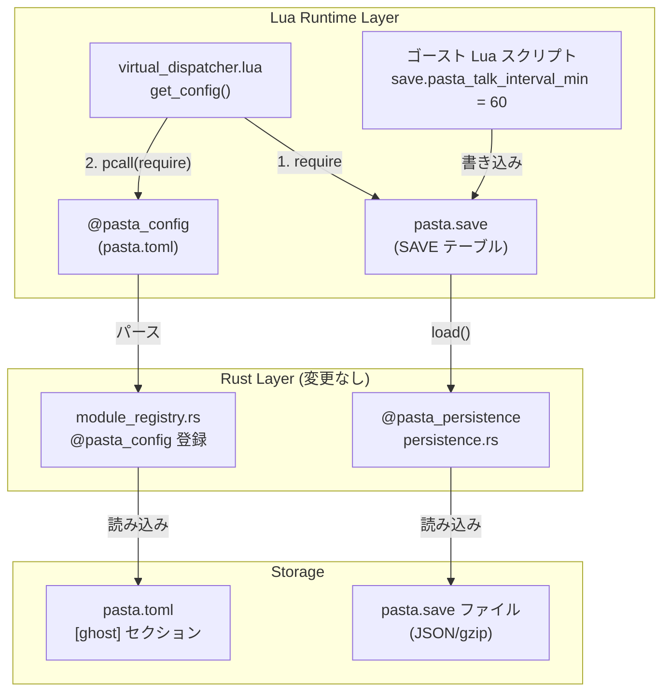
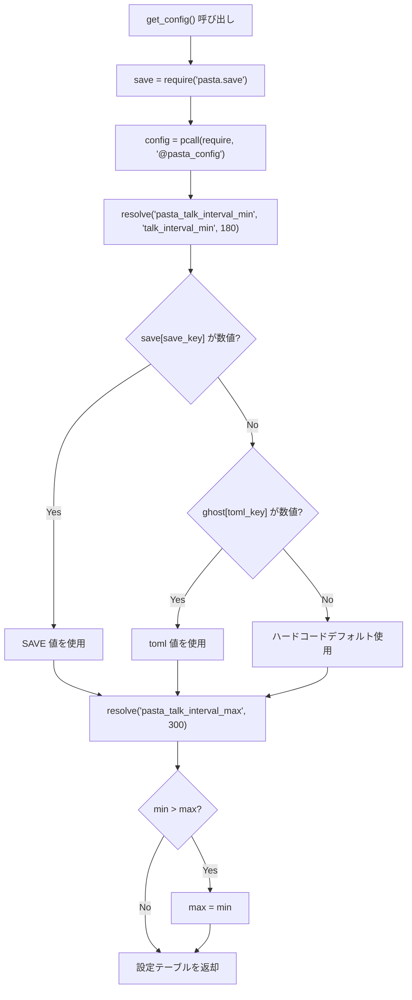
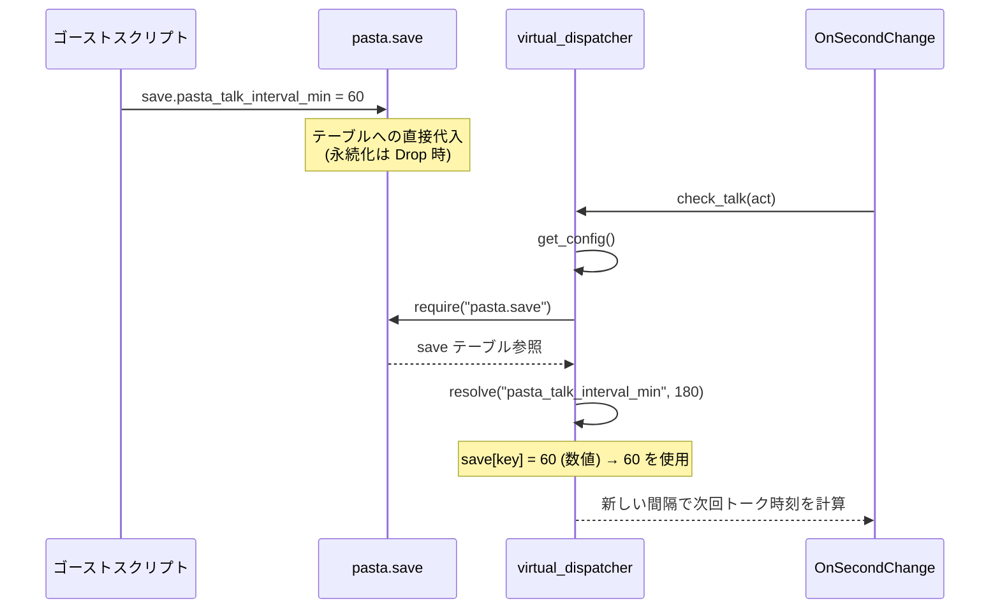

# Technical Design: talk-frequency-persistence

## Overview

おしゃべり頻度（`talk_interval_min` / `talk_interval_max`）を SAVE テーブルに永続化し、`pasta.toml` をフォールバックデフォルトとして扱う機能を実装する。`virtual_dispatcher.lua` の `get_config()` 関数1箇所の変更でコアロジックを実現し、`pasta-lua-coding` スキルへ命名規約を追記する。

**Purpose**: ゴースト作者がおしゃべり頻度をセッション間で保持し、ユーザー操作に応じて動的に調整できるようにする。

**Users**: ゴースト作者が `save.pasta_talk_interval_min = 60` のように SAVE テーブルへ書き込むことで頻度を制御する。

**Impact**: `virtual_dispatcher.lua` の `get_config()` をキャッシュ方式から毎回読み直し方式に変更する。

### Goals
- SAVE テーブルからのおしゃべり頻度読み出しと 3 段フォールバック（SAVE > toml > hardcoded）
- 実行時変更の即時反映（キャッシュ廃止による暗黙的実現）
- 不正値に対するバリデーション（型チェック、min > max 補正）
- `pasta-lua-coding` スキルへの SAVE キー命名規約追記

### Non-Goals
- `hour_margin` の永続化（同パターンで将来追加可能だが現スコープ外）
- SAVE テーブル自体の機構変更（既存基盤をそのまま活用）
- Rust 層の変更

## Architecture

### Existing Architecture Analysis

現行の設定読み込みフロー:

```
@pasta_config (Rust) → pcall(require) → ghost テーブル → cached_config（モジュールローカル）
```

- `cached_config` はセッション中不変で、`_reset()` でのみクリア
- SAVE テーブルは完全稼働中だが、`get_config()` から参照されていない
- `require("pasta.save")` は Lua キャッシュ返却のため O(1)

### Architecture Pattern & Boundary Map



**Architecture Integration**:
- **Selected pattern**: 既存モジュールの拡張（Extension）。新規コンポーネントなし
- **Domain boundaries**: `virtual_dispatcher.lua` 内に変更を閉じ、Rust 層は不変
- **Existing patterns preserved**: `require("pasta.save")` と `pcall(require, "@pasta_config")` の既存パターンを踏襲
- **Steering compliance**: KARPATHY ガイドライン準拠（最小変更、単一関数）

### Technology Stack

| Layer | Choice / Version | Role in Feature | Notes |
|-------|------------------|-----------------|-------|
| Runtime | Lua 5.5 (mlua 0.11) | `get_config()` ロジック実行 | 変更対象 |
| Persistence | `@pasta_persistence` (Rust) | SAVE テーブル永続化 | 変更不要 |
| Config | `@pasta_config` (Rust) | pasta.toml 読み取り | 変更不要 |
| Testing | Rust 統合テスト + `runtime.exec()` | テスト実行 | テスト追加 |
| Skill Docs | Markdown | 命名規約ドキュメント | 追記 |

## System Flows

### フォールバック解決フロー



### 実行時変更フロー



## Requirements Traceability

| Requirement | Summary | Components | Interfaces | Flows |
|-------------|---------|------------|------------|-------|
| 1.1 | 3段フォールバック優先順位 | get_config, resolve | resolve(save_key, toml_key, default) | フォールバック解決フロー |
| 1.2 | SAVE の min 値読み出し | get_config | save[pasta_talk_interval_min] | フォールバック解決フロー |
| 1.3 | SAVE の max 値読み出し | get_config | save[pasta_talk_interval_max] | フォールバック解決フロー |
| 1.4 | toml フォールバック (min) | get_config, resolve | ghost.talk_interval_min | フォールバック解決フロー |
| 1.5 | toml フォールバック (max) | get_config, resolve | ghost.talk_interval_max | フォールバック解決フロー |
| 2.1 | 実行時変更反映 | get_config（キャッシュ廃止） | — | 実行時変更フロー |
| 3.1 | 非数値 min のフォールバック | resolve | type(sv) == "number" ガード | フォールバック解決フロー |
| 3.2 | 非数値 max のフォールバック | resolve | type(sv) == "number" ガード | フォールバック解決フロー |
| 3.3 | min > max 補正 | get_config | if min > max then max = min | フォールバック解決フロー |
| 4.1 | スキルへの pasta_ 命名規約追記 | pasta-lua-coding SKILL.md | — | — |
| 4.2 | エンジン予約キー vs ゴーストキーの区別 | pasta-lua-coding references/ | — | — |

## Components and Interfaces

| Component | Domain/Layer | Intent | Req Coverage | Key Dependencies | Contracts |
|-----------|--------------|--------|--------------|------------------|-----------|
| get_config() | Lua Runtime | SAVE/toml/default フォールバックで設定取得 | 1.1–1.5, 2.1, 3.1–3.3 | pasta.save (P0), @pasta_config (P1) | Service |
| resolve() | Lua Runtime | 個別キーの3段フォールバック解決 | 1.1–1.5, 3.1–3.2 | — (get_config 内ローカル関数) | — |
| pasta-lua-coding スキル更新 | Documentation | SAVE キー命名規約追記 | 4.1–4.2 | — | — |

### Lua Runtime Layer

#### get_config()

| Field | Detail |
|-------|--------|
| Intent | SAVE > toml > hardcoded の3段フォールバックでおしゃべり頻度設定を取得 |
| Requirements | 1.1–1.5, 2.1, 3.1–3.3 |

**Responsibilities & Constraints**
- `require("pasta.save")` で SAVE テーブルを取得（Lua キャッシュ返却、O(1)）
- `pcall(require, "@pasta_config")` で toml 設定を取得（既存パターン維持）
- ローカル関数 `resolve()` で各キーの3段フォールバック解決
- `type(sv) == "number"` ガードで非数値値を無視
- `min > max` の場合 `max = min` に補正
- `hour_margin` は従来通り toml のみ参照（永続化対象外）
- `cached_config` モジュールローカル変数を廃止
- 毎回新しいテーブルを返却

**Dependencies**
- Inbound: `check_talk()`, `check_hour()` — 設定値取得 (P0)
- Outbound: `pasta.save` — SAVE テーブル参照 (P0)
- Outbound: `@pasta_config` — toml 設定参照 (P1)

**Contracts**: Service [x]

##### Service Interface

```lua
--- SAVE > toml > hardcoded フォールバックで設定を取得
--- @return table { talk_interval_min: number, talk_interval_max: number, hour_margin: number }
local function get_config() end
```

- Preconditions: `pasta.save` モジュールがロード済み
- Postconditions: 返却テーブルの `talk_interval_min`, `talk_interval_max`, `hour_margin` は全て数値
- Invariants: `talk_interval_min <= talk_interval_max`

##### resolve() ローカル関数

```lua
--- SAVE キーの値 → toml キーの値 → デフォルト値の優先順位で解決
--- （save と ghost は get_config() のアップバリューとして捕捉）
--- @param save_key string SAVE テーブルのキー名（pasta_ プレフィックス付き）
--- @param toml_key string pasta.toml [ghost] セクションのキー名（プレフィックスなし）
--- @param default number ハードコードデフォルト値
--- @return number 解決された値
local function resolve(save_key, toml_key, default) end
```

- Preconditions: `save`, `ghost` は get_config() スコープで初期化済み（アップバリュー）
- Postconditions: 返却値は必ず number 型
- Invariants: `type(返却値) == "number"`

**Implementation Notes**
- `cached_config` 変数と早期リターンを除去
- `_get_internal_state()` から `cached_config` フィールドを除去
- `_reset()` から `cached_config = nil` を除去
- テスト用に `M._get_config = get_config` を公開（テストから直接設定値を検証可能にする）

#### テスト用インターフェース変更

| Field | Detail |
|-------|--------|
| Intent | キャッシュ廃止に伴うテスト用関数の整理 |
| Requirements | — (テスト基盤) |

**変更点**:

| 関数 | 変更 | 理由 |
|------|------|------|
| `M._reset()` | `cached_config = nil` 行を除去 | キャッシュ変数廃止 |
| `M._get_internal_state()` | `cached_config` フィールドを除去 | 公開不要 |
| `M._get_config` | **新規追加**: `get_config` への参照を公開 | テストから設定解決結果を直接検証 |

### Documentation Layer

#### pasta-lua-coding スキル更新

| Field | Detail |
|-------|--------|
| Intent | SAVE テーブルキー命名規約の追記 |
| Requirements | 4.1, 4.2 |

**変更対象ファイル**:

| ファイル | 変更内容 |
|---------|---------|
| `.agents/skills/pasta-lua-coding/SKILL.md` | §3 Coding Conventions に SAVE キー命名規約セクション追加 |
| `.agents/skills/pasta-lua-coding/references/internal-modules.md` | SAVE モジュールセクションに命名規約を追記 |

**追記内容**:
- エンジン予約キー: `pasta_` プレフィックス付き（例: `pasta_talk_interval_min`）
- ゴースト固有キー: 任意命名、`pasta_` プレフィックスは使用禁止（予約済み）
- SKILL.md の `metadata.version` をバンプ

## Error Handling

### Error Strategy

全エラーはサイレントフォールバック方式。ログ出力は行わない（既存パターンに準拠）。

| エラー条件 | 処理 | 根拠 |
|-----------|------|------|
| SAVE 値が非数値 | 無視し toml にフォールバック | Req 3.1, 3.2 |
| toml 値が非数値 | 無視しハードコードデフォルトにフォールバック | Req 1.1 |
| `@pasta_config` ロード失敗 | 空テーブルとして扱う | 既存パターン |
| min > max | max = min に補正 | Req 3.3 |

## Testing Strategy

### Unit Tests（Lua → Rust 統合テスト）

既存の `virtual_event_config_test.rs` パターンを踏襲:

1. **SAVE 優先テスト**: SAVE テーブルに値を設定 → `get_config()` が SAVE 値を返すことを検証
2. **toml フォールバックテスト**: SAVE テーブルに値なし → toml 値が使用されることを検証
3. **ハードコードデフォルトテスト**: SAVE・toml 両方なし → デフォルト値（180/300）を検証
4. **非数値フォールバックテスト**: SAVE に文字列を設定 → 無視されて次の優先順位にフォールバック
5. **min > max 補正テスト**: min=500, max=100 → 両方 500 になることを検証
6. **実行時変更反映テスト**: dispatch 後に SAVE 値を変更 → 次回 dispatch で新しい値が反映
7. **部分設定テスト**: min のみ SAVE に設定 → min は SAVE 値、max は toml/デフォルト

**テストパターン**:
```lua
-- SAVE テーブルへの事前書き込み
local save = require("pasta.save")
save.pasta_talk_interval_min = 60
save.pasta_talk_interval_max = 120

-- get_config() の検証
local dispatcher = require "pasta.shiori.event.virtual_dispatcher"
dispatcher._reset()
local cfg = dispatcher._get_config()
-- cfg.talk_interval_min == 60, cfg.talk_interval_max == 120
```

### 既存テストへの影響

| テストファイル | 影響 | 対応 |
|---------------|------|------|
| `virtual_event_config_test.rs` | `cached_config` フィールド参照の除去 | `_get_config()` に置き換え |
| `virtual_event_dispatch_test.rs` | 影響なし（`cached_config` を直接参照していない） | 変更不要 |
