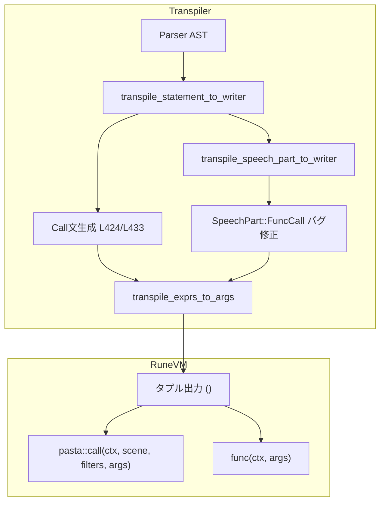

# Design Document: transpiler-args-tuple-conversion

## Overview

**Purpose**: Pastaトランスパイラーが生成するRuneコードにおいて、関数呼び出しの引数を配列リテラル`[]`からタプルリテラル`()`に変換し、Runeの型システムに意味的に適合したコードを生成する。また、アクション行の関数呼び出しバグを修正し、正しいRune関数呼び出しを生成する。

**Users**: Pastaスクリプト開発者およびトランスパイラーメンテナーが、正しい引数構文でシーン関数を呼び出せるようになる。

**Impact**: `src/transpiler/mod.rs`の3箇所のコード生成ロジックと1つのヘルパー関数を変更し、既存テストの期待値を更新する。

### Goals
- Call/Jump文の引数リストをタプル形式で生成する
- アクション行の関数呼び出し（`＠関数()`構文）のバグを修正し、直接Rune関数呼び出しを生成する
- `transpile_exprs_to_args`関数に単一要素タプルの末尾カンマロジックを追加する
- 既存テストを更新し、全テストが合格することを保証する

### Non-Goals
- Rune VM側の`pasta::call`や`pasta_stdlib::word`関数のシグネチャ変更
- 新しい関数呼び出し構文の追加
- 配列とタプルの両方をサポートする互換レイヤー

---

## Architecture

### Existing Architecture Analysis

**トランスパイラーの現在構造**:
- **2パス変換**: Pass1（シーン登録）→ Pass2（コード生成）
- **文字列ベース生成**: `writeln!`マクロでRuneコードを直接文字列として出力
- **IR型**: ScriptEventは変更不要（トランスパイル時のみ影響）

**影響を受けるコード生成箇所**:

| 箇所 | 現在の出力 | 変更後の出力 |
|------|-----------|-------------|
| Call文（動的ターゲット）L424 | `[arg1, arg2]` | `(arg1, arg2)` |
| Call文（静的ターゲット）L433 | `[arg1, arg2]` | `(arg1, arg2)` |
| アクション行（関数呼び出し）L507-520 | 単語展開（バグ） | `for a in func(ctx, (args)) { yield a; }` |

### Architecture Pattern & Boundary Map



**Architecture Integration**:
- **Selected pattern**: 既存コンポーネント拡張 - 新規ファイル作成不要
- **Domain boundaries**: トランスパイラー内部の文字列生成ロジックのみ変更
- **Existing patterns preserved**: 2パス変換、文字列ベース生成
- **Steering compliance**: yield型エンジン、宣言的フロー

### Technology Stack

| Layer | Choice / Version | Role in Feature |
|-------|------------------|-----------------|
| Backend | Rust 2024 edition | トランスパイラー実装 |
| Runtime | Rune 0.14 | タプル構文サポート（検証済み） |
| Parser | Pest 2.8 | AST生成（変更なし） |

---

## Requirements Traceability

| Requirement | Summary | Components | Interfaces | Flows |
|-------------|---------|------------|------------|-------|
| 1.1-1.6 | Call/Jump文・アクション行のタプル変換 | CallGenerator, FuncCallFix | transpile_exprs_to_args | Call文生成フロー |
| 2.1-2.4 | transpile_exprs_to_args修正 | ArgsHelper | 関数シグネチャ | ヘルパー関数フロー |
| 3.1-3.3 | 後方互換性保証 | TestUpdates | N/A | テスト実行フロー |
| 4.1-4.2 | ドキュメント更新 | Documentation | N/A | N/A |

---

## Components and Interfaces

| Component | Domain/Layer | Intent | Req Coverage | Key Dependencies | Contracts |
|-----------|--------------|--------|--------------|------------------|-----------|
| CallGenerator | Transpiler | Call/Jump文のタプル生成 | 1.1-1.6 | transpile_exprs_to_args (P0) | Service |
| FuncCallFix | Transpiler | アクション行関数呼び出しバグ修正 | 1.1-1.6 | TranspileContext (P0), FunctionScope (P0) | Service |
| ArgsHelper | Transpiler | 引数リスト文字列生成 | 2.1-2.4 | transpile_expr (P0) | Service |
| TestUpdates | Tests | テスト期待値更新 | 3.1-3.3 | N/A | N/A |

### Transpiler Layer

#### CallGenerator（Call文生成修正）

| Field | Detail |
|-------|--------|
| Intent | Call/Jump文の引数リストを配列`[]`からタプル`()`に変換 |
| Requirements | 1.1, 1.2, 1.3, 1.4, 1.5, 1.6 |

**Responsibilities & Constraints**
- `transpile_statement_to_writer`内のCall文生成ロジックを修正
- 動的ターゲット（L424）と静的ターゲット（L433）の両方を対応
- `pasta::call`の第4引数をタプル形式に変更

**Dependencies**
- Outbound: `transpile_exprs_to_args` — 引数文字列生成 (P0)

**Contracts**: Service [x]

##### Service Interface
```rust
// 変更箇所1: 動的ターゲット（L424）
// Before:
"        for a in crate::pasta::call(ctx, `${{ctx.{}.{}}}`, {}, [{}]) {{ yield a; }}"
// After:
"        for a in crate::pasta::call(ctx, `${{ctx.{}.{}}}`, {}, ({})) {{ yield a; }}"

// 変更箇所2: 静的ターゲット（L433）
// Before:
"        for a in crate::pasta::call(ctx, \"{}\", {}, [{}]) {{ yield a; }}"
// After:
"        for a in crate::pasta::call(ctx, \"{}\", {}, ({})) {{ yield a; }}"
```

---

#### FuncCallFix（アクション行関数呼び出しバグ修正）

| Field | Detail |
|-------|--------|
| Intent | SpeechPart::FuncCallを正しくRune関数呼び出しとして生成 |
| Requirements | 1.1, 1.2, 1.3, 1.4, 1.5, 1.6 |

**Responsibilities & Constraints**
- `transpile_speech_part_to_writer`内のFuncCall処理を完全に書き換え
- 現在の単語展開処理（バグ）を削除
- FunctionScopeに基づいてローカル/グローバル呼び出しを生成
- `for a in func(ctx, (args)) { yield a; }`形式を出力

**Dependencies**
- Inbound: SpeechPart::FuncCall — AST (P0)
- Outbound: `transpile_exprs_to_args` — 引数文字列生成 (P0)
- Outbound: `TranspileContext.resolve_function` — 関数名解決 (P0)

**Contracts**: Service [x]

##### Service Interface
```rust
// 現在のバグ実装（L507-520）:
SpeechPart::FuncCall {
    name,
    args: _,  // 引数を無視！
    scope: _,
} => {
    writeln!(
        writer,
        "        yield Talk(pasta_stdlib::word(\"{}\", \"{}\", []));",
        context.current_module(),
        name
    )
}

// 修正後の実装:
SpeechPart::FuncCall { name, args, scope } => {
    let args_str = Self::transpile_exprs_to_args(args, context)?;
    match scope {
        FunctionScope::Auto => {
            // ローカル優先: 現在のモジュール内で関数を探し、なければグローバル
            writeln!(
                writer,
                "        for a in {}(ctx, ({})) {{ yield a; }}",
                name, args_str
            )
        }
        FunctionScope::GlobalOnly => {
            // グローバル指定: super::を付与
            writeln!(
                writer,
                "        for a in super::{}(ctx, ({})) {{ yield a; }}",
                name, args_str
            )
        }
    }
    .map_err(|e| PastaError::io_error(e.to_string()))?;
}
```

**Implementation Notes**
- FunctionScope::Autoの場合、関数はローカルモジュール内で定義されていると仮定
- FunctionScope::GlobalOnlyの場合、`super::`プレフィックスでグローバルスコープを指定
- 引数は常にタプル形式`(args)`で渡す

---

#### ArgsHelper（transpile_exprs_to_args修正）

| Field | Detail |
|-------|--------|
| Intent | 引数リストをタプル構文に適した文字列に変換 |
| Requirements | 2.1, 2.2, 2.3, 2.4 |

**Responsibilities & Constraints**
- 0個の引数: 空文字列を返す（呼び出し側で`()`に展開）
- 1個の引数: 末尾カンマを追加（`"arg,"`）
- 2個以上の引数: カンマ区切り（`"arg1, arg2"`）

**Dependencies**
- Outbound: `transpile_expr` — 個別式変換 (P0)

**Contracts**: Service [x]

##### Service Interface
```rust
/// Transpile expressions to argument list string for tuple syntax.
/// 
/// # Returns
/// - Empty args: "" (caller adds "()")
/// - Single arg: "arg," (trailing comma for single-element tuple)
/// - Multiple args: "arg1, arg2, ..."
fn transpile_exprs_to_args(
    exprs: &[Expr],
    context: &TranspileContext,
) -> Result<String, PastaError> {
    let args: Vec<String> = exprs
        .iter()
        .map(|expr| Self::transpile_expr(expr, context))
        .collect::<Result<Vec<_>, _>>()?;
    
    match args.len() {
        0 => Ok(String::new()),
        1 => Ok(format!("{},", args[0])),  // 単一要素タプルは末尾カンマ必須
        _ => Ok(args.join(", ")),
    }
}
```

**Design Decisions**
- 末尾カンマはRuneの単一要素タプル構文に必須（`(x,)` vs `(x)`はグループ化）
- 呼び出し側で括弧`()`を追加する責務分離を維持

---

## Data Models

### Tuple Syntax Specification

Runeタプル構文（検証済み - `pasta_rune_tuple_syntax_test.rs`）:

| 要素数 | Rune構文 | 生成される文字列 |
|--------|----------|-----------------|
| 0 | `()` | `""` → `()` |
| 1 | `(x,)` | `"x,"` → `(x,)` |
| 2+ | `(a, b, c)` | `"a, b, c"` → `(a, b, c)` |

---

## Error Handling

**エラーシナリオ**:
- `transpile_expr`失敗: 現在と同様に`Result<_, PastaError>`で伝播
- `writeln!`失敗: `PastaError::io_error`でラップ

**変更なし**: 既存のエラーハンドリングパターンを維持

---

## Testing Strategy

### テスト更新対象

| テストファイル | 変更内容 |
|---------------|---------|
| `tests/pasta_transpiler_word_code_gen_test.rs` | 期待値文字列を`[]`から`()`に更新 |
| その他のトランスパイラーテスト | grep検索で特定、必要に応じて更新 |

### 新規テストケース

```rust
#[test]
fn test_call_with_tuple_args() {
    // 0引数: pasta::call(ctx, "scene", #{}, ())
    // 1引数: pasta::call(ctx, "scene", #{}, (arg,))
    // 2引数: pasta::call(ctx, "scene", #{}, (a, b))
}

#[test]
fn test_action_line_func_call() {
    // ローカル: for a in func(ctx, (args)) { yield a; }
    // グローバル: for a in super::func(ctx, (args)) { yield a; }
}
```

---

## Implementation Notes

### Integration & Migration
- 既存テストの期待値更新が必要（breaking change in test expectations）
- Rune VM側の変更は不要（`pasta::call`は引数を透過的に渡す）

### Validation Hooks
- 全テスト実行で回帰テスト
- タプル構文テスト（`pasta_rune_tuple_syntax_test.rs`）で構文サポート確認済み

### Open Questions / Risks
- **リスク**: アクション行のバグ修正は既存動作を変更するため、依存スクリプトに影響
- **軽減策**: 単語展開（`＠XXX`）と関数呼び出し（`＠XXX()`）の区別を明確化

---

## Supporting References

### Rune Tuple Syntax Verification

テストコード（`pasta_rune_tuple_syntax_test.rs`）により以下を確認:

```rust
// 0要素タプル
pub fn test_empty_tuple(ctx) { test_func(ctx, ()) }

// 1要素タプル（末尾カンマ必須）
pub fn test_single_element_tuple(ctx) { test_func(ctx, (42,)) }

// 複数要素タプル
pub fn test_multi_element_tuple(ctx) { test_func(ctx, (1, 2, 3)) }
```

**結果**: 4/4テスト合格、すべてのタプル構文がRune 0.14でサポート
