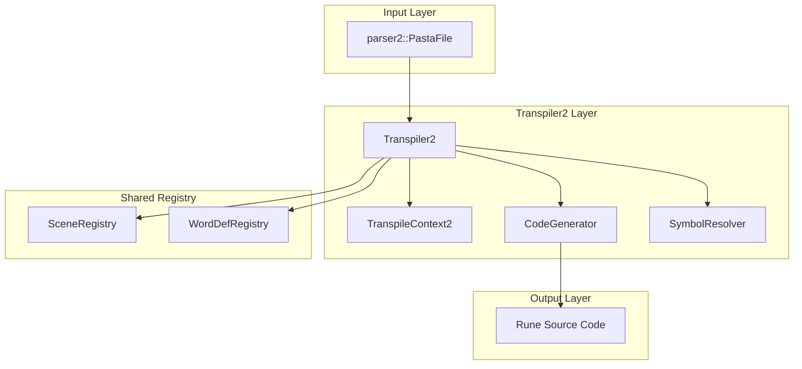
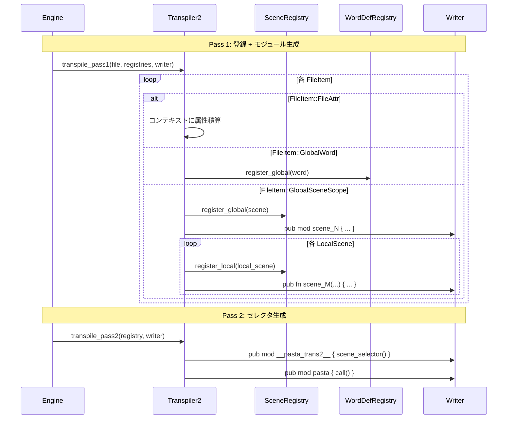
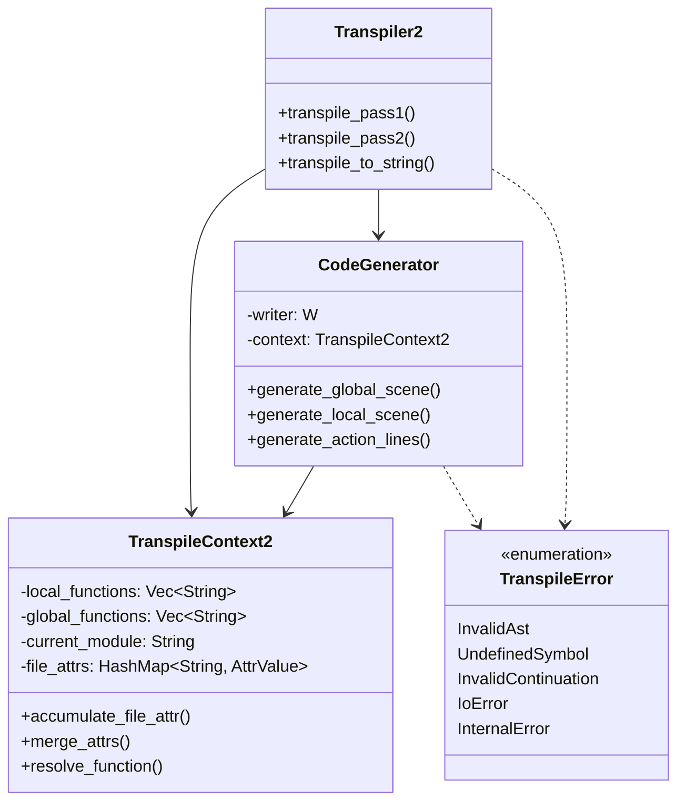

# 技術設計書: transpiler2-layer-implementation

## 1. 概要

### 1.1 目的

parser2が生成するAST（3層スコープ構造 + FileItem統一配列）をRune VMで実行可能なソースコードに変換するtranspiler2レイヤーを実装する。

### 1.2 ゴール

| ゴール | 説明 |
|--------|------|
| G1 | parser2 ASTの全要素（FileItem, GlobalSceneScope, LocalSceneScope, Action等）をRuneコードに変換 |
| G2 | 既存transpilerと完全に独立したモジュール構造を維持 |
| G3 | SceneRegistry/WordDefRegistryを100%再利用（AST型非依存） |
| G4 | Rune 0.14 VMで正常に実行可能なコードを生成 |
| G5 | 包括的なエラーハンドリング（TranspileError型） |

### 1.3 非ゴール

| 非ゴール | 理由 |
|---------|------|
| 既存transpilerの改修 | 並行稼働戦略を維持 |
| Runtime層の変更 | 既存API互換性を保持 |
| parser2の変更 | parser2-filescope-bug-fixで安定化済み |
| 属性フィルタリング実行 | P1スコープ（登録のみ実装） |

---

## 2. アーキテクチャ

### 2.1 アーキテクチャパターン

**選択パターン**: Option B-改改（新規Transpiler2 + 共有Registry）

**根拠**:
- 完全なモジュール独立性
- 既存レジストリのAST型非依存性による100%再利用
- 段階的レガシー削除が可能

### 2.2 境界マップ



### 2.3 ディレクトリ構造

```
src/
├── registry/              # 新規：共有レジストリモジュール
│   ├── mod.rs            # 公開API
│   ├── scene_registry.rs # SceneRegistry（transpilerから移動）
│   └── word_registry.rs  # WordDefRegistry（transpilerから移動）
├── transpiler/            # 既存（registry import に変更）
│   └── mod.rs
├── transpiler2/           # 新規
│   ├── mod.rs            # Transpiler2 struct + public API
│   ├── error.rs          # TranspileError型
│   ├── context.rs        # TranspileContext2
│   └── code_generator.rs # AST → Rune code generation
└── runtime/               # 既存（変更なし）
```

---

## 3. 技術スタック

| 技術 | バージョン | 用途 | 選定理由 |
|------|-----------|------|---------|
| Rust | 2024 edition | 主言語 | プロジェクト標準 |
| Rune | 0.14 | 生成コード実行VM | 既存Runtime互換 |
| thiserror | 2 | エラー型定義 | 既存パターン踏襲 |

---

## 4. システムフロー

### 4.1 2パス変換フロー



### 4.2 コード生成フロー

```mermaid
flowchart TD
    A[GlobalSceneScope] --> A1[1. 属性をContextに積算]
    A1 --> A2[2. code_blocks を後処理用にバッファ]
    A2 --> B{local_scenes?}
    B -->|Yes| C[3. Generate __start__ function]
    B -->|No| D[3. Generate inline code]
    
    C --> E[4. Process items before first local]
    E --> F[5. Generate local scene functions]
    F --> F1[6. CodeBlocks末尾に一括出力<br/>記述順序を保持]
    
    D --> D1["代替: inline code<br/>+ CodeBlocks"]
    D1 --> F1
    
    F1 --> G[LocalSceneScope]
    G --> H[Process LocalSceneItems]
    
    H --> I{Item Type}
    I -->|CodeBlock| I0[インライン出力<br/>出現位置で即座]
    I -->|VarSet| J[Generate assignment]
    I -->|CallScene| K[Generate pasta::call]
    I -->|ActionLine| L[Generate yield statements]
    I -->|ContinueAction| M[Merge with previous ActionLine]
    
    L --> N{Action Type}
    N -->|Talk| O[yield Talk]
    N -->|VarRef| P[yield Talk template]
    N -->|FnCall| Q[for a in fn { yield a }]
    N -->|WordRef| R[pasta_stdlib::word]
    N -->|SakuraScript| S[emit_sakura_script]
    N -->|Escape| T[Extract 2nd char]
```

**処理順序の詳細**:
- **GlobalSceneScope.code_blocks**: mod内の末尾（local_scenes全て生成後、`}`の直前）に一括出力
  - 複数blocks存在時は記述順序を保持
- **LocalSceneScope.code_blocks**: 関数内で出現位置でインライン出力
  - インデント調整のみ実施、構文検証はRune VM に委譲

---

## 5. 要件トレーサビリティ

| 要件 | コンポーネント | 実装戦略 |
|-----|---------------|---------|
| Req 1: モジュール独立性 | `src/transpiler2/` | 新規モジュール作成 |
| Req 2: AST-to-Rune変換 | CodeGenerator | 3層スコープ対応生成 |
| Req 3: Call解決 | SymbolResolver + CodeGenerator | `pasta::call()` 生成 |
| Req 4: シンボル解決 | SymbolResolver | Phase 1登録ループ |
| Req 5: 変数スコープ | TranspileContext2 | `ctx.local`/`ctx.global` |
| Req 6: 式評価 | CodeGenerator | そのまま文字列変換 |
| Req 7: アクション処理 | CodeGenerator | Action型別yield生成 |
| Req 8: エラーハンドリング | TranspileError | 専用エラー型 |
| Req 9: Rune互換性 | CodeGenerator | Rune 0.14構文準拠 |
| Req 9b: 2パスアーキテクチャ | Transpiler2 | Pass1/Pass2分離 |
| Req 10: テストカバレッジ | tests/ | 15カテゴリテスト |
| Req 11: FileScope属性継承 | TranspileContext2 | `file.items` 順次処理 |
| Req 12: シーン属性処理 | CodeGenerator | `attrs` → HashMap変換 |
| Req 13: CodeBlock埋め込み | CodeGenerator | シーン/ローカル位置出力 |
| Req 14: ContinueAction処理 | CodeGenerator | 直前ActionLine連結 |
| Req 15: FileScope単語登録 | Transpiler2 | `GlobalWord` 逐次登録 |

---

## 6. コンポーネント設計

### 6.1 Transpiler2 (mod.rs)

```rust
/// Parser2 AST → Rune ソースコード変換器
pub struct Transpiler2;

impl Transpiler2 {
    /// Pass 1: シーン・単語登録 + モジュール生成
    pub fn transpile_pass1<W: std::io::Write>(
        file: &parser2::PastaFile,
        scene_registry: &mut SceneRegistry,
        word_registry: &mut WordDefRegistry,
        writer: &mut W,
    ) -> Result<(), TranspileError>;
    
    /// Pass 2: セレクタ・ラッパー生成
    pub fn transpile_pass2<W: std::io::Write>(
        registry: &SceneRegistry,
        writer: &mut W,
    ) -> Result<(), TranspileError>;
    
    /// ヘルパー: 単一ファイル変換（テスト用）
    pub fn transpile_to_string(file: &parser2::PastaFile) -> Result<String, TranspileError>;
}
```

### 6.2 TranspileContext2 (context.rs)

```rust
/// 変換コンテキスト（parser2対応）
#[derive(Clone)]
pub struct TranspileContext2 {
    /// ローカル関数名リスト
    local_functions: Vec<String>,
    /// グローバル関数名リスト（stdlib + ユーザー定義）
    global_functions: Vec<String>,
    /// 現在のモジュール名（単語検索用）
    current_module: String,
    /// File-level属性の積算結果
    file_attrs: HashMap<String, AttrValue>,
}

impl TranspileContext2 {
    pub fn new() -> Self;
    
    /// File-level属性を積算
    ///
    /// 複数のFileAttrを記述順で処理。同一キーが複数回出現時は後書き優先（後のAttrが前のAttrを上書き）
    pub fn accumulate_file_attr(&mut self, attr: &Attr);
    
    /// シーン属性とFile属性をマージ（シーン優先）
    ///
    /// マージルール:
    /// 1. file_attrs の全キーを基盤として開始
    /// 2. scene_attrs の各キーでfile_attrsを上書き（同一キーの場合、scene_attrsが優先）
    /// 3. 結果をHashMap<String, AttrValue>として返す
    pub fn merge_attrs(&self, scene_attrs: &[Attr]) -> HashMap<String, AttrValue>;
    
    /// 関数名解決（Local → Global 探索）
    pub fn resolve_function(&self, name: &str, scope: FnScope) -> Result<String, TranspileError>;
}
```

### 6.3 CodeGenerator (code_generator.rs)

```rust
/// Runeコード生成器
pub struct CodeGenerator<'a, W: std::io::Write> {
    writer: &'a mut W,
    context: TranspileContext2,
}

impl<'a, W: std::io::Write> CodeGenerator<'a, W> {
    /// グローバルシーンモジュール生成
    pub fn generate_global_scene(
        &mut self,
        scene: &GlobalSceneScope,
        scene_registry: &mut SceneRegistry,
        word_registry: &mut WordDefRegistry,
    ) -> Result<(), TranspileError>;
    
    /// ローカルシーン関数生成
    pub fn generate_local_scene(
        &mut self,
        scene: &LocalSceneScope,
        parent_name: &str,
        parent_counter: usize,
        scene_registry: &mut SceneRegistry,
    ) -> Result<(), TranspileError>;
    
    /// アクション行生成（ContinueAction連結対応）
    pub fn generate_action_lines(
        &mut self,
        items: &[LocalSceneItem],
    ) -> Result<(), TranspileError>;
    
    /// 単一アクション生成
    fn generate_action(&mut self, action: &Action) -> Result<(), TranspileError>;
    
    /// 式生成
    fn generate_expr(&mut self, expr: &Expr) -> Result<(), TranspileError>;
    
    /// CodeBlock出力
    fn generate_code_block(&mut self, block: &CodeBlock) -> Result<(), TranspileError>;
}
```

### 6.4 TranspileError (error.rs)

```rust
use thiserror::Error;

/// Transpiler2 エラー型
#[derive(Error, Debug)]
pub enum TranspileError {
    #[error("無効なAST {location}: {message}")]
    InvalidAst {
        location: String,
        message: String,
    },
    
    #[error("未定義シンボル: {symbol}")]
    UndefinedSymbol {
        symbol: String,
    },
    
    #[error("無効な継続行 {location}: 直前にActionLineがありません")]
    InvalidContinuation {
        location: String,
    },
    
    #[error("IO エラー: {0}")]
    IoError(#[from] std::io::Error),
    
    #[error("内部エラー: {0}")]
    InternalError(String),
}

impl TranspileError {
    pub fn invalid_ast(span: &Span, message: impl Into<String>) -> Self;
    pub fn undefined_symbol(symbol: impl Into<String>) -> Self;
    pub fn invalid_continuation(span: &Span) -> Self;
}
```

---

## 7. インターフェース設計

### 7.1 公開API (lib.rs 追加)

```rust
// src/lib.rs への追加
pub mod registry;      // 共有レジストリ
pub mod transpiler2;   // parser2用transpiler

// 再エクスポート
pub use registry::{SceneRegistry, SceneInfo, WordDefRegistry, WordEntry};
pub use transpiler2::{Transpiler2, TranspileContext2, TranspileError};
```

### 7.2 内部インターフェース

```rust
// src/transpiler2/mod.rs
mod context;
mod code_generator;
mod error;

pub use context::TranspileContext2;
pub use error::TranspileError;

use crate::registry::{SceneRegistry, WordDefRegistry};
use crate::parser2::{
    PastaFile, FileItem, GlobalSceneScope, LocalSceneScope,
    LocalSceneItem, Action, Attr, CodeBlock, Expr,
};
```

---

## 8. データモデル

### 8.1 型定義



### 8.2 AST → Rune マッピング

| Parser2 AST | Rune出力 |
|-------------|---------|
| `GlobalSceneScope` | `pub mod scene_N { ... }` |
| `LocalSceneScope(None)` | `pub fn __start__(ctx, args) { ... }` |
| `LocalSceneScope(Some(name))` | `pub fn name_M(ctx, args) { ... }` |
| `ActionLine` | `yield Talk(...);` |
| `ContinueAction` | 直前ActionLineに連結 |
| `VarSet` | `ctx.local.var = expr;` |
| `CallScene` | `for a in pasta::call(...) { yield a; }` |
| `CodeBlock` | そのまま出力 |
| `Action::Talk` | `yield Talk("text");` |
| `Action::VarRef` | `` yield Talk(`${ctx.local.var}`); `` |
| `Action::FnCall` | `for a in fn(ctx, args) { yield a; }` |
| `Action::WordRef` | `yield pasta_stdlib::word("module", "word");` |
| `Action::SakuraScript` | `yield emit_sakura_script("...");` |
| `Action::Escape` | `yield Talk("x");` (2文字目抽出) |

---

## 9. エラーハンドリング

### 9.1 エラー分類

| エラー種別 | 発生条件 | 復旧可否 |
|-----------|---------|---------|
| InvalidAst | AST構造不正 | ❌ 不可 |
| UndefinedSymbol | シンボル未登録 | ❌ 不可 |
| InvalidContinuation | ContinueActionが先頭 | ❌ 不可 |
| IoError | 書き込み失敗 | ⚠️ リトライ可能 |
| InternalError | 内部論理エラー | ❌ 不可 |

### 9.2 エラー伝播

```rust
// すべての内部関数は Result<T, TranspileError> を返す
// ? 演算子でエラー伝播
fn process_scene(scene: &GlobalSceneScope) -> Result<(), TranspileError> {
    self.generate_module_header()?;
    self.generate_start_function()?;
    for local in &scene.local_scenes {
        self.generate_local_scene(local)?;
    }
    Ok(())
}
```

---

## 10. テスト戦略

### 10.1 テストカテゴリ（15カテゴリ）

| # | カテゴリ | 内容 | Fixture |
|---|---------|------|---------|
| 1 | 単一グローバルシーン | 最小シーン変換 | `simple_scene.pasta` |
| 2 | 複数グローバルシーン | 複数シーン登録 | `multi_scene.pasta` |
| 3 | ローカルシーン階層 | 親子シーン構造 | `nested_scene.pasta` |
| 4 | アクション型網羅 | 全Action型変換 | `all_actions.pasta` |
| 5 | 継続行処理 | ContinueAction連結 | `continue_lines.pasta` |
| 6 | 変数スコープ | Local/Global変数 | `variable_scope.pasta` |
| 7 | 式評価 | 算術・文字列式 | `expressions.pasta` |
| 8 | Call処理 | pasta::call生成 | `call_scenes.pasta` |
| 9 | 単語定義 | File/Scene単語登録 | `word_definitions.pasta` |
| 10 | 属性継承 | File→Scene属性マージ | `attribute_inheritance.pasta` |
| 11 | CodeBlock埋め込み | Runeブロック出力 | `code_blocks.pasta` |
| 12 | エラーケース | 無効AST、未定義シンボル | `error_cases.pasta` |
| 13 | 2パス統合 | Pass1+Pass2完全フロー | `comprehensive.pasta` |
| 14 | 複数ファイル | 複数ファイル登録 | `multi_file/` |
| 15 | Runtime統合 | 生成コードVM実行 | `e2e_runtime.pasta` |

### 10.2 テストファイル配置

```
tests/
├── fixtures/
│   └── transpiler2/      # 新規fixture
│       ├── simple_scene.pasta
│       ├── attribute_inheritance.pasta
│       ├── code_blocks.pasta
│       └── ...
├── pasta_transpiler2_unit_test.rs         # 単体テスト
├── pasta_transpiler2_integration_test.rs  # 統合テスト
└── pasta_transpiler2_e2e_test.rs          # E2Eテスト
```

---

## 11. 実装計画

### 11.1 タスク分解

| Phase | タスク | 推定工数 |
|-------|--------|---------|
| 1 | registry/ モジュール作成（移動） | 0.5日 |
| 2 | transpiler2/error.rs 作成 | 0.5日 |
| 3 | transpiler2/context.rs 作成 | 1日 |
| 4 | transpiler2/code_generator.rs 作成 | 2日 |
| 5 | transpiler2/mod.rs 作成 | 1日 |
| 6 | 新機能実装（Req 11-15） | 1.5日 |
| 7 | テストfixture作成 | 1日 |
| 8 | 単体・統合テスト | 1.5日 |
| **合計** | | **9日** |

### 11.2 依存関係


---

## 12. 品質メトリクス

| メトリクス | 目標 | 測定方法 |
|-----------|------|---------|
| テストカバレッジ | ≥80% | `cargo tarpaulin` |
| ドキュメントカバレッジ | 100% pub API | `cargo doc --warn` |
| コンパイル警告 | 0 | `cargo build --all-targets` |
| Clippy警告 | 0 | `cargo clippy -- -D warnings` |
| 生成コード実行成功率 | 100% | E2Eテスト |

---

## 13. 付録

### A. 生成コード例

**入力 Pasta:**
```pasta
＆天気：晴れ
＠挨拶：こんにちは、おはよう

＊会話＆時間：昼
＊＊
ゆっくり：「今日は＄天気だね」
：「＠挨拶」
＞別シーン
```

**出力 Rune:**
```rune
pub mod 会話_1 {
    use pasta_stdlib::*;
    use crate::actors::*;
    
    pub fn __start__(ctx, args) {
        yield change_speaker(ゆっくり);
        yield Talk(`今日は${ctx.local.天気}だね`);
        yield Talk(pasta_stdlib::word("会話_1", "挨拶"));
        for a in pasta::call(ctx, "別シーン", #{}, ()) { yield a; }
    }
}

pub mod __pasta_trans2__ {
    use pasta_stdlib::*;
    
    pub fn scene_selector(scene, filters) {
        let id = pasta_stdlib::select_scene_to_id(scene, filters);
        match id {
            1 => crate::会話_1::__start__,
            _ => |_ctx, _args| { yield Error(`シーンID ${id} が見つかりませんでした。`); },
        }
    }
}

pub mod pasta {
    pub fn call(ctx, scene, filters, args) {
        let func = crate::__pasta_trans2__::scene_selector(scene, filters);
        for a in func(ctx, args) { yield a; }
    }
}
```

### B. 属性マージ例

**入力:**
```pasta
＆天気：晴れ     # file-level
＆季節：冬       # file-level

＊会話＆時間：夜＆季節：夏  # scene-level
```

**マージ結果:**
```rust
{
    "天気": AttrValue::AttrString("晴れ"),  // file-level（継承）
    "時間": AttrValue::AttrString("夜"),    // scene-level
    "季節": AttrValue::AttrString("夏"),    // scene-level（上書き）
}
```

### C. ContinueAction処理例

**入力:**
```pasta
＊＊
ゆっくり：「こんにちは」
：「お元気ですか？」
：＠挨拶
```

**出力:**
```rune
pub fn __start__(ctx, args) {
    yield change_speaker(ゆっくり);
    yield Talk("こんにちは");
    yield Talk("お元気ですか？");
    yield Talk(pasta_stdlib::word("module", "挨拶"));
}
```

**Speaker継承メカニズム**:
- ActionLine は `change_speaker(speaker)` を最初に出力
- ContinueAction は speaker 情報を保有しない（ActionLine内で既に設定済み）
- 後続の yield はこの speaker 下で実行される（Rune generator継続）
- ContinueAction の actions は直前ActionLineと同じspeaker継続として処理
- **結果**: speaker を複製することなく、暗黙的に継承される

**注**: ContinueActionは同一speaker継続として処理され、個別のyield文として出力される（speaker変更なし）。
