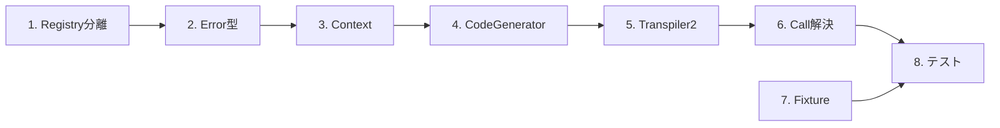

# 実装タスク

## 概要

- **フィーチャー**: transpiler2-layer-implementation
- **メジャータスク**: 8
- **サブタスク**: 27
- **推定総工数**: 9日
- **要件カバレッジ**: 全16要件（Req 1〜15、Req 9b含む）

---

## タスク一覧

### 1. 共有レジストリモジュールの分離

- [ ] 1.1 (P) SceneRegistryを新規registryモジュールに移動
  - transpiler内のSceneRegistry関連コードを`src/registry/scene_registry.rs`に抽出
  - 公開APIを維持しながらモジュール境界を分離
  - transpilerからのimportパスを`crate::registry::SceneRegistry`に変更
  - _Requirements: 1_

- [ ] 1.2 (P) WordDefRegistryを新規registryモジュールに移動
  - transpiler内のWordDefRegistry関連コードを`src/registry/word_registry.rs`に抽出
  - 単語検索・登録機能の独立性を確認
  - transpilerからのimportパスを`crate::registry::WordDefRegistry`に変更
  - _Requirements: 1, 4, 15_

- [ ] 1.3 registryモジュールのAPI整備と公開
  - `src/registry/mod.rs`で公開APIを定義
  - `lib.rs`から`pub mod registry;`として公開
  - 既存transpilerのテストがパスすることを確認
  - _Requirements: 1_

---

### 2. エラー型定義

- [ ] 2. (P) TranspileError型の定義
  - `src/transpiler2/error.rs`を作成
  - thiserrorマクロで5種類のエラーバリアント定義（InvalidAst, UndefinedSymbol, InvalidContinuation, IoError, InternalError）
  - Span情報からエラー位置を抽出するヘルパー関数実装
  - _Requirements: 8_

---

### 3. 変換コンテキスト実装

- [ ] 3.1 TranspileContext2の基本構造定義
  - ローカル/グローバル関数リスト管理
  - 現在のモジュール名追跡
  - ファイルレベル属性の積算HashMap管理
  - _Requirements: 4, 5_

- [ ] 3.2 属性マージ機能の実装
  - `accumulate_file_attr()`でFileAttrを順次処理（後書き優先）
  - `merge_attrs()`でFile属性とScene属性をマージ（Scene優先）
  - 属性値のAttrValue型変換
  - _Requirements: 11, 12_

- [ ] 3.3 シンボル解決機能の実装
  - `resolve_function()`でLocal→Global順序で関数名探索
  - 未定義シンボル検出時のTranspileError生成
  - スコープ別の探索ロジック（ローカル/グローバル/stdlib）
  - _Requirements: 4, 6_

---

### 4. コード生成器の実装

- [ ] 4.1 CodeGenerator基本構造の実装
  - Writerへの出力抽象化
  - TranspileContext2との連携
  - インデント管理ユーティリティ
  - _Requirements: 2, 9_

- [ ] 4.2 グローバルシーン生成機能
  - GlobalScopeScopeからRune modブロック生成
  - SceneRegistryへのシーン登録
  - 属性マージ結果をregister_globalに渡す
  - code_blocksのバッファリング（末尾一括出力用）
  - _Requirements: 2, 9b, 11, 12, 13_

- [ ] 4.3 ローカルシーン生成機能
  - LocalSceneScopeからRune関数生成
  - 名前なしシーンは`__start__`関数として出力
  - 名前付きシーンは`name_N`形式で連番付与
  - SceneRegistryへのローカルシーン登録
  - code_blocksのインライン出力
  - _Requirements: 2, 12, 13_

- [ ] 4.4 ActionLine処理の実装
  - actor変更の`yield change_speaker()`生成
  - Action::Talkの`yield Talk()`生成
  - Action::VarRefのテンプレート文字列展開
  - Action::Escapeの2文字目抽出処理
  - _Requirements: 7, 14_

- [ ] 4.5 ContinueAction連結処理
  - 直前のActionLine検出と連結ロジック
  - 先頭ContinueActionのInvalidContinuationエラー
  - actor継承の暗黙的処理（追加出力なし）
  - _Requirements: 14_

- [ ] 4.6 WordRef・FnCall展開処理
  - Action::WordRefを`pasta_stdlib::word()`呼び出しに展開
  - Action::FnCallをfor-in-yieldパターンに展開
  - ローカル/グローバル関数の呼び出し形式切り替え（`super::`プレフィックス）
  - _Requirements: 6, 7_

- [ ] 4.7 SakuraScript・CodeBlock処理
  - Action::SakuraScriptを`emit_sakura_script()`呼び出しに変換
  - CodeBlockのインデント調整出力（構文検証なし）
  - GlobalScope末尾出力 vs LocalScopeインライン出力の分岐
  - _Requirements: 7, 13_

- [ ] 4.8 変数スコープ処理の実装
  - VarSetのRune代入文生成（`ctx.local.var = expr;`）
  - ローカル変数（`$var`）のRune変数変換
  - グローバル変数（`$*var`）の共有状態アクセス生成
  - システム変数（`$**var`）のマーカー付与
  - _Requirements: 5_

- [ ] 4.9 式評価とCall処理
  - 整数・浮動小数点・文字列リテラルの変換
  - 二項演算式のRune式変換
  - CallSceneの`pasta::call()`生成とfor-in-yield展開
  - _Requirements: 3, 6_

---

### 5. Transpiler2メインモジュール

- [ ] 5.1 2パス変換アーキテクチャの実装
  - `transpile_pass1()`でFileItem逐次処理（登録+モジュール生成）
  - `transpile_pass2()`でセレクタ・ラッパー生成
  - Phase1エラー時のPhase2スキップ
  - _Requirements: 9b_

- [ ] 5.2 FileItem処理ループ
  - FileItem::FileAttrの属性積算処理
  - FileItem::GlobalWordのWordDefRegistry登録（Phase1先行）
  - FileItem::GlobalSceneScopeのモジュール生成とシーン登録
  - _Requirements: 4, 11, 15_

- [ ] 5.3 公開API整備
  - `transpile_str()`でソースコード文字列から変換
  - `transpile_file()`でファイルパスから変換
  - `transpile_to_string()`でテスト用簡易変換
  - lib.rsからの`pub mod transpiler2;`公開
  - _Requirements: 1, 9_

---

### 6. シーン呼び出し解決

- [ ] 6.1 Call文のシーン名解決
  - CallSceneからシーン名抽出
  - ローカルシーン（同一mod内）と外部シーン（グローバル）の区別
  - 未定義シーン参照のTranspileError生成
  - _Requirements: 3, 4_

- [ ] 6.2 重複シーンのランダム選択メカニズム
  - 同名シーン定義の検出とID複数登録
  - scene_selector関数での候補シャッフル
  - pasta::call()ラッパーでの選択実行
  - _Requirements: 3_

---

### 7. テストフィクスチャ作成

- [ ] 7.1 (P) 基本シーン変換テストフィクスチャ
  - `tests/fixtures/transpiler2/simple_scene.pasta`作成
  - `tests/fixtures/transpiler2/multi_scene.pasta`作成
  - `tests/fixtures/transpiler2/nested_scene.pasta`作成
  - _Requirements: 10_

- [ ] 7.2 (P) Action処理テストフィクスチャ
  - `tests/fixtures/transpiler2/all_actions.pasta`作成（全Action型網羅）
  - `tests/fixtures/transpiler2/continue_lines.pasta`作成
  - `tests/fixtures/transpiler2/variable_scope.pasta`作成
  - _Requirements: 10_

- [ ] 7.3 (P) 高度機能テストフィクスチャ
  - `tests/fixtures/transpiler2/attribute_inheritance.pasta`作成
  - `tests/fixtures/transpiler2/code_blocks.pasta`作成
  - `tests/fixtures/transpiler2/word_definitions.pasta`作成
  - _Requirements: 10, 11, 13, 15_

---

### 8. テスト実装と統合検証

- [ ] 8.1 単体テスト実装
  - `tests/pasta_transpiler2_unit_test.rs`作成
  - TranspileContext2のmerge_attrs()テスト
  - CodeGeneratorの各generate_*メソッドテスト
  - TranspileError生成パターンテスト
  - _Requirements: 8, 10_

- [ ] 8.2 統合テスト実装
  - `tests/pasta_transpiler2_integration_test.rs`作成
  - Pass1→Pass2の完全フロー検証
  - 複数ファイル・複数シーン登録テスト
  - 属性継承パターンの網羅テスト
  - _Requirements: 9b, 10, 11, 12_

- [ ] 8.3 E2Eテスト実装
  - `tests/pasta_transpiler2_e2e_test.rs`作成
  - 生成RuneコードのVM実行検証
  - Runtime層（ScriptGenerator）との統合動作確認
  - parser2フィクスチャ流用テスト
  - _Requirements: 9, 10_

- [ ] 8.4 エラーケーステスト
  - 未定義シーン参照エラーの検証
  - 未定義単語参照エラーの検証
  - 先頭ContinueActionエラーの検証
  - 無効AST構造エラーの検証
  - _Requirements: 3, 4, 8, 14_

---

## 依存関係グラフ

---

## 並列実行可能タスク

以下のタスクグループは並列実行可能:

| グループ | タスク | 理由 |
|---------|--------|------|
| A | 1.1, 1.2 | 異なるRegistry、ファイル競合なし |
| B | 2, 7.1, 7.2, 7.3 | 独立モジュール、Fixtureは他に依存しない |
| C | 8.1, 8.2, 8.3, 8.4 | テストファイル分離、検証対象独立 |

---

## 要件マッピング

| 要件ID | タスク |
|--------|--------|
| 1 | 1.1, 1.2, 1.3, 5.3 |
| 2 | 4.1, 4.2, 4.3 |
| 3 | 4.9, 6.1, 6.2, 8.4 |
| 4 | 1.2, 3.1, 3.3, 5.2, 6.1, 8.4 |
| 5 | 3.1, 4.8 |
| 6 | 3.3, 4.6, 4.9 |
| 7 | 4.4, 4.6, 4.7 |
| 8 | 2, 8.1, 8.4 |
| 9 | 4.1, 5.3, 8.3 |
| 9b | 4.2, 5.1, 8.2 |
| 10 | 7.1, 7.2, 7.3, 8.1, 8.2, 8.3, 8.4 |
| 11 | 3.2, 4.2, 5.2, 7.3, 8.2 |
| 12 | 3.2, 4.2, 4.3, 8.2 |
| 13 | 4.2, 4.3, 4.7, 7.3 |
| 14 | 4.4, 4.5, 8.4 |
| 15 | 1.2, 5.2, 7.3 |
