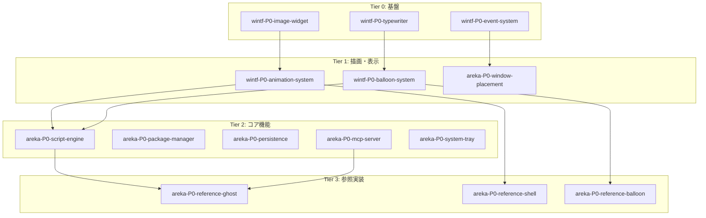

# ROADMAP - ukagaka-desktop-mascot

> 最終更新: 2025-12-10

---

## Current Focus

🎯 **現在取り組むべき仕様**: Tier 0 残り仕様 または Tier 1 解放済み仕様

### 推奨: 次のアクション
1. Tier 0 残り（event-system 継続 / typewriter）から1つ選定
2. または Tier 1 の animation-system（image-widget 完了で解放済み）
3. 選定した仕様の要件承認 → 設計 → タスク → 実装

**並行実行可能**: Tier 0 の仕様は相互依存がないため、並行して進められます

---

## Progress Summary

| Status | Count | 割合 |
|--------|-------|------|
| 🟢 Completed | 5 | 16% |
| 🔵 In Progress | 1 | 3% |
| ⚪ Not Started | 26 | 81% |
| **Total** | **32** | 100% |

---

## Active Specifications (P0)

### Tier 依存関係図

### P0 実行計画

| Tier | Spec | Phase | Parallel | Dependencies |
|------|------|-------|----------|--------------|
| 0 | `wintf-P0-image-widget` | 🟢 completed | ○ | - |
| 0 | `wintf-P0-event-system` | 🔵 in-progress | ○ | - |
| 0 | `wintf-P0-typewriter` | ⚪ requirements-draft | ○ | - |
| 1 | `wintf-P0-animation-system` | ⚪ requirements-draft | ○ | ✅ image-widget |
| 1 | `wintf-P0-balloon-system` | ⚪ requirements-draft | ○ | typewriter |
| 1 | `areka-P0-window-placement` | ⚪ requirements-draft | ○ | event-system |
| 2 | `areka-P0-script-engine` | 🟢 completed | - | animation, balloon |
| 2 | `areka-P0-package-manager` | ⚪ requirements-draft | ○ | - |
| 2 | `areka-P0-persistence` | ⚪ requirements-draft | ○ | - |
| 2 | `areka-P0-mcp-server` | ⚪ requirements-draft | ○ | - |
| 2 | `areka-P0-system-tray` | ⚪ requirements-draft | ○ | - |
| 3 | `areka-P0-reference-ghost` | ⚪ requirements-draft | - | script-engine, mcp-server |
| 3 | `areka-P0-reference-shell` | ⚪ requirements-draft | ○ | animation-system |
| 3 | `areka-P0-reference-balloon` | ⚪ requirements-draft | ○ | balloon-system |

### event-system 子仕様進捗

| Spec | Phase | Description |
|------|-------|-------------|
| `event-hit-test` | 🟢 completed | ヒットテストAPI |
| `event-hit-test-cache` | 🟢 completed | ヒットテストキャッシュ |
| `event-mouse-basic` | 🟢 completed | マウス入力ECS統合 |
| `event-parent-to-child-routing` | 🟢 completed | Tunnelフェーズデモ実装 |
| `event-dispatch` | ⚪ not-started | イベントバブリング・キャプチャ |
| `event-drag-system` | ⚪ not-started | ドラッグ＆ドロップ |

**凡例**:
- Phase: ⚪ not-started / 🔵 in-progress / 🟢 completed
- Parallel: ○ = 同一 Tier 内で並行実行可能

---

## Backlog (P1-P3)

### P1: リリース必須

| Spec | Description | Parent Req | Tier |
|------|-------------|------------|------|
| `wintf-P1-image-rendering` | 画像描画オプション（ストレッチ、切り抜き、補間） | 1.1 | 1 |
| `wintf-P1-clickthrough` | 透過領域クリックスルー | 1.6, NFR-3 | 0 |
| `wintf-P1-dpi-scaling` | DPI対応、Per-Monitor DPI | 15.1-15.5 | 1 |
| `areka-P1-timer-events` | タイマー、システムイベント | 6.1-6.8 | 4 |
| `areka-P1-devtools` | デバッグ、ホットリロード | 12.1-12.7, 28.1-28.10 | 4 |
| `areka-P1-legacy-converter` | フォーマット変換 | 11.1-11.6, 29.1-29.11 | 4 |
| `areka-P1-error-recovery` | クラッシュログ、状態復元 | 30.1-30.10 | 2 |
| `areka-P1-character-communication` | キャラクター間会話 | 26.1-26.37 | 4 |

### P2: 差別化

| Spec | Description | Parent Req | Tier |
|------|-------------|------------|------|
| `areka-P2-llm-integration` | LLMバックエンド | 18.1-18.7 | 5 |
| `areka-P2-voice-synthesis` | 音声合成 | 19.* | 5 |
| `areka-P2-voice-recognition` | 音声認識 | 19.* | 5 |
| `areka-P2-web-integration` | Web連携 | 22.* | 5 |
| `areka-P2-plugin-system` | プラグイン | - | 4 |

### P3: 将来

| Spec | Description | Parent Req | Tier |
|------|-------------|------------|------|
| `areka-P3-calendar-integration` | カレンダー連携 | 21.* | 6 |
| `areka-P3-media-player` | メディア再生 | - | 6 |
| `areka-P3-clipboard-history` | クリップボード履歴 | - | 6 |
| `areka-P3-automation` | 自動化 | - | 6 |
| `areka-P3-accessibility` | アクセシビリティ | NFR-6 | 6 |

---

## Requirements Mapping

親仕様の主要要件と子仕様の対応関係。

| Parent Req | Summary | Child Specs |
|------------|---------|-------------|
| 1 | キャラクター表示基盤 | image-widget, window-placement, clickthrough |
| 2 | アニメーション | animation-system, image-widget, reference-shell |
| 3 | バルーンシステム | balloon-system, typewriter, reference-balloon |
| 4 | 対話エンジン | script-engine, reference-ghost, llm-integration |
| 5 | ユーザー入力 | event-system |
| 6 | 時間・イベント | timer-events |
| 7 | ゴースト管理 | package-manager |
| 8 | シェル/バルーン管理 | package-manager, reference-shell |
| 9 | 設定・状態 | persistence |
| 10 | MCP通信 | mcp-server |
| 11 | 互換性 | legacy-converter |
| 12 | 開発支援 | devtools |
| 13 | システムトレイ | system-tray |
| NFR | 非機能要件 | clickthrough, dpi-scaling, privacy-security, accessibility |

---

## Update History

| Date | Update |
|------|--------|
| 2025-12-08 | **event-parent-to-child-routing 完了** - Tunnelフェーズデモ実装、GreenBoxChild追加、階層的キャプチャ実証 |
| 2025-12-03 | **event-hit-test-cache 完了** - スレッドローカルキャッシュ、WM_NCHITTEST最適化、try_tick_world連動クリア |
| 2025-12-03 | **event-mouse-basic 完了** - マウス入力ECS統合、MouseState/MouseLeave実装、hit_test統合 |
| 2025-11-30 | **wintf-P0-image-widget 完了** - BitmapSource実装、completed/ へ移動 |
| 2025-11-29 | wintf-P1-image-rendering を P1 backlog に追加（P0 image-widget から分離） |
| 2025-11-29 | kiro-P0-roadmap-management 完了、P1-P3 を backlog に移動 |
| 2025-11-29 | 初版作成（32子仕様、全 requirements-draft） |
