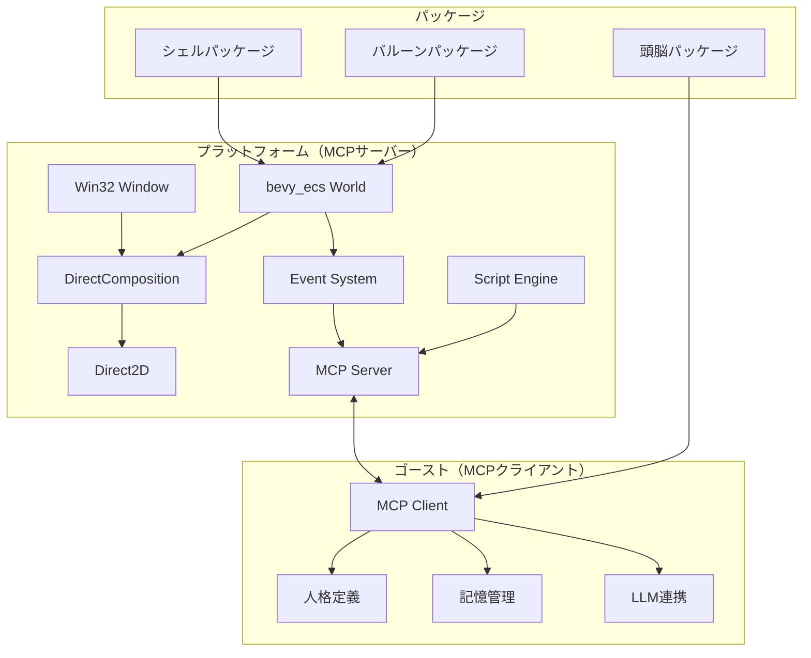
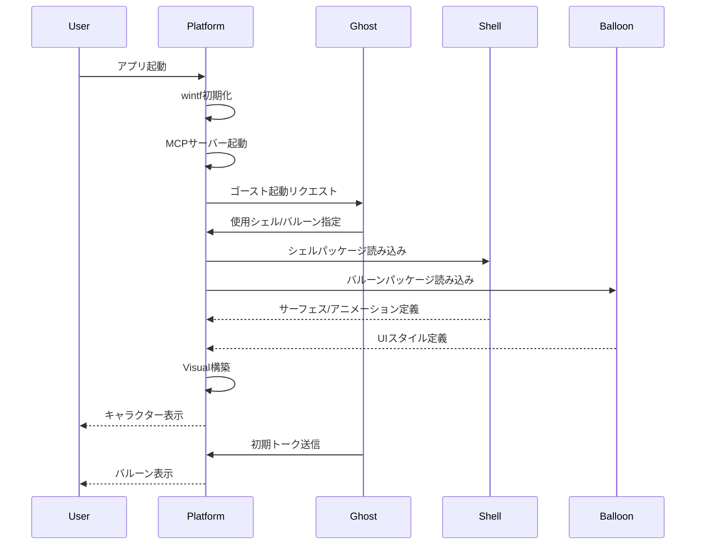
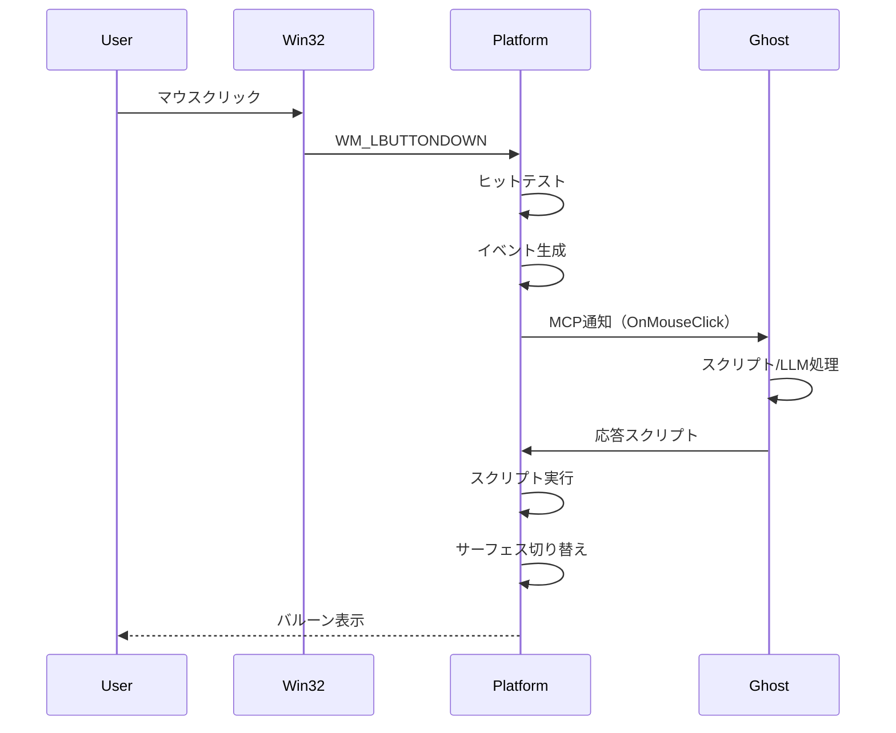
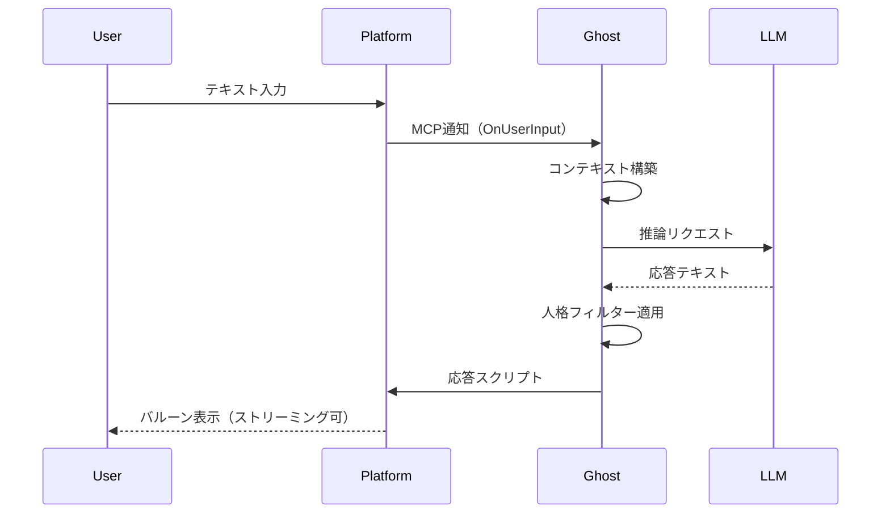
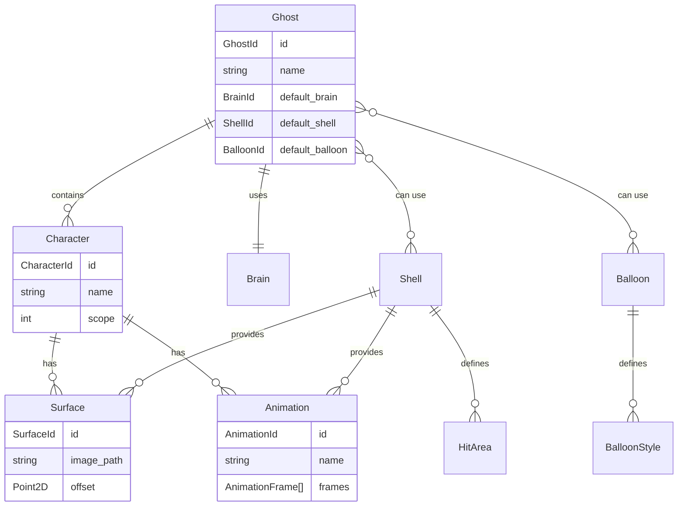

# Technical Design Document

| 項目 | 内容 |
|------|------|
| **Document Title** | 伺的デスクトップマスコットアプリ アーキテクチャ設計書 |
| **Version** | 2.0 |
| **Date** | 2025-11-29 |
| **Requirements Version** | 1.0 |

---

## Overview

### Purpose

本設計書は、Windowsデスクトップ上で動作する伺的マスコットアプリケーション「areka」のメタアーキテクチャを定義する。本仕様の目的は**全31要件＋NFR-6を子仕様に分解**し、今後数か月〜年単位の開発を駆動可能なロードマップを構築することである。

本仕様は「メタ仕様」であり、直接プログラムコードに落とし込むものではない。各要件に対応する子仕様を段階的に作成・実装することで全体を実現する。

### Users

- **エンドユーザー**: デスクトップマスコットを楽しむ一般ユーザー
- **ゴースト制作者**: 頭脳（スクリプト/LLM人格）を制作するコミュニティ
- **シェル制作者**: キャラクター外見（画像/アニメーション）を制作するアーティスト
- **バルーン制作者**: 会話UIスタイルをデザインするデザイナー
- **プラットフォーム開発者**: wintf/arekaの開発・保守を行う開発者

### Impact

- wintfフレームワークに複数の拡張仕様を追加
- arekaアプリケーション層を新規構築
- 25個の子仕様を管理するメタ仕様として機能

### Goals

- **全要件カバレッジ**: 31要件＋NFR-6を漏れなく子仕様にマッピング
- **段階的実現**: P0（MVP）→ P1 → P2 → P3 の優先度で実装
- **責務分離**: プラットフォーム/ゴースト/パッケージの3層アーキテクチャ
- **長期駆動**: 年単位の開発ロードマップを提供

### Non-Goals

- 本仕様からの直接実装（子仕様を経由）
- SHIORI DLL完全互換（SSPに委譲）
- 32bit Windows対応
- コンテンツの国際化・アクセシビリティ強制（作者責務）

### Implementation Prerequisites

本プロジェクトはwintfフレームワークを基盤とするが、以下の機能はwintfに未実装であり、MVP実装の前提条件として先行実装が必要：

| 優先度 | 機能 | 現状 | 必要な実装 |
|--------|------|------|-----------|
| P0 | Image widget | 未実装 | WIC画像読み込み、D2D描画、透過PNG対応 |
| P0 | アニメーション画像 | 未実装 | GIF/WebPフレーム抽出、タイマー駆動再生 |
| P0 | イベントシステム | 設計のみ | ヒットテスト、マウスイベント配信 |
| P0 | ドラッグ移動 | 未実装 | キャラクターウィンドウのドラッグ移動 |
| P0 | タイプライター表示 | 未対応 | 文字単位の表示制御（現Labelの大幅拡張） |
| P1 | クリックスルー | 未実装 | 透過領域のWM_NCHITTESTハンドリング |
| P1? | Windows Animation API | 未実装 | DirectComposition統合、プロパティアニメーション |
| ✅ | マルチモニタDPI | ほぼ完成 | 追加作業不要 |

**アニメーション画像フォーマット**:
- GIF: WIC標準対応、フレーム抽出可能
- WebP: Windows 10以降WIC対応、アニメーション可能
- APNG: WIC標準非対応（非採用）

**Windows Animation API**:
DirectCompositionとの統合で以下が可能になる：
- プロパティアニメーション（位置、不透明度、スケール等）
- イージング関数（ease-in/out等）
- GPUアクセラレーション

MVP必須かは不明瞭だが、wintfの基盤レベルで必要になる可能性が高い。

**実装順序**:
1. wintf: Image widget + アニメーション画像（SurfaceRendererの前提）
2. wintf: イベントシステム + ドラッグ（EventDispatcherの前提）
3. wintf: タイプライター表示（BalloonRendererの前提）
4. wintf: Windows Animation API統合（必要に応じて）
5. 本プロジェクト: SurfaceRenderer, EventDispatcher, etc.

### MCP採用方針

**決定**: MCPを採用する（rmcp優先、必要に応じて独自実装へフォールバック）

**根拠**:
- MCPの本質は「JSON-RPCの亜種」であり、仕様変更への追従コストは許容範囲
- SHIORI/SSTPが25年前に同等の概念を実現しており、技術的に枯れた領域
- LLMとの連携（頭脳パッケージ）を考慮すると、MCP準拠が将来的に有利
- 「MCPを無視する積極的理由がない」

**実装戦略**:
1. rmcpで基本実装を試行
2. 問題があれば、MCPサブセットを独自JSON-RPCで実装
3. いずれの場合も、MCPメッセージ形式（JSON-RPC 2.0ベース）は維持

---

## Child Specifications Architecture

本設計の中核は「全要件を子仕様に分解」することである。以下に子仕様の完全なリストとそのカバー範囲を示す。

### 命名規則

子仕様の識別子は以下のパターンに従う：

```
{layer}-{priority}-{feature}
```

| 要素 | 説明 | 例 |
|------|------|---|
| layer | 対象レイヤー（wintf / areka / kiro） | wintf, areka |
| priority | 優先度（P0〜P3） | P0, P1 |
| feature | 機能名（ケバブケース） | image-widget, reference-ghost |

**例**: `wintf-P0-image-widget`, `areka-P1-timer-events`, `kiro-P0-roadmap-management`

**目的**: 優先度による絞り込み・ソート・一覧取得を容易にする。

### 子仕様一覧（全31件）

#### 既存子仕様（作成済み: 8件）

| 仕様名 | 対象要件 | 優先度 | 説明 | 状態 |
|--------|---------|--------|------|------|
| `wintf-P0-image-widget` | 1.1, 1.3, 2.4 | P0 | WIC画像読み込み、D2D描画、GIF/WebPアニメ | requirements-draft |
| `wintf-P0-event-system` | 5.1, 5.2, 5.3, 5.8 | P0 | ヒットテスト、マウスイベント、ドラッグ | requirements-draft |
| `wintf-P0-typewriter` | 3.5, 4.7 | P0 | 文字単位表示、ウェイト制御 | requirements-draft |
| `wintf-P1-clickthrough` | 1.6, NFR-3 | P1 | 透過領域クリックスルー、WM_NCHITTEST | requirements-draft |
| `areka-P0-reference-ghost` | 4.1-4.6, 26.1-26.3 | P0 | 参照ゴースト、里々DSL、MCP通信 | requirements-draft |
| `areka-P0-reference-shell` | 2.2, 2.7, 8.1, 8.3, 27.10-27.13 | P0 | 参照シェル、サーフェス、アニメ定義 | requirements-draft |
| `areka-P0-reference-balloon` | 3.4, 3.6, 27.15, 27.16 | P0 | 参照バルーン、縦書き/横書き | requirements-draft |
| `areka-P0-window-placement` | 1.4, 1.5, 1.7, 9.3, 16.6 | P0 | 配置、タスクバー張り付き、マルチモニター | requirements-draft |

#### 追加必要な子仕様（23件）

| 仕様名 | 対象要件 | 優先度 | 説明 |
|--------|---------|--------|------|
| `wintf-P0-animation-system` | 2.1-2.8 | P0 | フレームアニメ、トランジション、連動アニメ |
| `wintf-P0-balloon-system` | 3.1-3.10 | P0 | バルーンウィンドウ、選択肢UI、ルビ |
| `wintf-P1-dpi-scaling` | 15.1-15.5, NFR-1 | P1 | DPI対応、Per-Monitor DPI |
| `areka-P0-script-engine` | 4.1-4.10, 29.6-29.8 | P0 | DSL解析、変数、制御構文、さくらスクリプト互換 |
| `areka-P1-timer-events` | 6.1-6.8 | P1 | タイマー、システムイベント、スリープ復帰 |
| `areka-P0-package-manager` | 7.1-7.7, 8.1-8.5, 27.1-27.27, 31.1-31.9 | P0 | パッケージ管理、マニフェスト、メタ情報 |
| `areka-P0-persistence` | 9.1-9.6, 30.6-30.8 | P0 | 設定、状態保存、自動保存 |
| `areka-P0-mcp-server` | 10.1-10.5, 26.11-26.15 | P0 | MCP基盤、ツール、ゴースト間通信媒介 |
| `areka-P1-legacy-converter` | 11.1-11.6, 29.1-29.11 | P1 | フォーマット変換、互換プロトコル |
| `areka-P1-devtools` | 12.1-12.7, 28.1-28.10 | P1 | デバッグ、ホットリロード、イベントシミュレータ |
| `areka-P0-system-tray` | 13.1-13.5 | P0 | システムトレイ常駐、自動起動 |
| `areka-P2-presence-style` | 16.1-16.7 | P2 | 存在スタイル（控えめ〜活発）、フルスクリーン検出 |
| `areka-P2-memory-system` | 17.1-17.8 | P2 | 会話履歴、記憶、成長、RAG |
| `areka-P2-llm-integration` | 18.1-18.7, 26.7-26.10, 26.16-26.20 | P2 | LLMバックエンド、キャラ間LLM会話 |
| `areka-P3-voice-system` | 19.1-19.8 | P3 | TTS/STT、音声対話、ウェイクワード |
| `areka-P3-screen-awareness` | 20.1-20.8 | P3 | 画面認識、アクティブウィンドウ、離席検出 |
| `areka-P3-environment-sense` | 21.1-21.7, 22.1-22.7 | P3 | 外部連携、天気、季節、環境認識 |
| `areka-P3-cloud-sync` | 23.1-23.6 | P3 | マルチデバイス同期、エクスポート/インポート |
| `areka-P2-creator-tools` | 24.1-24.8 | P2 | 創作支援、テンプレート、AI人格生成 |
| `areka-P2-privacy-security` | 25.1-25.5, NFR-3 | P2 | プライバシー、暗号化、ローカルファースト |
| `areka-P1-character-communication` | 26.1-26.37 | P1 | キャラクター間会話（スクリプト/LLM/物理） |
| `areka-P3-ide-integration` | 28.11-28.20 | P3 | DAP/LSPサーバー、VS Code連携 |
| `areka-P1-error-recovery` | 30.1-30.10 | P1 | クラッシュログ、状態復元 |

### 優先度とTierの定義

#### 優先度 (P0-P3): ビジネス/プロダクト観点

| 優先度 | 名称 | 定義 | 判断基準 |
|--------|------|------|----------|
| **P0** | MVP必須 | 内作における実装試作に必要 | 「2体キャラクター掛け合い会話」の最小実現 |
| **P1** | リリース必須 | arekaの外部公開に必要 | 製品品質（安定性、互換性、開発支援） |
| **P2** | 差別化 | 競合優位性を生む機能 | 独自価値の創出（LLM、記憶、プライバシー） |
| **P3** | 将来 | 長期ロードマップ | 市場反応を見て判断（音声、画面認識等） |

#### Tier (0-6): 技術的な依存関係

| Tier | 定義 | 特徴 |
|------|------|------|
| **Tier 0** | 基盤 | 他に依存しない、最初に実装可能 |
| **Tier 1-2** | コア | Tier 0に依存、描画・表示・スクリプト |
| **Tier 3** | 参照実装 | コア機能を使った具体例 |
| **Tier 4-6** | 拡張 | 高度機能、オプション |

#### 実装順序ルール

1. **優先度で大枠を決定**: P0 → P1 → P2 → P3
2. **Tier で詳細順序を決定**: 同一優先度内で Tier 0 → 1 → 2 → ...
3. **並行実装**: 依存関係がなければ同一Tier内は並行可能
4. **例外**: P1のTier 0（wintf-P1-clickthrough等）はP0と並行して着手可能

### 優先度別ロードマップ

```
P0 (MVP) - 内作実装試作に必須
├── wintf-P0-image-widget
├── wintf-P0-event-system
├── wintf-P0-typewriter
├── wintf-P0-animation-system
├── wintf-P0-balloon-system
├── areka-P0-window-placement
├── areka-P0-script-engine
├── areka-P0-package-manager
├── areka-P0-persistence
├── areka-P0-mcp-server
├── areka-P0-system-tray
├── areka-P0-reference-ghost
├── areka-P0-reference-shell
└── areka-P0-reference-balloon

P1 (リリース必須) - 外部公開に必要
├── wintf-P1-clickthrough
├── wintf-P1-dpi-scaling
├── areka-P1-timer-events
├── areka-P1-legacy-converter
├── areka-P1-devtools
├── areka-P1-character-communication
└── areka-P1-error-recovery

P2 (差別化) - 競合優位性を生む機能
├── areka-P2-presence-style
├── areka-P2-memory-system
├── areka-P2-llm-integration
├── areka-P2-creator-tools
└── areka-P2-privacy-security

P3 (将来拡張) - 長期的なビジョン
├── areka-P3-voice-system
├── areka-P3-screen-awareness
├── areka-P3-environment-sense
├── areka-P3-cloud-sync
└── areka-P3-ide-integration
```

### 依存関係階層

```
Tier 0 (基盤)
├── wintf-P0-image-widget
├── wintf-P0-event-system
├── wintf-P0-typewriter
└── wintf-P1-clickthrough

Tier 1 (描画・表示)
├── wintf-P0-animation-system (← Tier 0)
├── wintf-P0-balloon-system (← wintf-P0-typewriter)
├── wintf-P1-dpi-scaling (← Tier 0)
└── areka-P0-window-placement (← wintf-P0-event-system)

Tier 2 (コア機能)
├── areka-P0-script-engine (← Tier 1)
├── areka-P0-package-manager (独立)
├── areka-P0-persistence (独立)
├── areka-P0-mcp-server (独立)
├── areka-P0-system-tray (独立)
└── areka-P1-error-recovery (独立)

Tier 3 (参照実装)
├── areka-P0-reference-ghost (← areka-P0-script-engine, areka-P0-mcp-server)
├── areka-P0-reference-shell (← wintf-P0-animation-system)
└── areka-P0-reference-balloon (← wintf-P0-balloon-system)

Tier 4 (高度機能)
├── areka-P1-timer-events (← areka-P0-mcp-server)
├── areka-P1-devtools (← areka-P0-script-engine)
├── areka-P1-legacy-converter (独立)
├── areka-P2-presence-style (← areka-P0-mcp-server)
├── areka-P1-character-communication (← areka-P0-mcp-server)
└── areka-P2-privacy-security (← areka-P0-persistence)

Tier 5 (拡張機能)
├── areka-P2-memory-system (← areka-P0-persistence)
├── areka-P2-llm-integration (← areka-P0-mcp-server)
├── areka-P2-creator-tools (← areka-P0-package-manager)
└── areka-P3-ide-integration (← areka-P1-devtools)

Tier 6 (将来機能)
├── areka-P3-voice-system (← areka-P2-llm-integration)
├── areka-P3-screen-awareness (← areka-P0-mcp-server)
├── areka-P3-environment-sense (← areka-P0-mcp-server)
└── areka-P3-cloud-sync (← areka-P0-persistence)
```

---

## Requirements Traceability

全31要件＋NFR-6の子仕様へのマッピングを示す。

### 完全トレーサビリティマトリクス

| Req | 要件名 | 子仕様 | カバー状況 |
|-----|--------|--------|-----------|
| 1 | キャラクター表示基盤 | wintf-P0-image-widget, areka-P0-window-placement, wintf-P1-clickthrough | 全項目 |
| 2 | アニメーション | wintf-P0-animation-system, wintf-P0-image-widget, areka-P0-reference-shell | 全項目 |
| 3 | バルーンシステム | wintf-P0-balloon-system, wintf-P0-typewriter, areka-P0-reference-balloon | 全項目 |
| 4 | 対話エンジン | areka-P0-script-engine, areka-P0-reference-ghost, areka-P2-llm-integration | 全項目 |
| 5 | ユーザー入力 | wintf-P0-event-system | 全項目 |
| 6 | 時間・イベント | areka-P1-timer-events | 全項目 |
| 7 | ゴースト管理 | areka-P0-package-manager | 全項目 |
| 8 | シェル管理 | areka-P0-package-manager, areka-P0-reference-shell | 全項目 |
| 9 | 設定・永続化 | areka-P0-persistence, areka-P0-window-placement | 全項目 |
| 10 | 通信・連携 | areka-P0-mcp-server | 全項目 |
| 11 | レガシー資産 | areka-P1-legacy-converter | 全項目 |
| 12 | 開発者機能 | areka-P1-devtools | 全項目 |
| 13 | システムトレイ | areka-P0-system-tray | 全項目 |
| 14 | パフォーマンス | (各仕様に分散、NFR-6) | 全項目 |
| 15 | 表示環境適応 | wintf-P1-dpi-scaling | 全項目 |
| 16 | 存在スタイル | areka-P2-presence-style, areka-P0-window-placement | 全項目 |
| 17 | 記憶と成長 | areka-P2-memory-system | 全項目 |
| 18 | ローカルAI | areka-P2-llm-integration | 全項目 |
| 19 | 音声対話 | areka-P3-voice-system | 全項目 |
| 20 | 画面認識 | areka-P3-screen-awareness | 全項目 |
| 21 | 世界との繋がり | areka-P3-environment-sense | 全項目 |
| 22 | 環境認識 | areka-P3-environment-sense | 全項目 |
| 23 | マルチデバイス | areka-P3-cloud-sync | 全項目 |
| 24 | 創作エコシステム | areka-P2-creator-tools | 全項目 |
| 25 | プライバシー | areka-P2-privacy-security | 全項目 |
| 26 | キャラクター間通信 | areka-P1-character-communication, areka-P0-reference-ghost, areka-P2-llm-integration | 全項目 |
| 27 | パッケージアーキテクチャ | areka-P0-package-manager | 全項目 |
| 28 | 開発者体験 | areka-P1-devtools, areka-P3-ide-integration | 全項目 |
| 29 | 互換性・マイグレーション | areka-P1-legacy-converter | 全項目 |
| 30 | エラーハンドリング | areka-P1-error-recovery | 全項目 |
| 31 | コンテンツメタ情報 | areka-P0-package-manager | 全項目 |
| NFR-1 | 互換性 | wintf-P1-dpi-scaling, (全般) | 全項目 |
| NFR-2 | 拡張性 | areka-P0-mcp-server, (プラグイン設計) | 全項目 |
| NFR-3 | セキュリティ | areka-P2-privacy-security, wintf-P1-clickthrough | 全項目 |
| NFR-4 | ドキュメント | (各仕様に付随) | 全項目 |
| NFR-5 | 国際化 | (リソース設計) | 全項目 |
| NFR-6 | パフォーマンス | (各仕様のパフォーマンス目標) | 全項目 |

---

### Existing Architecture Analysis

**wintfフレームワーク現状**:

| レイヤー | 現状 | 本プロジェクトでの拡張 |
|---------|------|----------------------|
| ECS基盤 | bevy_ecs 0.17.2 | そのまま活用 |
| レイアウト | taffy統合済み | DPI/マルチモニター対応強化 |
| 描画 | DirectComposition + D2D | サーフェス切り替え、アニメーション追加 |
| テキスト | DirectWrite（縦書き対応） | バルーンレンダリング拡張 |
| ウィジェット | Rectangle, Label | **Image追加必須** |
| イベント | 設計のみ | **完全実装必須** |
| ウィンドウ | Win32、マルチウィンドウ | クリックスルー対応 |

**設計ドキュメント参照**:
- `doc/spec/01-ecs-components.md` — ECSコンポーネント設計
- `doc/spec/06-visual-directcomp.md` — DirectComposition統合
- `doc/spec/08-event-system.md` — イベントシステム設計

### Architecture Pattern & Boundary Map

**選定パターン**: ECS + MCPハイブリッドアーキテクチャ



**Architecture Integration**:

| 項目 | 決定 |
|------|------|
| **選定パターン** | ECS + MCP（research.md参照） |
| **ドメイン境界** | プラットフォーム/ゴースト/パッケージの3層 |
| **既存パターン維持** | wintfのComponent/System分離、Visual/Layout分離 |
| **新規コンポーネント** | MCPServer、ScriptEngine、ImageSurface、Animation |
| **steering準拠** | tech.md記載のRust/DirectComposition/bevy_ecs採用 |

### Technology Stack

| Layer | Choice / Version | Role in Feature | Notes |
|-------|------------------|-----------------|-------|
| Language | Rust 2021 Edition | 全コンポーネント | 型安全性、メモリ安全性 |
| ECS | bevy_ecs 0.17.2 | UIエンティティ管理 | wintf既存 |
| Layout | taffy 0.9.1 | Flexboxレイアウト | wintf既存 |
| Graphics | DirectComposition | 合成・透過 | wintf既存 |
| 2D Render | Direct2D | 描画コマンド | wintf既存 |
| Text | DirectWrite | 縦書き/横書き | wintf既存 |
| Image | WIC | 画像読み込み | wintf既存、拡張必要 |
| Protocol | MCP (rmcp) | プラットフォーム↔ゴースト通信 | **新規** |
| Script | Custom DSL / Lua | 対話スクリプト | **新規** |
| Async | async-executor 1.13.3 | 非同期タスク | wintf既存 |

---

## System Flows

### 起動フロー



### イベント処理フロー



### LLM連携フロー



---

## Requirements Traceability

31個の要件を7つのドメインに分類し、各コンポーネントへマッピングする。

### ドメイン別要件マッピング

| Domain | Requirements | Primary Components |
|--------|--------------|-------------------|
| **描画・表示** | 1, 2, 14, 15 | SurfaceRenderer, AnimationController, VisualSystem |
| **バルーン** | 3 | BalloonRenderer, TextLayout |
| **スクリプト・対話** | 4, 5 | ScriptEngine, EventDispatcher |
| **時間・イベント** | 6 | TimerSystem, EventScheduler |
| **パッケージ管理** | 7, 8, 27, 31 | PackageManager, ManifestParser |
| **設定・永続化** | 9, 25, 30 | ConfigManager, StateStore |
| **通信・連携** | 10, 17-24, 26 | MCPServer, GhostBridge |
| **開発者支援** | 12, 28, 29 | DebugConsole, DAPServer, LSPServer |
| **システム** | 11, 13, 16 | LegacyConverter, TrayIcon, PresenceController |

### 詳細トレーサビリティ（主要要件）

| Requirement | Summary | Components | Interfaces | Flows |
|-------------|---------|------------|------------|-------|
| 1 | キャラクター表示基盤 | SurfaceRenderer, VisualSystem | ISurfaceProvider | 起動フロー |
| 2 | アニメーション | AnimationController | IAnimationDefinition | - |
| 3 | バルーンシステム | BalloonRenderer | IBalloonStyle | イベント処理 |
| 4 | 対話エンジン | ScriptEngine | IScriptContext | LLM連携 |
| 5 | ユーザー入力 | EventDispatcher, HitTester | IInputEvent | イベント処理 |
| 26 | キャラクター間通信 | MCPServer, GhostBridge | IGhostMessage | - |
| 27 | パッケージアーキテクチャ | PackageManager | IManifest | 起動フロー |

---

## Components and Interfaces

### Summary

| Component | Domain/Layer | Intent | Req Coverage | Key Dependencies | Contracts |
|-----------|--------------|--------|--------------|------------------|-----------|
| SurfaceRenderer | Graphics | サーフェス画像の描画 | 1, 2 | D2D, WIC (P0) | Service |
| AnimationController | Graphics | アニメーション状態管理 | 2 | SurfaceRenderer (P0) | State |
| BalloonRenderer | UI | バルーンUI描画 | 3 | TextLayout (P0) | Service |
| TextLayout | UI | テキストレイアウト計算 | 3 | DirectWrite (P0) | Service |
| ScriptEngine | Logic | スクリプト解釈・実行 | 4 | EventDispatcher (P1) | Service |
| EventDispatcher | Core | イベント配信 | 5, 6 | MCPServer (P1) | Event |
| HitTester | Input | ヒット判定 | 5 | ECS (P0) | Service |
| MCPServer | Communication | MCP通信管理 | 10, 26 | async-executor (P0) | API |
| PackageManager | Resource | パッケージ読み込み | 7, 8, 27 | ManifestParser (P0) | Service |
| ConfigManager | Persistence | 設定永続化 | 9, 25 | - | State |
| TimerSystem | Scheduler | タイマー管理 | 6 | ECS (P0) | Event |

---

### Graphics Layer

#### SurfaceRenderer

| Field | Detail |
|-------|--------|
| Intent | サーフェス（キャラクター画像）のDirectComposition描画管理 |
| Requirements | 1.1, 1.2, 1.3, 2.2, 2.3 |

**Responsibilities & Constraints**
- サーフェスIDから対応する画像をロードしVisualに割り当て
- 透過PNGの正しい透過処理
- サーフェス切り替え時のトランジション効果適用
- wintfのVisualGraphics/SurfaceGraphicsコンポーネントを拡張

**Dependencies**
- Inbound: AnimationController — サーフェス切り替え指示 (P0)
- Outbound: D2D/WIC — 画像描画 (P0)
- External: シェルパッケージ — サーフェス画像ファイル (P0)

**Contracts**: Service [x] / State [ ]

##### Service Interface

```rust
/// サーフェスレンダリングサービス
pub trait ISurfaceRenderer {
    /// サーフェスをロードしてVisualに適用
    fn load_surface(&mut self, entity: Entity, surface_id: SurfaceId) -> Result<(), SurfaceError>;
    
    /// サーフェス切り替え（トランジション付き）
    fn switch_surface(
        &mut self, 
        entity: Entity, 
        to: SurfaceId, 
        transition: TransitionType,
    ) -> Result<(), SurfaceError>;
    
    /// サーフェスの有効性確認
    fn is_surface_valid(&self, surface_id: SurfaceId) -> bool;
}

/// サーフェス識別子
#[derive(Clone, Copy, PartialEq, Eq, Hash)]
pub struct SurfaceId(pub u32);

/// トランジション種別
pub enum TransitionType {
    Instant,
    Fade { duration_ms: u32 },
    Slide { direction: Direction, duration_ms: u32 },
}
```

**Implementation Notes**
- wintfの`SurfaceGraphics`コンポーネントを拡張
- 画像キャッシュ機構の実装（メモリ使用量制限）
- デバイスロスト時の再作成対応

---

#### AnimationController

| Field | Detail |
|-------|--------|
| Intent | サーフェスアニメーションの状態管理と再生制御 |
| Requirements | 2.1, 2.4, 2.5, 2.6, 2.7, 2.8 |

**Responsibilities & Constraints**
- アニメーション定義（JSON/YAML）のパース
- フレームタイミング管理（60fps目標）
- 複数キャラクター間の連動アニメーション
- アイドルアニメーション（待機時）の自動再生

**Dependencies**
- Inbound: ScriptEngine — アニメーション開始/停止指示 (P1)
- Outbound: SurfaceRenderer — サーフェス切り替え (P0)
- External: シェルパッケージ — アニメーション定義ファイル (P0)

**Contracts**: State [x] / Event [x]

##### State Management

```rust
/// アニメーション状態コンポーネント
#[derive(Component)]
pub struct AnimationState {
    pub current_animation: Option<AnimationId>,
    pub current_frame: usize,
    pub elapsed_time: Duration,
    pub is_playing: bool,
    pub loop_mode: LoopMode,
}

/// アニメーション定義
pub struct AnimationDefinition {
    pub id: AnimationId,
    pub frames: Vec<AnimationFrame>,
    pub default_interval_ms: u32,
}

pub struct AnimationFrame {
    pub surface_id: SurfaceId,
    pub duration_ms: Option<u32>, // None = default使用
    pub offset: Option<Point2D>,
}
```

##### Event Contract

- Published events: `AnimationStarted`, `AnimationEnded`, `FrameChanged`
- Subscribed events: `PlayAnimation`, `StopAnimation`, `SetIdleAnimation`

---

### UI Layer

#### BalloonRenderer

| Field | Detail |
|-------|--------|
| Intent | バルーン（吹き出し）UIの描画とテキスト表示 |
| Requirements | 3.1-3.10 |

**Responsibilities & Constraints**
- バルーンウィンドウの生成と配置
- スキン（外観）のカスタマイズ
- テキストのタイプライター表示
- 選択肢UI、入力ボックス

**Dependencies**
- Inbound: ScriptEngine — テキスト表示指示 (P0)
- Outbound: TextLayout — テキストレイアウト計算 (P0)
- External: バルーンパッケージ — スタイル定義 (P0)

**Contracts**: Service [x]

##### Service Interface

```rust
/// バルーンサービス
pub trait IBalloonRenderer {
    /// バルーンを表示
    fn show_balloon(&mut self, character: Entity, position: BalloonPosition) -> Entity;
    
    /// テキストを表示（タイプライター効果オプション）
    fn display_text(
        &mut self,
        balloon: Entity,
        text: &str,
        options: TextDisplayOptions,
    ) -> Result<(), BalloonError>;
    
    /// 選択肢を表示
    fn show_choices(
        &mut self,
        balloon: Entity,
        choices: &[Choice],
    ) -> Result<(), BalloonError>;
    
    /// バルーンを閉じる
    fn close_balloon(&mut self, balloon: Entity);
}

pub struct TextDisplayOptions {
    pub typewriter: bool,
    pub typewriter_speed_ms: u32,
    pub vertical: bool,
    pub ruby_enabled: bool,
}

pub struct Choice {
    pub id: ChoiceId,
    pub text: String,
    pub enabled: bool,
}
```

---

### Logic Layer

#### ScriptEngine

| Field | Detail |
|-------|--------|
| Intent | 対話スクリプトの解釈と実行 |
| Requirements | 4.1-4.10 |

**責務境界の明確化**:

プラットフォーム（ScriptEngine）とゴースト（MCPクライアント）の責務分離：

| 責務 | 担当 | 処理内容 |
|------|------|----------|
| スクリプト**提供** | ゴースト | 里々DSL等で会話を記述、イベントに応じてスクリプトを生成 |
| スクリプト**実行** | プラットフォーム | MCPで受信したコマンド列を解釈・実行 |

**MCP送受信形式**: ゴーストからプラットフォームへは「さくらスクリプト相当の実行コマンド列」を送信。里々DSL等の高水準スクリプトはゴースト内部で処理され、プラットフォームには渡されない。

> **Note**: この設計により、ゴーストは任意のスクリプト言語（里々、Lua、LLM直接生成等）を内部で使用可能。プラットフォームは実行コマンドのみを扱うため、ゴースト実装の自由度が確保される。

**MVP対応コマンド範囲**:

MVPゴール: **2体のキャラクターが掛け合い会話できる**

| コマンド | MVP | 説明 |
|----------|-----|------|
| 文字表示 | ✅ | 通常テキスト |
| `\s[n]` | ✅ | サーフェス（表情）切替 |
| `\b[n]` | ✅ | バルーン切替 |
| `\0` `\1` | ✅ | スコープ切替（2体掛け合い） |
| `\w[n]` | ✅ | ウェイト（キャラ表現の中核） |
| `\_w[n]` | ✅ | 絶対ウェイト |
| `\n` | ✅ | 改行 |
| `\e` | ✅ | 発話終了 |
| 選択肢 `\q` | ❌ | MVP後 |
| 同期タグ | ❓ | 2体同時発話に必要なら検討 |
| 音声 `\_v` | ❌ | MVP後 |

> **Note**: スクリプト制御言語の調査（今どきの言語）は現スコープ外。MVP後に検討。

**Responsibilities & Constraints**
- MCPで受信したコマンド列（さくらスクリプト相当）の解釈・実行
- 変数管理（グローバル/ローカル）
- 条件分岐、ループ、関数呼び出し
- 複数キャラクター会話の制御（2体掛け合い）

**Dependencies**
- Inbound: EventDispatcher — イベント受信 (P0)
- Inbound: MCPServer — ゴーストからのコマンド列 (P0)
- Outbound: BalloonRenderer — テキスト表示 (P0)
- Outbound: SurfaceRenderer — サーフェス変更 (P0)

**Contracts**: Service [x]

##### Service Interface

```rust
/// スクリプトエンジン
pub trait IScriptEngine {
    /// スクリプトをロード
    fn load_script(&mut self, source: &str) -> Result<ScriptId, ScriptError>;
    
    /// イベントに対応するスクリプトを実行
    fn execute_event(&mut self, event: &ScriptEvent) -> Result<ScriptResult, ScriptError>;
    
    /// 変数を取得
    fn get_variable(&self, name: &str) -> Option<ScriptValue>;
    
    /// 変数を設定
    fn set_variable(&mut self, name: &str, value: ScriptValue);
}

/// スクリプトイベント
pub struct ScriptEvent {
    pub event_type: EventType,
    pub parameters: HashMap<String, ScriptValue>,
}

/// スクリプト実行結果
pub struct ScriptResult {
    pub commands: Vec<ScriptCommand>,
    pub return_value: Option<ScriptValue>,
}

/// スクリプトコマンド
pub enum ScriptCommand {
    Say { character: CharacterId, text: String },
    Surface { character: CharacterId, surface_id: SurfaceId },
    Animate { character: CharacterId, animation_id: AnimationId },
    Wait { duration_ms: u32 },
    Choice { choices: Vec<Choice> },
    // ... etc
}
```

---

### Communication Layer

#### MCPServer

| Field | Detail |
|-------|--------|
| Intent | プラットフォーム↔ゴースト間のMCP通信管理 |
| Requirements | 10.1-10.5, 26.11-26.20 |

**Responsibilities & Constraints**
- MCPプロトコルの実装（JSON-RPC over stdio/HTTP）
- ゴーストプロセスの管理
- イベントのゴーストへの配信
- ゴースト間メッセージのルーティング

**Dependencies**
- Inbound: EventDispatcher — プラットフォームイベント (P0)
- Outbound: ScriptEngine — ゴーストからの応答 (P0)
- External: ゴーストプロセス — MCP通信 (P0)

**Contracts**: API [x] / Event [x]

##### API Contract（MCP Tools）

| Tool | Description | Parameters | Returns |
|------|-------------|------------|---------|
| `display_text` | バルーンにテキスト表示 | `character`, `text`, `options` | `success` |
| `switch_surface` | サーフェス切り替え | `character`, `surface_id`, `transition` | `success` |
| `play_animation` | アニメーション再生 | `character`, `animation_id` | `success` |
| `get_variable` | 変数取得 | `name` | `value` |
| `set_variable` | 変数設定 | `name`, `value` | `success` |
| `list_ghosts` | 起動中ゴースト一覧 | - | `ghost_list` |
| `send_message` | ゴースト間メッセージ | `to_ghost`, `message` | `success` |

##### Event Contract（MCP Resources/Notifications）

- Published events: `OnMouseClick`, `OnMouseMove`, `OnTimer`, `OnBoot`, `OnClose`
- Subscribed events: `GhostResponse`, `GhostMessage`

---

### Resource Layer

#### PackageManager

| Field | Detail |
|-------|--------|
| Intent | パッケージ（頭脳/シェル/バルーン）の読み込みと管理 |
| Requirements | 7.1-7.7, 8.1-8.5, 27.1-27.27 |

**Responsibilities & Constraints**
- manifest.tomlのパースと検証
- パッケージ依存関係の解決
- パッケージのインストール/アンインストール
- アップデート保護（save/フォルダ等）

**Dependencies**
- Outbound: SurfaceRenderer — シェル素材提供 (P0)
- Outbound: BalloonRenderer — バルーンスタイル提供 (P0)
- Outbound: MCPServer — 頭脳パッケージ情報 (P0)

**Contracts**: Service [x]

##### Service Interface

```rust
/// パッケージマネージャ
pub trait IPackageManager {
    /// パッケージをインストール
    fn install(&mut self, path: &Path) -> Result<PackageId, PackageError>;
    
    /// パッケージをアンインストール
    fn uninstall(&mut self, id: PackageId) -> Result<(), PackageError>;
    
    /// インストール済みパッケージ一覧
    fn list_installed(&self, kind: PackageKind) -> Vec<PackageInfo>;
    
    /// パッケージをロード
    fn load(&mut self, id: PackageId) -> Result<LoadedPackage, PackageError>;
    
    /// アップデート確認
    fn check_update(&self, id: PackageId) -> Result<Option<UpdateInfo>, PackageError>;
}

/// パッケージ種別
pub enum PackageKind {
    Brain,   // 頭脳
    Shell,   // シェル
    Balloon, // バルーン
}

/// マニフェスト構造
#[derive(Deserialize)]
pub struct Manifest {
    pub package: PackageMeta,
    pub dependencies: Option<Dependencies>,
    pub shell: Option<ShellConfig>,
    pub balloon: Option<BalloonConfig>,
    pub brain: Option<BrainConfig>,
}
```

---

## Data Models

### Domain Model



### Logical Data Model

#### パッケージ構造

```
packages/
├── brains/
│   └── {brain-id}/
│       ├── manifest.toml
│       ├── scripts/
│       ├── personality/
│       └── save/          # アップデート保護
├── shells/
│   └── {shell-id}/
│       ├── manifest.toml
│       ├── surfaces/
│       ├── animations/
│       └── hit_areas.toml
└── balloons/
    └── {balloon-id}/
        ├── manifest.toml
        └── styles/
```

#### 設定データ構造

```rust
/// アプリケーション設定
pub struct AppConfig {
    pub language: String,
    pub startup: StartupConfig,
    pub display: DisplayConfig,
    pub performance: PerformanceConfig,
}

/// ゴースト状態（永続化）
pub struct GhostState {
    pub ghost_id: GhostId,
    pub variables: HashMap<String, Value>,
    pub memory: Vec<MemoryEntry>,
    pub statistics: GhostStatistics,
}

/// 記憶エントリ
pub struct MemoryEntry {
    pub timestamp: DateTime,
    pub content: String,
    pub tags: Vec<String>,
    pub importance: f32,
}
```

---

## Error Handling

### Error Strategy

| エラー種別 | 対応 | ユーザー通知 |
|-----------|------|-------------|
| パッケージ読み込み失敗 | フォールバックパッケージ使用 | 警告表示 |
| スクリプトエラー | エラーログ、継続実行 | デバッグモード時のみ表示 |
| MCP通信エラー | リトライ、再接続 | ゴースト側に通知 |
| 描画デバイスロスト | リソース再作成 | 自動復旧 |
| メモリ不足 | キャッシュクリア | 警告表示 |

### Error Categories

```rust
/// プラットフォームエラー
#[derive(Debug, thiserror::Error)]
pub enum PlatformError {
    #[error("Package error: {0}")]
    Package(#[from] PackageError),
    
    #[error("Script error: {0}")]
    Script(#[from] ScriptError),
    
    #[error("Graphics error: {0}")]
    Graphics(#[from] GraphicsError),
    
    #[error("MCP error: {0}")]
    Mcp(#[from] McpError),
}
```

---

## Testing Strategy

### Unit Tests

- ScriptEngine: DSLパース、変数管理、制御構文
- PackageManager: manifest解析、依存関係解決
- AnimationController: フレーム計算、ループ処理
- HitTester: 座標変換、領域判定

### Integration Tests

- パッケージロード → 描画 フロー
- イベント発火 → スクリプト実行 → 表示更新 フロー
- MCP通信 → ゴースト応答 → 表示 フロー

### E2E Tests

- アプリ起動 → ゴースト表示 → 対話 → 終了
- シェル切り替え
- バルーン表示・選択肢選択

### Performance Tests

- 60fps描画維持（アイドル時）
- CPU使用率1%未満（アイドル時）
- メモリ100MB未満（基本状態）

---

## Security Considerations

### サンドボックス設計（NFR-3準拠）

| リソース | 制限 |
|---------|------|
| ファイルシステム | パッケージディレクトリ + save/のみ |
| ネットワーク | 明示的許可が必要 |
| プロセス | スクリプトからの直接起動禁止 |
| システム情報 | 限定的なAPI提供（時刻、天気等） |

### 透過ウィンドウセキュリティ（NFR-3準拠）

```rust
/// ヒットテストポリシー
pub struct HitTestPolicy {
    /// 透過度閾値（これ以上透過ならクリック透過）
    pub transparency_threshold: f32, // default: 0.5
    /// 最小ヒット領域サイズ
    pub minimum_hit_area: Size2D,    // default: 8x8
}
```

---

## Performance & Scalability

### パフォーマンス目標（NFR-6準拠）

| 指標 | 目標値 | 測定方法 |
|------|--------|----------|
| アイドル時CPU | < 1% | タスクマネージャー |
| アイドル時メモリ | < 100MB | タスクマネージャー |
| 描画FPS | 60fps | DirectComposition統計 |
| イベント応答 | < 16ms | 内部計測 |

### 最適化戦略

- **GPU活用**: DirectCompositionによるハードウェア合成
- **遅延初期化**: 必要になるまでリソース作成しない
- **キャッシュ**: サーフェス画像、テキストレイアウト
- **省電力モード**: バッテリー駆動時はFPS低減

---

## Related Specifications (Child Specs)

本仕様は「メタ仕様」として機能し、以下の子仕様群を統括する。

### プレフィックス体系

| プレフィックス | 対象 | 説明 |
|---------------|------|------|
| `wintf-*` | 依存仕様 | wintfフレームワーク拡張（UIライブラリ層） |
| `areka-*` | 子仕様 | アプリケーション層コンポーネント |

> **Note**: プロジェクト名は「areka」（あれか！）。本仕様は経緯上 `ukagaka-desktop-mascot` だが、子仕様は `areka-*` を使用。

### 子仕様一覧（全31件）

#### wintf-* （UIフレームワーク層: 7件）

| 識別子 | 内容 | MVP | 状態 |
|--------|------|-----|------|
| `wintf-P0-image-widget` | 画像表示、GIF/WebPアニメーション | ✅ | requirements-draft |
| `wintf-P0-event-system` | イベントシステム、ヒットテスト、ドラッグ | ✅ | requirements-draft |
| `wintf-P0-typewriter` | 文字単位表示制御、ウェイト | ✅ | requirements-draft |
| `wintf-P1-clickthrough` | 透過領域クリックスルー | P1 | requirements-draft |
| `wintf-P0-animation-system` | フレームアニメーション、トランジション | ✅ | **未作成** |
| `wintf-P0-balloon-system` | バルーンウィンドウ、選択肢UI | ✅ | **未作成** |
| `wintf-P1-dpi-scaling` | DPI対応、Per-Monitor DPI | P1 | **未作成** |

#### areka-* （アプリケーション層: 24件）

| 識別子 | 内容 | MVP | 状態 |
|--------|------|-----|------|
| `areka-P0-reference-ghost` | 参照ゴースト、里々DSL、MCP通信 | ✅ | requirements-draft |
| `areka-P0-reference-shell` | 参照シェル、サーフェス定義 | ✅ | requirements-draft |
| `areka-P0-reference-balloon` | 参照バルーン、縦書き/横書き | ✅ | requirements-draft |
| `areka-P0-window-placement` | 配置、タスクバー張り付き | ✅ | requirements-draft |
| `areka-P0-script-engine` | DSL解析、変数、制御構文 | ✅ | **未作成** |
| `areka-P1-timer-events` | タイマー、システムイベント | P1 | **未作成** |
| `areka-P0-package-manager` | パッケージ管理、マニフェスト | ✅ | **未作成** |
| `areka-P0-persistence` | 設定、状態保存 | ✅ | **未作成** |
| `areka-P0-mcp-server` | MCP基盤、ゴースト間通信 | ✅ | **未作成** |
| `areka-P1-legacy-converter` | フォーマット変換、互換プロトコル | P1 | **未作成** |
| `areka-P1-devtools` | デバッグ、ホットリロード | P1 | **未作成** |
| `areka-P0-system-tray` | システムトレイ常駐 | ✅ | **未作成** |
| `areka-P2-presence-style` | 存在スタイル（控えめ〜活発） | P2 | **未作成** |
| `areka-P2-memory-system` | 会話履歴、記憶、RAG | P2 | **未作成** |
| `areka-P2-llm-integration` | LLMバックエンド | P2 | **未作成** |
| `areka-P3-voice-system` | TTS/STT、音声対話 | P3 | **未作成** |
| `areka-P3-screen-awareness` | 画面認識、状況理解 | P3 | **未作成** |
| `areka-P3-environment-sense` | 外部連携、天気、環境認識 | P3 | **未作成** |
| `areka-P3-cloud-sync` | マルチデバイス同期 | P3 | **未作成** |
| `areka-P2-creator-tools` | 創作支援、テンプレート | P2 | **未作成** |
| `areka-P2-privacy-security` | プライバシー、暗号化 | P2 | **未作成** |
| `areka-P1-character-communication` | キャラクター間会話 | P1 | **未作成** |
| `areka-P3-ide-integration` | DAP/LSPサーバー | P3 | **未作成** |
| `areka-P1-error-recovery` | クラッシュログ、状態復元 | P1 | **未作成** |

### 関係図

```
ukagaka-desktop-mascot (メタ仕様・プラットフォーム統括)
│
├── [wintf-* UIフレームワーク層]
│   ├── wintf-P0-image-widget         # P0: 画像・アニメーション
│   ├── wintf-P0-event-system         # P0: イベント・ドラッグ
│   ├── wintf-P0-typewriter           # P0: タイプライター表示
│   ├── wintf-P0-animation-system     # P0: フレームアニメーション
│   ├── wintf-P0-balloon-system       # P0: バルーンUI
│   ├── wintf-P1-clickthrough         # P1: クリックスルー
│   └── wintf-P1-dpi-scaling          # P1: DPI対応
│
├── [areka-* アプリケーション層（コア）]
│   ├── areka-P0-script-engine        # P0: スクリプトエンジン
│   ├── areka-P0-package-manager      # P0: パッケージ管理
│   ├── areka-P0-persistence          # P0: 永続化
│   ├── areka-P0-mcp-server           # P0: MCP通信
│   ├── areka-P0-system-tray          # P0: システムトレイ
│   ├── areka-P0-window-placement     # P0: ウィンドウ配置
│   ├── areka-P1-timer-events         # P1: タイマー
│   ├── areka-P1-devtools             # P1: 開発者ツール
│   ├── areka-P1-legacy-converter     # P1: レガシー変換
│   ├── areka-P1-character-communication # P1: キャラ間会話
│   └── areka-P1-error-recovery       # P1: エラー復旧
│
├── [areka-* アプリケーション層（拡張）]
│   ├── areka-P2-presence-style       # P2: 存在スタイル
│   ├── areka-P2-memory-system        # P2: 記憶システム
│   ├── areka-P2-llm-integration      # P2: LLM連携
│   ├── areka-P2-creator-tools        # P2: 創作支援
│   ├── areka-P2-privacy-security     # P2: セキュリティ
│   ├── areka-P3-voice-system         # P3: 音声
│   ├── areka-P3-screen-awareness     # P3: 画面認識
│   ├── areka-P3-environment-sense    # P3: 環境認識
│   ├── areka-P3-cloud-sync           # P3: クラウド同期
│   └── areka-P3-ide-integration      # P3: IDE連携
│
└── [areka-* 参照実装]
    ├── areka-P0-reference-ghost      # P0: 参照ゴースト
    ├── areka-P0-reference-shell      # P0: 参照シェル
    └── areka-P0-reference-balloon    # P0: 参照バルーン
```

---

## Supporting References

### wintf内部型定義

`crates/wintf/src/ecs/` に定義された既存型を継承・拡張する：

- `VisualGraphics` — DirectComposition Visual管理
- `SurfaceGraphics` — Surface管理
- `Arrangement` / `GlobalArrangement` — レイアウト結果
- `TaffyStyle` — レイアウトスタイル

### MCP仕様参照

- [MCP公式仕様](https://modelcontextprotocol.io/)
- rmcp (Rust MCP実装): 評価予定

### 詳細な調査ログ

`research.md` を参照：
- MCPプロトコル調査
- SHIORIプロトコル調査
- アーキテクチャパターン評価
